# 2023年重庆市高考化学试卷

学校:\_\_\_\_姓名:\_\_\_\_班级:\_\_\_\_考号:\_\_\_\_

## 一、单选题

1. 重庆市战略性新兴产业发展“十四五”规划(2021-2025年)涉及的下列物质中，属于金属材料的是

<table><tr><td></td><td></td><td></td><td></td></tr><tr><td>A. 重组蛋白</td><td>B. 高性能铜箔</td><td>C. 氮化镓半导体</td><td>D. 聚氨酯树脂</td></tr><tr><td>A. A</td><td>B. B</td><td>C. C</td><td>D. D</td></tr></table>

2. 下列离子方程式中，错误的是
A. $NO_{2}$ 通入水中： $3NO_{2} + H_{2}O = 2H^{+} + 2NO_{3}^{-} + NO$ B. $Cl_{2}$ 通入石灰乳中： $Cl_{2} + 2OH^{-} = ClO^{-} + Cl^{-} + H_{2}O$ C. Al放入NaOH溶液中： $2Al + 2OH^{-} + 2H_{2}O = 2AlO_{2}^{-} + 3H_{2}\uparrow$ D. Pb放入 $\mathrm{Fe}_{2}(\mathrm{SO}_{4})_{3}$ 溶液中： $\mathrm{Pb} + \mathrm{SO}_{4}^{2-} + 2\mathrm{Fe}^{3+} = 2\mathrm{Fe}^{2+} + \mathrm{PbSO}_{4}$

3. 下列叙述正确的是
A. Mg分别与空气和氧气反应, 生成的产物相同
B. $\mathrm{SO}_{2}$ 分别与 $\mathrm{H}_{2} \mathrm{O}$ 和 $\mathrm{H}_{2} \mathrm{~S}$ 反应, 反应的类型相同
C. $\mathrm{Na}_{2} \mathrm{O}_{2}$ 分别与 $\mathrm{H}_{2} \mathrm{O}$ 和 $\mathrm{CO}_{2}$ 反应, 生成的气体相同
D. 浓 $\mathrm{H}_{2} \mathrm{SO}_{4}$ 分别与 $\mathrm{Cu}$ 和 $\mathrm{C}$ 反应, 生成的酸性气体相同

4. 已知反应: $2 \mathrm{~F}_{2} + 2 \mathrm{NaOH} = 0 \mathrm{~F}_{2} + 2 \mathrm{NaF} + \mathrm{H}_{2} \mathrm{O}$ , $\mathrm{N}_{\mathrm{A}}$ 为阿伏加德罗常数的值, 若消耗 $44.8 \mathrm{~L}$ (标准状况) $\mathrm{F}_{2}$ , 下列叙述错误的是  
A. 转移的电子数为 $4 \mathrm{~N}_{\mathrm{A}}$ B. 生成的 $\mathrm{NaF}$ 质量为 $84 \mathrm{~g}$ C. 乙生成的氧化产物分子数为 $2 \mathrm{~N}_{\mathrm{A}}$ D. 生成的 $\mathrm{H}_{2} \mathrm{O}$ 含有孤电子对数为 $2 \mathrm{~N}_{\mathrm{A}}$

5. 下列实验装置或操作能够达到实验目的的是

<table><tr><td>A</td><td>B</td><td>C</td><td>D</td></tr><tr><td>制取NH3</td><td>转移溶液</td><td>保护铁件</td><td>收集NO</td></tr></table>

6. “嫦娥石”是中国首次在月球上发现的新矿物，其主要由Ca、Fe、P、O和Y(钇，原子序数比Fe大13)组成，下列说法正确的是
A. Y位于元素周期表的第IIIB族
B. 基态Ca原子的核外电子填充在6个轨道中
C. 5种元素中，第一电离能最小的是Fe
D. 5种元素中，电负性最大的是P

7. 橙皮苷广泛存在于脐橙中，其结构简式(未考虑立体异构)如下所示：

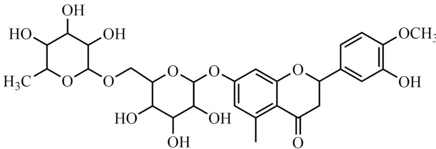

关于橙皮苷的说法正确的是
A. 光照下与氯气反应，苯环上可形成C-Cl键
B. 与足量NaOH水溶液反应，O-H键均可断裂
C. 催化剂存在下与足量氢气反应，π键均可断裂
D. 与NaOH醇溶液反应，多羟基六元环上可形成π键

8. 下列实验操作和现象，得出的相应结论正确的是

<table><tr><td>选项</td><td>实验操作</td><td>现象</td><td>结论</td></tr><tr><td>A</td><td>向盛有 $Fe(OH)_3$ 和 $NiO(OH)$ 的试管中分别滴加浓盐酸</td><td>盛 $NiO(OH)$ 的试管中产生黄绿色气体</td><td>氧化性: $NiO(OH) > Fe(OH)_3$ </td></tr><tr><td>B</td><td>向 $CuSO_{4}$ 溶液中通入 $H_{2}S$ 气体</td><td>出现黑色沉淀(CuS)</td><td>酸性: $H_{2}S < H_{2}SO_{4}$ </td></tr><tr><td>C</td><td>乙醇和浓硫酸共热至170°C,将产生的气体通入溴水中</td><td>溴水褪色</td><td>乙烯发生了加成反应</td></tr><tr><td>D</td><td>向 $Na_{2}HPO_{4}$ 溶液中滴加 $AgNO_{3}$ 溶液</td><td>出现黄色沉淀( $Ag_{3}PO_{4}$ )</td><td> $Na_{2}HPO_{4}$ 发生了水解反应</td></tr><tr><td colspan="4">A. A B. B C. C D. D</td></tr></table>

9. 配合物 $\left[\mathrm{MA}_{2} \mathrm{~L}_{2}\right]$ 的分子结构以及分子在晶胞中的位置如图所示, 下列说法错误的是

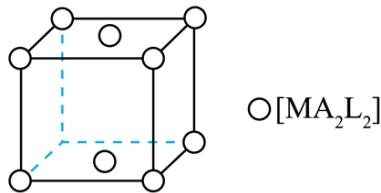

分子结构 $[MA_{2}L_{2}]$ 在晶胞中的位置
A. 中心原子的配位数是4 B. 晶胞中配合物分子的数目为2
C. 晶体中相邻分子间存在范德华力 D. 该晶体属于混合型晶体

10. $\mathrm{NCl}_3$ 和 $\mathrm{SiCl}_4$ 均可发生水解反应，其中 $\mathrm{NCl}_3$ 的水解机理示意图如下：

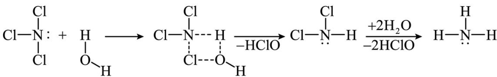

下列说法正确的是
A. $\mathrm{NCl}_3$ 和 $\mathrm{SiCl}_4$ 均为极性分子 B. $\mathrm{NCl}_3$ 和 $\mathrm{NH}_3$ 中的 $\mathrm{N}$ 均为 $\mathrm{sp}^2$ 杂化 C. $\mathrm{NCl}_3$ 和 $\mathrm{SiCl}_4$ 的水解反应机理相同 D. $\mathrm{NHCl}_2$ 和 $\mathrm{NH}_3$ 均能与 $\mathrm{H}_2\mathrm{O}$ 形成氢键

11. $(\mathrm{NH}_{4})_{2}\mathrm{SO}_{4}$ 溶解度随温度变化的曲线如图所示，关于各点对应的溶液，下列说法正确的是

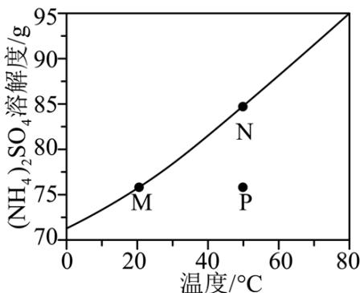

A. M点 $K_{w}$ 等于N点 $K_{w}$ B. M点pH大于N点pH
C. N点降温过程中有2个平衡发生移动
D. P点 $c(H^{+}) + c(NH_{4}^{+}) + c(NH_{3} \cdot H_{2}O) = c(OH^{-}) + 2c(SO_{4}^{2-})$

12. 电化学合成是一种绿色高效的合成方法。如图是在酸性介质中电解合成半胱氨酸和烟酸的示意图。下列叙述错误的是

<table><tr><td>惰性电极a</td><td></td><td>质子交换膜</td><td>3-甲基吡啶烟酸</td><td>惰性电极b</td></tr></table>

A. 电极 a 为阴极
B. $H^{+}$ 从电极 b 移向电极 a

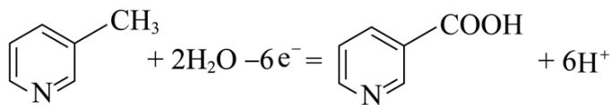

D. 生成3mol半胱氨酸的同时生成1mol烟酸

13. 化合物 $\mathrm{X}_{3} \mathrm{Y}_{7} \mathrm{WR}$ 和 $\mathrm{X}_{3} \mathrm{Z}_{7} \mathrm{WR}$ 所含元素相同, 相对分子质量相差 7, $1 \mathrm{~mol} \mathrm{X}_{3} \mathrm{Y}_{7} \mathrm{WR}$ 含 $40 \mathrm{~mol}$ 质子, X、W 和 R 三种元素位于同周期, X 原子最外层电子数是 R 原子核外电子数的一半。下列说法正确的是
A. 原子半径: W > R
B. 非金属性: X > R
C. Y 和 Z 互为同素异形体
D. 常温常压下 X 和 W 的单质均为固体

14. 逆水煤气变换体系中存在以下两个反应:

反应I: $\mathrm{CO}_{2}(\mathrm{~g}) + \mathrm{H}_{2}(\mathrm{~g}) \rightleftharpoons \mathrm{CO}(\mathrm{g}) + \mathrm{H}_{2}\mathrm{O}(\mathrm{g})$ 反应II: $\mathrm{CO}_{2}(\mathrm{~g}) + 4\mathrm{H}_{2}(\mathrm{~g}) \rightleftharpoons \mathrm{CH}_{4}(\mathrm{~g}) + 2\mathrm{H}_{2}\mathrm{O}(\mathrm{g})$

在恒容条件下，按 $V(\mathrm{CO}_{2}):V(\mathrm{H}_{2})=1:1$ 投料比进行反应，平衡时含碳物质体积分数随温度的变化如图所示。下列说法正确的是

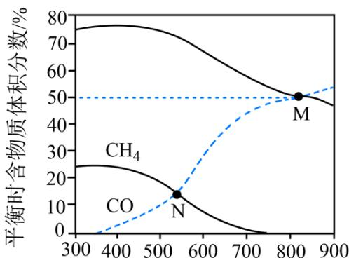  
温度/°C

A. 反应I的 $\Delta \mathrm{H} < 0$ ，反应II的 $\Delta \mathrm{H} > 0$ B. M点反应I的平衡常数 $K < 1$ C. N点 $\mathrm{H}_2\mathrm{O}$ 的压强是 $\mathrm{CH}_4$ 的3倍  
D. 若按 $\mathrm{V}(\mathrm{CO}_2): \mathrm{V}(\mathrm{H}_2) = 1:2$ 投料，则曲线之间交点位置不变

## 二、工业流程题

15. $\mathrm{Fe}_{3} \mathrm{O}_{4}$ 是一种用途广泛的磁性材料, 以 $\mathrm{FeCl}_{2}$ 为原料制备 $\mathrm{Fe}_{3} \mathrm{O}_{4}$ 并获得副产物 $\mathrm{CaCl}_{2}$ 水合物的工艺如下。

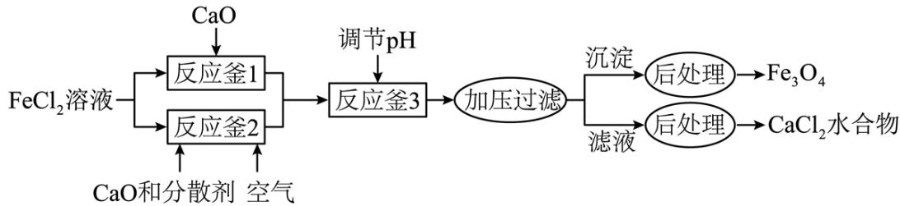

$25^{\circ} \mathrm{C}$ 时各物质溶度积见下表:

<table><tr><td>物质</td><td>F</td><td>F</td><td>C</td></tr><tr><td>溶度积(Ksp)</td><td>4.</td><td>2.</td><td>5.</td></tr></table>

回答下列问题:

(1) $Fe_{3}O_{4}$ 中Fe元素的化合价是+2和\_\_\_\_。 $O^{2-}$ 的核外电子排布式为\_\_\_\_。

(2)反应釜1中的反应需在隔绝空气条件下进行，其原因是\_\_\_\_。

(3)反应釜2中，加入CaO和分散剂的同时通入空气。

①反应的离子方程式为\_\_\_\_。

②为加快反应速率，可采取的措施有\_\_\_\_。(写出两项即可)。

(4)①反应釜3中，25℃时，Ca $^{2+}$ 浓度为5.0mol/L，理论上pH不超过\_\_\_\_。

②称取 $CaCl_{2}$ 水合物1.000g，加水溶解，加入过量 $Na_{2}C_{2}O_{4}$ ，将所得沉淀过滤洗涤后，溶于热的稀硫酸中，用0.1000mol/LKMnO $_{4}$ 标准溶液滴定，消耗24.00mL。滴定达到终点的现象为\_\_\_\_，该副产物中 $CaCl_{2}$ 的质量分数为\_\_\_\_。

## 三、实验题

16. 煤的化学活性是评价煤气化或燃烧性能的一项重要指标，可用与焦炭(由煤样制得)反应的 $\mathrm{CO}_{2}$ 的转化率 $\alpha$ 来表示。研究小组设计测定 $\alpha$ 的实验装置如下：

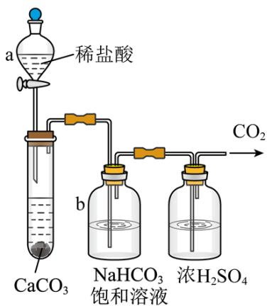  
I

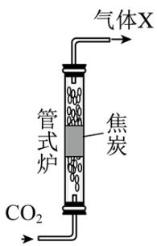  
II

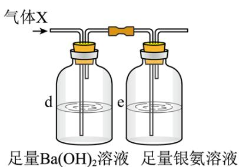  
III

(1)装置I中，仪器a的名称是\_\_\_\_；b中除去的物质是\_\_\_\_(填化学式)。

(2)①将煤样隔绝空气在900°C加热1小时得焦炭，该过程称为\_\_\_\_。

②装置II中，高温下发生反应的化学方程式为\_\_\_\_。

③装置III中，先通入适量的气体 X，再通入足量Ar气。若气体 X 被完全吸收，则可依据d和e中分别生成的固体质量计算 $\alpha$ 。

i.d 中的现象是\_\_\_\_。

ii.e 中生成的固体为Ag，反应的化学方程式为\_\_\_\_。

iii.d 和 e 的连接顺序颠倒后将造成α\_\_\_\_(填“偏大”“偏小”或“不变”)。

iii.在工业上按照国家标准测定α: 将干燥后的CO₂(含杂质N₂的体积分数为n)以一定流量通入装置II反应, 用奥氏气体分析仪测出反应后某时段气体中CO₂的体积分数为m, 此时α的表达式为\_\_\_\_。

## 四、原理综合题

17. 银及其化合物在催化与电化学等领域中具有重要应用。

(1)在银催化下，乙烯与氧气反应生成环氧乙烷(EO)和乙醛(AA)。根据图所示，回答下列问题：

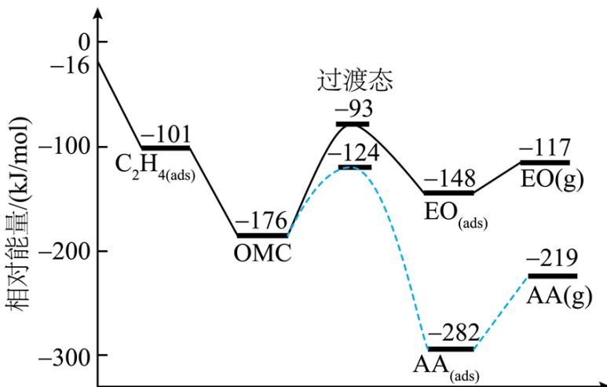  
反应过程

①中间体OMC生成吸附态 $EO_{(ads)}$ 的活化能为\_\_\_\_kJ/mol。

②由EO(g)生成AA(g)的热化学方程式为\_\_\_\_。

(2)一定条件下，银催化剂表面上存在反应： $\mathrm{Ag}_{2}\mathrm{O}(s)\rightleftharpoons2\mathrm{Ag}(s)+\frac{1}{2}\mathrm{O}_{2}(g)$ ，该反应平衡压强 $p_{c}$ 与温度T的关系如下：

<table><tr><td>T</td><td>401</td><td>443</td><td>463</td></tr><tr><td> $p_{t}$ </td><td>10</td><td>51</td><td>100</td></tr></table>

①463K时的平衡常数 $K_{p}=$ \_\_\_\_ (kPa) $^{\frac{1}{2}}$ 。

②起始状态I中有 $Ag_{2}O$ 、Ag和 $O_{2}$ ，经下列过程达到各平衡状态：

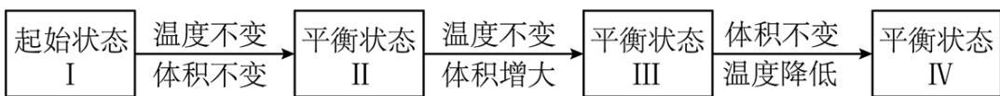

已知状态I和III的固体质量相等，下列叙述正确的是\_\_\_\_(填字母)。

A. 从I到II的过程 $\Delta S > 0$

B. $p_{c}(\Pi) > p_{c}(\mathbb{I})$

C. 平衡常数: $\mathrm{K}\left(\Pi\right) > \mathrm{K}\left(\mathbb{N}\right)$

D. 若体积 $V(\mathbb{III}) = 2V(I)$ ，则 $Q(I) = \sqrt{2}K(\mathbb{III})$

E. 逆反应的速率： $v(I) > v(II) = v(III) > v(IV)$

③某温度下，向恒容容器中加入 $Ag_{2}O$ ，分解过程中反应速率 $v(O_{2})$ 与压强p的关系为 $v(O_{2})=k\left(1-\frac{p}{p_{c}}\right)$ ，k为速率常数(定温下为常数)。当固体质量减少4%时，逆反应速率最大。若转化率为14.5%，则 $v(O_{2})=$ \_\_\_\_（用k表示）。

(3) $\alpha -\mathrm{AgI}$ 可用作固体离子导体，能通过加热 $\gamma -\mathrm{AgI}$ 制得。上述两种晶体的晶胞示意图如图所示(为了简化，只画出了碘离子在晶胞中的位置)。

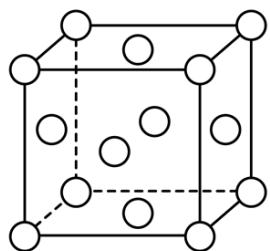

$\gamma -\mathrm{AgI}$ 晶胞

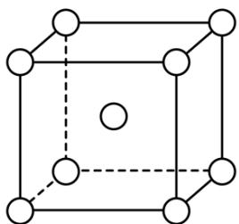

$$
\rho = 7. 0 \mathrm{g} / \mathrm{cm} ^ {3}
$$

$$
\rho = 6. 0 \mathrm{g} / \mathrm{cm} ^ {3}
$$

(1)测定晶体结构最常用的仪器是\_\_\_\_(填字母)。
A. 质谱仪 
B. 红外光谱仪 
C. 核磁共振仪 
D. X射线衍射仪

②γ-AgI与α-AgI晶胞的体积之比为\_\_\_\_。

③测定α-AgI中导电离子类型的实验装置如图所示。实验测得支管a中AgI质量不变，可判定导电离子是 $\mathrm{Ag^{+}}$ 而不是 $\mathrm{I^{-}}$ ，依据是\_\_\_\_。

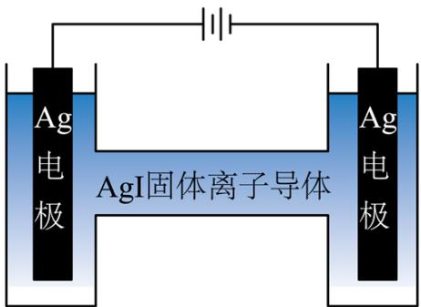  
支管a  
支管b

## 五、有机推断题

18. 有机物 K 作为一种高性能发光材料，广泛用于有机电致发光器件(OLED)。K 的一种合成路线如下所示，部分试剂及反应条件省略。

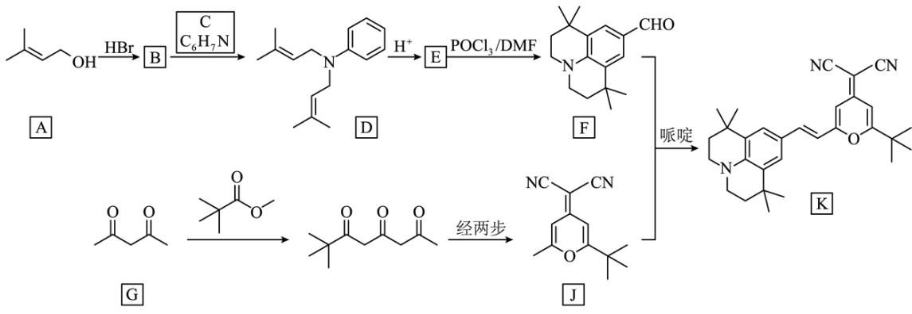

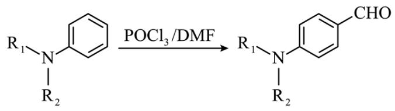

$$
\mathrm{R} _ {2}
$$

(1)A 中所含官能团名称为羟基和\_\_\_\_。

(2)B 的结构简式为\_\_\_\_。

(3)C 的化学名称为\_\_\_\_，生成 D 的反应类型为\_\_\_\_。

(4)E 的结构简式为\_\_\_\_。

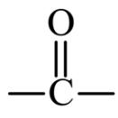

(5)G 的同分异构体中，含有两个 $\ce{O-C-}$ 的化合物有 \_\_\_\_ 个(不考虑立体异构体)，其中核磁共振氢谱有两组峰，且峰面积比为1:3的化合物为 L，L 与足量新制的 $\mathrm{Cu(OH)_2}$ 反应的化学方程式为 \_\_\_\_。

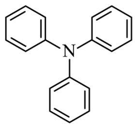

(6)以J和N( )为原料, 利用上述合成路线中的相关试剂, 合成另一种用于 OLED 的发光材料M(分子式为 $\mathrm{C_{46}H_3N_5O_2}$ )。制备M的合成路线为\_\_\_\_(路线中原料和目标化合物用相应的字母 J、N 和 M 表示)。

## 参考答案:

【详解】A. 重组蛋白为有机物，A 不符合题意；  
B. 合金、纯金属均为金属材料，铜为金属材料，B 符合题意；  
C. 氮化镓半导体为新型无机非金属材料，C 不符合题意；  
D. 聚氨酯树脂为有机合成材料，D 不符合题意；

故选 B。

2. B

【详解】A. 二氧化氮和水生成硝酸和 NO，反应为 $3\mathrm{NO}_2 + \mathrm{H}_2\mathrm{O} = 2\mathrm{H}^+ + 2\mathrm{NO}_3^- + \mathrm{NO}$ ，A 正确；  
B. 石灰乳转化氢氧化钙不能拆，反应为 $\mathrm{Cl}_2 + \mathrm{Ca(OH)}_2 = \mathrm{Ca}^{2+} + \mathrm{ClO}^- + \mathrm{Cl}^- + \mathrm{H}_2\mathrm{O}$ ，B 错误；  
C. Al放入NaOH溶液中生成偏铝酸钠和去： $2\mathrm{Al} + 2\mathrm{OH}^- + 2\mathrm{H}_2\mathrm{O} = 2\mathrm{AlO}_2^- + 3\mathrm{H}_2\uparrow$ ，C 正确；  
D. Pb放入 $\mathrm{Fe}_2(\mathrm{SO}_4)_3$ 溶液中发生氧化还原生成二价铅和二价铁离子，反应为： $\mathrm{Pb} + \mathrm{SO}_4^{2-} + 2\mathrm{Fe}^{3+} = 2\mathrm{Fe}^{2+} + \mathrm{PbSO}_4$ ，D 正确；

3. C
【详解】A. 镁在空气中燃烧也会部分和氮气反应生成氮化镁，A 错误；
B. $SO_{2}$ 与 $H_{2}O$ 发生化合反应生成亚硫酸，而和 $H_{2}S$ 会发生氧化还原生成硫单质，反应的类型不相同，B 错误；
C. $Na_{2}O_{2}$ 分别与 $H_{2}O$ 和 $CO_{2}$ 反应，生成的气体均为氧气，C 正确；
D. 浓 $H_{2}SO_{4}$ 与Cu生成二氧化硫气体，而和C反应生成二氧化碳和二氧化硫，生成的酸性气体不相同，D 错误；
故选 C。

【详解】A．反应 $2F_{2}+2NaOH=OF_{2}+2NaF+H_{2}O$ 中 F 的化合价由 0 价转化为 -1 价，O 的化合价由 -2 价变为 +2 价，转移电子数为 $4e^{-}$ ，若消耗 $44.8L$ （标准状况） $F_{2}$ 即 $\frac{44.8L}{22.4L\cdot mol^{-1}}=2mol$ ，故转移的电子数为 $4N_{A}$ ，A 正确；
B．根据反应 $2F_{2}+2NaOH=OF_{2}+2NaF+H_{2}O$ ，每消耗 $2molF_{2}$ 生成的NaF质量为2mol $\times42g\cdot mol^{-1}=84g$ ，B正确；
C．根据反应 $2F_{2}+2NaOH=OF_{2}+2NaF+H_{2}O$ 可知反应生成的氧化产物为 $OF_{2}$ ，每消耗

$$
2 \mathrm{mol} \mathrm{F} _ {2}
$$

$$
\mathrm{OF} _ {2}
$$

$$
\mathrm{N} _ {\mathrm{A}}
$$

D. 根据反应 $2 \mathrm{~F}_{2} + 2 \mathrm{NaOH} = 0 \mathrm{~F}_{2} + 2 \mathrm{NaF} + \mathrm{H}_{2} \mathrm{O}$ 可知, 每消耗 $2 \mathrm{~mol} \mathrm{~F}_{2}$ 生成 $\mathrm{H}_{2} \mathrm{O}$ 的物质的量为 $2 \mathrm{~mol}$ , 又知 1 个 $\mathrm{H}_{2} \mathrm{O}$ 中含有 2 对孤电子对, 即生成的 $\mathrm{H}_{2} \mathrm{O}$ 含有孤电子对数为 $2 \mathrm{~N}_{\mathrm{A}}$ , D 正确; 故答案为 C。

5. B

【详解】A. 氯化铵受热分解为氨气和氯化氢，两者遇冷又会生成氯化铵，不适合制取氨气，A 不符合题意；

B. 转移溶液时玻璃棒应该伸入容量瓶刻度线以下，正确，B 符合题意；

C. 保护铁件应该连接比铁更活泼的金属使得铁被保护，而不是连接惰性电极石墨，C 不符合题意；

D. NO 会与空气中氧气反应，不适合排空气法收集，D 不符合题意；

故选 B。

6. A
【详解】A. 钇原子序数比Fe大13，为39号元素，为元素周期表的第五周期第IIIB族，A正确；
B. 钙为20号元素，原子核外电子排布为 $1s^{2}2s^{2}2p^{6}3s^{2}3p^{6}4s^{2}$ ，基态Ca原子的核外电子填充在10个轨道中，B错误；
C. 同一主族随原子序数变大，原子半径变大，第一电离能变小；同一周期随着原子序数变大，第一电离能变大，5种元素中，钙第一电离能比铁小，C错误；
D. 同周期从左到右，金属性减弱，非金属性变强，元素的电负性变强；同主族由上而下，金属性增强，非金属性逐渐减弱，元素电负性减弱；5种元素中，电负性最大的是O，D错误；
故选 A。

7. C
【详解】A．光照下烃基氢可以与氯气反应，但是氯气不会取代苯环上的氢，A 错误；
B．分子中除苯环上羟基，其他羟基不与氢氧化钠反应，B 错误；
C．催化剂存在下与足量氢气反应，苯环加成为饱和碳环，羰基氧加成为羟基，故π键均可断裂，C 正确；
D．橙皮苷不与NaOH醇溶液反应，故多羟基六元环不可形成π键，D 错误；
故选 C。

8. A

【详解】A. 氧化剂氧化性大于氧化产物, 盛NiO(OH)的试管中产生黄绿色气体, 说明NiO(OH)将氯离子氧化为氯气, 而氢氧化铁不行, 故氧化性: NiO(OH) > Fe(OH) $_{3}$ , A 正确; B. 出现黑色沉淀(CuS), 是因为硫化铜的溶解度较小, 不能说明酸性H $_{2}$ S < H $_{2}$ SO $_{4}$ , B 错误; C. 挥发的乙醇也会被强氧化剂溴单质氧化使得溴水褪色, 不能说明乙烯发生了加成反应, C 错误; D. 出现黄色沉淀(Ag $_{3}$ PO $_{4}$ ), 说明Na $_{2}$ HPO $_{4}$ 电离出了磷酸根离子, D 错误; 故选 A。

9. D

【详解】A．由题干配合物 $[MA_{2}L_{2}]$ 的分子结构示意图可知，中心原子M周围形成了4个配位键，故中心原子M的配位数是4，A正确；
B．由题干图示晶胞结构可知，晶胞中配合物分子的数目为 $8\times\frac{1}{8}+2\times\frac{1}{2}=2$ ，B正确；
C．由题干信息可知，该晶体为由分子组成的分子晶体，故晶体中相邻分子间存在范德华力，
C 正确；
D．由题干信息可知，该晶体为由分子组成的分子晶体，D 错误；
故答案为：D。

10. D

【详解】A. $NCl_{3}$ 中中心原子N周围的价层电子对数为： $3+\frac{1}{2}(5-3\times1)=4$ ，故空间构型为三角锥形，其分子中正、负电荷中心不重合，为极性分子，而 $SiCl_{4}$ 中中心原子周围的价层电子对数为： $4+\frac{1}{2}(4-4\times1)=4$ ，是正四面体形结构，为非极性分子，A错误；
B. $NCl_{3}$ 和 $NH_{3}$ 中中心原子N周围的价层电子对数均为： $3+\frac{1}{2}(5-3\times1)=4$ ，故二者N均为 $sp^{3}$ 杂化，B错误；
C. 由题干 $NCl_{3}$ 反应历程图可知， $NCl_{3}$ 水解时首先 $H_{2}O$ 中的 H 原子与 $NCl_{3}$ 上的孤电子对结合，O与Cl结合形成HClO，而 $SiCl_{4}$ 上无孤电子对，故 $SiCl_{4}$ 的水解反应机理与之不相同，C错误；
D. $NHCl_{2}$ 和 $NH_{3}$ 分子中均存在N-H键和孤电子对，故均能与 $H_{2}O$ 形成氢键，D正确；故答案为：D。

11. B

【详解】A．温度升高，水的电离程度增大，则M点 $K_{w}$ 小于N点 $K_{w}$ ，A错误；
B．升高温度促进铵根离子的电离，且N点铵根离子浓度更大，水解生成氢离子浓度更大，
N点酸性更强，故M点pH大于N点pH，B正确；
C．N点降温过程中有水的电离平衡、铵根离子的水解平衡、硫酸铵的溶解平衡3个平衡发生移动，C错误；
D．P点为硫酸铵的不饱和溶液，由电荷守恒可知， $c(H^{+}) + c(NH_{4}^{+}) = c(OH^{-}) + 2c(SO_{4}^{2-})$ ，
D 错误；
故选 B。
12. D

【分析】该装置是电解池，电极 b 上 3-甲基吡啶转化为烟酸过程中‘加氧少氢’，发生氧化反

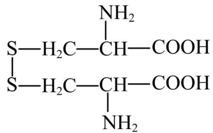

应, 则 b 为阳极, a 为阴极, 阴极电极反应式为

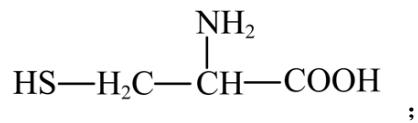

【详解】A. a 极上硫元素化合价升高，a 为阴极，A 正确；

C. 电极 b 上 3-甲基吡啶转化为烟酸过程中发生氧化反应，在酸性介质中电极反应式为：

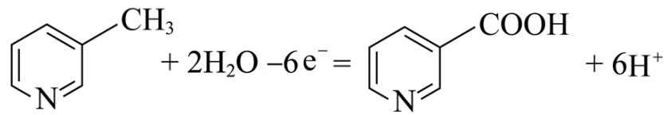

，C 正确；

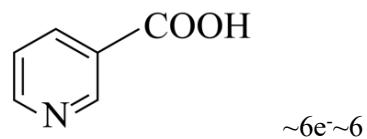

，因此生成 6mol 半胱氨酸的同时生成 1mol 烟酸，

D 错误;

故选：D。

13. A

【分析】化合物 $X_{3}Y_{7}WR$ 和 $X_{3}Z_{7}WR$ 所含元素相同，相对分子质量相差 7，说明 Y、Z 为氢元素的两种核素，由题干信息可知，1mol $X_{3}Y_{7}WR$ 含 40mol 质子，X、W 和 R 三种元素位于同周期，X 原子最外层电子数是 R 原子核外电子数的一半，则 X、W、R 的内层电子数为 2，设 X 的最外层电子数为 a，则 R 的核外电子数为 2a，W 的核外电子数为 b，Y 的质子数为 1，则有： $3(a+2)+2a+b+7=40(a、b$ 均为整数）， $5a+b=27$ ，解得 a=5，b=2(X、R 不在同周期，舍去)；a=4，b=7；a=3，b=12(X、R 不在同周期，舍去)；则 X 为 C，R 为 O，W 为 N。

【详解】A．同周期从左到右原子半径逐渐减小，则原子半径：W>R，故 A 正确；

B．同周期从左到右非金属性逐渐增强，则非金属性：R>X，故 B 错误；

C．Y 和 Z 是氢的两种核素，两者互为同位素，故 C 错误；

D．常温常压下 X 的单质为固体，W 的单质是气体，故 D 错误。

综上所述，答案为 A。

14. C

【详解】A．随着温度的升高，甲烷含量减小、一氧化碳含量增大，则说明随着温度升高，反应II逆向移动、反应I正向移动，则反应II为放热反应焓变小于零、反应I为吸热反应焓变大于零，A错误；  
B．M点没有甲烷产物，且二氧化碳、一氧化碳含量相等，投料 $V(\mathrm{CO}_{2}):V(\mathrm{H}_{2})=1:1$ ，则此时反应I平衡时二氧化碳、氢气、一氧化碳、水的物质的量相等，反应I的平衡常数 $K=\frac{c(\mathrm{H}_{2}\mathrm{O})c(\mathrm{CO})}{c(\mathrm{CO}_{2})c(\mathrm{H}_{2})}=1$ ，B错误；  
C．N点一氧化碳、甲烷物质的量相等，结合反应方程式的系数可知，生成水的总的物质的量为甲烷的3倍，结合阿伏伽德罗定律可知， $H_{2}O$ 的压强是 $CH_{4}$ 的3倍，C正确；  
D．反应I为气体分子数不变的反应、反应II为气体分子数减小的反应；若按 $V(\mathrm{CO}_{2}):V(\mathrm{H}_{2})=1:2$ 投料，相当于增加氢气的投料，会使得甲烷含量增大，导致甲烷、一氧化碳曲线之间交点位置发生改变，D错误；  
故选C。  
15. (1) +3 $1s^{2}2s^{2}2p^{6}$

(2)防止二价铁被空气中氧气氧化为三价铁
(3) $4CaO + 6H_{2}O + 4Fe^{2+} + O_{2} = 4Fe(OH)_{3} + 4Ca^{2+}$ 适当升高温度、搅拌(4) 11 最后半滴标准液加入后，溶液变为红色，且半分钟内不变色 $66.6\%$

【分析】 $\mathrm{FeCl}_{2}$ 溶液加入氧化钙生成氢氧化亚铁， $\mathrm{FeCl}_{2}$ 溶液加入氧化钙和空气生成氢氧化铁，反应釜1、2中物质混合后调节 $\mathrm{pH}$ ，加压过滤分离出沉淀处理得到四氧化三铁，滤液处理得到氯化钙水合物；

【详解】(1) $Fe_{3}O_{4}$ 可以写成 $FeO\cdot Fe_{2}O_{3}$ ，故Fe元素的化合价是+2和+3。 $O^{2-}$ 为氧原子得到2个电子形成的，核外电子排布式为 $1s^{2}2s^{2}2p^{6}$ ;

（2）空气中氧气具有氧化性，反应釜1中的反应需在隔绝空气条件下进行，其原因是防止二价铁被空气中氧气氧化为三价铁；

(3) ①反应釜2中, 加入CaO和分散剂的同时通入空气, 氧气将二价铁氧化三价铁, 三价铁与氧化钙和水生成的氢氧化钙生成氢氧化铁, 反应的离子方程式为

$$
4 \mathrm{CaO} + 6 \mathrm{H} _ {2} \mathrm{O} + 4 \mathrm{Fe} ^ {2 +} + \mathrm{O} _ {2} = 4 \mathrm{Fe(OH)} _ {3} + 4 \mathrm{Ca} ^ {2 +} 。
$$

②为加快反应速率，可采取的措施有适当升高温度、搅拌等；

(4) ①反应釜3中, $25^{\circ} \mathrm{C}$ 时, $\mathrm{Ca}^{2+}$ 浓度为 $5.0 \mathrm{~mol} / \mathrm{L}$ , 反应不能使钙离子生成沉淀, 防止引入杂质, 故此时 $\mathrm{c(OH^{-})} = \sqrt{\frac{\mathrm{K}_{\mathrm{sp}}}{\mathrm{c(Ca}^{2+})}} = \sqrt{\frac{5.0 \times 10^{-6}}{5.0}} = 1.0 \times 10^{-3} \mathrm{~mol} / \mathrm{L}, \mathrm{pOH} = 3, \mathrm{pH} = 11$ , 故理论上 $\mathrm{pH}$ 不超过11。

②高锰酸钾溶液紫红色，故滴定达到终点的现象为：最后半滴标准液加入后，溶液变为红色，且半分钟内不变色；

氯化钙和草酸钠转化为草酸钙沉淀 $CaC_{2}O_{4}$ ，草酸钙沉淀加入硫酸转化为草酸，草酸和高锰酸钾发生氧化还原反应： $2MnO_{4}^{-}+5H_{2}C_{2}O_{4}+6H^{+}=10CO_{2}\uparrow+2Mn^{2+}+8H_{2}O$ ，结合质量守恒可知， $5CaCl_{2}\sim5H_{2}C_{2}O_{4}\sim2MnO_{4}^{-}$ ，则该副产物中 $CaCl_{2}$ 的质量分数为

$$
\frac {0 . 1 0 0 0 \times 2 4 \times 1 0 ^ {- 3} \mathrm{mol} \times \frac {5}{2} \times 1 1 1 \mathrm{g/mol}}{1 . 0 0 0 \mathrm{g}} \times 1 0 0 \% = 6 6. 6 \% 。
$$

16. (1) 分液漏斗 HCl

(2) 干馏 $CO_{2}+C$ 高温 2CO 有白色沉淀生成

$$
\mathrm{CO} + 2 \left[ \mathrm{Ag} \left(\mathrm{NH} _ {3}\right) _ {2} \right] \mathrm{OH} = 2 \mathrm{Ag} \downarrow + \left(\mathrm{NH} _ {4}\right) _ {2} \mathrm{CO} _ {3} + 2 \mathrm{NH} _ {3} \quad \text {偏大} \quad \frac {1 - n - m}{(1 + m) (1 - n)} \times 100 \%
$$

【分析】稀盐酸与碳酸钙反应生成二氧化碳、氯化钙和水，由于盐酸易挥发，二氧化碳中含有氯化氢杂质，用饱和碳酸氢钠溶液吸收氯化氢，再用浓硫酸干燥气体，二氧化碳通到灼热的焦炭中反应生成一氧化碳，将混合气体通入足量氢氧化钡溶液中吸收二氧化碳，一氧化碳

与银氨溶液反应生成银单质。

【详解】（1）装置I中，仪器a的名称是分液漏斗；由于二氧化碳中含有挥发的氯化氢气体，因此b中碳酸氢钠与氯化氢反应，则除去的物质是HCl；故答案为：分液漏斗；HCl。

(2) ①将煤样隔绝空气在 $900^{\circ} \mathrm{C}$ 加热 1 小时得焦炭, 即隔绝空气加强热使之分解, 则该过程称为干馏; 故答案为: 干馏。

②装置II中，高温下二氧化碳和焦炭反应生成一氧化碳，其发生反应的化学方程式为 $CO_{2}+C$ 高温2CO；故答案为： $CO_{2}+C$ 高温2CO。

③i.d 中二氧化碳和氢氧化钡反应生成碳酸钡沉淀和水，其反应的现象是有白色沉淀生成；故答案为：有白色沉淀生成。

ii.e 中生成的固体为Ag，根据氧化还原反应分析得到 CO 变为碳酸铵，则反应的化学方程式为 $\mathrm{CO} + 2[\mathrm{Ag}(\mathrm{NH}_{3})_{2}]\mathrm{OH} = 2\mathrm{Ag}\downarrow + (\mathrm{NH}_{4})_{2}\mathrm{CO}_{3} + 2\mathrm{NH}_{3}$ ; 故答案为: $\mathrm{CO} + 2[\mathrm{Ag}(\mathrm{NH}_{3})_{2}]\mathrm{OH} = 2\mathrm{Ag}\downarrow + (\mathrm{NH}_{4})_{2}\mathrm{CO}_{3} + 2\mathrm{NH}_{3}$ 。

iii.d 和 e 的连接顺序颠倒，二氧化碳和银氨溶液反应，导致银氨溶液消耗，二氧化碳与氢氧化钡反应的量减少，则将造成 $\alpha$ 偏大；故答案为：偏大。

iii.在工业上按照国家标准测定α: 将干燥后的CO₂(含杂质N₂的体积分数为n)以一定流量通入装置II反应, 用奥氏气体分析仪测出反应后某时段气体中CO₂的体积分数为m, 设此时气体物质的量为bmol, 二氧化碳物质的量为bmmol, 原来气体物质的量为amol, 原来二氧化碳物质的量为a(1-n)mol, 氮气物质的量为anmol, 则消耗二氧化碳物质的量为[a(1-n)-bm]mol, 生成CO物质的量为2[a(1-n)-bm]mol, 则有b=an+bm+2[a(1-n)-bm], 解得: b= $\frac{a(2-n)}{1+m}$ , 此时α的表达式为

$\frac{[a(1-n)-\frac{a(2-n)}{1+m}m]mol}{a(1-n)mol}\times 100\%=\frac{1-n+m-mn-2m+nm}{(1+m)(1-n)}\times 100\%=\frac{1-n-m}{(1+m)(1-n)}\times 100\%$ ；故答案为： $\frac{1-n-m}{(1+m)(1-n)}\times 100\%$ 。

17. (1) 83 EO(g) $\rightleftharpoons$ AA(g) $\Delta H=-102kJ/mol$ (2) 10 CDE $\frac{3k}{4}$ (3) D 12:7 a 中银电极质量减小，b 中银电极质量增大

【详解】（1）①过渡态物质的总能量与反应物总能量的差值为活化能，中间体OMC生成吸附态 $EO_{(ads)}$ 的活化能为 $(-93\mathrm{kJ/mol})-(-176\mathrm{kJ/mol})=83\mathrm{kJ/mol}$ 。

②由图可知，EO(g)生成AA(g)放出热量(-117kJ/mol)-(-219kJ/mol)=102kJ/mol，放热焓变为负值，故热化学方程式为EO(g)⇌AA(g) $\Delta H=-102kJ/mol$ ;

(2) ①反应中只有氧气为气体, 结合表格数据可知, $463 \mathrm{~K}$ 时的平衡常数 $\mathrm{K}_{\mathrm{p}} = \mathrm{p}^{\frac{1}{2}} (\mathrm{O}_{2}) = 10$ $(\mathrm{kPa})^{\frac{1}{2}}$ 。

②结合表格数据可知，升高温度，压强变大，平衡正向移动，则反应为吸热反应；

A. 从II到III为体积增大，反应正向移动的过程，导致固体质量减小，已知状态I和III的固体质量相等，则从I到II的过程为固体质量增大的过程，平衡逆向移动，为熵减过程，故从I到II的过程 $\Delta S < 0$ ，A错误；

B. 平衡常数 $K_{p}=p^{\frac{1}{2}}(O_{2})$ 只受温度的影响，则 $p_{c}(\Pi)=p_{c}(\mathbb{I})$ ，B错误；

C. 反应为吸热反应, 降低温度, 平衡逆向移动, 平衡常数减小, 故平衡常数:

$K(\Pi) > K(\mathbb{N})$ ，C 正确；

D. 已知状态I和III的固体质量相等，则氧气的物质的量相等，若体积 $V(\text{III}) = 2V(\text{I})$ ，根据阿伏伽德罗定律可知， $p(O_2, I) = 2p(O_2, \text{III})$ ， $Q(I) = p^{\frac{1}{2}}(O_2, I)$ ， $K(\text{III}) = p^{\frac{1}{2}}(O_2, \text{III})$ ，则 $Q(I) = \sqrt{2}K(\text{III})$ ，D正确；

E. 结合 A 分析可知，逆反应的速率： $v(I) > v(II)$ ；固体不影响反应速率，温度越低反应速率越低，逆反应的速率： $v(II) = v(III) > v(IV)$ ，故有逆反应的速率：

$\mathrm{v(I) > v(II) = v(III) > v(IV), E正确;}$

故选 CDE;

③某温度下，设向恒容容器中加入 $mgAg_{2}O$ ，当固体质量减少4%时，逆反应速率最大，此时达到平衡状态，减小质量为生成氧气的质量，则生成 $\frac{m\times4\%}{32}mol\ O_{2}$ ，若转化率为14.5%，则此时生成 $\frac{1}{2}\times\frac{m\times14.5\%}{232}mol\ O_{2}$ ，根据阿伏伽德罗定律，此时 $\frac{p}{p_{c}}=\frac{\frac{1}{2}\times\frac{m\times14.5\%}{232}}{\frac{m\times4\%}{32}}=\frac{1}{4}$ ，故 $v(O_{2})=\frac{3k}{4}$ ;

(3) ①晶体与非晶体的最可靠的科学方法是 X 射线衍射法; 故测定晶体结构最常用的仪器是 D. X 射线衍射仪;

②据“均摊法”， $\gamma-\mathrm{AgI}$ 晶胞中含 $8 \times \frac{1}{8} + 6 \times \frac{1}{2} = 4$ 个 I，则晶体密度为$\frac{\frac{4M}{N_A}}{V(\gamma - AgI)} g \cdot cm^{-3} = 7.0g \cdot cm^{-3}$ ;， $\alpha - AgI$ 晶胞中含 $8 \times \frac{1}{8} + 1 = 2$ 个 $I$ ，则晶体密度为 $\frac{\frac{2M}{N_A}}{V(\alpha - AgI)} g \cdot cm^{-3} = 6.0g \cdot cm^{-3}$ ; 故 $\frac{\frac{4M}{N_A}}{\frac{2M}{V(\gamma - AgI)}} = \frac{7}{6}$ ，则 $\gamma - AgI$ 与 $\alpha - AgI$ 晶胞的体积之比为 12:7。

③由图可知，a 为阳极、b 为阴极，实验测得支管 a 中 AgI 质量不变，则碘离子没有迁移到 a 中与银离子产生 AgI 沉淀，银离子在阴极得到电子发生还原反应生成银单质，导致 b 中银电极质量增大，a 中银电极银单质失去电子发生氧化反应生成银离子，导致 a 中银电极质量质量减小，可判定导电离子是 $Ag^{+}$ 而不是 $I^{-}$ 。

18. (1)碳碳双键

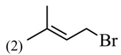

(3) 苯胺 取代反应

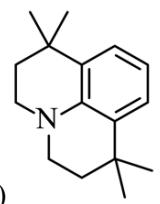

(5) 10 $\mathrm{C(CH_3)_2(CHO)_2 + 4Cu(OH)_2 + 2NaOH\xrightarrow{\Delta} C(CH_3)_2(COONa)_2 + 2Cu_2O + 6H_2O}$

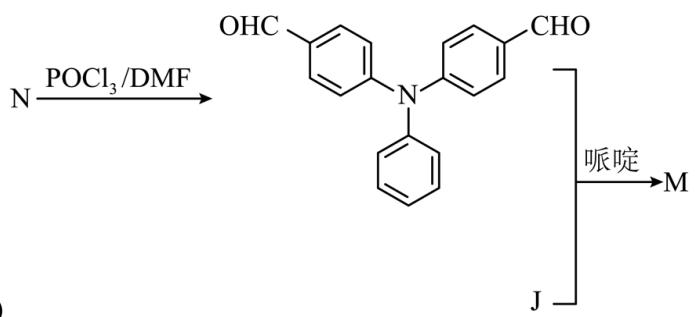

(6)

【分析】A 和 HBr 发生取代反应生成 B，B 是 $\ce{CH=CH-CHBr}$ ；B 和 C 生成 D，根据 B 的

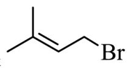

结构简式和 C 的分子式，由 D 逆推可知 C 是 $H_{2}N$ ；根据题目信息，由 F 逆推

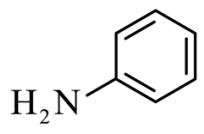

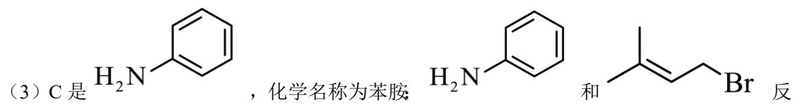

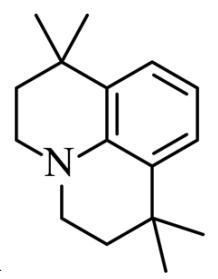

可知E是

【详解】（1）根据 A 的结构简式，可知 A 中所含官能团名称为羟基和碳碳双键；

(2) A 和 HBr 发生取代反应生成 B, B 是 $\ce{CH=CH-CHBr}$ ;

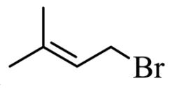

应生成 D 和 HBr，生成 D 的反应类型为取代反应；

（4）根据题目信息，由 F 逆推可知 E 是

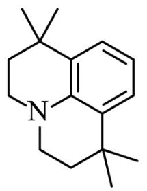

(5) G 的同分异构体中, 含有两个 $-\mathrm{C}-$ 的化合物有

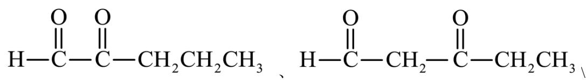

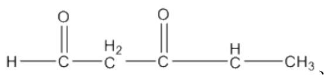

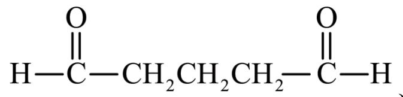

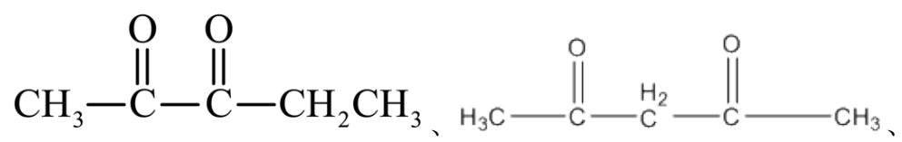

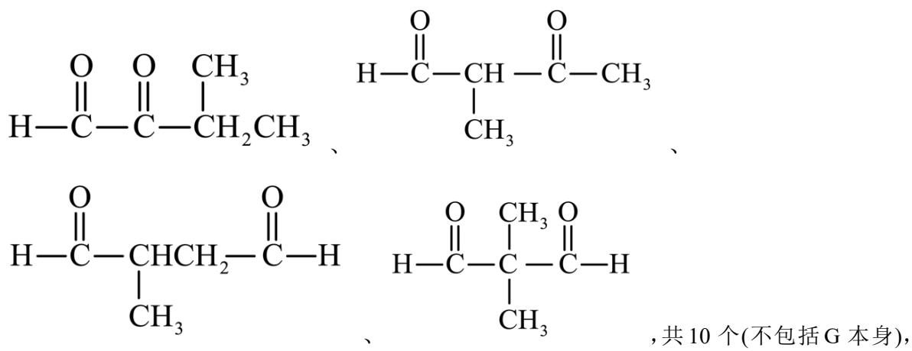

,共10个(不包括G本身),

其中核磁共振氢谱有两组峰，且峰面积比为1:3的化合物为L，L是

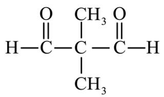

，L 与足量新制的 $\mathrm{Cu(OH)}_2$ 反应的化学方程式为

$$
\mathrm{C} \left(\mathrm{CH} _ {3}\right) _ {2} (\mathrm{CHO}) _ {2} + 4 \mathrm{Cu} (\mathrm{OH}) _ {2} + 2 \mathrm{NaOH} \xrightarrow {\Delta} \mathrm{C} \left(\mathrm{CH} _ {3}\right) _ {2} (\mathrm{COONa}) _ {2} + 2 \mathrm{Cu} _ {2} \mathrm{O} + 6 \mathrm{H} _ {2} \mathrm{O} 。
$$

(6) M 分子中含有 5 个 N 和 2 个 O，可知 2 分子 J 和 1 分子 N 反应生成 M，合成路线为

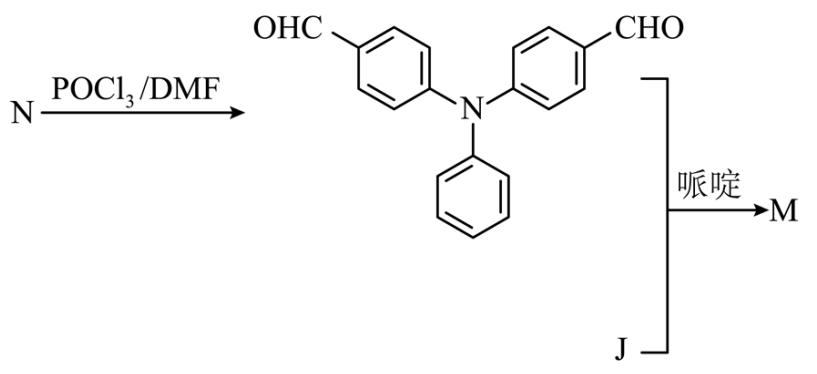