# 2024年上海市普通高中学业水平等级性考试化学试卷

(考试时间 60 分钟，满分 100 分)

注意：试卷为回忆版。试题来自网络，非官方渠道，学科网不对真实性负责，请自行鉴别。

## 一、氟及其化合物

氟元素及其化合物具有广泛用途。

1. 下列关于氟元素的性质说法正确的是
A. 原子半径最小
B. 原子第一电离能最大
C. 元素的电负性最强
D. 最高正化合价为+7

【解析】

【详解】A．同一周期主族元素从左至右，原子序数递增、原子半径递减，氟原子在本周期主族元素中半径最小，但氢原子半径小于氟原子半径，故 A 错误；
B．同一周期主族元素从左至右，第一电离能有增大的趋势，氟原子在本周期主族元素中第一电离能最大，但氦原子的第一电离能大于氟原子，故 B 错误；
C．据同一周期主族元素从左至右电负性增强、同一主族从上至下电负性减弱可知，氟元素的电负性最强，故 C 正确；
D．氟元素无正化合价，故 D 错误；
故答案为：C。

2. 下列关于 $^{18}$ F 与 $^{19}$ F 说法正确的是
A. 是同种核素    B. 是同素异形体
C. $^{19}$ F 比 $^{18}$ F 多一个电子    D. $^{19}$ F 比 $^{18}$ F 多一个中子

【详解】A. $^{18}\mathrm{F}$ 与 $^{19}\mathrm{F}$ 质子数相同、中子数不同，因此两者是不同种核素，A 错误；
B．同素异形体指的是同种元素的不同单质； $^{18}\mathrm{F}$ 与 $^{19}\mathrm{F}$ 是两种不同的原子，不是单质，因此两者不是同素异形体，B 错误；
C．同位素之间质子数和电子数均相同， $^{19}\mathrm{F}$ 比 $^{18}\mathrm{F}$ 多一个中子，C 错误；
D. $^{19}\mathrm{F}$ 的中子数是 10, $^{18}\mathrm{F}$ 只有 9 个中子, $^{19}\mathrm{F}$ 比 $^{18}\mathrm{F}$ 多一个中子，D 正确。
本题选 D。

3. 萤石( $\mathrm{CaF}_{2}$ )与浓硫酸共热可制备 HF 气体, 写出该反应的化学方程式: \_\_\_\_, 该反应中体现浓硫酸的性质是\_\_\_\_。
A. 强氧化性    B. 难挥发性    C. 吸水性    D. 脱水性

【答案】①. $CaF_{2} + H_{2}SO_{4}$ （浓） $= CaSO_{4} + 2HF\uparrow$ ②.BC

【解析】

【详解】萤石 $\left(\mathrm{CaF}_{2}\right)$ 与浓硫酸共热可发生复分解反应，生成硫酸钙和HF气体，该反应的化学方程式为 $CaF_{2}+H_{2}SO_{4}\left(\text{浓}\right)=CaSO_{4}+2HF\uparrow$ ，该反应为难挥发性酸制取易挥发性酸，且浓硫酸具有吸水性，可减少HF气体在水中的溶解，故该反应中体现浓硫酸的性质是难挥发性和吸水性，故选BC。

4. 液态氟化氢(HF)的电离方式为: $3 \mathrm{HF} \rightleftharpoons \mathrm{X} + \mathrm{HF}_{2}$ , 其中 $\mathrm{X}$ 为\_\_\_\_。 $\mathrm{HF}_{2}$ 的结构为 $\mathrm{F}-\mathrm{H} \cdots \mathrm{F}^{-}$ , 其中 $\mathrm{F}^{-}$ 与 $\mathrm{HF}$ 依靠\_\_\_\_相连接。

【答案】①. $\mathrm{H}_{2} \mathrm{~F}$ ②. 氢键

【解析】

【详解】根据原子守恒可知，X 为 $H_{2}F$ 。 $HF_{2}$ 的结构为 F-H… $F^{-}$ ，其中 F-与 HF 之间依靠氢键连接。

5. 回答下列问题:

（1）氟单质常温下能腐蚀Fe、Ag等金属，但工业上却可用Cu制容器储存，其原因是\_\_\_\_。

$\mathrm{PtF}_6$ 是极强的氧化剂，用 $\mathrm{Xe}$ 和 $\mathrm{PtF}_6$ 可制备稀有气体离子化合物，六氟合铂氙 $[\mathrm{XeF}]^{+}[\mathrm{Pt}_{2}\mathrm{F}_{11}]^{-}$ 的制备方式如图所示

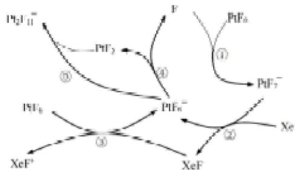

(2) 上述反应中的催化剂为\_\_\_\_。
A. $PtF_{6}$ B. $PtF_{7}^{-}$ C. $F^{-}$ D. $XeF^{+}$

（3）上述过程中属于氧化还原反应的是\_\_\_\_。
A. ②
B. ③
C. ④
D. ⑤

(4) 氟气通入氙(Xe)会产生 $\mathrm{XeF}_2$ 、 $\mathrm{XeF}_4$ 、 $\mathrm{XeF}_6$ 三种氟化物气体。现将 $1\mathrm{mol}$ 的 $\mathrm{Xe}$ 和 $9\mathrm{mol}$ 的 $\mathrm{F}_2$ 同时通入 $50\mathrm{L}$ 的容器中, 反应 $10\mathrm{min}$ 后, 测得容器内共有 $8.9\mathrm{mol}$ 气体, 且三种氟化物的比例为 $\mathrm{XeF}_2:\mathrm{XeF}_4:\mathrm{XeF}_6 = 1:6:3$ , 则 $10\mathrm{min}$ 内 $\mathrm{XeF}_4$ 的速率 $\mathrm{v}(\mathrm{XeF}_4) =$ \_\_\_\_。

【答案】（1）氟单质与铜制容器表面的铜反应形成一层保护性的氯化铜薄膜，可阻止氟与铜进一步反应
(2) A (3) AB

【解析】

(4) $0.0006 \, mol \cdot L^{-1} \cdot min^{-1}$

【小问 1 详解】

氟单质常温下能腐蚀 Fe、Ag 等金属，但工业上却可用 Cu 制容器储存。类比铝在空气中不易被腐蚀的原理，可用 Cu 制容器储存氟单质的原因是氟单质与铜制容器表面的铜反应形成一层保护性的氯化铜薄膜，可阻止氟与铜进一步反应。

【小问 2 详解】

由图中信息可知， $\mathrm{PtF}_6$ 参与了反应过程，但最后又生成了 $\mathrm{PtF}_6$ ，因此上述反应中的催化剂为 $\mathrm{PtF}_6$ ，故选A。

【小问 3 详解】

由图中信息可知，反应②的化学方程式为 $\mathrm{PtF}_7^- + Xe \rightarrow \mathrm{PtF}_6^- + XeF$ ，反应③的化学方程式为 $\mathrm{PtF}_6^- + XeF \rightarrow \mathrm{PtF}_6 + XeF^+$ ，这两步反应中Xe和Pt的化合价都发生了变化，因此，上述过程中属于氧化还原反应的是②和③；反应④的化学方程式为 $\mathrm{PtF}_6^- \rightarrow \mathrm{PtF}_5 + \mathrm{F}^-$ ，反应⑤的化学方程式为 $\mathrm{PtF}_6^- + PtF_5 \rightarrow [\mathrm{Pt}_2\mathrm{F}_{11}]^-$ ，这两步反应中元素的化合价没有变化，因此，这两个反应不是氧化还原反应，故选AB。

【小问 4 详解】

氟气通入氙(Xe)会产生 $XeF_{2}$ 、 $XeF_{4}$ 、 $XeF_{6}$ 三种氟化物气体。现将1mol的Xe和9mol的 $F_{2}$ 同时通入50L的容器中，反应10min后，测得容器内共有8.9mol气体，且三种氟化物的比例为

$\mathrm{XeF}_2:\mathrm{XeF}_4:\mathrm{XeF}_6 = 1:6:3$ 。假设 $\mathrm{XeF}_2$ 、 $\mathrm{XeF}_4$ 、 $\mathrm{XeF}_6$ 的物质的量分别为 $\mathbf{x}$ 、 $6\mathrm{x}$ 、 $3\mathrm{x}$ ，则 $1\mathrm{mol} + 9\mathrm{mol}$ $+10\mathrm{x - }10\mathrm{x - x - }6x\times 2 - 3x\times 6\div 2 = 8.9\mathrm{mol}$ ，解之得 $\mathrm{x = 0.05mol}$ ， $10\mathrm{min}$ 内 $\mathrm{XeF}_4$ 的速率 $\mathrm{v(XeF_4)} = \frac{0.05\mathrm{mol}\times 6}{50\mathrm{L}\times 10\mathrm{min}} = 0.0006\mathrm{mol}\cdot \mathrm{L}^{-1}\cdot \mathrm{min}^{-1}$ 。

## 二、粗盐水的精制

6. 粗盐中含有 $SO_{4}^{2-}, K^{+}, Ca^{2+}, Mg^{2+}$ 等杂质离子，实验室按下面的流程进行精制：

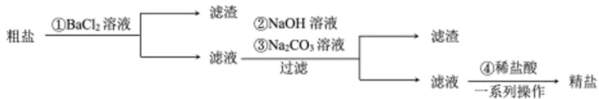

已知：KCl 和 NaCl 的溶解度如图所示:

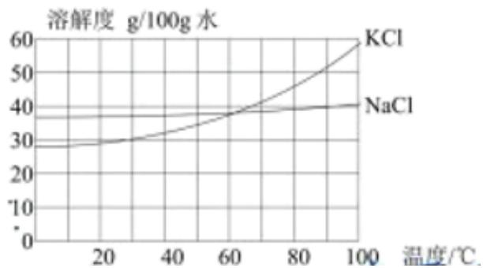

(1) 步骤①中 $\mathrm{BaCl}_{2}$ 要稍过量。请描述检验 $\mathrm{BaCl}_{2}$ 是否过量的方法: \_\_\_\_。

(2) 若加 $\mathrm{BaCl}_2$ 后不先过滤就加氢氧化钠和碳酸钠, 会导致\_\_\_\_。  
A. $\mathrm{SO}_4^{2-}$ 不能完全去除 B. 消耗更多 $\mathrm{NaOH}$ C. $\mathrm{Ba}^+$ 不能完全去除 D. 消耗更多 $\mathrm{Na}_2\mathrm{CO}_3$

(3) 过滤操作中需要的玻璃仪器。除烧杯和玻璃棒外, 还需要\_\_\_\_。
A. 分液漏斗    B. 漏斗    C. 容量瓶    D. 蒸发皿

(4) 步骤④中用盐酸调节 $\mathrm{pH}$ 至 $3 \sim 4$ , 除去的离子有\_\_\_\_。

(5)“一系列操作”是指\_\_\_\_。
A. 蒸发至晶膜形成后，趁热过滤
B. 蒸发至晶膜形成后，冷却结晶
C. 蒸发至大量晶体析出后，趁热过滤
D. 蒸发至大量晶体析出后，冷却结晶

(6) 请用离子方程式表示加入盐酸后发生的反应\_\_\_\_。

另有两种方案选行粗盐提纯。

方案 2: 向粗盐水中加入石灰乳[主要成分为 $\mathrm{Ca(OH)}_{2}$ ]除去 $\mathrm{Mg}^{2+}$ , 再通入含 $\mathrm{NH}_{3}, \mathrm{CO}_{2}$ 的工业废气除去 $\mathrm{Ca}^{2+}$ ;

方案 3：向粗盐水中加入石灰乳除去 $Mg^{2+}$ ，再加入碳酸钠溶液除去 $Ca^{2+}$ 。

(7) 相比于方案 3, 方案 2 的优点是\_\_\_\_。

(8) 已知粗盐水中 $\mathrm{MgCl}_{2}$ 含量为 $0.38 \mathrm{~g} \cdot \mathrm{L}^{-1}$ , $\mathrm{CaCl}_{2}$ 含量为 $1.11 \mathrm{~g} \cdot \mathrm{L}^{-1}$ , 现用方案 3 提纯 $10 \mathrm{~L}$ 该粗盐水, 求需要加入石灰乳 (视为 $\mathrm{CaO}$ ) 和碳酸钠的物质的量\_\_\_\_。

【答案】（1）取少量该步骤所得的上清液于试管中，再滴入几滴稀硫酸溶液，若溶液未变浑浊，表明 $\mathrm{BaCl}_2$ 已过量 (2) AD (3) B

$$
\mathrm{OH} ^ {-}, \mathrm{CO} _ {3} ^ {2 -}
$$

(6) $\mathrm{H}^{+} + \mathrm{OH}^{-} = \mathrm{H}_{2}\mathrm{O}$ 、 $2\mathrm{H}^{+} + \mathrm{CO}_{3}^{2 - } = \mathrm{H}_{2}\mathrm{O} + \mathrm{CO}_{2}\uparrow$

(7) 提纯粗盐的同时, 可变废为宝, 将含 $\mathrm{NH}_{3}$ 和 $\mathrm{CO}_{2}$ 的工业废气转化为氮肥, 同时减少了废气的排放, 有利于保护环境

(8) 0.04mol; 0.14mol

【解析】

【分析】粗盐中含有 $SO_{4}^{2-}, K^{+}, Ca^{2+}, Mg^{2+}$ 等杂质离子，加入稍过量的 $BaCl_{2}$ 溶液，生成 $BaSO_{4}$ 沉淀，除去 $SO_{4}^{2-}$ ，过滤，滤液中加入稍过量 NaOH 溶液，生成 $\mathrm{Mg(OH)}_{2}$ 沉淀，除去 $Mg^{2+}$ ，加入稍过量 $Na_{2}CO_{3}$ 溶液，生成 $BaCO_{3}$ 和 $CaCO_{3}$ 沉淀，除去 $Ba^{2+}$ 和 $Ca^{2+}$ ，过滤，滤液中加入稀盐酸，除去 $OH^{-}$ 、 $CO_{3}^{2-}$ ，经过一系列操作后得到精盐。

【小问 1 详解】

步骤①中若 $BaCl_{2}$ 过量，则溶液中存在 $Ba^{2+}$ ，故判断过量的方法是：取少量该步骤所得的上清液于试管中，再滴入几滴稀硫酸溶液，若溶液未变浑浊，表明 $BaCl_{2}$ 已过量；

【小问 2 详解】

相同条件下，由于 $BaCO_{3}$ 和 $BaSO_{4}$ 的 $K_{sp}$ 较为接近，若加 $BaCl_{2}$ 后不先过滤就加氢氧化钠和碳酸钠，可能发生沉淀的转化： $\mathrm{BaSO}_{4}\left(\mathrm{s}\right)+\mathrm{CO}_{3}^{2-}\left(\mathrm{aq}\right)\rightleftharpoons\mathrm{BaCO}_{3}\left(\mathrm{s}\right)+\mathrm{SO}_{4}^{2-}\left(\mathrm{aq}\right)$ ，使得 $SO_{4}^{2-}$ 不能完全去除，且消耗更多的 $Na_{2}CO_{3}$ 溶液，故选 AD；

【小问 3 详解】

过滤操作中需要的玻璃仪器，除烧杯和玻璃棒外，还需要漏斗，故选 B。

【小问 4 详解】

步骤④中用盐酸调节 pH 至 3\~4， $H^{+}$ 能与多余的 NaOH 和 $Na_{2}CO_{3}$ 反应，除去的离子有： $OH^{-}$ 、 $CO_{3}^{2-}$ ；
【小问 5 详解】

由图可知，KCl 的溶解度受温度影响较大，而 NaCl 的溶解度受温度影响较小，因此先蒸发至大量晶体析出，此时 KCl 在滤液中，趁热过滤，可得到精盐，故选 C;

【小问6详解】

加入盐酸后， $H^{+}$ 能与多余的 NaOH 和 $Na_{2}CO_{3}$ 反应，离子方程式分别为： $H^{+} + OH^{-} = H_{2}O$

$2\mathrm{H}^{+} + \mathrm{CO}_{3}^{2-} = \mathrm{H}_{2}\mathrm{O} + \mathrm{CO}_{2}\uparrow;$

【小问 7 详解】

方案2加入石灰乳[主要成分为 $\mathrm{Ca(OH)_2}$ ]除去 $\mathrm{Mg}^{2+}$ 后，通入含 $\mathrm{NH}_3, \mathrm{CO}_2$ 的离子方程式为： $\mathrm{Ca}^{2+} + 2\mathrm{NH}_3 + \mathrm{CO}_2 + \mathrm{H}_2\mathrm{O} = \mathrm{CaCO}_3 \downarrow + 2\mathrm{NH}_4^+$ ，相比于方案3，方案2的优点是：提纯粗盐的同时，可变废为宝，将含 $\mathrm{NH}_3$ 和 $\mathrm{CO}_2$ 的工业废气转化为氮肥，同时减少了废气的排放，有利于保护环境；【小问8详解】

$\mathrm{MgCl}_2$ 含量为 $0.38\mathrm{g}\cdot \mathrm{L}^{-1}$ ，即 $\mathbf{c}\left(\mathrm{MgCl}_2\right) = \frac{\frac{0.38\mathrm{g}}{95\mathrm{g / mol}}}{1\mathrm{L}} = 0.004\mathrm{mol / L}$ ，由关系式：

$MgCl_{2}\sim\mathrm{Ca(OH)}_{2}\sim\mathrm{CaO}$ 可得，提纯10L该粗盐水，需要加入石灰乳(视为CaO)物质的量为 $0.004mol/L\times10L=0.04mol$ ；粗盐水中 $CaCl_{2}$ 含量为 $1.11g\cdot L^{-1}$ ，即

$c\left(\mathrm{CaCl}_{2}\right)=\frac{\frac{1.11\mathrm{g}}{111\mathrm{g}/\mathrm{mol}}}{1\mathrm{L}}=0.01\mathrm{mol/L}$ ， $n\left(\mathrm{Ca}^{2+}\right)=0.01\mathrm{mol/L}\times10\mathrm{L}=0.1\mathrm{mol}$ ，加入石灰乳(视为CaO)物质的量为0.04mol，即此时溶液中 $Ca^{2+}$ 总物质的量为： $0.1\mathrm{mol}+0.04\mathrm{mol}=0.14\mathrm{mol}$ ，由关系式： $Ca^{2+}\sim CO_{3}^{2-}$ 可得，需加入 $Na_{2}CO_{3}$ 的物质的量为0.14mol。

## 三、溴化铝的性质

7. 已知 $AlBr_{3}$ 可二聚为下图的二聚体:

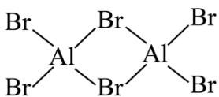

(1) 该二聚体中存在的化学键类型为\_\_\_\_。
A. 极性键    B. 非极性键    C. 离子键    D. 金属键

(2) 将该二聚体溶于 $\mathrm{CH}_{3} \mathrm{CN}$ 生成 $\left[\mathrm{Al}\left(\mathrm{CH}_{3} \mathrm{CN}\right)_{2} \mathrm{Br}_{2}\right] \mathrm{Br}$ (结构如图所示), 已知其配离子为四面体形, 中心原子杂化方式为 , 其中配体是 , $1 \mathrm{~mol}$ 该配合物中有 $\sigma$ 键 mol 。

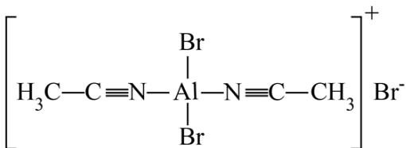

【答案】(1) A (2) ①. $\mathrm{sp}^3$ ②. $\mathrm{CH}_3\mathrm{CN}$ ③. 14

【解析】

【小问 1 详解】

从图中可知，该二聚体中 Br 和 Al 之间以极性键相连，该二聚体中存在的化学键类型为极性键，答案选 A。

【小问 2 详解】

该配离子中，中心原子 Al 形成 4 条单键，杂化方式为 $sp^{3}$ 杂化，其中 N 原子提供一对孤电子对，配体为 $CH_{3}CN$ ，1 个该配合物中含有 12 条单键，2 条碳氮三键，其中碳氮三键中有 1 条 $\sigma$ 键，因此 1 mol 该配合物中 $\sigma$ 键数量为 14 mol。

8. I. 铝的三种化合物的沸点如下表所示:

<table><tr><td>铝的卤化物</td><td> $AlF_3$ </td><td> $AlCl_3$ </td><td> $AlBr_3$ </td></tr><tr><td>沸点</td><td>1500</td><td>370</td><td>430</td></tr></table>

(1) 解释三种卤化物沸点差异的原因\_\_\_\_。

（2）已知反应 $\mathrm{Al}_{2}\mathrm{Br}_{6}(1) \rightleftharpoons 2\mathrm{Al}(\mathrm{g}) + 6\mathrm{Br}(\mathrm{g}) \Delta \mathrm{H}$ 。

① $\mathrm{Al}_{2}\mathrm{Br}_{6}(\mathrm{s})\rightleftharpoons\mathrm{Al}_{2}\mathrm{Br}_{6}(\mathrm{l})\quad\Delta\mathrm{H}_{1}$

② $\mathrm{Al(s)}\rightleftharpoons\mathrm{Al(g)}\quad\Delta\mathrm{H}_{2}$

③ $\mathrm{Br}_{2}(\mathrm{l})\rightleftharpoons\mathrm{Br}_{2}(\mathrm{g})\quad\Delta\mathrm{H}_{3}$

④ $\mathrm{Br}_2(\mathrm{g})\rightleftharpoons 2\mathrm{Br}(\mathrm{g})$ $\Delta \mathrm{H}_{4}$

⑤ $2\mathrm{Al}(\mathrm{s})+3\mathrm{Br}_{2}(\mathrm{l})\rightleftharpoons\mathrm{Al}_{2}\mathrm{Br}_{6}(\mathrm{s})$ $\Delta H_{5}$

则 $\Delta H=$ \_\_\_\_。

（3）由图可知，若该反应自发，则该反应的\_\_\_\_。

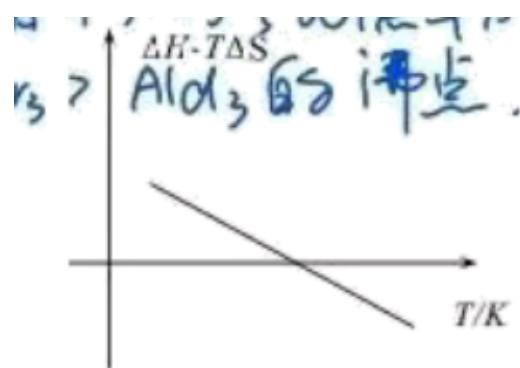

A. $\Delta H > 0, \Delta S > 0$ B. $\Delta H < 0, \Delta S > 0$ C. $\Delta H > 0, \Delta S < 0$ D. $\Delta H < 0, \Delta S < 0$

II. 已如 $Al_{2}Br_{6}$ 的晶胞如图所示(已知结构为平行六面体，各棱长不相等， $Al_{2}Br_{6}$ 在棱心)

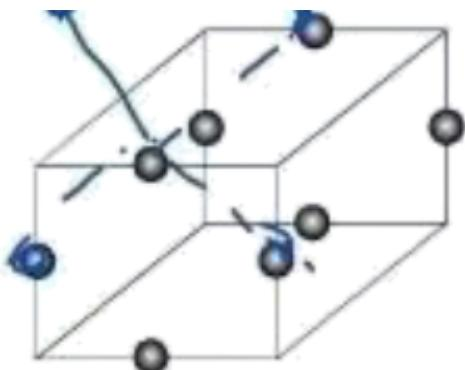

(4) 该晶体中, 每个 $\mathrm{Al}_{2} \mathrm{Br}_{6}$ , 距离其最近的 $\mathrm{Al}_{2} \mathrm{Br}_{6}$ 有\_\_\_\_个。
A. 4 B. 5 C. 8 D. 12

(5) 已知 $N_{A}=6.02\times10^{23}mol^{-1}$ ，一个晶胞的体积 $C=5.47\times10^{-22}cm^{3}$ 。求 $Al_{2}Br_{6}$ 的晶胞密度 \_\_\_\_。
(6) $AlBr_{3}$ 水解可得 $\mathrm{Al(OH)}_{3}$ 胶体，请解释用 $\mathrm{Al(OH)}_{3}$ 可净水的原因 \_\_\_\_。

（7）用上述制得的胶体做电泳实验时，有某种胶体粒子向阴极移动，该粒子可能是\_\_\_\_。
A. $\left[\mathrm{mAl(OH)}_{3}\cdot\mathrm{nAl}^{3+}\cdot(3\mathrm{n}-\mathrm{x})\mathrm{Br}^{-}\right]^{x+}$ B. $\left[\mathrm{mAl(OH)}_{3}\cdot\mathrm{nBr}^{-}\cdot\mathrm{xAl}^{3+}\right]^{3x-}$ C. $\left[\mathrm{mAl(OH)}_{3}\cdot\mathrm{nOH}^{-}\cdot(\mathrm{n}-\mathrm{x})\mathrm{H}^{+}\right]^{x-}$ D. $\left[\mathrm{mAl(OH)}_{3}\cdot\mathrm{nAl}^{3+}\cdot(\mathrm{n}-\mathrm{x})\mathrm{Br}^{-}\right]^{x-}$

【答案】（1） $\mathrm{AlF}_{3}$ 为离子晶体， $\mathrm{AlCl}_{3}$ 和 $\mathrm{AlBr}_{3}$ 为分子晶体，故 $\mathrm{AlF}_{3}$ 的沸点最高； $\mathrm{AlBr}_{3}$ 的相对分子质量大于 $\mathrm{AlCl}_{3}$ ，故 $\mathrm{AlBr}_{3}$ 的分子间作用力大于 $\mathrm{AlCl}_{3}$ ，所以 $\mathrm{AlBr}_{3}$ 的沸点高于 $\mathrm{AlCl}_{3}$ 。
(2) $-\Delta H_{1} + 2\Delta H_{2} + 3\Delta H_{3} + 3\Delta H_{4} - \Delta H_{5}$ (3) A (4) A

$$
3. 2 4 \mathrm{g} \cdot \mathrm{cm} ^ {- 3}
$$

（6）氢氧化铝胶体粒子有很大的比表面积，具有较好的吸附性，能吸附水中的悬浮颗粒并使其沉降，因而常用于水的净化 （7）A 【解析】 【小问1详解】

$AlF_{3}$ 为离子晶体， $AlCl_{3}$ 和 $AlBr_{3}$ 为分子晶体，故 $AlF_{3}$ 的沸点最高； $AlBr_{3}$ 的相对分子质量大于 $AlCl_{3}$ ，故 $AlBr_{3}$ 的分子间作用力大于 $AlCl_{3}$ ，所以 $AlBr_{3}$ 的沸点高于 $AlCl_{3}$ 。

由题中所给的热化学方程式，根据盖斯定律可知，目标热化学方程式可由①×（-1）

$+②\times2+③\times3+④\times3+⑤\times(-1)$ 得到，故 $\Delta H=-\Delta H_{1}+2\Delta H_{2}+3\Delta H_{3}+3\Delta H_{4}-\Delta H_{5}$

【小问 3 详解】

由 $\Delta G = \Delta H - T\Delta S$ 可得 $\Delta G = -\Delta ST + \Delta H$ ，根据图像可知，该直线解析式得斜率小于0，纵截距大于0，即 $-\Delta S < 0$ ， $\Delta H > 0$ ；故结果为 $\Delta S > 0$ ， $\Delta H > 0$ ，选项A正确。

【小问 4 详解】

选取晶胞中宽上的棱心分子，由于各棱长不相等，与该棱心分子距离最近的分子为该晶胞中相邻两条高中的棱心分子以及相邻晶胞中两条高中的棱心分子，共有4个，故选A。

【小问 5 详解】

由 $\mathrm{Al_2Br_6}$ 的晶胞图可知，根据均摊法，一个晶胞中 $\mathrm{Al_2Br_6}$ 的个数为 $8\times \frac{1}{4} = 2$ ，则一个晶胞的质量为 $\mathrm{m} = \frac{2\times 534}{6.02\times 10^{23}}\mathrm{g}$ ，一个晶胞的体积 $\mathrm{C} = 5.47\times 10^{-22}cm^3$ ，则 $\mathrm{Al_2Br_6}$ 的晶胞密度为 $\frac{\mathrm{m}}{\mathrm{C}}\approx 3.24\mathrm{g}\cdot \mathrm{cm}^{-3}$ 【小问6详解】由于氢氧化铝胶体粒子有很大的比表面积，具有较好的吸附性，能吸附水中的悬浮颗粒并使其沉降，因而常用于水的净化。。

【小问7详解】

某种胶体粒子向阴极移动，说明该粒子带正电，故选A。

## 四、瑞格列奈的制备

9. 瑞格列奈的制备。

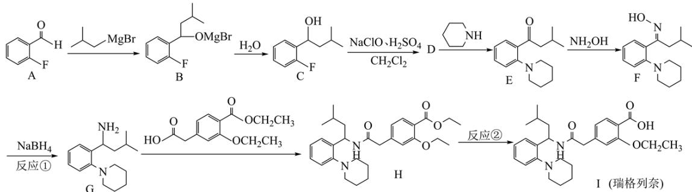

(1) 瑞格列奈中的含氧官能团除了羧基、醚键, 还存在\_\_\_\_。

(2) 反应①的反应类型为\_\_\_\_。
A. 还原反应    B. 消去反应    C. 取代反应    D. 氧化反应

（3）反应②的试剂和条件是\_\_\_\_。

(4) D 的分子式是 $C_{11}H_{13}OF$ ，画出 D 的结构简式 \_\_\_\_。

（5）化合物 D 有多种同分异构体，写出满足下列条件的 D 的同分异构体的结构简式\_\_\_\_。
i. 芳香族化合物，可以发生银镜反应；

ii. 核磁共振氢谱中显示出 3 组峰，其峰面积之比为 6:6:1。

(6) G 对映异构体分离后才能发生下一步反应

①G 中有\_\_\_\_个手性碳

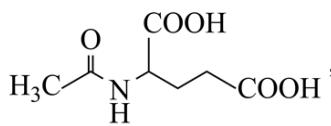

$\mathrm{H_{3}C=O-NH-COOH}$ ，该物质可用于分离对映异构体。谷氨酸的结构简式为：\_\_\_\_。检验谷氨酸的试剂是\_\_\_\_。

A. 硝酸 B. 茚三酮 C. NaOH D. $\mathrm{NaHCO}_{3}$

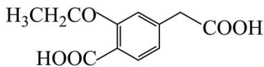

(7) 用 $\mathrm{H}_{3} \mathrm{CH}_{2} \mathrm{CO}$ 与 $\mathrm{G}$ 可直接制取 $\mathrm{H}$ 。但产率变低，请分析原因\_\_\_\_。

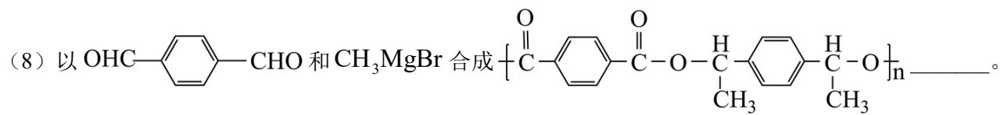

【答案】(1) 酰胺基 (2) A

(3) 稀硫酸、加热或者 $\mathrm{NaOH}$ 溶液、加热/ $\mathrm{H}^{+}$

(4)

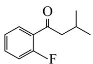

(5)

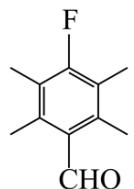

(6)

②.

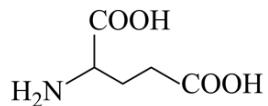

③. B

（7）该物质中有2个羧基都会生成酰胺基，所以与G反应会产生副产物，产率变低

(8)

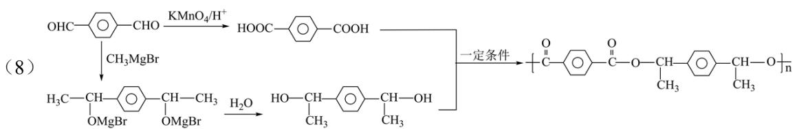

【解析】

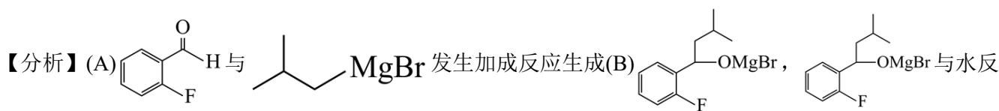

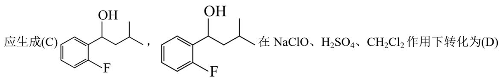

基；

【小问 2 详解】

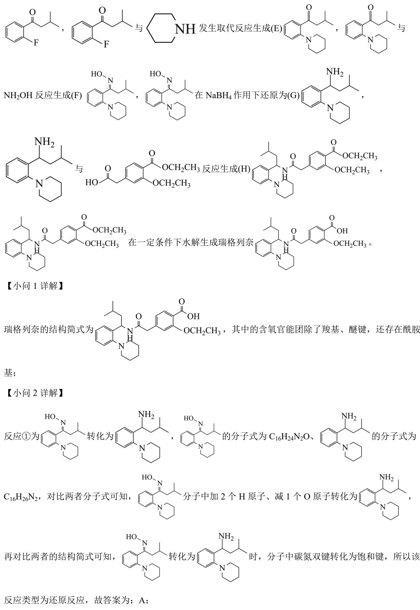

反应类型为还原反应，故答案为：A;

【小问3详解】

反应②为 $\mathrm{C}_{10}\mathrm{H}_{12}\mathrm{N}_{3}\mathrm{O}_{2}\mathrm{CH}_{2}\mathrm{OCH}_{2}\mathrm{CH}_{3}$ 在一定条件下转化为瑞格列奈 $\mathrm{C}_{10}\mathrm{H}_{12}\mathrm{N}_{3}\mathrm{O}_{2}\mathrm{CH}_{2}\mathrm{OCH}_{2}\mathrm{CH}_{3}$ ，对比两者的

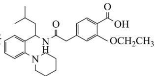

结构简式可知，反应实质为 $\mathrm{C}_{10}\mathrm{H}_{24}\mathrm{N}$ 中的酯基转化为羧基，即为酯基水解，所以反

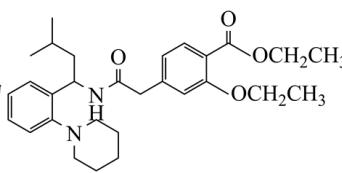

应的试剂和条件是稀硫酸、加热或者 NaOH 溶液、加热/ $H^{+}$ ;

【小问4详解】

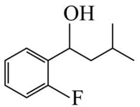

C 的结构简式 、分子式为 $C_{11}H_{15}OF$ ，D 的分子式为 $C_{11}H_{13}OF$ ，对比两者的分子式可

知，D 比 C 少 2 个 H，C 中官能团为氟原子和羟基，所以 C 转化为 D 为羟基的去氢氧化，即羟基转化为

酮羰基，所以 D 的结构简式 $\ce{C6H5F(O)CH2CH3}$ ;

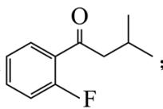

【小问5详解】

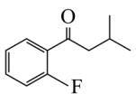

化合物D的结构简式为 $\mathrm{C}_{11}\mathrm{H}_{13}\mathrm{OF}$ ，满足条件的同分异构体中有苯环、醛基，且分

子对称性较强，核磁共振氢谱中显示出3组峰，其峰面积之比为6:6:1，则其结构简式为 $\begin{array}{c}\text{F} \\ \text{CHO}\end{array}$ ；

【小问6详解】

①G的结构简式为，其中有1个手性碳，为图中标记星号的碳原子：

②由信息 $RNH_{2} + \overset{O}{\underset{|}{\text{C}}}O \overset{O}{\underset{|}{\text{C}}} \longrightarrow \overset{O}{\underset{|}{\text{C}}}NHR + CH_{3}COOH$ 可知，谷氨酸分子中氨基 H 原子被 $CH_{3}CO-$ 取

代后生成 $\mathrm{C(OH)NHCH_2COOH}$ ，所以谷氨酸的结构简式为 $\mathrm{H_2NCH_2COOH}$ ；谷氨酸的结构简式为

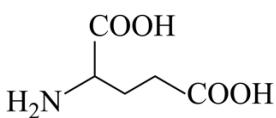

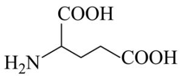

$H_{2}N \xrightarrow{COOH} COOH$ ，即谷氨酸为 $\alpha$ -氨基酸，所以可用茚三酮检验谷氨酸，故答案为：B；

【小问7详解】

G的结构简式为、H的结构简式为，用

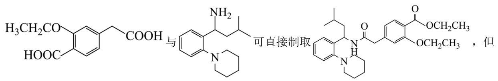

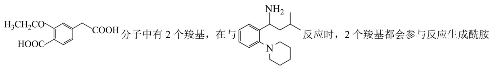

基，即生成副产物，所以产率变低；

【小问8详解】

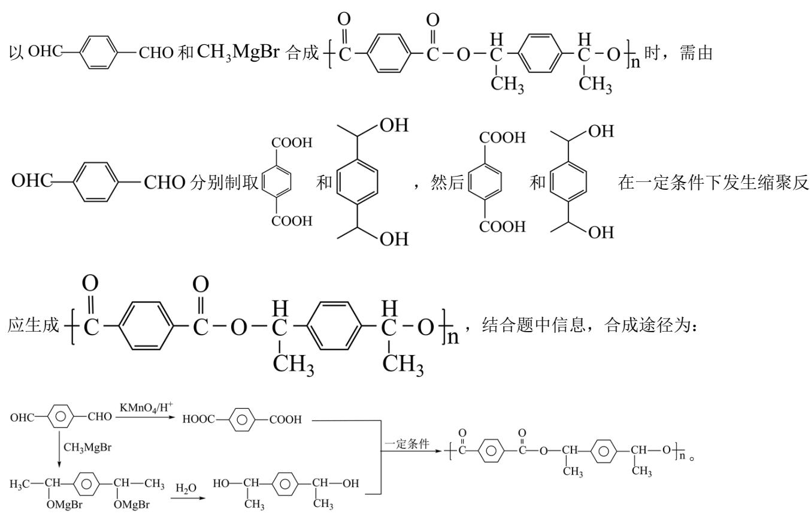  
五、珊瑚的形成与保护

10. 已知： $Ca^{2+} + 2HCO_{3}^{-} \rightleftharpoons CaCO_{3} + H_{2}CO_{3}$ ① $HCO_{3}^{-}\rightleftharpoons H^{+}+CO_{3}^{2-}$ ② $Ca^{2+}+CO_{3}^{2-}\rightleftharpoons CaCO_{3}$ ③ $HCO_{3}^{-}+H^{+}\rightleftharpoons H_{2}CO_{3}$

（1）以下能判断总反应达到平衡状态的是\_\_\_\_。
A. 钙离子浓度保持不变
B. $\frac{\mathrm{c}\left(\mathrm{HCO}_{3}^{-}\right)}{\mathrm{c}\left(\mathrm{CO}_{3}^{2-}\right)}$ 保持不变
C. $v_{\text{正}}(Ca^{2+}) = v_{\text{逆}}(CaCO_{3})$ D. $v_{\text{正}}(H_{2}CO_{3}):v_{\text{逆}}(HCO_{3}^{-})=2:1$

(2) pH 增大有利于珊瑚的形成, 请解释原因\_\_\_\_。

（3）已知 $\mathrm{H}_{2} \mathrm{CO}_{3}$ 的 $\mathrm{K}_{\mathrm{al}} = 4.2 \times 10^{-7}, \mathrm{K}_{\mathrm{a2}} = 5.6 \times 10^{-11}, \mathrm{K}_{\mathrm{sp}} (\mathrm{CaCO}_{3}) = 2.8 \times 10^{-9}, \mathrm{c(H^{+})} = 8.4 \times 10^{-9} \mathrm{~mol} \cdot \mathrm{L}^{-1},$ $\mathrm{c(HCO_{3}^{-})} = 1 \times 10^{-4} \mathrm{~mol} \cdot \mathrm{L}^{-1}, \mathrm{c(H_{2}CO_{3})}$ 为 \_\_\_\_。当 $\mathrm{c(Ca^{2+})} =$ \_\_\_\_ mol·L⁻¹时，开始产生 $\mathrm{CaCO}_{3}$ 沉淀。

（4）根据如图，写出电极 a 的电极反应式\_\_\_\_。

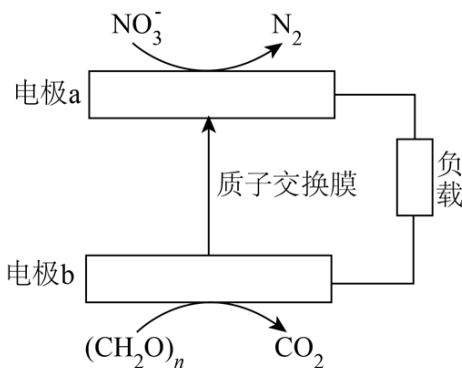

(5) 关于上述电化学反应过程, 描述正确的是\_\_\_\_。
A. 该装置实现电能转化为化学能
B. 电极 b 是负极
C. 电子从电极 a 经过负载到电极 b 再经过水体回到电极 a
D. 每 $1 \mathrm{~mol}(\mathrm{CH}_{2} \mathrm{O})_{\mathrm{n}}$ 参与反应时, 转移 $4 \mathrm{~mol}$ 电子

(6) 解释在溶液中氧气的浓度变大后, 为何有利于 $\left(\mathrm{CH}_{2} \mathrm{O}\right)_{\mathrm{n}}$ 的除去, 但不利于硝酸根的除去。

【答案】(1)AB (2)pH 越大, 即 $c(H^{+})$ 越小, 促进 $H_{2}CO_{3} \rightleftharpoons H^{+} + HCO_{3}^{-}$ 的平衡正向移动, 即 $c(HCO_{3}^{-})$

增大，方程式 $Ca^{2+} + 2HCO_{3}^{-} \rightleftharpoons CaCO_{3} + H_{2}CO_{3}$ 平衡正向移动，有利于生成 $CaCO_{3}$ ;
(3) ①. $2 \times 10^{-6} \, mol/L$ ②. $4.2 \times 10^{-3}$ (4) $2NO_{3}^{-} + 10e^{-} + 12H^{+} = N_{2}\uparrow + 6H_{2}O$ (5) B

（6）氧气浓度变大后， $\mathrm{O}_2$ 在正极放电，使得硝酸根的去除率减小，等物质的量的 $\mathrm{O}_2$ 得电子的数目大于 $\mathrm{NO}_3^-$ ，使得转移电子数增大，有机物的去除率增大【解析】【小问1详解】

A. 钙离子浓度保持不变，说明此时 $\mathrm{v}_{\text{正}} = \mathrm{v}_{\text{逆}}$ ，反应达到平衡，A符合题意；  
B. 反应①中 $\mathrm{K} = \frac{\mathrm{c}\left(\mathrm{H}^{+}\right)\mathrm{c}\left(\mathrm{CO}_{3}^{2-}\right)}{\mathrm{c}\left(\mathrm{HCO}_{3}^{-}\right)}$ ，即 $\frac{\mathrm{c}\left(\mathrm{HCO}_{3}^{-}\right)}{\mathrm{c}\left(\mathrm{CO}_{3}^{2-}\right)} = \frac{\mathrm{c}\left(\mathrm{H}^{+}\right)}{\mathrm{K}}$ ，K只与温度有关， $\frac{\mathrm{c}\left(\mathrm{HCO}_{3}^{-}\right)}{\mathrm{c}\left(\mathrm{CO}_{3}^{2-}\right)}$ 保持不变，即 $\mathbf{c}\left(\mathsf{H}^+\right)$ 保持不变，说明此时 $\mathbf{v}_{\text{正}} = \mathbf{v}_{\text{逆}}$ ，反应达到平衡，B符合题意；  
C. $\mathrm{CaCO_3}$ 为固体，其浓度为常数，一般不用固体来表示化学反应速率，C不符合题意；

D. 不同物质表示正逆反应速率, 且之比不等于化学计量数之比, 说明正反应速率不等于逆反应速率, 反应未达到平衡状态, D 不符合题意;

故选 AB;

【小问 2 详解】

$\mathrm{pH}$ 越大，即 $\mathbf{c}(\mathrm{H}^{+})$ 越小，促进 $\mathrm{H}_{2} \mathrm{CO}_{3} \rightleftharpoons \mathrm{H}^{+} + \mathrm{HCO}_{3}^{-}$ 的平衡正向移动，即 $\mathbf{c}\left(\mathrm{HCO}_{3}^{-}\right)$ 增大，方程式 $\mathrm{Ca}^{2+} + 2 \mathrm{HCO}_{3}^{-} \rightleftharpoons \mathrm{CaCO}_{3} + \mathrm{H}_{2} \mathrm{CO}_{3}$ 平衡正向移动，有利于生成 $\mathrm{CaCO}_{3}$ ;

【小问 3 详解】

$$
\mathrm{c} \left(\mathrm{H} ^ {+}\right) = 8. 4 \times 1 0 ^ {- 9} \mathrm{mol} \cdot \mathrm{L} ^ {- 1}, \quad \mathrm{c} \left(\mathrm{HCO} _ {3} ^ {-}\right) = 1 \times 1 0 ^ {- 4} \mathrm{mol} \cdot \mathrm{L} ^ {- 1}, \quad \mathrm{H} _ {2} \mathrm{CO} _ {3}
$$

$$
\mathrm{K} _ {\mathrm{al}} = \frac {\mathrm{c} \left(\mathrm{H} ^ {+}\right) \mathrm{c} \left(\mathrm{HCO} _ {3} ^ {-}\right)}{\mathrm{c} \left(\mathrm{H} _ {2} \mathrm{CO} _ {3}\right)} = \frac {8 . 4 \times 1 0 ^ {- 9} \times 1 \times 1 0 ^ {- 4}}{\mathrm{c} \left(\mathrm{H} _ {2} \mathrm{CO} _ {3}\right)} = 4. 2 \times 1 0 ^ {- 7}, \quad \mathrm{c} \left(\mathrm{H} _ {2} \mathrm{CO} _ {3}\right) = 2 \times 1 0 ^ {- 6} \mathrm{mol/L};
$$

$$
\mathrm{K} _ {\mathrm{a} 2} = \frac {\mathrm{c} \left(\mathrm{H} ^ {+}\right) \mathrm{c} \left(\mathrm{CO} _ {3} ^ {2 -}\right)}{\mathrm{c} \left(\mathrm{HCO} _ {3} ^ {-}\right)} = \frac {8 . 4 \times 1 0 ^ {- 9} \mathrm{c} \left(\mathrm{CO} _ {3} ^ {2 -}\right)}{1 \times 1 0 ^ {- 4}} = 5. 6 \times 1 0 ^ {- 1 1}, \text {即} \mathrm{c} \left(\mathrm{CO} _ {3} ^ {2 -}\right) = \left(\frac {2}{3} \times 1 0 ^ {- 6}\right) \mathrm{mol} / \mathrm{L}
$$

$$
\mathrm{K} _ {\mathrm{sp}} \left(\mathrm{CaCO} _ {3}\right) = \mathrm{c} \left(\mathrm{Ca} ^ {+}\right) \times \mathrm{c} \left(\mathrm{CO} _ {3} ^ {2 -}\right) = \mathrm{c} \left(\mathrm{Ca} ^ {+}\right) \times \left(\frac {2}{3} \times 1 0 ^ {- 6}\right) = 2. 8 \times 1 0 ^ {- 9}, \quad \mathrm{c} \left(\mathrm{Ca} ^ {+}\right) = 4. 2 \times 1 0 ^ {- 3} \mathrm{mol} / \mathrm{L};
$$

【小问 4 详解】

电极 a 上 $NO_{3}^{-}$ 得到电子变为 $N_{2}$ ，电极反应式为： $2NO_{3}^{-} + 10e^{-} + 12H^{+} = N_{2}\uparrow + 6H_{2}O$ ;

【小问 5 详解】

A. 由图可知, 电极与负载相连接, 该装置为原电池, 能实现化学能到电能的转化, 故 A 错误;

B. 电极 b 上（ $CH_{2}O$ ）失去电子变为 $CO_{2}$ ，电极 b 是负极，故 B 正确；

C. 电极 a 为正极, 电极 b 为负极, 电子从电极 b 经过负载到电极 a, 电子不会进入水体中, 故 C 错误;

$$
\left(\mathrm{CH} _ {2} \mathrm{O}\right) _ {\mathrm{n}} - 4 \mathrm{ne} ^ {-} + \mathrm{nH} _ {2} \mathrm{O} = \mathrm{nCO} _ {2}
$$

$$
+ 4 \mathrm{nH} ^ {+}
$$

$$
1 \mathrm{mol} \left(\mathrm{CH} _ {2} \mathrm{O}\right) _ {\mathrm{n}}
$$

故选 B;

【小问6详解】

氧气浓度变大后， $O_{2}$ 在正极放电，使得硝酸根的去除率减小，等物质的量的 $O_{2}$ 得电子的数目大于 $NO_{3}^{-}$ ，使得转移电子数增大，有机物的去除率增大。