# 2024 年普通高等学校招生全国统一考试（甲卷）

# 理科综合能力测试

注意事项：

1. 答卷前，考生务必将自己的姓名、准考证号填写在答题卡上，并将自己的姓名、准考证号、座位号填写在本试卷上。

2. 回答选择题时，选出每小题答案后，用 2B 铅笔把答题卡上对应题目的答案标号涂黑；如需改动，用橡皮擦干净后，再选涂其他答案标号。涂写在本试卷上无效。

3.作答非选择题时，将答案书写在答题卡上，书写在本试卷上无效。

4. 考试结束后，将本试卷和答题卡一并交回。

可能用到的相对原子质量：H1 C 12 N 14 O 16 S 32 Zn 65 Pb 207

## 一、选择题：本题共13小题，每小题6分，共78分。在每小题给出的四个选项中，只有一项是符合题目要求的。

1. 人类对能源的利用经历了柴薪、煤炭和石油时期，现正向新能源方向高质量发展。下列有关能源的叙述错误的是
A. 木材与煤均含有碳元素
B. 石油裂化可生产汽油
C. 燃料电池将热能转化为电能
D. 太阳能光解水可制氢

【解析】

【详解】A. 木材的主要成分为纤维素, 纤维素中含碳、氢、氧三种元素, 煤是古代植物埋藏在地下经历了复杂的变化逐渐形成的固体, 是有机物和无机物组成的复杂混合物, 主要含碳元素, A 正确;  
B. 石油裂化是将相对分子质量较大、沸点较高的烃断裂为相对分子质量较小、沸点较低的烃的过程, 汽油的相对分子质量较小, 可以通过石油裂化的方式得到, B 正确;  
C. 燃料电池是将燃料的化学能变成电能的装置, 不是将热能转化为电能, C 错误;  
D. 在催化剂作用下, 利用太阳能光解水可以生成氢气和氧气, D 正确;  
故答案选 C。

2. 下列过程对应的离子方程式正确的是
A. 用氢氟酸刻蚀玻璃: $\mathrm{SiO}_{3}^{2-} + 4\mathrm{F}^{-} + 6\mathrm{H}^{+} = \mathrm{SiF}_{4}\uparrow + 3\mathrm{H}_{2}\mathrm{O}$ B. 用三氯化铁溶液刻制覆铜电路板: $2\mathrm{Fe}^{3+} + 3\mathrm{Cu} = 3\mathrm{Cu}^{2+} + 2\mathrm{Fe}$ C. 用硫代硫酸钠溶液脱氯: $\mathrm{S}_{2}\mathrm{O}_{3}^{2-} + 2\mathrm{Cl}_{2} + 3\mathrm{H}_{2}\mathrm{O} = 2\mathrm{SO}_{3}^{2-} + 4\mathrm{Cl}^{-} + 6\mathrm{H}^{+}$

D. 用碳酸钠溶液浸泡锅炉水垢中的硫酸钙: $\mathrm{CaSO}_{4} + \mathrm{CO}_{3}^{2-} = \mathrm{CaCO}_{3} + \mathrm{SO}_{4}^{2-}$ 【答案】D

【解析】

【详解】A．玻璃的主要成分为 $SiO_{2}$ ，用氢氟酸刻蚀玻璃时， $SiO_{2}$ 和氢氟酸反应生成 $SiF_{4}$ 气体和水，反应的方程式为 $SiO_{2} + 4HF = SiF_{4} \uparrow + 2H_{2}O$ ，A 错误；
B． $Fe^{3+}$ 可以将 Cu 氧化成 $Cu^{2+}$ ，三氯化铁刻蚀铜电路板时反应的离子方程式为 $2Fe^{3+} + Cu = 2Fe^{2+} + Cu^{2+}$ ，B 错误；
C．氯气具有强氧化性，可以氧化硫代硫酸根成硫酸根，氯气被还原为氯离子，反应的离子方程式为 $S_{2}O$ $^{2-}_{3} + 4Cl_{2} + 5H_{2}O = 2SO_{4}^{2-} + 8Cl^{-} + 10H^{+}$ ，C 错误；
D．碳酸钙的溶解度小于硫酸钙，可以用碳酸钠溶液浸泡水垢使硫酸钙转化为疏松、易溶于酸的碳酸钙，反应的离子方程式为 $CaSO_{4} + CO_{3}^{2-} = CaCO_{3} + SO_{4}^{2-}$ ，D 正确；
故答案选 D。

3. 我国化学工作者开发了一种回收利用聚乳酸(PLA)高分子材料的方法，其转化路线如下所示。

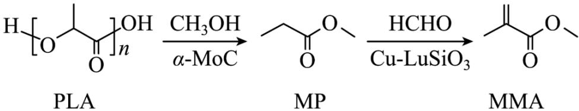

下列叙述错误的是
A. PLA 在碱性条件下可发生降解反应
B. MP 的化学名称是丙酸甲酯
C. MP 的同分异构体中含羧基的有 3 种

D. MMA 可加聚生成高分子 $\left[\mathrm{CH}_{2}-\mathrm{C}\right]_{n}$ COOCH $_{3}$

【详解】A．根据 PLA 的结构简式，聚乳酸是其分子中的羧基与另一分子中的羟基发生反应聚合得到的，含有酯基结构，可以在碱性条件下发生降解反应，A 正确；
B．根据 MP 的结果，MP 可视为丙酸和甲醇发生酯化反应得到的，因此其化学名称为丙酸甲酯，B 正确；
C. MP 的同分异构体中，含有羧基的有 2 种，分别为正丁酸和异丁酸，C 错误；

D. MMA 中含有双键结构，可以发生加聚反应生成高分子 $\left[\mathrm{CH}_{2}-\mathrm{C}\right]_{n}$ ，D 正确；

4. 四瓶无色溶液 $NH_{4}NO_{3}$ 、 $Na_{2}CO_{3}$ 、 $\mathrm{Ba(OH)}_{2}$ 、 $AlCl_{3}$ ，它们之间的反应关系如图所示。其中 a、b、c、d 代表四种溶液，e 和 g 为无色气体，f 为白色沉淀。下列叙述正确的是

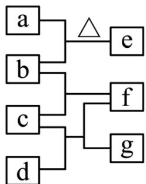

A. a 呈弱碱性  
B. f 可溶于过量的 b 中  
C. c 中通入过量的 e 可得到无色溶液  
D. b 和 d 反应生成的沉淀不溶于稀硝酸

【答案】B

【解析】

【分析】由题意及关系图可知，a 与 b 反应需要加热，且产生的 e 为无色气体，则 a 和 b 分别为 $NH_{4}NO_{3}$ 和 $Ba(OH)_{2}$ 的一种，产生的气体 e 为 $NH_{3}$ ；又由于 b 和 c 反应生成白色沉淀 f， $NH_{4}NO_{3}$ 不会与其他三种溶液产生沉淀，故 b 为 $Ba(OH)_{2}$ ，a 为 $NH_{4}NO_{3}$ ；又由于 c 既能与 b 产生沉淀 f，又能与 d 反应产生沉淀 f，故 c 为 $AlCl_{3}$ ，d 为 $Na_{2}CO_{3}$ ，生成的白色沉淀为 $\mathrm{Al(OH)}_{3}$ ，无色气体 g 为 $CO_{2}$ 。综上所述，a 为 $NH_{4}NO_{3}$ 溶液，b 为 $Ba(OH)_{2}$ 溶液，c 为 $AlCl_{3}$ 溶液，d 为 $Na_{2}CO_{3}$ 溶液，e 为 $NH_{3}$ ，f 为 $\mathrm{Al(OH)}_{3}$ ，g 为 $CO_{2}$ 。

【详解】A．由分析可知，a 为 $NH_{4}NO_{3}$ 溶液，为强酸弱碱盐的溶液， $NH_{4}^{+}$ 水解显酸性，故 a 显弱酸性，A 项错误

B．由分析可知，f 为 $\mathrm{Al(OH)}_{3}$ ，b 为 $\mathrm{Ba(OH)}_{2}$ 溶液， $\mathrm{Al(OH)}_{3}$ 为两性氢氧化物，可溶液强碱，故 f 可溶于过量的 b 中，B 项正确；

C．由分析可知，c 为 $AlCl_{3}$ 溶液，e 为 $NH_{3}$ ， $AlCl_{3}$ 溶液通入 $NH_{3}$ 会生成 $\mathrm{Al(OH)}_{3}$ 沉淀， $\mathrm{Al(OH)}_{3}$ 不溶于

弱碱，继续通入 $NH_{3}$ 不能得到无色溶液，C 项错误；

D．由分析可知，b 为 $\mathrm{Ba(OH)}_{2}$ ，d 为 $Na_{2}CO_{3}$ ，二者反应生成 $BaCO_{3}$ 沉淀，可溶与稀硝酸，D 项错误；故选 B。

5. W、X、Y、Z 为原子序数依次增大的短周期元素。W 和 X 原子序数之和等于 Y $^{-}$ 的核外电子数，化合物
W $^{+}$ [ZY $_{6}$ ] $^{-}$ 可用作化学电源的电解质。下列叙述正确的是
A. X 和 Z 属于同一主族
B. 非属性：X > Y > Z
C. 气态氢化物的稳定性：Z > Y
D. 原子半径：Y > X > W
【答案】A
【解析】

【分析】W、X、Y、Z 为原子序数依次增大的短周期元素，且能形成离子化合物 $W^{+}\left[ZY_{6}\right]^{-}$ ，则 W 为 Li 或 Na；又由于 W 和 X 原子序数之和等于 $Y^{-}$ 的核外电子数，若 W 为 Na，X 原子序数大于 Na，则 W 和 X 原子序数之和大于 18，不符合题意，因此 W 只能为 Li 元素；由于 Y 可形成 $Y^{-}$ ，故 Y 为第 VII 主族元素，且原子序数 Z 大于 Y，故 Y 不可能为 Cl 元素，因此 Y 为 F 元素，X 的原子序数为 10-3=7，X 为 N 元素；根据 W、Y、Z 形成离子化合物 $W^{+}\left[ZY_{6}\right]^{-}$ ，可知 Z 为 P 元素；综上所述，W 为 Li 元素，X 为 N 元素，Y 为 F 元素，Z 为 P 元素。

【详解】A．由分析可知，X 为 N 元素，Z 为 P 元素，X 和 Z 属于同一主族，A 项正确；
B．由分析可知，X 为 N 元素，Y 为 F 元素，Z 为 P 元素，非金属性：F > N > P，B 项错误；
C．由分析可知，Y 为 F 元素，Z 为 P 元素，非金属性越强，其简单气态氢化物的稳定性越强，即气态氢化物的稳定性： $HF > PH_{3}$ ，C 项错误；
D．由分析可知，W 为 Li 元素，X 为 N 元素，Y 为 F 元素，同周期主族元素原子半径随着原子序数的增大而减小，故原子半径：Li > N > F，D 项错误；

故选 A。

6. 科学家使用 $\delta$ -MnO $_2$ 研制了一种 MnO $_2$ -Zn 可充电电池(如图所示)。电池工作一段时间后，MnO $_2$ 电极上检测到 MnOOH 和少量 ZnMn $_2$ O $_4$ 。下列叙述正确的是

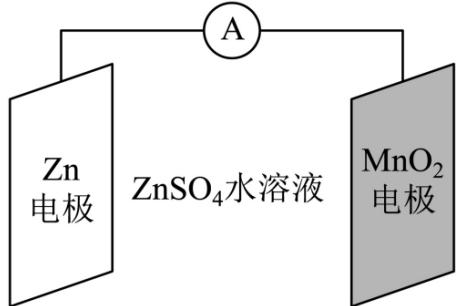

A. 充电时， $\mathrm{Zn}^{2+}$ 向阳极方向迁移  
B. 充电时，会发生反应 $\mathrm{Zn} + 2\mathrm{MnO}_2 = \mathrm{ZnMn}_2\mathrm{O}_4$ C. 放电时，正极反应有 $\mathrm{MnO}_2 + \mathrm{H}_2\mathrm{O} + \mathrm{e}^- = \mathrm{MnOOH} + \mathrm{OH}^-$ D. 放电时， $\mathrm{Zn}$ 电极质量减少 $0.65\mathrm{g}$ ， $\mathrm{MnO}_2$ 电极生成了 $0.020\mathrm{mol}$ MnOOH

【答案】C

【解析】

【分析】Zn 具有比较强的还原性， $MnO_{2}$ 具有比较强的氧化性，自发的氧化还原反应发生在 Zn 与 $MnO_{2}$ 之间，所以 $MnO_{2}$ 电极为正极，Zn 电极为负极，则充电时 $MnO_{2}$ 电极为阳极、Zn 电极为阴极。

$$
\mathrm{Zn} ^ {2 +}
$$

$$
\mathrm{Zn} - 2 \mathrm{e} ^ {-} = \mathrm{Zn} ^ {2 +}
$$

$$
\mathrm{Zn} ^ {2 +} + 2 \mathrm{e} ^ {-} = \mathrm{Zn}
$$

C. 放电时 $MnO_{2}$ 电极为正极，正极上检测到 MnOOH 和少量 $ZnMn_{2}O_{4}$ ，则正极上主要发生的电极反应是 $MnO_{2} + H_{2}O + e^{-} = MnOOH + OH^{-}$ ，C 正确；

D. 放电时, $Zn$ 电极质量减少 $0.65g$ (物质的量为 $0.010mol$ ), 电路中转移 $0.020mol$ 电子, 由正极的主要反应 $MnO_{2} + H_{2}O + e^{-} = MnOOH + OH^{-}$ 可知, 若正极上只有 MnOOH 生成, 则生成 MnOOH 的物质的量为 $0.020mol$ , 但是正极上还有 $ZnMn_{2}O_{4}$ 生成, 因此, MnOOH 的物质的量小于 $0.020mol$ , D 不正确; 综上所述, 本题选 C。

7. 将 $0.10 \mathrm{mmol} \mathrm{Ag}_{2} \mathrm{CrO}_{4}$ 配制成 $1.0 \mathrm{~mL}$ 悬浊液，向其中滴加 $0.10 \mathrm{~mol} \cdot \mathrm{L}^{-1}$ 的 $\mathrm{NaCl}$ 溶液。 $\lg \left[ c_{\mathrm{M}} / (\mathrm{mol} \cdot \mathrm{L}^{-1}) \right]$ (M 代表 $\mathrm{Ag}^{+}$ 、 $\mathrm{Cl}^{-}$ 或 $\mathrm{CrO}_{4}^{2-}$ ) 随加入 $\mathrm{NaCl}$ 溶液体积(V)的变化关系如图所示。

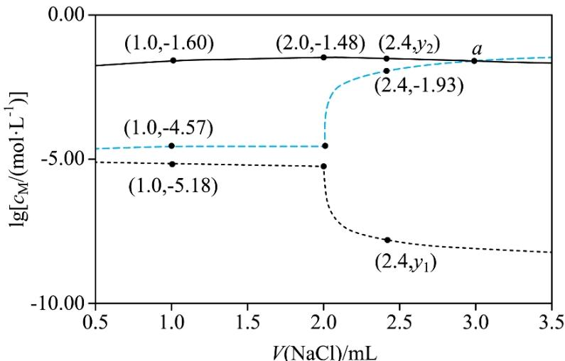

下列叙述正确的是
A. 交点 a 处: $c(\mathrm{Na}^{+})=2c(\mathrm{Cl}^{-})$ B. $\frac{\mathrm{K}_{\mathrm{sp}}(\mathrm{AgCl})}{\mathrm{K}_{\mathrm{sp}}(\mathrm{Ag}_{2}\mathrm{CrO}_{4})}=10^{-2.21}$ C. $V \leq 2.0mL$ 时， $\frac{\mathrm{c}\left(\mathrm{CrO}_{4}^{2-}\right)}{\mathrm{c}\left(\mathrm{Cl}^{-}\right)}$ 不变
D. $y_{1}=-7.82, y_{2}=-lg34$

【解析】

【分析】向1.0mL含0.10mmol $Ag_{2}CrO_{4}$ 的悬浊液中滴加0.10mol·L $^{-1}$ 的NaCl溶液，发生反应： $Ag_{2}CrO_{4}(s)+2Cl^{-}(aq)\rightleftharpoons2AgCl(s)+CrO_{4}^{2-}(aq)$ ，两者恰好完全反应时，NaCl溶液的体积为 $v(\mathrm{NaCl})=\frac{2\times0.10\mathrm{mmol}}{0.10\mathrm{mol/L}}=2\mathrm{mL}$ ，2mL之后再加NaCl溶液， $c(Cl^{-})$ 增大，据 $AgCl(s)\rightleftharpoons Ag^{+}(aq)+Cl^{-}(aq)$ ， $K_{\mathrm{sp}}(\mathrm{AgCl})=\mathrm{c}(\mathrm{Ag}^{+})\mathrm{c}(\mathrm{Cl}^{-})$ 可知， $c(\mathrm{Ag}^{+})$ 会随着 $c(\mathrm{Cl}^{-})$ 增大而减小，所以2mL后降低的曲线，即最下方的虚线代表 $Ag^{+}$ ，升高的曲线，即中间虚线代表 $Cl^{-}$ ，则剩余最上方的实线为 $CrO_{4}^{2-}$ 曲线。由此分析解题：

【详解】A. 2mL 时 $Ag_{2}CrO_{4}$ 与 NaCl 溶液恰好完全反应，则 a 点时溶质为 NaCl 和 $Na_{2}CrO_{4}$ ，电荷守恒： $c(\mathrm{Na}^{+}) + c(\mathrm{Ag}^{+}) + c(\mathrm{H}^{+}) = 2c(CrO_{4}^{2-}) + c(\mathrm{Cl}^{-}) + c(\mathrm{OH}^{-})$ ，此时 $c(\mathrm{H}^{+})$ 、 $c(\mathrm{OH}^{-})$ 、 $c(\mathrm{Ag}^{+})$ 可忽略不计，a 点为 $Cl^{-}$ 和 $CrO_{4}^{2-}$ 曲线的交点，即 $c(CrO_{4}^{2-}) = c(\mathrm{Cl}^{-})$ ，则溶液中 $c(\mathrm{Na}^{+}) \approx 3c(\mathrm{Cl}^{-})$ ，A 错误；

B. 当 V(NaCl) = 1.0mL 时，有一半的 $Ag_{2}CrO_{4}$ 转化为 AgCl， $Ag_{2}CrO_{4}$ 与 AgCl 共存，均达到沉淀溶解平

衡，取图中横坐标为 1.0mL 的点，得 $\mathrm{K_{sp}(AgCl)=c(Ag^{+})c(Cl^{-})=10^{-5.18}\times10^{-4.57}=10^{-9.75}$ ， $\mathrm{K_{sp}(Ag_{2}CrO_{4})=}$ $c^{2}(Ag^{+})c(CrO_{4}^{2-})=(10^{-5.18})^{2}\times10^{-1.60}=10^{-11.96}$ ，则 $\frac{\mathrm{K_{sp}(AgCl)}}{\mathrm{K_{sp}(Ag_{2}CrO_{4})}}=\frac{10^{-9.75}}{10^{-11.96}}=10^{2.21}$ ，B 错误；

C．V<2.0mL 时， $Ag^{+}$ 未沉淀完全，体系中 $Ag_{2}CrO_{4}$ 和 AgCl 共存，则 $\frac{\mathrm{K_{sp}(AgCl)}}{\mathrm{K_{sp}(Ag_{2}CrO_{4})}}=\frac{\mathrm{c(Ag^{+})\cdot c(Cl^{-})}}{\mathrm{c^{2}(Ag^{+})\cdot c(CrO_{4}^{2-})}}$ 为定值，即 $\frac{\mathrm{c(Ag^{+})\cdot c(CrO_{4}^{2-})}}{\mathrm{c(Cl^{-})}}$ 为定值，由图可知，在 V≤2.0mL 时 $\mathrm{c(Ag^{+})}$ 并不是定值，则 $\frac{\mathrm{c(CrO_{4}^{2-})}}{\mathrm{c(Cl^{-})}}$ 的值也不是定值，即在变化，C 错误；

D．V>2.0mL 时 AgCl 处于饱和状态，V(NaCl)=2.4mL 时，图像显示 $\mathrm{c(Cl^{-})=10^{-1.93}mol/L}$ ，则 $c(\mathrm{Ag^{+}})=\frac{\mathrm{K_{sp}(AgCl)}}{\mathrm{c(Cl^{-})}}=\frac{10^{-9.75}}{10^{-1.93}}=10^{-7.82}mol/L$ ，故 $y_{1}=-7.82$ ，此时 $Ag_{2}CrO_{4}$ 全部转化为 AgCl， $n(CrO_{4}^{2-})$ 守恒，等于起始时 $n(\mathrm{Ag}_{2}\mathrm{CrO}_{4})$ ，则 $c(\mathrm{CrO}_{4}^{2-})=\frac{\mathrm{n}\left(\mathrm{CrO}_{4}^{2-}\right)}{\mathrm{V}}=\frac{0.1\times10^{-3}mol}{(1+2.4)mL}=\frac{1}{34}mol/L$ ，则 $y_{2}=\lg c(\mathrm{CrO}_{4}^{2-})=\lg\frac{1}{34}=-\lg34$ ，D 正确；

故答案选 D。

8. 钴在新能源、新材料领域具有重要用途。某炼锌废渣含有锌、铅、铜、铁、钴、锰的+2价氧化物及锌和铜的单质。从该废渣中提取钴的一种流程如下。

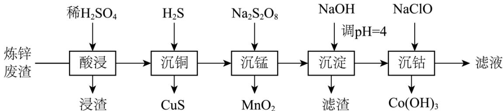

注：加沉淀剂使一种金属离子浓度小于等于 $10^{-5}mol\cdot L^{-1}$ ，其他金属离子不沉淀，即认为完全分离。

已知：① $\mathrm{K_{sp}(CuS) = 6.3\times 10^{-36},K_{sp}(ZnS) = 2.5\times 10^{-22},\quad K_{sp}(CoS) = 4.0\times 10^{-21}}$

②以氢氧化物形式沉淀时， $\lg \left[\mathrm{c(M) / (mol\cdot L^{-1})}\right]$ 和溶液 $\mathbf{pH}$ 的关系如图所示。

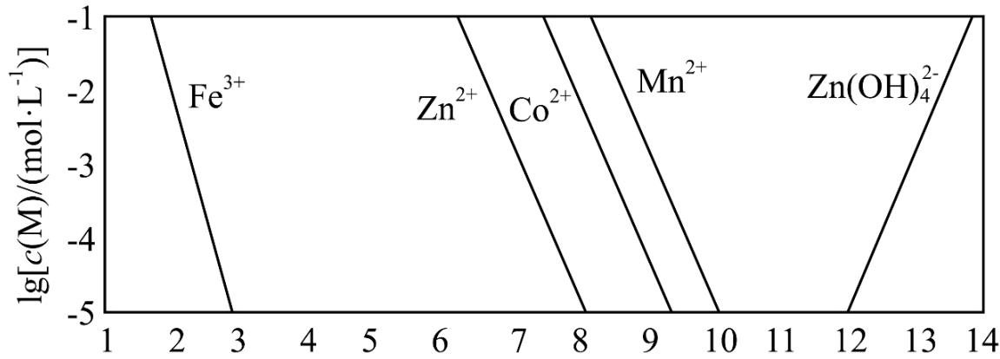  
回答下列问题:

(1) “酸浸”前, 需将废渣磨碎, 其目的是\_\_\_\_。

(2) “酸浸”步骤中, CoO 发生反应的化学方程式是\_\_\_\_。

（3）假设“沉铜”后得到的滤液中 $\mathrm{c}\left(\mathrm{Zn}^{2+}\right)$ 和 $\mathrm{c}\left(\mathrm{Co}^{2+}\right)$ 均为 $0.10\,mol\cdot L^{-1}$ ，向其中加入 $Na_{2}S$ 至 $Zn^{2+}$ 沉淀完全，此时溶液中 $\mathrm{c}\left(\mathrm{Co}^{2+}\right)=$ \_\_\_\_ $\,mol\cdot L^{-1}$ ，据此判断能否实现 $Zn^{2+}$ 和 $Co^{2+}$ 的完全分离 \_\_\_\_（填“能”或“不能”）。

(4) “沉锰”步骤中, 生成 $1.0 \mathrm{~mol} \mathrm{MnO}_{2}$ , 产生 $\mathrm{H}^{+}$ 的物质的量为\_\_\_\_。

(5) “沉淀”步骤中, 用 $\mathrm{NaOH}$ 调 $\mathrm{pH} = 4$ , 分离出的滤渣是\_\_\_\_。

(6) “沉钴”步骤中, 控制溶液 $\mathrm{pH} = 5.0 \sim 5.5$ , 加入适量的 $\mathrm{NaClO}$ 氧化 $\mathrm{Co}^{2+}$ , 其反应的离子方程式为 \_\_\_\_。

(7) 根据题中给出的信息, 从“沉钴”后的滤液中回收氢氧化锌的方法是\_\_\_\_。

【答案】（1）增大固体与酸反应的接触面积，提高钴元素的浸出效率

(2) $\mathrm{CoO + H_2SO_4 = CoSO_4 + H_2O}$

(3) ①. $1.6 \times 10^{-4}$ ②. 不能

(4) 4.0mol

(5) $\mathrm{Fe(OH)}_{3}$

(6) $2Co^{2+} + 5ClO^{-} + 5H_{2}O = 2Co(OH)_{3} \downarrow + Cl^{-} + 4HClO$

（7）向滤液中滴加 NaOH 溶液，边加边搅拌，控制溶液的 pH 接近 12 但不大于 12，静置后过滤、洗涤、干燥

【解析】

【分析】炼锌废渣含有锌、铅、铜、铁、钴、锰的+2价氧化物及锌和铜的单质，经稀硫酸酸浸时，铜不溶解，Zn 及其他 +2 价氧化物除铅元素转化为硫酸铅沉淀外，其他均转化为相应的 +2 价阳离子进入溶液；然后通入硫化氢沉铜生成 CuS 沉淀；过滤后，滤液中加入 $Na_{2}S_{2}O_{8}$ 将锰离子氧化为二氧化锰除去，同时亚铁离子也被氧化为铁离子；再次过滤后，用氢氧化钠调节 pH=4，铁离子完全转化为氢氧化铁沉淀除去；第三次过滤后的滤液中加入次氯酸钠沉钴，得到 $\mathrm{Co(OH)}_{3}$ 。

【小问 1 详解】

“酸浸”前，需将废渣磨碎，其目的是增大固体与酸反应的接触面积，提高钴元素的浸出效率。

【小问 2 详解】

“酸浸”步骤中，Cu 不溶解，Zn 单质及其他 +2 价氧化物除铅元素转化为硫酸铅沉淀外，其他均转化为相应的 +2 价阳离子进入溶液，即 CoO 为转化为 $CoSO_{4}$ ，反应的化学方程式为 $CoO + H_{2}SO_{4} = CoSO_{4} + H_{2}O$ 。
【小问 3 详解】

假设“沉铜”后得到的滤液中 $c\left(\mathrm{Zn}^{2+}\right)$ 和 $c\left(\mathrm{Co}^{2+}\right)$ 均为 $0.10\mathrm{mol}\cdot \mathrm{L}^{-1}$ ，向其中加入 $\mathrm{Na}_2\mathrm{S}$ 至 $\mathrm{Zn}^{2+}$ 沉淀完全，此时溶液中 $c\left(\mathrm{S}^{2-}\right)=\frac{2.5\times 10^{-22}}{10^{-5}}\mathrm{mol}\cdot \mathrm{L}^{-1}=2.5\times 10^{-17}\mathrm{mol}\cdot \mathrm{L}^{-1}$ ，则

$c\left(\mathrm{Co}^{2+}\right) = \frac{4.0\times 10^{-21}}{2.5\times 10^{-17}}\mathrm{mol}\cdot \mathrm{L}^{-1} = 1.6\times 10^{-4}\mathrm{mol}\cdot \mathrm{L}^{-1}, c\left(\mathrm{Co}^{2+}\right)$ 小于 $0.10\mathrm{mol}\cdot \mathrm{L}^{-1}$ ，说明大部分 $\mathrm{Co}^{2+}$ 也转化为硫化物沉淀，据此判断不能实现 $\mathrm{Zn}^{2+}$ 和 $\mathrm{Co}^{2+}$ 的完全分离。

【小问 4 详解】

“沉锰”步骤中， $\mathrm{Na}_{2} \mathrm{~S}_{2} \mathrm{O}_{8}$ 将 $\mathrm{Mn}^{2+}$ 氧化为二氧化锰除去，发生的反应为

$S_{2}O_{8}^{2-} + Mn^{2+} + 2H_{2}O = MnO_{2} \downarrow + 4H^{+} + 2SO_{4}^{2-}$ ，因此，生成1.0mol $MnO_{2}$ ，产生 $H^{+}$ 的物质的量为4.0mol。

【小问 5 详解】

“沉锰”步骤中， $\mathrm{S}_2\mathrm{O}_8^{2-}$ 同时将 $\mathrm{Fe}^{2+}$ 氧化为 $\mathrm{Fe}^{3+}$ ，“沉淀”步骤中用 $\mathrm{NaOH}$ 调 $\mathrm{pH}=4$ ， $\mathrm{Fe}^{3+}$ 可以完全沉淀为 $\mathrm{Fe(OH)}_3$ ，因此，分离出的滤渣是 $\mathrm{Fe(OH)}_3$ 。

【小问6详解】

“沉钴”步骤中，控制溶液 pH=5.0\~5.5，加入适量的 NaClO 氧化 $Co^{2+}$ ，为了保证 $Co^{2+}$ 被完全氧化，NaClO 要适当过量，其反应的离子方程式为 $2Co^{2+} + 5ClO^{-} + 5H_{2}O = 2Co(OH)_{3} \downarrow + Cl^{-} + 4HClO$ 。

【小问 7 详解】

根据题中给出的信息，“沉钴”后的滤液的 pH=5.0\~5.5，溶液中有 Zn 元素以 $Zn^{2+}$ 形式存在，当 pH>12 后氢氧化锌会溶解转化为 $\left[\mathrm{Zn(OH)}_{4}\right]^{2-}$ ，因此，从“沉钴”后的滤液中回收氢氧化锌的方法是：向滤液中滴加NaOH溶液，边加边搅拌，控制溶液的pH接近12但不大于12，静置后过滤、洗涤、干燥。

9. $\mathrm{CO(NH_2)_2\cdot H_2O_2}$ (俗称过氧化脲)是一种消毒剂, 实验室中可用尿素与过氧化氢制取, 反应方程式如下:

$$
\mathrm{CO} \left(\mathrm{NH} _ {2}\right) _ {2} + \mathrm{H} _ {2} \mathrm{O} _ {2} = \mathrm{CO} \left(\mathrm{NH} _ {2}\right) _ {2} \cdot \mathrm{H} _ {2} \mathrm{O} _ {2}
$$

## (一)过氧化脲的合成

烧杯中分别加入 $25 \mathrm{~mL} 30 \% \mathrm{H}_{2} \mathrm{O}_{2} \left( \rho = 1.11 \mathrm{~g} \cdot \mathrm{cm}^{-3} \right)$ 、 $40 \mathrm{~mL}$ 蒸馏水和 $12.0 \mathrm{~g}$ 尿素，搅拌溶解。 $30^{\circ} \mathrm{C}$ 下反应 $40 \mathrm{~min}$ ，冷却结晶、过滤、干燥，得白色针状晶体 $9.4 \mathrm{~g}$ 。

## (二)过氧化脲性质检测

I. 过氧化脲溶液用稀 $H_{2}SO_{4}$ 酸化后，滴加 $KMnO_{4}$ 溶液，紫红色消失。

II. 过氧化脲溶液用稀 $H_{2}SO_{4}$ 酸化后，加入 KI 溶液和四氯化碳，振荡，静置。

## (三)产品纯度测定

溶液配制：称取一定量产品，用蒸馏水溶解后配制成100mL溶液。

滴定分析: 量取 $25.00 \mathrm{~mL}$ 过氧化脲溶液至锥形瓶中, 加入一定量稀 $\mathrm{H}_{2} \mathrm{SO}_{4}$ , 用准确浓度的 $\mathrm{KMnO}_{4}$ 溶液滴定至微红色, 记录滴定体积, 计算纯度。

回答下列问题:

(1) 过滤中使用到的玻璃仪器有\_\_\_\_(写出两种即可)。

(2) 过氧化脲的产率为\_\_\_\_。

(3) 性质检测II中的现象为\_\_\_\_。性质检则 I 和 II 分别说明过氧化脲具有的性质是\_\_\_\_。

(4) 下图为 “溶液配制” 的部分过程, 操作 a 应重复 3 次, 目的是\_\_\_\_, 定容后还需要的操作为 \_\_\_\_。

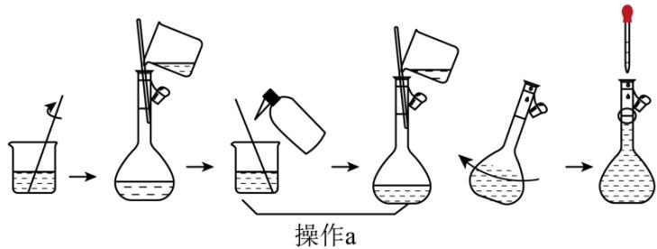

(5) “滴定分析”步骤中, 下列操作错误的是\_\_\_\_(填标号)。

A. $\mathrm{KMnO}_{4}$ 溶液置于酸式滴定管中

B. 用量筒量取 $25.00 \mathrm{~mL}$ 过氧化脲溶液  
C. 滴定近终点时，用洗瓶冲洗锥形瓶内壁  
D. 锥形瓶内溶液变色后，立即记录滴定管液面刻度

(6) 以下操作导致氧化脲纯度测定结果偏低的是\_\_\_\_(填标号)。
A. 容量瓶中液面超过刻度线
B. 滴定管水洗后未用 $\mathrm{KMnO}_{4}$ 溶液润洗
C. 摇动锥形瓶时 $\mathrm{KMnO}_{4}$ 溶液滴到锥形瓶外
D. 滴定前滴定管尖嘴处有气泡，滴定后气泡消失

【答案】(1) 烧杯、漏斗、玻璃棒, 可任选两种作答
(2) 50% (3) ①. 液体分层, 上层为无色, 下层为紫红色 ②. 还原性、氧化性
(4) ①. 避免溶质损失 ②. 盖好瓶塞, 反复上下颠倒、摇匀 (5) BD (6) A

【小问 1 详解】

过滤操作需要的玻璃仪器有烧杯、漏斗、玻璃棒，可任选两种作答。

【小问 2 详解】

实验中加入尿素的质量为12.0g，物质的量为0.2mol，过氧化氢的质量为 $25\mathrm{mL}\times1.11\mathrm{g}\cdot\mathrm{cm}^{-3}\times30\%=8.325\mathrm{g}$ ，物质的量约为0.245mol，过氧化氢过量，产率应按照尿素的质量计算，理论上可得到过氧化脲0.2mol，质量为 $0.2\mathrm{mol}\times94\mathrm{g}/\mathrm{mol}=18.8\mathrm{g}$ ，实验中实际得到过氧化脲9.4g，故过氧化脲的产率为 $\frac{9.4\mathrm{g}}{18.8\mathrm{g}}\times100\%=50\%$ 。

【小问 3 详解】

在过氧化脲的性质检测中，检测Ⅰ用稀硫酸酸化，加入高锰酸钾溶液，紫红色消失，说明过氧化脲被酸性高锰酸钾氧化，体现了过氧化脲的还原性；检测Ⅱ用稀硫酸酸化，加入KI溶液和四氯化碳溶液，过氧化脲会将KI氧化为 $I_{2}$ 单质，体现了过氧化脲的氧化性，生成的 $I_{2}$ 在四氯化碳中溶解度大，会溶于四氯化碳溶液，且四氯化碳密度大于水，振荡，静置后出现的现象为：液体分层，上层为无色，下层为紫红色。

【小问 4 详解】

操作 a 为洗涤烧杯和玻璃棒，并将洗涤液转移到容量瓶中，目的是避免溶质损失；定容后应盖好瓶塞，反复上下颠倒、摇匀。

【小问 5 详解】

A. $\mathrm{KMnO_4}$ 溶液是强氧化性溶液, 应置于酸式滴定管中, A 项正确;  
B. 量筒的精确度不能达到 $0.01 \mathrm{~mL}$ , 量取 $25.00 \mathrm{~mL}$ 的溶液应选用滴定管, B 项错误;

C. 滴定过程中，待测液有可能会溅到锥形瓶内壁，滴定近终点时，为了使结果更精确，可用洗瓶冲洗锥形瓶内壁，C项正确；  
D. 锥形瓶内溶液变色后，应等待 $30\mathrm{s}$ ，观察溶液不再恢复原来的颜色后，才能记录滴定管液面刻度，D项错误；  
故选BD。

A. 在配制过氧化脲溶液时，容量瓶中页面超过刻度线，会使溶液体积偏大，配制溶液的浓度偏低，会使滴定过程中消耗的 $\mathrm{KMnO_4}$ 溶液体积偏低，导致测定结果偏低，A项符合题意；  
B. 滴定管水洗后未用 $\mathrm{KMnO_4}$ 溶液润洗，会导致 $\mathrm{KMnO_4}$ 溶液浓度偏低，会使滴定过程中消耗的 $\mathrm{KMnO_4}$ 溶液体积偏高，导致测定结果偏高，B项不符合题意；  
C. 摇动锥形瓶时 $\mathrm{KMnO_4}$ 溶液滴到锥形瓶外，会使滴定过程中消耗的 $\mathrm{KMnO_4}$ 溶液体积偏高，导致测定结果偏高，C项不符合题意；  
D. 滴定前滴定管尖嘴处有气泡，滴定后气泡消失，会使滴定过程中消耗的 $\mathrm{KMnO_4}$ 溶液体积偏高，导致测定结果偏高，D项不符合题意；  
故选A。

10. 甲烷转化为多碳化合物具有重要意义。一种将甲烷溴化再偶联为丙烯 $\left(\mathrm{C}_{3} \mathrm{H}_{6}\right)$ 的研究所获得的部分数据如下。回答下列问题:

（1）已知如下热化学方程式：

$$
\mathrm{CH} _ {4} (\mathrm{g}) + \mathrm{Br} _ {2} (\mathrm{g}) = \mathrm{CH} _ {3} \mathrm{Br} (\mathrm{g}) + \mathrm{HBr} (\mathrm{g}) \quad \Delta \mathrm{H} _ {1} = - 2 9 \mathrm{kJ} \cdot \mathrm{mol} ^ {- 1}
$$

$$
3 \mathrm{CH} _ {3} \mathrm{Br} (\mathrm{g}) = \mathrm{C} _ {3} \mathrm{H} _ {6} (\mathrm{g}) + 3 \mathrm{HBr} (\mathrm{g}) \quad \Delta \mathrm{H} _ {2} = + 2 0 \mathrm{kJ} \cdot \mathrm{mol} ^ {- 1}
$$

计算反应 $3\mathrm{CH}_{4}(\mathrm{g}) + 3\mathrm{Br}_{2}(\mathrm{g}) = \mathrm{C}_{3}\mathrm{H}_{6}(\mathrm{g}) + 6\mathrm{HBr}(\mathrm{g})$ 的 $\Delta \mathrm{H} =$ \_\_\_\_ $\mathrm{kJ}\cdot \mathrm{mol}^{-1}$

(2) $\mathrm{CH}_{4}$ 与 $\mathrm{Br}_{2}$ 反应生成 $\mathrm{CH}_{3} \mathrm{Br}$ , 部分 $\mathrm{CH}_{3} \mathrm{Br}$ 会进一步溴化。将 $8 \mathrm{mmol} \mathrm{CH}_{4}$ 和 $8 \mathrm{mmol} \mathrm{Br}_{2}$ 。通入密闭容器, 平衡时, $\mathrm{n}(\mathrm{CH}_{4})$ 、 $\mathrm{n}(\mathrm{CH}_{3} \mathrm{Br})$ 与温度的关系见下图(假设反应后的含碳物质只有 $\mathrm{CH}_{4}$ 、 $\mathrm{CH}_{3} \mathrm{Br}$ 和 $\mathrm{CH}_{2} \mathrm{Br}_{2}$ )。

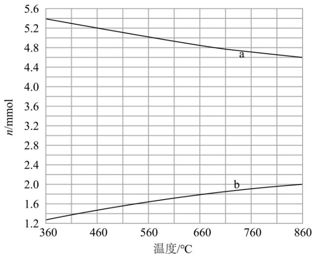

(i)图中 $CH_{3}Br$ 的曲线是\_\_\_\_(填 “a” 或 “b”)。

(ii) $560^{\circ} \mathrm{C}$ 时, $\mathrm{CH}_{4}$ 的转化 $\alpha =$ \_\_\_\_, $\mathrm{n(HBr)} =$ \_\_\_\_ mmol。

(iii) $560^{\circ} \mathrm{C}$ 时，反应 $\mathrm{CH}_{3} \mathrm{Br}(\mathrm{~g}) + \mathrm{Br}_{2}(\mathrm{~g}) = \mathrm{CH}_{2} \mathrm{Br}_{2}(\mathrm{~g}) + \mathrm{HBr}(\mathrm{~g})$ 的平衡常数 $\mathrm{K} =$ \_\_\_\_。

(3) 少量 $\mathrm{I}_{2}$ 可提高生成 $\mathrm{CH}_{3} \mathrm{Br}$ 的选择性。 $500^{\circ} \mathrm{C}$ 时, 分别在有 $\mathrm{I}_{2}$ 和无 $\mathrm{I}_{2}$ 的条件下, 将 $8 \mathrm{mmol} \mathrm{CH}_{4}$ 和 $8 \mathrm{mmol} \mathrm{Br}_{2}$ , 通入密闭容器, 溴代甲烷的物质的量 (n) 随时间 (t) 的变化关系见下图。

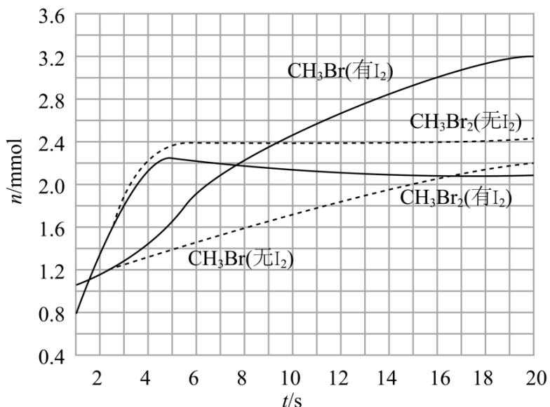

(i)在11\~19s之间，有 $I_{2}$ 和无 $I_{2}$ 时 $CH_{3}Br$ 的生成速率之比 $\frac{v(有I_{2})}{v(无I_{2})}=$ \_\_\_\_。

(ii)从图中找出 $\mathrm{I}_{2}$ 提高了 $\mathrm{CH}_{3} \mathrm{Br}$ 选择性的证据: \_\_\_\_。

(iii)研究表明， $I_{2}$ 参与反应的可能机理如下：

① $I_{2}(g)=\cdot I(g)+\cdot I(g)$

② $\cdot \mathrm{I(g)} + \mathrm{CH}_2\mathrm{Br}_2(\mathrm{g}) = \mathrm{IBr(g)} + \cdot \mathrm{CH}_2\mathrm{Br(g)}$

③ $\cdot CH_{2}Br(g)+HBr(g)=CH_{3}Br(g)+\cdot Br(g)$

④ $\cdot \mathrm{Br}(\mathrm{g}) + \mathrm{CH}_4(\mathrm{g}) = \mathrm{HBr}(\mathrm{g}) + \cdot \mathrm{CH}_3(\mathrm{g})$

⑤· $CH_{3}(g)+IBr(g)=CH_{3}Br(g)+\cdot I(g)$

⑥·I(g)+·I(g)=I₂(g)

根据上述机理，分析 $\mathrm{I}_2$ 提高 $\mathrm{CH}_3\mathrm{Br}$ 选择性的原因：\_\_\_\_。【答案】（1）-67 （2） ①. a ②. $80\%$ ③.7.8 ④.10.92

(3) ①. $\frac{3}{2}$ (或 3: 2) ②. $5 \mathrm{~s}$ 以后有 $\mathrm{I}_{2}$ 催化的 $\mathrm{CH}_{2} \mathrm{Br}_{2}$ 的含量逐渐降低, 有 $\mathrm{I}_{2}$ 催化的 $\mathrm{CH}_{3} \mathrm{Br}$ 的含量陡然上升 ③. $\mathrm{I}_{2}$ 的投入消耗了部分 $\mathrm{CH}_{2} \mathrm{Br}_{2}$ , 使得消耗的 $\mathrm{CH}_{2} \mathrm{Br}_{2}$ 发生反应生成了 $\mathrm{CH}_{3} \mathrm{Br}$

【解析】

【分析】根据盖斯定律计算化学反应热；根据影响化学反应速率的因素判断还行反应进行的方向从而判断曲线归属；根据反应前后的变化量计算转化率；根据平衡时各物质的物质的量计算平衡常数；根据一段时间内物质的含量变化计算速率并计算速率比；根据图示信息和反应机理判断合适的原因。

【小问 1 详解】

将第一个热化学方程式命名为①，将第二个热化学方程式命名为②。根据盖斯定律，将方程式①乘以3再加上方程式②，即①×3+②，故热化学方程式 $3\mathrm{CH}_{4}(\mathrm{g})+3\mathrm{Br}_{2}(\mathrm{g})=\mathrm{C}_{3}\mathrm{H}_{6}(\mathrm{g})+6\mathrm{HBr}(\mathrm{g})$ 的 $\Delta H=-29\times3+20=-67kJ\cdot mol^{-1}$ 。

【小问 2 详解】

(i)根据方程式①，升高温度，反应向吸热反应方向移动，升高温度，平衡逆向移动， $\mathrm{CH}_4(\mathrm{g})$ 的含量增多， $\mathrm{CH}_3\mathrm{Br}(\mathrm{g})$ 的含量减少，故 $\mathrm{CH}_3\mathrm{Br}$ 的曲线为 a;

(ii) $560^{\circ} \mathrm{C}$ 时反应达平衡, 剩余的 $\mathrm{CH}_{4}(\mathrm{~g})$ 的物质的量为 $1.6 \mathrm{mmol}$ , 其转化率 $\alpha = \frac{(8 \mathrm{mmol} - 1.6 \mathrm{mmol})}{8 \mathrm{mmol}} \times 100\% = 80\%$ ; 若只发生一步反应, 则生成 $6.4 \mathrm{mmol} \mathrm{CH}_{3} \mathrm{Br}$ , 但此时剩余 $\mathrm{CH}_{3} \mathrm{Br}$ 的物质的量为 $5.0 \mathrm{mmol}$ , 说明还有 $1.4 \mathrm{mmol} \mathrm{CH}_{3} \mathrm{Br}$ 发生反应生成 $\mathrm{CH}_{2} \mathrm{Br}_{2}$ , 则此时生成的 $\mathrm{HBr}$ 的物质的量 $n = 6.4 + 1.4 = 7.8 \mathrm{mmol}$ ;

(iii)平衡时，反应中各组分的物质的量分别为 $n(\mathrm{CH}_3\mathrm{Br}) = 5.0\mathrm{mmol}$ 、 $n(\mathrm{Br}_2) = 0.2\mathrm{mmol}$ 、 $n(\mathrm{CH}_2\mathrm{Br}_2) = 1.4\mathrm{mmol}$ 、 $n(\mathrm{HBr}) = 7.8\mathrm{mmol}$ ，故该反应的平衡常数 $K = \frac{c(\mathrm{CH}_2\mathrm{Br}_2)\cdot c(\mathrm{HBr})}{c(\mathrm{CH}_3\mathrm{Br})\cdot c(\mathrm{Br}_2)} = \frac{\frac{1.4}{V}\times\frac{7.8}{V}}{\frac{5.0}{V}\times\frac{0.2}{V}} = 10.92$ 。

【小问 3 详解】

(i)11\~19s 时，有 $I_{2}$ 的生成速率 $v=\frac{\frac{3.2}{V}-\frac{2.6}{V}}{8}=\frac{0.075}{V}mmol\cdot(L\cdot s)^{-1}$ ，无 $I_{2}$ 的生成速率 $v=\frac{\frac{2.2}{V}-\frac{1.8}{V}}{8}=\frac{0.05}{V}mmol\cdot(L\cdot s)^{-1}$ 。生成速率比 $\frac{v(\text{有 }I_{2})}{v(\text{无 }I_{2})}=\frac{\frac{0.075}{V}}{\frac{0.05}{V}}=\frac{3}{2}$ ;

(ii)从图中可以看出，大约 4.5s 以后有 $\mathrm{I}_2$ 催化的 $\mathrm{CH}_2\mathrm{Br}_2$ 的含量逐渐降低，有 $\mathrm{I}_2$ 催化的 $\mathrm{CH}_3\mathrm{Br}$ 的含量陡然上升，因此，可以利用此变化判断 $\mathrm{I}_2$ 提高了 $\mathrm{CH}_3\mathrm{Br}$ 的选择性；

(iii)根据反应机理， $\mathrm{I}_2$ 的投入消耗了部分 $\mathrm{CH}_2\mathrm{Br}_2$ ，同时也消耗了部分 $\mathrm{HBr}$ ，使得消耗的 $\mathrm{CH}_2\mathrm{Br}_2$ 发生反应生成了 $\mathrm{CH}_3\mathrm{Br}$ ，提高了 $\mathrm{CH}_3\mathrm{Br}$ 的选择性。

## [化学—选修3：物质结构与性质]

11. IVA 族元素具有丰富的化学性质，其化合物有着广泛的应用。回答下列问题：

（1）该族元素基态原子核外未成对电子数为\_\_\_\_，在与其他元素形成化合物时，呈现的最高化合价为\_\_\_\_。

(2) $\mathrm{CaC}_{2}$ 俗称电石, 该化合物中不存在的化学键类型为\_\_\_\_(填标号)。a. 离子键 b. 极性共价键 c. 非极性共价键 d. 配位键

（3）一种光刻胶薄膜成分为聚甲基硅烷 $\left[\begin{array}{c}\mathrm{CH}_{3} \\ \mathrm{Si} \\ \mathrm{H}\end{array}\right]_{n}$ ，其中电负性最大的元素是\_\_\_\_，硅原子的杂化轨道类型为\_\_\_\_。

(4) 早在青铜器时代, 人类就认识了锡。锡的卤化物熔点数据如下表, 结合变化规律说明原因: \_\_\_\_。

<table><tr><td>物质</td><td> $SnF_{4}$ </td><td> $SnCl_{4}$ </td><td> $SnBr_{4}$ </td><td> $SnI_{4}$ </td></tr><tr><td>熔点/°C</td><td>442</td><td>-34</td><td>29</td><td>143</td></tr></table>

(5) 结晶型 PbS 可作为放射性探测器元件材料, 其立方晶胞如图所示。其中 Pb 的配位数为\_\_\_\_。设 $\mathrm{N}_{\mathrm{A}}$ 为阿伏加德罗常数的值, 则该晶体密度为\_\_\_\_ $\mathrm{g} \cdot \mathrm{cm}^{-3}$ (列出计算式)。

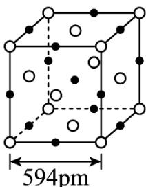

【答案】(1) ①.2 ②.+4
(2) bd (3) ①.C ②. $sp^{3}$

(4) $\mathrm{SnF_4}$ 属于离子晶体, $\mathrm{SnCl_4}$ 、 $\mathrm{SnBr_4}$ 、 $\mathrm{SnI_4}$ 属于分子晶体, 离子晶体的熔点比分子晶体的高, 分子晶体的相对分子量越大, 分子间作用力越强, 熔点越高 (5) ①.6 ②. $\frac{4\times(207+32)}{\mathrm{N}_{\mathrm{A}}\times(594\times10^{-10})^{3}}\mathrm{g}\cdot\mathrm{cm}^{-3}$ 或 $\frac{956}{\mathrm{N}_{\mathrm{A}}\times(594\times10^{-10})^{3}}\mathrm{g}\cdot\mathrm{cm}^{-3}$

【解析】

【小问1详解】

IVA 族元素基态原子的价层电子排布为 $ns^{2}np^{2}$ ，其核外未成对电子数为 2，因最外层电子数均为 4，所以在与其他元素形成化合物时，呈现的最高化合价为 +4；

【小问 2 详解】

$CaC_{2}$ 俗称电石，其为离子化合物，由 $Ca^{2+}$ 和 $C_{2}^{2-}$ 构成，两种离子间存在离子键， $C_{2}^{2-}$ 中两个C原子之间存在非极性共价键，因此，该化合物中不存在的化学键类型为极性共价键和配位键，故选bd；

【小问 3 详解】

一种光刻胶薄膜成分为聚甲基硅烷 $\left[\begin{array}{c}\mathrm{CH}_{3} \\ \mathrm{Si} \\ \mathrm{H}\end{array}\right]_{n}$ ，含C、Si、H三种元素，其电负性大小：C>H>Si，则电负性最大的元素是C，硅原子与周围的4个原子形成共价键，没有孤电子对，价层电子对数为4，则硅原子的杂化轨道类型为 $sp^{3}$ ；

【小问 4 详解】

根据表中数据可知， $\mathrm{SnF_4}$ 的熔点均远高于其余三种物质，故 $\mathrm{SnF_4}$ 属于离子晶体， $\mathrm{SnCl_4}$ 、 $\mathrm{SnBr_4}$ 、 $\mathrm{SnI_4}$ 属于分子晶体，离子晶体的熔点比分子晶体的高， $\mathrm{SnCl_4}$ 、 $\mathrm{SnBr_4}$ 、 $\mathrm{SnI_4}$ 三种物质的相对分子质量依次增大，分子间作用力依次增强，熔点升高，故原因为： $\mathrm{SnF_4}$ 属于离子晶体， $\mathrm{SnCl_4}$ 、 $\mathrm{SnBr_4}$ 、 $\mathrm{SnI_4}$ 属于分子晶体，离子晶体的熔点比分子晶体的高，分子晶体的相对分子量越大，分子间作用力越强，熔点越高；

【小问 5 详解】

由 PbS 晶胞结构图可知，该晶胞中有 4 个 Pb 和 4 个 S，距离每个原子周围最近的原子数均为 6，因此 Pb 的配位数为 6。设 $N_{A}$ 为阿伏加德罗常数的值，则 $N_{A}$ 个晶胞的质量为 $4 \times (207 + 32) \, \text{g}$ ， $N_{A}$ 个晶胞的体积为 $N_{A} \times (594 \times 10^{-10} \, \text{cm})^{3}$ ，因此该晶体密度为

$$
\frac {4 \times (2 0 7 + 3 2)}{\mathrm{N} _ {\mathrm{A}} \times (5 9 4 \times 1 0 ^ {- 1 0}) ^ {3}} \mathrm{g} \cdot \mathrm{cm} ^ {- 3} \text {或} \frac {9 5 6}{\mathrm{N} _ {\mathrm{A}} \times (5 9 4 \times 1 0 ^ {- 1 0}) ^ {3}} \mathrm{g} \cdot \mathrm{cm} ^ {- 3} 。
$$

## [化学—选修5：有机化学基础]

12. 白藜芦醇(化合物 I)具有抗肿瘤、抗氧化、消炎等功效。以下是某课题组合成化合物 I 的路线。

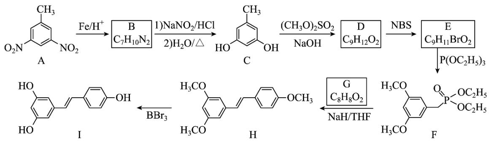

回答下列问题:

(1) A 中的官能团名称为\_\_\_\_。

(2) B 的结构简式为\_\_\_\_。

（3）由 C 生成 D 的反应类型为\_\_\_\_。

(4) 由 E 生成 F 的化学方程式为\_\_\_\_。

(5) 已知 G 可以发生银镜反应, G 的化学名称为\_\_\_\_。

(6) 选用一种鉴别 H 和 I 的试剂并描述实验现象\_\_\_\_。

(7) I 的同分异构体中, 同时满足下列条件的共有\_\_\_\_种(不考虑立体异构)。

①含有手性碳(连有4个不同的原子或基团的碳为手性碳);

②含有两个苯环；③含有两个酚羟基；④可发生银镜反应。

【答案】(1) 硝基

(2)

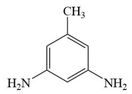

(3) 取代反应

(4)

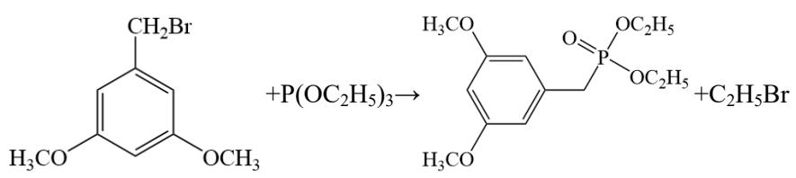

(5) 4-甲氧基苯甲醛(或对甲氧基苯甲醛)

(6) 鉴别试剂为: $\mathrm{FeCl}_{3}$ 溶液, 实验现象为: 分别取少量有机物 H 和有机物 I 的固体用于水配置成溶液, 向溶液中滴加 $\mathrm{FeCl}_{3}$ 溶液, 溶液呈紫色的即为有机物 I

(7) 9

【解析】

【分析】根据流程，有机物 A 在 $Fe/H^{+}$ 的作用下发生还原反应生成有机物 B，根据有机物 B 的分子式和有

机物 A 的结构可以得到有机物 B 的结构为

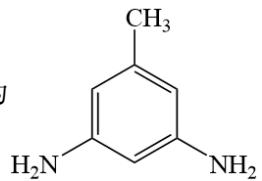

的氨基氧化为羟基，得到有机物 C；有机物 C 发生取代反应得到有机物 D，根据有机物 D 的分子式可以推

出有机物 D 为 $\text{CH}_3\text{C}_6\text{H}_4\text{OCH}_3$ ；有机物 D 与 NBS 发生取代反应得到有机物 E，根据有机物 E 的分子

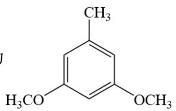

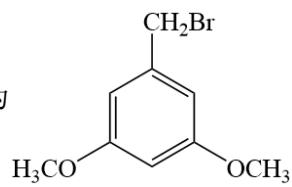

$$
\mathrm{P} \left(\mathrm{OC} _ {2} \mathrm{H} _ {5}\right) _ {3}
$$

有机物 G 发生反应得到有机物 H，结合有机物 H 的结构、有机物 G 的分子式和小问 5 的已知条件可以得到

有机物 G 的结构为 $OHC-\left\langle\right\rangle-OCH_{3}$ ；最后，有机物 H 与 $BBr_{3}$ 反应得到目标化合物 I。据此分析解题：

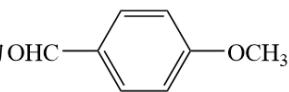

【小问 1 详解】

根据有机物 A 的结构可知，A 的官能团为硝基；

【小问 2 详解】

根据分析，有机物 B 的结构简式为:

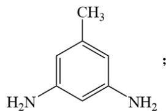

【小问 3 详解】

根据分析, 有机物 C 发生反应生成有机物 D 是将 C 中的羟基取代为甲氧基得到有机物 D, 故反应类型为取代反应;

【小问 4 详解】

根据分析,有机物 E 与 $\mathrm{P}(\mathrm{OC}_{2}\mathrm{H}_{5})_{3}$ 发生反应得到有机物 F, 反应方程式为:

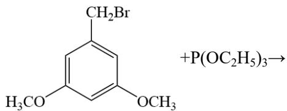

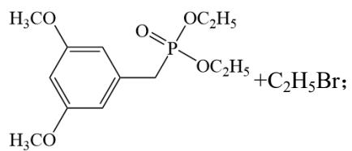

【小问5详解】

有机物 G 可以发生银镜反应说明有机物 G 中含有醛基，结合其分子式和有机物 F 和有机物 H 的结构可以得到有机物 G 的结构为 $\ce{OHC-\underset{\vert\vert}{\ce{C6H5}}-OCH3}$ ，其化学名称为：4-甲氧基苯甲醛(或对甲氧基苯甲醛);

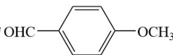

【小问6详解】

对比有机物 H 和有机物 I 的结构可以看出，有机物 I 中含有酚羟基，可以由此进行鉴别，鉴别试剂为 $FeCl_{3}$ 溶液，实验现象为分别取少量有机物 H 和有机物 I 的固体用于水配置成溶液，向溶液中滴加 $FeCl_{3}$ 溶液，溶液呈紫色的即为有机物 I；

【小问7详解】

对于有机物I的同分异构体，可以发生银镜反应说明含有醛基；含有手性碳原子，说明有饱和碳原子，可

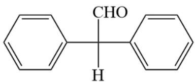

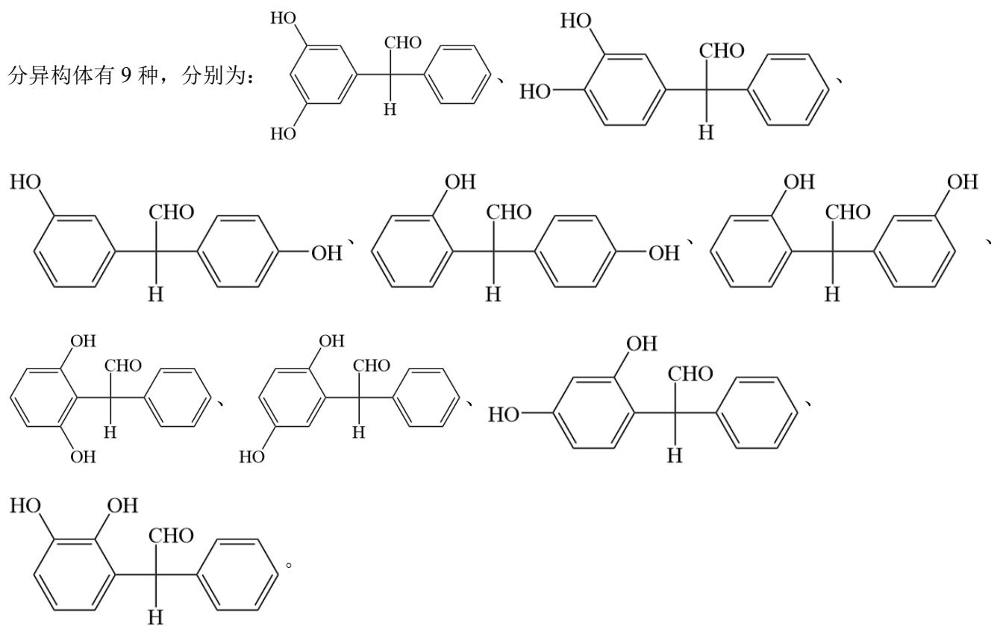