# 2024年普通高中学业水平等级性考试(北京卷)

# 化学

本试卷满分 100 分，考试时间 90 分钟。

可能用到的相对原子质量：H-1 C-12 N-14 O-16

## 第一部分

## 本部分共 14 题，每题 3 分，共 42 分。在每题列出的四个选项中，选出最符合题目要求的一项。

1. 我国科研人员利用激光操控方法，从 $\mathrm{Ca}$ 原子束流中直接俘获 $^{41}\mathrm{Ca}$ 原子，实现了对同位素 $^{41}\mathrm{Ca}$ 的灵敏检测。 $^{41}\mathrm{Ca}$ 的半衰期(放射性元素的原子核有半数发生衰变所需的时间)长达10万年，是 $^{14}\mathrm{C}$ 的17倍，可应用于地球科学与考古学。下列说法正确的是

A. $^{41}\mathrm{Ca}$ 的原子核内有 21 个中子  
B. $^{41}\mathrm{Ca}$ 的半衰期长，说明 $^{41}\mathrm{Ca}$ 难以失去电子  
C. $^{41}\mathrm{Ca}$ 衰变一半所需的时间小于 $^{14}\mathrm{C}$ 衰变一半所需的时间  
D. 从 $\mathrm{Ca}$ 原子束流中直接俘获 $^{41}\mathrm{Ca}$ 原子的过程属于化学变化

【详解】A. $^{41}\mathrm{Ca}$ 的质量数为 41，质子数为 20，所以中子数为 $41 - 20 = 21$ ，A 正确；  
B. $^{41}\mathrm{Ca}$ 的半衰期长短与得失电子能力没有关系，B 错误；  
C. 根据题意 $^{41}\mathrm{Ca}$ 衰变一半所需的时间要大于 $^{14}\mathrm{C}$ 衰变半所需的时间，C 错误；  
D. 从 $\mathrm{Ca}$ 原子束流中直接俘获 $^{41}\mathrm{Ca}$ 原子的过程没有新物质产生，不属于化学变化，D 错误；

本题选 A。

2. 下列化学用语或图示表达不正确的是

A. $\mathrm{H}_2\mathrm{O}_2$ 的电子式: $\mathrm{H}^+\left[:\ddot{\mathrm{O}}:\ddot{\mathrm{O}}:\right]^{2-}\mathrm{H}^+$ B. $\mathrm{CH}_4$ 分子的球棍模型:

$$
\mathrm{Al} ^ {3 +}
$$

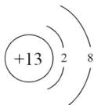

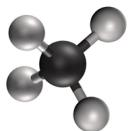

【答案】A

【解析】

【详解】A. $H_{2}O_{2}$ 是共价化合物，其电子式为 H: O: O: H，故 A 错误；

B. $\mathrm{CH}_{4}$ 为正四面体形, $\mathrm{CH}_{4}$ 分子的球棍模型:

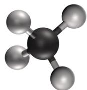

故 B 正确;

C. Al 的原子序数为 13，即 $Al^{3+}$ 的结构示意图： $\left(+13\right)^{2}$ ，故 C 正确；

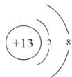

D. 乙炔含有碳碳三键，结构式为： $H - C \equiv C - H$ ，故 D 正确；

故选A。

3. 酸性锌锰干电池的构造示意图如下。关于该电池及其工作原理，下列说法正确的是

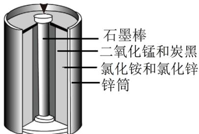

A. 石墨作电池的负极材料
B. 电池工作时, $\mathrm{NH}_{4}^{+}$ 向负极方向移动
C. $\mathrm{MnO}_{2}$ 发生氧化反应
D. 锌筒发生的电极反应为 $Zn - 2e^{-} = Zn^{2+}$

【答案】D

【解析】

【详解】A．酸性锌锰干电池，锌筒为负极，石墨电极为正极，故 A 错误；

B. 原电池工作时, 阳离子向正极(石墨电极)方向移动, 故 B 错误;

C. $\mathrm{MnO}_2$ 发生得电子的还原反应，故 C 错误；  
D. 锌筒为负极，负极发生失电子的氧化反应 $\mathrm{Zn - 2e^{-} = Zn^{2 + }}$ ，故 D 正确；故选 D。

4. 下列说法不正确的是
A. 葡萄糖氧化生成 $\mathrm{CO}_{2}$ 和 $\mathrm{H}_{2} \mathrm{O}$ 的反应是放热反应
B. 核酸可看作磷酸、戊糖和碱基通过一定方式结合而成的生物大分子
C. 由氨基乙酸形成的二肽中存在两个氨基和两个羧基
D. 向饱和的 NaCl 溶液中加入少量鸡蛋清溶液会发生盐析

【详解】A. 葡萄糖氧化生成 $\mathrm{CO}_{2}$ 和 $\mathrm{H}_{2} \mathrm{O}$ 是放热反应，在人体内葡萄糖缓慢氧化成 $\mathrm{CO}_{2}$ 和 $\mathrm{H}_{2} \mathrm{O}$ 为人体提供能量，A项正确；  
B. 核酸是一种生物大分子，分析核酸水解的产物可知，核酸是由许多核苷酸单体形成的聚合物，核苷酸进一步水解得到磷酸和核苷，核苷进一步水解得到戊糖和碱基，故核酸可看作磷酸、戊糖和碱基通过一定方式结合而成的生物大分子，B项正确；  
C. 氨基乙酸的结构简式为 $\mathrm{H}_{2} \mathrm{NCH}_{2} \mathrm{COOH}$ ，形成的二肽的结构简式为 $\mathrm{H}_{2} \mathrm{NCH}_{2} \mathrm{CONHCH}_{2} \mathrm{COOH}$ ，该二肽中含1个氨基、1个羧基和1个肽键，C项错误；  
D. 鸡蛋清溶液为蛋白质溶液，NaCl溶液属于轻金属盐溶液，向饱和NaCl溶液中加入少量鸡蛋清溶液，蛋白质发生盐析，D项正确；  
答案选C。

5. 下列方程式与所给事实不相符的是
A. 海水提溴过程中，用氯气氧化苦卤得到溴单质： $2Br^{-}+Cl_{2}=Br_{2}+2Cl^{-}$ B. 用绿矾 $\left(\mathrm{FeSO}_{4}\cdot7\mathrm{H}_{2}\mathrm{O}\right)$ 将酸性工业废水中的 $Cr_{2}O_{7}^{2-}$ 转化为 $Cr^{3+}:6Fe^{2+}+Cr_{2}O_{7}^{2-}+14H^{+}=6Fe^{3+}+2Cr^{3+}+7H_{2}O$ C. 用 $5\% Na_{2}SO_{4}$ 溶液能有效除去误食的 $Ba^{2+}:SO_{4}^{2-}+Ba^{2+}=BaSO_{4}\downarrow$ D. 用 $Na_{2}CO_{3}$ 溶液将水垢中的 $CaSO_{4}$ 转化为溶于酸的 $CaCO_{3}$ ： $Ca^{2+}+CO_{3}^{2-}=CaCO_{3}\downarrow$ 【答案】D
【解析】

【详解】A. 氯气氧化苦卤得到溴单质，发生置换反应，离子方程式正确，A 正确；  
B. $\mathrm{Cr_2O_7^{2-}}$ 可以将 $\mathrm{Fe}^{2+}$ 氧化成 $\mathrm{Fe}^{3+}$ ，离子方程式正确，B 正确；  
C. $\mathrm{SO}_4^{2-}$ 结合 $\mathrm{Ba}^{2+}$ 生成 $\mathrm{BaSO}_4$ 沉淀，可以阻止 $\mathrm{Ba}^{2+}$ 被人体吸收，离子方程式正确，C 正确；  
D. $\mathrm{Na}_2\mathrm{CO}_3$ 与 $\mathrm{CaSO}_4$ 反应属于沉淀的转化， $\mathrm{CaSO}_4$ 不能拆分，正确的离子方程式为 $\mathrm{CaSO}_4 + \mathrm{CO}_3^{2-} = \mathrm{CaCO}_3 + \mathrm{SO}_4^{2-}$ ，D 错误；  
本题选 D。

6. 下列实验的对应操作中，不合理的是

<table><tr><td></td><td></td></tr><tr><td>A. 用HCl标准溶液滴定NaOH溶液</td><td>B. 稀释浓硫酸</td></tr><tr><td></td><td></td></tr><tr><td>C. 从提纯后的NaCl溶液获得NaCl晶体</td><td>D. 配制一定物质的量浓度的KCl溶液</td></tr></table>

A.A B.B C.C D.D

【答案】D

【解析】

【详解】A．用 HCl 标准溶液滴定 NaOH 溶液时，眼睛应注视锥形瓶中溶液，以便观察溶液颜色的变化从而判断滴定终点，A 项合理；

B. 浓硫酸的密度比水的密度大, 浓硫酸溶于水放热, 故稀释浓硫酸时应将浓硫酸沿烧杯内壁缓慢倒入盛水的烧杯中, 并用玻璃棒不断搅拌, B 项合理;

C. NaCl 的溶解度随温度升高变化不明显, 从 NaCl 溶液中获得 NaCl 晶体采用蒸发结晶的方法, C 项合理; D. 配制一定物质的量浓度的溶液时, 玻璃棒引流低端应该在容量瓶刻度线以下; 定容阶段, 当液面在刻度线以下约 $1 \mathrm{~cm}$ 时, 应改用胶头滴管滴加蒸馏水, D 项不合理; 答案选 D。

7. 硫酸是重要化工原料，工业生产制取硫酸的原理示意图如下。

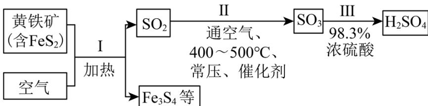

下列说法不正确的是
A. I 的化学方程式: $3\mathrm{FeS}_{2} + 8\mathrm{O}_{2} \triangleq \mathrm{Fe}_{3}\mathrm{O}_{4} + 6\mathrm{SO}_{2}$ B. II中的反应条件都是为了提高 $\mathrm{SO}_{2}$ 平衡转化率
C. 将黄铁和换成硫黄可以减少废渣的产生
D. 生产过程中产生的尾气可用碱液吸收

【解析】

【分析】黄铁矿和空气中的 $O_{2}$ 在加热条件下发生反应，生成 $SO_{2}$ 和 $Fe_{3}O_{4}$ ， $SO_{2}$ 和空气中的 $O_{2}$ 在 $400\sim500^{\circ}C$ 、常压、催化剂的作用下发生反应得到 $SO_{3}$ ，用 98.3% 的浓硫酸吸收 $SO_{3}$ ，得到 $H_{2}SO_{4}$ 。

【详解】A．反应 I 是黄铁矿和空气中的 $O_{2}$ 在加热条件下发生反应，生成 $SO_{2}$ 和 $Fe_{3}O_{4}$ ，化学方程式： $3FeS_{2}+8O_{2}\triangleq Fe_{3}O_{4}+6SO_{2}$ ，故 A 正确；

B. 反应II条件要兼顾平衡转化率和反应速率, 还要考虑生产成本, 如II中“常压、催化剂”不是为了提高 $\mathrm{SO}_{2}$ 平衡转化率, 故 B 错误;  
C. 将黄铁矿换成硫黄, 则不再产生 $\mathrm{Fe}_{3} \mathrm{O}_{4}$ , 即可以减少废渣产生, 故 C 正确;  
D. 硫酸工业产生的尾气为 $\mathrm{SO}_{2} 、 \mathrm{SO}_{3}$ , 可以用碱液吸收, 故 D 正确;

8. 关于 $\mathrm{Na}_{2} \mathrm{CO}_{3}$ 和 $\mathrm{NaHCO}_{3}$ 的下列说法中, 不正确的是  
A. 两种物质的溶液中, 所含微粒的种类相同  
B. 可用 $\mathrm{NaOH}$ 溶液使 $\mathrm{NaHCO}_{3}$ 转化为 $\mathrm{Na}_{2} \mathrm{CO}_{3}$

C. 利用二者热稳定性差异，可从它们的固体混合物中除去 $\mathrm{NaHCO}_3$ D. 室温下，二者饱和溶液的 $\mathrm{pH}$ 差约为4，主要是由于它们的溶解度差异【答案】D  
【解析】

【详解】A. $Na_{2}CO_{3}$ 和 $NaHCO_{3}$ 的溶液中均存在 $H_{2}O$ 、 $H_{2}CO_{3}$ 、 $H^{+}$ 、 $OH^{-}$ 、 $Na^{+}$ 、 $CO_{3}^{2-}$ 、 $HCO_{3}^{-}$ ，A 正确；

$$
\mathrm{NaHCO} _ {3}
$$

$$
\mathrm{NaOH}
$$

$$
\mathrm{NaOH} + \mathrm{NaHCO} _ {3} = \mathrm{Na} _ {2} \mathrm{CO} _ {3} + \mathrm{H} _ {2} \mathrm{O}
$$

C. $\mathrm{NaHCO}_{3}$ 受热易分解, 可转化为 $\mathrm{Na}_{2} \mathrm{CO}_{3}$ , 而 $\mathrm{Na}_{2} \mathrm{CO}_{3}$ 热稳定性较强, 利用二者热稳定性差异, 可从它们的固体混合物中除去 $\mathrm{NaHCO}_{3}, \mathrm{C}$ 正确; D. 室温下 $\mathrm{Na}_{2} \mathrm{CO}_{3}$ 和 $\mathrm{NaHCO}_{3}$ 饱和溶液 $\mathrm{pH}$ 相差较大的主要原因是 $\mathrm{CO}_{3}^{2-}$ 的水解程度远大于 $\mathrm{HCO}_{3}^{-}, \mathrm{D}$ 错误; 故选 D。

9. 氘代氨 $(\mathrm{ND}_3)$ 可用于反应机理研究。下列两种方法均可得到 $\mathrm{ND}_3$ ：① $\mathrm{Mg}_3\mathrm{N}_2$ 与 $\mathrm{D}_2\mathrm{O}$ 的水解反应；② $\mathrm{NH}_3$ 与 $\mathrm{D}_2\mathrm{O}$ 反应。下列说法不正确的是  
A. $\mathrm{NH}_3$ 和 $\mathrm{ND}_3$ 可用质谱法区分  
B. $\mathrm{NH}_3$ 和 $\mathrm{ND}_3$ 均为极性分子  
C. 方法①的化学方程式是 $\mathrm{Mg}_3\mathrm{N}_2 + 6\mathrm{D}_2\mathrm{O} = 3\mathrm{Mg}(\mathrm{OD})_2 + 2\mathrm{ND}_3$ ↑  
D. 方法②得到的产品纯度比方法①的高

【详解】A. $\mathrm{NH}_{3}$ 和 $\mathrm{ND}_{3}$ 的相对分子质量不同, 可以用质谱法区分, A 正确;  
B. $\mathrm{NH}_{3}$ 和 $\mathrm{ND}_{3}$ 的 H 原子不同, 但空间构型均为三角锥形, 是极性分子, B 正确;  
C. $\mathrm{Mg}_{3} \mathrm{~N}_{2}$ 与 $\mathrm{D}_{2} \mathrm{O}$ 发生水解生成 $\mathrm{Mg}(\mathrm{OD})_{2}$ 和 $\mathrm{ND}_{3}$ , 反应方法①的化学方程式书写正确, C 正确;  
D. 方法②是通过 $\mathrm{D}_{2} \mathrm{O}$ 中 D 原子代替 $\mathrm{NH}_{3}$ 中 H 原子的方式得到 $\mathrm{ND}_{3}$ , 代换的个数不同, 产物会不同, 纯度低, D 错误;  
故选 D。

10. 可采用 Deacon 催化氧化法将工业副产物 HCl 制成 $Cl_{2}$ ，实现氯资源的再利用。反应的热化学方程式： $4\mathrm{HCl(g)} + \mathrm{O}_{2(\mathrm{g})}\xlongequal{\mathrm{CuO}}2\mathrm{Cl}_{2(\mathrm{g})} + 2\mathrm{H}_{2}\mathrm{O(\mathrm{g})}\quad \Delta\mathrm{H} = -114.4\mathrm{kJ}\cdot\mathrm{mol}^{-1}$ 。下图所示为该法的一种催化机理。

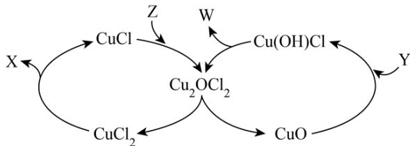

下列说法不正确的是
A. Y 为反应物 HCl，W 为生成物 $H_{2}O$ B. 反应制得 $1 \, mol Cl_{2}$ ，须投入 $2 \, mol CuO$ C. 升高反应温度，HCl 被 $O_{2}$ 氧化制 $Cl_{2}$ 的反应平衡常数减小
D. 图中转化涉及的反应中有两个属于氧化还原反应

【答案】B

【解析】

【分析】由该反应的热化学方程式可知，该反应涉及的主要物质有 HCl、 $O_{2}$ 、CuO、 $Cl_{2}$ 、 $H_{2}O$ ；CuO 与 Y 反应生成 Cu(OH)Cl，则 Y 为 HCl；Cu(OH)Cl 分解生成 W 和 $Cu_{2}OCl_{2}$ ，则 W 为 $H_{2}O$ ； $CuCl_{2}$ 分解为 X 和 CuCl，则 X 为 $Cl_{2}$ ；CuCl 和 Z 反应生成 $Cu_{2}OCl_{2}$ ，则 Z 为 $O_{2}$ ；综上所述，X、Y、Z、W 依次是 $Cl_{2}$ 、HCl、 $O_{2}$ 、 $H_{2}O$ 。

【详解】A. 由分析可知，Y 为反应物 HCl，W 为生成物 $H_{2}O$ ，A 正确；
B. CuO 在反应中作催化剂，会不断循环，适量即可，B 错误；
C. 总反应为放热反应，其他条件一定，升温平衡逆向移动，平衡常数减小，C 正确；
D. 图中涉及的两个氧化还原反应是 $CuCl_{2} \rightarrow CuCl$ 和 $CuCl \rightarrow Cu_{2}OCl_{2}$ ，D 正确；

11. $\mathrm{CO}_{2}$ 的资源化利用有利于实现“碳中和”。利用 $\mathrm{CO}_{2}$ 为原料可以合成新型可降解高分子P，其合成路线如下。

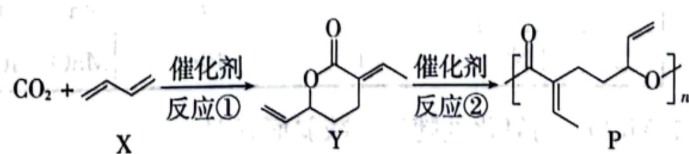

已知：反应①中无其他产物生成。下列说法不正确的是
A. $CO_{2}$ 与 X 的化学计量比为 1:2
B. P 完全水解得到的产物的分子式和 Y 的分子式相同
C. P 可以利用碳碳双键进一步交联形成网状结构
D. Y 通过碳碳双键的加聚反应生成的高分子难以降解

【答案】B

【解析】

【详解】A．结合已知信息，通过对比 X、Y 的结构可知 $CO_{2}$ 与 X 的化学计量比为 1:2，A 正确；

$$
\mathrm{C} _ {9} \mathrm{H} _ {1 4} \mathrm{O} _ {3}
$$

$\mathrm{C}_{9} \mathrm{H}_{12} \mathrm{O}_{2}$ ，二者分子式不相同，B 错误；  
C. P 的支链上有碳碳双键，可进一步交联形成网状结构，C 正确；  
D. Y 形成的聚酯类高分子主链上含有大量酯基，易水解，而 Y 通过碳碳双键加聚得到的高分子主链主要为长碳链，与聚酯类高分子相比难以降解，D 正确；  
故选 B。

12. 下列依据相关数据作出的推断中, 不正确的是  
A. 依据相同温度下可逆反应的 Q 与 K 大小的比较, 可推断反应进行的方向  
B. 依据一元弱酸的 $K_{a}$ , 可推断它们同温度同浓度稀溶液的 $\mathrm{pH}$ 大小  
C. 依据第二周期主族元素电负性依次增大, 可推断它们的第一电离能依次增大  
D. 依据 F、Cl、Br、I 的氢化物分子中氢卤键的键能, 可推断它们的热稳定性强弱

【解析】
【详解】A．对于可逆反应的 Q 与 K 的关系：Q>K，反应向逆反应方向进行；Q<K，反应向正反应方向进行；Q=K，反应处于平衡状态，故依据相同温度下可逆反应的 Q 与 K 大小的比较，可推断反应进行的方向，A 正确；
B．一元弱酸的 $K_{a}$ 越大，同温度同浓度稀溶液的酸性越强，电离出的 $H^{+}$ 越多，pH 越小，B 正确；
C．同一周期从左到右，第一电离能是增大的趋势，但是IIA大于IIIA，VA大于VIA，C不正确；
D．F、Cl、Br、I的氢化物分子中氢卤键的键能越大，氢化物的热稳定性越强，D正确；
故选 C。

13. 苯在浓 $\mathrm{HNO}_3$ 和浓 $\mathrm{H}_2\mathrm{SO}_4$ 作用下，反应过程中能量变化示意图如下。下列说法不正确的是

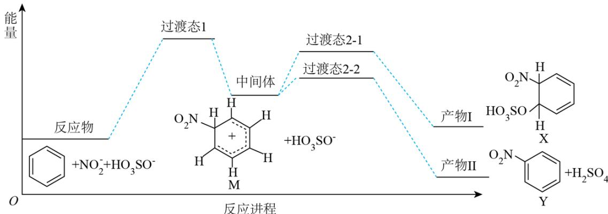

A. 从中间体到产物，无论从产物稳定性还是反应速率的角度均有利于产物II  
B. X为苯的加成产物，Y为苯的取代产物  
C. 由苯得到M时，苯中的大 $\pi$ 键没有变化  
D. 对于生成Y的反应，浓 $\mathrm{H}_2\mathrm{SO}_4$ 作催化剂

【详解】A．生成产物II的反应的活化能更低，反应速率更快，且产物II的能量更低即产物II更稳定，以上2个角度均有利于产物II，故A正确；  
B．根据前后结构对照，X为苯的加成产物，Y为苯的取代产物，故B正确；  
C．M的六元环中与 $-\mathrm{NO}_2$ 相连的C为 $\mathfrak{sp}^3$ 杂化，苯中大π键发生改变，故C错误；  
D．苯的硝化反应中浓 $\mathrm{H}_2\mathrm{SO}_4$ 作催化剂，故D正确；  
故选C。

14. 不同条件下，当 $\mathrm{KMnO_4}$ 与KI按照反应①②的化学计量比恰好反应，结果如下。

<table><tr><td>反应序号</td><td>起始酸碱性</td><td>KI物质的量/mol</td><td>KMnO4物质的量/mol</td><td>还原产物</td><td>氧化产物</td></tr><tr><td>1</td><td>酸性</td><td>0.001</td><td>n</td><td> $Mn^{2+}$ </td><td> $I_2$ </td></tr><tr><td>2</td><td>中性</td><td>0.001</td><td>10n</td><td> $MnO_2$ </td><td> $IO_x^-$ </td></tr></table>

已知： $\mathrm{MnO}_{4}^{-}$ 的氧化性随酸性减弱而减弱。下列说法正确的是  
A. 反应①， $\mathrm{n}\left(\mathrm{Mn}^{2+}\right):\mathrm{n}\left(\mathrm{I}_{2}\right)=1:5$ B. 对比反应①和②， $\mathrm{x}=3$ C. 对比反应①和②， $\mathrm{I}^{-}$ 的还原性随酸性减弱而减弱  
D. 随反应进行，体系 $\mathrm{pH}$ 变化：①增大，②不变

【答案】B

【解析】

【详解】A．反应①中 Mn 元素的化合价由+7 价降至+2 价，I 元素的化合价由-1 价升至 0 价，根据得失电子守恒、原子守恒和电荷守恒，反应①的离子方程式是： $10\mathrm{I}^{-} + 2\mathrm{MnO}_{4}^{-} + 16\mathrm{H}^{+} = 2\mathrm{Mn}^{2+} + 5\mathrm{I}_{2} + 8\mathrm{H}_{2}\mathrm{O}$ ，故 $\mathrm{n(Mn^{2+})}: \mathrm{n(I_{2})}=2:5$ ，A 项错误；

B．根据反应①可得关系式 $10I\sim2MnO_{4}^{-}$ ，可以求得 n=0.0002，则反应②的 $n(I^{-}):n(MnO_{4}^{-})=0.001:(10\times0.0002)=1:2$ ，反应②中 Mn 元素的化合价由 +7 价降至 +4 价，反应②对应的关系式为 $I\sim2MnO_{4}^{-}\sim MnO_{2}\sim IO_{x}^{-}\sim6e^{-}$ ， $IO_{x}^{-}$ 中 I 元素的化合价为 +5 价，根据离子所带电荷数等于正负化合价的代数和知 x=3，反应②的离子方程式是： $I\sim+2MnO_{4}^{-}+H_{2}O=2MnO_{2}\downarrow+IO_{3}^{-}+2OH^{-}$ ，B 项正确；

C. 已知 $\mathrm{MnO}_4^-$ 的氧化性随酸性减弱而减弱, 对比反应①和②的产物, I-的还原性随酸性减弱而增强, C 项错误;

D. 根据反应①和②的离子方程式知, 反应①消耗 $\mathrm{H}^{+}$ 、产生水、 $\mathrm{pH}$ 增大, 反应②产生 $\mathrm{OH}^{-}$ 、消耗水、 $\mathrm{pH}$ 增大, D 项错误;

答案选B。

## 第二部分

本部分共 5 题，共 58 分。

15. 锡(Sn)是现代“五金”之一，广泛应用于合金、半导体工业等。

(1) Sn 位于元素周期表的第 5 周期第 IVA 族。将 Sn 的基态原子最外层轨道表示式补充完整: \_\_\_\_。

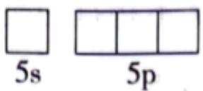

(2) $\mathrm{SnCl}_{2}$ 和 $\mathrm{SnCl}_{4}$ 是锡的常见氯化物, $\mathrm{SnCl}_{2}$ 可被氧化得到。

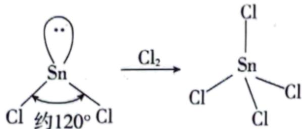

① $SnCl_{2}$ 分子的 VSEPR 模型名称是\_\_\_\_。

② $SnCl_{4}$ 的Sn—Cl键是由锡的\_\_\_\_轨道与氯的3p轨道重叠形成σ键。

（3）白锡和灰锡是单质 Sn 的常见同素异形体。二者晶胞如图：白锡具有体心四方结构；灰锡具有立方金刚石结构。

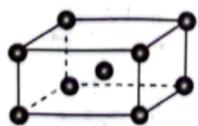  
白锡

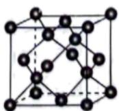  
灰锡

①灰锡中每个Sn原子周围与它最近且距离相等的Sn原子有\_\_\_\_个。

②若白锡和灰锡的晶胞体积分别为 $v_{1}nm^{3}$ 和 $v_{2}nm^{3}$ ，则白锡和灰锡晶体的密度之比是 \_\_\_\_。

(4) 单质 Sn 的制备: 将 $\mathrm{SnO}_{2}$ 与焦炭充分混合后, 于惰性气氛中加热至 $800^{\circ} \mathrm{C}$ , 由于固体之间反应慢,未明显发生反应。若通入空气在 $800^{\circ} \mathrm{C}$ 下, $\mathrm{SnO}_{2}$ 能迅速被还原为单质 Sn, 通入空气的作用是\_\_\_\_。

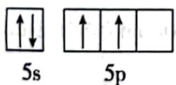

(2) ①. 平面三角形 ②. $\mathbf{sp}^3$ 杂化

(3) ①.4 ②. $\frac{\mathrm{v}_2}{4\mathrm{v}_1}$

（4）与焦炭在高温下反应生成CO，CO将 $\mathrm{SnO}_2$ 还原为单质Sn【解析】 【小问1详解】

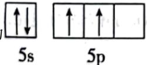

Sn 位于元素周期表的第 5 周期 IVA 族，基态 Sn 原子的最外层电子排布式为 $5s^{2}5p^{2}$ ，Sn 的基态原子最外层轨道表示式为 $\boxed{\uparrow\downarrow}$ $\boxed{\uparrow\uparrow\uparrow\square}$ ;

【小问 2 详解】

① $SnCl_{2}$ 中 Sn 的价层电子对数为 $2+\frac{1}{2}\times(4-2\times1)=3$ ，故 $SnCl_{2}$ 分子的 VSEPR 模型名称是平面三角形；

② $SnCl_{4}$ 中 Sn 的价层电子对数为 $4+\frac{1}{2}\times(4-4\times1)=4$ ，有 4 个 $\sigma$ 键、无孤电子对，故 Sn 采取 $sp^{3}$ 杂化，则 $SnCl_{4}$ 的 Sn—Cl 键是由锡的 $sp^{3}$ 杂化轨道与氯的 3p 轨道重叠形成 $\sigma$ 键；

【小问 3 详解】

①灰锡具有立方金刚石结构，金刚石中每个碳原子以单键与其他4个碳原子相连，此5碳原子在空间构成正四面体，且该碳原子在正四面体的体心，所以灰锡中每个Sn原子周围与它最近且距离相等的Sn原子有4个；

②根据均摊法，白锡晶胞中含 Sn 原子数为 $8 \times \frac{1}{8} + 1 = 2$ ，灰锡晶胞中含 Sn 原子数为 $8 \times \frac{1}{8} + 6 \times \frac{1}{2} + 4 = 8$ ，所以白锡与灰锡的密度之比为 $\frac{2M}{N_{A}v_{1}} : \frac{8M}{N_{A}v_{2}} = \frac{v_{2}}{4v_{1}}$ ;

【小问 4 详解】

将 $SnO_{2}$ 与焦炭充分混合后，于惰性气氛中加热至 $800^{\circ}C$ ，由于固体之间反应慢，未发生明显反应；若通入空气在 $800^{\circ}C$ 下， $SnO_{2}$ 能迅速被还原为单质 Sn，通入空气的作用是：与焦炭在高温下反应生成 CO，CO 将 $SnO_{2}$ 还原为单质 Sn，有关反应的化学方程式为 $2C + O_{2} \xlongequal{高温} 2CO$ 、 $2CO + SnO_{2} \xlongequal{高温} Sn + 2CO_{2}$ 。

16. $HNO_{3}$ 是一种重要的工业原料。可采用不同的氮源制备 $HNO_{3}$ 。

(1) 方法一: 早期以硝石(含 $\mathrm{NaNO}_{3}$ )为氮源制备 $\mathrm{HNO}_{3}$ , 反应的化学方程式为:

$H_{2}SO_{4}(浓)+NaNO_{3}=NaHSO_{4}+HNO_{3}\uparrow$ 。该反应利用了浓硫酸的性质是酸性和\_\_\_\_。

(2) 方法二: 以 $\mathrm{NH}_{3}$ 为氮源催化氧化制备 $\mathrm{HNO}_{3}$ , 反应原理分三步进行。

$$
\mathrm{NH} _ {3} \xrightarrow [ \mathrm{O} _ {2} ]{\mathrm{I}} \mathrm{NO} \xrightarrow [ \mathrm{O} _ {2} ]{\mathrm{II}} \mathrm{NO} _ {2} \xrightarrow [ \mathrm{H} _ {2} \mathrm{O} ]{\mathrm{III}} \mathrm{HNO} _ {3}
$$

①第Ⅰ步反应的化学方程式为\_\_\_\_。

②针对第 II 步反应进行研究：在容积可变的密闭容器中，充入 2nmolNO 和 n mol O₂ 进行反应。在不同压强下 (p₁、p₂)，反应达到平衡时，测得 NO 转化率随温度的变化如图所示。解释 y 点的容器容积小于 x 点

的容器容积的原因\_\_\_\_。

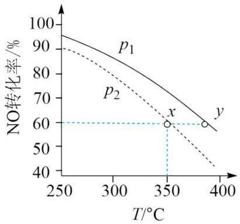

（3）方法三：研究表明可以用电解法以 $\mathrm{N}_2$ 为氨源直接制备 $\mathrm{HNO}_3$ ，其原理示意图如下。

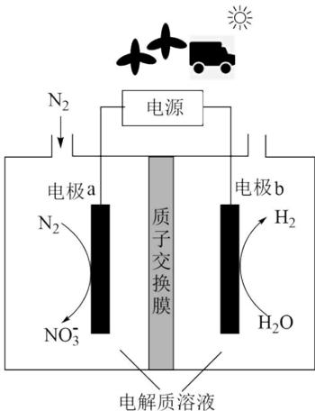

①电极 a 表面生成 $NO_{3}^{-}$ 的电极反应式：\_\_\_\_。

②研究发现： $N_{2}$ 转化可能的途径为 $N_{2} \xrightarrow{i} NO \xrightarrow{ii} NO_{3}^{-}$ 。电极 a 表面还发生 iii. $H_{2}O \rightarrow O_{2}$ 。iii 的存在，有利于途径 ii，原因是 \_\_\_\_。

（4）人工固氮是高能耗的过程，结合 $\mathrm{N}_{2}$ 分子结构解释原因\_\_\_\_。方法三为 $\mathrm{N}_{2}$ 的直接利用提供了一种新的思路。

【答案】（1）难挥发性

(2) ①. $4\mathrm{NH}_3 + 5\mathrm{O}_2 \xrightarrow[\Delta]{\text{催化剂}} 4\mathrm{NO} + 6\mathrm{H}_2\mathrm{O}$ ②. $2\mathrm{NO} + \mathrm{O}_2 \rightleftharpoons 2\mathrm{NO}_2$ ，该反应正向气体分子总数

减小，同温时， $p_{1}$ 条件下NO转化率高于 $p_{2}$ ，故 $p_{1}>p_{2}$ ，x、y点转化率相同，此时压强对容积的影响大于温度对容积的影响

(3) ①. $\mathrm{N}_{2} - 10\mathrm{e}^{-} + 6\mathrm{H}_{2}\mathrm{O} = 2\mathrm{NO}_{3}^{-} + 12\mathrm{H}^{+}$ ②. 反应iii生成 $\mathrm{O}_{2}$ , $\mathrm{O}_{2}$ 将NO氧化成 $\mathrm{NO}_{2}$ , $\mathrm{NO}_{2}$

更易转化成 $NO_{3}^{-}$

（4） $\mathrm{N}_{2}$ 中存在氮氮三键，键能高，断键时需要较大的能量，故人工固氮是高能耗的过程

【解析】

【小问 1 详解】

浓硫酸难挥发，产物 $HNO_{3}$ 为气体，有利于复分解反应进行，体现了浓硫酸的难挥发性和酸性。

【小问 2 详解】

①第 I 步反应为氨气的催化氧化，化学方程式为 $4NH_{3} + 5O_{2} \xlongequal[\Delta]{催化剂} 4NO + 6H_{2}O$ ;

② $2NO+O_{2}\rightleftharpoons2NO_{2}$ ，该反应正向气体分子总数减小，同温时， $p_{1}$ 条件下NO转化率高于 $p_{2}$ ，故 $p_{1}>p_{2}$ ，根据 $V=nR\frac{T}{p}$ ，x、y点转化率相同，则n相同，此时压强对容积的影响大于温度对容积的影响，故y点的容器容积小于x点的容器容积。

【小问 3 详解】

①由电极 a 上的物质转化可知，氮元素化合价升高，发生氧化反应，电极 a 为阳极，电极反应式为 $N_{2}-10e^{-}+6H_{2}O=2NO_{3}^{-}+12H^{+}$ ;

②反应 iii 生成 $O_{2}$ ， $O_{2}$ 将 NO 氧化成 $NO_{2}$ ， $NO_{2}$ 更易转化成 $NO_{3}^{-}$ 。

【小问 4 详解】

$N_{2}$ 中存在氮氮三键，键能高，断键时需要较大的能量，故人工固氮是高能耗的过程。

17. 除草剂苯嘧磺草胺的中间体 M 合成路线如下。

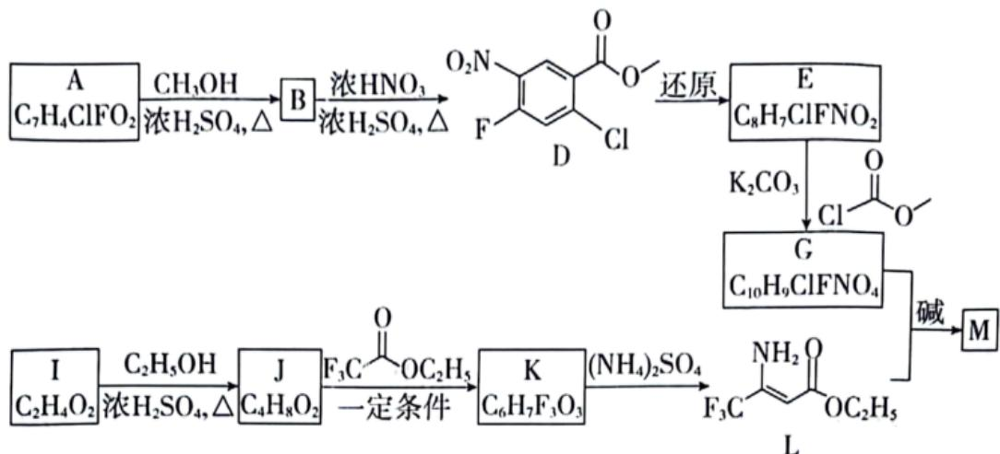

(1) D 中含氧官能团的名称是\_\_\_\_。

(2) A→B 的化学方程式是 \_\_\_\_。

(3) I→J 的制备过程中, 下列说法正确的是\_\_\_\_(填序号)。

a. 依据平衡移动原理，加入过量的乙醇或将 J 蒸出，都有利于提高 I 的转化率

b. 利用饱和碳酸钠溶液可吸收蒸出的 I 和乙醇

c. 若反应温度过高，可能生成副产物乙醚或者乙烯

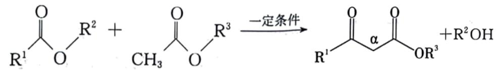

①K 的结构简式是\_\_\_\_。

②判断并解释 K 中氟原子对 $\alpha-H$ 的活泼性的影响 \_\_\_\_。

(5) M 的分子式为 $C_{13}H_{7}ClF_{4}N_{2}O_{4}$ 。除苯环外，M 分子中还有个含两个氮原子的六元环，在合成 M 的同时还生成产物甲醇和乙醇。由此可知，在生成 M 时，L 分子和 G 分子断裂的化学键均为 C-O 键和 \_\_\_\_ 键，M 的结构简式是 \_\_\_\_ 。

【答案】（1）硝基、酯基

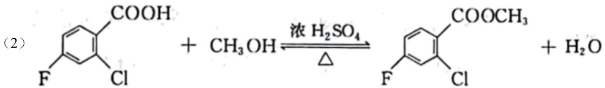

(3)

abc

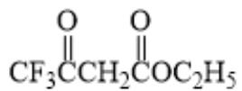

②. 氟原子可增强 $\alpha$ -H 的活泼性, 氟原子为吸电子基团, 降低相

连碳原子的电子云密度，使得碳原子的正电性增加，有利于增强 $\alpha-H$ 的活泼性

(5) ①. N-H

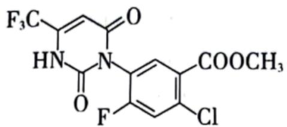

【解析】

【分析】B 发生硝化反应得到 D，即 B 为

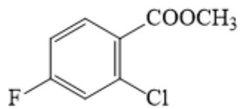

A 与 $\mathrm{CH}_3\mathrm{OH}$ 发生酯化反应生成

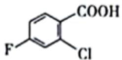

B，即 A 为 $\mathrm{F}$ 中间, D 发生还原反应得到 E, 结合 E 的分子式可知, D 硝基被还原为氨基, E

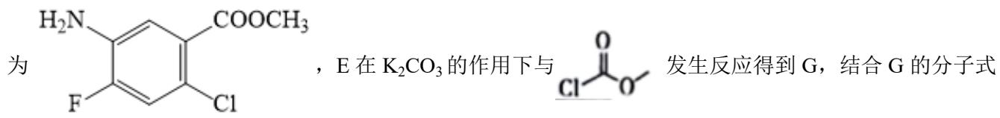

可知，G 为 $\mathrm{H}_3\mathrm{CO}-\mathrm{C}(=\mathrm{O})-\mathrm{HN}-\mathrm{C}_6\mathrm{H}_4-\mathrm{Cl}-\mathrm{COOCH}_3$ ，I 与 $\mathrm{C}_2\mathrm{H}_5\mathrm{OH}$ 在浓硫酸加热的条件下生成 J，结合 I

与 J 的分子式可知，I 为 $CH_{3}COOH$ ，J 为 $CH_{3}COOC_{2}H_{5}$ ，J 与 $F_{3}C\overset{O}{\underset{\vert\vert}{\mathrm{C}}}\mathrm{OC}_{2}\mathrm{H}_{5}$ 在一定条件下生成 K，发生类

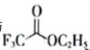

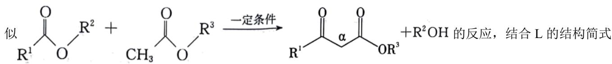

和 K 的分子式可知，K 为 $\ce{CF3CCH2COC2H5}$ ，G 和 L 在碱的作用下生成 M，M 的分子式为

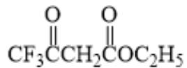

$\mathrm{C_{13}H_7ClF_4N_2O_4}$ ，除苯环外，M分子中还有个含两个氮原子的六元环，在合成M的同时还生成产物甲醇和乙醇，可推测为G与L中N-H键与酯基分别发生反应，形成酰胺基，所以断裂的化学键均为C-O键

和 N-H 键，M 的结构简式为

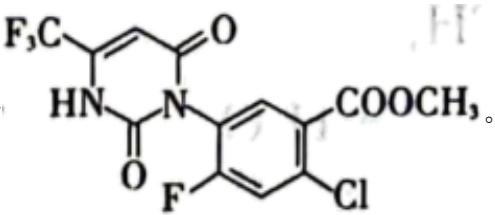

【小问1详解】

由 D 的结构简式可知，D 中含氧官能团为硝基、酯基；

【小问 2 详解】

A→B 的过程为 A 中羧基与甲醇中羟基发生酯化反应，化学方程式为:

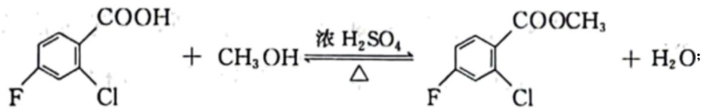

【小问 3 详解】

I→J 的制备过程为乙酸与乙醇的酯化过程，

a. 依据平衡移动原理，加入过量的乙醇或将乙酸乙酯蒸出，都有利于提高乙酸的转化率，a 正确；

b. 饱和碳酸钠溶液可与蒸出的乙酸反应并溶解乙醇，b 正确；

c. 反应温度过高, 乙醇在浓硫酸的作用下发生分子间脱水生成乙醚, 发生分子内消去反应生成乙烯, c 正确;

故选 abc;

【小问 4 详解】

①根据已知反应可知，酯基的 $\alpha-H$ 与另一分子的酯基发生取代反应， $F_{3}CCOOC_{2}H_{5}$ 中左侧不存在 $\alpha-H$ ，
所以产物 K 的结构简式为 $\begin{array}{c} O \\ || \\ CF_{3}CCH_{2}COC_{2}H_{5} \end{array}$ ;

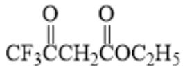

②氟原子可增强 $\alpha-H$ 的活泼性，氟原子为吸电子基团，降低相连碳原子的电子云密度，使得碳原子的正电性增加，有利于增强 $\alpha-H$ 的活泼性；

【小问 5 详解】

M 分子中除苯环外还有一个含两个氮原子的六元环，在合成 M 的同时还生成产物甲醇和乙醇，再结合其分子式，可推测为 G 与 L 中 N-H 键与酯基分别发生反应，形成酰胺基，所以断裂的化学键均为 C-O 键

和 N-H 键，M 的结构简式为

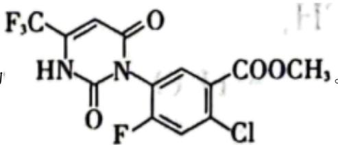

18. 利用黄铜矿(主要成分为 $CuFeS_{2}$ ，含有 $SiO_{2}$ 等杂质)生产纯铜，流程示意图如下。

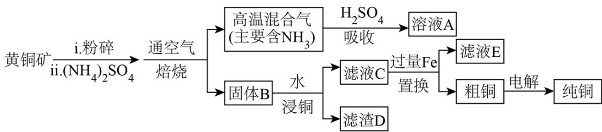

（1）矿石在焙烧前需粉碎，其作用是\_\_\_\_。

(2) $\left(\mathrm{NH}_{4}\right)_{2} \mathrm{SO}_{4}$ 的作用是利用其分解产生的 $\mathrm{SO}_{3}$ 使矿石中的铜元素转化为 $\mathrm{CuSO}_{4}$ 。 $\left(\mathrm{NH}_{4}\right)_{2} \mathrm{SO}_{4}$ 发生热分解的化学方程式是 \_\_\_\_。

(3) 矿石和过量 $\left(\mathrm{NH}_{4}\right)_{2} \mathrm{SO}_{4}$ 按一定比例混合, 取相同质量, 在不同温度下焙烧相同时间, 测得: “吸收” 过程氨吸收率和 “浸铜” 过程铜浸出率变化如图; $400^{\circ} \mathrm{C}$ 和 $500^{\circ} \mathrm{C}$ 时, 固体 B 中所含铜、铁的主要物质如表。

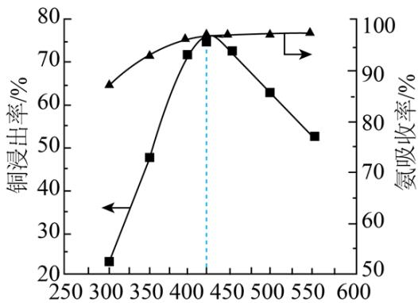  
焙烧温度/°C

<table><tr><td>温度/°C</td><td>B中所含铜、铁的主要物质</td></tr><tr><td>400</td><td> $Fe_{2}O_{3}$ 、 $CuSO_{4}$ 、 $CuFeS_{2}$ </td></tr><tr><td>500</td><td> $Fe_{2}(SO_{4})_{3}$ 、 $CuSO_{4}$ 、CuO</td></tr></table>

①温度低于 $425^{\circ} \mathrm{C}$ , 随焙烧温度升高, 铜浸出率显著增大的原因是\_\_\_\_。

②温度高于 $425^{\circ} \mathrm{C}$ , 根据焙烧时可能发生的反应, 解释铜浸出率随焙烧温度升高而降低的原因是 \_\_\_\_。

(4) 用离子方程式表示置换过程中加入 Fe 的目的 \_\_\_\_。

(5) 粗铜经酸浸处理, 再进行电解精炼; 电解时用酸化的 $\mathrm{CuSO}_{4}$ 溶液做电解液, 并维持一定的 $\mathbf{c}\left(\mathrm{H}^{+}\right)$ 和 $\mathbf{c}\left(\mathrm{Cu}^{2+}\right)$ 。粗铜若未经酸浸处理, 消耗相同电量时, 会降低得到纯铜的量, 原因是\_\_\_\_。

【答案】（1）增大接触面积，加快反应速率，使反应更充分

(2) $\left(\mathrm{NH}_{4}\right)_{2}\mathrm{SO}_{4} \stackrel{\Delta}{=} 2\mathrm{NH}_{3} \uparrow + \mathrm{SO}_{3} \uparrow + \mathrm{H}_{2}\mathrm{O}$

(3) ①. 温度低于 $425^{\circ} \mathrm{C}$ , 随焙烧温度升高, $\left(\mathrm{NH}_{4}\right)_{2} \mathrm{SO}_{4}$ 分解产生的 $\mathrm{SO}_{3}$ 增多, 可溶物 $\mathrm{CuSO}_{4}$ 含量增加, 故铜浸出率显著增加 ②. 温度高于 $425^{\circ} \mathrm{C}$ , 随焙烧温度升高发生反应: $4 \mathrm{CuFeS}_{2} + 17 \mathrm{O}_{2} + 2 \mathrm{CuSO}_{4} \stackrel{\Delta}{=} \mathrm{CuO} + 2 \mathrm{Fe}_{2} \left(\mathrm{SO}_{4}\right)_{3} + 4 \mathrm{SO}_{3}$ , $\mathrm{CuFeS}_{2}$ 和 $\mathrm{CuSO}_{4}$ 转化成难溶于水的 $\mathrm{CuO}$ , 铜浸出率降低

(4) $\mathrm{Fe} + \mathrm{Cu}^{2+} = \mathrm{Cu} + \mathrm{Fe}^{2+}$

（5）粗铜若未经酸浸处理，其中杂质 Fe 会参与放电，则消耗相同电量时，会降低得到纯铜的量

【解析】

【分析】黄铜矿(主要成分为 $CuFeS_{2}$ ，含有 $SiO_{2}$ 等杂质)粉碎后加入硫酸铵通入空气焙烧，黄铜矿在硫酸铵生成的 $SO_{3}$ 作用下，转化成 $CuSO_{4}$ ，得到的混合气体中主要含 $NH_{3}$ ，用硫酸吸收，得到硫酸铵，是溶液 A 的主要溶质，可以循环利用，固体 B 为 $SiO_{2}$ 、 $CuSO_{4}$ 及含铁的化合物，加水分离，主要形成含硫酸铜的滤液和含 $SiO_{2}$ 的滤渣，分别为滤液 C 和滤渣 D，向硫酸铜溶液中加入过量的铁，置换得到粗铜和 $FeSO_{4}$ ，粗铜再精炼可以得到纯铜。

## 【小问 1 详解】

黄铜矿的矿石在焙烧前需粉碎，是为了增大反应物的接触面积，加快反应速率，使反应更充分；

## 【小问 2 详解】

铵盐不稳定，易分解， $\left(\mathrm{NH}_{4}\right)_{2}\mathrm{SO}_{4}$ 分解为非氧化还原反应，产物中有 $NH_{3}$ 和 $SO_{3}$ ，故化学方程式为 $\left(\mathrm{NH}_{4}\right)_{2}\mathrm{SO}_{4}\stackrel{\Delta}{=}2\mathrm{NH}_{3}\uparrow+\mathrm{SO}_{3}\uparrow+\mathrm{H}_{2}\mathrm{O}$ ;

## 【小问 3 详解】

①由图，温度低于 $425^{\circ}C$ ，随焙烧温度升高，铜浸出率显著增大，是因为温度低于 $425^{\circ}C$ ，随焙烧温度升高， $(\mathrm{NH}_{4})_{2}\mathrm{SO}_{4}$ 分解产生的 $SO_{3}$ 增多，可溶物 $CuSO_{4}$ 含量增加，故铜浸出率显著增加；

②温度高于 $425^{\circ}C$ ，随焙烧温度升高， $CuFeS_{2}$ 和 $CuSO_{4}$ 转化成难溶于水的 CuO，发生反应

$4CuFeS_{2}+17O_{2}+2CuSO_{4}\xlongequal{\Delta}CuO+2Fe_{2}(SO_{4})_{3}+4SO_{3}$ ，铜浸出率降低；

## 【小问4详解】

加入 Fe 置换硫酸铜溶液中的铜，反应的离子方程式为 $Fe + Cu^{2+} = Cu + Fe^{2+}$ ;

## 【小问 5 详解】

粗铜中含有 Fe 杂质，加酸可以除 Fe，但粗铜若未经酸浸处理，其中杂质 Fe 会参与放电，则消耗相同电量时，会降低得到纯铜的量。

19. 某小组同学向 $\mathrm{pH} = 1$ 的 $0.5\mathrm{mol}\cdot \mathrm{L}^{-1}$ 的 $\mathrm{FeCl}_3$ 溶液中分别加入过量的 $\mathrm{Cu}$ 粉、 $\mathrm{Zn}$ 粉和 $\mathrm{Mg}$ 粉，探究溶液中氧化剂的微粒及其还原产物。

## (1) 理论分析

依据金属活动性顺序，Cu、Zn、Mg 中可将 $Fe^{3+}$ 还原为 Fe 的金属是 \_\_\_\_。

## (2) 实验验证

<table><tr><td>实验</td><td>金属</td><td>操作、现象及产物</td></tr><tr><td>I</td><td>过量Cu</td><td>一段时间后,溶液逐渐变为蓝绿色,固体中未检测到Fe单质</td></tr><tr><td>II</td><td>过量Zn</td><td>一段时间后有气泡产生,反应缓慢,pH逐渐增大,产生了大量红褐色沉淀后,无气泡冒出,此时溶液pH为3~4,取出固体,固体中未检测到Fe单质</td></tr><tr><td>III</td><td>过量Mg</td><td>有大量气泡产生,反应剧烈,pH逐渐增大,产生了大量红褐色沉淀后,持续产生大量气泡,当溶液pH为3~4时,取出固体,固体中检测到Fe单质</td></tr></table>

①分别取实验 I、II、III中的少量溶液，滴加 $\mathrm{K}_{3}\left[\mathrm{Fe}(\mathrm{CN})_{6}\right]$ 溶液，证明都有 $Fe^{2+}$ 生成，依据的现象是 \_\_\_\_。

②实验II、III都有红褐色沉淀生成，用平衡移动原理解释原因\_\_\_\_。

③对实验II未检测到Fe单质进行分析及探究。

i. a. 甲认为实验Ⅱ中，当 $Fe^{3+}$ 、 $H^{+}$ 浓度较大时，即使Zn与 $Fe^{2+}$ 反应置换出少量Fe，Fe也会被 $Fe^{3+}$ 、 $H^{+}$ 消耗。写出Fe与 $Fe^{3+}$ 、 $H^{+}$ 反应的离子方程式\_\_\_\_。

b. 乙认为在 $\mathrm{pH}$ 为 $3\sim 4$ 的溶液中即便生成Fe也会被 $\mathbf{H}^{+}$ 消耗。设计实验\_\_\_\_(填实验操作和现象)。证实了此条件下可忽略 $\mathbf{H}^{+}$ 对Fe的消耗。

c. 丙认为产生的红褐色沉淀包裹在 $\mathrm{Zn}$ 粉上，阻碍了 $\mathrm{Zn}$ 与 $\mathrm{Fe}^{2+}$ 的反应。实验证实了 $\mathrm{Zn}$ 粉被包裹。

ii. 查阅资料： $0.5\,mol \cdot L^{-1}\,Fe^{3+}$ 开始沉淀的pH约为1.2，完全沉淀的pH约为3。

结合 a、b 和 c，重新做实验II，当溶液 pH 为 3\~4 时，不取出固体，向固-液混合物中持续加入盐酸，控制 pH<1.2，\_\_\_\_(填实验操作和现象)，待 pH 为 3\~4 时，取出固体，固体中检测到 Fe 单质。

(3) 对比实验II和III, 解释实验III的固体中检测到Fe单质的原因。

【答案】(1) Mg、Zn

(2) ①. 产生蓝色沉淀 ②. $\mathrm{Fe}^{3+}$ 水解方程式为 $\mathrm{Fe}^{3+} + 3\mathrm{H}_{2}\mathrm{O} \rightleftharpoons \mathrm{Fe(OH)}_{3} + 3\mathrm{H}^{+}$ , 加入的 $\mathrm{Mg}$ 或 $\mathrm{Zn}$

会消耗 $H^{+}$ ，促进 $Fe^{3+}$ 水解平衡正向移动，使其转化为 $\mathrm{Fe(OH)}_{3}$ 沉淀 ③.

$2Fe^{3+} + 2Fe + 2H^{+} = 4Fe^{2+} + H_{2}\uparrow$ 或 $2Fe^{3+} + Fe = 3Fe^{2+}$ 、 $2H^{+} + Fe = Fe^{2+} + H_{2}\uparrow$ ④. 向pH为3\~4的稀盐酸中加铁粉，一段时间后取出少量溶液，滴加 $K_{3}[Fe(CN)_{6}]$ 溶液，不产生蓝色沉淀 ⑤. 加入几滴

KSCN 溶液，待溶液红色消失后，停止加入盐酸

（3）加入镁粉后产生大量气泡，使镁粉不容易被 $\mathrm{Fe(OH)}_3$ 沉淀包裹

【解析】

【分析】实验I中，加入过量的 Cu，Cu 与 $Fe^{3+}$ 发生反应 $2Fe^{3+} + Cu = Cu^{2+} + 2Fe^{2+}$ ，一段时间后，溶液逐渐变为蓝绿色，固体中未检测到 Fe 单质；实验II中，加入过量的 Zn，发生反应

$Zn + 2H^{+} = Zn^{2+} + H_{2}\uparrow$ ，有气泡产生，pH逐渐增大，使得 $Fe^{3+}$ 转化为红褐色沉淀 $\mathrm{Fe(OH)}_{3}$ ，固体中未检测到Fe单质，原因可能是 $Fe^{3+}$ 的干扰以及 $\mathrm{Fe(OH)}_{3}$ 沉淀对锌粉的包裹；实验III中，加入过量Mg，发生反应 $Mg + 2H^{+} = Mg^{2+} + H_{2}\uparrow$ ，由于Mg很活泼，该反应非常剧烈，pH逐渐增大，产生了大量红褐色沉淀后，持续产生大量气泡，当溶液pH为3\~4时，取出固体，固体中检测到Fe单质，对比实验II和III，加入镁粉后产生大量气泡，使镁粉不容易被 $\mathrm{Fe(OH)}_{3}$ 沉淀包裹，实验III的固体中检测到Fe单质。

【小问 1 详解】

在金属活动性顺序表中，Mg、Zn 排在 Fe 之前，Cu 排在 Fe 之后，因此 Mg、Zn 可将 $\mathrm{Fe}^{3+}$ 还原为 Fe；【小问 2 详解】

① $Fe^{2+}$ 与 $\mathrm{K}_{3}\left[\mathrm{Fe}(\mathrm{CN})_{6}\right]$ 会生成蓝色的 $\mathrm{KFe}\left[\mathrm{Fe}(\mathrm{CN})_{6}\right]$ 沉淀；

② $Fe^{3+}$ 水解方程式为 $\mathrm{Fe}^{3+} + 3\mathrm{H}_{2}\mathrm{O} \rightleftharpoons \mathrm{Fe}(\mathrm{OH})_{3} + 3\mathrm{H}^{+}$ ，加入的 Mg 或 Zn 会消耗 $H^{+}$ ，促进 $Fe^{3+}$ 水解平衡正向移动，使其转化为 $\mathrm{Fe(OH)}_{3}$ 沉淀；

③i. a. Fe 与 $Fe^{3+}$ 、 $H^{+}$ 反应的离子方程式为： $2Fe^{3+} + 2Fe + 2H^{+} = 4Fe^{2+} + H_{2}\uparrow$ 或 $2Fe^{3+} + Fe = 3Fe^{2+}$ 、 $2H^{+} + Fe = Fe^{2+} + H_{2}\uparrow$ ;

b. 要证实在 $\mathrm{pH}$ 为 $3 \sim 4$ 的溶液中可忽略 $\mathrm{H^{+}}$ 对 $\mathrm{Fe}$ 的消耗, 可向 $\mathrm{pH}$ 为 $3 \sim 4$ 的稀盐酸中加铁粉, 一段时间后取出少量溶液, 滴加 $\mathrm{K}_{3} \left[ \mathrm{Fe}(\mathrm{CN})_{6} \right]$ 溶液, 不产生蓝色沉淀, 即说明此条件下 $\mathrm{Fe}$ 未与 $\mathrm{H^{+}}$ 反应生成 $\mathrm{Fe}^{2+}$ ; ii. 结合 a, b 和 c 可知, 实验II未检测到 Fe 单质的原因可能是 $\mathrm{Fe}^{3+}$ 的干扰以及 $\mathrm{Fe(OH)}_{3}$ 沉淀对锌粉的包裹, 因此可控制反应条件, 在未生成 $\mathrm{Fe(OH)}_{3}$ 沉淀时将 $\mathrm{Fe}^{3+}$ 还原, 即可排除两个干扰因素, 具体操作为:重新做实验II, 当溶液 $\mathrm{pH}$ 为 $3 \sim 4$ 时, 不取出固体, 向固-液混合物中持续加入盐酸, 控制 $\mathrm{pH} < 1.2$ , 加入几滴 KSCN 溶液, 待溶液红色消失后, 停止加入盐酸, 待 $\mathrm{pH}$ 为 $3 \sim 4$ 时, 取出固体, 固体中检测到 Fe 单质;

## 【小问 3 详解】

对比实验II和III，加入镁粉后产生大量气泡，使镁粉不容易被 $\mathrm{Fe(OH)}_3$ 沉淀包裹，实验III的固体中检测到Fe单质。