# 2024年安徽省普通高中学业水平选择性考试

# 化学

## 注意事项：

1. 答题前，考生务必将自己的姓名和座位号填写在答题卡和试卷上。

2. 作答选择题时，选出每小题答案后，用铅笔将答题卡上对应题目的答案选项涂黑。如需改动，用橡皮擦干净后，再选涂其它答案选项。作答非选择题时，将答案写在答题卡上对应区域。写在本试卷上无效。

3. 考试结束后，将本试卷和答题卡一并交回。可能用到的相对原子质量：H1N14O16Cl35.5Fe56Zn65Sn119

## 一、选择题：本题共14小题，每小题3分；共42分。在每小题给出的四个选项中，只有一项是符合题目要求的。

1. 下列资源利用中，在给定工艺条件下转化关系正确的是
A. 煤 $\xrightarrow{\text{干馏}}$ 煤油    B. 石油 $\xrightarrow{\text{分馏}}$ 乙烯    C. 油脂 $\xrightarrow{\text{皂化}}$ 甘油    D. 淀粉 $\xrightarrow{\text{水解}}$ 乙醇

【详解】A. 煤的干馏是将煤隔绝空气加强热使之分解的过程，干馏的过程不产生煤油，煤油是石油分馏的产物，A 错误；  
B. 石油分馏是利用其组分中的不同物质的沸点不同将组分彼此分开，石油分馏不能得到乙烯，B 错误；  
C. 油脂在碱性条件下水解生成甘油和高级脂肪酸盐，C 正确；  
D. 淀粉是多糖，其发生水解反应生成葡萄糖，D 错误；

故答案选 C。

2. 下列各组物质的鉴别方法中，不可行的是
A. 过氧化钠和硫黄：加水，振荡
B. 水晶和玻璃：X射线衍射实验
C. 氯化钠和氯化钾：焰色试验
D. 苯和甲苯：滴加溴水，振荡

【答案】D

【解析】

【详解】A．过氧化钠可以与水发生反应生成可溶性的氢氧化钠，硫不溶于水，A 可以鉴别；
B．水晶为晶体，有独立的晶格结构，玻璃为非晶体，没有独立的晶格结构，可以用 X 射线衍射实验进行鉴别，B 可以鉴别；

C. 钠的焰色为黄色，钾的焰色为紫色(需透过蓝色钴玻璃)，二者可以用焰色试验鉴别，C 可以鉴别；
D. 苯和甲苯都可以溶解溴水中的溴且密度都比水小，二者都在上层，不能用溴水鉴别苯和甲苯，D 不可以鉴别；
故答案选 D。

3. 青少年帮厨既可培养劳动习惯，也能将化学知识应用于实践。下列有关解释合理的是
A. 清洗铁锅后及时擦干，能减缓铁锅因发生吸氧腐蚀而生锈
B. 烹煮食物的后期加入食盐，能避免 NaCl 长时间受热而分解
C. 将白糖熬制成焦糖汁，利用蔗糖高温下充分炭化为食物增色
D. 制作面点时加入食用纯碱，利用 $NaHCO_{3}$ 中和发酵过程产生的酸

【详解】A. 铁发生吸氧腐蚀时, 正极上 $\mathrm{O}_{2}$ 得电子结合水生成氢氧根离子, 清洗铁锅后及时擦干, 除去了铁锅表面的水分, 没有了电解质溶液, 能减缓铁锅因发生吸氧腐蚀而生锈, A 正确;  
B. 食盐中含有碘酸钾, 碘酸钾受热不稳定易分解, 因此烹煮食物时后期加入食盐, 与 NaCl 无关, B 错误;  
C. 焦糖的主要成分仍是糖类, 同时还含有一些醛类、酮类等物质, 蔗糖在高温下并未炭化, C 错误;  
D. 食用纯碱主要成分为 $\mathrm{Na}_{2} \mathrm{CO}_{3}$ , 制作面点时加入食用纯碱, 利用了 $\mathrm{Na}_{2} \mathrm{CO}_{3}$ 中和发酵过程产生的酸, D 错误;  
故答案选 A。

4. 下列选项中的物质能按图示路径在自然界中转化，且甲和水可以直接生成乙的是

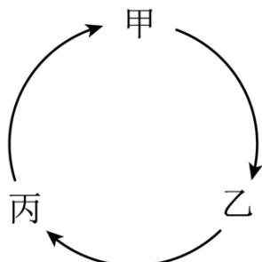

<table><tr><td>选项</td><td>甲</td><td>乙</td><td>丙</td></tr><tr><td>A</td><td> $Cl_{2}$ </td><td>NaClO</td><td>NaCl</td></tr><tr><td>B</td><td> $SO_{2}$ </td><td> $H_{2}SO_{4}$ </td><td> $CaSO_{4}$ </td></tr><tr><td>C</td><td> $Fe_{2}O_{3}$ </td><td> $Fe(OH)_{3}$ </td><td> $FeCl_{3}$ </td></tr><tr><td>D</td><td> $CO_{2}$ </td><td> $H_{2}CO_{3}$ </td><td> $Ca(HCO_{3})_{2}$ </td></tr></table>

A.A B.B C.C D.D

【答案】D

【解析】

【详解】A. $\mathrm{Cl}_{2}$ 与水反应生成 $\mathrm{HClO}$ 和 $\mathrm{HCl}$ ，无法直接生成 $\mathrm{NaClO}$ ，A 错误；  
B. $\mathrm{SO}_{2}$ 与水反应生成亚硫酸而不是硫酸，B 错误；  
C. 氧化铁与水不反应，不能生成氢氧化铁沉淀，C 错误；

D. $\mathrm{CO}_{2}$ 与水反应生成碳酸，碳酸与碳酸钙反应生成碳酸氢钙，碳酸氢钙受热分解生成二氧化碳气体，D正确；故答案选D。

5. D-乙酰氨基葡萄糖(结构简式如下)是一种天然存在的特殊单糖。下列有关该物质说法正确的是

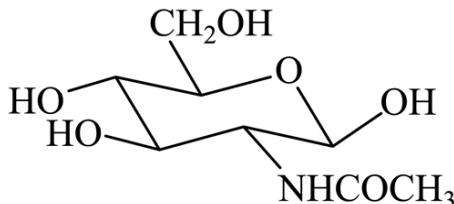

A. 分子式为 $\mathrm{C_8H_{14}O_6N}$ B. 能发生缩聚反应 C. 与葡萄糖互为同系物 D. 分子中含有 $\sigma$ 键，不含 $\pi$ 键

【答案】B

【解析】

【详解】A．由该物质的结构可知，其分子式为： $C_{8}H_{15}O_{6}N$ ，故 A 错误；

B. 该物质结构中含有多个醇羟基，能发生缩聚反应，故 B 正确；

C. 组成和结构相似, 相差若干个 $\mathrm{CH}_{2}$ 原子团的化合物互为同系物, 葡萄糖分子式为 $\mathrm{C}_{6} \mathrm{H}_{12} \mathrm{O}_{6}$ , 该物质分子式为: $\mathrm{C}_{8} \mathrm{H}_{15} \mathrm{O}_{6} \mathrm{~N}$ , 不互为同系物, 故 C 错误; D. 单键均为 $\sigma$ 键, 双键含有 1 个 $\sigma$ 键和 1 个 $\pi$ 键, 该物质结构中含有 $C = O$ 键, 即分子中 $\sigma$ 键和 $\pi$ 键均有, 故 D 错误; 故选 B。

6. 地球上的生物氮循环涉及多种含氮物质，转化关系之一如下图所示(X、Y均为氮氧化物)，羟胺$(\mathrm{NH}_{2}\mathrm{OH})$ 以中间产物的形式参与循环。常温常压下，羟胺易潮解，水溶液呈碱性，与盐酸反应的产物盐酸羟胺 $(\mathrm{[NH_{3}OH]Cl})$ 广泛用子药品、香料等的合成。

已知 $25^{\circ}\mathrm{C}$ 时， $\mathrm{K_a(HNO_2)} = 7.2\times 10^{-4}$ ， $\mathrm{K_b(NH_3\cdot H_2O)} = 1.8\times 10^{-5}$ ， $\mathrm{K_b(NH_2OH)} = 8.7\times 10^{-9}$ 。

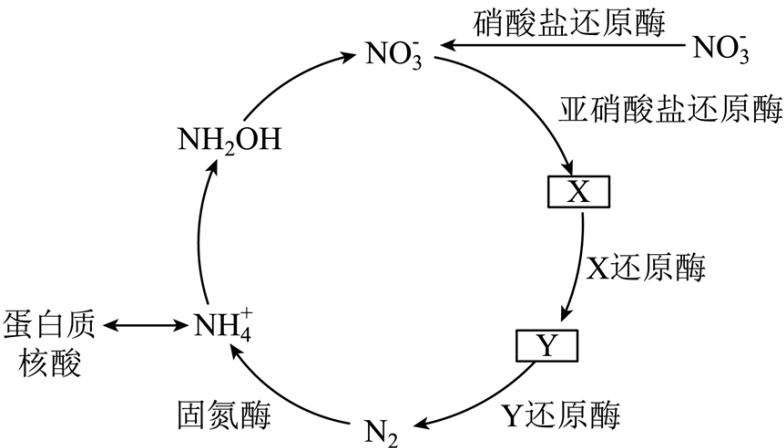

$N_{A}$ 是阿伏加德罗常数的值。下列说法正确的是
A. 标准状况下，2.24L X 和 Y 混合气体中氧原子数为 $0.1N_{A}$ B. 1L 0.1mol·L $^{-1}$ NaNO $_{2}$ 溶液中 Na $^{+}$ 和 NO $_{2}^{-}$ 数均为 0.1N $_{A}$ C. 3.3g NH $_{2}$ OH 完全转化为 NO $_{2}^{-}$ 时，转移的电子数为 0.6N $_{A}$ D. 2.8g N $_{2}$ 中含有的价电子总数为 0.6N $_{A}$

【答案】A

【分析】 $NO_{2}^{-}$ 在亚硝酸盐还原酶的作用下转化为X，X在X还原酶的作用下转化为Y，X、Y均为氮氧化物，即X为NO，Y为 $N_{2}O$ 。
【详解】A．标准状况下，2.24L NO 和 $N_{2}O$ 混合气体物质的量为 0.1mol，氧原子数为 $0.1N_{A}$ ，故 A 正确；
B. $HNO_{2}$ 为弱酸，因此 $NO_{2}^{-}$ 能够水解为 $HNO_{2}$ ， $1L\ 0.1mol\cdot L^{-1}\ NaNO_{2}$ 溶液中 $NO_{2}^{-}$ 数目小于 $0.1N_{A}$ ，故 B 错误；
C. $NH_{2}OH$ 完全转化为 $NO_{2}^{-}$ 时，N 的化合价由 -1 上升到 +3，3.3g $NH_{2}OH$ 物质的量为 0.1mol，转移的电子数为 $0.4N_{A}$ ，故 C 错误；
D. $2.8g\ N_{2}$ 物质的量为 0.1mol，N 的价电子数等于最外层电子数为 5， $2.8g\ N_{2}$ 含有的价电子总数为

$N_{A}$ ，故 D 错误；

故选A。

7. 地球上的生物氮循环涉及多种含氮物质，转化关系之一如下图所示(X、Y均为氮氧化物)，羟胺 $\left(\mathrm{NH}_{2}\mathrm{OH}\right)$ 以中间产物的形式参与循环。常温常压下，羟胺易潮解，水溶液呈碱性，与盐酸反应的产物盐酸羟胺 $\left(\left[\mathrm{NH}_{3}\mathrm{OH}\right]\mathrm{Cl}\right)$ 广泛用子药品、香料等的合成。

已知 $25^{\circ} \mathrm{C}$ 时， $\mathrm{K_a(HNO_2)} = 7.2 \times 10^{-4}$ ， $\mathrm{K_b(NH_3 \cdot H_2O)} = 1.8 \times 10^{-5}$ ， $\mathrm{K_b(NH_2OH)} = 8.7 \times 10^{-9}$ 。

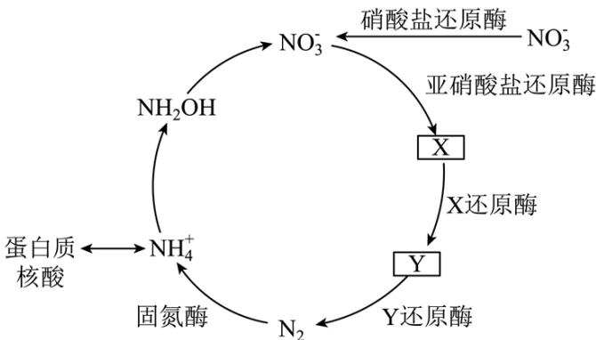

下列有关物质结构或性质的比较中，正确的是
A. 键角： $NH_{3}>NO_{3}^{-}$ B. 熔点： $NH_{2}OH>\left[NH_{3}OH\right]Cl$ C. 25℃同浓度水溶液的pH: $\left[NH_{3}OH\right]Cl>NH_{4}Cl$ D. 羟胺分子间氢键的强弱：O-H…O>N-H…N

【答案】D

【解析】

【详解】A. $NH_{3}$ 中 N 原子的价层电子对数 $=3+\frac{1}{2}(5-3\times1)=3+1=4$ ，为 $sp^{3}$ 杂化，键角为 $107^{\circ}$ ， $NO_{3}^{-}$ 中 N 的价层电子对数 $=3+\frac{1}{2}(5+1-3\times2)=3+0=3$ ，为 $sp^{2}$ 杂化，键角为 $120^{\circ}$ ，故键角： $NH_{3}<NO_{3}^{-}$ ，A 项错误；
B. $NH_{2}OH$ 为分子晶体， $\left[NH_{3}OH\right]Cl$ 为离子晶体，故熔点： $NH_{2}OH<\left[NH_{3}OH\right]Cl$ ，B 项错误；

C. 由题目信息可知, $25^{\circ} \mathrm{C}$ 下, $\mathrm{K_b(NH_3\cdot H_2O) > K_b(NH_2OH)}$ , 故 $\mathrm{NH_2OH}$ 的碱性比 $\mathrm{NH_3\cdot H_2O}$ 弱, 故同浓度的水溶液中, $\left[\mathrm{NH}_3\mathrm{OH}\right]^+$ 的电离程度大于 $\mathrm{NH_4^+}$ 的电离程度, 同浓度水溶液的 $\mathrm{pH}: \left[\mathrm{NH}_3\mathrm{OH}\right]\mathrm{Cl} < \mathrm{NH}_4\mathrm{Cl}$ , C 项错误;

D. O 的电负性大于 N，O-H 键的极性大于 N-H 键，故羟胺分子间氢键的强弱 O-H…O > N-H…N，D 项

正确；故选D。

8. 某催化剂结构简式如图所示。下列说法错误的是

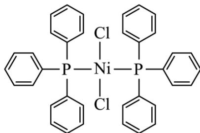

A. 该物质中 Ni 为 +2 价
B. 基态原子的第一电离能: Cl>P
C. 该物质中 C 和 P 均采取 $sp^{2}$ 杂化
D. 基态 Ni 原子价电子排布式为 $3d^{8}4s^{2}$

【答案】C

【解析】

【详解】A. 由结构简式可知，P 原子的 3 个孤电子与苯环形成共用电子对，P 原子剩余的孤电子对与 Ni 形成配位键，Cl⁻ 提供孤电子对，与 Ni 形成配位键，由于整个分子呈电中性，故该物质中 Ni 为 +2 价，A 项正确；
B. 同周期元素随着原子序数的增大，第一电离能有增大趋势，故基态原子的第一电离能：Cl>P，B 项正确；
C. 该物质中，C 均存在于苯环上，采取 $sp^{2}$ 杂化，P 与苯环形成 3 对共用电子对，剩余的孤电子对与 Ni 形成配位键，价层电子对数为 4，采取 $sp^{3}$ 杂化，C 项错误；
D. Ni 的原子序数为 28，位于第四周期第 VIII 族，基态 Ni 原子价电子排布式为 $3d^{8}4s^{2}$ ，D 项正确；故选 C。

9. 仅用下表提供的试剂和用品，不能实现相应实验目的的是

<table><tr><td>选项</td><td>实验目的</td><td>试剂</td><td>用品</td></tr><tr><td>A</td><td>比较镁和铝的金属性强弱</td><td> $MgCl_{2}$ 溶液、 $AlCl_{3}$ 溶液、氨水</td><td>试管、胶头滴管</td></tr><tr><td>B</td><td>制备乙酸乙酯</td><td>乙醇、乙酸、浓硫酸、饱和 $Na_{2}CO_{3}$ 溶液</td><td>试管、橡胶塞、导管、乳胶管铁架台(带铁夹)、碎瓷片、酒精灯、火柴</td></tr><tr><td>C</td><td>制备 $\left[ Cu(NH_3)_4 \right]SO_4$ 溶液</td><td> $CuSO_4$ 溶液、氨水</td><td>试管、胶头滴管</td></tr><tr><td>D</td><td>利用盐类水解制备 $Fe(OH)_3$ 胶体</td><td>饱和 $FeCl_3$ 溶液、蒸馏水</td><td>烧杯、胶头滴管、石棉网、三脚架、酒精灯、火柴</td></tr></table>

A.A B.B C.C D.D

【答案】A

【解析】

【详解】A. $\mathrm{MgCl}_2$ 溶液、 $\mathrm{AlCl}_3$ 溶液与氨水反应时现象相同，都只产生白色沉淀，不能比较 $\mathrm{Mg}$ 和 $\mathrm{Al}$ 的金属性强弱，A项不能实现实验目的；

B. 在一支试管中依次加入一定量的乙醇、浓硫酸、乙酸，并且放入几粒碎瓷片，另一支试管中加入适量

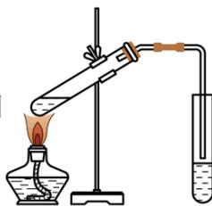

饱和碳酸钠溶液，如图 连接好装置，用酒精灯小心加热，乙酸与乙醇在浓硫酸存在、加

热条件下发生酯化反应生成乙酸乙酯和水，在饱和碳酸钠溶液液面上收集乙酸乙酯，发生反应的化学方程式为 $CH_{3}COOH + CH_{3}CH_{2}OH \xrightarrow{\text{浓硫酸}} CH_{3}COOCH_{2}CH_{3} + H_{2}O$ ，B 项能实现实验目的；

C. 向盛有 $\mathrm{CuSO_4}$ 溶液的试管中滴加氨水，首先产生蓝色 $\mathrm{Cu(OH)_2}$ 沉淀，继续滴加氨水，沉淀溶解得到深蓝色的 $[\mathrm{Cu(NH_3)_4}] \mathrm{SO}_4$ 溶液，发生反应的化学方程式为 $\mathrm{CuSO_4 + 4NH_3 \cdot H_2O = [Cu(NH_3)_4]SO_4 + 4H_2O}$ ，C项能实现实验目的；

D. 将烧杯中的蒸馏水加热至沸腾, 向沸水中加入 $5 \sim 6$ 滴饱和 $\mathrm{FeCl}_{3}$ 溶液, 继续加热至液体呈红褐色即制得 $\mathrm{Fe(OH)}_{3}$ 胶体, 反应的化学方程式为 $\mathrm{FeCl}_{3} + 3 \mathrm{H}_{2} \mathrm{O} \xrightarrow{\Delta} \mathrm{Fe(OH)}_{3}$ (胶体) $+ 3 \mathrm{HCl}$ , D 项能实现实验目的;

答案选 A。

10. 某温度下，在密闭容器中充入一定量的 $X(g)$ ，发生下列反应： $X(g) \rightleftharpoons Y(g)(\Delta H_1 < 0)$ ，

$Y(g) \rightleftharpoons Z(g)(\Delta H_{2}<0)$ ，测得各气体浓度与反应时间的关系如图所示。下列反应进程示意图符合题意的是

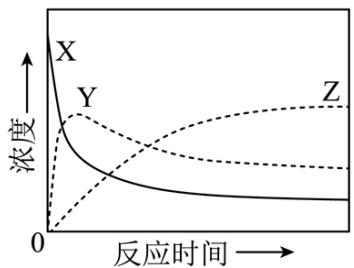

A.  
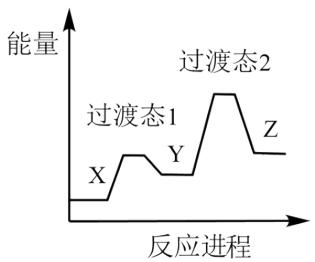

B.  
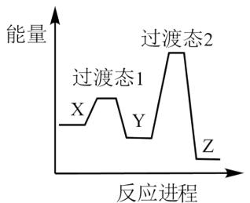  
C.

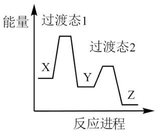

D.  
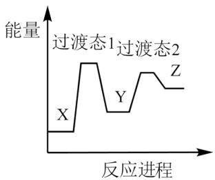

【答案】B

【解析】

【分析】由图可知，反应初期随着时间的推移 X 的浓度逐渐减小、Y 和 Z 的浓度逐渐增大，后来随着时间的推移 X 和 Y 的浓度逐渐减小、Z 的浓度继续逐渐增大，说明 $X(g) \rightleftharpoons Y(g)$ 的反应速率大于 $Y(g) \rightleftharpoons Z(g)$ 的反应速率，则反应 $X(g) \rightleftharpoons Y(g)$ 的活化能小于反应 $Y(g) \rightleftharpoons Z(g)$ 的活化能。
【详解】A. $X(g) \rightleftharpoons Y(g)$ 和 $Y(g) \rightleftharpoons Z(g)$ 的 $\Delta H$ 都小于 0，而图像显示 Y 的能量高于 X，即图像显示 $X(g) \rightleftharpoons Y(g)$ 为吸热反应，A 项不符合题意；
B. 图像显示 $X(g) \rightleftharpoons Y(g)$ 和 $Y(g) \rightleftharpoons Z(g)$ 的 $\Delta H$ 都小于 0，且 $X(g) \rightleftharpoons Y(g)$ 的活化能小于 $Y(g) \rightleftharpoons Z(g)$ 的活化能，B 项符合题意；
C. 图像显示 $X(g) \rightleftharpoons Y(g)$ 和 $Y(g) \rightleftharpoons Z(g)$ 的 $\Delta H$ 都小于 0，但图像上 $X(g) \rightleftharpoons Y(g)$ 的活化能大于 $Y(g) \rightleftharpoons Z(g)$ 的活化能，C 项不符合题意；
D. 图像显示 $X(g) \rightleftharpoons Y(g)$ 和 $Y(g) \rightleftharpoons Z(g)$ 的 $\Delta H$ 都大于 0，且 $X(g) \rightleftharpoons Y(g)$ 的活化能大于 $Y(g) \rightleftharpoons Z(g)$ 的活化能，D 项不符合题意；
选 B。
11. 我国学者研发出一种新型水系锌电池，其示意图如下。该电池分别以 Zn-TCPP (局部结构如标注框内所示) 形成的稳定超分子材料和 Zn 为电极，以 $ZnSO_{4}$ 和 KI 混合液为电解质溶液。下列说法错误的是

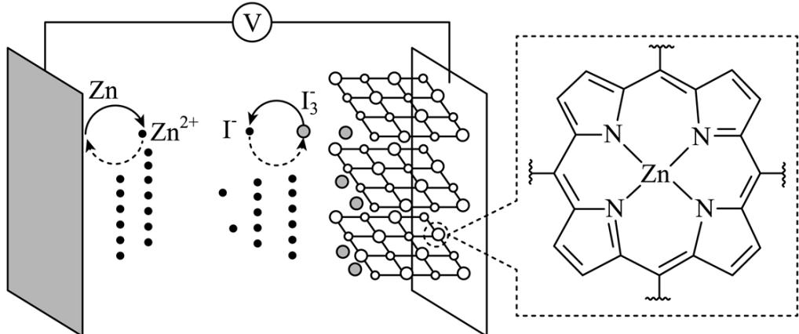

A. 标注框内所示结构中存在共价键和配位键  
B. 电池总反应为： $\mathrm{I}_3^-$ +Zn $\xrightarrow[\text{充电}]{\text{放电}}$ $\mathrm{Zn}^{2+} + 3\mathrm{I}^-$ C. 充电时，阴极被还原的 $\mathrm{Zn}^{2+}$ 主要来自 Zn-TCPP  
D. 放电时，消耗 $0.65\mathrm{gZn}$ ，理论上转移 $0.02\mathrm{mol}$ 电子

【答案】C

【解析】

【分析】由图中信息可知，该新型水系锌电池的负极是锌、正极是超分子材料；负极的电极反应式为 $Zn-2e^{-}=Zn^{2+}$ ，则充电时，该电极为阴极，电极反应式为 $Zn^{2+}+2e^{-}=Zn$ ；正极上发生 $I_{3}^{-}+2e^{-}=3I^{-}$ ，则充电时，该电极为阳极，电极反应式为 $3I^{-}-2e^{-}=I_{3}^{-}$ 。

【详解】A．标注框内所示结构属于配合物，配位体中存在碳碳单键、碳碳双键、碳氮单键、碳氮双键和碳氢键等多种共价键，还有由 N 提供孤电子对、 $Zn^{2+}$ 提供空轨道形成的配位键，A 正确；
B．由以上分析可知，该电池总反应为 $I_{3}^{-}+Zn\xlongequal{放电}Zn^{2+}+3I^{-}$ ，B 正确；

C. 充电时, 阴极电极反应式为 $Zn^{2+} + 2e^{-} = Zn$ , 被还原的 $Zn^{2+}$ 主要来自电解质溶液, C 错误;

D. 放电时, 负极的电极反应式为 $Zn - 2e^{-} = Zn^{2+}$ , 因此消耗 $0.65 \mathrm{~g} \mathrm{Zn}$ (物质的量为 $0.01 \mathrm{~mol}$ ), 理论上转移 $0.02 \mathrm{~mol}$ 电子, D 正确;

综上所述，本题选 C。

12. 室温下，为探究纳米铁去除水样中 $\mathrm{SeO}_4^{2-}$ 的影响因素，测得不同条件下 $\mathrm{SeO}_4^{2-}$ 浓度随时间变化关系如下图。

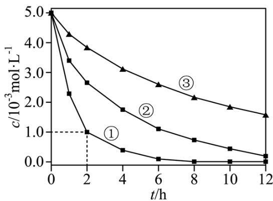

<table><tr><td>实验序号</td><td>水样体积/mL</td><td>纳米铁质量/mg</td><td>水样初始pH</td></tr><tr><td>1</td><td>50</td><td>8</td><td>6</td></tr><tr><td>2</td><td>50</td><td>2</td><td>6</td></tr><tr><td>3</td><td>50</td><td>2</td><td>8</td></tr></table>

下列说法正确的是

A. 实验①中，0\~2小时内平均反应速率 $\mathrm{v}\left(\mathrm{SeO}_4^{2-}\right) = 2.0\mathrm{mol}\cdot \mathrm{L}^{-1}\cdot \mathrm{h}^{-1}$ B. 实验③中，反应的离子方程式为： $2\mathrm{Fe} + \mathrm{SeO}_4^{2-} + 8\mathrm{H}^+ = 2\mathrm{Fe}^{3+} + \mathrm{Se} + 4\mathrm{H}_2\mathrm{O}$ C. 其他条件相同时，适当增加纳米铁质量可加快反应速率  
D. 其他条件相同时，水样初始 $\mathsf{pH}$ 越小， $\mathrm{SeO}_4^{2-}$ 的去除效果越好

【详解】A. 实验①中，0\~2小时内平均反应速率 $\mathrm{v}\left(\mathrm{SeO}_{4}^{2-}\right)=\frac{(5.0\times10^{-3}-1.0\times10^{-3})\mathrm{mol}\cdot\mathrm{L}^{-1}}{2\mathrm{h}}=2.0\times10^{-3}\mathrm{mol}\cdot\mathrm{L}^{-1}\cdot\mathrm{h}^{-1}, \mathrm{A}$ 不正确；
B. 实验③中水样初始 pH=8，溶液显弱碱性，发生反应的离子方程式中不能用 $H^{+}$ 配电荷守恒，B 不正确；
C. 综合分析实验①和②可知，在相同时间内，实验①中 $SeO_{4}^{2-}$ 浓度的变化量大，因此，其他条件相同时，适当增加纳米铁质量可加快反应速率，C 正确；
D. 综合分析实验③和②可知，在相同时间内，实验②中 $SeO_{4}^{2-}$ 浓度的变化量大，因此，其他条件相同时，适当减小初始 pH， $SeO_{4}^{2-}$ 的去除效果越好，但是当初始 pH 太小时， $H^{+}$ 浓度太大，纳米铁与 $H^{+}$ 反应速率加快，会导致与 $SeO_{4}^{2-}$ 反应的纳米铁减少，因此，当初始 pH 越小时 $SeO_{4}^{2-}$ 的去除效果不一定越好，D 不正确；

综上所述，本题选 C。

13. 环境保护工程师研究利用 $Na_{2}S$ 、FeS 和 $H_{2}S$ 处理水样中的 $Cd^{2+}$ 。已知 $25^{\circ}C$ 时， $H_{2}S$ 饱和溶液浓度约为 $0.1\,mol\cdot L^{-1}$ ， $K_{a1}(H_{2}S)=10^{-6.97}$ ， $K_{a2}(H_{2}S)=10^{-12.90}$ ， $K_{sp}(FeS)=10^{-17.20}$ ， $K_{sp}(CdS)=10^{-26.10}$ 。下列说法错误的是

$$
\mathrm{Na} _ {2} \mathrm{S}
$$

$$
\mathrm{c} \left(\mathrm{H} ^ {+}\right) + \mathrm{c} \left(\mathrm{Na} ^ {+}\right) = \mathrm{c} \left(\mathrm{OH} ^ {-}\right) + \mathrm{c} \left(\mathrm{HS} ^ {-}\right) + 2 \mathrm{c} \left(\mathrm{S} ^ {2 -}\right)
$$

$$
0. 0 1 \mathrm{mol} \cdot \mathrm{L} ^ {- 1} \mathrm{Na} _ {2} \mathrm{S}
$$

$$
\mathrm{c} \left(\mathrm{Na} ^ {+}\right) > \mathrm{c} \left(\mathrm{S} ^ {2 -}\right) > \mathrm{c} \left(\mathrm{OH} ^ {-}\right) > \mathrm{c} \left(\mathrm{HS} ^ {-}\right)
$$

$$
\mathrm{c} \left(\mathrm{Cd} ^ {2 +}\right) = 0. 0 1 \mathrm{mol} \cdot \mathrm{L} ^ {- 1}
$$

$$
\mathrm{c} \left(\mathrm{Cd} ^ {2 +}\right) <   1 0 ^ {- 8} \mathrm{mol} \cdot \mathrm{L} ^ {- 1}
$$

D. 向 $\mathrm{c}\left(\mathrm{Cd}^{2+}\right)=0.01\mathrm{mol}\cdot\mathrm{L}^{-1}$ 的溶液中通入 $\mathrm{H}_{2}\mathrm{S}$ 气体至饱和，所得溶液中： $\mathrm{c}\left(\mathrm{H}^{+}\right)>\mathrm{c}\left(\mathrm{Cd}^{2+}\right)$

【答案】B

【解析】

【详解】A. $Na_{2}S$ 溶液中只有 5 种离子，分别是 $H^{+}$ 、 $Na^{+}$ 、 $OH^{-}$ 、 $HS^{-}$ 、 $S^{2-}$ ，溶液是电中性的，存在电荷守恒，可表示为 $c(H^{+}) + c(Na^{+}) = c(OH^{-}) + c(HS^{-}) + 2c(S^{2-})$ ，A 正确；
B. $0.01mol\cdot L^{-1}Na_{2}S$ 溶液中， $S^{2-}$ 水解使溶液呈碱性，其水解常数为 $K_{h}=\frac{c(OH^{-})\cdot c(HS^{-})}{c(S^{2-})}=\frac{K_{w}}{K_{a2}}=\frac{10^{-14}}{10^{-12.9}}=10^{-1.1}$ ，根据硫元素守恒可知 $c(\mathrm{HS}^{-})<10^{-1.1}\mathrm{mol}\cdot\mathrm{L}^{-1}$ ，所以 $\frac{c(OH^{-})}{c(S^{2-})}>1$ ，则 $c(OH^{-})>c(S^{2-})$ ，B 不正确；
C. $K_{sp}(FeS)$ 远远大于 $K_{sp}(CdS)$ ，向 $c(Cd^{2+})=0.01mol\cdot L^{-1}$ 的溶液中加入 FeS 时，可以发生沉淀的转化，该反应的平衡常数为 $K=\frac{K_{sp}(FeS)}{K_{sp}(CdS)}=\frac{10^{-17.20}}{10^{-26.10}}=10^{8.9}\gg10^{5}$ ，因此该反应可以完全进行，CdS 的饱和溶液中 $c(Cd^{2+})=\sqrt{10^{-26.1}}\mathrm{mol}\cdot\mathrm{L}^{-1}=10^{-13.05}\mathrm{mol}\cdot\mathrm{L}^{-1}$ ，若加入足量 FeS 时可使 $c(Cd^{2+})<10^{-8}\mathrm{mol}\cdot\mathrm{L}^{-1}$ ，C 正确
D. $Cd^{2+} + H_{2}S \rightleftharpoons CdS + 2H^{+}$ 的平衡常数

$K=\frac{c^{2}(H^{+})}{c(Cd^{2+})\cdot c(H_{2}S)}=\frac{K_{a1}\cdot K_{a2}}{K_{sp}}=\frac{10^{-6.97}\times10^{-12.90}}{10^{-26.10}}=10^{6.23}\gg10^{5}$ ，该反应可以完全进行，因此，当向 $c(Cd^{2+})=0.01mol\cdot L^{-1}$ 的溶液中通入 $H_{2}S$ 气体至饱和， $Cd^{2+}$ 可以完全沉淀，所得溶液中 $c(H^{+})>c(Cd^{2+})$ ，D 正确；
综上所述，本题选 B。

14. 研究人员制备了一种具有锂离子通道的导电氧化物 $\left(\mathrm{Li}_{\mathrm{x}} \mathrm{La}_{\mathrm{y}} \mathrm{TiO}_{3}\right)$ ，其立方晶胞和导电时 $\mathsf{Li}^{+}$ 迁移过程如下图所示。已知该氧化物中 Ti 为 +4 价，La 为 +3 价。下列说法错误的是

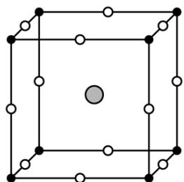

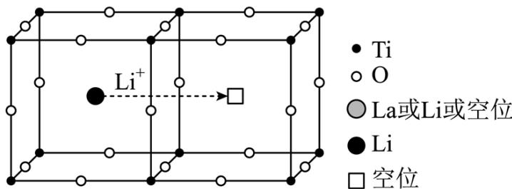

立方晶胞 $(\mathrm{Li}_x\mathrm{La}_y\mathrm{TiO}_3)$ $\mathrm{Li^{+}}$ 迁移过程示意图  
A.导电时，Ti和La的价态不变 B.若 $\mathrm{x} = \frac{1}{3}$ ， $\mathsf{Li}^+$ 与空位的数目相等  
C.与体心最邻近的O原子数为12 D.导电时、空位移动方向与电流方向相反

【答案】B

【解析】

【详解】A．根据题意，导电时 $Li^{+}$ 发生迁移，化合价不变，则 Ti 和 La 的价态不变，A 项正确；

B. 根据 “均摊法”，1 个晶胞中含 Ti: $8 \times \frac{1}{8} = 1$ 个，含 O: $12 \times \frac{1}{4} = 3$ 个，含 La 或 Li 或空位共：1 个，若 $x = \frac{1}{3}$ ，则 La 和空位共 $\frac{2}{3}$ ， $n(La) + n(\text{空位}) = \frac{2}{3}$ ，结合正负化合价代数和为 0， $(+1) \times \frac{1}{3} + (+3) \times n(La) + (+4) \times 1 + (-2) \times 3 = 0$ ，解得 $n(La) = \frac{5}{9}$ 、 $n(\text{空位}) = \frac{1}{9}$ ， $Li^{+}$ 与空位数目不相等，B 项错误；

C. 由立方晶胞的结构可知, 与体心最邻近的 O 原子数为 12 , 即位于棱心的 12 个 O 原子, C 项正确; D. 导电时 $\mathrm{Li^{+}}$ 向阴极移动方向, 即与电流方向相同, 则空位移动方向与电流方向相反, D 项正确;

## 二、非选择题：本题共4小题，共58分。

15. 精炼铜产生的铜阳极泥富含 Cu、Ag、Au 等多种元素。研究人员设计了一种从铜阳极泥中分离提收金和银的流程，如下图所示。

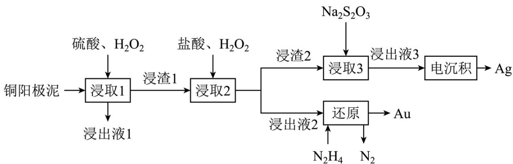

回答下列问题:

(1) Cu 位于元素周期表第\_\_\_\_周期第\_\_\_\_族。

(2) “浸出液 1” 中含有的金属离子主要是\_\_\_\_。

(3) “浸取 2” 步骤中, 单质金转化为 $\mathrm{HAuCl}_{4}$ 的化学方程式为\_\_\_\_。

（4）“浸取3”步骤中，“浸渣2”中的\_\_\_\_(填化学式)转化为 $\left[\mathrm{Ag}\left(\mathrm{S}_{2}\mathrm{O}_{3}\right)_{2}\right]^{3-}$ 。

(5) “电沉积”步骤中阴极的电极反应式为\_\_\_\_。“电沉积”步骤完成后, 阴极区溶液中可循环利用的物质为\_\_\_\_(填化学式)。

(6) “还原”步骤中, 被氧化的 $\mathrm{N}_{2} \mathrm{H}_{4}$ 与产物 $\mathrm{Au}$ 的物质的量之比为\_\_\_\_。

(7) $\mathrm{Na}_{2} \mathrm{~S}_{2} \mathrm{O}_{3}$ 可被 $\mathrm{I}_{2}$ 氧化为 $\mathrm{Na}_{2} \mathrm{~S}_{4} \mathrm{O}_{6}$ 。从物质结构的角度分析 $\mathrm{S}_{4} \mathrm{O}_{6}^{2-}$ 的结构为(a)而不是(b)的原因: \_\_\_\_。

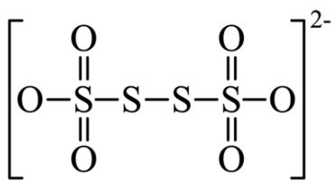  
(a)

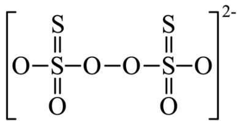  
(b)

【答案】(1) ①. 四 ②. IB

(2) $\mathrm{Cu^{2+}}$ (3) $2\mathrm{Au} + 8\mathrm{HCl} + 3\mathrm{H}_2\mathrm{O}_2 = 2\mathrm{HAuCl}_4 + 6\mathrm{H}_2\mathrm{O}$

(4) AgCl (5) ①. $\left[\mathrm{Ag}(\mathrm{S}_{2}\mathrm{O}_{3})_{2}\right]^{3-} + \mathrm{e}^{-} = \mathrm{Ag}\downarrow +2\mathrm{S}_{2}\mathrm{O}_{3}^{2-}$ ②. $\mathrm{Na}_2\mathrm{S}_2\mathrm{O}_3$

(6) 3:4 (7) (a)结构中电子云分布较均衡, 结构较为稳定, (b)结构中正负电荷中心不重合, 极性较大, 较不稳定, 且存在过氧根, 过氧根的氧化性大于 $\mathrm{I}_{2}$ , 故 $\mathrm{Na}_{2} \mathrm{~S}_{2} \mathrm{O}_{3}$ 不能被 $\mathrm{I}_{2}$ 氧化成(b)结构

【分析】精炼铜产生的铜阳极泥富含 Cu、Ag、Au 等元素，铜阳极泥加入硫酸、 $H_{2}O_{2}$ 浸取，Cu 被转化为 $Cu^{2+}$ 进入浸取液 1 中，Ag、Au 不反应，浸渣 1 中含有 Ag 和 Au；浸渣 1 中加入盐酸、 $H_{2}O_{2}$ 浸取，Au 转化为 $\mathrm{HAuCl_4}$ 进入浸取液2，Ag转化为 $\mathrm{AgCl}$ ，浸渣2中含有 $\mathrm{AgCl}$ ；浸取液2中加入 $\mathrm{N}_2\mathrm{H}_4$ 将 $\mathrm{HAuCl_4}$ 还原为 $\mathrm{Au}$ ，同时 $\mathrm{N}_2\mathrm{H}_4$ 被氧化为 $\mathrm{N}_2$ ；浸渣2中加入 $\mathrm{Na}_2\mathrm{S}_2\mathrm{O}_3$ ，将 $\mathrm{AgCl}$ 转化为 $\left[\mathrm{Ag}(\mathrm{S}_2\mathrm{O}_3)_2\right]^{3-}$ ，得到浸出液3，利用电沉积法将 $\left[\mathrm{Ag}(\mathrm{S}_2\mathrm{O}_3)_2\right]^{3-}$ 还原为 $\mathrm{Ag}$ 。

【小问 1 详解】

Cu 的原子序数为 29，位于第四周期第 IB 族；

【小问 2 详解】

由分析可知, 铜阳极泥加入硫酸、 $\mathrm{H}_{2} \mathrm{O}_{2}$ 浸取, $\mathrm{Cu}$ 被转化为 $\mathrm{Cu}^{2+}$ 进入浸取液 1 中, 故浸取液 1 中含有的金属离子主要是 $\mathrm{Cu}^{2+}$ ;

【小问 3 详解】

浸取 2 步骤中，Au 与盐酸、 $H_{2}O_{2}$ 反应氧化还原反应，生成 $HAuCl_{4}$ 和 $H_{2}O$ ，根据得失电子守恒及质量守恒，可得反应得化学方程式为： $2Au + 8HCl + 3H_{2}O_{2} = 2HAuCl_{4} + 6H_{2}O$ ；

【小问 4 详解】

根据分析可知，浸渣2中含有 $\mathrm{AgCl}$ ，与 $\mathrm{Na}_2\mathrm{S}_2\mathrm{O}_3$ 反应转化为 $\left[\mathrm{Ag}(\mathrm{S}_2\mathrm{O}_3)_2\right]^{3-}$ ；

【小问 5 详解】

电沉积步骤中，阴极发生还原反应， $\left[\mathrm{Ag}(\mathrm{S}_{2}\mathrm{O}_{3})_{2}\right]^{3-}$ 得电子被还原为 $\mathrm{Ag}$ ，电极反应式为： $\left[\mathrm{Ag}(\mathrm{S}_{2}\mathrm{O}_{3})_{2}\right]^{3-} + \mathrm{e}^{-} = \mathrm{Ag}\downarrow + 2\mathrm{S}_{2}\mathrm{O}_{3}^{2-}$ ；阴极反应生成 $\mathrm{S}_{2}\mathrm{O}_{3}^{2-}$ ，同时阴极区溶液中含有 $\mathrm{Na}^{+}$ ，故电沉积步骤完成后，阴极区溶液中可循环利用得物质为 $\mathrm{Na}_{2}\mathrm{S}_{2}\mathrm{O}_{3}$ ；

【小问6详解】

还原步骤中， $\mathrm{HAuCl_4}$ 被还原为 $\mathrm{Au}$ ， $\mathrm{Au}$ 化合价由 $+3$ 价变为 0 价，一个 $\mathrm{HAuCl_4}$ 转移 3 个电子， $\mathrm{N}_2\mathrm{H}_4$ 被氧化为 $\mathrm{N}_2$ ， $\mathrm{N}$ 的化合价由 -2 价变为 0 价，一个 $\mathrm{N}_2\mathrm{H}_4$ 转移 4 个电子，根据得失电子守恒，被氧化的 $\mathrm{N}_2\mathrm{H}_4$ 与产物 $\mathrm{Au}$ 的物质的量之比为 3:4;

【小问 7 详解】

(a)结构中电子云分布较均衡，结构较为稳定，(b)结构中正负电荷中心不重合，极性较大，较不稳定，且存在过氧根，过氧根的氧化性大于 $\mathrm{I}_2$ ，故 $\mathrm{Na_2S_2O_3}$ 不能被 $\mathrm{I}_2$ 氧化成(b)结构。

16. 测定铁矿石中铁含量的传统方法是 $\mathrm{SnCl}_2\text{-HgCl}_2\text{-K}_2\mathrm{Cr}_2\mathrm{O}_7$ ，滴定法。研究小组用该方法测定质量为 ag 的某赤铁矿试样中的铁含量。

【配制溶液】

① $c\ mol\cdot L^{-1}K_{2}Cr_{2}O_{7}$ 标准溶液。

浓盐酸 试样

② $SnCl_{2}$ 溶液：称取 $6g\ SnCl_{2}\cdot2H_{2}O$ 溶于20mL浓盐酸，加水至100mL，加入少量锡粒。

【测定含量】按下图所示(加热装置路去)操作步骤进行实验。

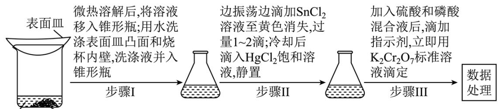

已知：氯化铁受热易升华；室温时 $HgCl_{2}$ ，可将 $Sn^{2+}$ 氧化为 $Sn^{4+}$ 。难以氧化 $Fe^{2+}$ ； $Cr_{2}O_{7}^{2-}$ 可被 $Fe^{2+}$ 还原为 $Cr^{3+}$ 。回答下列问题：

(1) 下列仪器在本实验中必须用到的有\_\_\_\_(填名称)。

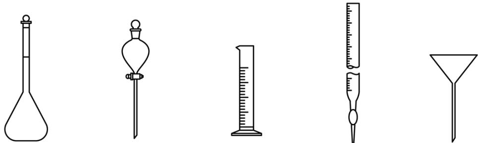

(2) 结合离子方程式解释配制 $\mathrm{SnCl}_{2}$ 溶液时加入锡粒的原因: \_\_\_\_。

(3) 步骤 I 中“微热”的原因是\_\_\_\_。

(4) 步琛III中, 若未“立即滴定”, 则会导致测定的铁含量\_\_\_\_(填“偏大”“偏小”或“不变”)。

(5) 若消耗 $\mathrm{cmol} \cdot \mathrm{L}^{-1} \mathrm{K}_{2} \mathrm{Cr}_{2} \mathrm{O}_{7}$ 标准溶液 $\mathrm{V} \, \mathrm{mL}$ , 则 $\mathrm{a} \, \mathrm{g}$ 试样中 $\mathrm{Fe}$ 的质量分数为\_\_\_\_(用含 $\mathrm{a} 、 \mathrm{c} 、 \mathrm{V}$ 的代数式表示)。

(6) $\mathrm{SnCl}_{2} - \mathrm{TiCl}_{3} - \mathrm{KMnO}_{4}$ 滴定法也可测定铁的含量, 其主要原理是利用 $\mathrm{SnCl}_{2}$ 和 $\mathrm{TiCl}_{3}$ 将铁矿石试样中 $\mathrm{Fe}^{3+}$ 还原为 $\mathrm{Fe}^{2+}$ , 再用 $\mathrm{KMnO}_{4}$ 标准溶液滴定。

①从环保角度分析, 该方法相比于 $\mathrm{SnCl}_{2}-\mathrm{HgCl}_{2}-\mathrm{K}_{2} \mathrm{Cr}_{2} \mathrm{O}_{7}$ , 滴定法的优点是\_\_\_\_。

②为探究 $\mathrm{KMnO}_4$ 溶液滴定时， $\mathrm{Cl^-}$ 在不同酸度下对 $\mathrm{Fe}^{2+}$ 测定结果的影响，分别向下列溶液中加入 1 滴 $0.1 \mathrm{~mol} \cdot \mathrm{L}^{-1} \mathrm{KMnO}_4$ 溶液，现象如下表：

<table><tr><td></td><td>溶液</td><td>现象</td></tr><tr><td>空白实验</td><td>2mL 0.3mol·L-1NaCl 溶液 +0.5mL 试剂 X</td><td>紫红色不褪去</td></tr><tr><td>实验I</td><td>2mL 0.3mol·L-1NaCl溶液+0.5 mL 0.1mol·L-1硫酸</td><td>紫红色不褪去</td></tr><tr><td>实验ii</td><td>2mL 0.3mol·L-1NaCl溶液+0.5 mL 6mol·L-1硫酸</td><td>紫红色明显变浅</td></tr></table>

表中试剂 X 为\_\_\_\_；根据该实验可得出的结论是\_\_\_\_。

【答案】（1）容量瓶、量筒

(2) $\mathrm{Sn}^{2+}$ 易被空气氧化为 $\mathrm{Sn}^{4+}$ , 离子方程式为 $2\mathrm{Sn}^{2+} + \mathrm{O}_2 + 4\mathrm{H}^+ = 2\mathrm{Sn}^{4+} + 2\mathrm{H}_2\mathrm{O}$ , 加入 Sn, 发生反应 $\mathrm{Sn}^{4+} + \mathrm{Sn} = 2\mathrm{Sn}^{2+}$ , 可防止 $\mathrm{Sn}^{2+}$ 氧化

（3）增大 $SnCl_{2}\cdot2H_{2}O$ 的溶解度，促进其溶解

(4) 偏小 (5) $\frac{33.6\mathrm{cV}}{\mathrm{a}}\%$

(6) ①. 更安全, 对环境更友好 ②. $\mathrm{H}_{2} \mathrm{O}$ ③. 酸性越强, $\mathrm{KMnO}_{4}$ 的氧化性越强, $\mathrm{Cl}-$ 被 $\mathrm{KMnO}_{4}$ 氧化的可能性越大, 对 $\mathrm{Fe}^{2+}$ 测定结果造成干扰的可能性越大, 因此在 $\mathrm{KMnO}_{4}$ 标准液进行滴定时, 要控制溶液的 $\mathrm{pH}$ 值

【解析】

【分析】浓盐酸与试样反应，使得试样中 Fe 元素以离子形式存在，滴加稍过量的 $SnCl_{2}$ 使 $Fe^{3+}$ 还原为 $Fe^{2+}$ ，冷却后滴加 $HgCl_{2}$ ，将多余的 $Sn^{2+}$ 氧化为 $Sn^{4+}$ ，加入硫酸和磷酸混合液后，滴加指示剂，用 $K_{2}Cr_{2}O_{7}$ 进行滴定，将 $Fe^{2+}$ 氧化为 $Fe^{3+}$ ，化学方程式为 $6Fe^{2+} + Cr_{2}O_{7}^{2-} + 14H^{+} = 2Cr^{3+} + 6Fe^{3+} + 7H_{2}O$ 。

【小问 1 详解】

配制 $SnCl_{2}$ 溶液需要用到容量瓶和量筒，滴定需要用到酸式滴定管，但给出的为碱式滴定管，因此给出仪器中，本实验必须用到容量瓶、量筒；

【小问 2 详解】

$Sn^{2+}$ 易被空气氧化为 $Sn^{4+}$ ，离子方程式为 $2Sn^{2+} + O_{2} + 4H^{+} = 2Sn^{4+} + 2H_{2}O$ ，加入 Sn，发生反应 $Sn^{4+} + Sn = 2Sn^{2+}$ ，可防止 $Sn^{2+}$ 氧化；

【小问 3 详解】

步骤 I 中“微热”是为了增大 $SnCl_{2} \cdot 2H_{2}O$ 的溶解度，促进其溶解；

【小问 4 详解】

步琛III中，若未“立即滴定”， $\mathrm{Fe}^{2+}$ 易被空气中的 $\mathrm{O}_2$ 氧化为 $\mathrm{Fe}^{3+}$ ，导致测定的铁含量偏小；

【小问 5 详解】

根据方程式 $6\mathrm{Fe}^{2+} + \mathrm{Cr}_2\mathrm{O}_7^{2-} + 14\mathrm{H}^+ = 2\mathrm{Cr}^{3+} + 6\mathrm{Fe}^{3+} + 7\mathrm{H}_2\mathrm{O}$ 可得：

$n\left(Fe^{2+}\right)=6\times n\left(Cr_{2}O_{7}^{2-}\right)=6\times10^{-3}cVmol$ ，ag试样中Fe元素的质量为

$6\times 10^{-3}\mathrm{cVmol}\times 56\mathrm{g / mol} = 0.336\mathrm{cVg}$ ，质量分数为 $\frac{0.336\mathrm{cVg}}{\mathrm{ag}}\times 100\% = \frac{33.6\mathrm{cV}}{\mathrm{a}}\%$

【小问6详解】

① $SnCl_{2}-HgCl_{2}-K_{2}Cr_{2}O_{7}$ 方法中， $HgCl_{2}$ 氧化 $Sn^{2+}$ 的离子方程式为： $Hg^{2+}+Sn^{2+}=Sn^{4+}+Hg$ ，生成的 Hg 有剧毒，因此 $SnCl_{2}-TiCl_{3}-KMnO_{4}$ 相比于 $SnCl_{2}-HgCl_{2}-K_{2}Cr_{2}O_{7}$ 的优点是：更安全，对环境更友好；

② $2 \mathrm{~mL} 0.3 \mathrm{~mol} \cdot \mathrm{L}^{-1} \mathrm{NaCl}$ 溶液 $+0.5 \mathrm{~mL}$ 试剂 X，为空白试验，因此 X 为 $\mathrm{H}_{2} \mathrm{O}$ ；由表格可知，酸性越强， $\mathrm{KMnO}_{4}$ 的氧化性越强， $\mathrm{Cl}^{-}$ 被 $\mathrm{KMnO}_{4}$ 氧化的可能性越大，对 $\mathrm{Fe}^{2+}$ 测定结果造成干扰的可能性越大，因此在 $\mathrm{KMnO}_{4}$ 标准液进行滴定时，要控制溶液的 pH 值。

17. 乙烯是一种用途广泛的有机化工原料。由乙烷制乙烯的研究备受关注。回答下列问题：【乙烷制乙烯】

(1) $C_{2}H_{6}$ 氧化脱氢反应:

$$
\begin{array}{l l} 2 \mathrm{C} _ {2} \mathrm{H} _ {6} (\mathrm{g}) + \mathrm{O} _ {2} (\mathrm{g}) = 2 \mathrm{C} _ {2} \mathrm{H} _ {4} (\mathrm{g}) + 2 \mathrm{H} _ {2} \mathrm{O} (\mathrm{g}) & \Delta \mathrm{H} _ {1} = - 2 0 9. 8 \mathrm{kJ} \cdot \mathrm{mol} ^ {- 1} \\ \mathrm{C} _ {2} \mathrm{H} _ {6} (\mathrm{g}) + \mathrm{CO} _ {2} (\mathrm{g}) = \mathrm{C} _ {2} \mathrm{H} _ {4} (\mathrm{g}) + \mathrm{H} _ {2} \mathrm{O} (\mathrm{g}) + \mathrm{CO} (\mathrm{g}) & \Delta \mathrm{H} _ {2} = 1 7 8. 1 \mathrm{kJ} \cdot \mathrm{mol} ^ {- 1} \\ \text {计算：} 2 \mathrm{CO} (\mathrm{g}) + \mathrm{O} _ {2} (\mathrm{g}) = 2 \mathrm{CO} _ {2} (\mathrm{g}) & \Delta \mathrm{H} _ {3} = \_ \_ \_ \_ k J \cdot m o l ^ {- 1} \end{array}
$$

(2) $\mathrm{C}_{2} \mathrm{H}_{6}$ 直接脱氢反应为 $\mathrm{C}_{2} \mathrm{H}_{6}(\mathrm{~g}) = \mathrm{C}_{2} \mathrm{H}_{4}(\mathrm{~g}) + \mathrm{H}_{2}(\mathrm{~g})$ $\Delta \mathrm{H}_{4}$ , $\mathrm{C}_{2} \mathrm{H}_{6}$ 的平衡转化率与温度和压强的关系如图所示, 则 $\Delta \mathrm{H}_{4} =$ \_\_\_\_0(填“>”“<”或“=” )。结合下图。下列条件中, 达到平衡时转化率最接近 $40 \%$ 的是\_\_\_\_(填标号)。

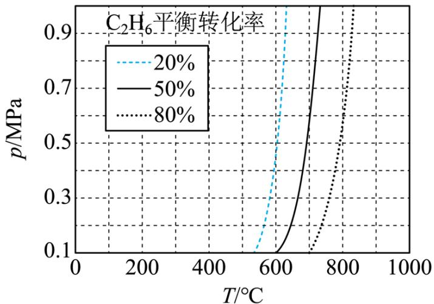

a. $600^{\circ}$ C, 0.6MPa b. $700^{\circ}$ C, 0.7MPa c. $800^{\circ}$ C, 0.8MPa

（3）一定温度和压强下、反应 i $\mathrm{C}_{2}\mathrm{H}_{6}(\mathrm{~g})\rightleftharpoons\mathrm{C}_{2}\mathrm{H}_{4}(\mathrm{~g})+\mathrm{H}_{2}(\mathrm{~g})\quad\mathrm{K}_{\mathrm{a1}}$

反应ii $C_{2}H_{6}(g)+H_{2}(g)\rightleftharpoons2CH_{4}(g)$ $K_{a2}(K_{a2}$ 远大于 $K_{a1})(K_{x}$ 是以平衡物质的量分数代替平衡浓度计算的平衡常数)

①仅发生反应 i 时。 $C_{2}H_{6}$ 的平衡转化率为 25.0%，计算 $K_{a1}=$ \_\_\_\_。

②同时发生反应 i 和 ii 时。与仅发生反应 i 相比， $C_{2}H_{4}$ 的平衡产率 \_\_\_\_ (填 “增大” “减小” 或 “不变”)。

【乙烷和乙烯混合气的分离】

(4) 通过 $\mathrm{Cu}^{+}$ 修饰的 Y 分子筛的吸附-脱附。可实现 $\mathrm{C}_{2} \mathrm{H}_{4}$ 和 $\mathrm{C}_{2} \mathrm{H}_{6}$ 混合气的分离。 $\mathrm{Cu}^{+}$ 的\_\_\_\_与 $\mathrm{C}_{2} \mathrm{H}_{4}$ 分子的 $\pi$ 键电子形成配位键，这种配位键强弱介于范德华力和共价键之间。用该分子筛分离 $\mathrm{C}_{2} \mathrm{H}_{4}$ 和 $\mathrm{C}_{2} \mathrm{H}_{6}$ 的优点是\_\_\_\_。

(5) 常温常压下, 将 $\mathrm{C}_{2} \mathrm{H}_{4}$ 和 $\mathrm{C}_{2} \mathrm{H}_{6}$ 等体积混合, 以一定流速通过某吸附剂。测得两种气体出口浓度 (c) 与进口浓度 ( $\mathbf{c}_{0}$ ) 之比随时间变化关系如图所示。下列推断合理的是 \_\_\_\_ (填标号)。

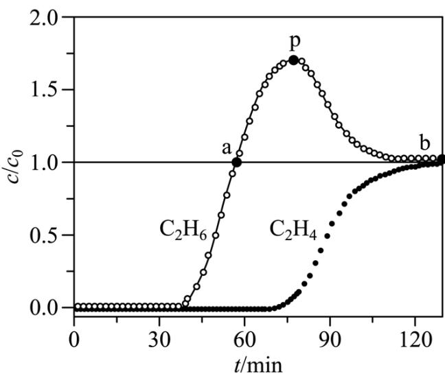

A. 前 $30 \mathrm{~min}$ , 两种气体均未被吸附  
B. p 点对应的时刻, 出口气体的主要成分是 $\mathrm{C}_{2} \mathrm{H}_{6}$ C. a-b 对应的时间段内, 吸附的 $\mathrm{C}_{2} \mathrm{H}_{6}$ 逐新被 $\mathrm{C}_{2} \mathrm{H}_{4}$ 替代

【答案】(1) -566
(2) ①. > ②. b
(3) ①. $\frac{1}{15}$ ②. 增大

(4) ①. 4s 空轨道 ②. 识别度高, 能有效将 $\mathrm{C}_{2} \mathrm{H}_{4}$ 和 $\mathrm{C}_{2} \mathrm{H}_{6}$ 分离, 分离出的产物中杂质少, 纯度较高
(5) BC
【解析】
【小问1详解】

将两个反应依次标号为反应①和反应②，反应①-反应②×2可得目标反应，则 $\Delta H_{3}=\Delta H_{1}-2\Delta H_{2}=(-209.8-178.1\times2)kJ/mol=-566kJ/mol$ 。

从图中可知，压强相同的情况下，随着温度升高， $\mathrm{C}_2\mathrm{H}_6$ 的平衡转化率增大，因此该反应为吸热反应， $\Delta \mathrm{H}_4 > 0$ 。  
a. $600^{\circ}\mathrm{C}$ ， $0.6\mathrm{MPa}$ 时， $\mathrm{C}_2\mathrm{H}_6$ 的平衡转化率约为 $20\%$ ，a 错误；  
b. $700^{\circ}\mathrm{C}$ ， $0.7\mathrm{MPa}$ 时， $\mathrm{C}_2\mathrm{H}_6$ 的平衡转化率约为 $50\%$ ，最接近 $40\%$ ，b 正确；  
c. $700^{\circ}\mathrm{C}$ ， $0.8\mathrm{MPa}$ 时， $\mathrm{C}_2\mathrm{H}_6$ 的平衡转化率接近 $50\%$ ，升高温度，该反应的化学平衡正向移动， $\mathrm{C}_2\mathrm{H}_6$ 转化率增大，因此 $800^{\circ}\mathrm{C}$ ， $0.8\mathrm{MPa}$ 时， $\mathrm{C}_2\mathrm{H}_6$ 的平衡转化率大于 $50\%$ ，c 错误；  
故答案选 b。

【小问 3 详解】

①仅发生反应 i，设初始时 $C_{2}H_{6}$ 物质的量为 1mol，平衡时 $C_{2}H_{6}$ 转化率为 25%，则消耗 $C_{2}H_{6}0.25mol$ ，生成 $C_{2}H_{4}0.25mol$ ，生成 $H_{2}0.25mol$ ， $K_{al}=\frac{0.2\times0.2}{0.6}=\frac{1}{15}$ 。

②只发生反应 i 时，随着反应进行，气体总物质的量增大，压强增大促使化学平衡逆向移动，同时发生反应 i 和反应 ii，且从题干可知 $K_{a2}$ 远大于 $K_{a1}$ ，反应 ii 为等体积反应，因为反应 ii 的发生相当于在单独发生反应 i 的基础上减小了压强，则反应 i 化学平衡正向移动， $C_{2}H_{4}$ 平衡产率增大。

【小问 4 详解】

配合物中，金属离子通常提供空轨道，配体提供孤电子对，则 $Cu^{+}$ 的 4s 空轨道与 $C_{2}H_{4}$ 分子的 $\pi$ 键电子形成配位键。 $C_{2}H_{4}$ 能与 $Cu^{+}$ 形成配合物而吸附在 Y 分子筛上， $C_{2}H_{6}$ 中无孤电子对不能与 $Cu^{+}$ 形成配合物而无法吸附，通过这种分子筛分离 $C_{2}H_{4}$ 和 $C_{2}H_{6}$ ，优点是识别度高，能有效将 $C_{2}H_{4}$ 和 $C_{2}H_{6}$ 分离，分离出的产物中杂质少，纯度较高。

【小问 5 详解】

A. 前 30min, $\frac{c}{c_0}$ 等于 0, 出口浓度 c 为 0, 说明两种气体均被吸附, A 错误;  
B. p 点时, $C_2H_6$ 对应的 $\frac{c}{c_0}$ 约为 1.75, 出口处 $C_2H_6$ 浓度较大, 而 $C_2H_4$ 对应的 $\frac{c}{c_0}$ 较小, 出口处 $C_2H_4$ 浓度较小, 说明此时出口处气体的主要成分为 $C_2H_6$ , B 正确;  
C. a 点处 $C_2H_6$ 的 $\frac{c}{c_0} = 1$ , 说明此时 $C_2H_6$ 不再吸附在吸附剂上, 而 a 点后 $C_2H_6$ 的 $\frac{c}{c_0} > 1$ , 说明原来吸附在吸附剂上的 $C_2H_6$ 也开始脱落, 同时从图中可知, a 点后一段时间, $C_2H_4$ 的 $\frac{c}{c_0}$ 仍为 0, 说明是吸附的 $C_2H_6$ 逐渐被 $C_2H_4$ 替代, p 点到 b 点之间, 吸附的 $C_2H_6$ 仍在被 $C_2H_4$ 替代, 但是速率相对之前有所减小, 同时吸附剂可能因吸附量有限等原因无法一直吸附 $C_2H_4$ , 因此 p 点后 $C_2H_4$ 的 $\frac{c}{c_0}$ 也逐步增大, 直至等于 1, 此时吸附剂不能再吸附两种物质, C 正确;  
故答案选 BC。

18. 化合物 1 是一种药物中间体，可由下列路线合成(Ph 代表苯基，部分反应条件略去):

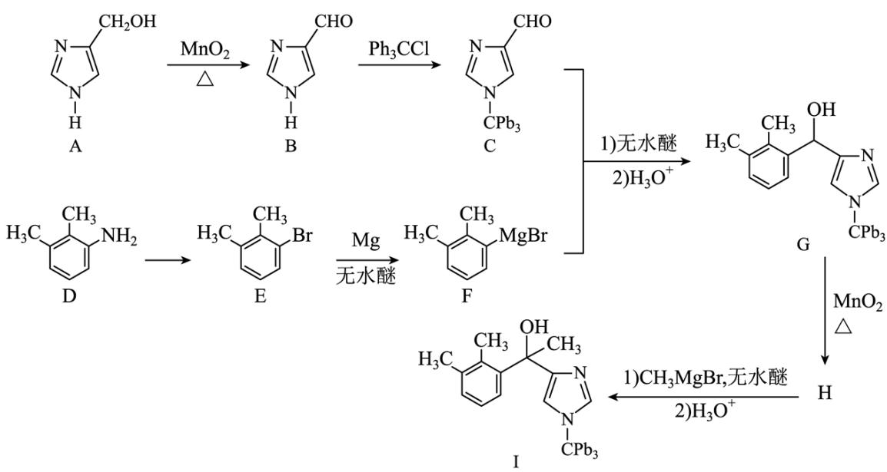

已知：

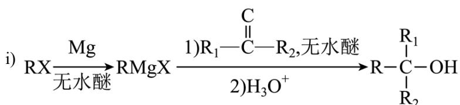

ii) RMgX 易与含活泼氢化合物(HY)反应: RMgX+HY $\longrightarrow$ RH+Mg $\begin{array}{c}Y\\ X\end{array}$ HY 代表 $H_{2}O$ 、ROH、RNH $_{2}$ 、RC $\equiv$ CH 等。

(1) A、B 中含氧官能团名称分别为\_\_\_\_、\_\_\_\_。

（2）E在一定条件下还原得到 $\begin{array}{c}\mathrm{CH}_{3}\\ \mathrm{CH}_{3}\end{array}$ ，后者的化学名称为\_\_\_\_。

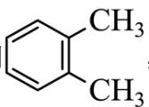

(3) H 的结构简式为 \_\_\_\_。

(4) E→F 反应中、下列物质不能用作反应溶剂的是\_\_\_\_(填标号)。

a. $\mathrm{CH}_3\mathrm{CH}_2\mathrm{OCH}_2\mathrm{CH}_3$ b. $\mathrm{CH}_3\mathrm{OCH}_2\mathrm{CH}_2\mathrm{OH}$ c. $\mathrm{O} \xrightarrow{\text{N}} \mathrm{H}$ d. $\mathrm{O}$

(5) D 的同分异构体中, 同时满足下列条件的有\_\_\_\_种(不考虑立体异构), 写出其中一种同分异构体的结构简式\_\_\_\_。

①含有手性碳 ②含有2个碳碳三键 ③不含甲基

（6）参照上述合成路线，设计以 $\mathrm{CH}_3\mathrm{C}\stackrel{\mathrm{O}}{\underset{|}{\mathrm{C}}} - \mathrm{Br}$ 和不超过3个碳的有机物为原料，制备一种光刻胶单

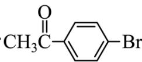

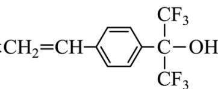

体 $CH_{2}=CH-\underset{CF_{3}}{\overset{CF_{3}}{\ce{<=>}}}$ -C-OH的合成路线\_\_\_\_(其他试剂任选)。

【答案】(1) ①. 羟基 ②. 醛基

(2) 1,2-二甲基苯(邻二甲苯)

(3)

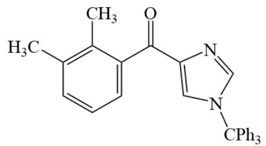

(5) ①.4 ②. $\mathrm{CH}\equiv \mathrm{C - CH_2 - CH_2 - CH_2 - CH(NH_2) - C}\equiv \mathrm{CH}$

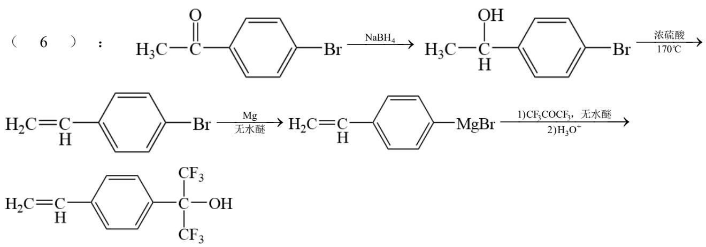

【解析】

【分析】有机物 A 中的羟基在 $MnO_{2}$ 的催化下与氧气反应生成醛基，有机物 B 与 $Ph_{3}CCl$ 发生取代反应生成有机物 C；有机物 D 中的氨基发生取代反应生成有机物 E，D 中的氨基变为 E 中的 Cl，E 发生已知条件 i 的两步反应与有机物 C 作用最终生成有机物 G；有机物 G 在 $MnO_{2}$ 的催化先与氧气反应生成有机物 H，有

机物 H 的结构为

I.

【小问1详解】

根据流程中 A 和 B 的结构，A 中的含氧官能团为羟基，B 中的含氧官能团为醛基。

【小问 2 详解】

根据题目中的结构，该结构的化学名称为 1，2-二甲基苯(邻二甲苯)。

【小问3详解】

根据分析，H 的结构简式为

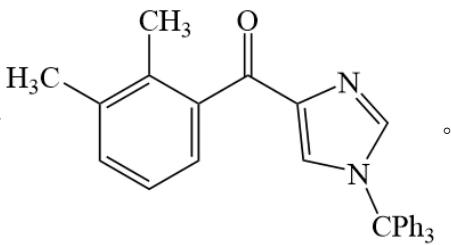

【小问 4 详解】

根据已知条件 ii，RMgX 可以与含有活泼氢的化合物（ $\mathrm{H}_{2} \mathrm{O}$ 、 $\mathrm{ROH}$ 、 $\mathrm{RNH}_{2}$ 、 $\mathrm{RC} \equiv \mathrm{CH}$ 等）发生反应，b 中含有羟基，c 中含有 N-H，其 H 原子为活泼 H 原子，因此不能用 b、c 作溶剂。

【小问 5 详解】

根据题目所给条件，同分异构体中含有 2 个碳碳三键，说明结构中不含苯环，结构中不含甲基，说明三键在物质的两端，同分异构体中又含有手性碳原子，因此，可能的结构有： $CH\equiv C-CH_{2}-CH_{2}-CH_{2}-CH(NH_{2})-C\equiv CH$ 、 $CH\equiv C-CH_{2}-CH_{2}-CH(NH_{2})-CH_{2}-C\equiv CH$ 、 $H\equiv C-CH_{2}-CH(CH_{2}NH_{2})-CH_{2}-CH_{2}-C\equiv CH$ 、 $H\equiv C-CH_{2}-CH(CH_{2}CH_{2}NH_{2})-CH_{2}-C\equiv CH$ ，共 4 种。

【小问6详解】

根据题目给出的流程，先将原料中的羰基还原为羟基，后利用浓硫酸脱水生成双键，随后将物质与 $\mathrm{Mg}$ 在无水醚中反应生成中间产物，后再与 $\mathrm{CF}_3\mathrm{COCF}_3$ 在无水醚中反应再水解生成目标化合物，具体的流程如

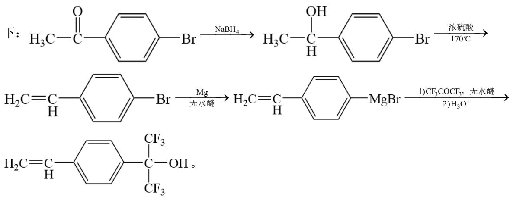