# 2024年全省普通高中学业水平等级考试

# 化学

## 注意事项：

1. 答卷前，考生务必将自己的姓名、考生号等填写在答题卡和试卷指定位置。

2. 回答选择题时，选出每小题答案后，用铅笔把答题卡上对应题目的答案标号涂黑。如需改动，用橡皮擦干净后，再选涂其他答案标号。回答非选择题时，将答案写在答题卡上。写在本试卷上无效。

3. 考试结束后，将本试卷和答题卡并交回。

可能用到的相对原子质量：H1 C 12 O 16 S 32

## 一、选择题：本题共10小题，每小题2分，共20分。每小题只有一个选项符合题目要求。

1. 中国书画是世界艺术瑰宝，古人所用文房四宝制作过程中发生氧化还原反应的是
A. 竹管、动物尾毫→湖笔
B. 松木→油烟→徽墨
C. 楮树皮→纸浆纤维→宣纸
D. 端石→端砚

【答案】B

【解析】

【详解】A. 湖笔, 以竹管为笔杆, 以动物尾毫为笔头制成, 不涉及氧化还原反应, A 不符合题意;  
B. 松木中的 C 元素主要以有机物的形式存在, 徽墨主要为 C 单质, 存在元素化合价的变化, 属于氧化还原反应, B 符合题意;  
C. 宣纸, 以楮树皮为原料, 得到纸浆纤维, 从而制作宣纸, 不涉及氧化还原反应, C 不符合题意;  
D. 端砚以端石为原料经过采石、维料、制璞、雕刻、磨光、配盒等步骤制成, 不涉及氧化还原反应, D 不符合题意;  
故选 B。

2. 化学品在食品工业中也有重要应用，下列说法错误的是
A. 活性炭可用作食品脱色剂 
B. 铁粉可用作食品脱氧剂
C. 谷氨酸钠可用作食品增味剂 
D. 五氧化二磷可用作食品干燥剂

【答案】D

【解析】

【详解】A．活性炭结构疏松多孔，具有吸附性，能够吸附一些食品中的色素，故 A 正确；
B．铁粉具有还原性，能与 $O_{2}$ 反应，可延长食品的保质期，作食品脱氧剂，故 B 正确；
C．谷氨酸钠是味精的主要成分，能增加食物的鲜味，是一种常用的食品增味剂，故 C 正确；

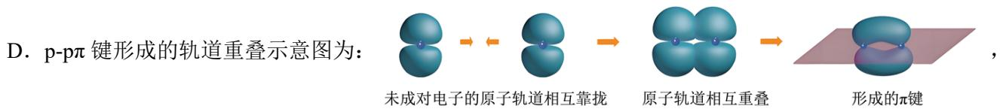

D. $\mathrm{P}_2\mathrm{O}_5$ 吸水后的产物有毒, 不能用作食品干燥剂, 故 D 错误; 故选 D。

3. 下列化学用语或图示正确的是

A.

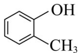

$\ce{C6H5OHCH3}$ 的系统命名：2-甲基苯酚

B. $O_{3}$ 分子的球棍模型:

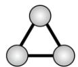

C. 激发态 H 原子的轨道表示式: 1s ↑ 1p

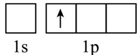

D. $p - p\pi$ 键形成的轨道重叠示意图: $\bigcirc + \bigcirc \rightarrow \bigcirc$

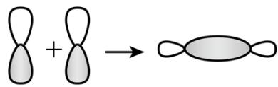

【答案】A

【解析】

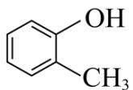

【详解】A. $\ce{C6H5OHCH3}$ 含有的官能团为羟基，甲基与羟基相邻，系统命名为：2-甲基苯酚，故A正

确；

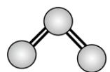

B. 臭氧中心 O 原子的价层电子对数为: $2 + \frac{6 - 2 \times 2}{2} = 3$ , 属于 $\mathrm{sp}^2$ 杂化, 有 1 个孤电子对, 臭氧为 V 形分子, 球棍模型为: , 故 B 错误;

C. K 能层只有 1 个能级 1s，不存在 1p 能级，故 C 错误；

未成对电子的原子轨道相互靠拢

原子轨道相互重叠

故 D 错误;

故选A。

4. 下列物质均为共价晶体且成键结构相似, 其中熔点最低的是
A. 金刚石(C) 
B. 单晶硅(Si) 
C. 金刚砂(SiC) 
D. 氮化硼(BN, 立方相)

【答案】B 【解析】

【详解】金刚石(C)、单晶硅(Si)、金刚砂(SiC)、立方氮化硼(BN)，都为共价晶体，结构相似，则原子半径越大，键长越长，键能越小，熔沸点越低，在这几种晶体中，键长 Si-Si>Si-C>B-N>C-C，所以熔点最低的为单晶硅。
故选 B。

5. 物质性质决定用途，下列两者对应关系错误的是
A. 石灰乳除去废气中二氧化硫，体现了 $\mathrm{Ca(OH)}_{2}$ 的碱性
B. 氯化铁溶液腐蚀铜电路板，体现了 $Fe^{3+}$ 的氧化性
C. 制作豆腐时添加石膏，体现了 $CaSO_{4}$ 的难溶性
D. 用氨水配制银氨溶液，体现了 $NH_{3}$ 的配位性

【答案】C

【解析】

【详解】A. $\mathrm{SO}_2$ 是酸性氧化物, 石灰乳为 $\mathrm{Ca(OH)}_2$ , 呈碱性, 吸收 $\mathrm{SO}_2$ 体现了 $\mathrm{Ca(OH)}_2$ 的碱性, A 正确; B. 氯化铁溶液腐蚀铜电路板, 发生的反应为 $2\mathrm{Fe}^{3+} + Cu = 2Fe^{2+} + Cu^{2+}$ , 体现了 $\mathrm{Fe}^{3+}$ 的氧化性, B 正确; C. 制作豆腐时添加石膏, 利用的是在胶体中加入电解质发生聚沉这一性质, 与 $\mathrm{CaSO}_4$ 难溶性无关, C 错误; D. 银氨溶液的配制是在硝酸银中逐滴加入氨水, 先生成白色沉淀 AgOH, 最后生成易溶于水的 $\mathrm{Ag(NH_3)_2OH}$ , $\mathrm{Ag(NH_3)_2OH}$ 中 $\mathrm{Ag^+}$ 和 $\mathrm{NH_3}$ 之间以配位键结合, 体现了 $\mathrm{NH}_3$ 的配位性, D 正确; 故选 C。

6. 下列图示实验中，操作规范的是

<table><tr><td></td><td></td><td></td><td></td></tr><tr><td>A.调控滴定速度</td><td>B.用pH试纸测定溶液pH</td><td>C.加热试管中的液体</td><td>D.向试管中滴加溶液</td></tr></table>

A.A B.B C.C D.D

【答案】A 【解析】

【详解】A．调控酸式滴定管的滴加速度，左手拇指、食指和中指轻轻向内扣住玻璃活塞，手心空握，所以 A 选项的操作符合规范；
B．用 pH 试纸测定溶液 pH 不能将 pH 试纸伸入溶液中，B 操作不规范；
C．加热试管中的液体，试管中液体体积不能超过试管体积的三分之一，C 操作不规范；
D．向试管中滴加液体，胶头滴管应该在试管上方竖直悬空，D 操作不规范；
故选 A。

7. 我国科学家在青蒿素研究方面为人类健康作出了巨大贡献。在青蒿素研究实验中，下列叙述错误的是
A. 通过萃取法可获得含青蒿素的提取液
B. 通过 X 射线衍射可测定青蒿素晶体结构
C. 通过核磁共振谱可推测青蒿素相对分子质量
D. 通过红外光谱可推测青蒿素分子中的官能团

【解析】

【详解】A. 某些植物中含有青蒿素, 可以通过用有机溶剂浸泡的方法将其中所含的青蒿素浸取出来, 这种方法也叫萃取, 固液分离后可以获得含青蒿素的提取液, A 正确;  
B. 晶体中结构粒子的排列是有规律的, 通过 X 射线衍射实验可以得到晶体的衍射图, 通过分析晶体的衍射图可以判断晶体的结构特征, 故 X 射线衍射可测定青蒿素晶体结构, B 正确;  
C. 通过核磁共振谱可推测青蒿素分子中不同化学环境的氢原子的种数及其数目之比, 但不能测定青蒿素的相对分子质量, 要测定青蒿素相对分子质量应该用质谱法, C 不正确;  
D. 红外光谱可推测有机物分子中含有的官能团和化学键, 故通过红外光谱可推测青蒿素分子中的官能团, D 正确;  
综上所述, 本题选 C。

8. 植物提取物阿魏萜宁具有抗菌活性，其结构简式如图所示。下列关于阿魏萜宁的说法错误的是

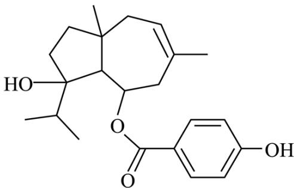  
阿魏萜宁

A. 可与 $\mathrm{Na}_{2} \mathrm{CO}_{3}$ 溶液反应 B. 消去反应产物最多有 2 种 C. 酸性条件下的水解产物均可生成高聚物 D. 与 $\mathrm{Br}_{2}$ 反应时可发生取代和加成两种反应

【解析】

【分析】由阿魏萜宁的分子结构可知, 其分子中存在醇羟基、酚羟基、酯基和碳碳双键等多种官能团。

【详解】A. 该有机物含有酚羟基, 故又可看作是酚类物质, 酚羟基能显示酸性, 且酸性强于 $\mathrm{HCO}_{3}^{-}$ ; $\mathrm{Na}_{2} \mathrm{CO}_{3}$ 溶液显碱性, 故该有机物可与 $\mathrm{Na}_{2} \mathrm{CO}_{3}$ 溶液反应, A 正确;

B. 由分子结构可知, 与醇羟基相连的 C 原子共与 3 个不同化学环境的 C 原子相连, 且这 3 个 C 原子上均连接了 H 原子, 因此, 该有机物发生消去反应时, 其消去反应产物最多有 3 种, B 不正确;

C. 该有机物酸性条件下的水解产物有 2 种, 其中一种含有碳碳双键和 2 个醇羟基, 这种水解产物既能通过发生加聚反应生成高聚物, 也能通过缩聚反应生成高聚物; 另一种水解产物含有羧基和酚羟基, 其可以发生缩聚反应生成高聚物, C 正确;

D. 该有机物分子中含有酚羟基且其邻位上有 H 原子, 故其可与浓溴水发生取代反应; 还含有碳碳双键, 故其可 $\mathrm{Br}_{2}$ 发生加成, 因此, 该有机物与 $\mathrm{Br}_{2}$ 反应时可发生取代和加成两种反应, D 正确;

综上所述, 本题选 B。

9. 由 O、F、I 组成化学式为 $IO_{2}F$ 的化合物，能体现其成键结构的片段如图所示。下列说法正确的是

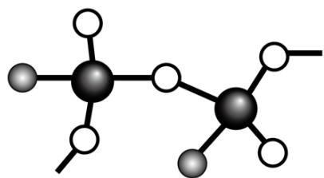

A. 图中 O 代表 F 原子
B. 该化合物中存在过氧键
C. 该化合物中 I 原子存在孤对电子
D. 该化合物中所有碘氧键键长相等

【解析】

【分析】由图中信息可知，白色的小球可形成2个共价键，灰色的小球只形成1个共价键，黑色的大球形成了4个共价键，根据O、F、I的电负性大小（F最大、I最小）及其价电子数可以判断，白色的小球代表O原子、灰色的小球代表F原子，黑色的大球代表I原子。

【详解】A. 图中O（白色的小球）代表O原子，灰色的小球代表F原子，A不正确；

B. 根据该化合物结构片断可知，每个I原子与3个O原子形成共价键，根据均摊法可以判断必须有2个O原子分别与2个I原子成键，才能确定该化合物化学式为 $IO_{2}F$ ，因此，该化合物中不存在过氧键，B不正确；

C. I原子的价电子数为7，该化合物中F元素的化合价为-1，O元素的化合价为-2，则I元素的化合价为+5，据此可以判断每I原子与其他原子形成3个单键和1个双键，I原子的价电子数不等于其形成共价键的数目，因此，该化合物中I原子存在孤对电子，C正确；

D. 该化合物中既存在I—O单键，又存在I=O双键，单键和双键的键长是不相等的，因此，该化合物中所有碘氧键键长不相等，D不正确；

综上所述，本题选C。

10. 常温下Ag(I)-CH₃COOH水溶液体系中存在反应：Ag⁺+CH₃COO⁻⇌CH₃COOAg(aq)，平衡常数为K。已初始浓度c₀(Ag⁺)=c₀(CH₃COOH)=0.08mol·L⁻¹，所有含碳物种的摩尔分数与pH变化关系如图所示(忽略溶液体积变化)。下列说法正确的是

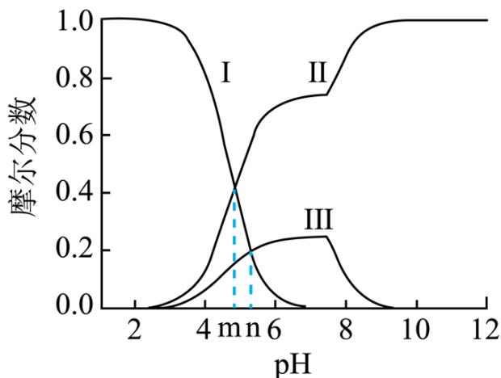

A. 线Ⅱ表示 $CH_{3}OOOH$ 的变化情况
B. $CH_{3}OOOH$ 的电离平衡常数 $K_{a}=10^{-n}$ C. pH=n 时， $c(Ag^{+})=\frac{10^{m-n}}{K}mol\cdot L^{-1}$

D. pH=10 时， $c(Ag^{+})+c(CH_{3}COOAg)=0.08mol\cdot L^{-1}$ 【答案】C
【解析】

【分析】在溶液中存在平衡： $\mathrm{CH}_{3} \mathrm{COOH} \rightleftharpoons \mathrm{CH}_{3} \mathrm{COO}^{-} + \mathrm{H}^{+}$ （①）、 $\mathrm{Ag}^{+} + \mathrm{CH}_{3} \mathrm{COO}^{-} \rightleftharpoons \mathrm{CH}_{3} \mathrm{COOAg(aq)}$ （②）， $\mathrm{Ag}^{+}$ 的水解平衡 $\mathrm{Ag}^{+} + \mathrm{H}_{2} \mathrm{O} \rightleftharpoons \mathrm{AgOH} + \mathrm{H}^{+}$ （③），随着 $\mathrm{pH}$ 的增大， $c(\mathrm{H}^{+})$ 减小，平衡①③正向移动， $c(\mathrm{CH}_{3} \mathrm{COOH})$ 、 $c(\mathrm{Ag}^{+})$ 减小， $\mathrm{pH}$ 较小时（约小于7.8） $\mathrm{CH}_{3} \mathrm{COO}^{-}$ 浓度增大的影响大于 $\mathrm{Ag}^{+}$ 浓度减小的影响， $\mathrm{CH}_{3} \mathrm{COOAg}$ 浓度增大， $\mathrm{pH}$ 较大时（约大于7.8） $\mathrm{CH}_{3} \mathrm{COO}^{-}$ 浓度增大的影响小于 $\mathrm{Ag}^{+}$ 浓度减小的影响， $\mathrm{CH}_{3} \mathrm{COOAg}$ 浓度减小，故线I表示 $\mathrm{CH}_{3} \mathrm{COOH}$ 的摩尔分数随 $\mathrm{pH}$ 变化的关系，线II表示 $\mathrm{CH}_{3} \mathrm{COO}^{-}$ 的摩尔分数随 $\mathrm{pH}$ 变化的关系，线III表示 $\mathrm{CH}_{3} \mathrm{COOAg}$ 随 $\mathrm{pH}$ 变化的关系。

【详解】A．根据分析，线Ⅱ表示 $CH_{3}COO^{-}$ 的变化情况，A 项错误；

B. 由图可知, 当 $c(\mathrm{CH}_{3} \mathrm{COOH}) = c(\mathrm{CH}_{3} \mathrm{COO}^{-})$ 相等时 (即线 I 和线 II 的交点), 溶液的 $\mathrm{pH} = \mathrm{m}$ , 则

$\mathrm{CH}_3\mathrm{COOH}$ 的电离平衡常数 $K_{\mathrm{a}} = \frac{c(\mathrm{H}^{+})c(\mathrm{CH}_{3}\mathrm{COO}^{-})}{c(\mathrm{CH}_{3}\mathrm{COOH})} = 10^{-\mathrm{m}}$ ，B项错误；

C. pH=n 时 $\frac{c(\mathrm{H}^{+})c(\mathrm{CH}_{3}\mathrm{COO}^{-})}{c(\mathrm{CH}_{3}\mathrm{COOH})}=10^{-m},\quad c(\mathrm{CH}_{3}\mathrm{COO}^{-})=\frac{10^{-m}c(\mathrm{CH}_{3}\mathrm{COOH})}{c(\mathrm{H}^{+})}=10^{n-m}c(\mathrm{CH}_{3}\mathrm{COOH}),$

$\mathrm{Ag^{+} + CH_{3}COO^{-}\rightleftharpoons CH_{3}COOAg(aq)}$ 的 $K = \frac{c(\mathrm{CH}_{3}\mathrm{COOAg})}{c(\mathrm{Ag}^{+})c(\mathrm{CH}_{3}\mathrm{COO}^{-})}, c(\mathrm{Ag}^{+}) = \frac{c(\mathrm{CH}_{3}\mathrm{COOAg})}{Kc(\mathrm{CH}_{3}\mathrm{COO}^{-})}$ ，由图可知 $\mathrm{pH = n}$ 时， $c(\mathrm{CH}_{3}\mathrm{COOH}) = c(\mathrm{CH}_{3}\mathrm{COOAg})$ ，代入整理得 $c(\mathrm{Ag}^{+}) = \frac{10^{\mathrm{m - n}}}{K}\mathrm{mol / L}$ ，C项正确；  
D．根据物料守恒， $\mathrm{pH = 10}$ 时溶液中 $c(\mathrm{Ag}^{+}) + c(\mathrm{CH}_{3}\mathrm{COOAg}) + c(\mathrm{AgOH}) = 0.08\mathrm{mol / L}$ ，D项错误；  
答案选C。

## 二、选择题：本题共5小题，每小题4分，共20分。每小题有个或两个选项符合题目要求，全部选对得4分，选对但不全的得2分，有选错的得0分。

11. 中国美食享誉世界，东坡诗句“芽姜紫醋炙银鱼”描述了古人烹饪时对食醋的妙用。食醋风味形成的关键是发酵，包括淀粉水解、发酵制醇和发酵制酸等三个阶段。下列说法错误的是
A. 淀粉水解阶段有葡萄糖产生
B. 发酵制醇阶段有 $\mathrm{CO}_{2}$ 产生
C. 发酵制酸阶段有酯类物质产生
D. 上述三个阶段均应在无氧条件下进行

【解析】

【详解】A. 淀粉属于多糖，淀粉水解的最终产物为葡萄糖，反应为$\left(\mathrm{C}_{6}\mathrm{H}_{10}\mathrm{O}_{5}\right)_{n}+n\mathrm{H}_{2}\mathrm{O}\xrightarrow{\text{酶}}n\mathrm{C}_{6}\mathrm{H}_{12}\mathrm{O}_{6}$ ，A项正确；
淀粉    葡萄糖
B. 发酵制醇阶段的主要反应为 $C_{6}H_{12}O_{6}\xrightarrow{酶}2CH_{3}CH_{2}OH+2CO_{2}\uparrow$ 葡萄糖
，该阶段有 $CO_{2}$ 产生，B 项正确；
C. 发酵制酸阶段的主要反应为 $2CH_{3}CH_{2}OH + O_{2}\xrightarrow[\Delta]{催化剂}2CH_{3}CHO + 2H_{2}O$ 、 $2CH_{3}CHO + O_{2}$ $\xrightarrow{\text{催化剂}}2CH_{3}COOH$ ， $CH_{3}COOH$ 与 $CH_{3}CH_{2}OH$ 会发生酯化反应生成 $CH_{3}COOCH_{2}CH_{3}$ ， $CH_{3}COOCH_{2}CH_{3}$ 属于酯类物质，C 项正确；
D. 发酵制酸阶段 $CH_{3}CH_{2}OH$ 发生氧化反应生成 $CH_{3}COOH$ ，应在有氧条件下进行，D 项错误；答案选 D。

## 12. 由下列事实或现象能得出相应结论的是

<table><tr><td></td><td>事实或现象</td><td>结论</td></tr><tr><td>A</td><td>向酸性 $KMnO_{4}$ 溶液中加入草酸,紫色褪去</td><td>草酸具有还原性</td></tr><tr><td>B</td><td>铅蓄电池使用过程中两电极的质量均增加</td><td>电池发生了放电反应</td></tr><tr><td>C</td><td>向等物质的量浓度的NaCl, $Na_{2}CrO_{4}$ 混合溶液中滴加 $AgNO_{3}$ 溶液,先生成AgCl白色沉淀</td><td> $K_{sp}(AgCl)<K_{sp}(Ag_{2}CrO_{4})$ </td></tr><tr><td>D</td><td> $2NO_{2} \rightleftharpoons N_{2}O_{4}$ 为基元反应,将盛有 $NO_{2}$ 的密闭烧瓶浸入冷水,红棕色变浅</td><td>正反应活化能大于逆反应活化能</td></tr></table>

A.A B.B C.C D.D

【答案】AB

【解析】

【详解】A．向酸性 $KMnO_{4}$ 溶液中加入草酸，紫色褪去说明 $KMnO_{4}$ 被还原成无色 $Mn^{2+}$ ，则草酸具有还原性，A 项符合题意；
B．铅蓄电池放电时正极反应为 $PbO_{2} + 2e^{-} + SO_{4}^{2-} + 4H^{+} = PbSO_{4} + 2H_{2}O$ 、负极反应为 $Pb - 2e^{-} + SO_{4}^{2-} = PbSO_{4}$ ，正负极质量都增加，充电时阳极反应为 $PbSO_{4} + 2H_{2}O - 2e^{-} = PbO_{2} + SO_{4}^{2-} + 4H^{+}$ 、阴极反应为 $PbSO_{4} + 2e^{-} = Pb +$

$SO_{4}^{2-}$ ，阴、阳极质量都减小，B项符合题意；

C. 向等物质的量浓度的 $\mathrm{NaCl}$ 、 $\mathrm{Na_2CrO_4}$ 混合溶液中滴加 $\mathrm{AgNO_3}$ 溶液，先生成 $\mathrm{AgCl}$ 白色沉淀，说明先达到 $\mathrm{AgCl}$ 的 $K_{\mathrm{sp}}$ ，但由于 $\mathrm{AgCl}$ 、 $\mathrm{Ag_2CrO_4}$ 的类型不相同，不能得出 $K_{\mathrm{sp}}(\mathrm{AgCl}) < K_{\mathrm{sp}}(\mathrm{Ag_2CrO_4})$ ，事实上 $K_{\mathrm{sp}}(\mathrm{AgCl}) > K_{\mathrm{sp}}(\mathrm{Ag_2CrO_4})$ ，C项不符合题意；

D. 将盛有 $\mathrm{NO}_2$ 的密闭烧瓶浸入冷水, 红棕色变浅, 说明降低温度平衡向正反应方向移动, 正反应为放热反应, 根据 $\Delta H =$ 正反应的活化能一逆反应的活化能 $< 0$ 知, 正反应的活化能小于逆反应的活化能, D 项不符合题意; 答案选 AB。

13. 以不同材料修饰的 Pt 为电极，一定浓度的 NaBr 溶液为电解液，采用电解和催化相结合的循环方式，可实现高效制 $H_{2}$ 和 $O_{2}$ ，装置如图所示。下列说法错误的是

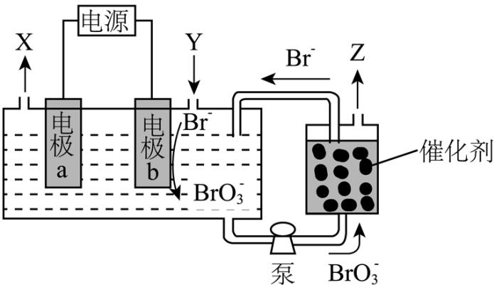

A. 电极 a 连接电源负极
B. 加入 Y 的目的是补充 NaBr
C. 电解总反应式为 $Br^{-} + 3H_{2}O \xlongequal{电解} BrO_{3}^{-} + 3H_{2} \uparrow$ D. 催化阶段反应产物物质的量之比 $n(Z): n(Br^{-}) = 3:2$

【分析】电极 b 上 Br⁻ 发生失电子的氧化反应转化成 BrO₃⁻，电极 b 为阳极，电极反应为 Br⁻-6e⁻+3H₂O=BrO₃⁻ +6H⁺；则电极 a 为阴极，电极 a 的电极反应为 6H⁺+6e⁻=3H₂↑；电解总反应式为 Br⁻+3H₂O 电解 BrO₃⁻+3H₂↑；催化循环阶段 BrO₃⁻ 被还原成 Br⁻ 循环使用、同时生成 O₂，实现高效制 H₂ 和 O₂，即 Z 为 O₂。

【详解】A．根据分析，电极 a 为阴极，连接电源负极，A 项正确；

B. 根据分析电解过程中消耗 $\mathrm{H}_2\mathrm{O}$ 和 $\mathrm{Br}^-$ ，而催化阶段 $\mathrm{BrO}_3^-$ 被还原成 $\mathrm{Br}^-$ 循环使用，故加入Y的目的是补充 $\mathrm{H}_2\mathrm{O}$ ，维持 $\mathrm{NaBr}$ 溶液为一定浓度，B项错误；

C. 根据分析电解总反应式为 $\mathrm{Br}^{-} + 3\mathrm{H}_{2}\mathrm{O}\xrightarrow{\text{电解}}\mathrm{BrO}_{3}^{-} + 3\mathrm{H}_{2}\uparrow$ ，C项正确；

D. 催化阶段, $\mathrm{Br}$ 元素的化合价由+5价降至-1价, 生成 $1\mathrm{molBr}$ 得到 $6\mathrm{mol}$ 电子, $\mathrm{O}$ 元素的化合价由-2价升至0价, 生成 $1\mathrm{molO}_2$ 失去 $4\mathrm{mol}$ 电子, 根据得失电子守恒, 反应产物物质的量之比 $n(\mathrm{O}_2): n(\mathrm{Br}^-) = 6:4 = 3:2$ , D项正确;

答案选B。

14. 钧瓷是宋代五大名瓷之一，其中红色钩瓷的发色剂为 $\mathrm{Cu}_{2} \mathrm{O}$ 。为探究 $\mathrm{Cu}_{2} \mathrm{O}$ 的性质，取等量少许 $\mathrm{Cu}_{2} \mathrm{O}$ 分别加入甲、乙两支试管，进行如下实验。下列说法正确的是

<table><tr><td></td><td>实验操作及现象</td></tr><tr><td>试管甲</td><td>滴加过量 $0.3mol \cdot L^{-1}HNO_{3}$ 溶液并充分振荡,砖红色沉淀转化为另一颜色沉淀,溶液显浅蓝色;倾掉溶液,滴加浓硝酸,沉淀逐渐消失</td></tr><tr><td>试管乙</td><td>滴加过量 $6mol \cdot L^{-1}$ 氨水并充分振荡,沉淀逐渐溶解,溶液颜色为无色;静置一段时间后,溶液颜色变为深蓝色</td></tr></table>

A. 试管甲中新生成的沉淀为金属 Cu
B. 试管甲中沉淀的变化均体现了 $HNO_{3}$ 的氧化性
C. 试管乙实验可证明 $\mathrm{Cu(I)}$ 与 $NH_{3}$ 形成无色配合物
D. 上述两个实验表明 $Au_{2}O$ 为两性氧化物

【答案】AC

【解析】

【详解】A. $Cu_{2}O$ 中滴加过量 $0.3\,mol/LHNO_{3}$ 溶液并充分振荡，砖红色沉淀转化为另一颜色沉淀，溶液显浅蓝色，说明 $Cu_{2}O$ 转化成 $Cu^{2+}$ ，Cu 元素的化合价由 +1 价升至 +2 价，根据氧化还原反应的特点知，Cu 元素的化合价还有由 +1 价降至 0 价，新生成的沉淀为金属 Cu，A 项正确；

B. $\mathrm{Cu}_{2} \mathrm{O}$ 与 $0.3 \mathrm{~mol} / \mathrm{LHNO}_{3}$ 发生的反应为 $\mathrm{Cu}_{2} \mathrm{O} + 2 \mathrm{HNO}_{3} = \mathrm{Cu} (\mathrm{NO}_{3})_{2} + \mathrm{Cu} + \mathrm{H}_{2} \mathrm{O}$ , 该过程中 $\mathrm{HNO}_{3}$ 表现酸性, 后滴加浓硝酸发生的反应为 $\mathrm{Cu} + 4 \mathrm{HNO}_{3}$ (浓) $= \mathrm{Cu} (\mathrm{NO}_{3})_{2} + 2 \mathrm{NO}_{2} \uparrow + 2 \mathrm{H}_{2} \mathrm{O}$ , 该过程中 $\mathrm{HNO}_{3}$ 变现氧化性和酸性,

B 项错误;

C. $\mathrm{Cu}_{2} \mathrm{O}$ 中滴加过量 $6 \mathrm{~mol} / \mathrm{L}$ 氨水充分振荡, 沉淀逐渐溶解得到无色溶液, 静置一段时间无色溶液变为深蓝色, 说明 $\mathrm{Cu(I)}$ 与 $\mathrm{NH}_{3}$ 形成无色配合物易被空气中的 $\mathrm{O}_{2}$ 氧化成深蓝色 $[\mathrm{Cu(NH_{3})_{4}}]^{2+}$ , C 项正确; D. 既能与酸反应生成盐和水、又能与碱反应生成盐和水的氧化物为两性氧化物, $\mathrm{Cu}_{2} \mathrm{O}$ 溶于 $6 \mathrm{~mol} / \mathrm{L}$ 氨水形成的是配合物, $\mathrm{Cu}_{2} \mathrm{O}$ 不属于两性氧化物、是碱性氧化物, D 项错误; 答案选 AC。

15. 逆水气变换反应: $\mathrm{CO}_{2}(\mathrm{g}) + \mathrm{H}_{2}(\mathrm{g}) \rightleftharpoons \mathrm{CO}(\mathrm{g}) + \mathrm{H}_{2}\mathrm{O}(\mathrm{g}) \quad \Delta \mathrm{H} > 0$ 。一定压力下, 按 $\mathrm{CO}_{2}, \mathrm{H}_{2}$ 物质的量之比 $n(\mathrm{CO}_{2}): n(\mathrm{H}_{2}) = 1:1$ 投料, $T_{1}, T_{2}$ 温度时反应物摩尔分数随时间变化关系如图所示。已知该反应的速率方程为 $v = k c^{0.5}(\mathrm{H}_{2}) c(\mathrm{CO}_{2}), T_{1}, T_{2}$ 温度时反应速率常数 $k$ 分别为 $k_{1}, k_{2}$ 。下列说法错误的是

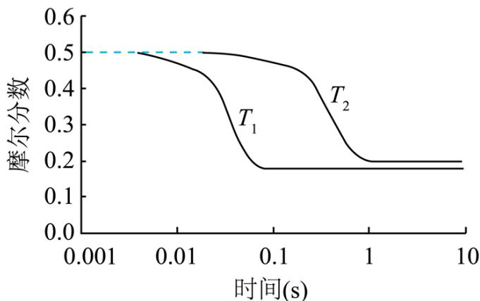

A. $\mathrm{k}_{1} > \mathrm{k}_{2}$ B. $T_{1}, T_{2}$ 温度下达平衡时反应速率的比值: $\frac{v(T_1)}{v(T_2)} < \frac{\mathrm{k}_1}{\mathrm{k}_2}$ C. 温度不变, 仅改变体系初始压力, 反应物摩尔分数随时间的变化曲线不变  
D. $T_{2}$ 温度下, 改变初始投料比例, 可使平衡时各组分摩尔分数与 $T_{1}$ 温度时相同

【答案】CD

【解析】

【分析】由图可知， $T_{1}$ 比 $T_{2}$ 反应速率速率快，则 $T_{1} > T_{2}$ ； $T_{1}$ 温度下达到平衡时反应物的摩尔分数低于 $T_{2}$ 温度下平衡时；由于起始 $\mathrm{CO}_{2}$ 与 $\mathrm{H}_{2}$ 的物质的量之比为 $1:1$ ，则达到平衡时 $\mathrm{CO}_{2}$ 和 $\mathrm{H}_{2}$ 的摩尔分数相等。

【详解】A．根据分析， $T_{1}$ 比 $T_{2}$ 反应速率速率快，反应速率常数与温度有关，结合反应速率方程知 $\mathrm{k}_{1} > \mathrm{k}_{2}$ ，A 项正确；

B．反应的速率方程为 $\nu = \mathrm{kc}^{0.5}(\mathrm{H}_{2})\mathrm{c}(\mathrm{CO}_{2})$ ，则 $\frac{\nu(T_{1})}{\nu(T_{2})} = \frac{\mathrm{k}_{1}\mathrm{c}^{0.5}(\mathrm{H}_{2})_{1}\mathrm{c}(\mathrm{CO}_{2})_{1}}{\mathrm{k}_{2}\mathrm{c}^{0.5}(\mathrm{H}_{2})_{2}\mathrm{c}(\mathrm{CO}_{2})_{2}}$ ， $T_{1}$ 温度下达到平衡时反应物的摩尔分数低于 $T_{2}$ 温度下平衡时，则 $\frac{v(T_{1})}{v(T_{2})}<\frac{k_{1}}{k_{2}}$ ，B 项正确；

C. 温度不变, 仅改变体系初始压力, 虽然平衡不移动, 但反应物的浓度改变, 反应速率改变, 反应达到平衡的时间改变, 反应物摩尔分数随时间的变化曲线变化, C 项错误;

D. $T_{2}$ 温度下，改变初始投料比，相当于改变某一反应物的浓度，达到平衡时 $\mathrm{H}_{2}$ 和 $\mathrm{CO}_{2}$ 的摩尔分数不可能相等，故不能使平衡时各组分摩尔分数与 $T_{1}$ 温度时相同，D项错误；

## 三、非选择题：本题共5小题，共60分。

16. 锰氧化物具有较大应用价值，回答下列问题：

(1) Mn 在元素周期表中位于第\_\_\_\_\_\_周期\_\_\_\_\_\_族; 同周期中, 基态原子未成对电子数比 Mn 多的元素是\_\_\_\_\_\_ (填元素符号)。

(2) Mn 如某种氧化物 $MnO_{x}$ 的四方晶胞及其在 xy 平面的投影如图所示, 该氧化物化学式为 \_\_\_\_。

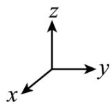

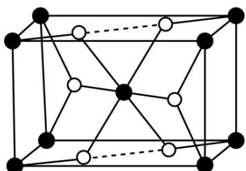

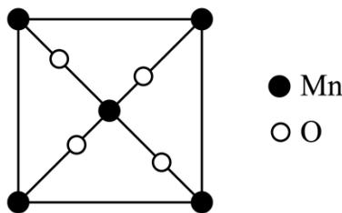

当 $MnO_{x}$ 晶体有 O 原子脱出时，出现 O 空位，Mn 的化合价 \_\_\_\_ (填“升高”“降低”或“不变”)，O 空位的产生使晶体具有半导体性质。下列氧化物晶体难以通过该方式获有半导体性质的是 \_\_\_\_ (填标号)。
A. CaO    B. $V_{2}O_{5}$ C. $Fe_{2}O_{3}$ D. CuO

(3) $\left[\mathrm{BMIM}\right]^{+} \mathrm{BF}_{4}^{-}$ (见图)是 $\mathrm{MnO}_{\mathrm{x}}$ 晶型转变的诱导剂。 $\mathrm{BF}_{4}^{-}$ 的空间构型为\_\_\_\_； $\left[\mathrm{BMIM}\right]^{+}$ 中咪唑环存在 $\pi_{5}^{6}$ 大 $\pi$ 键，则N原子采取的轨道杂化方式为\_\_\_\_。

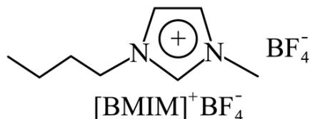

(4) $\mathrm{MnO}_{\mathrm{x}}$ 可作 HMF 转化为 FDCA 的催化剂(见下图)。FDCA 的熔点远大于 HMF，除相对分子质量存在差异外，另一重要原因是\_\_\_\_。

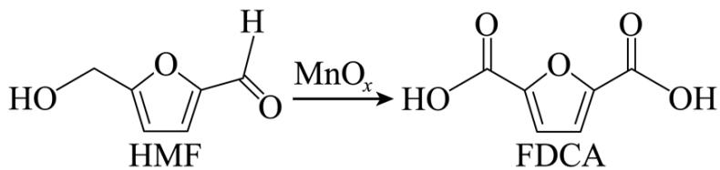

【答案】(1) ①. 四 ②. VIIB ③. Cr
(2) ①. $MnO_{2}$ ②. 降低 ③. A

(3) ①. 正四面体形 ②. $\mathbf{sp}^2$

（4）FDCA形成的分子间氢键更多【解析】 【小问1详解】

Mn的原子序数为25，位于元素周期表第四周期VIIB族；基态Mn的电子排布式为： $\left[\mathrm{Ar}\right]3\mathrm{d}^{5}4\mathrm{s}^{2}$ ，未成对电子数有5个，同周期中，基态原子未成对电子数比Mn多的元素是Cr，基态Cr的电子排布式为 $\left[\mathrm{Ar}\right]3\mathrm{d}^{5}4\mathrm{s}^{1}$ ，有6个未成对电子；

【小问 2 详解】

由均摊法得，晶胞中 Mn 的数目为 $1 + 8 \times \frac{1}{8} = 2$ ，O 的数目为 $2 + 4 \times \frac{1}{2} = 4$ ，即该氧化物的化学式为 $MnO_{2}$ ； $MnO_{x}$ 晶体有 O 原子脱出时，出现 O 空位，即 x 减小，Mn 的化合价为 +2x，即 Mn 的化合价降低；CaO 中 Ca 的化合价为 +2 价、 $V_{2}O_{5}$ 中 V 的化合价为 +5 价、 $Fe_{2}O_{3}$ 中 Fe 的化合价为 +3、CuO 中 Cu 的化合价为 +2，其中 CaO 中 Ca 的化合价下降只能为 0，其余可下降得到比 0 大的价态，说明 CaO 不能通过这种方式获得半导体性质；

【小问3详解】

$\mathrm{BF}_4^-$ 中 B 形成 4 个 $\sigma$ 键（其中有 1 个配位键），为 $\mathrm{sp}^3$ 杂化，空间构型为正四面体形；咪唑环存在 $\pi_5^6$ 大 $\pi$ 键，N 原子形成 3 个 $\sigma$ 键，杂化方式为 $\mathrm{sp}^2$ ；

【小问4详解】

由 HMF 和 FDCA 的结构可知，HMF 和 FDCA 均能形成分子间氢键，但 FDCA 形成的分子间氢键更多，使得 FDCA 的熔点远大于 HMF。

17. 心血管药物缬沙坦中间体(F)的两条合成路线如下:

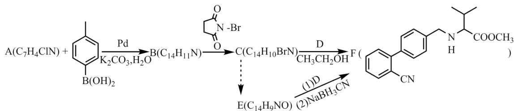

已知：

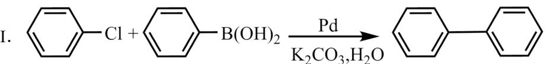

II. $R_{1}$ — CHO $\xrightarrow{(2)\mathrm{NaBH}_{3}\mathrm{CN}}\mathrm{R}_{1}\mathrm{CH}_{2}\mathrm{NHR}_{2}$

回答下列问题:

(1) A 结构简式为\_\_\_\_；B→C 反应类型为\_\_\_\_。

(2) C+D→F 化学方程式为 \_\_\_\_。

(3) E 中含氧官能团名称为\_\_\_\_；F 中手性碳原子有\_\_\_\_个。

(4) D 的一种同分异构体含硝基和 3 种不同化学环境的氢原子(个数此为 $6:6:1$ ), 其结构简式为 \_\_\_\_。

(5) $\mathrm{C} \rightarrow \mathrm{E}$ 的合成路线设计如下:

$\mathrm{C}\underset {\text{试剂X}}{\rightarrow}\mathrm{G}\left(\mathrm{C}_{14}\mathrm{H}_{11}\mathrm{NO}\right)\underset {\text{试剂Y}}{\rightarrow}\mathrm{E}$

试剂 X 为\_\_\_\_(填化学式); 试剂 Y 不能选用 $\mathrm{KMnO}_{4}$ , 原因是\_\_\_\_。

【答案】(1)

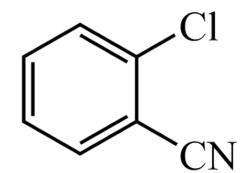

②. 取代反应

(2)

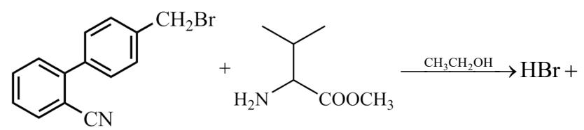

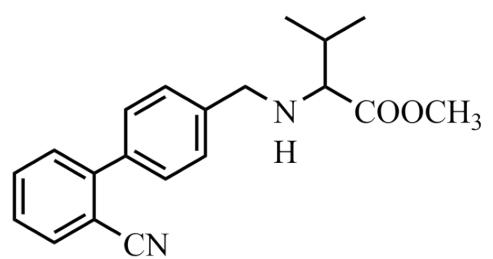

(3) ①. 醛基 ②. 1

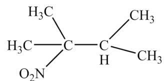

(5) ①. NaOH ②. G 中的- $CH_{2}OH$ 会被 $KMnO_{4}$ 氧化为-

COOH，无法得到E

【解析】

【分析】A→B 发生的类似已知 I. $\ce{C6H5-Cl + C6H5-B(OH)2 ->[Pd][K2CO3,H2O] C6H5-C6H5}$ 的反

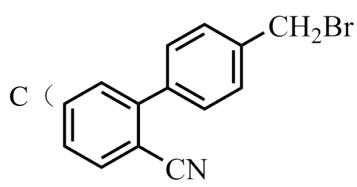

应，结合A、B的分子式和F的结构简式可知，A为： $\ce{C6H5ClCN}$ ，B为 $\ce{C10H10CN}$ ，对比B和

C 的分子式，结合 F 的结构简式可知，B 甲基上的 1 个 H 被 Br 取代得到 C，C 为

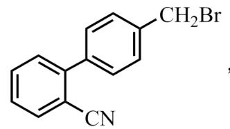

$CH_{2}Br$ ，C、D在乙醇的作用下得到F，对比C、F的结构简式可知，D为

$\mathrm{H}_2\mathrm{N}\xrightarrow{\mathrm{COOCH}_3}$ ，E与D发生类似已知II． $\mathbf{R}_1$ —CHO $\stackrel {(2)\mathrm{NaBH}_3\mathrm{CN}}{\longrightarrow}\mathbf{R}_1\mathbf{CH}_2\mathbf{NHR}_2$ 的反应，可得E为

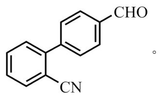

【小问1详解】

由分析得，A 的结构简式为： $\ce{C6H5ClCN}$ ；B（ $\ce{C6H5CN}$ ）甲基上的 1 个 H 被 Br 取代得到

C（CN），反应类型为取代反应；

【小问 2 详解】

由分析得，C为 $\begin{array}{c}\text{CH}_2\text{Br}\\ \text{CN}\end{array}$ ，D为 $\begin{array}{c}\text{H}_2\text{N} \\\text{COOCH}_3\end{array}$ ，C、D在乙醇的作用下得到F

( CN )，化学方程式为： $CH_{2}Br$ $+H_{2}N$ $COOCH_{3}$

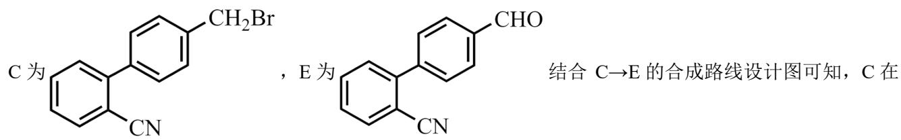

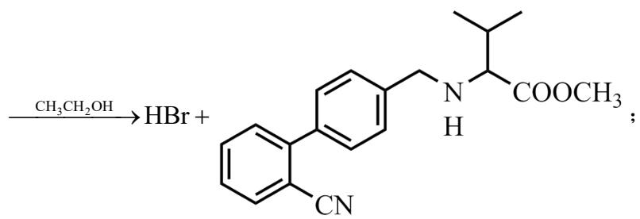

【小问3详解】

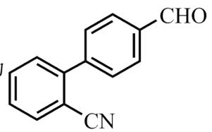

由分析得，E 为 $\mathrm{C}_{10}\mathrm{H}_{12}\mathrm{CN}$ CHO，含氧官能团为：醛基；F 中手性碳原子有 1 个，位置如图：

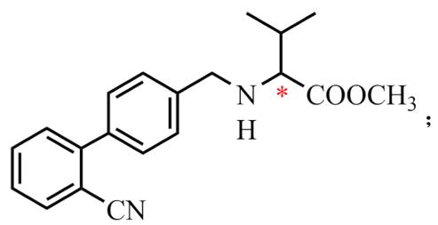

【小问4详解】

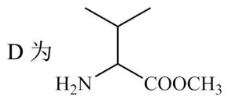

D 为 $\mathrm{H}_2\mathrm{N}$ COOCH₃，含硝基（-NO₂）和 3 种不同化学环境的氢原子(个数此为 6:6:1)的 D 的同分异构

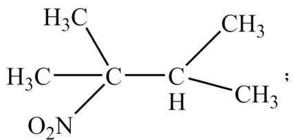

【小问5详解】

结合 $\mathrm{C}\rightarrow \mathrm{E}$ 的合成路线设计图可知，C在

NaOH 水溶液的作用下，Br 被羟基取代，得到 G

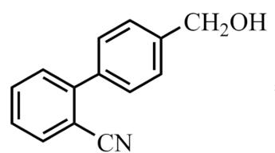

，G与试剂Y（合适的氧化

剂，如： $O_{2}$ ）发生氧化反应得到 E，试剂 X 为 NaOH，试剂 Y 不能选用 $KMnO_{4}$ ，原因是 G 中的 $-CH_{2}OH$ 会被 $KMnO_{4}$ 氧化为 -COOH，无法得到 E。

18. 以铅精矿(含 PbS, Ag $_2$ S 等)为主要原料提取金属 Pb 和 Ag 的工艺流程如下:

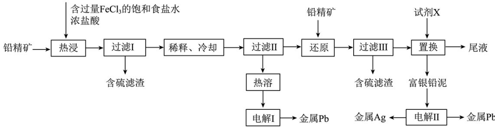  
回答下列问题:

(1) “热浸”时, 难溶的 $\mathrm{PbS}$ 和 $\mathrm{Ag}_{2} \mathrm{~S}$ 转化为 $\left[\mathrm{PbCl}_{4}\right]^{2-}$ 和 $\left[\mathrm{AgCl}_{2}\right]^{-}$ 及单质硫。溶解等物质的量的 $\mathrm{PbS}$ 和 $\mathrm{Ag}_{2} \mathrm{~S}$ 时, 消耗 $\mathrm{Fe}^{3+}$ 物质的量之比为\_\_\_\_; 溶液中盐酸浓度不宜过大, 除防止“热浸”时 $\mathrm{HCl}$ 挥发外, 另一目的是防止产生\_\_\_\_(填化学式)。

(2) 将“过滤II”得到的 $\mathrm{PbCl}_{2}$ 沉淀反复用饱和食盐水热溶, 电解所得溶液可制备金属 $\mathrm{Pb}$ “电解 I”阳极产物用尾液吸收后在工艺中循环使用, 利用该吸收液的操作单元为\_\_\_\_。

（3）“还原”中加入铅精矿的目的是\_\_\_\_。

(4)“置换”中可选用的试剂 X 为\_\_\_\_(填标号)。
A. Al    B. Zn    C. Pb    D. Ag

“置换”反应的离子方程式为\_\_\_\_。

(5) “电解 II”中将富银铅泥制成电极板, 用作\_\_\_\_(填“阴极”或“阳极”)。

【答案】(1) ①. $1: 1$ ②. $\mathrm{H}_{2} \mathrm{~S}$

(2) 热浸 (3) 将过量的 $\mathrm{Fe}^{3+}$ 还原为 $\mathrm{Fe}^{2+}$ (4) ①. C ②. $\mathrm{Pb} + 2[\mathrm{AgCl}_2]^- = 2\mathrm{Ag} + [\mathrm{PbCl}_4]^{2-}$

(5) 阳极

【解析】

【分析】本题以铅精矿(含 PbS，Ag₂S 等)为主要原料提取金属 Pb 和 Ag，“热浸”时，难溶的 PbS 和 Ag₂S 转化为 $\left[PbCl_{4}\right]^{2-}$ 和 $\left[AgCl_{2}\right]^{-}$ 及单质硫，Fe³⁺被还原为 Fe²⁺，过滤 I 除掉单质硫滤渣，滤液中 $\left[PbCl_{4}\right]^{2-}$ 在稀释降温的过程中转化为 PbCl₂ 沉淀，然后用饱和食盐水热溶，增大氯离子浓度，使 PbCl₂ 又转化为 $\left[PbCl_{4}\right]^{2-}$ ，电解得到 Pb；过滤 II 后的滤液成分主要为 $\left[AgCl_{2}\right]^{-}$ 、FeCl₂、FeCl₃，故加入铅精矿主要将 FeCl₃ 还原为 FeCl₂，试剂 X 将 $\left[AgCl_{2}\right]^{-}$ 置换为 Ag，得到富银铅泥，试剂 X 为铅，尾液为 FeCl₂。

【小问 1 详解】

“热浸”时， $\mathrm{Fe}^{3+}$ 将 $\mathrm{PbS}$ 和 $\mathrm{Ag}_2\mathrm{S}$ 中-2价的硫氧化为单质硫， $\mathrm{Fe}^{3+}$ 被还原为 $\mathrm{Fe}^{2+}$ ，在这个过程中 $\mathrm{Pb}$ 和 $\mathrm{Ag}$ 的化合价保持不变，所以等物质的量的 $\mathrm{PbS}$ 和 $\mathrm{Ag}_2\mathrm{S}$ 时， $\mathrm{S}^2$ -物质的量相等，所以消耗 $\mathrm{Fe}^{3+}$ 的物质的量相等，比值为1:1；溶液中盐酸浓度过大，这里主要考虑氢离子浓度会过大，会生成 $\mathrm{H}_2\mathrm{S}$ 气体。

## 【小问 2 详解】

“过滤II”得到的 $PbCl_{2}$ 沉淀反复用饱和食盐水热溶，会溶解为 $\left[PbCl_{4}\right]^{2-}$ ，电解 $\left[PbCl_{4}\right]^{2-}$ 溶液制备金属 Pb，Pb 在阴极产生，阳极 Cl-放电产生 $Cl_{2}$ ，尾液成分为 $FeCl_{2}$ ， $FeCl_{2}$ 吸收 $Cl_{2}$ 后转化为 $FeCl_{3}$ ，可以在热浸中循环使用。

## 【小问 3 详解】

过滤II所得的滤液中有过量的未反应的 $Fe^{3+}$ ，根据还原之后可以得到含硫滤渣，“还原”中加入铅精矿的目的是是将将过量的 $Fe^{3+}$ 还原为 $Fe^{2+}$ 。

## 【小问 4 详解】

“置换”中加入试剂 X 可以可以得到富银铅泥，为了防止引入其他杂质，则试剂 X 应为 Pb，发生的反应为： $Pb+2[AgCl_{2}]^{-}=2Ag+[PbCl4]^{2-}$ 。

## 【小问 5 详解】

“电解 II”中将富银铅泥制成电极板，电解II得到金属银和金属铅，将银和铅分离出来，所以不可能作为阴极，应作为阳极板，阳极放电视，银变成阳极泥而沉降下来，铅失电子为 $Pb^{2+}$ ，阴极得电子得到 Pb，所以电极板应作阳极。

19. 利用“燃烧—碘酸钾滴定法”测定钢铁中硫含量的实验装置如下图所示(夹持装置略)。

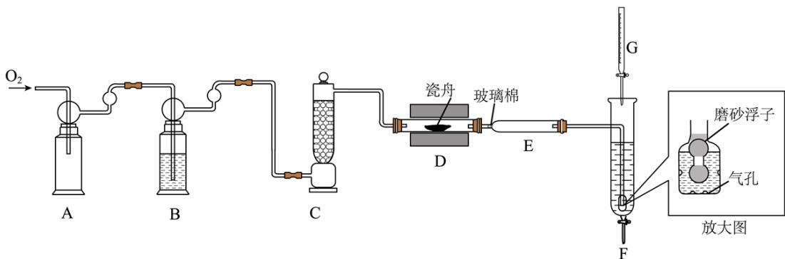

实验过程如下:

①加样，将 a mg 样品加入管式炉内瓷舟中(瓷舟两端带有气孔且有盖)，聚四氟乙烯活塞滴定管 G 内预装 c(KIO $_3$ ):c(KI) 略小于 1:5 的 KIO $_3$ 碱性标准溶液，吸收管 F 内盛有盐酸酸化的淀粉水溶液。向 F 内滴入适量 KIO $_3$ 碱性标准溶液，发生反应：KIO $_3$ + 5KI + 6HCl = 3I $_2$ + 6KCl + 3H $_2$ O，使溶液显浅蓝色。

②燃烧：按一定流速通入 $O_{2}$ ，一段时间后，加热并使样品燃烧。

③滴定: 当 F 内溶液浅蓝色消退时(发生反应: $\mathrm{SO}_{2} + \mathrm{I}_{2} + 2 \mathrm{H}_{2} \mathrm{O} = \mathrm{H}_{2} \mathrm{SO}_{4} + 2 \mathrm{HI}$ ), 立即用 $\mathrm{KIO}_{3}$ 碱性标准溶液滴定至浅蓝色复现。随 $\mathrm{SO}_{2}$ 不断进入 F, 滴定过程中溶液颜色“消退-变蓝”不断变换, 直至终点。

(1) 取 $20.00 \mathrm{~mL} 0.1000 \mathrm{~mol} \cdot \mathrm{L}^{-1} \mathrm{KIO}_{3}$ 的碱性溶液和一定量的 KI 固体, 配制 $1000 \mathrm{~mL} \mathrm{KIO}_{3}$ 碱性标准溶液, 下列仪器必须用到的是\_\_\_\_(填标号)。  
A. 玻璃棒 B. $1000 \mathrm{~mL}$ 锥形瓶 C. $500 \mathrm{~mL}$ 容量瓶 D. 胶头滴管

(2) 装置 B 和 C 的作用是充分干燥 $\mathrm{O}_{2}$ , B 中的试剂为\_\_\_\_。装置 F 中通气管末端多孔玻璃泡内置一密度小于水的磨砂浮子(见放大图), 目的是\_\_\_\_。

(3) 该滴定实验达终点的现象是\_\_\_\_；滴定消耗 $\mathrm{KIO}_{3}$ 碱性标准溶液 $\mathrm{VmL}$ ，样品中硫的质量分数是\_\_\_\_(用代数式表示)。

(4) 若装置 D 中瓷舟未加盖, 会因燃烧时产生粉尘而促进 $\mathrm{SO}_{3}$ 的生成, 粉尘在该过程中的作用是\_\_\_\_; 若装置 E 冷却气体不充分, 可能导致测定结果偏大, 原因是\_\_\_\_; 若滴定过程中, 有少量 $\mathrm{IO}_{3}^{-}$ 不经 $\mathrm{I}_{2}$ 直接将 $\mathrm{SO}_{2}$ 氧化成 $\mathrm{H}_{2} \mathrm{SO}_{4}$ , 测定结果会\_\_\_\_(填“偏大”“偏小”或“不变”)。

【答案】(1) AD (2) ①. 浓硫酸 ②. 防止倒吸

(3) ①. 当加入最后半滴 $\mathrm{KIO}_{3}$ 碱性标准溶液后, 溶液由无色突变为蓝色且 $30 \mathrm{~s}$ 内不变色 ②. $\frac{19.200 \mathrm{~V}}{\mathrm{a}} \%$ (4) ①. 催化剂 ②. 通入 $\mathrm{F}$ 的气体温度过高, 导致部分 $\mathrm{I}_{2}$ 升华, 从而消耗更多的 $\mathrm{KIO}_{3}$ 碱性标准溶液 ③. 不变

【解析】

【分析】由题中信息可知，利用“燃烧—碘酸钾滴定法”测定钢铁中硫含量的实验中，将氧气经干燥、净化后通入管式炉中将钢铁中硫氧化为 $SO_{2}$ ，然后将生成的 $SO_{2}$ 导入碘液中吸收，通过消耗 $KIO_{3}$ 碱性标准溶液的体积来测定钢铁中硫的含量。

【小问 1 详解】

取 $20.00 \, mL 0.1000 \, mol \cdot L^{-1} \, KIO_{3}$ 的碱性溶液和一定量的 KI 固体，配制 $1000 \, mL \, KIO_{3}$ 碱性标准溶液（稀释了 50 倍后 $KIO_{3}$ 的浓度为 $0.0020000 \, mol \cdot L^{-1}$ ），需要用碱式滴定管或移液管量取

20.00mL 0.1000mol·L $^{-1}$ KIO $_{3}$ 的碱性溶液，需要用一定精确度的天平称量一定质量的KI固体，需要在烧杯中溶解KI固体，溶解时要用到玻璃棒搅拌，需要用1000mL容量瓶配制标准溶液，需要用胶头滴管定容，因此，下列仪器必须用到的是AD。

【小问 2 详解】

装置 B 和 C 的作用是充分干燥 $O_{2}$ ，浓硫酸具有吸水性，常用于干燥某些气体，因此 B 中的试剂为浓硫酸。装置 F 中通气管末端多孔玻璃泡内置一密度小于水的磨砂浮子，其目的是防止倒吸，因为磨砂浮子的密度小于水，若球泡内水面上升，磨砂浮子也随之上升，磨砂浮子可以作为一个磨砂玻璃塞将导气管的出气口堵塞上，从而防止倒吸。

【小问 3 详解】

该滴定实验是利用过量的 1 滴或半滴标准溶液来指示滴定终点的，因此，该滴定实验达终点的现象是当加入最后半滴 $\mathrm{KIO}_3$ 碱性标准溶液后，溶液由无色突变为蓝色且 $30\mathrm{s}$ 内不变色；由 S 元素守恒及

$$
\mathrm{SO} _ {2} + \mathrm{I} _ {2} + 2 \mathrm{H} _ {2} \mathrm{O} = \mathrm{H} _ {2} \mathrm{SO} _ {4} + 2 \mathrm{HI}, \quad \mathrm{KIO} _ {3} + 5 \mathrm{KI} + 6 \mathrm{HCl} = 3 \mathrm{I} _ {2} + 6 \mathrm{KCl} + 3 \mathrm{H} _ {2} \mathrm{O} \text {可得关系式} 3 \mathrm{S} \sim 3 \mathrm{SO} _ {2} \sim 3 \mathrm{I} _ {2}
$$

$\sim \mathrm{KIO}_3$ ，若滴定消耗 $\mathrm{KIO}_3$ 碱性标准溶液 $\mathrm{VmL}$ ，则

$$
\mathrm{n} \left(\mathrm{KIO} _ {3}\right) = \mathrm{V} \times 1 0 ^ {- 3} \mathrm{L} \times 0. 0 0 2 0 0 0 0 \mathrm{mol} \cdot \mathrm{L} ^ {- 1} = 2. 0 0 0 0 \times 1 0 ^ {- 6} \mathrm{Vmol},
$$

$n(\mathrm{S}) = 3\mathrm{n}(\mathrm{KIO}_3) = 3\times 2.0000\times 10^{-6}\mathrm{Vmol} = 6.0000\times 10^{-6}\mathrm{Vmol}$ ，样品中硫的质量分数是

$$
\frac {6 . 0 0 0 0 \times 1 0 ^ {- 6} \mathrm{Vmol} \times 32 \mathrm{g} \cdot \mathrm{mol} ^ {- 1}}{\mathrm{a} \times 1 0 ^ {- 3} \mathrm{g}} \times 100 \% = \frac {19.200 \mathrm{V}}{\mathrm{a}} \% 。
$$

【小问 4 详解】

若装置 D 中瓷舟未加盖，燃烧时产生粉尘中含有铁的氧化物，铁的氧化物能催化 $SO_{2}$ 的氧化反应从而促进 $SO_{3}$ 的生成，因此，粉尘在该过程中的作用是催化剂；若装置 E 冷却气体不充分，则通入 F 的气体温度过高，可能导致部分 $I_{2}$ 升华，这样就要消耗更多 $KIO_{3}$ 碱性标准溶液，从而可能导致测定结果偏大；若滴定过程中，有少量 $IO_{3}^{-}$ 不经 $I_{2}$ 直接将 $SO_{2}$ 氧化成 $H_{2}SO_{4}$ ，从电子转移守恒的角度分析， $IO_{3}^{-}$ 得到 $6e^{-}$ 被还原为 $I^{-}$ ，仍能得到关系式 $3S\sim3SO_{2}\sim KIO_{3}$ ，测定结果会不变。

20. 水煤气是 $H_{2}$ 的主要来源，研究 CaO 对 $C-H_{2}O$ 体系制 $H_{2}$ 的影响，涉及主要反应如下：

$$
\mathrm{C} (\mathrm{s}) + \mathrm{H} _ {2} \mathrm{O} (\mathrm{g}) = \mathrm{CO} (\mathrm{g}) + \mathrm{H} _ {2} (\mathrm{g}) (\mathrm{I}) \Delta \mathrm{H} _ {1} > 0
$$

$$
\mathrm{CO} (\mathrm{g}) + \mathrm{H} _ {2} \mathrm{O} (\mathrm{g}) = \mathrm{CO} _ {2} (\mathrm{g}) + \mathrm{H} _ {2} (\mathrm{g}) (\text {II}) \Delta \mathrm{H} _ {2} <   0
$$

$$
\mathrm{CaO} (\mathrm{s}) + \mathrm{CO} _ {2} (\mathrm{g}) = \mathrm{CaCO} _ {3} (\mathrm{s}) (\text {III}) \Delta \mathrm{H} _ {3} <   0
$$

回答列问题:

(1) $\mathrm{C(s) + CaO(s) + 2H_2O(g)}\rightleftharpoons \mathrm{CaCO}_3(\mathrm{s}) + 2\mathrm{H}_2(\mathrm{g})$ 的焓变 $\Delta \mathrm{H} =$ (用代数式表示)。

(2) 压力 $p$ 下, $\mathrm{C - H_{2}O - CaO}$ 体系达平衡后, 图示温度范围内 $\mathrm{C(s)}$ 已完全反应, $\mathrm{CaCO_3(s)}$ 在 $\mathrm{T}_{1}$ 温度时完全分解。气相中 $\mathrm{CO}$ , $\mathrm{CO_2}$ 和 $\mathrm{H}_{2}$ 摩尔分数随温度的变化关系如图所示, 则 a 线对应物种为\_\_\_\_(填化学式)。当温度高于 $\mathrm{T}_{1}$ 时, 随温度升高 c 线对应物种摩尔分数逐渐降低的原因是\_\_\_\_。

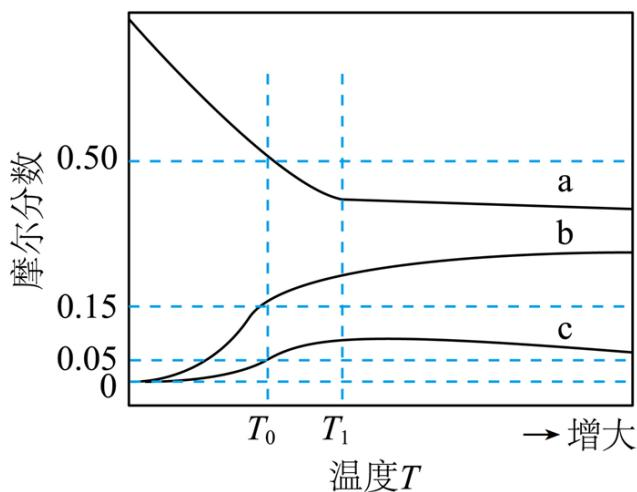

(3) 压力 $p$ 下、温度为 $T_0$ 时, 图示三种气体的摩尔分数分别为 0.50, 0.15, 0.05, 则反应 $CO(g)+H_2O(g)\rightleftharpoons CO_2(g)+H_2(g)$ 的平衡常数 $K_p=$ \_\_\_\_; 此时气体总物质的量为 4.0mol, 则 $CaCO_3(s)$ 的物质的量为 \_\_\_\_ mol; 若向平衡体系中通入少量 $CO_2(g)$ , 重新达平衡后, 分压 $p(CO_2)$ 将\_\_\_\_(填“增大”“减小”或“不变”), $p(CO)$ 将\_\_\_\_(填“增大”“减小”或“不变”)。

【答案】(1) $\Delta H_{1} + \Delta H_{2} + \Delta H_{3}$

(2) ①. $\mathrm{H}_{2}$ ②. 当温度高于 $\mathrm{T}_{1}$ , $\mathrm{CaCO}_{3}(\mathrm{s})$ 已完全分解, 只发生反应 II, 温度升高, 反应 II 逆向移动, 所以 $\mathrm{CO}_{2}$ 的摩尔分数减小。 (3) ①. $\frac{5}{9}$ ②. 0.5 ③. 不变 ④. 增大

【解析】
【小问1详解】
已知三个反应：
I. $C(s)+H_{2}O(g)=CO(g)+H_{2}(g)$

$$
\mathrm{CO} (\mathrm{g}) + \mathrm{H} _ {2} \mathrm{O} (\mathrm{g}) = \mathrm{CO} _ {2} (\mathrm{g}) + \mathrm{H} _ {2} (\mathrm{g})
$$

III. CaO (s) + CO₂(g) = CaCO₃(s)

设目标反应 $\mathrm{C(s)+CaO(s)+2H_{2}O(g)\rightleftharpoons CaCO_{3}(s)+2H_{2}(g)}$ 为 IV，根据盖斯定律，IV=II+II+III，所以 $\Delta H = \Delta H_{1} + \Delta H_{2} + \Delta H_{3}$

## 【小问 2 详解】

图示温度范围内 C(s) 已完全反应，则反应Ⅰ已经进行完全，反应Ⅱ和Ⅲ均为放热反应，从开始到 T₁，温度不断升高，反应Ⅱ和Ⅲ逆向移动，依据反应Ⅱ，H₂量减小，摩尔分数减小，CO量升高，摩尔分数，且二者摩尔分数变化斜率相同，所以 a 曲线代表 H₂ 的摩尔分数的变化，则 c 曲线代表 CO₂ 的摩尔分数随温度的变化，开始到 T₁，CO₂ 的摩尔分数升高，说明在这段温度范围内，反应Ⅲ占主导，当温度高于 T₁，CaCO₃(s) 已完全分解，只发生反应Ⅱ，所以 CO₂ 的摩尔分数减小。

【小问 3 详解】

①压力 p 下、温度为 $T_{0}$ 时， $H_{2}$ 、CO、 $CO_{2}$ 和摩尔分数分别为 0.50、0.15、0.05，则 $\mathrm{H}_{2}\mathrm{O}(\mathrm{g})$ 的摩尔分数为：1-0.5-0.15-0.05=0.3，则反应 $\mathrm{CO}(\mathrm{g})+\mathrm{H}_{2}\mathrm{O}(\mathrm{g})\rightleftharpoons\mathrm{CO}_{2}(\mathrm{g})+\mathrm{H}_{2}(\mathrm{g})$ 的平衡常数 $K_{p}=$ $\frac{\mathrm{p}(\mathrm{CO}_{2})\times\mathrm{p}(\mathrm{H}_{2})}{\mathrm{p}(\mathrm{CO})\times\mathrm{p}(\mathrm{H}_{2}\mathrm{O})}=\frac{0.05\mathrm{p}\times0.5\mathrm{p}}{0.15\mathrm{p}\times0.3\mathrm{p}}=\frac{5}{9};$

②设起始状态 $1\mathrm{molC(s)}$ ， $x\mathrm{molH_{2}O(g)}$ ，反应Ⅰ进行完全。

$$
\begin{array}{r l r l r l} & \mathrm {C(s) + H_ {2} O = CO+ H_ {2}} \\ \text {起} & 1 & \mathrm{x} & 0 & 0 \\ \text {转} & 1 & 1 & 1 & 1 \\ \text {平} & 0 & \mathrm{x-1} & 1 & 1 \\ & \mathrm {CO + H_ {2} O = CO_ {2} + H_ {2}} \\ \text {转} & \mathrm{a} & \mathrm{a} & \mathrm{a} & \mathrm{a} \\ & \mathrm {CaO(s) + CO_ {2} = CaCO_ {3} (s)} \\ \text {转} & & \mathrm{b} & & \mathrm{b} \end{array}
$$

根据平衡时 $H_{2}$ 、CO、 $CO_{2}$ 和摩尔分数分别为 0.50、0.15、0.05，则有 $\frac{1+a}{x+1-b}=0.5$ 、 $\frac{1-a}{x+1-b}=0.15$ 、 $\frac{a-b}{x+1-b}=0.05$ ，解出 $x=\frac{32}{13}$ ， $a=\frac{7}{13}$ ， $b=\frac{5}{13}$ 则 n(总) = $x+1-b=\frac{32}{13}+1-\frac{5}{13}=\frac{40}{13}$ ，而由于平衡时 n(总)=4mol，则 $\frac{40}{13}y=4$ ， $y=\frac{13}{10}$ ，则 $n(\mathrm{CaCO}_{3})=\mathrm{b}\cdot\mathrm{y}=\frac{5}{13}\times\frac{13}{10}=0.5$ 。

③若向平衡体系中通入少量 $\mathrm{CO}_{2}(\mathrm{g})$ ，重新达平衡后，反应 $\mathrm{CaO}(\mathrm{s}) + \mathrm{CO}_{2}(\mathrm{g}) = \mathrm{CaCO}_{3}(\mathrm{s})$ 的 $K_{p} = \frac{1}{\mathrm{p}(\mathrm{CO}_{2})}$ ，温度不变，Kp 不变，则分压 $\mathrm{p}(\mathrm{CO}_{2})$ 不变，但体系中增加了 $\mathrm{CO}_{2}(\mathrm{g})$ ，反应Ⅱ逆向移动，所以 $\mathrm{p}(\mathrm{CO})$ 增大。