# 2024年普通高中学业水平选择性考试(广东卷)

# 化学

本卷满分 100 分，考试用时 75 分钟。

可能用到的相对原子质量：H1 C 12 O 16 Na 23 S 32 Cl 35.5 Ca 40 Fe 56

## 一、选择题：本大题共16小题，共44分。第1-题，每小题2分；第11-16小题，每小题4分。在每小题列出的四个选项中，只有一项符合题目要求。

1. 龙是中华民族重要的精神象征和文化符号。下列与龙有关的历史文物中，主要材质为有机高分子的是

<table><tr><td></td><td></td><td></td><td></td></tr><tr><td>红山玉龙</td><td>婆金铁芯铜龙</td><td>云龙纹丝绸</td><td>云龙纹瓷瓶</td></tr></table>

A.A B.B C.C D.D

【答案】C 【解析】

【详解】A．红山玉龙主要成分为 $SiO_{2}$ 和硅酸盐，属于无机非金属材料，A 不符合题意；
B．婆金铁芯铜龙主要成分为 Cu，属于金属材料，B 不符合题意；
C．云龙纹丝绸主要成分为蛋白质，属于有机高分子材料，C 符合题意；
D．云龙纹瓷瓶主要成分为硅酸盐，属于传统无机非金属材料，D 不符合题意；

$$
\mathrm{C} _ {\circ}
$$

2. “极地破冰”“太空养鱼”等彰显了我国科技发展的巨大成就。下列说法正确的是
A. “雪龙 2” 号破冰船极地科考：破冰过程中水发生了化学变化
B. 大型液化天然气运输船成功建造：天然气液化过程中形成了新的化学键
C. 嫦娥六号的运载火箭助推器采用液氧煤油发动机：燃烧时存在化学能转化为热能
D. 神舟十八号乘组带着水和斑马鱼进入空间站进行科学实验：水的电子式为 H:O:H 【答案】C

【解析】

【详解】A. 破冰过程无新物质生成，是物理变化，A 错误；  
B. 天然气液化的过程是气态变为液态，是物理变化，无新的化学键形成，B 错误；  
C. 燃烧放热，是化学能转化为热能，C 正确；  
D. 水是共价化合物，每个 H 原子都与 O 原子共用一对电子，电子式为 $\mathbf{H}:\ddot{\mathbf{O}}:\mathbf{H}$ ，D 错误；  
本题选 C。

3. 嘀嗒嘀嗒，时间都去哪儿了！计时器的发展史铭刻着化学的贡献。下列说法不正确的是
A. 制作日晷圆盘的石材，属于无机非金属材料
B. 机械表中由钼钴镍铬等元素组成的发条，其材质属于合金
C. 基于石英晶体振荡特性计时的石英表，其中石英的成分为 SiC
D. 目前 “北京时间” 授时以铯原子钟为基准， $^{135}_{55}$ Cs 的质子数为 55

【详解】A. 制作日晷圆盘的石材主要为大理石，属于无机非金属材料，A 正确；  
B. 由两种或两种以上的金属与金属或非金属经一定方法所合成的具有金属特性的混合物称为合金，机械表中由钼钴镍铬等元素组成的发条，其材质属于合金，B 正确；  
C. 基于石英晶体振荡特性计时的石英表，其中石英的成分为 $\mathrm{SiO}_2$ ，C 错误；  
D. 目前“北京时间”授时以铯原子钟为基准， ${}_{55}^{135}\mathrm{Cs}$ 的质量数为 135，质子数为 55，D 正确；故选 C。

4. 我国饮食注重营养均衡，讲究“色香味形”。下列说法不正确的是
A. 烹饪糖醋排骨用蔗糖炒出焦糖色，蔗糖属于二糖
B. 新鲜榨得的花生油具有独特油香，油脂属于芳香烃
C. 凉拌黄瓜加醋使其具有可口酸味，食醋中含有极性分子
D. 端午时节用棕叶将糯米包裹成形，糯米中的淀粉可水解

【答案】B

【解析】

【详解】A. 蔗糖属于二糖，1mol蔗糖水解可得到1mol葡萄糖和1mol果糖，故A正确；  
B. 油脂主要是高级脂肪酸和甘油形成的酯，不属于芳香烃，故B错误；  
C. 食醋中含有 $\mathrm{CH}_3\mathrm{COOH}$ 、 $\mathrm{H}_2\mathrm{O}$ 等多种物质， $\mathrm{CH}_3\mathrm{COOH}$ 、 $\mathrm{H}_2\mathrm{O}$ 均为极性分子，故C正确；  
D. 糯米中的淀粉可水解，淀粉水解的最终产物为葡萄糖，故D正确；

故选 B。

5. 我国自主设计建造的浮式生产储御油装置“海葵一号”将在珠江口盆地海域使用，其钢铁外壳镶嵌了锌块，以利用电化学原理延缓外壳的腐蚀。下列有关说法正确的是
A. 钢铁外壳为负极
B. 镶嵌的锌块可永久使用
C. 该法为外加电流法
D. 锌发生反应： $Zn-2e^{-}=Zn^{2+}$

【答案】D

【解析】

【分析】钢铁外壳镶嵌了锌块，由于金属活动性 $\mathrm{Zn} > \mathrm{Fe}$ ，即锌块为负极，钢铁为正极，形成原电池， $\mathrm{Zn}$ 失去电子，发生还原反应， $\mathrm{Zn} - 2\mathrm{e}^{-} = \mathrm{Zn}^{2+}$ ，从而保护钢铁，延缓其腐蚀。

【详解】A．由于金属活动性 $\mathrm{Zn} > \mathrm{Fe}$ ，钢铁外壳为正极，锌块为负极，故 A 错误；

B．Zn 失去电子，发生还原反应， $\mathrm{Zn} - 2\mathrm{e}^{-} = \mathrm{Zn}^{2+}$ ，镶嵌的锌块会被逐渐消耗，需根据腐蚀情况进行维护和更换，不能永久使用，故 B 错误；

C．由分析得，该方法为牺牲阳极的阴极保护法，故 C 错误；

D．Zn 失去电子，发生还原反应： $\mathrm{Zn} - 2\mathrm{e}^{-} = \mathrm{Zn}^{2+}$ ，故 D 正确；

故选 D。

6. 提纯 2.0g 苯甲酸粗品(含少量 NaCl 和泥沙)的过程如下。其中，操作 X 为

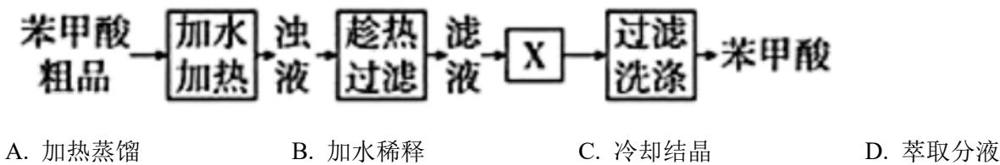

【答案】C

【解析】

【详解】苯甲酸粗品(含少量 NaCl 和泥沙)加水加热进行溶解，得到浊液，趁热过滤，除去泥沙，滤液中含有少量 NaCl，由于苯甲酸的溶解度受温度影响大，而 NaCl 的溶解度受温度影响小，可通过冷却结晶的方式进行除杂，得到苯甲酸晶体，过滤后对晶体进行洗涤，得到苯甲酸，因此，操作 X 为冷却结晶，故 C 正确，

故选 C。

7. “光荣属于劳动者，幸福属于劳动者。”下列劳动项目与所述化学知识没有关联的是

<table><tr><td>选项</td><td>劳动项目</td><td>化学知识</td></tr><tr><td>A</td><td>水质检验员:用滴定法测水中Cl-含量</td><td>Ag+ + Cl- = AgCl ↓</td></tr><tr><td>B</td><td>化学实验员:检验Na2O2是否失效</td><td>2Na2O2+2H2O=4NaOH+O2↑</td></tr><tr><td>C</td><td>化工工程师:进行顺丁橡胶硫化</td><td>碳碳双键可打开与硫形成二硫键</td></tr><tr><td>D</td><td>考古研究员:通过14C测定化石年代</td><td>C60与石墨烯互为同素异形体</td></tr></table>

A.A B.B C.C D.D

【答案】D

【解析】

【详解】A. 用滴定法测水中 Cl⁻含量利用了 Ag⁺和 Cl⁻生成 AgCl 沉淀，通过测 AgCl 沉淀的量从而测定水中 Cl⁻的含量，劳动项目与所述化学知识有关联，A 不符合题意；
B. 利用过氧化钠和水生成氢氧化钠和氧气的反应可以检验 Na₂O₂ 是否失效，劳动项目与所述化学知识有关联，B 不符合题意；
C. 顺丁橡胶硫化就是聚异戊二烯中的碳碳双键打开与硫形成二硫键，劳动项目与所述化学知识有关联，C 不符合题意；
D. 通过 $^{14}$ C 测定化石年代是利用同位素的放射性，通过半衰期计算化石年代，与同素异形体无关，劳动项目与所述化学知识没有关联，D 符合题意；
本题选 D。

8. 1810 年，化学家戴维首次确认 “氯气” 是一种新元素组成的单质。兴趣小组利用以下装置进行实验。其中，难以达到预期目的的是

<table><tr><td>A</td><td>B</td></tr><tr><td></td><td>无水 $CaCl_{2}$ </td></tr><tr><td>制备 $Cl_{2}$ </td><td>净化、干燥 $Cl_{2}$ </td></tr><tr><td>C</td><td>D</td></tr><tr><td></td><td></td></tr><tr><td>收集 $Cl_{2}$ </td><td>验证 $Cl_{2}$ 的氧化性</td></tr></table>

A.A B.B C.C D.D

【答案】A 【解析】

【详解】A．利用浓盐酸和二氧化锰反应制氯气需要加热，图中缺少加热装置，且分液漏斗内应盛装浓盐酸，不能达到预期目的，A 符合题意；  
B．实验室制得的氯气中有 HCl 杂质，可以通过饱和食盐水洗气除杂，再通过无水氯化钙干燥，可以达到净化、干燥 $\mathrm{Cl}_2$ 的目的，B 不符合题意；  
C．氯气密度大于空气，可以用向上排空气法收集，可以达到预期目的，C 不符合题意；  
D． $\mathrm{H}_2$ 可以在氯气中安静地燃烧，产生苍白色火焰，氯气将氢气氧化，验证了氯气的氧化性，D 不符合题意；  
故选 A。

9. 从我国南海的柳珊瑚中分离得到的柳珊瑚酸(下图)，具有独特的环系结构。下列关于柳珊瑚酸的说法不正确的是

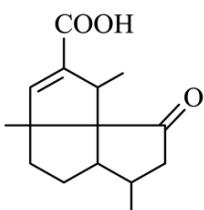

A. 能使溴的四氯化碳溶液褪色 B. 能与氨基酸的氨基发生反应 C. 其环系结构中 3 个五元环共平面 D. 其中碳原子的杂化方式有 $\mathbf{sp}^{2}$ 和 $\mathbf{sp}^{3}$

【答案】C 【解析】

【详解】A．该物质含有碳碳双键，能使溴的四氯化碳溶液褪色，故 A 正确；
B．该物质含有羧基，能与氨基酸的氨基发生反应，故 B 正确；

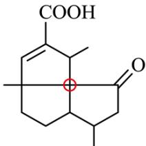

C. 如图: $\mathrm{COOH}$ 中所示 C 为 $\mathrm{sp}^{3}$ 杂化, 具有类似甲烷的四面体结构, 即环系结构中 3 个五

元环不可能共平面，故C错误；  
D．该物质饱和的碳原子为 $\mathrm{sp}^3$ 杂化，形成双键的碳原子为 $\mathrm{sp}^2$ 杂化，故D正确；故选C。

10. 设 $N_{A}$ 为阿伏加德罗常数的值。下列说法正确的是
A. $26\ g\ H-C\equiv C-H$ 中含有 $\sigma$ 键的数目为 $3N_{A}$ B. $1L1mol\cdot L^{-1}NH_{4}NO_{3}$ 溶液中含 $NH_{4}^{+}$ 的数目为 $N_{A}$ C. 1 mol CO 和 $H_{2}$ 的混合气体含有的分子数目为 $3N_{A}$ D. Na 与 $H_{2}O$ 反应生成 $11.2\ L\ H_{2}$ ，转移电子数目为 $N_{A}$

【答案】A

【解析】

【详解】A. $26 \mathrm{~g} \mathrm{C}_{2} \mathrm{H}_{2}$ 的物质的量为 $1 \mathrm{~mol}$ , 一个 $\mathrm{C}_{2} \mathrm{H}_{2}$ 分子中含有 3 个 $\sigma$ 键, 故 $26 \mathrm{~g} \mathrm{C}_{2} \mathrm{H}_{2}$ 中含有 $\sigma$ 键的数目为 $3 \mathrm{~N}_{\mathrm{A}}$ , A 正确;  
B. $NH_{4}^{+}$ 在水溶液中发生水解, $1 \mathrm{~L} 1 \mathrm{~mol} \cdot \mathrm{L}^{-1} \mathrm{NH}_{4} \mathrm{NO}_{3}$ 溶液中含 $NH_{4}^{+}$ 的数目小于 $\mathrm{N}_{\mathrm{A}}$ , B 错误;  
C. CO 和 $\mathrm{H}_{2}$ 均由分子构成, $1 \mathrm{~mol} \mathrm{CO}$ 和 $\mathrm{H}_{2}$ 的混合气体含有的分子数目为 $\mathrm{N}_{\mathrm{A}}$ , C 错误;  
D. Na 与 $\mathrm{H}_{2} \mathrm{O}$ 反应生成 $11.2 \mathrm{L} \mathrm{H}_{2}$ , 由于未给出气体所处的状态, 无法求出生成气体的物质的量, 也无法得出转移电子数目, D 错误;

故选A。

11. 按下图装置进行实验。搅拌一段时间后，滴加浓盐酸。不同反应阶段的预期现象及其相应推理均合理的是

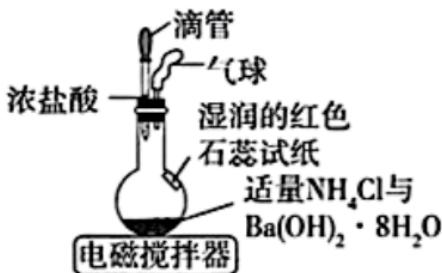

A. 烧瓶壁会变冷，说明存在 $\Delta H < 0$ 的反应

B. 试纸会变蓝, 说明有 $\mathrm{NH}_{3}$ 生成, 产氨过程熵增 C. 滴加浓盐酸后, 有白烟产生, 说明有 $\mathrm{NH}_{4} \mathrm{Cl}$ 升华 D. 实验过程中, 气球会一直变大, 说明体系压强增大

【答案】B

【解析】

【详解】A. $NH_{4}Cl$ 和 $\mathrm{Ba(OH)_{2}\cdot8H_{2}O}$ 的反应是吸热反应，所以烧瓶壁变冷，吸热反应 $\Delta H>0$ ，故 A 错误；
B．试纸会变蓝，说明有 $NH_{3}$ 生成，反应物都是固体，生成物中有气体，故产氨过程熵增，B 正确；
C．滴加浓盐酸后，有白烟产生，说明体系中有氨气，是 $NH_{4}Cl$ 和 $\mathrm{Ba(OH)_{2}\cdot8H_{2}O}$ 反应产生的，不是 $NH_{4}Cl$ 的升华，C 错误；
D．实验过程中，气球会一直变大，是因为反应产生了气体，但是膨胀以后压强就和外界压强一样了，D 错误；
故选 B。

12. 一种可为运动员补充能量的物质，其分子结构式如图。已知 R、W、Z、X、Y 为原子序数依次增大的短周期主族元素，Z 和 Y 同族，则

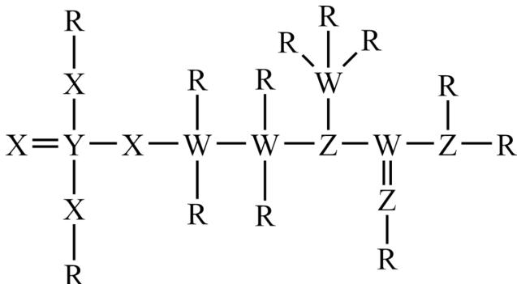

A. 沸点: $\mathrm{ZR}_{3}<\mathrm{YR}_{3}$ B. 最高价氧化物的水化物的酸性: Z < W
C. 第一电离能: Z < X < W
D. $ZX_{3}^{-}$ 和 $WX_{3}^{2-}$ 空间结构均为平面三角形

【答案】D

【解析】

【分析】Y 可形成 5 个共价键，Z 可形成 3 个共价键，Z 和 Y 同族，Y 原子序数比 Z 大，即 Z 为 N 元素，Y 为 P 元素，W 可形成 4 个共价键，原子序数比 N 小，即 W 为 C 元素，R 可形成 1 个共价键，原子序数比 C 小，即 R 为 H 元素，X 可形成 2 个共价键，原子序数在 N 和 P 之间，即 X 为 O 元素，综上：R 为 H 元素、W 为 C 元素、Z 为 N 元素、X 为 O 元素、Y 为 P 元素。

【详解】A．由于 $NH_{3}$ 可形成分子间氢键，而 $PH_{3}$ 不能，因此沸点： $NH_{3}>YH_{3}$ ，故 A 错误；

B. W 为 C 元素、Z 为 N 元素，由于非金属性：C < N，因此最高价氧化物的水化物的酸性： $H_{2}CO_{3} < HNO_{3}$ ，故 B 错误；
C．同周期元素从左到右第一电离能有增大趋势，IIA族、VA族原子第一电离能大于同周期相邻元素，即第一电离能：C < O < N，故 C 错误；
D. $NO_{3}^{-}$ 的中心原子价层电子对数为 $3 + \frac{5 + 1 - 2 \times 3}{2} = 3$ ，属于 $sp^{2}$ 杂化，为平面三角形， $CO_{3}^{2-}$ 的中心原子价层电子对数为 $3 + \frac{4 + 2 - 2 \times 3}{2} = 3$ ，属于 $sp^{2}$ 杂化，为平面三角形，故 D 正确；故选 D。

13. 下列陈述 I 与陈述 II 均正确，且具有因果关系的是

<table><tr><td>选项</td><td>陈述I</td><td>陈述II</td></tr><tr><td>A</td><td>酸性: $CF_3COOH < CCl_3COOH$ </td><td>电负性:F&gt;Cl</td></tr><tr><td>B</td><td>某冠醚与 $Li^+$ 能形成超分子,与 $K^+$ 则不能</td><td> $Li^+$ 与 $K^+$ 的离子半径不同</td></tr><tr><td>C</td><td>由氨制硝酸: $NH_3 \rightarrow NO \rightarrow NO_2 \rightarrow HNO_3$ </td><td> $NH_3$ 和 $NO_2$ 均具有氧化性</td></tr><tr><td>D</td><td>苯酚与甲醛反应,可合成酚醛树脂</td><td>合成酚醛树脂的反应是加聚反应</td></tr></table>

A.A B.B C.C D.D

【答案】B

【解析】

【详解】A．电负性 F>Cl，F 的吸电子能力大于 Cl，导致 $CF_{3}COOH$ 中 O-H 键的极性大于 $CCl_{3}COOH$ 中 O-H 键的极性，故酸性： $CF_{3}COOH>CCl_{3}COOH$ ，故陈述 I 不正确，A 不符合题意；

B. 冠醚最大的特点就是能与正离子，尤其是与碱金属离子形成超分子，并且随环的大小不同而与不同的金属离子形成超分子，某冠醚与 $\mathrm{Li^{+}}$ 能形成超分子，与 $\mathbf{K}^+$ 则不能，则说明 $\mathrm{Li^{+}}$ 与 $\mathrm{K}^+$ 的离子半径不同，陈述I与陈述II均正确，且具有因果关系，B符合题意；

$$
\mathrm{NH} _ {3}
$$

$$
N H _ {3}
$$

故选 B。

14. 部分含 Mg 或 Al 或 Fe 物质的分类与相应化合价关系如图。下列推断合理的是

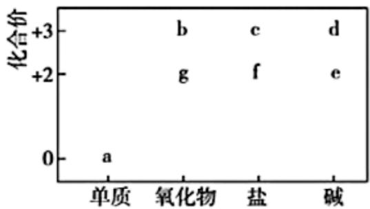

A. 若 a 在沸水中可生成 e，则 $a \rightarrow f$ 的反应一定是化合反应
B. 在 $g \rightarrow f \rightarrow e \rightarrow d$ 转化过程中，一定存在物质颜色的变化
C. 加热 c 的饱和溶液，一定会形成能产生丁达尔效应的红棕色分散系
D. 若 b 和 d 均能与同一物质反应生成 c，则组成 a 的元素一定位于周期表 p 区

【答案】B

【解析】

【详解】A. 若 a 在沸水中可生成 e，此时 a 为 Mg，e 为 Mg（OH）₂，即 f 为镁盐，a→f 的反应有多种，可能为 Mg + 2HCl = MgCl₂ + H₂ ↑，该反应属于置换反应，可能为 Mg + Cl₂ 点燃 MgCl₂，该反应属于化合反应，综上 a→f 的反应不一定是化合反应，故 A 错误；
B. e 能转化为 d，此时 e 为白色沉淀 Fe(OH)₂，d 为红褐色沉淀 Fe(OH)₃，说明在 g→f→e→d 转化过程中，一定存在物质颜色的变化，故 B 正确；
C. 由题意得，此时能产生丁达尔效应的红棕色分散系为 Fe(OH)₃ 胶体，c 应为铁盐，加热铁盐的饱和溶液，也有可能直接得到 Fe(OH)₃ 沉淀，故 C 错误；
D. 假设 b 为 Al₂O₃，即 d 为 Al(OH)₃，c 为铝盐，Al₂O₃、Al(OH)₃ 与稀盐酸反应均生成铝盐，此时组成 a 的元素为 Al，位于周期表 p 区；假设 b 为 Fe₂O₃，即 d 为 Fe(OH)₃，c 为铁盐，Fe₂O₃、Fe(OH)₃ 与稀盐酸反应均生成铁盐，此时组成 a 的元素为 Fe，位于周期表 d 区，故 D 错误；故选 B。

15. 对反应 $S(g) \rightleftharpoons T(g)$ (I 为中间产物)，相同条件下：①加入催化剂，反应达到平衡所需时间大幅缩短；

②提高反应温度， $c_{\text{平}}(S)/c_{\text{平}}(T)$ 增大， $c_{\text{平}}(S)/c_{\text{平}}(I)$ 减小

A.  
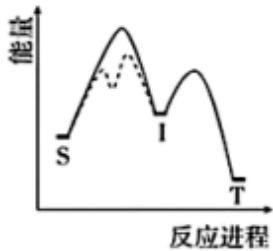

B.  
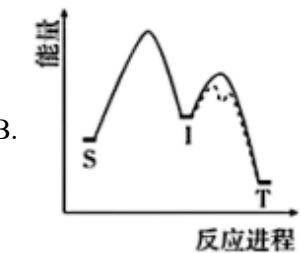

C.  
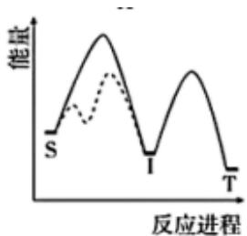

D.  
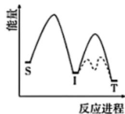

【答案】A

【解析】

【详解】提高反应温度， $c_{\text{平}}(S)/c_{\text{平}}(T)$ 增大，说明反应 $S(g) \rightleftharpoons T(g)$ 的平衡逆向移动，即该反应为放热反应， $c_{\text{平}}(S)/c_{\text{平}}(I)$ 减小，说明 S 生成中间产物 I 的反应平衡正向移动，属于吸热反应，由此可排除 C、D 选项，加入催化剂，反应达到平衡所需时间大幅缩短，即反应的决速步骤的活化能下降，使得反应速率大幅加快，活化能大的步骤为决速步骤，符合条件的反应历程示意图为 A，故 A 正确，故选 A。

16. 一种基于氯碱工艺的新型电解池(下图)，可用于湿法治铁的研究。电解过程中，下列说法不正确的是

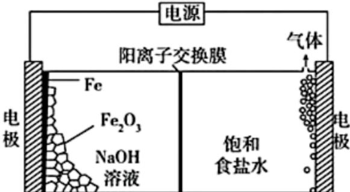

A. 阳极反应: $2 \mathrm{Cl}^{-}-2 \mathrm{e}^{-}=\mathrm{Cl}_{2} \uparrow$ B. 阴极区溶液中 $\mathrm{OH}^{-}$ 浓度逐渐升高

C. 理论上每消耗 $1 \mathrm{~mol} \mathrm{Fe}_{2} \mathrm{O}_{3}$ , 阳极室溶液减少 $213 \mathrm{~g}$ D. 理论上每消耗 $1 \mathrm{~mol} \mathrm{Fe}_{2} \mathrm{O}_{3}$ , 阴极室物质最多增加 $138 \mathrm{~g}$

【答案】C

【解析】

【分析】右侧溶液为饱和食盐水，右侧电极产生气体，则右侧电极为阳极， $Cl^{-}$ 放电产生氯气，电极反应为： $2Cl^{-}-2e^{-}=Cl_{2}\uparrow$ ；左侧电极为阴极，发生还原反应， $Fe_{2}O_{3}$ 在碱性条件下转化为Fe，电极反应为： $Fe_{2}O_{3}+6e^{-}+3H_{2}O=2Fe+6OH^{-}$ ；中间为阳离子交换膜， $Na^{+}$ 由阳极向阴极移动。

【详解】A．由分析可知，阳极反应为： $2Cl^{-}-2e^{-}=Cl_{2}\uparrow$ ，A正确；

B. 由分析可知, 阴极反应为: $Fe_{2}O_{3} + 6e^{-} + 3H_{2}O = 2Fe + 6OH^{-}$ , 消耗水产生 $OH^{-}$ , 阴极区溶液中 $OH^{-}$ 浓度逐渐升高, B 正确;  
C. 由分析可知, 理论上每消耗 $1molFe_{2}O_{3}$ , 转移 $6mol$ 电子, 产生 $3molCl_{2}$ , 同时有 $6molNa^{+}$ 由阳极转移至阴极, 则阳极室溶液减少 $3 \times 71g + 6 \times 23g = 351g$ , C 错误;  
D. 由分析可知, 理论上每消耗 $1molFe_{2}O_{3}$ , 转移 $6mol$ 电子, 有 $6molNa^{+}$ 由阳极转移至阴极, 阴极室物质最多增加 $6 \times 23g = 138g$ , D 正确;

故选 C。

## 二、非选择题：本大题共4小题，共56分。考生根据要求作答。

17. 含硫物质种类繁多，在一定条件下可相互转化。

(1) 实验室中, 浓硫酸与铜丝反应, 所产生的尾气可用\_\_\_\_(填化学式)溶液吸收。

(2) 工业上, 烟气中的 $\mathrm{SO}_{2}$ 可在通空气条件下用石灰石的浆液吸收, 生成石膏。该过程中, \_\_\_\_(填元素符号)被氧化。

（3）工业锅炉需定期除水垢，其中的硫酸钙用纯碱溶液处理时，发生反应：

$\mathrm{CaSO}_4(\mathrm{s}) + \mathrm{CO}_3^{2-}(\mathrm{aq}) \rightleftharpoons \mathrm{CaCO}_3(\mathrm{s}) + \mathrm{SO}_4^{2-}(\mathrm{aq})(\mathrm{I})$ 。兴趣小组在实验室探究 $\mathrm{Na}_2\mathrm{CO}_3$ 溶液的浓度对反应(I)的反应速率的影响。

①用 $Na_{2}CO_{3}$ 固体配制溶液，以滴定法测定其浓度。

i. 该过程中用到的仪器有\_\_\_\_。

A.

B.

C.

D.

ii. 滴定数据及处理: $\mathrm{Na}_{2} \mathrm{CO}_{3}$ 溶液 $\mathrm{V}_{0} \mathrm{~mL}$ , 消耗 $\mathrm{c}_{1} \mathrm{~mol} \cdot \mathrm{L}^{-1}$ 盐酸 $\mathrm{V}_{1} \mathrm{~mL}$ (滴定终点时, $\mathrm{CO}_{3}^{2-}$ 转化为 $\mathrm{HCO}_{3}^{-}$ ), 则 $\mathrm{c}(\mathrm{Na}_{2} \mathrm{CO}_{3}) = \_ \_ \_ \_ \_ \_ \_ \_ \_ \_ \_ \_ \_ \_ \_ \_ \_ \_ \_ \_ \_ \_ \_ \_ \_ \_ \_ \_ \_ \_$ mol·L $^{-1}$ 。

②实验探究: 取①中的 $\mathrm{Na}_{2} \mathrm{CO}_{3}$ 溶液, 按下表配制总体积相同的系列溶液, 分别加入 $\mathrm{m}_{1} \mathrm{~g}$ 硫酸钙固体, 反应 $t_{1}$ min 后，过滤，取 $V_{0}$ mL 滤液，用 $c_{1}$ mol·L $^{-1}$ 盐酸参照①进行滴定。记录的部分数据如下表(忽略 CO $_{3}^{2-}$ 水解的影响)。

<table><tr><td>序号</td><td> $V(Na_2CO_3)/mL$ </td><td> $V(H_2O)/mL$ </td><td> $V(滤液)/mL$ </td><td> $V_{消耗}(盐酸)/mL$ </td></tr><tr><td>a</td><td>100.0</td><td>0</td><td> $V_0$ </td><td> $2V_1/5$ </td></tr><tr><td>b</td><td>80.0</td><td>x</td><td> $V_0$ </td><td> $3V_1/10$ </td></tr></table>

则 $x =$ \_\_\_\_，测得的平均反应速率之比 $\mathrm{V_a:V_b =}$ \_\_\_\_。

(4) 兴趣小组继续探究反应(I)平衡的建立, 进行实验。

①初步实验 将 $1.00 \mathrm{~g}$ 硫酸钙 $(\mathrm{M} = 136 \mathrm{~g} \cdot \mathrm{mol}^{-1})$ 加入 $100.0 \mathrm{~mL} 0.100 \mathrm{~mol} \cdot \mathrm{L}^{-1} \mathrm{Na}_{2} \mathrm{CO}_{3}$ 溶液中，在 $25^{\circ} \mathrm{C}$ 和搅拌条件下，利用 $\mathrm{pH}$ 计测得体系的 $\mathrm{pH}$ 随时间的变化曲线如图。

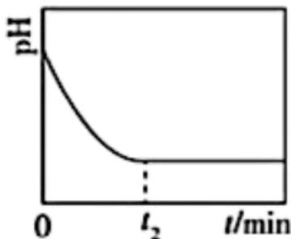

②分析讨论 甲同学根据 $t_{2} \min$ 后 $\mathrm{pH}$ 不改变, 认为反应(I)已达到平衡; 乙同学认为证据不足, 并提出如下假设:

假设 1 硫酸钙固体已完全消耗;

假设 2 硫酸钙固体有剩余，但被碳酸钙沉淀包裹。

③验证假设，乙同学设计如下方案，进行实验。

<table><tr><td>步骤</td><td>现象</td></tr><tr><td>i. 将1实验中的反应混合物进行固液分离</td><td>/</td></tr><tr><td>ii. 取少量分离出的沉淀置于试管中,滴加___</td><td>___,沉淀完全溶解</td></tr><tr><td>iii. 继续向ii的试管中滴加___</td><td>无白色沉淀生成</td></tr></table>

④实验小结 假设 1 成立，假设 2 不成立。①实验中反应(I)平衡未建立。

(5) 优化方案、建立平衡 写出优化的实验方案，并给出反应(I)平衡已建立的判断依据：\_\_\_\_。
【答案】（1）NaOH（其他合理答案也可）
(2) S (3) ①. BD ②. $\frac{c_{1}V_{1}}{V_{0}}$ ③. 20.0 ④. 6: 5

(4) ①. 过量稀盐酸 ②. 有气体产生 ③. $\mathrm{BaCl}_{2}$ 溶液 ④. 将最少 $1.36 \mathrm{~g}$ 硫酸钙加入 $100.0 \mathrm{~mL} 0.100 \mathrm{~mol} \cdot \mathrm{L}^{-1} \mathrm{Na}_{2} \mathrm{CO}_{3}$ 溶液中, 在 $25^{\circ} \mathrm{C}$ 和搅拌条件下, 利用 $\mathrm{pH}$ 计测得体系的 $\mathrm{pH}$ , 当 $\mathrm{pH}$ 不变时, 加入 $\mathrm{Na}_{2} \mathrm{SO}_{4}$ 固体, 若 $\mathrm{pH}$ 值变大, 说明反应I平衡已建立

【分析】探究反应 $\mathrm{CaSO_{4}(s)+CO_{3}^{2-}(aq)\rightleftharpoons CaCO_{3}(s)+SO_{4}^{2-}(aq)(I)}$ 中 $Na_{2}CO_{3}$ 溶液的浓度对反应速率的影响，通过 HCl 与 $Na_{2}CO_{3}$ 的滴定反应，来测量 $Na_{2}CO_{3}$ 浓度的变化量，从而计算平均反应速率；
探究反应 $\mathrm{CaSO_{4}(s)+CO_{3}^{2-}(aq)\rightleftharpoons CaCO_{3}(s)+SO_{4}^{2-}(aq)}$ 平衡的建立，利用 $CO_{3}^{2-}$ 水解呈碱性的性质，通过测定 pH 来判断 $CO_{3}^{2-}$ 离子浓度的变化情况，从而判断反应是否平衡。
【小问1详解】

浓硫酸与铜丝反应方程式为： $Cu + 2H_{2}SO_{4} \xlongequal{\Delta} CuSO_{4} + SO_{2} \uparrow + 2H_{2}O$ ，所产生的尾气为 $SO_{2}$ ，可用 NaOH 溶液吸收（其他合理答案也可）；

$$
\mathrm{SO} _ {2}
$$

$$
\mathrm{CaSO} _ {4})
$$

①用 $Na_{2}CO_{3}$ 固体配制溶液，以滴定法测定其浓度，该过程用到下列仪器中的烧杯、酸式滴定管，故选
BD；根据离子方程式 $CO_{3}^{2-} + H^{+} = HCO_{3}^{-}$ 可知， $c(Na_{2}CO_{3}) = \frac{c_{1}V_{1} \times 10^{-3}}{V_{0} \times 10^{-3}} = \frac{c_{1}V_{1}}{V_{0}} mol/L$ ;
②总体积应相同，x为20.0mL；a中消耗的盐酸体积为 $\frac{2V_{1}}{5}$ ，即 $\Delta\mathrm{c}\left(\mathrm{Na}_{2}\mathrm{CO}_{3}\right)=\frac{c_{1}\mathrm{V}_{1}}{\mathrm{V}_{0}}-\frac{2c_{1}\mathrm{V}_{1}}{5\mathrm{V}_{0}}=\frac{3c_{1}\mathrm{V}_{1}}{5\mathrm{V}_{0}}\mathrm{mol}/\mathrm{L}$ ，同理可得，b中 $\Delta\mathrm{c}\left(\mathrm{Na}_{2}\mathrm{CO}_{3}\right)=\frac{80\mathrm{mL}}{100\mathrm{mL}}\times\frac{c_{1}V_{1}}{V_{0}}-\frac{3c_{1}V_{1}}{10V_{0}}=\frac{c_{1}V_{1}}{2V_{0}}$ ，由于 $v=\frac{\Delta c}{\Delta t}$ ， $v_{a}:v_{b}=\frac{3c_{1}V_{1}}{5V_{0}}:\frac{V_{1}}{2}=6:5$ ;

由结论假设 1 成立，假设 2 不成立，说明①实验中的沉淀均为 $CaCO_{3}$ ，要验证沉淀中无 $CaSO_{4}$ ，可酸溶后滴加 $BaCl_{2}$ 将①实验中的反应混合物进行固液分离后，取少量分离出的沉淀置于试管中，滴加过量稀盐酸，有气体产生，沉淀完全溶解，继续滴加 $BaCl_{2}$ 溶液，无白色沉淀生成，说明沉淀均为 $CaCO_{3}$ ，无 $CaSO_{4}$ ；由方程式 $CaSO_{4}(s)+CO_{3}^{2-}(aq)\rightleftharpoons CaCO_{3}(s)+SO_{4}^{2-}(aq)$ 可知，假设正反应 100% 进行， $n\left(\mathrm{CaSO}_{4}\right)=n\left(\mathrm{CO}_{3}^{2-}\right)=0.100\mathrm{mol/L}\times0.1\mathrm{L}=0.01\mathrm{mol}$ ，质量为 $0.01\mathrm{mol}\times136\mathrm{g/mol}=1.36\mathrm{g}$ ，实验方案为：将最少 1.36g 硫酸钙加入 $100.0\mathrm{mL}0.100\mathrm{mol}\cdot\mathrm{L}^{-1}\mathrm{Na}_{2}\mathrm{CO}_{3}$ 溶液中，在 $25^{\circ}C$ 和搅拌条件下，利用 pH 计测得体系的 pH，当 pH 不变时，加入 $Na_{2}SO_{4}$ 固体，若 pH 值变大，说明反应 I 平衡已建立。

18. 镓(Ga)在半导体、记忆合金等高精尖材料领域有重要应用。一种从电解铝的副产品炭渣(含 C、Na、Al、F 和少量的 Ga、Fe、K、Ca 等元素)中提取镓及循环利用铝的工艺如下。

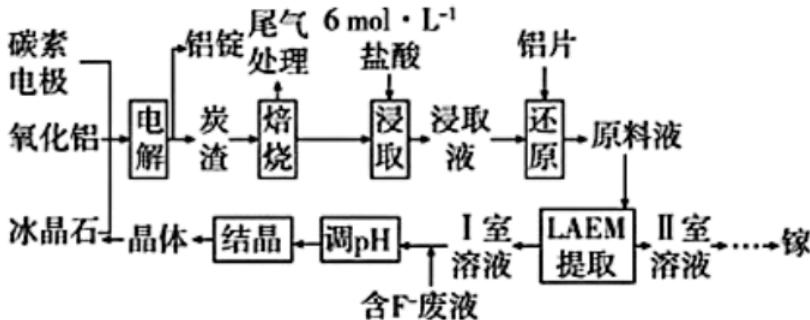

工艺中，LAEM 是一种新型阴离子交换膜，允许带负电荷的配离子从高浓度区扩散至低浓度区。用 LAEM 提取金属离子 $\mathbf{M}^{\mathrm{n+}}$ 的原理如图。已知：

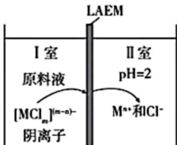

① $pK_{a}(HF)=3.2$ 。

② $\mathrm{Na}_{3}\left[\mathrm{AlF}_{6}\right]$ (冰晶石)的 $\mathrm{K}_{\mathrm{sp}}$ 为 $4.0\times 10^{-10}$ 。

③浸取液中， $\mathrm{Ga(III)}$ 和 $\mathrm{Fe(III)}$ 以 $\left[\mathrm{MCl}_{\mathrm{m}}\right]^{(\mathrm{m-3})} (\mathrm{m}=0\sim4)$ 微粒形式存在， $\mathrm{Fe}^{2+}$ 最多可与 2 个 $\mathrm{Cl}^{-}$ 配位，其他金属离子与 $\mathrm{Cl}^{-}$ 的配位可忽略。

(1) “电解”中, 反应的化学方程式为\_\_\_\_。

(2) “浸取”中, 由 $\mathrm{Ga}^{3+}$ 形成 $\left[\mathrm{GaCl}_{4}\right]^{-}$ 的离子方程式为\_\_\_\_。

(3) “还原”的目的: 避免\_\_\_\_元素以\_\_\_\_(填化学式)微粒的形式通过 LAEM, 从而有利于 Ga

的分离。

(4) “LAEM 提取”中, 原料液的 $\mathrm{Cl}^-$ 浓度越\_\_\_\_, 越有利于 $\mathrm{Ga}$ 的提取; 研究表明, 原料液酸度过高, 会降低 $\mathrm{Ga}$ 的提取率。因此, 在不提高原料液酸度的前提下, 可向 I 室中加入\_\_\_\_(填化学式), 以进一步提高 $\mathrm{Ga}$ 的提取率。

（5）“调 pH”中，pH 至少应大于 \_\_\_\_，使溶液中 $\mathrm{c}\left(\mathrm{F}^{-}\right)>\mathrm{c}(\mathrm{HF})$ ，有利于 $\left[AlF_{6}\right]^{3-}$ 配离子及 $Na_{3}\left[AlF_{6}\right]$ 晶体的生成。若“结晶”后溶液中 $\mathrm{c}\left(\mathrm{Na}^{+}\right)=0.10\mathrm{mol}\cdot\mathrm{L}^{-1}$ ，则 $\left[AlF_{6}\right]^{3-}$ 浓度为 \_\_\_\_ mol·L $^{-1}$ 。

(6) 一种含 Ga、Ni、Co 元素的记忆合金的晶体结构可描述为 Ga 与 Ni 交替填充在 Co 构成的立方体体心, 形成如图所示的结构单元。该合金的晶胞中, 粒子个数最简比 Co:Ga:Ni=\_\_\_\_, 其立方晶胞的体积为 \_\_\_\_ nm $^{3}$ 。

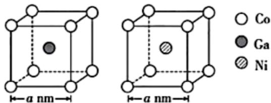

【答案】(1) $2Al_{2}O_{3}(熔融)\xlongequal{电解}4Al+3O_{2}\uparrow$ 冰晶石

(2) $\mathrm{Ga}^{3+} + 4\mathrm{Cl}^{-} = [\mathrm{GaCl}_{4}]^{-}$

(3) ①. 铁 ②. $[FeCl_{6}]^{3-}$

(4) ①. 高 ②. NaCl

(5) ①.3.2 ②. $4.0 \times 10^{-7}$

(6) ①.2:1:1 ②. $8\mathrm{a}^3$

【解析】

【分析】电解铝的副产品炭渣(含 C、Na、Al、F 和少量的 Ga、Fe、K、Ca 等元素)进行焙烧，金属转化为氧化物，焙烧后的固体加入盐酸浸取，浸取液加入铝片将 $Fe^{3+}$ 进行还原，得到原料液，原料液利用 LAEM 提取， $[GaCl_{4}]^{-}$ 通过交换膜进入 II 室并转化为 $Ga^{3+}$ ，II 室溶液进一步处理得到镓，I 室溶液加入含 F- 的废液调 pH 并结晶得到 $NaAlF_{6}$ 晶体用于电解铝；

【小问 1 详解】

“电解”是电解熔融的氧化铝冶炼铝单质，反应的化学方程式为 $2\mathrm{Al}_{2}\mathrm{O}_{3}$ (熔融) $\xrightarrow[\text{冰晶石}]{\text{电解}} 4\mathrm{Al} + 3\mathrm{O}_{2}\uparrow$ ；

【小问 2 详解】

“浸取”中，由 $Ga^{3+}$ 形成 $[GaCl_{4}]^{-}$ 的离子方程式为 $Ga^{3+} + 4Cl^{-} = [GaCl_{4}]^{-}$ ;

## 【小问 3 详解】

由已知，浸取液中， $\mathrm{Ga(III)}$ 和 $\mathrm{Fe(III)}$ 以 $[\mathrm{MCl}_{\mathrm{m}}]^{(\mathrm{m-3})} (\mathrm{m} = 0 \sim 4)$ 微粒形式存在，为了避免铁元素以 $[\mathrm{FeCl}_6]^{3-}$ 的微粒形式通过 LAEM，故要加入铝片还原 $\mathrm{Fe}^{3+}$ ，从而有利于 Ga 的分离；

## 【小问 4 详解】

“LAEM 提取”中，原料液的 Cl-浓度越高，更有利于生成 $\left[\mathrm{GaCl}_{4}\right]$ -的反应正向移动，更有利于 Ga 的提取，在不提高原料液酸度的前提下，同时不引入新杂质，可向 I 室中加入 NaCl，提高 Cl-浓度，进一步提高 Ga 的提取率；

## 【小问 5 详解】

由 $pK_{a}(HF)=3.2$ ， $K_{a}(HF)=\frac{c(H^{+})c(F^{-})}{c(HF)}=10^{-3.2}$ ，为了使溶液中 $c(F^{-})>c(HF)$ ， $c(H^{+})=\frac{c(HF)}{c(F^{-})}\times10^{-3.2}<10^{-3.2}$ mol/L，故 pH 至少应大于 3.2，有利于 $[AlF_{6}]^{3-}$ 配离子及 $Na_{3}[AlF_{6}]$ 晶体的生成，若“结晶”后溶液中 $c(Na^{+})=0.10mol\cdot L^{-1}$ ，根据 $Na_{3}[AlF_{6}]$ （冰晶石）的 $K_{sp}$ 为 $4.0\times10^{-10}$ ， $[AlF_{6}]^{3-}$ 浓度为 $\frac{K_{sp}}{c^{3}(Na^{+})}=\frac{4.0\times10^{-10}}{0.1^{3}}=4.0\times10^{-7}mol\cdot L^{-1}$ ;

## 【小问6详解】

合金的晶体结构可描述为 Ga 与 Ni 交替填充在 Co 构成的立方体体心，形成如图所示的结构单元，取 Ga 为晶胞顶点，晶胞面心也是 Ga，Ni 处于晶胞棱心和体心，Ga 和 Ni 形成类似氯化钠晶胞的结构，晶胞中 Ga 和 Ni 形成的 8 个小正方体体心为 Co，故晶胞中 Ga、Ni 个数为 4，Co 个数为 8，粒子个数最简比 Co:Ga:Ni=2:1:1，晶胞棱长为两个最近的 Ga 之间（或最近的 Ni 之间）的距离，为 2a nm，故晶胞的体积为 $8a^{3}nm$ 。

19. 酸在多种反应中具有广泛应用，其性能通常与酸的强度密切相关。

(1) 酸催化下 $\mathrm{NaNO}_{2}$ 与 $\mathrm{NH}_{4} \mathrm{Cl}$ 混合溶液的反应(反应 a)，可用于石油开采中油路解堵。

①基态 N 原子价层电子的轨道表示式为\_\_\_\_。

②反应 a: $\mathrm{NO}_{2}^{-}(\mathrm{aq})+\mathrm{NH}_{4}^{+}(\mathrm{aq})=\mathrm{N}_{2}(\mathrm{g})+2\mathrm{H}_{2}\mathrm{O}(\mathrm{l})$

已知:

$$
\begin{array}{r l} & \mathrm{NaNO} _ {2} (\mathrm{s}) + \mathrm{NH} _ {4} \mathrm{Cl} (\mathrm{s}) \xrightarrow {\Delta H _ {1}} \mathrm{N} _ {2} (\mathrm{g}) + \mathrm{NaCl} (\mathrm{s}) + 2 \mathrm{H} _ {2} \mathrm{O} (\mathrm{l}) \\ & \Delta H _ {2} \Biggl \downarrow \text {溶解} \quad \Delta H _ {3} \Biggl \downarrow \text {溶解} \quad \Delta H _ {4} \Biggl \downarrow \text {溶解} \\ & \boxed {\mathrm{Na} ^ {+} (\mathrm{aq}) + \mathrm{NO} _ {2} ^ {-} (\mathrm{aq})} \boxed {\mathrm{Cl} ^ {-} (\mathrm{aq}) + \mathrm{NH} _ {4} ^ {+} (\mathrm{aq})} \boxed {\mathrm{Na} ^ {+} (\mathrm{aq}) + \mathrm{Cl} ^ {-} (\mathrm{aq})} \end{array}
$$

则反应 a 的 $\Delta H=$ \_\_\_\_。

③某小组研究了 3 种酸对反应 a 的催化作用。在相同条件下，向反应体系中滴加等物质的量的少量酸，测得体系的温度 T 随时间 t 的变化如图。

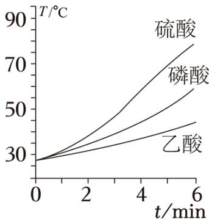

据图可知，在该过程中\_\_\_\_。
A. 催化剂酸性增强，可增大反应焓变
B. 催化剂酸性增强，有利于提高反应速率
C. 催化剂分子中含 H 越多，越有利于加速反应
D. 反应速率并不始终随着反应物浓度下降而减小

(2) 在非水溶剂中, 将 $\mathrm{CO}_{2}$ 转化为化合物ii(一种重要的电子化学品)的催化机理示意图如图, 其中的催化剂有\_\_\_\_和\_\_\_\_。

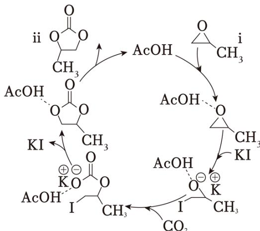

(3) 在非水溶剂中研究弱酸的电离平衡具有重要科学价值。一定温度下, 某研究组通过分光光度法测定了两种一元弱酸 $\mathrm{HX}$ (X 为 A 或 B)在某非水溶剂中的 $\mathrm{K}_{\mathrm{a}}$ 。

a. 选择合适的指示剂其钾盐为KIn， $K_{a}(HIn)=3.6\times10^{-20}$ ；其钾盐为KIn。

b. 向 KIn 溶液中加入 HX，发生反应： $In^{-} + HX \rightleftharpoons X^{-} + HIn$ 。KIn 起始的物质的量为 $n_{0}(KIn)$ ，加入 HX 的物质的量为 $n(HX)$ ，平衡时，测得 $c_{\text{平}}(In^{-}) / c_{\text{平}}(HIn)$ 随 $n(HX) / n_{0}(KIn)$ 的变化曲线如图。

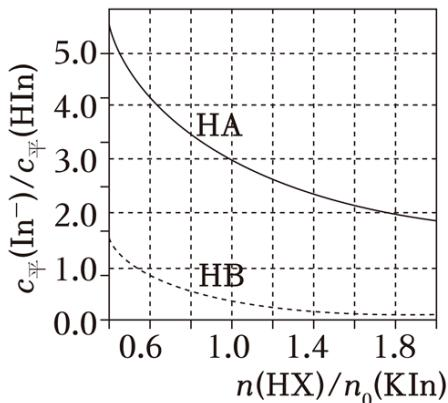

已知：该溶剂本身不电离，钾盐在该溶剂中完全电离。

①计算 $K_{a}(HA)$ \_\_\_\_。(写出计算过程，结果保留两位有效数字)

②在该溶剂中， $K_{a}(HB)$ \_\_\_\_ $K_{a}(HA)$ ; $K_{a}(HB)$ \_\_\_\_ $K_{a}(HIn)$ 。(填“>”“<”或“=”)

【答案】(1) ①.

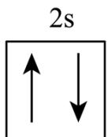

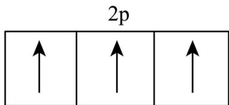

②. $\Delta \mathrm{H}_{1} - \Delta \mathrm{H}_{2} - \Delta \mathrm{H}_{3} + \Delta \mathrm{H}_{4}$ ③.

BD

(2) ①. AcOH ②. KI

(3) ①. $4.0 \times 10^{-21}$ ②. $>$ ③. $>$

【解析】

【小问 1 详解】

①N 的原子序数为 7，位于第二周期第 VA 族，基态 N 原子价层电子的轨道表示式为

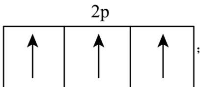

②由已知可得:

I. $\mathrm{NaNO}_{2}(\mathrm{s})+\mathrm{NH}_{4}\mathrm{Cl}(\mathrm{s})=\mathrm{N}_{2}(\mathrm{g})+\mathrm{NaCl}(\mathrm{s})+2\mathrm{H}_{2}\mathrm{O}(\mathrm{l}),\quad\Delta\mathrm{H}_{1};$

II. $\mathrm{NaNO}_{2}(\mathrm{s})=\mathrm{Na}^{+}(\mathrm{aq})+\mathrm{NO}_{2}^{-}(\mathrm{aq}),\quad\Delta\mathrm{H}_{2};$

III. $\mathrm{NH_{4}Cl(s)=Cl^{-}(aq)+NH_{4}^{+}(aq)}$ , $\Delta H_{3}$ ;

IV. NaCl(s)=Na $^{+}$ (aq)+Cl $^{-}$ (aq), ΔH $_{4}$ ;

由盖斯定律可知，目标方程式 $\mathrm{NO}_2^-$ (aq)+ $\mathrm{NH}_4^+$ (aq)= $\mathrm{N}_2$ (g)+ $2\mathrm{H}_2\mathrm{O}(\mathrm{l})$ 可由方程式I-II-III+IV得到，故反应

$\Delta \mathrm{H} = \Delta \mathrm{H}_{1} - \Delta \mathrm{H}_{2} - \Delta \mathrm{H}_{3} + \Delta \mathrm{H}_{4}$

③A. 催化剂不能改变反应的焓变, A 项错误;

B. 由图示可知，酸性：硫酸＞磷酸＞乙酸，催化剂酸性增强，反应速率提高，B项正确；

C. 一个硫酸分子中含有 2 个 H，一个磷酸分子中含有 3 个 H，一个乙酸分子中含有 4 个 H，但含 H 最少的硫酸催化时，最有利于加速反应，C 项错误；

D. 由图示可知, 反应开始一段时间, 反应物浓度减小, 但反应速率加快, 反应速率并不始终随着反应物浓度下降而减小, D 项正确;

故选 BD。

【小问 2 详解】

催化剂参与化学反应，但反应前后质量和化学性质并未改变，由催化机理示意图可知，催化剂有 AcOH 和 KI;

【小问 3 详解】

由变化曲线图可知，当 $\frac{\mathrm{n(HX)}}{\mathrm{n}_0(\mathrm{KIn})} = 1.0$ 时， $\frac{\mathrm{c}_{\text{平}}(\mathrm{In}^{-})}{\mathrm{n}_{\text{平}}(\mathrm{HIn})} = 3.0$ ，设初始 $\mathbf{c}_0(\mathbf{KIn}) = \mathbf{c}_0\mathrm{mol / L}$ ，则初始 $\mathbf{c}(\mathbf{HX}) = \mathbf{c}_0\mathbf{mol / L}$ ，转化的物质的量浓度为 $\mathrm{xmol / L}$ ，可列出三段式如下：

$In^{-} + HX \rightleftharpoons X^{-} + HIn$ 起始浓度(mol/L) $c_{0}$ $c_{0}$ 0 0

转化浓度(mol/L) x x x x

平衡浓度(mol/L) $c_{0}-x$ $c_{0}-x$ x x

由 $\frac{\mathbf{c}_{\text{平}}(\mathrm{In}^{-})}{\mathbf{n}_{\text{平}}(\mathrm{HIn})} = 3.0$ ，即 $\frac{\mathbf{c}_0 - \mathbf{x}}{\mathbf{x}} = 3.0$ ，解得 $\mathbf{x} = 0.25\mathbf{c}_0$ ，则该反应的平衡常数为

$$
\mathrm{K} _ {1} = \frac {\mathrm{c} (\mathrm{X} ^ {-}) \cdot \mathrm{c} (\mathrm{HIn})}{\mathrm{c} (\mathrm{In} ^ {-}) \cdot \mathrm{c} (\mathrm{HX})} = \frac {\mathrm{c} (\mathrm{X} ^ {-}) \cdot \mathrm{c} (\mathrm{HIn}) \cdot \mathrm{c} (\mathrm{H} ^ {+})}{\mathrm{c} (\mathrm{In} ^ {-}) \cdot \mathrm{c} (\mathrm{HX}) \cdot \mathrm{c} (\mathrm{H} ^ {+})} = \frac {\mathrm{K} (\mathrm{HA})}{\mathrm{K} (\mathrm{HIn})} = \frac {0 . 2 5 \mathrm{c} _ {0} \times 0 . 2 5 \mathrm{c} _ {0}}{0 . 7 5 \mathrm{c} _ {0} \times 0 . 7 5 \mathrm{c} _ {0}} = \frac {\mathrm{K} _ {\mathrm{a}} (\mathrm{HA})}{3 . 6 \times 1 0 ^ {- 2 0}}
$$

解得 $K_{a}(HA)=4.0\times10^{-21}$ ;

②根据图像可知，当 $\frac{\mathrm{n(HB)}}{\mathrm{n}_0(\mathrm{KIn})} = 1.0$ 时，设此时转化的物质的量浓度为 $\mathrm{ymol / L}$ ，可列出三段式如下：

$In^{-} + HX \rightleftharpoons X^{-} + HIn$ 起始浓度(mol/L) $c_{0}$ $c_{0}$ 0 0

转化浓度(mol/L) y y y y

平衡浓度(mol/L) $c_{0}-y$ $c_{0}-y$ y y此时 $\frac{\mathrm{c}_{\text{平}}(\mathrm{In}^{-})}{\mathrm{n}_{\text{平}}(\mathrm{HIn})} < 1.0$ ，即 $\frac{\mathrm{c}_0 - \mathrm{y}}{\mathrm{y}} < 1.0$ ，则 $\mathrm{y} > 0.5\mathrm{c}_0$ ，则平衡常数 $\mathrm{K}_2 = \frac{\mathrm{K_a(HB)}}{\mathrm{K(HIn)}} > \mathrm{K}_1$ ，则 $\mathrm{K_a(HB)} > \mathrm{K_a(HA)}$ ；

由于 $\mathrm{y} > 0.5\mathrm{c}_0$ ，则 $\mathrm{K}_2 = \frac{\mathrm{K_a(HB)}}{\mathrm{K(HIn)}} >1$ ， $\mathrm{K_a(HB) > K_a(HIn)}$ 。

20. 将 3D 打印制备的固载铜离子陶瓷催化材料，用于化学催化和生物催化一体化技术，以实现化合物III 的绿色合成，示意图如下(反应条件路)。

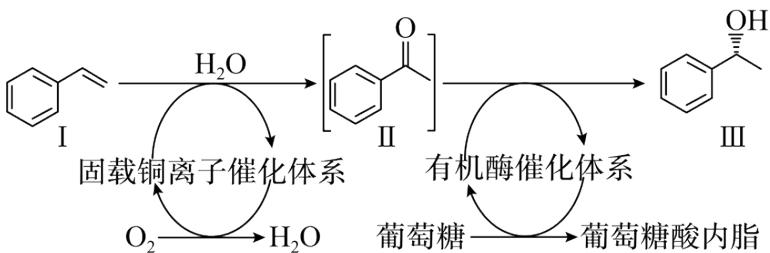

（1）化合物 I 的分子式为 \_\_\_\_，名称为 \_\_\_\_。

(2) 化合物Ⅱ中含氧官能团的名称是\_\_\_\_。化合物Ⅱ的某同分异构体含有苯环, 在核磁共振氢谱图上只有 4 组峰, 且能够发生银镜反应, 其结构简式为\_\_\_\_。

(3) 关于上述示意图中的相关物质及转化, 下列说法正确的有\_\_\_\_。
A. 由化合物 I 到 II 的转化中, 有 $\pi$ 键的断裂与形成
B. 由葡萄糖到葡萄糖酸内酯的转化中, 葡萄糖被还原
C. 葡萄糖易溶于水, 是因为其分子中有多个羟基, 能与水分子形成氢键
D. 由化合物 II 到 III 的转化中, 存在 C、O 原子杂化方式的改变, 有手性碳原子形成

（4）对化合物III，分析预测其可能的化学性质，完成下表。

<table><tr><td>序号</td><td>反应试剂、条件</td><td>反应形成的新结构</td><td>反应类型</td></tr><tr><td>1</td><td>___</td><td></td><td>___</td></tr><tr><td>2</td><td>___</td><td>___</td><td>取代反应</td></tr></table>

(5) 在一定条件下, 以原子利用率 $100 \%$ 的反应制备 $\mathrm{HOCH}\left(\mathrm{CH}_{3}\right)_{2}$ 。该反应中: ①若反应物之一为非极性分子, 则另一反应物为 (写结构简式)。

②若反应物之一为 V 形结构分子，则另一反应物为 \_\_\_\_ (写结构简式)。

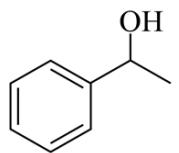

(6) 以2-溴丙烷为唯一有机原料, 合成 $\mathrm{CH}_{3} \mathrm{COOCH}\left(\mathrm{CH}_{3}\right)_{2}$ 。基于你设计的合成路线, 回答下列问题: ①最后一步反应的化学方程式为\_\_\_\_(注明反应条件)。

(2)第一步反应的化学方程式为\_\_\_\_(写一个即可，注明反应条件)。

【答案】(1) ① $\mathrm{C}_{8} \mathrm{H}_{8}$ ②. 苯乙烯

②.

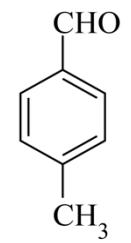

(3) ACD

(4) ①. $\mathrm{H}_{2}$ ; 催化剂、加热 ②. 加成反应 ③. HBr; 加热 ④.

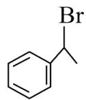

(5)

①.

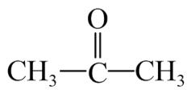

②. $CH_{3}CH=CH_{2}$

(6) ①. $\mathrm{H}_3\mathrm{C}-\mathrm{CH}-\mathrm{CH}_3$ + $\mathrm{CH}_3\mathrm{COOH} \stackrel{\Delta}{\underset{\text{浓硫酸}}{\rightleftharpoons}} \mathrm{CH}_3\mathrm{COOCH}\left(\mathrm{CH}_3\right)_2 + \mathrm{H}_2\mathrm{O}$ ②.

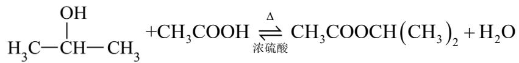

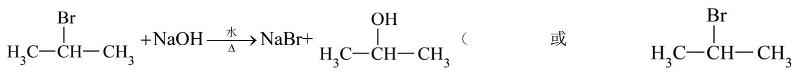

$$
+ \mathrm{NaOH} \xrightarrow [ \Delta ]{\text {醇}} \mathrm{NaBr} + \mathrm{H} _ {2} \mathrm{O} + \mathrm{CH} _ {3} \mathrm{CH} = \mathrm{CH} _ {2})
$$

【解析】

【分析】苯乙烯的碳碳双键先与水加成得到 $\mathrm{C}_{6}\mathrm{H}_{5}\mathrm{OH}$ ， $\mathrm{C}_{6}\mathrm{H}_{5}\mathrm{OH}$ 上的羟基发生催化氧化得到

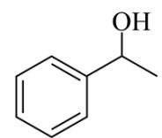

II，I转化为II的本质是苯乙烯被 $\mathrm{O}_2$ 氧化为 $\ce{C6H5COCH3}$ ，II转化为III的本质是 $\ce{C6H5COCH3}$ 被葡萄糖还原

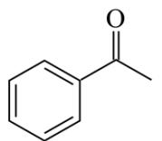

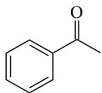

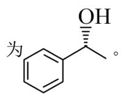

【小问1详解】

由 I 的结构可知，其分子式为 $C_{8}H_{8}$ ；名称为：苯乙烯；

【小问 2 详解】

由Ⅱ的结构可知，其含氧官能团为：酮羰基；化合物Ⅱ的某同分异构体含有苯环，在核磁共振氢谱图上只有

4 组峰，且能够发生银镜反应，即具有 4 种等效氢，含有醛基，符合条件的结构简式为：\$\begin{array}{c}\text{CHO}\\\text{CH}\_3\end{array}\$；

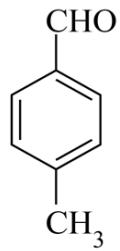

【小问 3 详解】

A. 由化合物I到II的转化中，I的碳碳双键先与水加成得到 $\ce{C6H5OH}$ ， $\ce{C6H5OH}$ 上的羟基催化

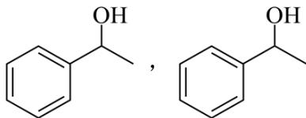

氧化得到II，有 $\pi$ 键的断裂与形成，故 A 正确；

B. 葡萄糖为 $\mathrm{HOCH}_2$ -（CHOH） $_4$ CHO，被氧化为葡萄糖酸： $\mathrm{HOCH}_2$ -（CHOH） $_4$ COOH，葡萄糖酸中的羧基和羟基发生酯化反应生成葡萄糖酸内脂，由该过程可知，葡萄糖被氧化，故 B 错误；

C. 葡萄糖为 $\mathrm{HOCH}_2$ -（CHOH） $_4$ CHO，有多个羟基，能与水分子形成氢键，使得葡萄糖易溶于水，故 C 正确；

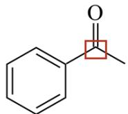

D. 化合物II 图中所示 C 为 $sp^{2}$ 杂化，转化为 III 图中所示 C 为 $sp^{3}$ 杂化，C

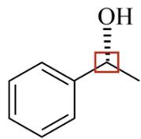

原子杂化方式改变，且该 C 为手性碳原子，O 的杂化方式由 $sp^{2}$ 转化为 $sp^{3}$ ，故 D 正确；

故选 ACD;

【小问 4 详解】

①由III的结构可知，III中的苯环与 $\mathrm{H}_{2}$ 加成可得新结构 $\begin{array}{c}\mathrm{CH}_{2}\\\mathrm{CH}_{2}\end{array}$ ，反应试剂、条件为： $\mathrm{H}_{2}$ ，催化

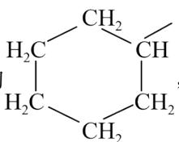

剂、加热，反应类型为加成反应；

②III可发生多种取代反应，如：III与HBr在加热的条件下羟基被Br取代，反应试剂、条件为：HBr，加

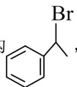

热，反应形成新结构 Br，（其他合理答案也可）；

【小问 5 详解】

原子利用率 $100\%$ 的反应制备 $\mathrm{HOCH}\left(\mathrm{CH}_{3}\right)_{2}$ ，反应类型应为加成反应，

①若反应物之一为非极性分子，该物质应为 $\mathrm{H}_{2}$ ，即该反应为 $\mathrm{CH}_{3}-\mathrm{C}=\mathrm{O}$ 与 $\mathrm{H}_{2}$ 加成；

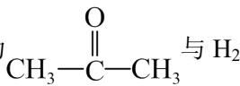

若反应物之一为 V 形结构分子，该物质应为 $H_{2}O$ ，即该反应为 $CH_{3}CH=CH_{2}$ 与 $H_{2}O$ 加成；

【小问6详解】

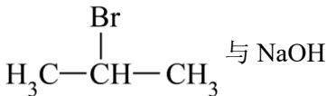

$\mathrm{H_{3}C-CH-CH_{3}}$ 与 NaOH 水溶液在加热条件下反应得到 $\mathrm{H_{3}C-CH-CH_{3}}$ ， $\mathrm{H_{3}C-CH-CH_{3}}$ 与

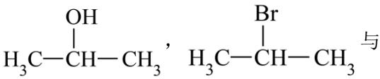

NaOH 醇溶液在加热条件下反应得到 $CH_{3}CH=CH_{2}$ ， $CH_{3}CH=CH_{2}$ 被酸性高锰酸钾溶液氧化为 $CH_{3}COOH$ ，

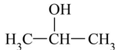

$\mathrm{H}_{3}\mathrm{C}-\mathrm{CH}-\mathrm{CH}_{3}$ 和 $CH_{3}COOH$ 在浓硫酸作催化剂，加热的条件下发生酯化反应生成

$CH_{3}COOCH(CH_{3})_{2}$ ，具体合成路线为：

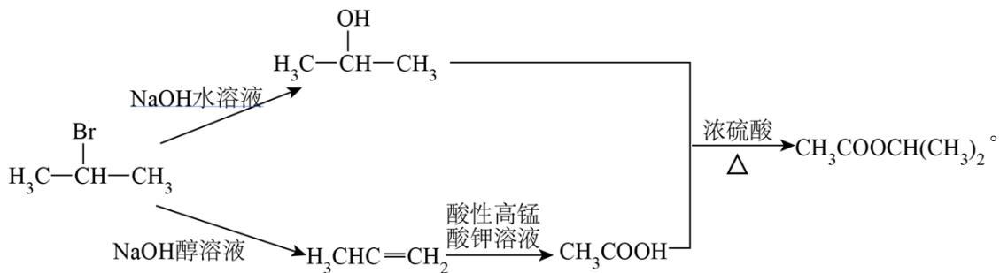

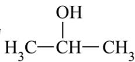

①最后一步为 $\begin{array}{c}OH\\|\\\mathrm{H}_{3}\mathrm{C}-\mathrm{CH}-\mathrm{CH}_{3}\end{array}$ 和 $CH_{3}COOH$ 在浓硫酸作催化剂，加热的条件下发生酯化反应生成

$CH_{3}COOCH(CH_{3})_{2}$ ，反应化学方程式为： $OH \mid H_{3}C-CH-CH_{3}$

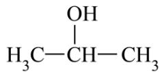

$$
+ \mathrm{CH} _ {3} \mathrm{COOH} \underset {\Delta} {\stackrel {\text {浓硫酸}} {\rightleftharpoons}} \mathrm{CH} _ {3} \mathrm{COOCH} \left(\mathrm{CH} _ {3}\right) _ {2} + \mathrm{H} _ {2} \mathrm{O};
$$

②第一步的化学方程式为： $H_{3}C-CH-CH_{3}$ $+NaOH\xrightarrow[\Delta]{水}NaBr+$ $H_{3}C-CH-CH_{3}$ 或

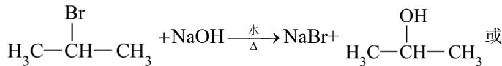

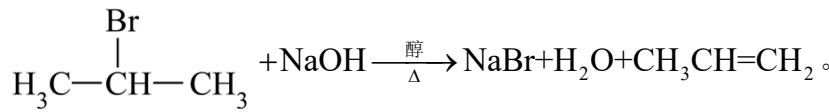