# 2024 年普通高中学业水平选择性考试(河北卷)

# 化学

本试卷满分 100 分，考试时间 75 分钟。

可能用到的相对原子质量：H-1 C-12 O-16 F-19 Cl-35.5 K-39 Cr-52 Br-80 Bi-209

## 一、选择题：本题共14小题，每小题3分，共42分。在每)小题给出的四个选项中，只有一项是符合题目要求的。

1. 燕赵大地历史悠久，文化灿烂。对下列河北博物院馆藏文物的说法错误的是

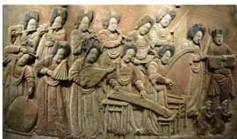

战国宫门青铜铺首 西汉透雕白玉璧 五代彩绘石质浮雕 元青花釉里红瓷盖罐
A. 青铜铺首主要成分是铜锡合金 B. 透雕白玉璧主要成分是硅酸盐
C. 石质浮雕主要成分是碳酸钙 D. 青花釉里红瓷盖罐主要成分是硫酸钙

【详解】A. 青铜铺首是青铜器，青铜的主要成分是铜锡合金，A 正确；  
B. 透雕白玉璧是玉石，玉石的主要成分是硅酸盐，B 正确；  
C. 石质浮雕是汉白玉，汉白玉的主要成分是碳酸钙，C 正确；  
D. 青花釉里红瓷盖罐是陶瓷，陶瓷的主要成分是硅酸盐，D 错误；

2. 关于实验室安全, 下列表述错误的是 A. $\mathrm{BaSO}_{4}$ 等钡的化合物均有毒, 相关废弃物应进行无害化处理 B. 观察烧杯中钠与水反应的实验现象时, 不能近距离俯视 C. 具有标识的化学品为易燃类物质, 应注意防火

D. 硝酸具有腐蚀性和挥发性，使用时应注意防护和通风
【答案】A
【解析】

【详解】A. $BaSO_{4}$ 性质稳定，不溶于水和酸，可用作“钡餐”说明对人体无害，无毒性，A 错误；

B. 钠与水反应剧烈且放热, 观察烧杯中钠与水反应的实验现象时, 不能近距离俯视, B 正确; C. 为易燃类物质的标识, 使用该类化学品时应注意防火, 以免发生火灾, C 正确; D. 硝酸具有腐蚀性和挥发性, 使用时应注意防护和通风, D 正确;

3. 高分子材料在生产、生活中得到广泛应用。下列说法错误的是  
A. 线型聚乙烯塑料为长链高分子，受热易软化  
B. 聚四氟乙烯由四氟乙烯加聚合成，受热易分解  
C. 尼龙66由己二酸和己二胺缩聚合成，强度高、韧性好  
D. 聚甲基丙烯酸酯(有机玻璃)由甲基丙烯酸酯加聚合成，透明度高

【详解】A. 线型聚乙烯塑料具有热塑性，受热易软化，A 正确；  
B. 聚四氟乙烯由四氟乙烯加聚合成，具有一定的热稳定性，受热不易分解，B 错误；  
C. 尼龙 66 即聚己二酰己二胺，由己二酸和己二胺缩聚合成，强度高、韧性好，C 正确；  
D. 聚甲基丙烯酸酯由甲基丙烯酸酯加聚合成，又名有机玻璃，说明其透明度高，D 正确；

4. 超氧化钾 $\left(\mathrm{KO}_{2}\right)$ 可用作潜水或宇航装置的 $CO_{2}$ 吸收剂和供氧剂，反应为 $4\mathrm{KO}_{2}+2\mathrm{CO}_{2}=2\mathrm{K}_{2}\mathrm{CO}_{3}+3\mathrm{O}_{2}$ ， $N_{A}$ 为阿伏加德罗常数的值。下列说法正确的是
A. $44gCO_{2}$ 中 $\sigma$ 键的数目为 $2N_{A}$ B. $1molKO_{2}$ 晶体中离子的数目为 $3N_{A}$ C. $1L1mol\cdot L^{-1}K_{2}CO_{3}$ 溶液中 $CO_{3}^{2-}$ 的数目为 $N_{A}$ D. 该反应中每转移1mol电子生成 $O_{2}$ 的数目为 $1.5N_{A}$

$$
1 \mathrm{mol}) \mathrm{CO} _ {2}
$$

$$
2 \mathrm{N} _ {\mathrm{A}}
$$

B. $KO_{2}$ 由 $K^{+}$ 和 $O_{2}^{-}$ 构成，1mol $KO_{2}$ 晶体中离子的数目为 $2N_{A}$ ，B 错误；

C. $CO_{3}^{2-}$ 在水溶液中会发生水解： $CO_{3}^{2-} + H_{2}O \rightleftharpoons HCO_{3}^{-} + OH^{-}$ ，故 $1L1mol \cdot L^{-1}K_{2}CO_{3}$ 溶液中 $CO_{3}^{2-}$ 的数目小于 $N_{A}$ ，C 错误；
D. 该反应中部分氧元素化合价由 -0.5 价升至 0 价，部分氧元素化合价由 -0.5 价降至 -2 价，则每 $4mol\ KO_{2}$ 参加反应转移 3mol 电子，每转移 1mol 电子生成 $O_{2}$ 的数目为 $N_{A}$ ，D 错误；
故选 A。

5. 化合物 X 是由细菌与真菌共培养得到的一种天然产物，结构简式如图。下列相关表述错误的是

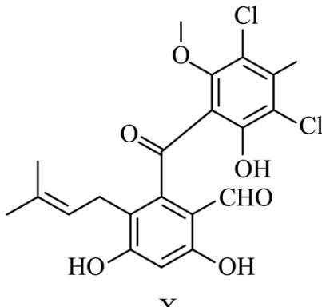

A. 可与 $\mathrm{Br}_{2}$ 发生加成反应和取代反应 B. 可与 $\mathrm{FeCl}_{3}$ 溶液发生显色反应 C. 含有4种含氧官能团 D. 存在顺反异构

【解析】

【详解】A. 化合物 X 中存在碳碳双键，能和 $Br_{2}$ 发生加成反应，苯环连有酚羟基，下方苯环上酚羟基邻位有氢原子，可以与 $Br_{2}$ 发生取代反应，A 正确；
B. 化合物 X 中有酚羟基，遇 $FeCl_{3}$ 溶液会发生显色反应，B 正确；
C. 化合物 X 中含有酚羟基、醛基、酮羰基、醚键 4 种含氧官能团，C 正确；
D. 该化合物中只有一个碳碳双键，其中一个双键碳原子连接的 2 个原子团都是甲基，所以不存在顺反异构，D 错误；
故选 D。

6. 下列实验操作及现象能得出相应结论的是

<table><tr><td>选项</td><td>实验操作及现象</td><td>结论</td></tr><tr><td>A</td><td>还原铁粉与水蒸气反应生成的气体点燃后有爆鸣声</td><td> $H_{2}O$ 具有还原性</td></tr><tr><td>B</td><td>待测液中滴加 $BaCl_{2}$ 溶液,生成白色沉淀</td><td>待测液含有 $SO_{4}^{2-}$ </td></tr><tr><td>C</td><td> $Mg(OH)_{2}$ 和 $Al(OH)_{3}$ 中均分别加入NaOH溶液和盐酸, $Mg(OH)_{2}$ 只溶于盐酸, $Al(OH)_{3}$ 都能溶</td><td> $Mg(OH)_{2}$ 比 $Al(OH)_{3}$ 碱性强</td></tr><tr><td>D</td><td> $K_{2}Cr_{2}O_{7}$ 溶液中滴加NaOH溶液,溶液由橙色变为黄色</td><td>增大生成物的浓度,平衡向逆反应方向移动</td></tr></table>

A.A B.B C.C D.D

【答案】C

【解析】

【详解】A. 铁与水蒸气反应生成的气体是 $\mathrm{H}_{2}$ , 该反应中 H 由 +1 价变成 0 价, 被还原, 体现了 $\mathrm{H}_{2} \mathrm{O}$ 的氧化性, A 错误;  
B. 如果待测液中含有 $\mathrm{Ag}^{+}$ , $\mathrm{Ag}^{+}$ 与 $\mathrm{Cl}^{-}$ 反应也能产生白色沉淀, 或者 $CO_{3}^{2-}$ 、 $SO_{3}^{2-}$ 也会与 $\mathrm{Ba}^{2+}$ 产生白色沉淀, 所以通过该实验不能得出待测液中含有 $\mathrm{SO}_{4}^{2-}$ 的结论, B 错误;  
C. $\mathrm{Mg(OH)}_{2}$ 溶液能与盐酸反应, 不能与 NaOH 溶液反应, $\mathrm{Al(OH)}_{3}$ 与 NaOH 溶液和盐酸都能反应,说明 $\mathrm{Mg(OH)}_{2}$ 的碱性比 $\mathrm{Al(OH)}_{3}$ 的强, C 正确;  
D. $\mathrm{K}_{2} \mathrm{Cr}_{2} \mathrm{O}_{7}$ 溶液中存在平衡 $\mathrm{Cr}_{2} \mathrm{O}_{7}^{2-}$ (橙色) + $\mathrm{H}_{2} \mathrm{O} f$ $2 \mathrm{CrO}_{4}^{2-}$ (黄色) + $2 \mathrm{H}^{+}$ , 加入 NaOH 溶液后, $\mathrm{OH}^{-}$ 与 $\mathrm{H}^{+}$ 反应, 生成物浓度减小, 使平衡正向移动, 导致溶液由橙色变为黄色, 题给结论错误, D 错误;故选 C。

7. 侯氏制碱法工艺流程中的主反应为 $QR+YW_{3}+XZ_{2}+W_{2}Z=QWXZ_{3}+YW_{4}R$ ，其中 W、X、Y、Z、Q、R 分别代表相关化学元素。下列说法正确的是
A. 原子半径：W<X<Y
B. 第一电离能：X<Y<Z
C. 单质沸点：Z<R<Q
D. 电负性：W<Q<R

【分析】侯氏制碱法主反应的化学方程式为 $NaCl + NH_{3} + CO_{2} + H_{2}O = NaHCO_{3} \downarrow + NH_{4}Cl$ ，则可推出 W、X、Y、Z、Q、R 分别为 H 元素、C 元素、N 元素、O 元素、Na 元素、Cl 元素。

【详解】A．一般原子的电子层数越多半径越大，电子层数相同时，核电荷数越大，半径越小，则原子半径：H<N<C，故 A 错误；

B. 同周期从左到右元素第一电离能呈增大趋势，IIA族、VA族原子的第一电离能大于同周期相邻元素，则第一电离能： $C < O < N$ ，故B错误；

C. $\mathrm{O}_{2}$ 、 $\mathrm{Cl}_{2}$ 为分子晶体, 相对分子质量越大, 沸点越高, 二者在常温下均为气体, Na 在常温下为固体, 则沸点: $\mathrm{O}_{2} < \mathrm{Cl}_{2} < \mathrm{Na}$ , 故 C 正确;

D. 同周期元素, 从左往右电负性逐渐增大, 同族元素, 从上到下电负性逐渐减小, 电负性:

Na<H<Cl，故 D 错误；

故选 C。

8. 从微观视角探析物质结构及性质是学习化学的有效方法。下列实例与解释不符的是

<table><tr><td>选项</td><td>实例</td><td>解释</td></tr><tr><td>A</td><td>原子光谱是不连续的线状谱线</td><td>原子的能级是量子化的</td></tr><tr><td>B</td><td> $CO_{2}$ 、 $CH_{2}O$ 、 $CCl_{4}$ 键角依次减小</td><td>孤电子对与成键电子对的斥力大于成键电子对之间的斥力</td></tr><tr><td>C</td><td>CsCl晶体中 $Cs^{+}$ 与8个 $Cl^{-}$ 配位,而NaCl晶体中 $Na^{+}$ 与6个 $Cl^{-}$ 配位</td><td> $Cs^{+}$ 比 $Na^{+}$ 的半径大</td></tr><tr><td>D</td><td>逐个断开 $CH_{4}$ 中的C-H键,每步所需能量不同</td><td>各步中的C-H键所处化学环境不同</td></tr></table>

A.A B.B C.C D.D

【答案】B

【解析】

【详解】A．原子光谱是不连续的线状谱线，说明原子的能级是不连续的，即原子能级是量子化的，故 A 正确；

B. $\mathrm{CO}_{2}$ 中心 C 原子为 sp 杂化, 键角为 $180^{\circ}$ , $\mathrm{CH}_{2} \mathrm{O}$ 中心 C 原子为 $\mathrm{sp}^{2}$ 杂化, 键角大约为 $120^{\circ}$ , $\mathrm{CH}_{4}$ 中心 C 原子为 $sp^{3}$ 杂化，键角为 $109^{\circ}28'$ ，三种物质中心 C 原子都没有孤电子对，三者键角大小与孤电子对无关，故 B 错误；
C．离子晶体的配位数取决于阴、阳离子半径的相对大小，离子半径比越大，配位数越大， $Cs^{+}$ 周围最多能排布8个 $Cl^{-}$ ， $Na^{+}$ 周围最多能排布6个 $Cl^{-}$ ，说明 $Cs^{+}$ 比 $Na^{+}$ 半径大，故C正确；
D．断开第一个键时，碳原子周围的共用电子对多，原子核对共用电子对的吸引力较弱，需要能量较小，断开C-H键越多，碳原子周围共用电子对越少，原子核对共用电子对的吸引力越大，需要的能量变大，所以各步中的C-H键所处化学环境不同，每步所需能量不同，故D正确；故选B。

9. $NH_{4}ClO_{4}$ 是火箭固体燃料重要的氧载体，与某些易燃物作用可全部生成气态产物，如： $NH_{4}ClO_{4} + 2C = NH_{3} \uparrow + 2CO_{2} \uparrow + HCl \uparrow$ 。下列有关化学用语或表述正确的是
A. HCl 的形成过程可表示为 $H \cdot + \cdot Cl \cdot \rightarrow H^{+} [\cdot Cl \cdot]^{-}$ B. $NH_{4}ClO_{4}$ 中的阴、阳离子有相同的 VSEPR 模型和空间结构
C. 在 $C_{60}$ 、石墨、金刚石中，碳原子有 sp 、 $sp^{2}$ 和 $sp^{3}$ 三种杂化方式
D. $NH_{3}$ 和 $CO_{2}$ 都能作制冷剂是因为它们有相同类型的分子间作用力

【答案】B

【解析】

【详解】A. HCl 是共价化合物，其电子式为 H: $\overset{\cdot\cdot}{Cl}$ :，HCl 的形成过程可表示为 $H\times+\cdot\overset{\cdot\cdot}{Cl}:\longrightarrow H\times\overset{\cdot\cdot}{Cl}$ ，故 A 错误；

B. $NH_{4}ClO_{4}$ 中 $NH_{4}^{+}$ 的中心 N 原子孤电子对数为 $\frac{1}{2} \times (5 - 1 - 4) = 0$ ，价层电子对数为 4， $ClO_{4}^{-}$ 的中心 Cl 原子孤电子对数为 $\frac{1}{2} \times (7 + 1 - 2 \times 4) = 0$ ，价层电子对数为 4，则二者的 VSEPR 模型和空间结构均为正四面体形，故 B 正确；
C. $C_{60}$ 、石墨、金刚石中碳原子的杂化方式分别为 $sp^{2}$ 、 $sp^{2}$ 、 $sp^{3}$ ，共有 2 种杂化方式，故 C 错误；
D. $NH_{3}$ 易液化，其气化时吸收热量，可作制冷剂，干冰易升华，升华时吸收热量，也可作制冷剂，

$NH_{3}$ 分子间作用力为氢键和范德华力， $CO_{2}$ 分子间仅存在范德华力，故 D 错误；故选 B。

10. 图示装置不能完成相应气体的发生和收集实验的是(加热、除杂和尾气处理装置任选)

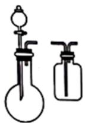

<table><tr><td>选项</td><td>气体</td><td>试剂</td></tr><tr><td>A</td><td> $SO_{2}$ </td><td>饱和  $Na_{2}SO_{3}$  溶液+浓硫酸</td></tr><tr><td>B</td><td> $Cl_{2}$ </td><td> $MnO_{2}$ +浓盐酸</td></tr><tr><td>C</td><td> $NH_{3}$ </td><td>固体  $NH_{4}Cl$ +熟石灰</td></tr><tr><td>D</td><td> $CO_{2}$ </td><td>石灰石+稀盐酸</td></tr></table>

A.A B.B C.C D.D

【答案】C 【解析】

【分析】如图所示的气体发生装置可以为固液加热型反应，也可以是固液不加热型；右侧气体收集装置，长进短出为向上排空气法，短进长出为向下排空气法，装满水后短进长出为排水法；  
【详解】A. 饱和 $\mathrm{Na}_{2} \mathrm{SO}_{3}$ 溶液和浓硫酸反应可以制 $\mathrm{SO}_{2}$ ，使用固液不加热制气装置， $\mathrm{SO}_{2}$ 密度比空气大，用向上排空气法收集，可以完成相应气体的发生和收集实验，A 不符合题意；  
B. $\mathrm{MnO}_{2}$ 和浓盐酸加热反应可以制 $\mathrm{Cl}_{2}$ ，使用固液加热制气装置， $\mathrm{Cl}_{2}$ 密度比空气大，用向上排空气法收集，可以完成相应气体的发生和收集实验，B 不符合题意；  
C. 固体 $\mathrm{NH}_{4} \mathrm{Cl}$ 与熟石灰加热可以制 $\mathrm{NH}_{3}$ 需要使用固固加热制气装置，图中装置不合理，不能完成相应气体的发生和收集实验，C 符合题意；  
D. 石灰石(主要成分为 $\mathrm{CaCO}_{3}$ ) 和稀盐酸反应可以制 $\mathrm{CO}_{2}$ ，使用固液不加热制气装置， $\mathrm{CO}_{2}$ 密度比空气大，用向上排空气法收集，可以完成相应气体的发生和收集实验，D 不符合题意；

本题选 C。

11. 在水溶液中， $\mathrm{CN}^{-}$ 可与多种金属离子形成配离子。X、Y、Z三种金属离子分别与 $\mathrm{CN}^{-}$ 形成配离子达平衡时， $\lg \frac{\mathrm{c}(\text{金属离子})}{\mathrm{c}(\text{配离子})}$ 与 $-\lg \mathrm{c}\left(\mathrm{CN}^{-}\right)$ 的关系如图。

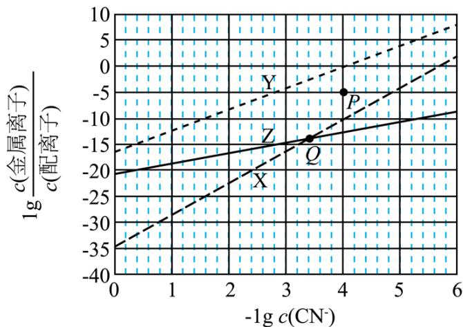

下列说法正确的是

A. 99%的X、Y转化为配离子时，两溶液中 $CN^{-}$ 的平衡浓度：X > Y
B. 向Q点X、Z的混合液中加少量可溶性Y盐，达平衡时 $\frac{c(X)}{c(X配离子)} > \frac{c(Z)}{c(Z配离子)}$ C. 由 Y 和 Z 分别制备等物质的量的配离子时，消耗 $CN^{-}$ 的物质的量：Y < Z
D. 若相关离子的浓度关系如 P 点所示，Y 配离子的解离速率小于生成速率

【答案】B

【解析】

【详解】A. 99%的X、Y转化为配离子时，溶液中 $\frac{\mathrm{c}(\mathrm{X})}{\mathrm{c}(\mathrm{X}\text{配离子})}=\frac{\mathrm{c}(\mathrm{Y})}{\mathrm{c}(\mathrm{Y}\text{配离子})}=\frac{1\%}{99\%}$ ，则 $\lg\frac{\mathrm{c}(\mathrm{X})}{\mathrm{c}(\mathrm{X}\text{配离子})}=\lg\frac{\mathrm{c}(\mathrm{Y})}{\mathrm{c}(\mathrm{Y}\text{配离子})}\approx-2$ ，根据图像可知，纵坐标约为-2时，溶液中 $-\lg c_{X}(CN^{-})>-\lg c_{Y}(CN^{-})$ ，则溶液中 $CN^{-}$ 的平衡浓度：X<Y，A错误；
B. Q点时 $\lg\frac{\mathrm{c}(\mathrm{X})}{\mathrm{c}(\mathrm{X}\text{配离子})}=\lg\frac{\mathrm{c}(\mathrm{Z})}{\mathrm{c}(\mathrm{Z}\text{配离子})}$ ，即 $\frac{\mathrm{c}(\mathrm{X})}{\mathrm{c}(\mathrm{X}\text{配离子})}=\frac{\mathrm{c}(\mathrm{Z})}{\mathrm{c}(\mathrm{Z}\text{配离子})}$ ，加入少量可溶性Y盐后，
会消耗 $CN^{-}$ 形成Y配离子，使得溶液中 $\mathrm{c}\left(\mathrm{CN}^{-}\right)$ 减小(沿横坐标轴向右移动)， $\lg\frac{\mathrm{c}(\mathrm{X})}{\mathrm{c}(\mathrm{X}\text{配离子})}$ 与

$\lg \frac{\mathrm{c}(\mathrm{Z})}{\mathrm{c}(\mathrm{Z}\text{配离子})}$ 曲线在Q点相交后，随着 $-\lg \mathrm{c}\left(\mathrm{CN}^{-}\right)$ 继续增大，X对应曲线位于Z对应曲线上方，即 $\lg \frac{\mathrm{c}(\mathrm{X})}{\mathrm{c}(\mathrm{X}\text{配离子})} >\lg \frac{\mathrm{c}(\mathrm{Z})}{\mathrm{c}(\mathrm{Z}\text{配离子})}$ ，则 $\frac{\mathrm{c}(\mathrm{X})}{\mathrm{c}(\mathrm{X}\text{配离子})} >\frac{\mathrm{c}(\mathrm{Z})}{\mathrm{c}(\mathrm{Z}\text{配离子})}$ ，B正确；

C. 设金属离子形成配离子的离子方程式为金属离子 $+\mathrm{mCN}^{-} =$ 配离子，则平衡常数

$\mathrm{K} = \frac{\mathrm{c}(\text{配离子})}{\mathrm{c}(\text{金属离子}) \cdot \mathrm{c}^{\mathrm{m}}(\mathrm{CN}^{-})}, \lg \mathrm{K} = \lg \frac{\mathrm{c}(\text{配离子})}{\mathrm{c}(\text{金属离子})} - \mathrm{mlgc}\left(\mathrm{CN}^{-}\right) = -\lg \frac{\mathrm{c}(\text{金属离子})}{\mathrm{c}(\text{配离子})} - \mathrm{mlgc}\left(\mathrm{CN}^{-}\right)$ ，即 $\lg \frac{\mathrm{c}(\text{金属离子})}{\mathrm{c}(\text{配离子})} = -\mathrm{mlgc}\left(\mathrm{CN}^{-}\right) - \lg \mathrm{K}$ ，故 X、Y、Z 三种金属离子形成配离子时结合的 $\mathrm{CN}^{-}$ 越多，对应 $\lg \frac{\mathrm{c}(\text{金属离子})}{\mathrm{c}(\text{配离子})} \sim -\lg \mathrm{c}\left(\mathrm{CN}^{-}\right)$ 曲线斜率越大，由题图知，曲线斜率： $Y > Z$ ，则由 Y、Z 制备等物质的量的配离子时，消耗 $\mathrm{CN}^{-}$ 的物质的量： $Z < Y$ ，C 错误；

D. 由 P 点状态移动到形成 Y 配离子的反应的平衡状态时， $-\lg c(CN^{-})$ 不变， $\lg \frac{c(Y)}{c(Y配离子)}$ 增大，即 $c(Y)$ 增大、 $c(Y配离子)$ 减小，则P点状态Y配离子的解离速率>生成速率，D错误；

本题选B。

12. 金属铋及其化合物广泛应用于电子设备、医药等领域。如图是铋的一种氟化物的立方晶胞及晶胞中MNPQ点的截面图，晶胞的边长为apm, $N_{A}$ 为阿伏加德罗常数的值。下列说法错误的是

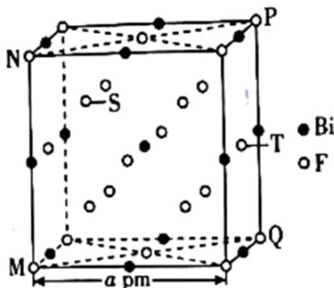

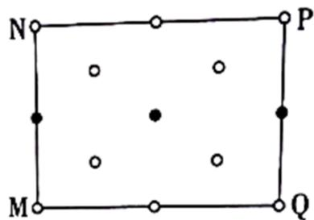

A. 该铋氟化物的化学式为 $\mathrm{BiF}_{3}$

B. 粒子 S、T 之间的距离为 $\frac{\sqrt{11}}{4} \mathrm{apm}$

C. 该晶体的密度为 $\frac{1064}{\mathrm{N}_{\mathrm{A}} \times a^{3} \times 10^{-30}} \mathrm{~g} \cdot \mathrm{cm}^{-3}$

D. 晶体中与铋离子最近且等距的氟离子有 6 个
【答案】D
【解析】

【详解】A．根据题给晶胞结构，由均摊法可知，每个晶胞中含有 $1+12\times\frac{1}{4}=4$ 个 $Bi^{3+}$ ，含有 $8+8\times\frac{1}{8}+6\times\frac{1}{2}=12$ 个 $F^{-}$ ，故该铋氟化物的化学式为 $BiF_{3}$ ，故A正确；

B. 将晶胞均分为 8 个小立方体，由晶胞中 MNPQ 点的截面图可知，晶胞体内的 8 个 F 位于 8 个小立方体的体心，以 M 为原点建立坐标系，令 N 的原子分数坐标为 $(0,0,1)$ ，与 Q、M 均在同一条棱上的 F 的原子分数坐标为 $(1,0,0)$ ，则 T 的原子分数坐标为 $\left(1,\frac{1}{2},\frac{1}{2}\right)$ ，S 的原子分数坐标为 $\left(\frac{1}{4},\frac{1}{4},\frac{3}{4}\right)$ ，所以粒子 S、T 之间的距离为 $\sqrt{\left(1-\frac{1}{4}\right)^{2}+\left(\frac{1}{2}-\frac{1}{4}\right)^{2}+\left(\frac{1}{2}-\frac{3}{4}\right)^{2}}\times apm=\frac{\sqrt{11}}{4}apm$ ，故 B 正确；
C. 由 A 项分析可知，每个晶胞中有 $4 \text{ 个 Bi }^{3+}$ 、 $12 \text{ 个 F}^{-}$ ，晶胞体积为 $(\mathrm{apm})^{3}=\mathrm{a}^{3}\times10^{-30}\mathrm{cm}^{3}$ ，则晶体密度为 $\rho=\frac{m}{V}=\frac{4\times(209+19\times3)}{N_{A}\times a^{3}\times10^{-30}}g\cdot cm^{-3}=\frac{1064}{N_{A}\times a^{3}\times10^{-30}}g\cdot cm^{-3}$ ，故 C 正确；
D. 以晶胞体心处铋离子为分析对象，距离其最近且等距的氟离子位于晶胞体内，为将晶胞均分为 8 个小立方体后，每个小立方体的体心的 F⁻，即有 8 个，故 D 错误；
故答案为：D。

13. 我国科技工作者设计了如图所示的可充电 $\mathrm{Mg - CO_2}$ 电池，以 $\mathrm{Mg(TFSI)_2}$ 为电解质，电解液中加入1，3-丙二胺(PDA)以捕获 $\mathrm{CO}_{2}$ ，使放电时 $\mathrm{CO}_{2}$ 还原产物为 $\mathrm{MgC_2O_4}$ 。该设计克服了 $\mathrm{MgCO_3}$ 导电性差和释放 $\mathrm{CO}_{2}$ 能力差的障碍，同时改善了 $\mathrm{Mg}^{2+}$ 的溶剂化环境，提高了电池充放电循环性能。

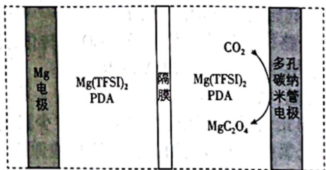  
下列说法错误的是

A. 放电时，电池总反应为 $2\mathrm{CO}_{2} + \mathrm{Mg} = \mathrm{MgC}_{2}\mathrm{O}_{4}$ B. 充电时，多孔碳纳米管电极与电源正极连接  
C. 充电时，电子由 $\mathrm{Mg}$ 电极流向阳极， $\mathrm{Mg}^{2+}$ 向阴极迁移  
D. 放电时，每转移 $1\mathrm{mol}$ 电子，理论上可转化 $1\mathrm{molCO}_{2}$

【答案】C

【解析】

【分析】放电时 $CO_{2}$ 转化为 $MgC_{2}O_{4}$ ，碳元素化合价由 +4 价降低为 +3 价，发生还原反应，所以放电时，多孔碳纳米管电极为正极、Mg 电极为负极，则充电时多孔碳纳米管电极为阳极、Mg 电极为阴极：

<table><tr><td>电极</td><td>过程</td><td>电极反应式</td></tr><tr><td rowspan="2">Mg电极</td><td>放电</td><td> $Mg-2e^{-}=Mg^{2+}$ </td></tr><tr><td>充电</td><td> $Mg^{2+}+2e^{-}=Mg$ </td></tr><tr><td rowspan="2">多孔碳纳米管电极</td><td>放电</td><td> $Mg^{2+}+2CO_{2}+2e^{-}=MgC_{2}O_{4}$ </td></tr><tr><td>充电</td><td> $MgC_{2}O_{4}-2e^{-}=Mg^{2+}+2CO_{2}\uparrow$ </td></tr></table>

【详解】A．根据以上分析，放电时正极反应式为 $Mg^{2+} + 2CO_{2} + 2e^{-} = MgC_{2}O_{4}$ 、负极反应式为 $Mg - 2e^{-} = Mg^{2+}$ ，将放电时正、负电极反应式相加，可得放电时电池总反应： $Mg + 2CO_{2} = MgC_{2}O_{4}$ ，故 A 正确；B．充电时，多孔碳纳米管电极上发生失电子的氧化反应，则多孔碳纳米管在充电时是阳极，与电源正极连接，故 B 正确；
C．充电时，Mg 电极为阴极，电子从电源负极经外电路流向 Mg 电极，同时 $Mg^{2+}$ 向阴极迁移，故 C 错误；
D．根据放电时的电极反应式 $Mg^{2+} + 2CO_{2} + 2e^{-} = MgC_{2}O_{4}$ 可知，每转移 2 mol 电子，有 $2 mol CO_{2}$ 参与反应，因此每转移 1 mol 电子，理论上可转化 $1 mol CO_{2}$ ，故 D 正确；
故答案为：C。

14. 我国科技工作者设计了如图所示的可充电 $\mathrm{Mg - CO_2}$ 电池，以 $\mathrm{Mg(TFSI)_2}$ 为电解质，电解液中加入1，

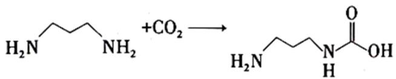

3-丙二胺(PDA)以捕获 $\mathrm{CO}_{2}$ , 使放电时 $\mathrm{CO}_{2}$ 还原产物为 $\mathrm{MgCO}_{2}\mathrm{O}_{4}$ 。该设计克服了 $\mathrm{MgCO}_{3}$ 导电性差和释放 $\mathrm{CO}_{2}$ 能力差的障碍, 同时改善了 $\mathrm{Mg}^{2+}$ 的溶剂化环境, 提高了电池充放电循环性能。

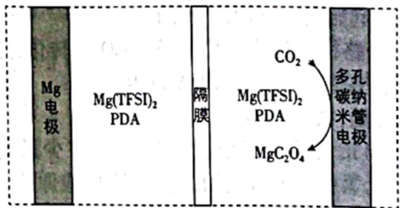

对上述电池放电时 $\mathrm{CO}_{2}$ 的捕获和转化过程开展了进一步研究，电极上 $\mathrm{CO}_{2}$ 转化的三种可能反应路径及相对能量变化如图(\*表示吸附态)。

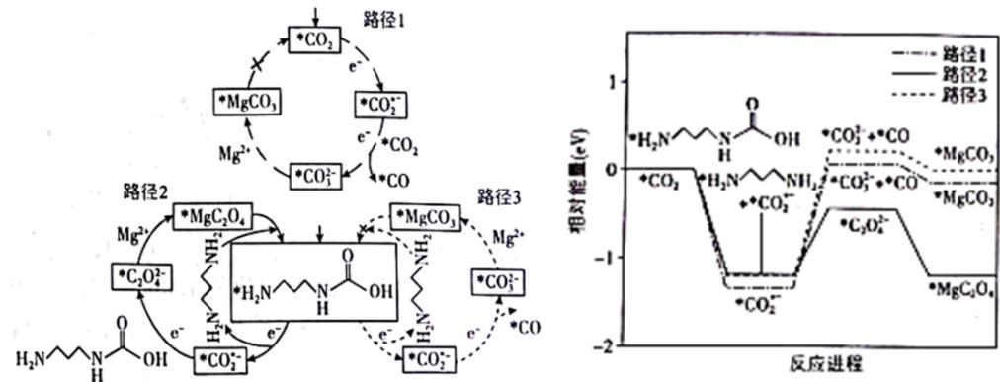

下列说法错误的是

$$
\mathrm{CO} _ {2}
$$

B. 路径 2 是优先路径，速控步骤反应式为 $*CO_{2}^{*-}+$ $H_{2}N-CH_{2}CH_{2}NH-C(=O)-OH+e^{-}\rightarrow$

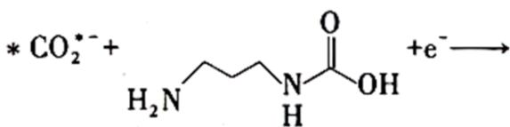

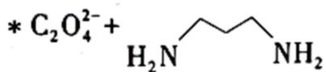

C. 路径 1、3 经历不同的反应步骤但产物相同；路径 2、3 起始物相同但产物不同
D. 三个路径速控步骤均涉及 $*CO_{2}^{*}$ 转化，路径 2、3 的速控步骤均伴有 PDA 再生
【答案】D
【解析】

【详解】A. 根据题给反应路径图可知，PDA(1, 3-丙二胺)捕获 $\mathrm{CO}_{2}$ 的产物为

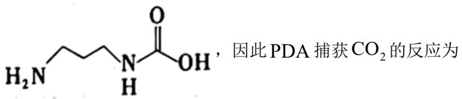

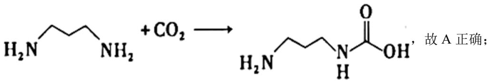

B. 由反应进程一相对能量图可知, 路径 2 的最大能垒最小, 因此与路径 1 和路径 3 相比, 路径 2 是优先路径, 且路径 2 的最大能垒为 $*\mathrm{CO}_{2}^{*-} \rightarrow *\mathrm{C}_{2}\mathrm{O}_{4}^{2-}$ 的步骤, 据反应路径 2 的图示可知, 该步骤有

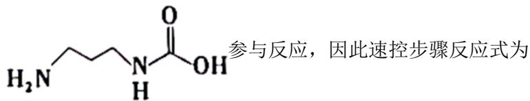

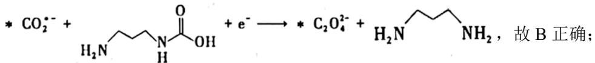

C. 根据反应路径图可知, 路径 1、3 的中间产物不同, 即经历了不同的反应步骤, 但产物均为

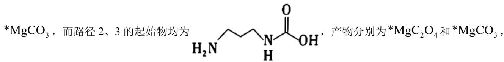

故 C 正确;

D. 根据反应路径与相对能量的图像可知, 三个路径的速控步骤中 $*\mathrm{CO}_{2}^{*-}$ 都参与了反应, 且由 B 项分析可知, 路径 2 的速控步骤伴有 PDA 再生, 但路径 3 的速控步骤为 $*\mathrm{CO}_{2}^{*-}$ 得电子转化为 $*\mathrm{CO}$ 和 $*\mathrm{CO}_{3}^{2-}$ , 没有 PDA 的生成, 故 D 错误;故答案为: D。

## 二、非选择题：共58分。

15. 市售的溴(纯度 $99\%$ )中含有少量的 $\mathrm{Cl}_2$ 和 $\mathrm{I}_2$ ，某化学兴趣小组利用氧化还原反应原理，设计实验制备高纯度的溴。回答下列问题：

(1) 装置如图(夹持装置等略), 将市售的溴滴入盛有浓 $\mathrm{CaBr}_{2}$ 溶液的 B 中, 水浴加热至不再有红棕色液体馏出。仪器 C 的名称为\_\_\_\_; $\mathrm{CaBr}_{2}$ 溶液的作用为\_\_\_\_; D 中发生的主要反应的化学方程式为\_\_\_\_。

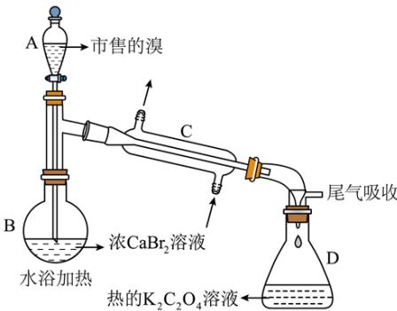

(2) 将 D 中溶液转移至\_\_\_\_(填仪器名称)中, 边加热边向其中滴加酸化的 $\mathrm{KMnO}_{4}$ 溶液至出现红棕色气体, 继续加热将溶液蒸干得固体 R。该过程中生成 $\mathrm{I}_{2}$ 的离子方程式为\_\_\_\_。

(3) 利用图示相同装置, 将 $\mathrm{R}$ 和 $\mathrm{K}_{2} \mathrm{Cr}_{2} \mathrm{O}_{7}$ 固体混合均匀放入 $\mathrm{B}$ 中, $\mathrm{D}$ 中加入冷的蒸馏水。由 $\mathrm{A}$ 向 $\mathrm{B}$ 中滴加适量浓 $\mathrm{H}_{2} \mathrm{SO}_{4}$ , 水浴加热蒸馏。然后将 $\mathrm{D}$ 中的液体分液、干燥、蒸馏, 得到高纯度的溴。 $\mathrm{D}$ 中蒸馏水的作用为\_\_\_\_和\_\_\_\_。

(4) 为保证溴的纯度, 步骤(3)中 $\mathrm{K}_{2} \mathrm{Cr}_{2} \mathrm{O}_{7}$ 固体的用量按理论所需量的 $\frac{3}{4}$ 计算, 若固体 R 质量为 m 克 (以 KBr 计), 则需称取 \_\_\_\_ g $\mathrm{K}_{2} \mathrm{Cr}_{2} \mathrm{O}_{7} \left( \mathrm{M} = 294 \mathrm{~g} \cdot \mathrm{mol}^{-1} \right)$ (用含 m 的代数式表示)。

(5) 本实验所用钾盐试剂均经重结晶的方法纯化。其中趁热过滤的具体操作为漏斗下端管口紧靠烧杯内壁, 转移溶液时用 , 滤液沿烧杯壁流下。

【答案】(1) ①. 直形冷凝管 ②. 除去市售的溴中少量的 $\mathrm{Cl}_{2}$ ③.

$$
\mathrm{Br} _ {2} + \mathrm{K} _ {2} \mathrm{C} _ {2} \mathrm{O} _ {4} \stackrel {\Delta} {=} 2 \mathrm{KBr} + 2 \mathrm{CO} _ {2}
$$

(2) ①. 蒸发皿 ②. $2\mathrm{MnO}_4^-$ +10I $^-$ +16H $^+$ $\stackrel{\Delta}{=} 2\mathrm{Mn}^{2+} + 5\mathrm{I}_2 + 8\mathrm{H}_2\mathrm{O}$ (3) ①. 液封 ②. 降低温度

（5）玻璃棒引流，玻璃棒下端靠在三层滤纸处

【解析】

【分析】市售的溴(纯度 99%)中含有少量的 $Cl_{2}$ 和 $I_{2}$ ，实验利用氧化还原反应原理制备高纯度的溴，市售的溴滴入盛有浓 $CaBr_{2}$ 溶液中， $Cl_{2}$ 可与 $CaBr_{2}$ 发生氧化还原反应而除去， $I_{2}$ 与 $Br_{2}$ 一起蒸馏入草酸钾溶液中，并被草酸钾还原为 $I^{-}$ 、 $Br^{-}$ ，并向溶液中滴加高锰酸钾溶液氧化 $I^{-}$ ，加热蒸干得 KBr 固体，将 KBr 固体和 $K_{2}Cr_{2}O_{7}$ 固体混合均匀加入冷的蒸馏水，同时滴加适量浓 $H_{2}SO_{4}$ ，水浴加热蒸馏，得到的液体分液、干燥、蒸馏，

可得高纯度的溴。

【小问 1 详解】

仪器 C 为直形冷凝管，用于冷凝蒸气；市售的溴中含有少量的 $Cl_{2}$ ， $Cl_{2}$ 可与 $CaBr_{2}$ 发生氧化还原反应而除去；水浴加热时， $Br_{2}$ 、 $I_{2}$ 蒸发进入装置 D 中，分别与 $K_{2}C_{2}O_{4}$ 发生氧化还原反应，

$\mathrm{Br}_{2} + \mathrm{K}_{2}\mathrm{C}_{2}\mathrm{O}_{4}\stackrel {\Delta}{=}2\mathrm{KBr} + 2\mathrm{CO}_{2}\uparrow$ 、 $\mathrm{I}_2 + \mathrm{K}_2\mathrm{C}_2\mathrm{O}_4\stackrel {\Delta}{=}2\mathrm{KI} + 2\mathrm{CO}_2\uparrow$ ，由于 $\mathrm{Br}_2$ 为进入D的主要物质，故主要反应的化学方程式为 $\mathrm{Br}_2 + \mathrm{K}_2\mathrm{C}_2\mathrm{O}_4\stackrel {\Delta}{=}2\mathrm{KBr} + 2\mathrm{CO}_2\uparrow$

【小问 2 详解】

将 D 中溶液转移至蒸发皿中，边加热边向其中滴加酸化的 $KMnO_{4}$ 溶液至出现红棕色气体( $Br_{2}$ )，即说明 $KMnO_{4}$ 已将 KI 全部氧化，发生反应的离子方程式为 $2MnO_{4}^{-} + 10I^{-} + 16H^{+} \stackrel{\Delta}{=} 2Mn^{2+} + 5I_{2} + 8H_{2}O$ ；KBr 几乎未被氧化，继续加热将溶液蒸干所得固体 R 的主要成分为 KBr；

【小问 3 详解】

密度 $\mathrm{Br}_2 > \mathrm{H}_2\mathrm{O}$ ，D中冷的蒸馏水起到液封的作用，同时冷的蒸馏水温度较低，均可减少溴的挥发；

【小问 4 详解】

m 克 KBr 固体的物质的量为 $\frac{m}{119}$ mol，根据转移电子相等可得关系式 $6KBr \sim 6e^{-} \sim K_{2}Cr_{2}O_{7}$ ，则理论上需要 $K_{2}Cr_{2}O_{7}$ 的物质的量为 $\frac{1}{6} \times \frac{m}{119}$ mol，实际所需称取 $K_{2}Cr_{2}O_{7}$ 的质量为

$$
\frac {1}{6} \times \frac {\mathrm{m}}{1 1 9} \mathrm{mol} \times \frac {3}{4} \times 2 9 4 \mathrm{g} \cdot \mathrm{mol} ^ {- 1} \approx 0. 3 1 \mathrm{mg};
$$

【小问 5 详解】

趁热过滤的具体操作：漏斗下端管口紧靠烧杯内壁，转移溶液时用玻璃棒引流，玻璃棒下端靠在三层滤纸处，滤液沿烧杯壁流下。

16. $\mathrm{V}_{2} \mathrm{O}_{5}$ 是制造钒铁合金、金属钒的原料, 也是重要的催化剂。以苛化泥为焙烧添加剂从石煤中提取 $\mathrm{V}_{2} \mathrm{O}_{5}$ 的工艺, 具有钒回收率高、副产物可回收和不产生气体污染物等优点。工艺流程如下。

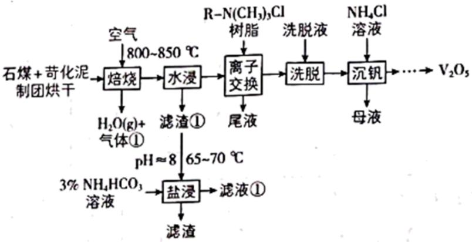

已知：i 石煤是一种含 $V_{2}O_{3}$ 的矿物，杂质为大量 $Al_{2}O_{3}$ 和少量 CaO 等；苛化泥的主要成分为 $CaCO_{3}$ 、NaOH、 $Na_{2}CO_{3}$ 等。

ii高温下，苛化泥的主要成分可与 $\mathrm{Al}_{2} \mathrm{O}_{3}$ 反应生成偏铝酸盐；室温下，偏钒酸钙 $\left[\mathrm{Ca}\left(\mathrm{VO}_{3}\right)_{2}\right]$ 和偏铝酸钙均难溶于水。回答下列问题：

(1) 钒原子的价层电子排布式为\_\_\_\_；焙烧生成的偏钒酸盐中钒的化合价为\_\_\_\_，产生的气体①为\_\_\_\_(填化学式)。

(2) 水浸工序得到滤渣①和滤液, 滤渣①中含钒成分为偏钒酸钙, 滤液中杂质的主要成分为\_\_\_\_(填化学式)。

(3) 在弱碱性环境下, 偏钒酸钙经盐浸生成碳酸钙发生反应的离子方程式为\_\_\_\_; $\mathrm{CO}_{2}$ 加压导入盐浸工序可提高浸出率的原因为\_\_\_\_; 浸取后低浓度的滤液①进入\_\_\_\_(填工序名称), 可实现钒元素的充分利用。

(4) 洗脱工序中洗脱液的主要成分为\_\_\_\_(填化学式)。

(5) 下列不利于沉钒过程的两种操作为\_\_\_\_(填序号)。

a. 延长沉钒时间 b. 将溶液调至碱性 c. 搅拌 d. 降低 $\mathrm{NH}_4\mathrm{Cl}$ 溶液的浓度

【答案】(1) ①. $3\mathrm{d}^3 4\mathrm{s}^2$ ②. $+5$ ③. $\mathrm{CO}_{2}$

(2) $NaAlO_{2}$

(3) ①. $\mathrm{HCO}_3^-$ + $\mathrm{OH}^-$ + $\mathrm{Ca}\left(\mathrm{VO}_3\right)_2\xrightarrow{65\sim 70^{\circ}\mathrm{C}}\mathrm{CaCO}_3 + \mathrm{H}_2\mathrm{O} + 2\mathrm{VO}_3^-$

$$
\mathrm{HCO} _ {3} ^ {-}
$$

促使偏钒酸钙转化为碳酸钙，释放 $VO_{3}^{-}$ ③. 离子交换

(4) NaCl

(5) bd

【解析】

【分析】石煤和苛化泥通入空气进行焙烧，反应生成 $NaVO_{3}$ 、 $Ca\left(VO_{3}\right)_{2}$ 、 $NaAlO_{2}$ 、 $Ca\left(AlO_{2}\right)_{2}$ 、CaO 和 $CO_{2}$ 等，水浸可分离焙烧后的可溶性物质（如 $NaVO_{3}$ ）和不溶性物质 $\left[\mathrm{Ca}\left(\mathrm{VO}_{3}\right)_{2}$ 、 $\mathrm{Ca}\left(\mathrm{AlO}_{2}\right)_{2}\right.$ 等]，过滤后滤液进行离子交换、洗脱，用于富集和提纯 $VO_{3}^{-}$ ，加入氯化铵溶液沉钒，生成 $NH_{4}VO_{3}$ ，经一系列处理后得到 $V_{2}O_{3}$ ；滤渣①在 pH ≈ 8，65～70℃ 的条件下加入 3% $NH_{4}HCO_{3}$ 溶液进行盐浸，滤渣①中含有钒元素，通过盐浸，使滤渣①中的钒元素进入滤液①中，再将滤液①回流到离子交换工序，进行 $VO_{3}^{-}$ 的富集。

【小问 1 详解】

钒是 23 号元素，其价层电子排布式为 $3 \mathrm{~d}^{3} 4 \mathrm{~s}^{2}$ ；焙烧过程中，氧气被还原， $\mathrm{V}_{2} \mathrm{O}_{3}$ 被氧化生成 $\mathrm{VO}_{3}^{-}$ ，偏钒酸盐中钒的化合价为 +5 价； $\mathrm{CaCO}_{3}$ 在 $800^{\circ} \mathrm{C}$ 以上开始分解，生成的气体①为 $\mathrm{CO}_{2}$ 。

【小问 2 详解】

由已知信息可知，高温下，苛化泥的主要成分与 $\mathrm{Al}_{2} \mathrm{O}_{3}$ 反应生成偏铝酸钠和偏铝酸钙，偏铝酸钠溶于水，偏铝酸钙难溶于水，所以滤液中杂质的主要成分是 $\mathrm{NaAlO}_{2}$ 。

【小问 3 详解】

在弱碱性环境下， $\mathrm{Ca}\left(\mathrm{VO}_{3}\right)_{2}$ 与 $\mathrm{HCO}_{3}^{-}$ 和 $\mathrm{OH}^{-}$ 反应生成 $\mathrm{CaCO}_{3}^{-}$ 、 $\mathrm{VO}_{3}^{-}$ 和 $\mathrm{H}_{2}\mathrm{O}$ ，离子方程式为：

$$
\mathrm{HCO} _ {3} ^ {-} + \mathrm{OH} ^ {-} + \mathrm{Ca} \left(\mathrm{VO} _ {3}\right) _ {2} \xlongequal {6 5 \sim 7 0 ^ {\circ} \mathrm{C}} \mathrm{CaCO} _ {3} + \mathrm{H} _ {2} \mathrm{O} + 2 \mathrm{VO} _ {3} ^ {-}
$$

$$
\mathrm{CO} _ {2}
$$

C 可提高溶液中 $HCO_{3}^{-}$ 浓度，促使偏钒酸钙转化为碳酸钙，释放 $VO_{3}^{-}$ ；滤液①中含有 $VO_{3}^{-}$ 、 $NH_{4}^{+}$ 等，且浓度较低，若要利用其中的钒元素，需要通过离子交换进行分离、富集，故滤液①应进入离子交换工序。
【小问 4 详解】

由离子交换工序中树脂的组成可知，洗脱液中应含有 $\mathrm{Cl}^{-}$ ，考虑到水浸所得溶液中含有 $\mathrm{Na}^{+}$ ，为避免引人其他杂质离子，且 $\mathrm{NaCl}$ 廉价易得，故洗脱液的主要成分应为 $\mathrm{NaCl}$ 。

【小问 5 详解】

a. 延长沉钒时间，能使反应更加完全，有利于沉钒，a 不符合题意；

b. $NH_{4}Cl$ 呈弱酸性，如果将溶液调至碱性， $OH^{-}$ 与 $NH_{4}^{+}$ 反应，不利于生成 $NH_{4}VO_{3}$ ，b 符合题意；
c. 搅拌能使反应物更好的接触，提高反应速率，使反应更加充分，有利于沉钒，c 不符合题意；

d. 降低 $NH_{4}Cl$ 溶液的浓度，不利于生成 $NH_{4}VO_{3}$ ，d 符合题意；

故选 bd。

17. 氯气是一种重要的基础化工原料，广泛应用于含氯化工产品的生产。硫酰氯及 1,4-二(氯甲基)苯等可通过氯化反应制备。

（1）硫酰氯常用作氯化剂和氯磺化剂，工业上制备原理如下：

$$
\mathrm{SO} _ {2} (\mathrm{g}) + \mathrm{Cl} _ {2} (\mathrm{g}) \rightleftharpoons \mathrm{SO} _ {2} \mathrm{Cl} _ {2} (\mathrm{g}) \quad \Delta \mathrm{H} = - 6 7. 5 9 \mathrm{kJ} \cdot \mathrm{mol} ^ {- 1}
$$

①若正反应的活化能为 $E_{正}$ kJ·mol $^{-1}$ ，则逆反应的活化能 $E_{逆}=$ \_\_\_\_ kJ·mol $^{-1}$ (用含 $E_{正}$ 正的代数式表示)。

②恒容密闭容器中按不同进料比充入 $\mathrm{SO}_2(\mathbf{g})$ 和其 $\mathrm{Cl}_2(\mathbf{g})$ ，测定 $\mathrm{T}_{1}$ 、 $\mathrm{T}_{2}$ 、 $\mathrm{T}_{3}$ 温度下体系达平衡时的 $\Delta p$ ( $\Delta p = p_{0} - p, p_{0}$ 为体系初始压强， $p_{0} = 240\mathrm{kPa}$ ，P为体系平衡压强)，结果如图。

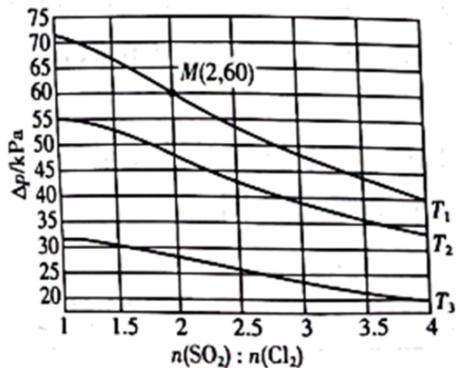

上图中温度由高到低的顺序为\_\_\_\_，判断依据为\_\_\_\_。M 点 $Cl_{2}$ 的转化率为\_\_\_\_， $T_{1}$ 温度下用分压表示的平衡常数 $K_{p}=$ \_\_\_\_ kPa $^{-1}$ 。

③下图曲线中能准确表示 $T_{1}$ 温度下 $\Delta p$ 随进料比变化的是\_\_\_\_(填序号)。

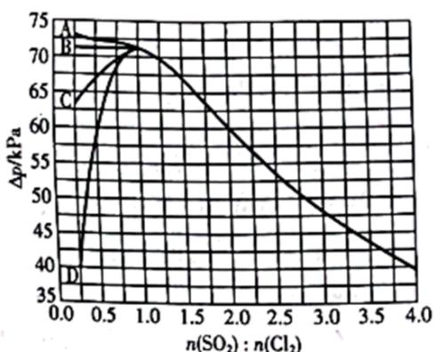

(2) 1, 4-二(氯甲基)苯(D)是有机合成中的重要中间体, 可由对二甲苯(X)的氯化反应合成。对二甲苯浅度氯化时反应过程为

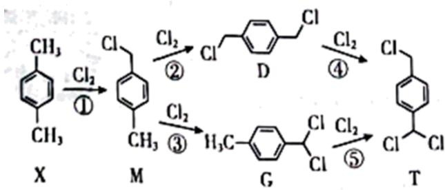

以上各反应的速率方程均可表示为 $v=kc(A)c(B)$ ，其中 $c(A)$ 、 $c(B)$ 分别为各反应中对应反应物的浓度，k 为速率常数 ( $k_{1} \sim k_{5}$ 分别对应反应①\~⑤)。某温度下，反应器中加入一定量的 X，保持体系中氯气浓度恒定(反应体系体积变化忽略不计)，测定不同时刻相关物质的浓度。已知该温度下， $k_{1}:k_{2}:k_{3}:k_{4}:k_{5}=100:21:7:4:23$

① 30min 时， $c(X)=6.80mol\cdot L^{-1}$ ，且 30\~60min 内 $v(X)=0.042mol\cdot L^{-1}\cdot min^{-1}$ ，反应进行到 60min 时， $c(X)=$ \_\_\_\_ mol·L $^{-1}$ 。

②60min 时， $c(D)=0.099mol\cdot L^{-1}$ ，若 0\~60min 产物 T 的含量可忽略不计，则此时 $c(G)=$ \_\_\_\_ mol·L $^{-1}$ ;60min 后，随 T 的含量增加， $\frac{c(D)}{c(G)}$ \_\_\_\_ (填 “增大” “减小” 或 “不变”)。

【答案】(1) ①. $E_{\text {正}} + 67.59$ ②. $T_{3} > T_{2} > T_{1}$ ③. 该反应正反应放热, 且气体分子数减小, 反应正向进行时, 容器内压强减小, 从 $T_{3}$ 到 $T_{1}$ 平衡时 $\Delta p$ 增大, 说明反应正向进行程度逐渐增大, 对应温度逐渐降低 ④. $75 \%$ ⑤. 0.03 ⑥. D (2) ①.5.54 ②.0.033 ③. 增大

【解析】
【小问 1 详解】

①根据反应热 $\Delta H$ 与活化能 $E_{正}$ 和 $E_{逆}$ 关系为 $\Delta H=$ 正反应活化能-逆反应活化能可知，该反应的 $E_{逆}=E_{正}kJ\cdot mol^{-1}-\Delta H=(E_{正}+67.59)kJ\cdot mol^{-1}$ 。

②该反应的正反应为气体体积减小的反应，因此反应正向进行程度越大，平衡时容器内压强越小， $\Delta p$ 即越大。从 $T_{3}$ 到 $T_{1}$ ， $\Delta p$ 增大，说明反应正向进行程度逐渐增大，已知正反应为放热反应，则温度由 $T_{3}$ 到 $T_{1}$ 逐渐降低，即 $T_{3} > T_{2} > T_{1}$ 。由题图甲中 M 点可知，进料比为 $n(SO_{2}): n(Cl_{2}) = 2$ ，平衡时 $\Delta p = 60kPa$ ，已知恒温恒容情况下，容器内气体物质的量之比等于压强之比，可据此列出“三段式”。

$SO_{2}(g) + Cl_{2}(g) \rightleftharpoons SO_{2}Cl_{2}(g) \quad \Delta p$ 起始压强/kPa 160 80

转化压强/kPa 60 60 60 60

平衡压强/kPa 100 20 60

可计算得 $\alpha (\mathrm{Cl}_2) = \frac{60\mathrm{kPa}}{80\mathrm{kPa}}\times 100\% = 75\%$ ， $\mathrm{K_p} = \frac{\mathrm{p(SO_2Cl_2)}}{\mathrm{p(SO_2)}\cdot\mathrm{p(Cl_2)}} = \frac{60\mathrm{kPa}}{100\mathrm{kPa}\times 20\mathrm{kPa}} = 0.03\mathrm{kPa}^{-1}$ 。

③由题图甲中 M 点可知，进料比为 2 时， $\Delta p=60kPa$ ，结合“三段式”，以及 $T_{1}$ 时化学平衡常数可知，进料比为 0.5 时， $\Delta p$ 也为 60kPa，曲线 D 上存在（0.5，60）。本题也可以快解：根据“等效平衡”原理，该反应中 $SO_{2}$ 和 $Cl_{2}$ 的化学计量数之比为 1:1，则 $SO_{2}$ 和 $Cl_{2}$ 的进料比互为倒数（如 2 与 0.5）时， $\Delta p$ 相等。
【小问 2 详解】

①根据化学反应速率的计算公式时， $v(X)=\frac{\Delta c(X)}{\Delta t}$ ，60min时，

$$
\mathrm{c} (\mathrm{X}) = 6. 8 0 \mathrm{mol} \cdot \mathrm{L} ^ {- 1} - \mathrm{v} (\mathrm{X}) \cdot \Delta \mathrm{t} = 6. 8 0 \mathrm{mol} \cdot \mathrm{L} ^ {- 1} - 0. 0 4 2 \mathrm{mol} \cdot \mathrm{L} ^ {- 1} \cdot \min ^ {- 1} \times 3 0 \min = 5. 5 4 \mathrm{mol} \cdot \mathrm{L} ^ {- 1}
$$

②已知 $\frac{\mathrm{v(D)}}{\mathrm{v(G)}} = \frac{\frac{\Delta\mathrm{c(D)}}{\mathrm{t}}}{\frac{\Delta\mathrm{c(G)}}{\mathrm{t}}} = \frac{\Delta\mathrm{c(D)}}{\Delta\mathrm{c(G)}}$ ，又由题给反应速率方程推知， $\frac{\mathrm{v(D)}}{\mathrm{v(G)}} = \frac{\mathrm{k}_2 \cdot \mathrm{c(M)}}{\mathrm{k}_3 \cdot \mathrm{c(M)}} = \frac{\mathrm{k}_2}{\mathrm{k}_3} = 3$ ，则 $\Delta\mathrm{c(G)} = \frac{1}{3} \times \Delta\mathrm{c(D)} = 0.033\mathrm{mol} \cdot \mathrm{L}^{-1}$ ，即 $60\mathrm{min}$ 后 $\mathrm{c(G)} = 0.033\mathrm{mol} \cdot \mathrm{L}^{-1}$ 。 $60\mathrm{min}$ 后，D 和 G 转化为 T 的速率比为 $\frac{\mathrm{k}_4 \cdot \mathrm{c(D)}}{\mathrm{k}_5 \cdot \mathrm{c(G)}} = \frac{4 \cdot 0.099}{23 \cdot 0.033}$ ，G 消耗得更快，则 $\frac{\mathrm{c(D)}}{\mathrm{c(G)}}$ 增大。

18. 甲磺司特(M)是一种在临床上治疗支气管哮喘、特应性皮炎和过敏性鼻炎等疾病的药物。M的一种合成路线如下(部分试剂和条件省略)。

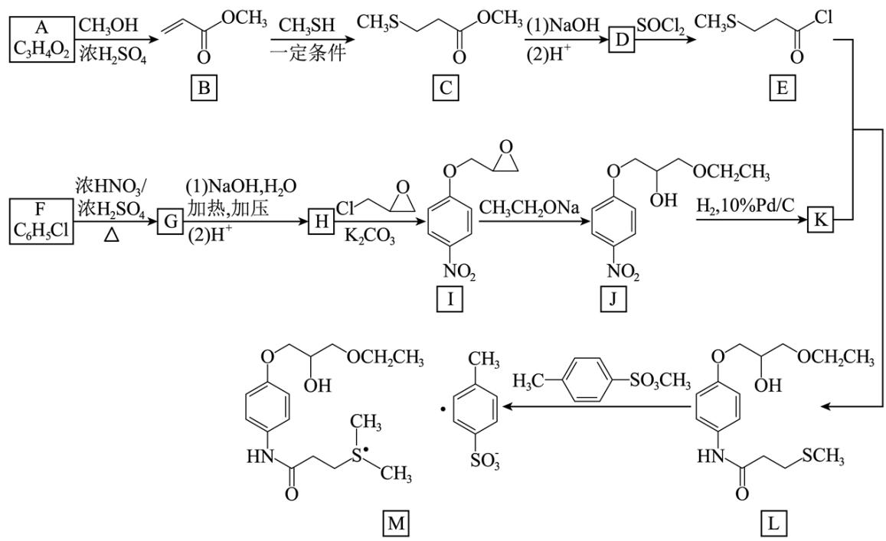

回答下列问题:

(1) A 的化学名称为\_\_\_\_。

(2) B→C 的反应类型为 \_\_\_\_。

(3) D 的结构简式为\_\_\_\_。

(4) 由 F 生成 G 的化学方程式为\_\_\_\_。

(5) G 和 H 相比, H 的熔、沸点更高, 原因为\_\_\_\_。

(6) K 与 E 反应生成 L，新构筑官能团的名称为 \_\_\_\_。

(7) 同时满足下列条件的 I 的同分异构体共有 \_\_\_\_ 种。

(a)核磁共振氢谱显示为4组峰，且峰面积比为3:2:2:2；

(b)红外光谱中存在 $\mathbf{C} = \mathbf{O}$ 和硝基苯基（ $-\bigcirc -\bigcirc -\mathrm{NO}_2$ ）吸收峰。

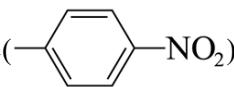

其中，可以通过水解反应得到化合物 H 的同分异构体的结构简式为 \_\_\_\_。

【答案】（1）丙烯酸 （2）加成反应

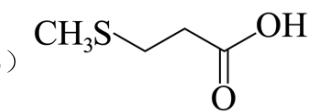

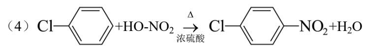

(5) H 分子中存在羟基, 能形成分子间氢键

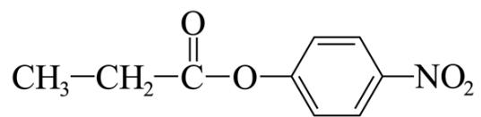

【解析】

【分析】由流程图可知，A与甲醇发生酯化反应生成B，则A的结构简式为 $\ce{CH3CHOOH}$ ；B与 $\mathrm{CH_3SH}$

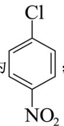

发生加成反应生成 C；C 在碱性条件下发生酯的水解反应，酸化后生成 D，则 D 的结构简式为

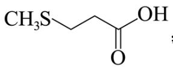

$\text{CH}_3\text{S} \text{—CH}_2\text{CH(OH)—C(=O)—OH}$ ; D 与 $\text{SOCl}_2$ 发生取代反应生成 E; 由 F 的分子式可知, F 的结构简式为 $\ce{C6H5Cl}$ ; F

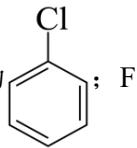

发生硝化反应生成 G，G 的结构简式为 $\left\{\begin{array}{c} Cl \\ | \\ Cl \\ | \\ NO_{2} \end{array}\right.$ ；G 在一定条件下发生水解反应生成 H，H 的结构简式为

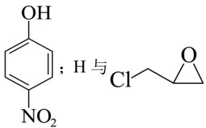

$\ce{C6H5OH}$ ; H 与 $ClCH2O$ 发生取代反应生成 I; I 与乙醇钠发生反应生成 J; J 发生硝基的还原生成 K, K

的结构简式为：K与E发生取代反应生成L；L与 $H_{3}C-$ $SO_{3}CH_{3}$ 反

应生成 M。

【小问 1 详解】

由 $\mathrm{A} \rightarrow \mathrm{B}$ 的反应条件和 $\mathrm{B}$ 的结构简式可知该步骤为酯化反应，因此 $\mathrm{A}$ 为 $\mathrm{C(OH)}$ ，其名称为丙烯酸。

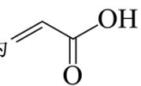

【小问 2 详解】

B 与 $CH_{3}SH$ 发生加成反应，- H 和 $-SCH_{3}$ 分别加到双键碳原子上生成 C。

【小问 3 详解】

结合 C 和 E 的结构简式以及 C→D 和 D→E 的反应条件，可知 C→D 为 C 先在碱性条件下发生水解反应后酸化，D 为 $\ce{CH3S-CH2-COOH}$ ，D 与亚硫酰氯发生取代反应生成 E。

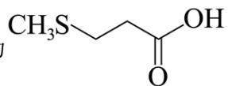

【小问4详解】

$\mathrm{F} \rightarrow \mathrm{G}$ 的反应中，结合I的结构可知，苯环上碳氯键的对位引入硝基，浓硫酸作催化剂和吸水剂，吸收反应

产物中的水，硝化反应的条件为加热，反应的化学方程式是： $\mathrm{Cl}-\left\langle\right\rangle+\mathrm{HO}-\mathrm{NO}_{2}\xrightarrow[\text{浓硫酸}]{\Delta}$

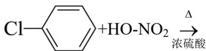

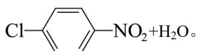

【小问 5 详解】

G 分子不能形成分子间氢键，分子间氢键会使物质的熔、沸点显著升高。

【小问6详解】

根据分析可知，K 与 E 反应生成 L 为取代反应，反应中新构筑的官能团为酰胺基。

【小问 7 详解】

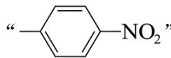

I 的分子式为 $C_{9}H_{9}NO_{4}$ ，其不饱和度为 6，其中苯环占 4 个不饱和度，C=O 和硝基各占 1 个不饱和度，因此满足条件的同分异构体中除了苯环、C=O 和硝基之外没有其他不饱和结构。由题给信息，结构中存在 “ $—\bigcirc—NO_{2}$ ”，根据核磁共振氢谱中峰面积之比为 3:2:2:2 可知，结构中不存在羟基、存在甲基，结构高度对称，硝基苯基和 C=O 共占用 3 个 O 原子，还剩余 1 个 O 原子，因此剩余的 O 原子只能插入两个相邻的 C 原子之间。不考虑该 O 原子，碳骨架的异构有 2 种，且每种都有 3 个位置可以插入该 O

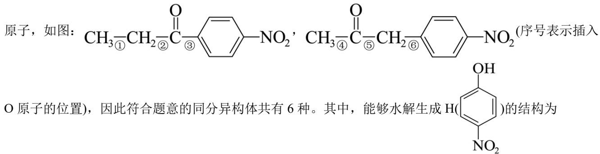

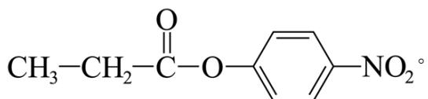

【点睛】第(7)问在确定同分异构体数量时也可以采用排列法，首先确定分子整体没有支链，且甲基和硝基苯基位于分子链的两端，之后可以确定中间的基团有亚甲基、C=O 和氧原子，三者共有 $A_{3}^{3}=6$ 种排列方式，则符合条件的同分异构体共有 6 种。