# 2024 年 6 月浙江省普通高校招生选考科目考试

# 化学

本试题卷分选择题和非选择题两部分，共8页，满分100分，考试时间90分钟。

## 考生注意:

1. 答题前，请务必将自己的姓名、准考证号用黑色字迹的签字笔或钢笔分别填写在试题卷和答题纸规定的位置上。

2. 答题时，请按照答题纸上“注意事项”的要求，在答题纸相应的位置上规范作答，在本试题卷上的作答一律无效。

3. 非选择题的答案必须使用黑色字迹的签字笔或钢笔写在答题纸上相应区域内，作图时可先使用 2B 铅笔，确定后必须使用黑色字迹的签字笔或钢笔描黑。

4. 可能用到的相对原子质量: H 1B 11 C 12 N 14 O 16 Na 23 Mg 24 Al 27 Si 28 P 31 S 32 Cl 35.5 K 39 Ca 40 Fe 56 Cu 64 Br 80 Ag 108 I 127 Ba 137

## 选择题部分

## 一、选择题(本大题共16小题，每小题3分，共48分。每小题列出的四个备选项中只有一个是符合题目要求的，不选、多选、错选均不得分)

1. 按物质组成分类， $KAI(SO_{4})_{2} \cdot 12H_{2}O$ 属于
A. 酸    B. 碱    C. 盐    D. 混合物

【答案】C 【解析】

【详解】 $\mathrm{KAl(SO_4)_2\cdot 12H_2O}$ 是结晶水合物，属于纯净物；是由金属阳离子 $\mathrm{K}^+$ 、 $\mathrm{Al}^{3+}$ 和酸根阴离子 $\mathrm{SO}_4^{2-}$ 组成的复盐；答案选 C。

2. 下列说法不正确的是
A. $\mathrm{Al(OH)}_{3}$ 呈两性, 不能用于治疗胃酸过多
B. $\mathrm{Na}_{2} \mathrm{O}_{2}$ 能与 $\mathrm{CO}_{2}$ 反应产生 $\mathrm{O}_{2}$ , 可作供氧剂
C. FeO有还原性, 能被氧化成 $\mathrm{Fe}_{3} \mathrm{O}_{4}$ D. $\mathrm{HNO}_{3}$ 见光易分解, 应保存在棕色试剂瓶中

【答案】A 【解析】

【详解】A. $\mathrm{Al(OH)}_{3}$ 呈两性, 不溶于水, 但可以与胃酸反应生成无毒物质, 因此其能用于治疗胃酸过多, A 不正确;  
B. $\mathrm{Na}_{2} \mathrm{O}_{2}$ 能与 $\mathrm{CO}_{2}$ 反应产生 $\mathrm{O}_{2}$ , 该反应能安全发生且不生成有毒气体, 故 $\mathrm{Na}_{2} \mathrm{O}_{2}$ 可作供氧剂, B 正确;  
C. FeO有还原性, 其中 Fe 元素的化合价为 +2, 用适当的氧化剂可以将其氧化成更高价态的 $\mathrm{Fe}_{3} \mathrm{O}_{4}, \mathrm{C}$ 正确;  
D. 见光易分解的物质应保存在棕色试剂瓶中; $\mathrm{HNO}_{3}$ 见光易分解, 故其应保存在棕色试剂瓶中, D 正确;  
综上所述, 本题选 A。

3. 下列表示不正确的是
A. $CO_{2}$ 的电子式：:O:C:O:
B. $Cl_{2}$ 中共价键的电子云图：
C. $NH_{3}$ 的空间填充模型：D. 3, 3-二甲基戊烷的键线式：×

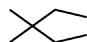

【详解】A. $CO_{2}$ 的电子式： $\ddot{O}\cdots C\cdots\ddot{O}$ ，故 A 错误；

B. $\mathrm{Cl}_{2}$ 中的共价键是由 2 个氯原子各提供 1 个未成对电子的 $3 \mathrm{~p}$ 原子轨道重叠形成的, 共价键电子云图为: $\bullet$ , 故 B 正确;

C. $NH_{3}$ 的中心原子 N 形成 3 个 $\sigma$ 键和 1 个孤电子对，为 $sp^{3}$ 杂化， $NH_{3}$ 为三角锥形，空间填充模型：

故 C 正确;

D. 3, 3-二甲基戊烷的主链上有 5 个 C, 3 号碳上连接有 2 个甲基, 键线式为: ✗, 故 D 正确; 故选 A。

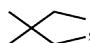

4. 下列说法不正确的是

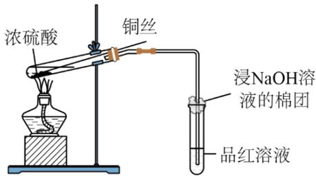  
①

  
②

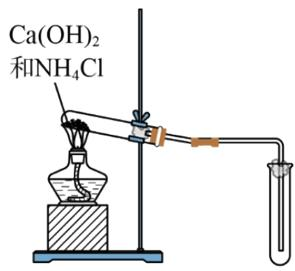  
③

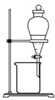  
④

A. 装置①可用于铜与浓硫酸反应并检验气态产物 
B. 图②标识表示易燃类物质 
C. 装置③可用于制取并收集氨气 
D. 装置④可用于从碘水中萃取碘

【详解】A. 铜与浓硫酸反应方程式为: $\mathrm{Cu} + 2\mathrm{H}_{2}\mathrm{SO}_{4}$ (浓) $\stackrel{\Delta}{=} \mathrm{CuSO}_{4} + 2\mathrm{H}_{2}\mathrm{O} + \mathrm{SO}_{2} \uparrow$ , 可用装置①制取, 气态产物为 $\mathrm{SO}_{2}$ , 可利用 $\mathrm{SO}_{2}$ 的漂白性进行检验, 故 A 正确;  
B. 图②标识表示易燃类物质, 故 B 正确;  
C. $\mathrm{NH}_{3}$ 的密度比空气小, 应用向下排空气法进行收集, 故 C 错误;  
D. 萃取是利用物质在不同溶剂中溶解性的差异进行分离混合物, 装置④可用于从碘水中萃取碘, 故 D 正确;  
故选 C。

5. 化学与人类社会可持续发展息息相关。下列说法不正确的是
A. 部分金属可在高温下用焦炭、一氧化碳、氢气等还原金属矿物得到
B. 煤的气化是通过物理变化将煤转化为可燃性气体的过程
C. 制作水果罐头时加入抗氧化剂维生素 C，可延长保质期
D. 加入混凝剂聚合氯化铝，可使污水中细小悬浮物聚集成大颗粒

【解析】

【详解】A．根据金属活泼性的不同，可以采用不同的方法冶炼金属，大部分金属（主要是中等活泼的金属）的冶炼是通过高温下发生氧化还原反应来完成的，即热还原法，常用的还原剂有焦炭、CO、 $\mathrm{H}_{2}$ 等，A项正确；B．煤的气化是将煤转化为可燃性气体的过程，主要发生的反应为 $\mathrm{C} + \mathrm{H}_{2}\mathrm{O(g)} \xlongequal{\text{高温}} \mathrm{CO} + \mathrm{H}_{2}$ ，该过程属于化学变化，B项错误；

C. 维生素 C（即抗坏血酸）具有还原性，能被氧化成脱氢抗坏血酸，故制作水果罐头时加入维生素 C 作抗氧化剂，可延长保质期，C 项正确；
D. 混凝剂聚合氯化铝在污水中能水解成 $\mathrm{Al(OH)}_{3}$ 胶体， $\mathrm{Al(OH)}_{3}$ 胶体能吸附污水中细小悬浮物，使其聚集成较大颗粒而沉降下来，D 项正确；
答案选 B。

6. 利用 $CH_{3}OH$ 可将废水中的 $NO_{3}^{-}$ 转化为对环境无害的物质后排放。反应原理为： $H^{+} + CH_{3}OH + NO_{3}^{-} \rightarrow X + CO_{2} + H_{2}O$ (未配平)。下列说法正确的是
A. X 表示 $NO_{2}$ B. 可用 $O_{3}$ 替换 $CH_{3}OH$ C. 氧化剂与还原剂物质的量之比为 6:5
D. 若生成标准状况下的 $CO_{2}$ 气体 11.2L，则反应转移的电子数为 $2N_{A}(N_{A}$ 表示阿伏加德罗常数的值)

【详解】A. 由题中信息可知, 利用 $\mathrm{CH}_{3} \mathrm{OH}$ 可将废水中的 $\mathrm{NO}_{3}^{-}$ 转化为对环境无害的物质 X 后排放, 则 X 表示 $\mathrm{N}_{2}, \mathrm{NO}_{2}$ 仍然是大气污染物, A 不正确;  
B. $\mathrm{CH}_{3} \mathrm{OH}$ 中 C 元素的化合价由 -2 价升高到 +4 价, $\mathrm{CH}_{3} \mathrm{OH}$ 是该反应的还原剂, $\mathrm{O}_{3}$ 有强氧化性, 通常不能用作还原剂, 故不可用 $\mathrm{O}_{3}$ 替换 $\mathrm{CH}_{3} \mathrm{OH}$ , B 不正确;  
C. 该反应中, 还原剂 $\mathrm{CH}_{3} \mathrm{OH}$ 中 C 元素的化合价由 -2 价升高到 +4 价, 升高了 6 个价位, 氧化剂 $\mathrm{NO}_{3}^{-}$ 中 N 元素的化合价由 +5 价降低到 0 价, 降低了 5 个价位, 由电子转移守恒可知, 氧化剂与还原剂的物质的量之比为 6:5, C 正确;  
D. $\mathrm{CH}_{3} \mathrm{OH}$ 中 C 元素的化合价由 -2 价升高到 +4 价, 升高了 6 个价位, 若生成标准状况下的 $\mathrm{CO}_{2}$ 气体 11.2L, 即生成 $0.5 \mathrm{~mol} \mathrm{CO}_{2}$ , 反应转移的电子数为 $0.5 \times 6 = 3 \mathrm{~N}_{\mathrm{A}}$ , D 不正确;  
综上所述, 本题选 C。

7. 物质微观结构决定宏观性质，进而影响用途。下列结构或性质不能解释其用途的是

<table><tr><td>选项</td><td>结构或性质</td><td>用途</td></tr><tr><td>A</td><td>石墨呈层状结构,层间以范德华力结合</td><td>石墨可用作润滑剂</td></tr><tr><td>B</td><td> $SO_{2}$ 具有氧化性</td><td> $SO_{2}$ 可用作漂白剂</td></tr><tr><td>C</td><td>聚丙烯酸钠( $\begin{array}{c}\text{[CH}_2\text{—CH]}_n\\|\\\text{COONa}\end{array}$ )中含有亲水基团</td><td>聚丙烯酸钠可用于制备高吸水性树脂</td></tr><tr><td>D</td><td>冠醚18-冠-6空腔直径(260~320pm)与 $K^+$ 直径(276pm)接近</td><td>冠醚18-冠-6可识别 $K^+$ ,能增大 $KMnO_4$ 在有机溶剂中的溶解度</td></tr></table>

A.A B.B C.C D.D

【答案】B

【解析】

【详解】A. 石墨呈层状结构, 层间以范德华力结合, 该作用力较小, 层与层容易滑动, 石墨可用作润滑剂, A 正确;  
B. $\mathrm{SO}_2$ 具有漂白性, 可用作漂白剂, B 错误;  
C. 聚丙烯酸钠 $\left[\begin{array}{c}\mathrm{CH}_2-\mathrm{CH}\end{array}\right]_{\mathrm{n}}$ 中含有亲水基团- $\mathrm{COO}^-$ , 聚丙烯酸钠可用于制备高吸水性树脂, C 正确;  
D. 冠醚 18-冠-6 空腔直径(260\~320pm)与 $\mathrm{K}^+$ 直径(276pm)接近, 可识别 $\mathrm{K}^+$ , 使 $\mathrm{K}^+$ 存在于其空腔中, 进而能增大 $\mathrm{KMnO}_4$ 在有机溶剂中的溶解度, D 正确;  
故选 B。

8. 下列离子方程式正确的是
A. 用 $\mathrm{CuSO_4}$ 溶液除 $\mathrm{H}_2\mathrm{S}$ 气体: $\mathrm{Cu}^{2+} + \mathrm{S}^{2-} = \mathrm{CuS} \downarrow$ B. $\mathrm{H}_2\mathrm{SO}_3$ 溶液中滴加 $\mathrm{Ba(NO_3)_2}$ 溶液: $\mathrm{H}_2\mathrm{SO}_3 + \mathrm{Ba}^{2+} = \mathrm{BaSO}_3 \downarrow + 2\mathrm{H}^+$ C. $\mathrm{NaHCO}_3$ 溶液中通入少量 $\mathrm{Cl}_2$ : $2\mathrm{HCO}_3^- + \mathrm{Cl}_2 = 2\mathrm{CO}_2 + \mathrm{Cl}^- + \mathrm{ClO}^- + \mathrm{H}_2\mathrm{O}$ D. 用 $\mathrm{FeCl}_3$ 溶液刻蚀覆铜板制作印刷电路板: $2\mathrm{Fe}^{3+} + \mathrm{Cu} = 2\mathrm{Fe}^{2+} + \mathrm{Cu}^{2+}$

【答案】D

【解析】

【详解】A. $\mathrm{H}_{2} \mathrm{~S}$ 在离子方程式中应以化学式保留, 正确的离子方程式为 $\mathrm{Cu}^{2+} + \mathrm{H}_{2} \mathrm{~S} = \mathrm{CuS} \downarrow + 2 \mathrm{H}^{+}$ , A 项错

误；

B. 酸性条件下 $NO_{3}^{-}$ 会将 $H_{2}SO_{3}$ 氧化成 $H_{2}SO_{4}$ ， $Ba^{2+}$ 与 $SO_{4}^{2-}$ 形成 $BaSO_{4}$ 沉淀，滴加少量 $\mathrm{Ba(NO_{3})_{2}}$ 时的离子方程式为 $Ba^{2+} + 2NO_{3}^{-} + 3H_{2}SO_{3} = BaSO_{4}\downarrow + 2NO\uparrow + 2SO_{4}^{2-} + 4H^{+} + H_{2}O$ ，滴加足量 $\mathrm{Ba(NO_{3})_{2}}$ 时的离子方程式为 $3Ba^{2+} + 2NO_{3}^{-} + 3H_{2}SO_{3} = 3BaSO_{4}\downarrow + 2NO\uparrow + 4H^{+} + H_{2}O$ ，B项错误；
C. 电离平衡常数： $K_{a1}(H_{2}CO_{3}) > K_{a}(HClO) > K_{a2}(H_{2}CO_{3})$ ， $Cl_{2}$ 与水反应生成的HClO与 $NaHCO_{3}$ 不反应，正确的离子方程式为 $Cl_{2} + HCO_{3}^{-} = Cl^{-} + HClO + CO_{2}$ ，C项错误；
D. Cu与 $FeCl_{3}$ 溶液反应生成 $CuCl_{2}$ 、 $FeCl_{2}$ ，反应的离子方程式为 $Cu+2Fe^{3+}=Cu^{2+}+2Fe^{2+}$ ，D项正确；答案选D。

9. 有机物 A 经元素分析仪测得只含碳、氢、氧 3 种元素，红外光谱显示 A 分子中没有醚键，质谱和核磁共振氢谱示意图如下。下列关于 A 的说法正确的是

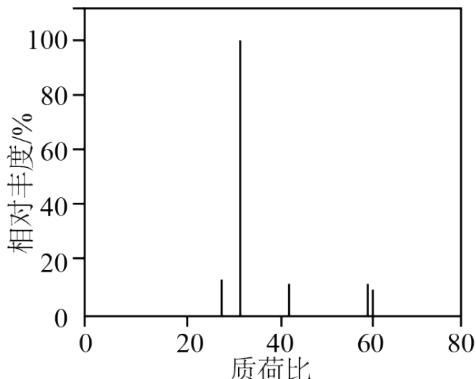  
图1 质谱

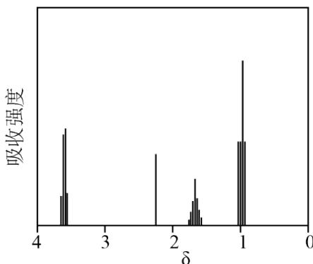  
图2 核磁共振氢谱

A. 能发生水解反应 B. 能与 $\mathrm{NaHCO_3}$ 溶液反应生成 $\mathrm{CO}_{2}$ C. 能与 $\mathrm{O}_2$ 反应生成丙酮 D. 能与 $\mathrm{Na}$ 反应生成 $\mathrm{H}_{2}$

【解析】

【分析】由质谱图可知，有机物 A 相对分子质量为 60，A 只含 C、H、O 三种元素，因此 A 的分子式为 $C_{3}H_{8}O$ 或 $C_{2}H_{4}O_{2}$ ，由核磁共振氢谱可知，A 有 4 种等效氢，个数比等于峰面积之比为 3:2:2:1，因此 A 为 $CH_{3}CH_{2}CH_{2}OH$ 。
【详解】A. A 为 $CH_{3}CH_{2}CH_{2}OH$ ，不能发生水解反应，故 A 错误；
B. A 中官能团为羟基，不能与 $NaHCO_{3}$ 溶液反应生成 $CO_{2}$ ，故 B 错误；
C. $CH_{3}CH_{2}CH_{2}OH$ 的羟基位于末端 C 上，与 $O_{2}$ 反应生成丙醛，无法生成丙酮，故 C 错误；
D. $CH_{3}CH_{2}CH_{2}OH$ 中含有羟基，能与 Na 反应生成 $H_{2}$ ，故 D 正确；

故选 D。

10. X、Y、Z、M 四种主族元素，原子序数依次增大，分别位于三个不同短周期，Y 与 M 同主族，Y 与 Z 核电荷数相差 2，Z 的原子最外层电子数是内层电子数的 3 倍。下列说法不正确的是
A. 键角： $YX_{3}^{+}>YX_{3}^{-}$ B. 分子的极性： $Y_{2}X_{2}>X_{2}Z_{2}$ C. 共价晶体熔点：Y > M
D. 热稳定性： $YX_{4}>MX_{4}$

【答案】B

【解析】

【分析】X、Y、Z、M四种主族元素，原子序数依次增大，分别位于三个不同短周期，Y与M同主族，Y与Z核电荷数相差2，Z的原子最外层电子数是内层电子数的3倍，则Z为O元素，Y为C元素，X为H元素，M为Si元素。

【详解】A. $YX_{3}^{+}$ 为 $CH_{3}^{+}$ ，其中 C 原子的杂化类型为 $sp^{2}$ ， $CH_{3}^{+}$ 的空间构型为平面正三角形，键角为 $120^{\circ}$ ； $YX_{3}^{-}$ 为 $CH_{3}^{-}$ ，其中 C 原子的杂化类型为 $sp^{3}$ ， $CH_{3}^{-}$ 的空间构型为三角锥形，由于 C 原子还有 1 个孤电子对，故键角小于 $109^{\circ}28'$ ，因此，键角的大小关系为 $YX_{3}^{+}>YX_{3}^{-}$ ，A 正确；

B. $Y_{2}X_{2}$ 为 $C_{2}H_{2}$ ，其为直线形分子，分子结构对称，分子中正负电荷的重心是重合的，故其为百极性分子； $H_{2}O_{2}$ 分子结构不对称，分子中正负电荷的重心是不重合的，故其为极性分子，因此，两者极性的大小关系为 $Y_{2}X_{2}<X_{2}Z_{2}$ ，B 不正确；

C. 金则石和晶体硅均为共价晶体, 但是由于 C 的原子半径小于 Si, 因此, C—C 键的键能大于 Si—Si 键的, 故共价晶体熔点较高的是金刚石, C 正确;  
D. 元素的非金属性越强, 其气态氢化物的热稳定性越强; C 的非金属性强于 Si, 因此, 甲烷的稳定热稳定性较高, D 正确;  
综上所述, 本题选 B。

11. 二氧化碳氧化乙烷制备乙烯，主要发生如下两个反应：
Ⅰ. $C_{2}H_{6}(g)+CO_{2}(g)\rightleftharpoons C_{2}H_{4}(g)+CO(g)+H_{2}O(g)\quad\Delta H_{1}>0$ Ⅱ. $C_{2}H_{6}(g)+2CO_{2}(g)\rightleftharpoons 4CO(g)+3H_{2}(g)\quad\Delta H_{2}>0$

向容积为10L的密闭容器中投入 $2\,mol\ C_{2}H_{6}$ 和 $3\,mol\ CO_{2}$ ，不同温度下，测得5min时(反应均未平衡)的相关数据见下表，下列说法不正确的是

<table><tr><td>温度(°C)</td><td>400</td><td>500</td><td>600</td></tr><tr><td>乙烷转化率(%)</td><td>2.2</td><td>9.0</td><td>17.8</td></tr><tr><td>乙烯选择性(%)</td><td>92.6</td><td>80.0</td><td>61.8</td></tr></table>

注：乙烯选择性= $\frac{转化为乙烯的乙烷的物质的量}{转化的乙烷的总物质的量}\times100\%$ A. 反应活化能：I<II
B. 500℃时，0～5min 反应 I 的平均速率为： $v(C_{2}H_{4})=2.88\times10^{-3}mol\cdot L^{-1}\cdot min^{-1}$ C. 其他条件不变，平衡后及时移除 $H_{2}O(g)$ ，可提高乙烯的产率
D. 其他条件不变，增大投料比 $\left[n\left(C_{2}H_{6}\right)/n\left(CO_{2}\right)\right]$ 投料，平衡后可提高乙烷转化率

【答案】D

【解析】

【详解】A．由表可知，相同温度下，乙烷在发生转化时，反应I更易发生，则反应活化能：I<II，A正确；B．由表可知，500℃时，乙烷的转化率为9.0%，可得转化的乙烷的总物质的量为2mol×9.0%=0.18mol，而此温度下乙烯的选择性为80%，则转化为乙烯的乙烷的物质的量为0.18mol×80%=0.144mol，根据方程式可得，生成乙烯的物质的量为0.144mol，则0\~5min反应I的平均速率为： $v(C_{2}H_{4})=\frac{\frac{0.144mol}{10L}}{5min}=2.88\times10^{-3}mol\cdot L^{-1}\cdot min^{-1}$ ，B正确；
C．其他条件不变，平衡后及时移除 $H_{2}O(g)$ ，反应I正向进行，可提高乙烯的产率，C正确；
D．其他条件不变，增大投料比 $\left[n\left(C_{2}H_{6}\right)/n\left(CO_{2}\right)\right]$ 投料，平衡后 $CO_{2}$ 转化率提高， $C_{2}H_{6}$ 转化率降低，D错误；
答案选 D。

12. 丙烯可发生如下转化(反应条件略):

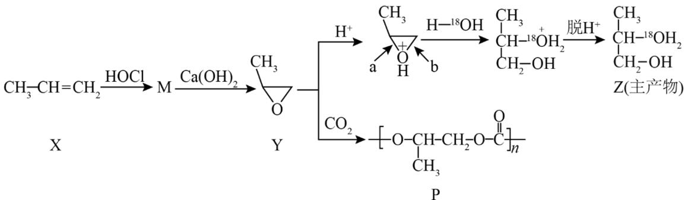

下列说法不正确的是

A. 产物 M 有 2 种且互为同分异构体(不考虑立体异构)
B. $H^{+}$ 可提高 $Y \rightarrow Z$ 转化的反应速率
C. $Y \rightarrow Z$ 过程中，a 处碳氧键比 b 处更易断裂
D. $Y \rightarrow P$ 是缩聚反应，该工艺有利于减轻温室效应

【答案】D

【解析】

【分析】丙烯与 HOCl 发生加成反应得到 M，M 有 CH₃-CHCl-CH₂OH 和 CH₃-CHOH-CH₂Cl 两种可能的结构，在 Ca(OH)₂ 环境下脱去 HCl 生成物质 Y( )，Y 在 H⁺环境水解引入羟基再脱 H⁺得到主产物 Z；Y 与 CO₂ 可发生反应得到物质 P( )。

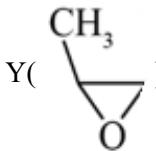

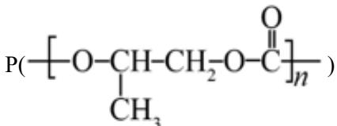

【详解】A. 据分析，产物 M 有 2 种且互为同分异构体(不考虑立体异构)，A 正确；

B. 据分析, $\mathrm{H}^{+}$ 促进 $\mathrm{Y}$ 中醚键的水解, 后又脱离, 使 $\mathrm{Z}$ 成为主产物, 故其可提高 $\mathrm{Y} \rightarrow \mathrm{Z}$ 转化的反应速率, B 正确;

C. 从题干 $\mathrm{CH}_3$ $\mathrm{H} - ^{18}\mathrm{OH}$ $\mathrm{CH}_3$ $\mathrm{CH}-^{18}\mathrm{OH}_2$ 部分可看出，是a处碳氧键断裂，故a处碳氧键比b处更易断裂，C正

确；  
D. $\mathrm{Y}\rightarrow \mathrm{P}$ 是 $\mathrm{CO}_{2}$ 与Y发生加聚反应，没有小分子生成，不是缩聚反应，该工艺有利于消耗 $\mathrm{CO}_{2}$ ，减轻温室效应，D错误；  
故选D。

13. 金属腐蚀会对设备产生严重危害，腐蚀快慢与材料种类、所处环境有关。下图为两种对海水中钢闸门的防腐措施示意图：

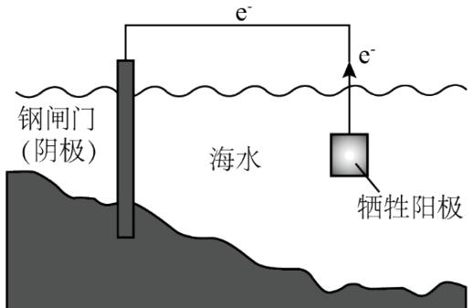  
图1

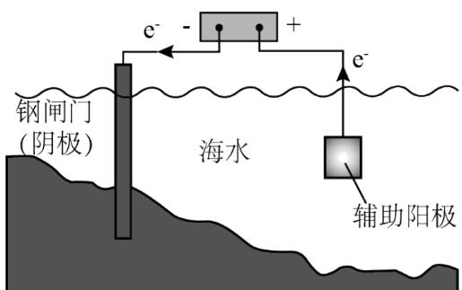  
图2

下列说法正确的是

A. 图 1、图 2 中，阳极材料本身均失去电子  
B. 图 2 中，外加电压偏高时，钢闸门表面可发生反应： $\mathrm{O}_{2} + 4\mathrm{e}^{-} + 2\mathrm{H}_{2}\mathrm{O} = 4\mathrm{OH}^{-}$ C. 图 2 中，外加电压保持恒定不变，有利于提高对钢闸门的防护效果  
D. 图 1、图 2 中，当钢闸门表面的腐蚀电流为零时，钢闸门、阳极均不发生化学反应

【答案】B

【解析】

【详解】A．图 1 为牺牲阳极的阴极瓮中保护法，牺牲阳极一般为较活泼金属，其作为原电池的负极，其失去电子被氧化；图 2 为外加电流的阴极保护法，阳极材料为辅助阳极，其通常是惰性电极，其本身不失去电子，电解质溶液中的阴离子在其表面失去电子，如海水中的 Cl $^{-}$ ，A 不正确；

B. 图 2 中, 外加电压偏高时, 钢闸门表面积累的电子很多, 除了海水中的 $\mathrm{H}^{+}$ 放电外, 海水中溶解的 $\mathrm{O}_{2}$ 也会竞争放电, 故可发生 $\mathrm{O}_{2} + 4\mathrm{e}^{-} + 2\mathrm{H}_{2}\mathrm{O} = 4\mathrm{OH}^{-}$ , B 正确;

C. 图 2 为外加电流的阴极保护法，理论上只要能对抗钢闸门表面的腐蚀电流即可，当钢闸门表面的腐蚀电流为零时保护效果最好；腐蚀电流会随着环境的变化而变化，若外加电压保持恒定不变，则不能保证抵消腐蚀电流，不利于提高对钢闸门的防护效果，C 不正确；

D. 图 1、图 2 中，当钢闸门表面的腐蚀电流为零时，说明从牺牲阳极或外加电源传递过来的电子阻止了 $\mathrm{Fe}-2\mathrm{e}^{-}=\mathrm{Fe}^{2+}$ 的发生，钢闸门不发生化学反应，但是牺牲阳极和发生了氧化反应，辅助阳极上也发生了氧化反应，D 不正确；

综上所述，本题选 B。

14. $\mathrm{Si}_{5} \mathrm{Cl}_{10}$ 中的 Si 原子均通过 $\mathrm{sp}^{3}$ 杂化轨道成键，与 NaOH 溶液反应 Si 元素均转化成 $\mathrm{Na}_{2} \mathrm{SiO}_{3}$ 。下列说法不正确的是

A. $\mathrm{Si}_{5}\mathrm{Cl}_{10}$ 分子结构可能是 $\begin{array}{c}\mathrm{Cl}_{2}\mathrm{Si} - \mathrm{SiCl}\\ \mathrm{Cl}_{2}\mathrm{Si} - \mathrm{Cl} - \mathrm{Cl}\\ \mathrm{Cl}_{2}\mathrm{Si} - \mathrm{SiCl}\end{array}$

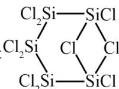

$$
\mathrm{Si} _ {5} \mathrm{Cl} _ {1 0}
$$

C. $\mathrm{Si}_{5} \mathrm{Cl}_{10}$ 与 $\mathrm{NaOH}$ 溶液反应会产生 $\mathrm{H}_{2}$ D. $\mathrm{Si}_{5} \mathrm{Cl}_{10}$ 沸点低于相同结构的 $\mathrm{Si}_{5} \mathrm{Br}_{10}$

【答案】A

【解析】

【详解】A. 该结构中, 如图 $\mathrm{Cl}_{2} \mathrm{Si}$ —— $\mathrm{SiCl}$ 所示的两个 $\mathrm{Cl}$ , $\mathrm{Cl}$ 最外层有 7 个电子, 形成了两个共价 $\mathrm{Cl}_{2} \mathrm{Si}$ —— $\mathrm{SiCl}$

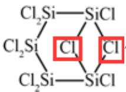

键，因此其中1个应为配位键，而Si不具备空轨道来接受孤电子对，因此 $\mathrm{Cl}_2\mathrm{Si}$ $\mathrm{Cl}_2\mathrm{Si}$ $\mathrm{Cl}_2\mathrm{Si}$ $\mathrm{Cl}_2\mathrm{Si}$ 结构是错误的，

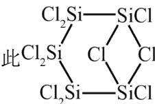

B. $\mathrm{Si}_{5} \mathrm{Cl}_{10}$ 与水反应可生成 $\mathrm{HCl}$ , $\mathrm{HCl}$ 是一种强酸, 故 B 正确;  
C. $\mathrm{Si}_{5} \mathrm{Cl}_{10}$ 与 $\mathrm{NaOH}$ 溶液反应 Si 元素均转化成 $\mathrm{Na}_{2} \mathrm{SiO}_{3}$ , Si 的化合价升高, 根据得失电子守恒可知, H 元素的化合价降低, 会有 $\mathrm{H}_{2}$ 生成, 故 C 正确;  
D. $\mathrm{Si}_{5} \mathrm{Br}_{10}$ 的相对分子质量大于 $\mathrm{Si}_{5} \mathrm{Cl}_{10}$ , 因此 $\mathrm{Si}_{5} \mathrm{Br}_{10}$ 的范德华力更大, 沸点更高, 故 D 正确;  
故选 A。

15. 室温下， $\mathrm{H}_{2} \mathrm{~S}$ 水溶液中各含硫微粒物质的量分数 $\delta$ 随 $\mathrm{pH}$ 变化关系如下图[例如

$\delta \left(\mathrm{H}_{2} \mathrm{~S}\right) = \frac{\mathrm{c} \left(\mathrm{H}_{2} \mathrm{~S}\right)}{\mathrm{c} \left(\mathrm{H}_{2} \mathrm{~S}\right) + \mathrm{c} \left(\mathrm{HS}^{-}\right) + \mathrm{c} \left(\mathrm{S}^{2-}\right)}$ 。已知： $\mathrm{K}_{\mathrm{sp}}(\mathrm{FeS}) = 6.3 \times 10^{-18}, \mathrm{K}_{\mathrm{sp}}[\mathrm{Fe(OH)}_2] = 4.9 \times 10^{-17}$

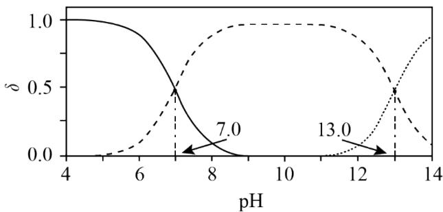

下列说法正确的是
A. 溶解度: FeS 大于 $\mathrm{Fe(OH)}_{2}$ B. 以酚酞为指示剂(变色的 pH 范围 8.2\~10.0), 用 NaOH 标准溶液可滴定 $\mathrm{H}_{2} \mathrm{~S}$ 水溶液的浓度
C. 忽略 $\mathrm{S}^{2-}$ 的第二步水解, $0.10 \mathrm{~mol} / \mathrm{L}$ 的 $\mathrm{Na}_{2} \mathrm{~S}$ 溶液中 $\mathrm{S}^{2-}$ 水解率约为 $62 \%$ D. $0.010 \mathrm{~mol} / \mathrm{L}$ 的 $\mathrm{FeCl}_{2}$ 溶液中加入等体积 $0.20 \mathrm{~mol} / \mathrm{L}$ 的 $\mathrm{Na}_{2} \mathrm{~S}$ 溶液, 反应初始生成的沉淀是 FeS 【答案】C 【解析】

【分析】在 $H_{2}S$ 溶液中存在电离平衡： $H_{2}S \rightleftharpoons H^{+} + HS^{-}$ 、 $HS^{-} \rightleftharpoons H^{+} + S^{2-}$ ，随着 pH 的增大， $H_{2}S$ 的物质的量分数逐渐减小， $HS^{-}$ 的物质的量分数先增大后减小， $S^{2-}$ 的物质的量分数逐渐增大，图

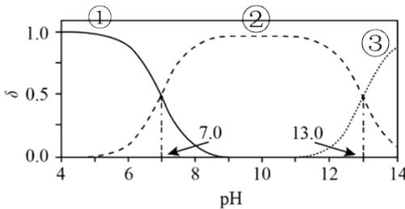

$$
\mathrm{H} _ {2} \mathrm{S}
$$

$$
\mathrm{S} ^ {2 -}
$$

化，由①和②交点的 pH=7 可知 $K_{a1}(H_{2}S)=1\times10^{-7}$ ，由②和③交点的 pH=13.0 可知 $K_{a2}(H_{2}S)=1\times10^{-13}$ 。

【详解】A. FeS 的溶解平衡为 $\mathrm{FeS(s)}\rightleftharpoons\mathrm{Fe}^{2+}(\mathrm{aq})+\mathrm{S}^{2-}(\mathrm{aq})$ ，饱和 FeS 溶液物质的量浓度为 $\sqrt{K_{\mathrm{sp}}(\mathrm{FeS})}=\sqrt{6.3\times10^{-18}\mathrm{~mol/L}}=\sqrt{6.3}\times10^{-9}\mathrm{~mol/L}$ ， $\mathrm{Fe(OH)_2}$ 的溶解平衡为 $\mathrm{Fe(OH)_2}\rightleftharpoons\mathrm{Fe}^{2+}(\mathrm{aq})+2\mathrm{OH}^{-}(\mathrm{aq})$ ，饱和 $\mathrm{Fe(OH)_2}$ 溶液物质的量浓度为 $\sqrt[3]{\frac{K_{\mathrm{sp}}[\mathrm{Fe(OH)_2}]}{4}}=\sqrt[3]{\frac{4.9\times10^{-17}}{4}}\mathrm{~mol/L}=\sqrt[3]{12.25}\times10^{-6}\mathrm{~mol/L}>\sqrt{6.3}\times10^{-9}\mathrm{~mol/L}$ ，故溶解度：FeS 小于 $\mathrm{Fe(OH)_2}$ ，A 项错误；

B. 酚酞的变色范围为 8.2\~10，若以酚酞为指示剂，用 NaOH 标准溶液滴定 $H_{2}S$ 水溶液，由图可知当酚酞发生明显颜色变化时，反应没有完全，即不能用酚酞作指示剂判断滴定终点，B 项错误；

C. $Na_{2}S$ 溶液中存在水解平衡 $S^{2-}+H_{2}O\rightleftharpoons HS^{-}+OH^{-}$ 、 $HS^{-}+H_{2}O\rightleftharpoons H_{2}S+OH^{-}$ （忽略第二步水解），第一步水解平衡常数 $K_{\mathrm{h}}(\mathrm{S}^{2-})=\frac{c(\mathrm{HS}^{-})c(\mathrm{OH}^{-})}{c(\mathrm{S}^{2-})}=\frac{c(\mathrm{HS}^{-})c(\mathrm{OH}^{-})c(\mathrm{H}^{+})}{c(\mathrm{S}^{2-})c(\mathrm{H}^{+})}=\frac{K_{\mathrm{w}}}{K_{\mathrm{a2}}(\mathrm{H}_{2}\mathrm{S})}=\frac{1\times10^{-14}}{1\times10^{-13}}=0.1$ ，设水解的 $S^{2-}$ 的浓度为 x mol/L，则 $\frac{x^{2}}{0.1-x}=0.1$ ，解得 $x\approx0.062$ ， $S^{2-}$ 的水解率约为 $\frac{0.062mol/L}{0.1mol/L}\times100\%=62\%$ ，C 项正确；

D. $0.01mol/L\;FeCl_{2}$ 溶液中加入等体积 $0.2mol/L\;Na_{2}S$ 溶液，瞬间得到 $0.005mol/L\;FeCl_{2}$ 和 $0.1mol/L\;Na_{2}S$ 的混合液，结合 C 项，瞬时 $c(\mathrm{Fe}^{2+})c(\mathrm{S}^{2-})=0.005mol/L\times(0.1mol/L-0.062mol/L)=1.9\times10^{-4}>K_{\mathrm{sp}}(\mathrm{FeS})$ ， $c(\mathrm{Fe}^{2+})c^{2}(\mathrm{OH}^{-})=0.005mol/L\times(0.062mol/L)^{2}=1.922\times10^{-5}>K_{\mathrm{sp}}[\mathrm{Fe(OH)}_{2}]$ ，故反应初始生成的沉淀是 FeS 和 $\mathrm{Fe(OH)}_{2}$ ，D 项错误；

答案选 C。

16. 为探究化学平衡移动的影响因素，设计方案并进行实验，观察到相关现象。其中方案设计和结论都正确的是

<table><tr><td>选项</td><td>影响因素</td><td>方案设计</td><td>现象</td><td>结论</td></tr><tr><td>A</td><td>浓度</td><td>向 1mL 0.1mol/L K2CrO4溶液中加入1mL1.0mol/L HBr溶液</td><td>黄色溶液变橙色</td><td>增大反应物浓度,平衡向正反应方向移动</td></tr><tr><td>B</td><td>压强</td><td>向恒温恒容密闭玻璃容器中充入100mL HI气体,分解达到平衡后再充入100mL Ar</td><td>气体颜色不变</td><td>对于反应前后气体总体积不变的可逆反应,改变压强平衡不移动</td></tr><tr><td>C</td><td>温度</td><td>将封装有 $NO_{2}$ 和 $N_{2}O_{4}$ 混合气体的烧瓶浸泡在热水中</td><td>气体颜色变深</td><td>升高温度,平衡向吸热反应方向移动</td></tr><tr><td>D</td><td>催化剂</td><td>向1mL乙酸乙酯中加入1mL 0.3mol/L  $H_{2}SO_{4}$ 溶液,水浴加热</td><td>上层液体逐渐减少</td><td>使用合适的催化剂可使平衡向正反应方向移动</td></tr></table>

A.A B.B C.C D.D

【答案】C

【解析】

【详解】A． $\mathrm{CrO}_{4}^{2-}$ （黄色）+2H $^{+} \rightleftharpoons \mathrm{Cr}_{2}\mathrm{O}_{7}^{2-}$ （橙色）+H $_{2}$ O，向1mL 0.1mol/L K $_{2}$ CrO $_{4}$ 溶液中加入1mL 1.0mol/L HBr 溶液，H $^{+}$ 浓度增大，平衡正向移动，实验现象应为溶液橙色加深，A 错误；B．反应2HI $\rightleftharpoons$ H $_{2}$ +I $_{2}$ 为反应前后气体总体积不变的可逆反应，向恒温恒容密闭玻璃容器中充入100mL HI气体，分解达到平衡后再充入100mL Ar，平衡不发生移动，气体颜色不变，应得到的结论是：对于反应前后气体总体积不变的可逆反应，恒温恒容时，改变压强平衡不移动，B 错误；C．反应2NO $_{2} \rightleftharpoons$ N $_{2}$ O $_{4}$ 为放热反应，升高温度，气体颜色变深，说明平衡逆向移动，即向吸热反应方向移动，C 正确；D．催化剂只会改变化学反应速率，不影响平衡移动，D 错误；答案选 C。

## 非选择题部分

## 二、非选择题(本大题共5小题，共52分)

17. 氧是构建化合物的重要元素。请回答:

(1) 某化合物的晶胞如图 1, $\mathrm{Cl}^-$ 的配位数 (紧邻的阳离子数) 为\_\_\_\_；写出该化合物的化学式\_\_\_\_，写出该化合物与足量 $\mathrm{NH}_{4} \mathrm{Cl}$ 溶液反应的化学方程式\_\_\_\_。

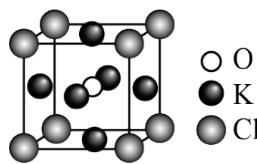  
图1

(2) 下列有关单核微粒的描述正确的是\_\_\_\_。
A. Ar 的基态原子电子排布方式只有一种
B. Na 的第二电离能 >Ne 的第一电离能
C. Ge 的基态原子简化电子排布式为 $[Ar]4s^{2}4p^{2}$ D. Fe 原子变成 $Fe^{+}$ ，优先失去 3d 轨道上的电子

(3) 化合物 HA、HB、HC 和 HD 的结构如图 2。

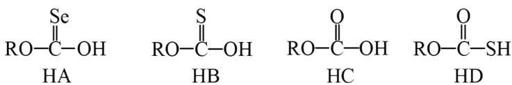  
图2

①HA、HB和HC中羟基与水均可形成氢键(-O-H... $\mathrm{OH}_{2}$ ), 按照氢键由强到弱对三种酸排序\_\_\_\_, 请说明理由\_\_\_\_。

②已知HC、HD钠盐的碱性NaC>NaD，请从结构角度说明理由\_\_\_\_。
【答案】（1） ①. 12 ②. K₃ClO ③. K₃ClO+2NH₄Cl+H₂O=3KCl+2NH₃·H₂O （2）AB

(3) ①. HC>HB>HA ②. O、S、Se 的电负性逐渐减小，键的极性：C=O>C=S>C=Se，使得 HA、HB、HC 中羟基的极性逐渐增大，其中羟基与 $H_{2}O$ 形成的氢键逐渐增强 ③. S 的原子半径大于 O 的原子半径，S—H 键的键长大于 O—H 键，S—H 键的键能小于 O—H 键，同时 HC 可形成分子间氢键，使得 HD 比 HC 更易电离出 $H^{+}$ ，酸性 HD>HC， $C^{-}$ 的水解能力大于 $D^{-}$ ，碱性 NaC>NaD

【解析】

【小问 1 详解】

由晶胞结构知，Cl位于8个顶点，O位于体心，K位于面心，1个晶胞中含Cl: $8\times\frac{1}{8}=1$ 个、含O:1个、含K: $6\times\frac{1}{2}=3$ 个，该化合物的化学式为 $K_{3}ClO$ ；由图可知，Cl的配位数为 $\frac{8\times3}{2}=12$ ；该化合物可看成 $KCl\cdot K_{2}O$ ，故该化合物与足量 $NH_{4}Cl$ 溶液反应生成KCl和 $NH_{3}\cdot H_{2}O$ ，反应的化学方程式为 $K_{3}ClO+2NH_{4}Cl+H_{2}O=3KCl+2NH_{3}\cdot H_{2}O$ 。

【小问 2 详解】

A. 根据原子核外电子排布规律, 基态 $\mathrm{Ar}$ 原子的电子排布方式只有 $1 \mathrm{~s}^{2} 2 \mathrm{~s}^{2} 2 \mathrm{p}^{6} 3 \mathrm{~s}^{2} 3 \mathrm{p}^{6}$ 一种, A 项正确;  
B. Na 的第二电离能指气态基态 $\mathrm{Na}^{+}$ 失去一个电子转化为气态基态正离子所需的最低能量, $\mathrm{Na}^{+}$ 和 $\mathrm{Ne}$ 具有相同的电子层结构， $\mathrm{Na^{+}}$ 的核电荷数大于 $\mathrm{Ne}$ ， $\mathrm{Na^{+}}$ 的原子核对外层电子的引力大于 $\mathrm{Ne}$ 的，故 $\mathrm{Na}$ 的第二电离能 $>\mathrm{Ne}$ 的第一电离能，B项正确；  
C. Ge的原子序数为32，基态Ge原子的简化电子排布式为[Ar] $3\mathrm{d}^{10}4\mathrm{s}^{2}4\mathrm{p}^{2}$ ，C项错误；  
D. 基态Fe原子的价电子排布式为 $3\mathrm{d}^{6}4\mathrm{s}^{2}$ ，Fe原子变成 $\mathrm{Fe^{+}}$ ，优先失去4s轨道上的电子，D项错误；  
答案选AB。

【小问 3 详解】

①O、S、Se 的电负性逐渐减小，键的极性：C=O>C=S>C=Se，使得 HA、HB、HC 中羟基的极性逐渐增大，从而其中羟基与水形成的氢键由强到弱的顺序为 HC>HB>HA；

②HC、HD 钠盐的碱性 NaC>NaD，说明酸性 HC<HD，原因是：S 的原子半径大于 O 的原子半径，S—H 键的键长大于 O—H 键，S—H 键的键能小于 O—H 键，同时 HC 可形成分子间氢键，使得 HD 比 HC 更易电离出 H⁺，酸性 HD>HC，C⁻ 的水解能力大于 D⁻，钠盐的碱性 NaC>NaD。

18. 矿物资源的综合利用有多种方法，如铅锌矿(主要成分为PbS、ZnS)的利用有火法和电解法等。

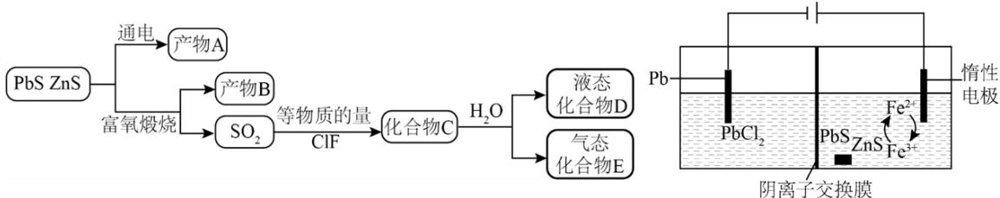

已知：① $PbCl_{2}(s) \xlongequal[\text{冷却}]{\text{热水}} PbCl_{2}(aq) \xlongequal{\text{HCl}} H_{2}[PbCl_{4}]$ ;

②电解前后 ZnS 总量不变；③ AgF 易溶于水。

请回答:

(1) 根据富氧煅烧(在空气流中煅烧)和通电电解(如图)的结果, PbS 中硫元素体现的性质是\_\_\_\_(选填 “氧化性”、“还原性”、“酸性”、“热稳定性”之一)。产物 B 中有少量 $\mathrm{Pb}_{3} \mathrm{O}_{4}$ , 该物质可溶于浓盐酸, Pb 元素转化为 $\left[\mathrm{PbCl}_{4}\right]^{2-}$ , 写出该反应的化学方程式\_\_\_\_; 从该反应液中提取 $\mathrm{PbCl}_{2}$ 的步骤如下: 加热条件下, 加入\_\_\_\_(填一种反应试剂), 充分反应, 趁热过滤, 冷却结晶, 得到产品。

(2) 下列说法正确的是\_\_\_\_。
A. 电解池中发生的总反应是 $\mathrm{PbS} = \mathrm{Pb} + \mathrm{S}$ (条件省略)
B. 产物 B 主要是铅氧化物与锌氧化物
C. $1 \mathrm{~mol}$ 化合物 C 在水溶液中最多可中和 $2 \mathrm{~mol} \mathrm{NaOH}$ D. ClF 的氧化性弱于 $\mathrm{Cl}_{2}$

（3）D 的结构为HO—S—X(X=F 或 Cl)，设计实验先除去样品 D 中的硫元素，再用除去硫元素后的溶液探究 X 为何种元素。

①实验方案：取 D 的溶液，加入足量 NaOH 溶液，加热充分反应，然后 \_\_\_\_；

$$
\mathrm{HSO} _ {3} \mathrm{X}
$$

$$
\mathrm{Pb} _ {3} \mathrm{O} _ {4} + 1 4 \mathrm{HCl} (\text {浓}) = 3 \mathrm{H} _ {2} \left[ \mathrm{PbCl} _ {4} \right] + 4 \mathrm{H} _ {2} \mathrm{O} + \mathrm{Cl} _ {2}
$$

$$
\mathrm{Pb} (\mathrm{OH}) _ {2}
$$

$$
\mathrm{PbCO} _ {3}
$$

(3) ①. 加入足量 $\mathrm{Ba(NO_3)_2}$ 溶液充分反应, 静置后取上层清液, 再加入硝酸酸化的 $\mathrm{AgNO_3}$ 溶液, 若产生白色沉淀, 则有 $\mathrm{Cl^-}$ , 反之则有 $\mathrm{F^-}$ ②. $\mathrm{HSO}_3\mathrm{X} + 3\mathrm{OH}^- = \mathrm{SO}_4^{2-} + \mathrm{X}^- + 2\mathrm{H}_2\mathrm{O}$

【解析】

【分析】铅锌矿(主要成分为 PbS、ZnS)富氧煅烧得到 $SO_{2}$ 和 Pb、Zn 元素的氧化物， $SO_{2}$ 与等物质的量的 ClF 反应得到化合物 C，结构简式为 Cl—S—F，化合物 C(Cl—S—F)水解生成液态化合物 D(HO—S—X, X=F 或 Cl)和气态化合物 E(HCl 或 HF)。

【小问 1 详解】

根据富氧煅烧和通电电解的结果，PbS中硫元素化合价升高，体现的性质是还原性。产物B中有少量 $\mathrm{Pb}_{3}\mathrm{O}_{4}$ ，该物质可溶于浓盐酸，Pb元素转化为 $\left[\mathrm{PbCl}_{4}\right]^{2-}$ ，该反应的化学方程式： $\mathrm{Pb}_{3}\mathrm{O}_{4} + 14\mathrm{HCl}$ (浓)= $3\mathrm{H}_{2}\left[\mathrm{PbCl}_{4}\right] + 4\mathrm{H}_{2}\mathrm{O} + \mathrm{Cl}_{2}\uparrow$ ；根据 $\mathrm{PbCl}_{2}(\mathrm{s}) \underset{\text {热水}}{\overset{\text {冷却}}{\rightleftharpoons}} \mathrm{PbCl}_{2}(\mathrm{aq}) \underset{\text {HCl}}{\rightleftharpoons} \mathrm{H}_{2}\left[\mathrm{PbCl}_{4}\right]$ 可得反应： $\mathrm{PbCl}_{2}(\mathrm{aq}) + 2\mathrm{HCl} \rightleftharpoons \mathrm{H}_{2}\left[\mathrm{PbCl}_{4}\right]$ ，要从该反应液中提取 $\mathrm{PbCl}_{2}$ ，则所加试剂应能消耗 $\mathrm{H}^{+}$ 使平衡逆向移动，且不引入杂质，则步骤为：加热条件下，加入PbO或 $\mathrm{Pb(OH)}_{2}$ 或 $\mathrm{PbCO}_{3}$ ，充分反应，趁热过滤，冷却结晶；【小问2详解】

A. 根据图示和已知②可知, 电解池中阳极上 $\mathrm{Fe}^{2+}$ 生成 $\mathrm{Fe}^{3+}$ , $\mathrm{Fe}^{3+}$ 氧化 PbS 生成 S、 $\mathrm{Pb}^{2+}$ 和 $\mathrm{Fe}^{2+}$ , 阴极上 $\mathrm{PbCl}_2$ 生成 Pb, 发生的总反应是: $\mathrm{PbS} = \mathrm{Pb} + \mathrm{S}$ (条件省略), A 正确;  
B. 据分析, 铅锌矿(主要成分为 PbS、ZnS)富氧煅烧得到 $\mathrm{SO}_2$ 和 Pb、Zn 元素的氧化物, 则产物 B 主要是铅氧化物与锌氧化物, B 正确;

C. 据分析，化合物 C 是 Cl—S—F，卤素原子被-OH 取代后生成 $H_{2}SO_{4}$ 和 HCl、HF，则 1mol 化合物 C

在水溶液中最多可中和 4molNaOH，C 错误；

D. ClF 的氧化性由 +1 价的 Cl 表现, $\mathrm{Cl}_{2}$ 的氧化性由 0 价的 Cl 表现, 则 ClF 的氧化锌强于 $\mathrm{Cl}_{2}$ , D 错误; 故选 AB。

【小问 3 详解】

①D 的结构为 HO—S—X(X=F 或 Cl)，加入足量 NaOH 溶液，加热充分反应，生成 $Na_{2}SO_{4}$ 和 NaX，则实验方案为：取 D 的溶液，加入足量 NaOH 溶液，加热充分反应，然后加入足量 $\mathrm{Ba(NO_{3})_{2}}$ 溶液充分反应，静置后取上层清液，再加入硝酸酸化的 $AgNO_{3}$ 溶液，若产生白色沉淀，则有 $Cl^{-}$ ，反之则有 $F^{-}$ ；
②D(用 $HSO_{3}X$ 表示)的溶液与足量 NaOH 溶液反应生成 $Na_{2}SO_{4}$ 和 NaX，发生反应的离子方程式是： $HSO_{3}X+3OH^{-}=SO_{4}^{2-}+X^{-}+2H_{2}O$ 。

19. 氢是清洁能源，硼氢化钠( $NaBH_{4}$ )是一种环境友好的固体储氢材料，其水解生氢反应方程式如下：
(除非特别说明，本题中反应条件均为25℃，101kPa) $NaBH_{4}(s)+2H_{2}O(l)=NaBO_{2}(aq)+4H_{2}(g)\quad\Delta H<0$

请回答:

(1) 该反应能自发进行的条件是\_\_\_\_。
A. 高温    B. 低温    C. 任意温度    D. 无法判断

(2) 该反应比较缓慢。忽略体积变化的影响, 下列措施中可加快反应速率的是\_\_\_\_。
A. 升高溶液温度
B. 加入少量异丙胺 $\left[\left(\mathrm{CH}_{3}\right)_{2}\mathrm{CHNH}_{2}\right]$ C. 加入少量固体硼酸 $\left[\mathrm{B(OH)}_{3}\right]$ D. 增大体系压强

(3) 为加速 $\mathrm{NaBH}_{4}$ 水解, 某研究小组开发了一种水溶性催化剂, 当该催化剂足量、浓度一定且活性不变时, 测得反应开始时生氢速率 v 与投料比 $\left[\mathrm{n}\left(\mathrm{NaBH}_{4}\right)/\mathrm{n}\left(\mathrm{H}_{2} \mathrm{O}\right)\right]$ 之间的关系, 结果如图 1 所示。请解释 ab 段变化的原因\_\_\_\_。

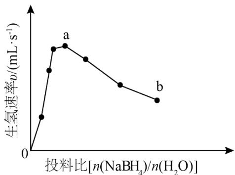  
图1

（4）氢能的高效利用途径之一是在燃料电池中产生电能。某研究小组的自制熔融碳酸盐燃料电池工作原理如图2所示，正极上的电极反应式是\_\_\_\_。该电池以3.2A恒定电流工作14分钟，消耗 $H_{2}$ 体积为0.49L，故可测得该电池将化学能转化为电能的转化率为\_\_\_\_。[已知：该条件下 $H_{2}$ 的摩尔体积为24.5L/mol；电荷量 $q(C)=$ 电流 $I(A)\times$ 时间(s)； $N_{A}=6.0\times10^{23}mol^{-1}$ ； $e=1.60\times10^{-19}C$ 。]

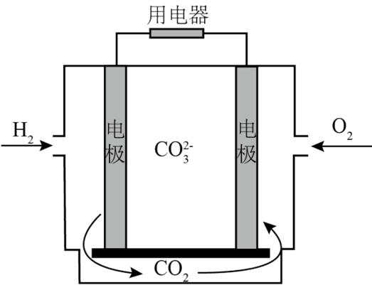  
图2

(5) 资源的再利用和再循环有利于人类的可持续发展。选用如下方程式, 可以设计能自发进行的多种制备方法, 将反应副产物偏硼酸钠 $\left(\mathrm{NaBO}_{2}\right)$ 再生为 $\mathrm{NaBH}_{4}$ 。(已知: $\Delta G$ 是反应的自由能变化量, 其计算方法也遵循盖斯定律, 可类比 $\Delta H$ 计算方法; 当 $\Delta G < 0$ 时, 反应能自发进行。)

I. $\mathrm{NaBH}_4(\mathrm{s}) + 2\mathrm{H}_2\mathrm{O}(\mathrm{l}) = \mathrm{NaBO}_2(\mathrm{s}) + 4\mathrm{H}_2(\mathrm{g})$ $\Delta \mathrm{G}_{1} = -320\mathrm{kJ / mol}$ II. $\mathrm{H}_{2}(\mathrm{g}) + \frac{1}{2}\mathrm{O}_{2}(\mathrm{g}) = \mathrm{H}_{2}\mathrm{O}(\mathrm{l})$ $\Delta \mathrm{G}_{2} = -240\mathrm{kJ / mol}$ III. $\mathrm{Mg(s)} + \frac{1}{2}\mathrm{O}_{2}(\mathrm{g}) = \mathrm{MgO(s)}$ $\Delta \mathrm{G}_{3} = -570\mathrm{kJ / mol}$

请书写一个方程式表示 $NaBO_{2}$ 再生为 $NaBH_{4}$ 的一种制备方法，并注明 $\Delta G$ \_\_\_\_。(要求：反应物不超过三种物质；氢原子利用率为100%。)

【答案】(1) C (2) A

(3) 随着投料比 $\left[\mathrm{n}\left(\mathrm{NaBH}_{4}\right)/\mathrm{n}\left(\mathrm{H}_{2} \mathrm{O}\right)\right]$ 增大, $\mathrm{NaBH}_{4}$ 的水解转化率降低 (4) ①. $\mathrm{O}_{2}+4 \mathrm{e}^{-}+2 \mathrm{CO}_{2}=2 \mathrm{CO}_{3}^{2-}$ ②. $70 \%$

(5) $\mathrm{NaBO}_2(\mathrm{s}) + 2\mathrm{H}_2(\mathrm{g}) + 2\mathrm{Mg}(\mathrm{s}) = \mathrm{NaBH}_4(\mathrm{s}) + 2\mathrm{MgO}(\mathrm{s})$ $\Delta G = -340\mathrm{kJ / mol}$

【解析】

【小问 1 详解】

反应 $\mathrm{NaBH}_4(\mathrm{s}) + 2\mathrm{H}_2\mathrm{O}(\mathrm{l}) = \mathrm{NaBO}_2(\mathrm{aq}) + 4\mathrm{H}_2(\mathrm{g})$ $\Delta \mathrm{H} < 0$ ， $\Delta \mathrm{S} > 0$ ，由 $\Delta \mathrm{G} = \Delta \mathrm{H - T}\Delta \mathrm{S}$ 可知，任意温度下，该反应均能自发进行，故答案选C；

A. 升高温度, 活化分子数增多, 有效碰撞几率增大, 反应速率加快, A 符合题意;  
B. 加入少量异丙胺 $\left[\left(\mathrm{CH}_{3}\right)_{2} \mathrm{CHNH}_{2}\right]$ , $\mathrm{H}_{2} \mathrm{O}$ 的量减少, 化学反应速率降低, B 不符合题意;  
C. 加入少量固体硼酸 $\left[\mathrm{B}(\mathrm{OH})_{3}\right]$ , $\mathrm{H}_{2} \mathrm{O}$ 的量减少, 化学反应速率降低, C 不符合题意;  
D. 增大体系压强, 忽略体积变化, 则气体浓度不变, 化学反应速率不变, D 不符合题意;

答案选 A。

【小问 3 详解】

随着投料比 $\left[\mathrm{n}\left(\mathrm{NaBH}_{4}\right)/\mathrm{n}\left(\mathrm{H}_{2} \mathrm{O}\right)\right]$ 增大， $\mathrm{NaBH}_{4}$ 的水解转化率降低，因此生成氢气的速率不断减小。【小问 4 详解】

根据题干信息，该燃料电池中 $H_{2}$ 为负极， $O_{2}$ 为正极，熔融碳酸盐为电解质溶液，故正极的电极反应式为： $O_{2}+4e^{-}+2CO_{2}=2CO_{3}^{2-}$ ，该条件下，0.49L $H_{2}$ 的物质的量为 $n(H_{2})=\frac{0.49L}{24.5L/mol}=0.02mol$ ，工作时， $H_{2}$ 失去电子： $H_{2}-2e^{-}=2H^{+}$ ，所带电荷量为： $2\times0.02mol\times6.0\times10^{23}mol^{-1}\times1.60\times10^{-19}=3840C$ ，工作电荷量为： $3.2\times14\times60=2688C$ ，则该电池将化学能转化为电能的转化率为： $\frac{2688C}{3840C}\times100\%=70\%$ ;

【小问 5 详解】

结合题干信息，要使得氢原子利用率为 $100\%$ ，可由（2×反应3）-（2×反应II+反应I）得 $\mathrm{NaBO_2(s) + 2H_2(g) + 2Mg(s) = NaBH_4(s) + 2MgO(s)}$ ， $\Delta G = 2\Delta G_{3} - (2\Delta G_{2} + \Delta G_{1}) = 2\times (-570\mathrm{kJ / mol}) - [2\times (-240\mathrm{kJ / mol}) + (-320\mathrm{kJ / mol})] = -340\mathrm{kJ / mol}$ 。

20. 某小组采用如下实验流程制备 $AlI_{3}$ :

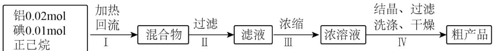

已知： $\mathrm{AlI}_3$ 是一种无色晶体，吸湿性极强，可溶于热的正己烷，在空气中受热易被氧化。

请回答:

(1) 如图为步骤 I 的实验装置图(夹持仪器和尾气处理装置已省略), 图中仪器 A 的名称是\_\_\_\_, 判断步骤 I 反应结束的实验现象是\_\_\_\_。

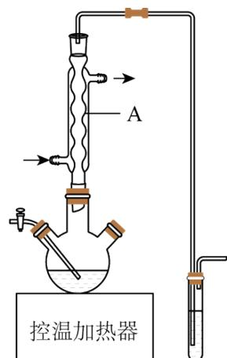

(2) 下列做法不正确的是\_\_\_\_。
A. 步骤 I 中, 反应物和溶剂在使用前除水
B. 步骤 I 中, 若控温加热器发生故障, 改用酒精灯(配石棉网)加热
C. 步骤III中, 在通风橱中浓缩至蒸发皿内出现晶膜
D. 步骤IV中, 使用冷的正己烷洗涤

（3）所得粗产品呈浅棕黄色，小组成员认为其中混有碘单质，请设计实验方案验证\_\_\_\_。

(4) 纯化与分析: 对粗产品纯化处理后得到产品, 再采用银量法测定产品中 $\mathrm{I}^{-}$ 含量以确定纯度。滴定原理为: 先用过量 $\mathrm{AgNO}_{3}$ 标准溶液沉淀 $\mathrm{I}^{-}$ , 再以 $\mathrm{NH}_{4} \mathrm{SCN}$ 标准溶液回滴剩余的 $\mathrm{Ag}^{+}$ 。已知:

<table><tr><td>难溶电解质</td><td>AgI(黄色)</td><td>AgSCN(白色)</td><td> $Ag_{2}CrO_{4}$ (红色)</td></tr><tr><td>溶度积常数 $K_{sp}$ </td><td> $8.5\times10^{-17}$ </td><td> $1.0\times10^{-12}$ </td><td> $1.1\times10^{-12}$ </td></tr></table>

①从下列选项中选择合适的操作补全测定步骤\_\_\_\_。

称取产品1.0200g，用少量稀酸A溶解后转移至250mL容量瓶，加水定容得待测溶液。取滴定管检漏、水洗→\_\_\_\_→装液、赶气泡、调液面、读数→用移液管准确移取25.00mL待测溶液加入锥形瓶→\_\_\_\_→\_\_\_\_→加入稀酸B→用 $1.000\times10^{-2}$ mol/LNH $_{4}$ SCN标准溶液滴定→\_\_\_\_→读数。

a. 润洗，从滴定管尖嘴放出液体  
b. 润洗，从滴定管上口倒出液体

c. 滴加指示剂 $\mathrm{K}_2\mathrm{CrO}_4$ 溶液  
d. 滴加指示剂硫酸铁铵 $\left[\mathrm{NH}_4\mathrm{Fe}\left(\mathrm{SO}_4\right)_2\right]$ 溶液  
e. 准确移取 $25.00\mathrm{mL}4.000\times 10^{-2}\mathrm{mol / LAgNO_3}$ 标准溶液加入锥形瓶  
f. 滴定至溶液呈浅红色  
g. 滴定至沉淀变白色  
②加入稀酸B的作用是\_\_\_\_。

③三次滴定消耗 $\mathrm{NH}_{4}\mathrm{SCN}$ 标准溶液的平均体积为 $25.60\mathrm{mL}$ ，则产品纯度为\_\_\_\_。 $\left[\mathrm{M}\left(\mathrm{AlI}_{3}\right)=408\mathrm{g/mol}\right]$ 【答案】(1) ①. 球形冷凝管 ②. 溶液由紫红色恰好变为无色（或溶液褪为无色） (2) BC

(3) 取少量粗产品置于少量冷的正己烷中充分搅拌, 静置后, 取少量上层清液, 向其中滴加淀粉溶液, 观察液体是否变蓝, 若变蓝则其中混有碘单质, 否则没有
(4) ①. a e d f ②. 抑制 $\mathrm{Fe}^{3+}$ 发生水解反应, 保证滴定终点的准确判断 ③. $99.20\%$

【分析】由流程信息可知，铝、碘和正己烷一起加热回流时，铝和碘发生反应生成 $AlI_{3}$ ，过滤后滤液经浓缩、结晶、过滤、洗涤、干燥后得到粗产品。

由实验装置图中仪器的结构可知，图中仪器 A 的名称是球形冷凝管，其用于冷凝回流；碘溶于正己烷使溶液显紫红色， $AlI_{3}$ 是无色晶体，当碘反应完全后，溶液变为无色，因此，判断步骤 I 反应结束的实验现象是：溶液由紫红色恰好变为无色（或溶液褪为无色）。

【小问 2 详解】
A. $\mathrm{AlI}_{3}$ 吸湿性极强, 因此在步骤 I 中, 反应物和溶剂在使用前必须除水, A 正确;  
B. 使用到易烯的有机溶剂时, 禁止使用明火加热, 因此在步骤 I 中, 若控温加热器发生故障, 不能改用酒精灯(配石棉网)加热, B 不正确;  
C. $\mathrm{AlI}_{3}$ 在空气中受热易被氧化, 因此在步骤 III 中蒸发浓缩时, 要注意使用有保护气 (如持续通入氮气的蒸馏烧瓶等) 的装置中进行, 不能直接在蒸发皿浓缩, C 不正确;  
D. $\mathrm{AlI}_{3}$ 在空气中受热易被氧化、可溶于热的正己烷因此, 为了减少溶解损失, 在步骤 IV 中要使用冷的正己烷洗涤, D 正确;

综上所述，本题选 BC。

【小问 3 详解】

碘易溶于正己烷，而 $AlI_{3}$ 可溶于热的正己烷、不易溶于冷的正己烷，因此，可以取少量粗产品置于少量冷的正己烷中充分搅拌，静置后，取少量上层清液，向其中滴加淀粉溶液，观察液体是否变蓝，若变蓝则其中混有碘单质，否则没有。

【小问 4 详解】

①润洗时，滴定管尖嘴部分也需要润洗；先加25.00mL待测溶液，后加

25.00mL4.000×10 $^{-2}$ mol/LAgNO $_{3}$ 标准溶液，两者充分分反应后，剩余的 Ag $^{+}$ 浓度较小，然后滴加指示剂硫酸铁铵[NH $_{4}$ Fe(SO $_{4}$ ) $_{2}$ ]溶液作指示剂，可以防止生成 Ag $_{2}$ SO $_{4}$ 沉淀； Ag $_{2}$ CrO $_{4}$ 的溶度积常数与 AgSCN 非常接近，因此， K $_{2}$ CrO $_{4}$ 溶液不能用作指示剂，应该选用[NH $_{4}$ Fe(SO $_{4}$ ) $_{2}$ ]溶液，其中的 Fe $^{3+}$ 可以与过量的半滴[NH $_{4}$ Fe(SO $_{4}$ ) $_{2}$ ]溶液中的 SCN $^{-}$ 反应生成溶液呈红色的配合物，故滴定至溶液呈浅红色；综上所述，需要补全的操作步骤依次是：a e d f。

② $Fe^{3+}$ 和 $Al^{3+}$ 均易发生水解， $\left\lfloor NH_{4}Fe(SO_{4})_{2}\right\rfloor$ 溶液中含有 $Fe^{3+}$ ，为防止影响滴定终点的判断，必须抑制其发生水解，因此加入稀酸 B 的作用是：抑制 $Fe^{3+}$ 发生水解反应，保证滴定终点的准确判断。

③由滴定步骤可知， $25.00\mathrm{mL}4.000\times 10^{-2}\mathrm{mol / LAgNO}_3$ 标准溶液分别与 $\mathrm{AlI}_3$ 溶液中的 $\mathrm{I}^-$ 、

$1.000 \times 10^{-2} \, mol/LNH_{4}SCN$ 标准溶液中的 $SCN^{-}$ 发生反应生成 AgI 和 AgSCN；由 $Ag^{+}$ 守恒可知， $n(AgI)+n(AgSCN)=n(AgNO_{3})$ ，则 $n(AgI)=n(AgNO_{3})-n(AgSCN)=n(AgNO_{3})-n(NH_{4}SCN)$ ；三次滴定消耗 $NH_{4}SCN$ 标准溶液的平均体积为 25.60mL，则

$$
\mathrm{n} (\mathrm{AgI}) = \mathrm{n} (\mathrm{AgNO} _ {3}) - \mathrm{n} (\mathrm{AgSCN}) = \mathrm{n} (\mathrm{AgNO} _ {3}) - \mathrm{n} (\mathrm{NH} _ {4} \mathrm{SCN}) =
$$

$$
2 5. 0 0 \mathrm{mL} \times 1 0 ^ {- 3} \mathrm{L} \cdot \mathrm{mL} ^ {- 1} \times 4. 0 0 0 \times 1 0 ^ {- 2} \mathrm{mol} / \mathrm{L} - 2 5. 6 0 \mathrm{mL} \times 1 0 ^ {- 3} \mathrm{L} \cdot \mathrm{mL} ^ {- 1} \times 1. 0 0 0 \times 1 0 ^ {- 2} \mathrm{mol} / \mathrm{L} =
$$

$7.440\times 10^{-4}\mathrm{mol}$ ，由I守恒可知 $\mathrm{n(All_3)} = \frac{1}{3}\mathrm{n(AgI)} = 7.440\times 10^{-4}\mathrm{mol}\times \frac{1}{3} = 2.480\times 10^{-4}\mathrm{mol}$ ，因此，产品纯度为 $\frac{2.480\times 10^{-4}\mathrm{mol}\times 408\mathrm{g / mol}}{1.0200\mathrm{g}\times\frac{25.00\mathrm{mL}}{250\mathrm{mL}}}\times 100\% = 99.20\%$ 。

21. 某研究小组按下列路线合成抗炎镇痛药“消炎痛”(部分反应条件已简化)。

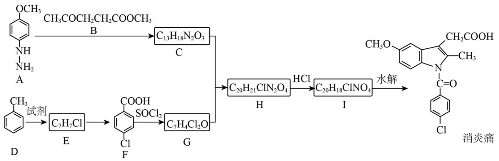

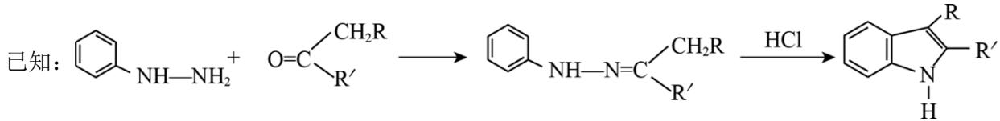

请回答:

（1）化合物 F 的官能团名称是\_\_\_\_。

(2) 化合物 G 的结构简式是 \_\_\_\_。

（3）下列说法不正确的是\_\_\_\_。

A. 化合物 A 的碱性弱于 $CH_{3}O-\ce{C6H5}-NH_{2}$

B. $\mathrm{A} + \mathrm{B} \rightarrow \mathrm{C}$ 的反应涉及加成反应和消去反应

C. $\mathrm{D} \rightarrow \mathrm{E}$ 的反应中，试剂可用 $\mathrm{Cl}_2 / \mathrm{FeCl}_3$

D.“消炎痛”的分子式为 $C_{18}H_{16}ClNO_{4}$

(4) 写出 $\mathrm{H} \rightarrow \mathrm{I}$ 的化学方程式 \_\_\_\_。

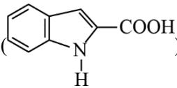

(5) 吗吲哚-2-甲酸( $\ce{C6H5N-COOH}$ )是一种医药中间体，设计以 $\ce{C6H5-NH-NH2}$ 和 $CH3CHO$ 为原料合

成吲哚-2-甲酸的路线(用流程图表示，无机试剂任选)\_\_\_\_。

(6) 写出 4 种同时符合下列条件的化合物 B 的同分异构体的结构简式\_\_\_\_。

①分子中有 2 种不同化学环境的氢原子;

②有甲氧基 $\left(-OCH_{3}\right)$ ，无三元环。

【答案】（1）羧基、氯原子

(2)

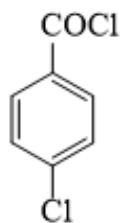

(3) AD

( 4 )

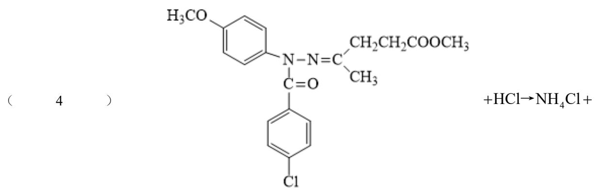

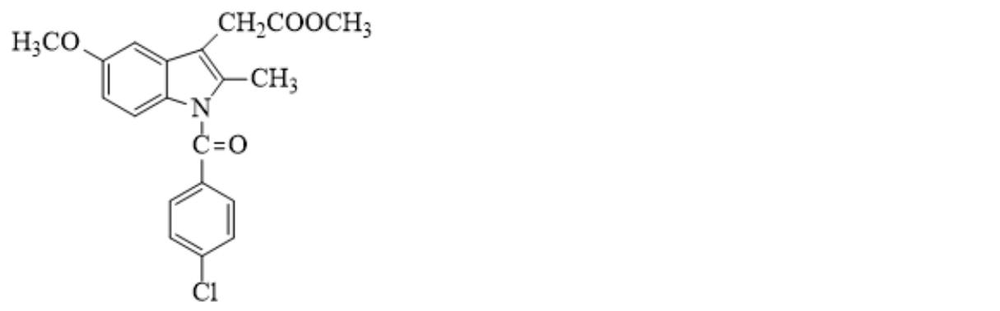

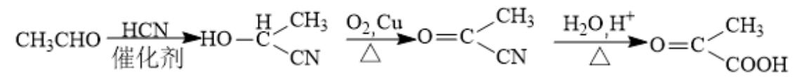

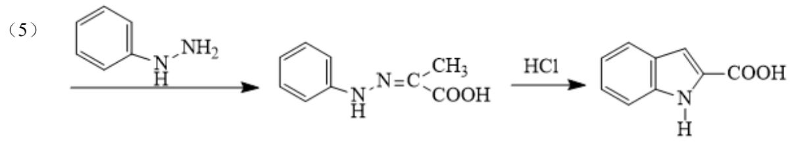

(6)

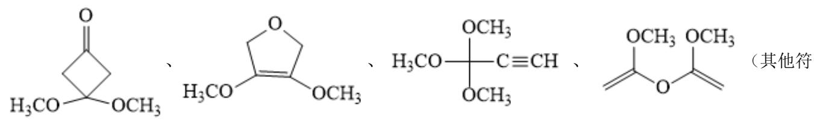

合条件的结构也可）

【解析】

成C，C为

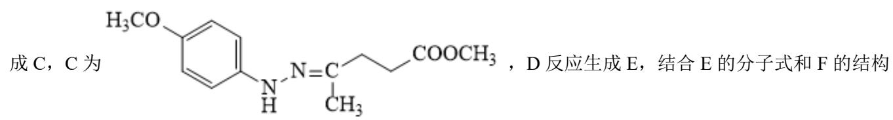

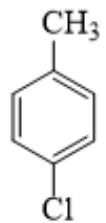

$$
\mathrm{SOCl} _ {2}
$$

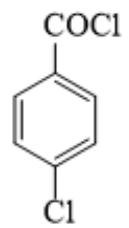

，I水解得到消炎

痛，结合消炎痛的结构可知，I为

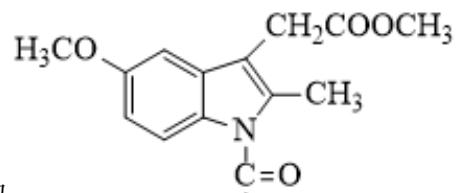

，H与HCl得到I的反应类似已知

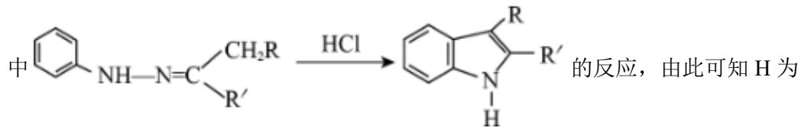

的反应，由此可知H为

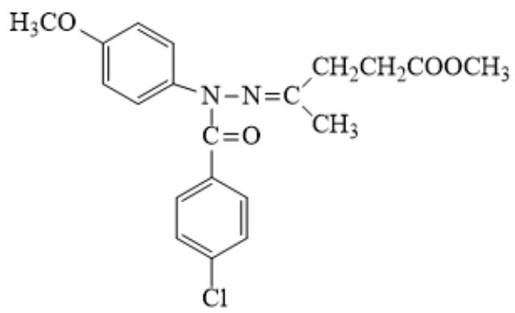

，C 与 G 反应得到 H，据此解答。

【小问1详解】

由 F 的结构可知，F 的官能团为羧基、碳氟键；

【小问 2 详解】

由分析得，G 为

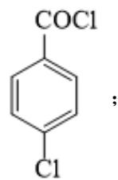

【小问3详解】

A. $\mathrm{CH}_3\mathrm{O}-\left\langle \right\rangle - \mathrm{NH}_2$ 的氨基直接连接在苯环上，A中氨基连接在-NH-上，即A中氨基N更易结合 $\mathrm{H}^+$ ，碱性更强，故A错误；

B. A+B→C 的反应，是 B 中羰基先加成，得到羟基，羟基再与相邻 N 上的 H 消去得到 N=C，涉及加

成反应和消去反应，故 B 正确；

C. D→E 是甲苯甲基对位上的 H 被 Cl 取代，试剂可为 $Cl_{2}/FeCl_{3}$ ，故 C 正确；

D. 由“消炎痛”的结构可知, 分子式为 $\mathrm{C}_{19} \mathrm{H}_{16} \mathrm{ClNO}_{4}$ , 故 D 错误;

故选 AD;

【小问 4 详解】

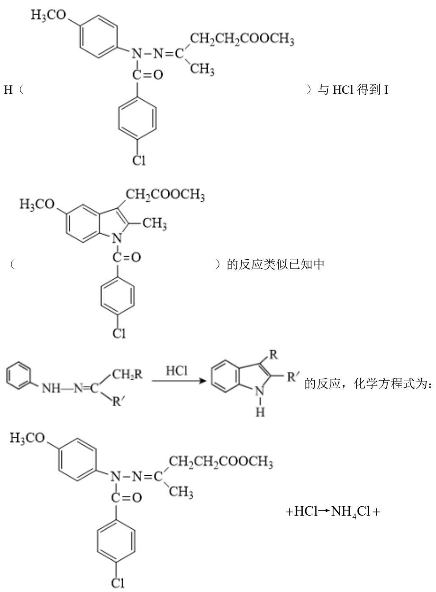

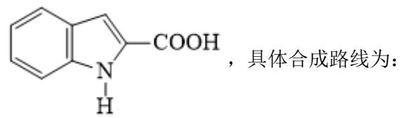

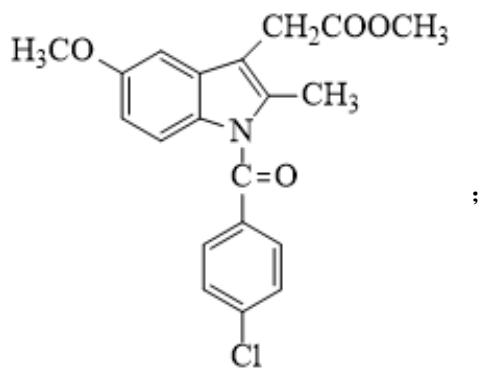  
【小问 5 详解】

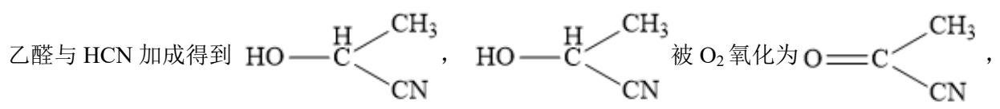

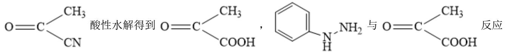

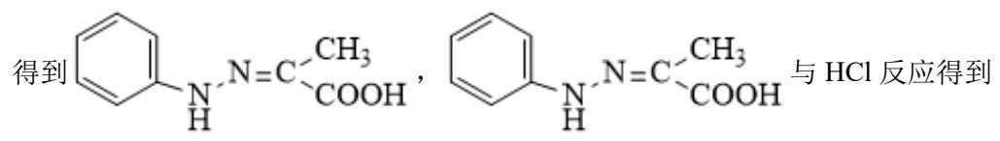

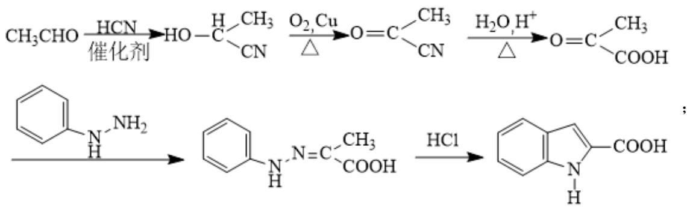

【小问6详解】

B 为 $\mathrm{CH}_3\mathrm{COCH}_2\mathrm{CH}_2\mathrm{COOCH}_3$ ，同分异构体中有 2 种不同化学环境的氢原子，说明其结构高度对称，有

甲氧基 $(\mathrm{-OCH}_3)$ ，无三元环，符合条件的结构简式为：

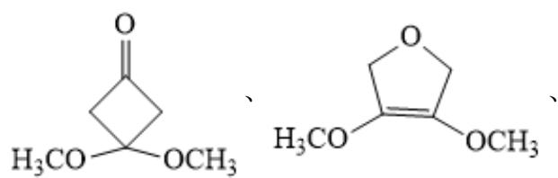

$$
\mathrm{H} _ {3} \mathrm{CO} - \begin{array}{c} \mathrm{OCH} _ {3} \\ \mathrm{OCH} _ {3} \end{array} \mathrm{C} \equiv \mathrm{CH}, \quad \begin{array}{c} \mathrm{OCH} _ {3} \\ \mathrm{OCH} _ {3} \end{array}
$$

(其他符合条件的结构也可)。