# 2024年湖北省普通高中学业水平选择性考试

# 化学

本试卷共8页，19题。主卷满分100分。考试用时75分钟。

★祝考试顺利★

## 注意事项：

1. 答题前，先将自己的姓名、准考证号、考场号、座位号填写在试卷和答题卡上，并认真核准准考证号条形码上的以上信息，将条形码粘贴在答题卡上的指定位置。

2. 请按题号顺序在答题卡上各题目的答题区域内作答，写在试卷、草稿纸和答题卡上的非答题区域均无效。

3. 选择题用2B铅笔在答题卡上把所选答案的标号涂黑；非选择题用黑色签字笔在答题卡上作答；字体工整，笔迹清楚。

4. 考试结束后，请将试卷和答题卡一并上交。

可能用到的相对原子质量：H1 Li7 O16 Si28 Cu64 I127 Au197

本卷涉及的实验均须在专业人士指导和安全得到充分保障的条件下完成。

## 一、选择题：本题共15小题，每小题3分，共45分。在每小题给出的四个选项中，只有一项是符合题目要求的。

1. 劳动人民的发明创造是中华优秀传统文化的组成部分。下列化学原理描述错误的是

<table><tr><td></td><td>发明</td><td>关键操作</td><td>化学原理</td></tr><tr><td>A</td><td>制墨</td><td>松木在窑内焖烧</td><td>发生不完全燃烧</td></tr><tr><td>B</td><td>陶瓷</td><td>黏土高温烧结</td><td>形成新的化学键</td></tr><tr><td>C</td><td>造纸</td><td>草木灰水浸泡树皮</td><td>促进纤维素溶解</td></tr><tr><td>D</td><td>火药</td><td>硫黄、硝石和木炭混合,点燃</td><td>发生氧化还原反应</td></tr></table>

A A B.B C.C D.D

【答案】C

【解析】

【详解】A. 松木在窑中不完全燃烧会生成碳单质，可以用来制造墨块，A 正确；  
B. 黏土在高温中烧结，会发生一系列的化学反应，此过程有新化学键的形成，B 正确  
C. 草木灰主要成分为碳酸钾，浸泡的水成碱性，用于分离树皮等原料中的胶质，纤维素不能在碱性条件下水解，此过程并没有使纤维素发生水解，C 错误；  
D. 中国古代黑火药是有硫磺、硝石、木炭混合而成的，在点燃时发生剧烈的氧化还原反应，反应方程式为 $\mathrm{S} + 2\mathrm{KNO}_3 + 3\mathrm{C} = \mathrm{K}_2\mathrm{S} + 3\mathrm{CO}_2\uparrow +\mathrm{N}_2\uparrow$ ，D 正确；  
故答案选 C。

2. 2024 年 5 月 8 日，我国第三艘航空母舰福建舰顺利完成首次海试。舰体表面需要采取有效的防锈措施，下列防锈措施中不形成表面钝化膜的是
A. 发蓝处理    B. 阳极氧化    C. 表面渗镀    D. 喷涂油漆

【解析】

【详解】A. 发蓝处理技术通常用于钢铁等黑色金属，通过在空气中加热或直接浸泡于浓氧化性溶液中来实现，可在金属表面形成一层极薄的氧化膜，这层氧化膜能有效防锈，A 不符合题意；  
B. 阳极氧化是将待保护的金属与电源正极连接，在金属表面形成一层氧化膜的过程，B 不符合题意；  
C. 表面渗镀是在高温下将气态、固态或熔化状态的欲渗镀的物质(金属或非金属元素)通过扩散作用从被渗镀的金属的表面渗入内部以形成表层合金镀层的一种表面处理的方法，C 不符合题意；  
D. 喷涂油漆是将油漆涂在待保护的金属表面并没有在表面形成钝化膜，D 符合题意；故答案选 D。

3. 关于物质的分离、提纯，下列说法错误的是
A. 蒸馏法分离 $CH_{2}Cl_{2}$ 和 $CCl_{4}$ B. 过滤法分离苯酚和 $NaHCO_{3}$ 溶液
C. 萃取和柱色谱法从青蒿中提取分离青蒿素
D. 重结晶法提纯含有少量食盐和泥沙的苯甲酸

【解析】

【详解】A. 二氯甲烷和四氯化碳互溶，二者沸点不同，可以用蒸馏的方法将二者分离，A 正确；  
B. 苯酚和碳酸氢钠都可以溶解在水中，不能用过滤的方法将二者分离，B 错误；  
C. 将青蒿浸泡在有机溶剂中得到提取液，寻找合适的萃取剂可以利用萃取的方法将提取液中的青蒿素提取出来；也可以利用不同溶质在色谱柱上的保留时间不同将青蒿素固定在色谱柱上，在利用极性溶剂将青蒿素洗脱下来，得到纯净的青蒿素，C 正确；  
D．食盐和苯甲酸的溶解度二者差异较大，可以利用重结晶的方式将低温下溶解度较小的苯甲酸提纯出来，  
D 正确；  
故答案选 B。

4. 化学用语可以表达化学过程，下列化学用语表达错误的是
A. 用电子式表示 $\mathrm{Cl}_2$ 的形成： $\ddot{\mathrm{Cl}} \cdot + \cdot \ddot{\mathrm{Cl}}: \longrightarrow : \ddot{\mathrm{Cl}}: \ddot{\mathrm{Cl}}:$ B. 亚铜氨溶液除去合成氨原料气中的 CO： $\left[\mathrm{Cu}\left(\mathrm{NH}_{3}\right)_{2}\right]^{2+} + \mathrm{CO} + \mathrm{NH}_{3} \rightleftharpoons \left[\mathrm{Cu}\left(\mathrm{NH}_{3}\right)_{3} \mathrm{CO}\right]^{2+}$ C. 用电子云轮廓图示意 p-pπ 键的形成： $\rightarrow \leftrightarrow \rightarrow \leftrightarrow \rightarrow$

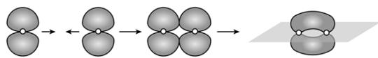

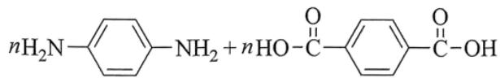

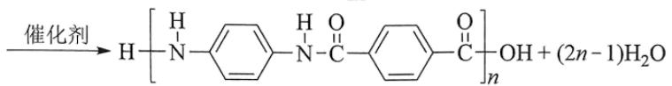

【答案】B

【解析】

【详解】A．氯元素为 VIIA 族元素，最外层电子数为 7，Cl 原子与 Cl 原子共用 1 对电子形成 $Cl_{2}$ ，电子式表示 $Cl_{2}$ 的形成过程为：∵ $Cl + Cl \rightarrow Cl : Cl$ ：故 A 正确；

B. 亚铜氨中铜元素的化合价为+1价，而 $\left[Cu(NH_3)_2\right]^{2+}$ 中铜元素为+2价，亚铜氨溶液除去合成氨原料气中的CO的原理为： $\left[Cu(NH_3)_2\right]^+$ + $CO + NH_3 \rightleftharpoons \left[Cu(NH_3)_3CO\right]^+$ ，故B错误；

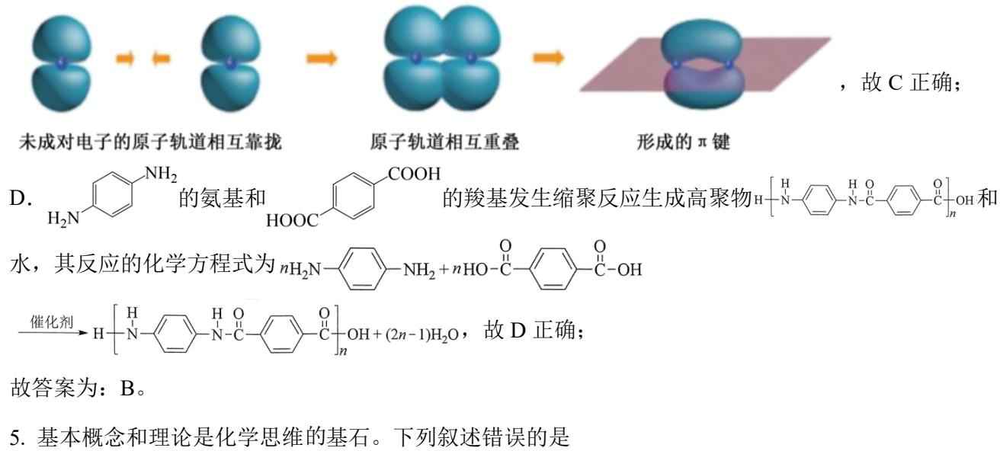

故答案为：B。

5. 基本概念和理论是化学思维的基石。下列叙述错误的是

A. VSEPR 理论认为 VSEPR 模型与分子的空间结构相同  
B. 元素性质随着原子序数递增而呈周期性变化的规律称为元素周期律  
C. 泡利原理认为一个原子轨道内最多只能容纳两个自旋相反的电子  
D. $\mathbf{sp}^3$ 杂化轨道由 1 个 s 轨道和 3 个 p 轨道混杂而成

【答案】A

【解析】

【详解】A. VSEPR 模型是价层电子对的空间结构模型，而分子的空间结构指的是成键电子对的空间结构，不包括孤电子对，当中心原子无孤电子对时，两者空间结构相同，当中心原子有孤电子对时，两者空间结构不同，故 A 错误；  
B. 元素的性质随着原子序数的递增而呈现周期性的变化，这一规律叫元素周期律，元素性质的周期性的变化是元素原子的核外电子排布周期性变化的必然结果，故 B 正确；  
C. 在一个原子轨道里，最多只能容纳 2 个电子，它们的自旋相反，这个原理被称为泡利原理，故 C 正确；  
D. 1 个 s 轨道和 3 个 p 轨道混杂形成 4 个能量相同、方向不同的轨道，称为 sp³ 杂化轨道，故 D 正确；故答案为：A。

6. 鹰爪甲素(如图)可从治疗疟疾的有效药物鹰爪根中分离得到。下列说法错误的是

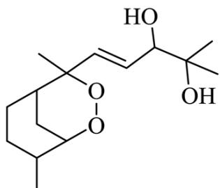

A. 有5个手性碳 B. 在 $120^{\circ} \mathrm{C}$ 条件下干燥样品 C. 同分异构体的结构中不可能含有苯环 D. 红外光谱中出现了 $3000 \mathrm{~cm}^{-1}$ 以上的吸收峰

【答案】B

【解析】

【详解】A. 连 4 个不同原子或原子团的碳原子称为手性碳原子，分子中有 5 个手性碳原子，如图中用星

号标记的碳原子：HOCH(OH)CH3OCH2OH，故A正确；

B. 由鹰爪甲素的结构简式可知, 其分子中有过氧键, 过氧键热稳定性差, 所以不能在 $120^{\circ} \mathrm{C}$ 条件下干燥

样品，故 B 错误；

C. 鹰爪甲素的分子式为 $\mathrm{C_{15}H_{26}O_4}$ , 如果有苯环, 则分子中最多含 $2n - 6 = 15 \times 2 - 6 = 24$ 个氢原子, 则其同分异构体的结构中不可能含有苯环, 故 C 正确;  
D. 由鹰爪甲素的结构简式可知, 其分子中含羟基, 即有氧氢键, 所以其红外光谱图中会出现 $3000\mathrm{cm}^{-1}$ 以上的吸收峰, 故 D 正确;  
故答案为: B。

7. 过量 $SO_{2}$ 与以下 $0.1 \, mol \cdot L^{-1}$ 的溶液反应，下列总反应方程式错误的是

<table><tr><td></td><td>溶液</td><td>现象</td><td>化学方程式</td></tr><tr><td>A</td><td> $Na_{2}S$ </td><td>产生淡黄色沉淀</td><td> $3SO_{2} + 2Na_{2}S = 3S \downarrow + 2Na_{2}SO_{3}$ </td></tr><tr><td>B</td><td> $FeCl_{3}$ </td><td>溶液由棕黄色变浅绿色</td><td> $2FeCl_{3} + SO_{2} + 2H_{2}O = 2FeCl_{2} + H_{2}SO_{4} + 2HCl$ </td></tr><tr><td>C</td><td> $CuCl_{2}$ </td><td>溶液褪色,产生白色沉淀</td><td> $SO_{2} + 2CuCl_{2} + 2H_{2}O = 2CuCl \downarrow + H_{2}SO_{4} + 2HCl$ </td></tr><tr><td>D</td><td> $Na_{2}CO_{3}$ (含酚酞)</td><td>溶液由红色变无色</td><td> $2SO_{2} + Na_{2}CO_{3} + H_{2}O = CO_{2} + 2NaHSO_{3}$ </td></tr></table>

A.A B.B C.C D.D

【答案】A

【解析】

【详解】A. 过量 $SO_{2}$ 与 $0.1\ mol\cdot L^{-1}$ 的 $Na_{2}S$ 溶液反应，生成产生的淡黄色沉淀是 S，还生成 $NaHSO_{3}$ ， $SO_{2}$ 过量不能生成 $Na_{2}SO_{3}$ ，因此，总反应的化学方程式为 $5SO_{2} + 2Na_{2}S + 2H_{2}O = 3S \downarrow + 4NaHSO_{3}$ ，A 错误；

B．过量 $SO_{2}$ 与 $0.1\ mol\cdot L^{-1}$ 的 $FeCl_{3}$ 溶液反应，生成 $FeCl_{2}$ 、 $H_{2}SO_{4}$ 、HCl，总反应的化学方程式为 $2FeCl_{3}+SO_{2}+2H_{2}O=2FeCl_{2}+H_{2}SO_{4}+2HCl$ ，B 正确；

C．过量 $SO_{2}$ 与 $0.1\ mol\cdot L^{-1}$ 的 $CuCl_{2}$ 溶液反应，生成的白色沉淀是 CuCl，总反应的化学方程式为 $SO_{2} + 2CuCl_{2} + 2H_{2}O = 2CuCl \downarrow + H_{2}SO_{4} + 2HCl, C$ 正确；

D. $Na_{2}CO_{3}$ 水解使溶液显碱性，其水溶液能使酚酞变红；过量 $SO_{2}$ 与 $0.1\ mol\cdot L^{-1}$ 的 $Na_{2}CO_{3}$ 溶液反应，生成 $CO_{2}$ 、 $NaHSO_{3}$ ， $NaHSO_{3}$ 溶液显酸性，因此，溶液由红色变无色，总反应的化学方程式为

$2SO_{2} + Na_{2}CO_{3} + H_{2}O = CO_{2} \uparrow + 2NaHSO_{3}$ ，D 正确；

综上所述，本题选 A。

8. 结构决定性质，性质决定用途。下列事实解释错误的是

<table><tr><td></td><td>事实</td><td>解释</td></tr><tr><td>A</td><td>甘油是黏稠液体</td><td>甘油分子间的氢键较强</td></tr><tr><td>B</td><td>王水溶解铂</td><td>浓盐酸增强了浓硝酸的氧化性</td></tr><tr><td>C</td><td>冰的密度小于干冰</td><td>冰晶体中水分子的空间利用率相对较低</td></tr><tr><td>D</td><td>石墨能导电</td><td>未杂化的p轨道重叠使电子可在整个碳原子平面内运动</td></tr></table>

A.A B.B C.C D.D

【答案】B

【解析】

【详解】A. 甘油分子中有3个羟基, 分子间可以形成更多的氢键, 且O元素的电负性较大, 故其分子间形成的氢键较强, 因此甘油是黏稠液体, A正确;  
B. 王水溶解铂, 是因为浓盐酸提供的 $\mathrm{Cl^-}$ 能与被硝酸氧化产生的高价态的铂离子形成稳定的配合物从而促进铂的溶解, 在这个过程中浓盐酸没有表现氧化性, B不正确;  
C. 冰晶体中水分子间形成较多的氢键, 由于氢键具有方向性, 因此, 水分子间形成氢键后空隙变大, 冰晶体中水分子的空间利用率相对较低, 冰的密度小于干冰, C正确;  
D. 石墨属于混合型晶体, 在石墨的二维结构平面内, 第个碳原子以C—C键与相邻的3个碳原子结合, 形成六元环层。碳原子有4个价电子, 而每个碳原子仅用3个价电子通过 $\mathfrak{sp}^2$ 杂化轨道与相邻的碳原子形成共价键, 还有1个电子处于碳原子的未杂化的2p轨道上, 层内碳原子的这些p轨道相互平行, 相邻碳原子p轨道相互重叠形成大π键, 这些p轨道的电子可以在整个层内运动, 因此石墨能导电, D正确;  
综上所述, 本题选B。

9. 主族元素 W、X、Y、Z 原子序数依次增大，X、Y 的价电子数相等，Z 的价电子所在能层有 16 个轨道，4 种元素形成的化合物如图。下列说法正确的是

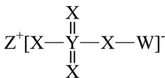

A. 电负性: $W > Y$ B. 酸性: $W_{2}YX_{3} > W_{2}YX_{4}$ C. 基态原子的未成对电子数: $W > X$ D. 氧化物溶于水所得溶液的 $\mathrm{pH}: Z > Y$

【答案】D

【解析】

【分析】主族元素 W、X、Y、Z 原子序数依次增大，X、Y 的价电子数相等，Z 的价电子所在能层有 16 个轨道，则 Z 个有 4 个能层。根据这 4 种元素形成的化合物的结构可以推断，W、X、Y、Z 分别为 H、O、S、K。

【详解】A. W 和 Y 可以形成 $H_{2}S$ ，其中 S 显 -2 价，因此，电负性 S > H，A 不正确；
B. $H_{2}SO_{3}$ 是中强酸，而 $H_{2}SO_{4}$ 是强酸，因此，在相同条件下，后者的酸性较强，B 不正确；
C. H 只有 1 个电子，O 的 2p 轨道上有 4 个电子，O 有 2 个未成对电子，因此，基态原子的未成对电子数 O > H，C 不正确；
D. K 的氧化物溶于水且与水反应生成强碱 KOH，S 的氧化物溶于水且与水反应生成 $H_{2}SO_{3}$ 或 $H_{2}SO_{4}$ ，因此，氧化物溶于水所得溶液的 pH 的大小关系为 K > S，D 正确；
综上所述，本题选 D。

10. 碱金属的液氨溶液含有的蓝色溶剂化电子 $\left[\mathrm{e}\left(\mathrm{NH}_{3}\right)_{\mathrm{n}}\right]^{-}$ 是强还原剂。锂与液氨反应的装置如图(夹持装置略)。下列说法错误的是

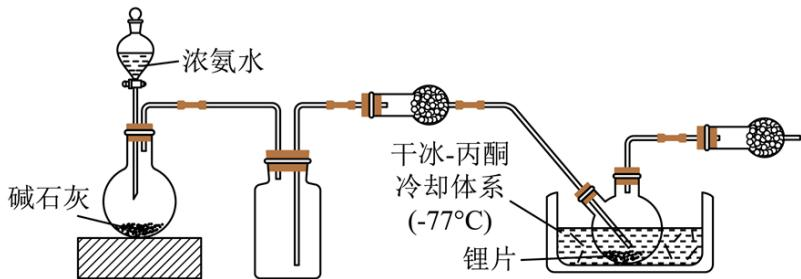

A. 碱石灰有利于 $\mathrm{NH}_{3}$ 逸出  
B. 锂片必须打磨出新鲜表面  
C. 干燥管中均可选用 $\mathrm{P}_{2} \mathrm{O}_{5}$

D. 双口烧瓶中发生的变化是 $Li + nNH_{3} = Li^{+} + \left[ e(NH_{3})_{n} \right]^{-}$

【答案】C

【解析】

【分析】本题利用 Li 和液氨反应 $Li + nNH_{3} = Li^{+} + \left[e(NH_{3})_{n}\right]^{-}$ 制备 $\left[e(NH_{3})_{n}\right]^{-}$ ；碱石灰可以吸收浓氨水中的水分，同时吸水过程大量放热，使浓氨水受热分解产生氨气；利用集气瓶收集氨气；过量的氨气进入双口烧瓶中在冷却体系中发生反应生成 $\left[\mathrm{e}\left(\mathrm{NH}_{3}\right)_{\mathrm{n}}\right]^{-}$ ；最后的球形干燥管中可装 $\mathrm{P}_{2} \mathrm{O}_{5}$ ，除掉过量的氨气，同时防止空气的水进入引起副反应。

【详解】A．碱石灰为生石灰和氢氧化钠的混合物，可以吸收浓氨水中的水分，同时吸水过程大量放热，有利于 $\mathrm{NH}_{3}$ 逸出，A 正确；

B．锂片表面有 $\mathrm{Li}_{2} \mathrm{O}$ ， $\mathrm{Li}_{2} \mathrm{O}$ 会阻碍 Li 和液氨的接触，所以必须打磨出新鲜表面，B 正确；

C．第一个干燥管目的是干燥氨气， $\mathrm{P}_{2} \mathrm{O}_{5}$ 为酸性干燥剂能与氨气反应，所以不能用 $\mathrm{P}_{2} \mathrm{O}_{5}$ ，而装置末端的干燥管作用为吸收过量的氨气，可用 $\mathrm{P}_{2} \mathrm{O}_{5}$ ，C 错误；

D．双口烧瓶中发生的变化是 $\mathrm{Li} + \mathrm{n} \mathrm{NH}_{3} = \mathrm{Li}^{+} + \left[\mathrm{e}\left(\mathrm{NH}_{3}\right)_{\mathrm{n}}\right]^{-}$ ，D 正确；

故选 C。

11. 黄金按质量分数分级，纯金为 24K 。Au-Cu 合金的三种晶胞结构如图，II和III是立方晶胞。下列说法错误的是

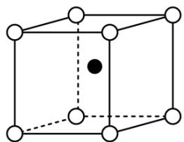  
I

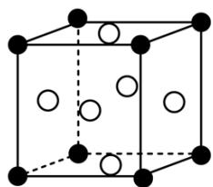  
II

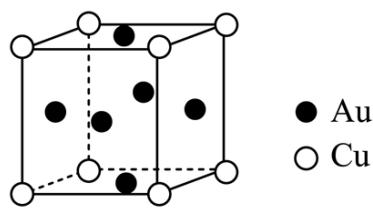  
III

A. I 为18K 金
B. II 中 Au 的配位数是 12
C. III 中最小核间距 Au-Cu < Au-Au
D. I、II、III 中，Au 与 Cu 原子个数比依次为 1:1、1:3、3:1

【答案】C

【解析】

【详解】A．由24K金的质量分数为100%，则18K金的质量分数为： $\frac{18}{24}\times100\%=75\%$ ，I中Au和Cu原子个数比值为1:1，则Au的质量分数为： $\frac{197}{197+64}\times100\%\approx75\%$ ，A正确；
B．II中 Au 处于立方体的八个顶点，Au 的配位数指距离最近的 Cu，Cu 处于面心处，类似于二氧化碳晶胞结构，二氧化碳分子周围距离最近的二氧化碳有 12 个，则 Au 的配位数为 12，B 正确；
C．设III的晶胞参数为 a，Au-Cu 的核间距为 $\frac{\sqrt{2}}{2}a$ ，Au-Au 的最小核间距也为 $\frac{\sqrt{2}}{2}a$ ，最小核间距

Au-Cu=Au-Au，C 错误；

D. I 中，Au 处于内部，Cu 处于晶胞的八个顶点，其原子个数比为 1:1；II 中，Au 处于立方体的八个顶点，Cu 处于面心，其原子个数比为： $8 \times \frac{1}{8} : 6 \times \frac{1}{2} = 1 : 3$ ；III 中，Au 处于立方体的面心，Cu 处于顶点，其原子个数比为 $6 \times \frac{1}{2} : 8 \times \frac{1}{8} = 3 : 1$ ；D 正确；故选 C。

12. $\mathrm{O}_{2}$ 在超高压下转化为平行六面体的 $\mathrm{O}_{8}$ 分子(如图)。下列说法错误的是

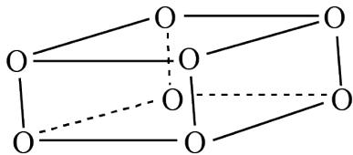

A. $\mathrm{O}_{2}$ 和 $\mathrm{O}_{8}$ 互为同素异形体 B. $\mathrm{O}_{8}$ 中存在不同的氧氧键 C. $\mathrm{O}_{2}$ 转化为 $\mathrm{O}_{8}$ 是熵减反应 D. 常压低温下 $\mathrm{O}_{8}$ 能稳定存在

【答案】D

【解析】

【详解】A. $O_{2}$ 和 $O_{8}$ 是 O 元素形成的不同单质，两者互为同素异形体，A 项正确；

B. $\mathrm{O_8}$ 分子为平行六面体, 由其结构知, $\mathrm{O_8}$ 中存在两种氧氧键: 上下底面中的氧氧键、上下底面间的氧氧键, B项正确;

C. $\mathrm{O}_2$ 转化为 $\mathrm{O}_8$ 可表示为 $4\mathrm{O}_2 \xlongequal{\text{超高压}} \mathrm{O}_8$ ，气体分子数减少，故 $\mathrm{O}_2$ 转化为 $\mathrm{O}_8$ 是熵减反应，C 项正确；  
D. $\mathrm{O}_2$ 在超高压下转化成 $\mathrm{O}_8$ ，则在常压低温下 $\mathrm{O}_8$ 会转化成 $\mathrm{O}_2$ ，不能稳定存在，D 项错误；答案选 D。

13. $CO_{2}$ 气氛下， $\mathrm{Pb}\left(\mathrm{ClO}_{4}\right)_{2}$ 溶液中含铅物种的分布如图。纵坐标( $\delta$ )为组分中铅占总铅的质量分数。已知 $\mathrm{c}_{0}\left(\mathrm{Pb}^{2+}\right)=2.0\times10^{-5}\mathrm{mol}\cdot\mathrm{L}^{-1}$ ， $\mathrm{pK}_{\mathrm{al}}\left(\mathrm{H}_{2}\mathrm{CO}_{3}\right)=6.4$ 、 $\mathrm{pK}_{\mathrm{a2}}\left(\mathrm{H}_{2}\mathrm{CO}_{3}\right)=10.3$ ， $\mathrm{pK}_{\mathrm{sp}}\left(\mathrm{PbCO}_{3}\right)=12.1$ 。

下列说法错误的是

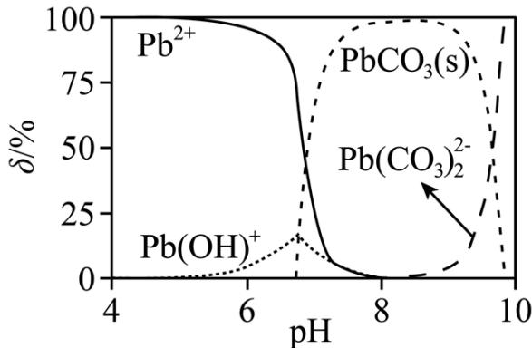

A. pH=6.5 时，溶液中 $c\left(\mathrm{CO}_{3}^{2-}\right)<c\left(\mathrm{Pb}^{2+}\right)$

B. $\delta (\mathrm{Pb}^{2 + }) = \delta (\mathrm{PbCO}_3)$ 时， $\mathbf{c}\big(\mathrm{Pb}^{2 + }\big) <   1.0\times 10^{-5}\mathrm{mol}\cdot \mathrm{L}^{-1}$

$$
2 \mathrm{c} \left(\mathrm{Pb} ^ {2 +}\right) + \mathrm{c} \left[ \mathrm{Pb} (\mathrm{OH}) ^ {+} \right] <   2 \mathrm{c} \left(\mathrm{CO} _ {3} ^ {2 -}\right) + \mathrm{c} \left(\mathrm{HCO} _ {3} ^ {-}\right) + \mathrm{c} \left(\mathrm{ClO} _ {4} ^ {-}\right)
$$

$$
\mathrm{NaHCO} _ {3} (\mathrm{s})
$$

$$
\mathrm{PbCO} _ {3}
$$

【答案】C

【解析】

【详解】A．由图可知，pH=6.5时δ(Pb²⁺)>50%，即c(Pb²⁺)>1×10⁻⁵mol/L，则c(CO₃²⁻)≤ $\frac{K_{sp}(PbCO_3)}{c(Pb^{2+})}$ = $\frac{10^{-12.1}}{1\times 10^{-5}}$ mol/L=10⁻⁷·¹mol/L<c(Pb²⁺)，A项正确；  
B．由图可知，δ(Pb²⁺)=δ(PbCO₃)时，溶液中还存在Pb(OH)⁺，根据c₀(Pb²⁺)=2.0×10⁻⁵mol/L和Pb守恒，溶液中c(Pb²⁺)<1.0×10⁻⁵mol/L，B项正确；  
C．溶液中的电荷守恒为  
2c(Pb²⁺)+c[Pb(OH)⁺]+c(H⁺)=2c(CO₃²⁻)+c(HCO₃⁻)+c(ClO₄⁻)+2c[Pb(CO₃)₂²⁻]+c(OH⁻)，pH=7时溶液中c(H⁺)=c(OH⁻)，则2c(Pb²⁺)+c[Pb(OH)⁺]=2c(CO₃²⁻)+c(HCO₃⁻)+c(ClO₄⁻)+2c[Pb(CO₃)₂²⁻]，C项错误；  
D．NaHCO₃溶液中HCO₃⁻的水解平衡常数为 $\frac{K_w}{K_{a1}(H_2CO_3)}=\frac{1\times 10^{-14}}{10^{-6.4}}=10^{-7.6}>K_{a2}(H_2CO_3)$ ，NaHCO₃溶液呈碱性，加入少量NaHCO₃固体，溶液pH增大，PbCO₃转化成Pb(CO₃)₂而溶解，D项正确；  
答案选C。  
14．我国科学家设计了一种双位点PbCu电催化剂，用H₂C₂O₄和NH₂OH电化学催化合成甘氨酸，原理如图，双极膜中H₂O解离的H⁺和OH⁻在电场作用下向两极迁移。已知在KOH溶液中，甲醛转化为

$\mathrm{HOCH}_2\mathrm{O}^-$ ，存在平衡 $\mathrm{HOCH}_2\mathrm{O}^- + \mathrm{OH}^- \rightleftharpoons [\mathrm{OCH}_2\mathrm{O}]^{2-} + \mathrm{H}_2\mathrm{O}$ 。Cu 电极上发生的电子转移反应为 $[\mathrm{OCH}_2\mathrm{O}]^{2-}-\mathrm{e}^- = \mathrm{HCOO}^- + \mathrm{H}\cdot$ 。下列说法错误的是

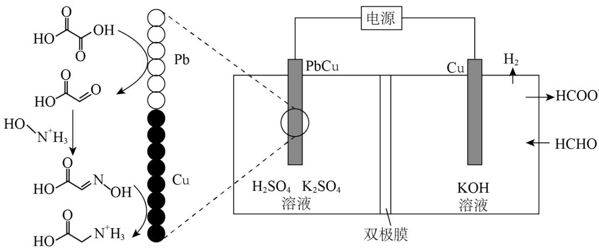

A. 电解一段时间后阳极区 $\mathrm{c(OH^{-})}$ 减小  
B. 理论上生成 $1\mathrm{molH}_3\mathrm{N}^+\mathrm{CH}_2\mathrm{COOH}$ 双极膜中有 $4\mathrm{molH}_2\mathrm{O}$ 解离  
C. 阳极总反应式为 $2\mathrm{HCHO} + 4\mathrm{OH}^{-} - 2\mathrm{e}^{-} = 2\mathrm{HCOO}^{-} + \mathrm{H}_{2}\uparrow +2\mathrm{H}_{2}\mathrm{O}$ D. 阴极区存在反应 $\mathrm{H}_2\mathrm{C}_2\mathrm{O}_4 + 2\mathrm{H}^+ +2\mathrm{e}^- = \mathrm{CHOCOOH} + \mathrm{H}_2\mathrm{O}$

【解析】

【分析】在 KOH 溶液中 HCHO 转化为  \( HOCH\_{2}O^{-}:HCHO+OH^{-}\rightarrow HOCH\_{2}O^{-} \) ，存在平衡  \( HOCH\_{2}O^{-}+OH^{-}\rightleftharpoons[OCH\_{2}O]^{2-}+H\_{2}O \) ，Cu 电极上发生的电子转移反应为  \( [OCH\_{2}O]^{2-}-e^{-}=HCOO^{-}+H\cdot \) ，H·结合成  \( H\_{2} \) ，Cu 电极为阳极；PbCu 电极为阴极，首先 HOOC—COOH 在 Pb 上发生得电子的还原反应转化为 OHC—COOH： \( H\_{2}C\_{2}O\_{4}+2e^{-}+2H^{+}=OHC—COOH+H\_{2}O \) ，OHC—COOH 与 HO— \( N^{+}H\_{3} \)  反应生成 HOOC—CH=N—OH：OHC—COOH+HO— \( N^{+}H\_{3}\rightarrow HOOC—CH=N—OH+H\_{2}O+H^{+} \) ，HOOC—CH=N—OH 发生得电子的还原反应转化成  \( H\_{3}N^{+}CH\_{2}COOH \) ：HOOC—CH=N—OH+4e^{-}+5H^{+}=H\_{3}N^{+}CH\_{2}COOH+H\_{2}O \) 。

【详解】A．根据分析，电解过程中，阳极区消耗 $OH^{-}$ 、同时生成 $H_{2}O$ ，故电解一段时间后阳极区 $c(OH^{-})$ 减小，A 项正确；

B. 根据分析, 阴极区的总反应为 $\mathrm{H}_{2} \mathrm{C}_{2} \mathrm{O}_{4} + \mathrm{HO}-\mathrm{N}^{+} \mathrm{H}_{3} + 6 \mathrm{e}^{-} + 6 \mathrm{H}^{+} = \mathrm{H}_{3} \mathrm{~N}^{+} \mathrm{CH}_{2} \mathrm{COOH} + 3 \mathrm{H}_{2} \mathrm{O}$ , $1 \mathrm{~mol} \mathrm{H}_{2} \mathrm{O}$ 解离成 $1 \mathrm{~mol} \mathrm{H}^{+}$ 和 $1 \mathrm{~mol} \mathrm{OH}^{-}$ , 故理论上生成 $1 \mathrm{~mol} \mathrm{H}_{3} \mathrm{~N}^{+} \mathrm{CH}_{2} \mathrm{COOH}$ 双极膜中有 $6 \mathrm{~mol} \mathrm{H}_{2} \mathrm{O}$ 解离, B 项错误; C. 根据分析, 结合装置图, 阳极总反应为 $2 \mathrm{HCHO}-2 \mathrm{e}^{-} + 4 \mathrm{OH}^{-}=2 \mathrm{HCOO}^{-} + \mathrm{H}_{2} \uparrow + 2 \mathrm{H}_{2} \mathrm{O}$ , C 项正确; D. 根据分析, 阴极区的 Pb 上发生反应 $\mathrm{H}_{2} \mathrm{C}_{2} \mathrm{O}_{4} + 2 \mathrm{e}^{-} + 2 \mathrm{H}^{+}= \mathrm{OHC}-\mathrm{COOH} + \mathrm{H}_{2} \mathrm{O}$ , D 项正确; 答案选 B。

15. 科学家合成了一种如图所示的纳米 “分子客车”，能装载多种稠环芳香烃。三种芳烃与 “分子客车” 的结合常数(值越大越稳定)见表。下列说法错误的是

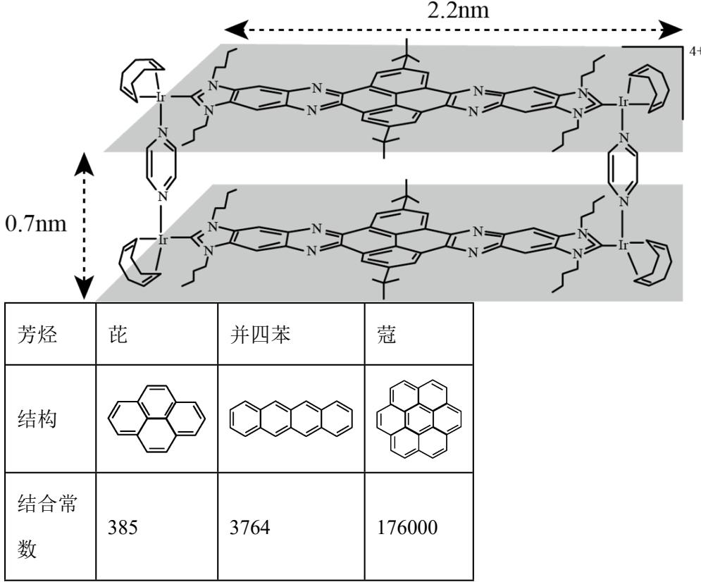

A. 芳烃与“分子客车”可通过分子间相互作用形成超分子  
B. 并四苯直立装载与平躺装载的稳定性基本相同  
C. 从分子大小适配看“分子客车”可装载2个芘  
D. 芳烃 $\pi$ 电子数越多越有利于和“分子客车”的结合

【答案】B

【解析】

【详解】A. “分子客车”能装载多种稠环芳香烃，故芳烃与“分子客车”通过分子间作用力形成分子聚集体——超分子，A项正确；  
B. “分子客车”的长为 $2.2\mathrm{nm}$ 、高为 $0.7\mathrm{nm}$ ，从长的方向观察，有与并四苯分子适配的结构，从高的方向观察则缺少合适结构，故平躺装载的稳定性大于直立装载的稳定性，B项错误；  
C. 芘与“分子客车”中中间部分结构大小适配，故从分子大小适配看“分子客车”可装载2个芘，C项正确；  
D. 芘、并四苯、蔻中 $\pi$ 电子数逐渐增多，与“分子客车”的结合常数逐渐增大，而结合常数越大越稳定，故芳烃 $\pi$ 电子数越多越有利于和“分子客车”结合，D项正确；  
答案选B。

## 二、非选择题：本题共4小题，共55分。

16. 铍用于宇航器件的构筑。一种从其铝硅酸盐 $\left[\mathrm{Be}_{3} \mathrm{Al}_{2}\left(\mathrm{SiO}_{3}\right)_{6}\right]$ 中提取铍的路径为：

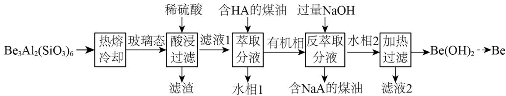

已知： $Be^{2+}+4HA\rightleftharpoons BeA_{2}(HA)_{2}+2H^{+}$

回答下列问题:

(1) 基态 $\mathrm{Be}^{2+}$ 的轨道表示式为 \_\_\_\_。

(2) 为了从 “热熔、冷却” 步骤得到玻璃态, 冷却过程的特点是\_\_\_\_。

(3) “萃取分液”的目的是分离 $\mathrm{Be}^{2+}$ 和 $\mathrm{Al}^{3+}$ , 向过量烧碱溶液中逐滴加入少量“水相 1”的溶液, 观察到的现象是\_\_\_\_。

（4）写出反萃取生成 $\mathrm{Na}_{2}\left[\mathrm{Be}(\mathrm{OH})_{4}\right]$ 的化学方程式 \_\_\_\_。“滤液 2”可以进入\_\_\_\_步骤再利用。

（5）电解熔融氯化铍制备金属铍时，加入氯化钠的主要作用是\_\_\_\_。

(6) $\mathrm{Be(OH)}_{2}$ 与醋酸反应得到某含 4 个 Be 的配合物, 4 个 Be 位于以 1 个 O 原子为中心的四面体的 4 个顶点, 且每个 Be 的配位环境相同, Be 与 Be 间通过 $\mathrm{CH}_{3} \mathrm{COO}$ 相连, 其化学式为\_\_\_\_。

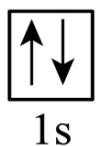

【答案】(1)

(2) 快速冷却

(3) 无明显现象 (4) ①. $\mathrm{BeA}_{2}(\mathrm{HA})_{2} + 6\mathrm{NaOH} = \mathrm{Na}_{2}[\mathrm{Be(OH)}_{4}] + 4\mathrm{NaA} + 2\mathrm{H}_{2}\mathrm{O}$ ②. 反萃取

(5) 增强熔融氯化铍的导电性

(6) $\mathrm{Be}_{4}\mathrm{O}(\mathrm{CH}_{3}\mathrm{COO})_{6}$

【解析】

【分析】本题是化工流程的综合考察，首先铝硅酸盐先加热熔融，然后快速冷却到其玻璃态，再加入稀硫酸酸浸过滤，滤渣的成分为 $H_{2}SiO_{3}$ ，“滤液 1”中有 $Be^{2+}$ 和 $Al^{3+}$ ，加入含 HA 的煤油将 $Be^{2+}$ 萃取到有机相中，水相 1 中含有 $Al^{3+}$ ，有机相为 $\mathrm{BeA}_{2}(\mathrm{HA})_{2}$ ，加入过量氢氧化钠反萃取 $Be^{2+}$ 使其转化为 $\mathrm{Na}_{2}[\mathrm{Be(OH)}_{4}]$ 进入水相 2 中，分离出含 NaA 的煤油，最后对水相 2 加热过滤，分离出 $\mathrm{Be(OH)}_{2}$ ，通过系列操作得到金属铍，据此回答。

【小问 1 详解】

基态 $Be^{2+}$ 的电子排布式为 $1s^{2}$ ，其轨道表达式为 $\boxed{\uparrow\downarrow}$ 1s。

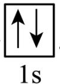

【小问 2 详解】

熔融态物质冷却凝固时，缓慢冷却会形成晶体，快速冷却会形成非晶态，即玻璃态，所以从“热熔、冷却”中得到玻璃态，其冷却过程的特点为：快速冷却。

【小问 3 详解】

“滤液 1”中有 $Be^{2+}$ 和 $Al^{3+}$ ，加入含 HA 的煤油将 $Be^{2+}$ 萃取到有机相中，则水相 1 中含有 $Al^{3+}$ ，则向过量烧碱的溶液中逐滴加入少量水相 1 的溶液，可观察到的现象为：无明显现象。

【小问 4 详解】

反萃取生成 $\mathrm{Na}_{2}[\mathrm{Be(OH)}_{4}]$ 的化学方程式为 $\mathrm{BeA}_{2}(\mathrm{HA})_{2}+6\mathrm{NaOH}=\mathrm{Na}_{2}[\mathrm{Be(OH)}_{4}]+4\mathrm{NaA}+2\mathrm{H}_{2}\mathrm{O}$ ，滤液 2 的主要成分为 NaOH，可进入反萃取步骤再利用。

【小问 5 详解】

氯化铍的共价性较强，电解熔融氯化铍制备金属铍时，加入氯化钠的主要作用为增强熔融氯化铍的导电性。【小问6详解】

由题意可知，该配合物中有四个铍位于四面体的四个顶点上，四面体中心只有一个 O，Be 与 Be 之间总共有六个 $CH_{3}COO^{-}$ ，则其化学式为： $\mathrm{Be}_{4}\mathrm{O}(\mathrm{CH}_{3}\mathrm{COO})_{6}$ 。

17. 用 $\mathrm{BaCO_3}$ 和焦炭为原料，经反应I、II得到 $\mathrm{BaC}_2$ ，再制备乙炔是我国科研人员提出的绿色环保新路线。

反应 I: $\mathrm{BaCO_{3}(s)+C(s)\rightleftharpoons BaO(s)+2CO(g)}$

反应II: $\mathrm{BaO(s)+3C(s)\rightleftharpoons BaC_{2}(s)+CO(g)}$

回答下列问题:

(1) 写出 $BaC_{2}$ 与水反应的化学方程式 \_\_\_\_。

（2）已知 $K_{p}=\left(p_{CO}\right)^{n}$ 、 $K=\left(\frac{p_{CO}}{10^{5}Pa}\right)^{n}$ (n 是 CO 的化学计量系数)。反应、II 的 1gK 与温度的关系曲线见图 1。

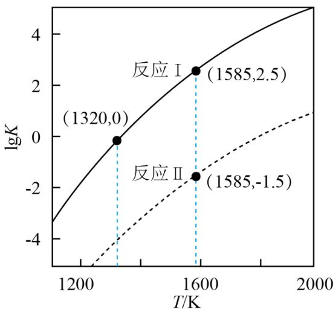  
图1 lgK与T的关系曲线

①反应 $\mathrm{BaCO}_{3}(\mathrm{s})+4\mathrm{C}(\mathrm{s})\rightleftharpoons\mathrm{BaC}_{2}(\mathrm{s})+3\mathrm{CO}(\mathrm{g})$ 在1585K的 $K_{p}=$ \_\_\_\_ $Pa^{3}$

②保持1320K不变，假定恒容容器中只发生反应I，达到平衡时 $p_{CO}=$ \_\_\_\_ Pa，若将容器体积压缩到原来的 $\frac{1}{2}$ ，重新建立平衡后 $p_{CO}=$ \_\_\_\_ Pa。

(3) 恒压容器中, 焦炭与 $\mathrm{BaCO}_{3}$ 的物质的量之比为 $4:1$ , $\mathrm{Ar}$ 为载气。 $400 \mathrm{~K}$ 和 $1823 \mathrm{~K}$ 下, $\mathrm{BaC}_{2}$ 产率随时间的关系曲线依实验数据拟合得到图 2(不考虑接触面积的影响)。

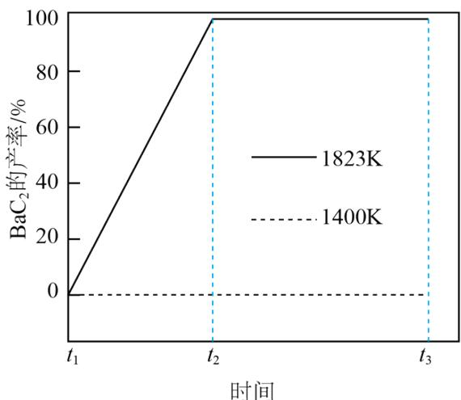  
图2 $BaC_{2}$ 产率与时间的关系曲线

①初始温度为 $900 \mathrm{~K}$ , 缓慢加热至 $1400 \mathrm{~K}$ 时, 实验表明 $\mathrm{BaCO}_{3}$ 已全部消耗, 此时反应体系中含 Ba 物种为\_\_\_\_。

②1823K 下，反应速率的变化特点为\_\_\_\_，其原因是\_\_\_\_。

【答案】(1) $BaC_{2}+2H_{2}O\rightarrow Ba(OH)_{2}+HC\equiv CH\uparrow$

(2) ①. $10^{16}$ ②. $10^{5}$ ③. $10^{5}$

(3) ①. BaO ②. 速率不变至 $\mathrm{BaC}_{2}$ 产率接近 $100\%$ ③. 容器中只有反应II: $\mathrm{BaO(s)} + 3\mathrm{C(s)} \rightleftharpoons$ $\mathrm{BaC}_{2}(\mathrm{s}) + \mathrm{CO}(\mathrm{g})$ ，反应条件恒温 $1823\mathrm{K}$ 、恒压，且该反应只有CO为气态，据 $\mathrm{K} = \frac{\mathrm{p}_{\mathrm{CO}}}{10^{5}\mathrm{p}_{\mathrm{a}}}$ 可知，CO的压强为定值，所以化学反应速率不变

【解析】

【小问 1 详解】

Ba、Ca 元素同主族，所以 $BaC_{2}$ 与水的反应和 $CaC_{2}$ 与水的反应相似，其反应的化学方程式为 $BaC_{2} + 2H_{2}O \rightarrow Ba(OH)_{2} + HC \equiv CH \uparrow$ ;

【小问 2 详解】

①反应 I+ 反应 II 得 $\mathrm{BaCO}_{3}(\mathrm{s}) + 4\mathrm{C}(\mathrm{s}) \rightleftharpoons \mathrm{BaC}_{2}(\mathrm{s}) + 3\mathrm{CO}(\mathrm{g})$ ，所以其平衡常数 $K = K_{I} \times K_{II} = \left( \frac{p_{CO}}{10^{5} p_{a}} \right)^{3}$ ，由图 1 可知，1585K 时 $K_{I} = 10^{2.5}$ ， $K_{II} = 10^{-1.5}$ ，即 $\left( \frac{p_{CO}}{10^{5} p_{a}} \right)^{3} = 10^{2.5} \times 10^{-1.5} = 10$ ，所以 $p^{3}_{CO} = 10 \times (10^{5} pa)^{3} = 10^{16} p_{a}^{3}$ ，则 $K_{p} = p^{3}_{CO} = 10^{16} p_{a}^{3}$ ;

②由图1可知，1320K时反应I的 $K_{I}=10^{0}=1$ ，即 $K_{I}=\left(\frac{p_{CO}}{10^{5}p_{a}}\right)^{2}=1$ ，所以 $p_{CO}^{2}=(10^{5}pa)^{2}$ ，即 $p_{CO}=10^{5}pa$ ；
③若将容器体积压缩到原来的 $\frac{1}{2}$ ，由于温度不变、平衡常数不变，重新建立平衡后 $p_{CO}$ 应不变，即 $p_{CO}=10^{5}pa$ ;

【小问 3 详解】

①由图 2 可知，1400K 时， $BaC_{2}$ 的产率为 0，即没有 $BaC_{2}$ ，又实验表明 $BaBO_{3}$ 已全部消耗，所以此时反应体系中含 Ba 物种为 BaO；

②图像显示，1823K 时 $BaC_{2}$ 的产率随时间由 0 开始呈直线增加到接近 100%，说明该反应速率为一个定值，即速率保持不变；1400K 时碳酸钡已全部消耗，此时反应体系的含钡物种只有氧化钡，即只有反应 II: $\mathrm{BaO(s)+3C(s)\rightleftharpoons BaC_{2}(s)+CO(g)}$ ，反应条件恒温 1823K、恒压，且该反应只有 CO 为气态，据 $K=\frac{p_{CO}}{10^{5}p_{a}}$ 可知，CO 的压强为定值，所以化学反应速率不变。

18. 学习小组为探究 $Co^{2+}$ 、 $Co^{3+}$ 能否催化 $H_{2}O_{2}$ 的分解及相关性质，室温下进行了实验 I\~IV。

<table><tr><td>实验I</td><td>实验II</td><td>实验III</td></tr><tr><td>1 mL 30% $H_2O_2$ 6 mL 1 mol·L-1CoSO4</td><td>6 mL 1 mol·L-1CoSO416 mL 4 mol·L-1CsHCO3</td><td></td></tr><tr><td>无明显变化</td><td>溶液变为红色,伴有气泡产生</td><td>溶液变为墨绿色,并持续产生能使带火星木条复燃的气体</td></tr></table>

已知： $\left[\mathrm{Co}\left(\mathrm{H}_2\mathrm{O}\right)_6\right]^{2+}$ 为粉红色、 $\left[\mathrm{Co}\left(\mathrm{H}_2\mathrm{O}\right)_6\right]^{3+}$ 为蓝色、 $\left[\mathrm{Co}\left(\mathrm{CO}_3\right)_2\right]^{2-}$ 为红色、 $\left[\mathrm{Co}\left(\mathrm{CO}_3\right)_3\right]^{3-}$ 为墨绿色。回答下列问题：

(1) 配制 $1.00 \mathrm{~mol} \cdot \mathrm{L}^{- 1}$ 的 $\mathrm{CoSO}_4$ 溶液, 需要用到下列仪器中的 (填标号)。

a.

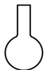

b.

c.

(2) 实验 I 表明 $\left[\mathrm{Co}\left(\mathrm{H}_{2} \mathrm{O}\right)_{6}\right]^{2+}$ \_\_\_\_ (填 “能” 或 “不能”) 催化 $\mathrm{H}_{2} \mathrm{O}_{2}$ 的分解。实验 II 中 $\mathrm{HCO}_{3}^{-}$ 大大过量的原因是\_\_\_\_。实验 III 初步表明 $\left[\mathrm{Co}\left(\mathrm{CO}_{3}\right)_{3}\right]^{3-}$ 能催化 $\mathrm{H}_{2} \mathrm{O}_{2}$ 的分解, 写出 $\mathrm{H}_{2} \mathrm{O}_{2}$ 在实验 III 中所发生反应的离子方程式\_\_\_\_、\_\_\_\_。

（3）实验I表明，反应 $2\left[\mathrm{Co}\left(\mathrm{H}_{2}\mathrm{O}\right)_{6}\right]^{2+} + \mathrm{H}_{2}\mathrm{O}_{2} + 2\mathrm{H}^{+} \rightleftharpoons 2\left[\mathrm{Co}\left(\mathrm{H}_{2}\mathrm{O}\right)_{6}\right]^{3+} + 2\mathrm{H}_{2}\mathrm{O}$ 难以正向进行，利用化学平衡移动原理，分析 $\mathrm{Co}^{3+}$ 、 $\mathrm{Co}^{2+}$ 分别与 $\mathrm{CO}_3^{2-}$ 配位后，正向反应能够进行的原因\_\_\_\_。

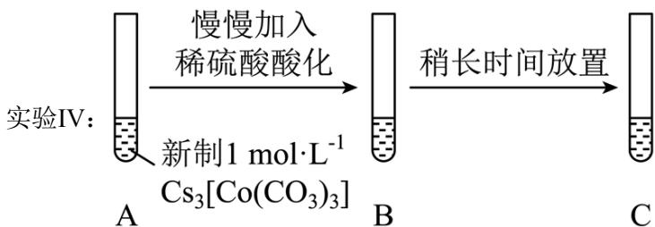

(4) 实验IV中, A 到 B 溶液变为蓝色, 并产生气体; B 到 C 溶液变为粉红色, 并产生气体。从 A 到 C 所产生的气体的分子式分别为\_\_\_\_、\_\_\_\_。

【答案】(1) bc (2) ①. 不能 ②. $\mathrm{HCO}_{3}^{-}$ 与 $\mathrm{Co}^{2+}$ 按物质的量之比4:1发生反应 $4\mathrm{HCO}_{3}^{-} + \mathrm{Co}^{2+} = \left[\mathrm{Co}\left(\mathrm{CO}_{3}\right)_{2}\right]^{2-} + 2\mathrm{CO}_{2}\uparrow + 2\mathrm{H}_{2}\mathrm{O}$ , 实验中 $\mathrm{HCO}_{3}^{-}$ 与 $\mathrm{Co}^{2+}$ 的物质的量之比为32:3 ③. $2\mathrm{Co}^{2+} + 10\mathrm{HCO}_{3}^{-} + \mathrm{H}_{2}\mathrm{O}_{2} = 2\left[\mathrm{Co}\left(\mathrm{CO}_{3}\right)_{3}\right]^{3-} + 6\mathrm{H}_{2}\mathrm{O} + 4\mathrm{CO}_{2}\uparrow$ ④.

$$
2 \mathrm{H} _ {2} \mathrm{O} _ {2} \xlongequal {\left[ \mathrm{Co} \left(\mathrm{CO} _ {3}\right) _ {3} \right] ^ {3 -}} 2 \mathrm{H} _ {2} \mathrm{O} _ {2} + \mathrm{O} _ {2} \uparrow
$$

（3）实验III的现象表明， $\mathrm{Co}^{3+}$ 、 $\mathrm{Co}^{2+}$ 分别与 $\mathrm{CO}_{3}^{2-}$ 配位时， $\left[\mathrm{Co}\left(\mathrm{H}_{2} \mathrm{O}\right)_{6}\right]^{3+}$ 更易与 $\mathrm{CO}_{3}^{2-}$ 反应生成 $\left[\mathrm{Co}\left(\mathrm{CO}_{3}\right)_{3}\right]^{3-}$ （该反应为快反应），导致 $\left[\mathrm{Co}\left(\mathrm{H}_{2} \mathrm{O}\right)_{6}\right]^{2+}$ 几乎不能转化为 $\left[\mathrm{Co}\left(\mathrm{CO}_{3}\right)_{2}\right]^{2-}$ ，这样使得 $\left[\mathrm{Co}\left(\mathrm{H}_{2} \mathrm{O}\right)_{6}\right]^{3+}$ 的浓度减小的幅度远远大于 $\left[\mathrm{Co}\left(\mathrm{H}_{2} \mathrm{O}\right)_{6}\right]^{2+}$ 减小的幅度，根据化学平衡移动原理，减小生成物浓度能使化学平衡向正反应方向移动，因此，上述反应能够正向进行
(4) ①. $\mathrm{CO}_{2}$ ②. $\mathrm{O}_{2}$

【解析】

【分析】本题探究 $Co^{2+}$ 、 $Co^{3+}$ 能否催化 $H_{2}O_{2}$ 的分解及相关性质。实验 I 中无明显变化，证明 $\left[\mathrm{Co}\left(\mathrm{H}_{2}\mathrm{O}\right)_{6}\right]^{2+}$ 不能催化 $H_{2}O_{2}$ 的分解；实验 II 中溶液变为红色，证明 $\left[\mathrm{Co}\left(\mathrm{H}_{2}\mathrm{O}\right)_{6}\right]^{2+}$ 易转化为 $\left[\mathrm{Co}\left(\mathrm{CO}_{3}\right)_{2}\right]^{2-}$ ；实验 III 中溶液变为墨绿色，说明 $\left[\mathrm{Co}\left(\mathrm{H}_{2}\mathrm{O}\right)_{6}\right]^{3+}$ 更易与 $CO_{3}^{2-}$ 反应生成 $\left[\mathrm{Co}\left(\mathrm{CO}_{3}\right)_{3}\right]^{3-}$ ，并且初步证明 $\left[\mathrm{Co}\left(\mathrm{H}_{2}\mathrm{O}\right)_{6}\right]^{2+}$ 在 $HCO_{3}^{-}$ 的作用下易被 $H_{2}O_{2}$ 氧化为 $\left[\mathrm{Co}\left(\mathrm{CO}_{3}\right)_{3}\right]^{3-}$ ；实验 IV 中溶液先变蓝后变红，并且前后均有气体生成，证明在酸性条件下， $\left[\mathrm{Co}\left(\mathrm{CO}_{3}\right)_{3}\right]^{3-}$ 易转化为 $\left[\mathrm{Co}\left(\mathrm{H}_{2}\mathrm{O}\right)_{6}\right]^{3+}$ ， $\left[\mathrm{Co}\left(\mathrm{H}_{2}\mathrm{O}\right)_{6}\right]^{3+}$ 氧化性强，可以把 $H_{2}O$ 氧化为 $O_{2}$ 。

【小问 1 详解】

配制 $1.00 \, mol \cdot L^{-1}$ 的 $CoSO_{4}$ 溶液，需要用到容量瓶、胶头滴管等等，因此选 bc。

【小问 2 详解】

$\mathrm{CoSO_4}$ 溶液中存在大量的 $\left[\mathrm{Co}\left(\mathrm{H}_2\mathrm{O}\right)_6\right]^{2+}$ ，向其中加入 $30\%$ 的 $\mathrm{H}_2\mathrm{O}_2$ 后无明显变化，因此，实验I表明 $\left[\mathrm{Co}\left(\mathrm{H}_2\mathrm{O}\right)_6\right]^{2+}$ 不能催化 $\mathrm{H}_2\mathrm{O}_2$ 的分解。实验II中发生反应的离子方程式为 $4\mathrm{HCO}_3^- + \mathrm{Co}^{2+} = \left[\mathrm{Co}\left(\mathrm{CO}_3\right)_2\right]^{2-} + 2\mathrm{CO}_2 \uparrow + 2\mathrm{H}_2\mathrm{O}$ ，实验中 $\mathrm{HCO}_3^-$ 与 $\mathrm{Co}^{2+}$ 的物质的量之比为32:3，因此， $\mathrm{HCO}_3^-$ 大大过量的原因是： $\mathrm{HCO}_3^-$ 与 $\mathrm{Co}^{2+}$ 按物质的量之比4:1发生反应 $4\mathrm{HCO}_3^-$ + $\mathrm{Co}^{2+} = \left[\mathrm{Co}\left(\mathrm{CO}_3\right)_2\right]^{2-} + 2\mathrm{CO}_2 \uparrow + 2\mathrm{H}_2\mathrm{O}$ ，实验中 $\mathrm{HCO}_3^-$ 与 $\mathrm{Co}^{2+}$ 的物质的量之比为32:3。实验III的实验现象表明在 $\mathrm{H}_2\mathrm{O}_2$ 的作用下 $\mathrm{Co}^{2+}$ 能与 $\mathrm{HCO}_3^-$ 反应生成 $\left[\mathrm{Co}\left(\mathrm{CO}_3\right)_3\right]^{3-}$ ，然后 $\left[\mathrm{Co}\left(\mathrm{CO}_3\right)_3\right]^{3-}$ 能催化 $\mathrm{H}_2\mathrm{O}_2$ 的分解，因此， $\mathrm{H}_2\mathrm{O}_2$ 在实验III中所发生反应的离子方程式为

$$
2 \mathrm{Co} ^ {2 +} + 1 0 \mathrm{HCO} _ {3} ^ {-} + \mathrm{H} _ {2} \mathrm{O} _ {2} = 2 \left[ \mathrm{Co} \left(\mathrm{CO} _ {3}\right) _ {3} \right] ^ {3 -} + 6 \mathrm{H} _ {2} \mathrm{O} + 4 \mathrm{CO} _ {2} \uparrow , 2 \mathrm{H} _ {2} \mathrm{O} _ {2} \xlongequal {\left[ \mathrm{Co} \left(\mathrm{CO} _ {3}\right) _ {3} \right] ^ {3 -}} 2 \mathrm{H} _ {2} \mathrm{O} _ {2} + \mathrm{O} _ {2}
$$

【小问 3 详解】

实验I表明，反应 $2\left[\mathrm{Co}\left(\mathrm{H}_{2}\mathrm{O}\right)_{6}\right]^{2+} + \mathrm{H}_{2}\mathrm{O}_{2} + 2\mathrm{H}^{+} \rightleftharpoons 2\left[\mathrm{Co}\left(\mathrm{H}_{2}\mathrm{O}\right)_{6}\right]^{3+} + 2\mathrm{H}_{2}\mathrm{O}$ 难以正向进行。实验III的现象表明， $\mathrm{Co}^{3+}$ 、 $\mathrm{Co}^{2+}$ 分别与 $\mathrm{CO}_3^{2-}$ 配位时， $\left[\mathrm{Co}\left(\mathrm{H}_{2}\mathrm{O}\right)_{6}\right]^{3+}$ 更易与 $\mathrm{CO}_3^{2-}$ 反应生成 $\left[\mathrm{Co}\left(\mathrm{CO}_3\right)_3\right]^{3-}$ （该反应为快反应），导致 $\left[\mathrm{Co}\left(\mathrm{H}_{2}\mathrm{O}\right)_{6}\right]^{2+}$ 几乎不能转化为 $\left[\mathrm{Co}\left(\mathrm{CO}_3\right)_2\right]^{2-}$ ，这样使得 $\left[\mathrm{Co}\left(\mathrm{H}_{2}\mathrm{O}\right)_{6}\right]^{3+}$ 的浓度减小的幅度远远大于 $\left[\mathrm{Co}\left(\mathrm{H}_{2}\mathrm{O}\right)_{6}\right]^{2+}$ 减小的幅度，根据化学平衡移动原理，减小生成物浓度能使化学平衡向正反应方向移动，因此，上述反应能够正向进行。

## 【小问 4 详解】

实验IV中，A 到 B 溶液变为蓝色，并产生气体，说明发生了

$\left[\mathrm{Co}\left(\mathrm{CO}_{3}\right)_{3}\right]^{3-} + 6\mathrm{H}^{+} + 3\mathrm{H}_{2}\mathrm{O} = \left[\mathrm{Co}\left(\mathrm{H}_{2}\mathrm{O}\right)_{6}\right]^{3+} + 3\mathrm{CO}_{2}\uparrow$ ；B到C溶液变为粉红色，并产生气体，说明发生了 $4\left[\mathrm{Co}\left(\mathrm{H}_{2}\mathrm{O}\right)_{6}\right]^{3+} + 2\mathrm{H}_{2}\mathrm{O} = 4\left[\mathrm{Co}\left(\mathrm{H}_{2}\mathrm{O}\right)_{6}\right]^{2+} + \mathrm{O}_{2}\uparrow + 4\mathrm{H}^{+}$ ，因此从A到C所产生的气体的分子式分别为 $\mathrm{CO}_{2}$ 和 $\mathrm{O}_{2}$ 。

19. 某研究小组按以下路线对内酰胺 F 的合成进行了探索:

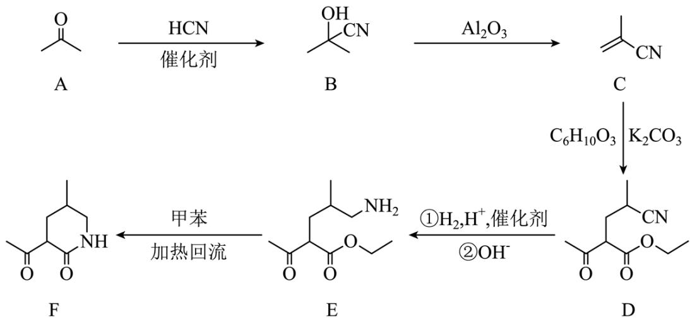  
回答下列问题:

(1) 从实验安全角度考虑, $\mathrm{A} \rightarrow \mathrm{B}$ 中应连有吸收装置, 吸收剂为\_\_\_\_。

(2) C 的名称为\_\_\_\_，它在酸溶液中用甲醇处理，可得到制备\_\_\_\_(填标号)的原料。
a. 涤纶    b. 尼龙    c. 维纶    d. 有机玻璃

(3) 下列反应中不属于加成反应的有\_\_\_\_(填标号)。
a. A→B b. B→C c. E→F

(4) 写出 C→D 的化学方程式\_\_\_\_。

（5）已知 $\mathrm{COO} \xrightarrow{\mathrm{R-NH_2}} \mathrm{N}^{\mathrm{R}}$ (亚胺)。然而，E在室温下主要生成G，原因是\_\_\_\_。

(6) 已知亚胺易被还原。 $\mathrm{D} \rightarrow \mathrm{E}$ 中, 催化加氢需在酸性条件下进行的原因是 , 若催化加氢时, 不加入酸, 则生成分子式为 $\mathrm{C}_{10} \mathrm{H}_{19} \mathrm{NO}_{2}$ 的化合物 $\mathrm{H}$ , 其结构简式为 。

【答案】(1) NaOH 溶液(或其他碱液)

(2) ①.2-甲基-2-丙烯腈(甲基丙烯腈、异丁烯腈) ②.d

(3) bc (4)

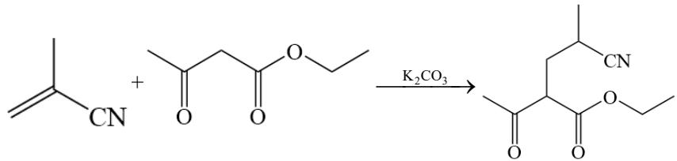

（5）亚胺不稳定，以发生重排反应生成有机化合物 G

(6) ①. 氰基与氢气发生加成反应生成亚胺结构生成的亚胺结构更易被还原成氨基，促进反应的发生

②.

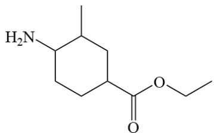

【解析】

【分析】有机物 A 与 HCN 在催化剂的作用下发生加成反应生成有机物 B，有机物 B 在 $Al_{2}O_{3}$ 的作用下发生消去反应剩下有机物 C，有机物 C 与 $C_{6}H_{10}O_{3}$ 发生反应生成有机物 D，根据有机物 D 的结构可以推测， $C_{6}H_{10}O_{3}$

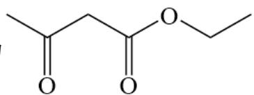

的结构为 $\mathrm{C(O)CH_2COOCH_2}$ ，有机物D发生两步连续的反应生成有机物E，有机物D中的氰基最

终反应为- $CH_{2}NH_{2}$ 结构，最后有机物E发生消去反应生成有机物F和乙醇。

【小问 1 详解】

有机物 A→B 的反应中有 HCN 参加反应，HCN 有毒，需要用碱液吸收，可用的吸收液为 NaOH 溶液。

【小问 2 详解】

根据有机物 C 的结构，有机物 C 的的名称为 2-甲基-2-丙烯腈(甲基丙烯腈、异丁烯腈)，该物质可以与甲醇在酸性溶液中发生反应生成甲基丙烯酸，甲基丙烯酸经聚合反应生成有机玻璃，答案选 d。

【小问3详解】

根据分析，有机物 A 反应生成有机物 B 的过程为加成反应，有机物 B 生成有机物 C 的反应为消去反应，有机物 E 生成有机物 F 的反应为消去反应，故答案选 bc。

【小问4详解】

根据分析，有机物 C 与 $\ce{CH2=CH-CH2-C(=O)-O-CH2}$ 发生加成反应生成有机物 D，反应的化学方程式为

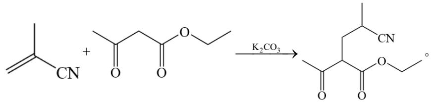

【小问5详解】

羰基与氨基发生反应生成亚胺( $N_{2}$ )，亚胺在酸性条件下不稳定，容易发生重排反应生成

有机物 G，有机物 G 在室温下具有更高的共轭结构，性质更稳定。

【小问6详解】

氰基与氢气发生加成反应生成亚胺结构生成的亚胺结构更易被还原成氨基，促进反应的发生；若不加入

酸，则生成分子式为 $\mathrm{C_{10}H_{19}NO_2}$ 的化合物H，其可能的流程为

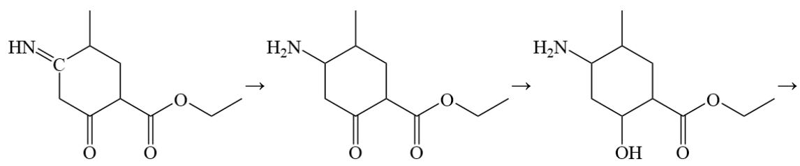

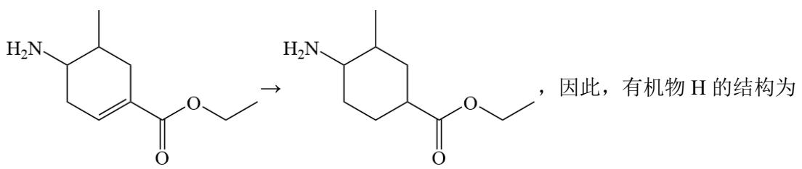

H₂N-C₆H₄-C(=O)-OCH₂CH⁺