# 化学试题

可能用到的相对原子质量：H1 C12 N14 O16 Cl35.5 Cu64

## 一、选择题：本题共14小题，每小题3分，共42分。在每小题给出的四个选项中，只有一项是符合题目要求的。

1. 近年来，我国新能源产业得到了蓬勃发展，下列说法错误的是
A. 理想的新能源应具有资源丰富、可再生、对环境无污染等特点
B. 氢氧燃料电池具有能量转化率高、清洁等优点
C. 锂离子电池放电时锂离子从负极脱嵌，充电时锂离子从正极脱嵌
D. 太阳能电池是一种将化学能转化为电能的装置

【答案】D

【解析】

【详解】A．理想的新能源应具有可再生、无污染等特点，故 A 正确；
B．氢氧燃料电池利用原电池将化学能转化为电能，对氢气与氧气反应的能量进行利用，减小了直接燃烧的热量散失，产物无污染，故具有能量转化率高、清洁等优点，B 正确；
C．脱嵌是锂从电极材料中出来的过程，放电时，负极材料产生锂离子，则锂离子在负极脱嵌，则充电时，锂离子在阳极脱嵌，C 正确；
D．太阳能电池是一种将太阳能能转化为电能的装置，D 错误；
本题选 D。

2. 下列化学用语表述错误的是
A. NaOH 的电子式: $Na^{+}[:\ddot{O}:H]^{-}$ B. 异丙基的结构简式: $\begin{array}{c} -CH-CH_{3} \\ | \\ CH_{3} \end{array}$

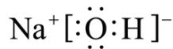

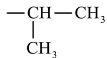

C. NaCl 溶液中的水合离子:

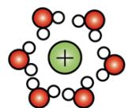

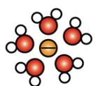

D. $\mathrm{Cl}_{2}$ 分子中 $\sigma$ 键的形成:

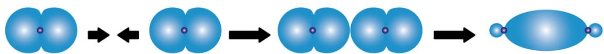

轨道相互靠拢

轨道相互重叠

形成共价单键

【答案】C

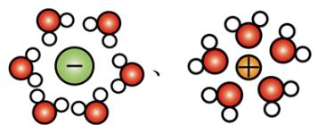

【解析】

【详解】A. NaOH 由 $\mathrm{Na}^{+}$ 和 $\mathrm{OH}^{-}$ 构成，电子式为： $\mathrm{Na}^{+}[:\ddot{\mathrm{O}}: \mathrm{H}]^{-}$ ，故 A 正确；

B. 异丙基的结构简式: $\begin{array}{c}\text{-CH-CH}_3\\ \mid \\ \mathrm{CH}_3\end{array}$ ，故B正确；

C. $\mathrm{Na^{+}}$ 离子半径比 $\mathrm{Cl^-}$ 小，水分子电荷情况如图 $\begin{array}{c}\delta -\\ \ddot{\mathrm{O}}\cdot \\ \mathrm{H} \quad \mathrm{H}\\ \delta + \end{array}$ ， $\mathrm{Cl^-}$ 带负电荷，水分子在 $\mathrm{Cl^-}$ 周围时，呈正电性

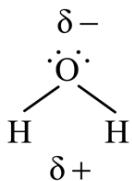

的 H 朝向 Cl $^{-}$ ，水分子在 Na $^{+}$ 周围时，呈负电性的 O 朝向 Na $^{+}$ ，NaCl 溶液中的水合离子应为：

故 C 错误;

D. $\mathrm{Cl}_2$ 分子中的共价键是由 2 个氯原子各提供 1 个未成对电子的 $3\mathrm{p}$ 原子轨道重叠形成的 $\mathfrak{p} - \mathfrak{p}\sigma$ 键，形成过

程为:

轨道相互靠拢

，故D正确；

故选 C。

3. 下列实验事故的处理方法不合理的是

<table><tr><td></td><td>实验事故</td><td>处理方法</td></tr><tr><td>A</td><td>被水蒸气轻微烫伤</td><td>先用冷水处理,再涂上烫伤药膏</td></tr><tr><td>B</td><td>稀释浓硫酸时,酸溅到皮肤上</td><td>用3-5%的 $NaHCO_3$ 溶液冲洗</td></tr><tr><td>C</td><td>苯酚不慎沾到手上</td><td>先用乙醇冲洗,再用水冲洗</td></tr><tr><td>D</td><td>不慎将酒精灯打翻着火</td><td>用湿抹布盖灭</td></tr></table>

A.A B.B C.C D.D

【答案】B

【解析】

【详解】A．被水蒸气轻微烫伤，先用冷水冲洗一段时间，再涂上烫伤药膏，故 A 正确；

B. 稀释浓硫酸时，酸溅到皮肤上，先用大量的水冲洗，再涂上 $3 - 5\%$ 的 $\mathrm{NaHCO_3}$ 溶液，故B错误；

C. 苯酚有毒，对皮肤有腐蚀性，常温下苯酚在水中溶解性不大，但易溶于乙醇，苯酚不慎沾到手上，先用乙醇冲洗，再用水冲洗，故C正确；  
D．酒精灯打翻着火时，用湿抹布盖灭，湿抹布可以隔绝氧气，也可以降温，故D正确；故选B。

4. 下列有关化学概念或性质的判断错误的是
A. $CH_{4}$ 分子是正四面体结构，则 $CH_{2}Cl_{2}$ 没有同分异构体
B. 环己烷与苯分子中 C-H 键的键能相等
C. 甲苯的质谱图中，质荷比为 92 的峰归属于 $\ce{CH3+}$

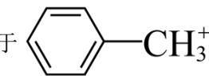

D. 由 $\mathrm{R}_4\mathrm{N}^+$ 与 $\mathrm{PF}_6^-$ 组成的离子液体常温下呈液态，与其离子的体积较大有关【答案】B【解析】

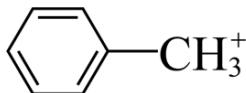

【详解】A. $\mathrm{CH}_{2} \mathrm{Cl}_{2}$ 为四面体结构, 其中任何两个顶点都是相邻关系, 因此 $\mathrm{CH}_{2} \mathrm{Cl}_{2}$ 没有同分异构体, 故 A 项说法正确; B. 环己烷中碳原子采用 $\mathrm{sp}^{3}$ 杂化, 苯分子中碳原子采用 $\mathrm{sp}^{2}$ 杂化, 由于同能层中 s 轨道更接近原子核, 因此杂化轨道的 s 成分越多, 其杂化轨道更接近原子核, 由此可知 $\mathrm{sp}^{2}$ 杂化轨道参与组成的 C-H 共价键的电子云更偏向碳原子核, 即苯分子中的 C-H 键长小于环己烷, 键能更高, 故 B 项说法错误; C. $\left\langle \right\rangle - \mathrm{CH}_{3}^{+}$ 带 1 个单位电荷, 其相对分子质量为 92 , 因此其质荷比为 92 , 故 C 项说法正确; D. 当阴阳离子体积较大时, 其电荷较为分散, 导致它们之间的作用力较低, 以至于熔点接近室温, 故 D 项说法正确; 综上所述, 错误的是 B 项。

5. 组成核酸的基本单元是核苷酸，下图是核酸的某一结构片段，下列说法错误的是

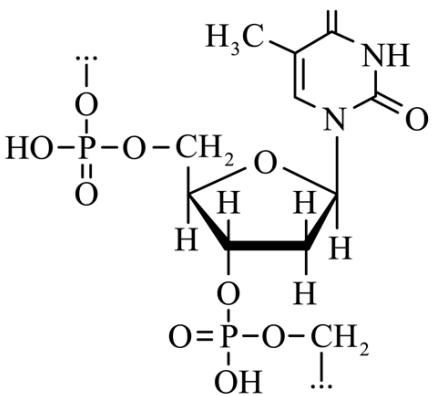

A. 脱氧核糖核酸(DNA)和核糖核酸(RNA)结构中的碱基相同，戊糖不同  
B. 碱基与戊糖缩合形成核苷，核苷与磷酸缩合形成核苷酸，核苷酸缩合聚合得到核酸  
C. 核苷酸在一定条件下，既可以与酸反应，又可以与碱反应  
D. 核酸分子中碱基通过氢键实现互补配对

【答案】A

【解析】

【详解】A. 脱氧核糖核酸(DNA)的戊糖为脱氧核糖，碱基为：腺嘌呤、鸟嘌呤、胞嘧啶、胸腺嘧啶，核糖核酸(RNA)的戊糖为核糖，碱基为：腺嘌呤、鸟嘌呤、胞嘧啶、尿嘧啶，两者的碱基不完全相同，戊糖不同，故 A 错误；  
B. 碱基与戊糖缩合形成核苷，核苷与磷酸缩合形成了组成核酸的基本单元——核苷酸，核苷酸缩合聚合可以得到核酸，如图：戊糖 $\left\{\begin{array}{c}\text { 缩合 } \\ \text { 水解 }\end{array}\right.$ 核苷 $\left\{\begin{array}{c}\text { 缩合 } \\ \text { 水解 }\end{array}\right.$ 核苷酸 $\left\{\begin{array}{c}\text { 缩合聚合 } \\ \text { 水解 }\end{array}\right.$ 核酸，故 B 正确；  
C. 核苷酸中的磷酸基团能与碱反应，碱基与酸反应，因此核苷酸在一定条件下，既可以与酸反应，又可以与碱反应，故 C 正确；  
D. 核酸分子中碱基通过氢键实现互补配对，DNA 中腺嘌呤（A）与胸腺嘧啶（T）配对，鸟嘌呤（G）与胞嘧啶（C）配对，RNA 中尿嘧啶（U）替代了胸腺嘧啶（T），结合成碱基对，遵循碱基互补配对原则，故 D 正确；

故选A。

6. 下列过程中，对应的反应方程式错误的是

<table><tr><td>A</td><td>《天工开物》记载用炉甘石 $(ZnCO_3)$ 火法炼锌</td><td> $2ZnCO_3 + C\xlongequal{高温} 2Zn + 3CO \uparrow$ </td></tr><tr><td>B</td><td> $CaH_2$ 用作野外生氢剂</td><td> $CaH_2 + 2H_2O = Ca(OH)_2 + 2H_2 \uparrow$ </td></tr><tr><td>C</td><td>饱和 $Na_2CO_3$ 溶液浸泡锅炉水垢</td><td> $CaSO_4(s) + CO_3^{2-}(aq) \rightleftharpoons CaCO_3(s) + SO_4^{2-}(aq)$ </td></tr><tr><td>D</td><td>绿矾 $(FeSO_4 \cdot 7H_2O)$ 处理酸性工业废水中的 $Cr_2O_7^{2-}$ </td><td> $6Fe^{2+} + Cr_2O_7^{2-} + 14H^+ = 6Fe^{3+} + 2Cr^{3+} + 7H_2O$ </td></tr></table>

【答案】A 【解析】

【详解】A．火法炼锌过程中 C 作还原剂， $ZnCO_{3}$ 在高温条件下分解为 ZnO、 $CO_{2}$ ，因此总反应为 $2ZnCO_{3} + C\xlongequal{高温}2Zn + 3CO_{2}\uparrow$ ，故 A 项错误；

B. $CaH_{2}$ 为活泼金属氢化物，因此能与 $H_{2}O$ 发生归中反应生成碱和氢气，反应方程式为 $CaH_{2} + 2H_{2}O = Ca(OH)_{2} + 2H_{2}\uparrow$ ，故 B 项正确；

C. 锅炉水垢中主要成分为 $\mathrm{CaSO}_4$ 、 $\mathrm{MgCO}_3$ 等, 由于溶解性: $\mathrm{CaSO}_4 > \mathrm{CaCO}_3$ , 因此向锅炉水垢中加入饱和 $\mathrm{Na}_2\mathrm{CO}_3$ 溶液, 根据难溶物转化原则可知 $\mathrm{CaSO}_4$ 转化为 $\mathrm{CaCO}_3$ , 反应方程式为

$$
\mathrm{CaSO} _ {4} (\mathrm{s}) + \mathrm{CO} _ {3} ^ {2 -} (\mathrm{aq}) \rightleftharpoons \mathrm{CaCO} _ {3} (\mathrm{s}) + \mathrm{SO} _ {4} ^ {2 -} (\mathrm{aq})
$$

D. $\mathrm{Cr}_{2} \mathrm{O}_{7}^{2-}$ 具有强氧化性，加入具有还原性的 $\mathrm{Fe}^{2+}$ ，二者发生氧化还原反应生成 $\mathrm{Fe}^{3+}$ 、 $\mathrm{Cr}^{3+}$ ， $\mathrm{Cr}$ 元素化合价由 +6 降低至 +3， $\mathrm{Fe}$ 元素化合价由 +2 升高至 +3，根据守恒规则可知反应离子方程式为 $6 \mathrm{Fe}^{2+} + \mathrm{Cr}_{2} \mathrm{O}_{7}^{2-} + 14 \mathrm{H}^{+} = 6 \mathrm{Fe}^{3+} + 2 \mathrm{Cr}^{3+} + 7 \mathrm{H}_{2} \mathrm{O}$ ，故 D 项正确；

7. 某学生按图示方法进行实验，观察到以下实验现象：

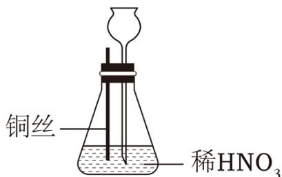

①铜丝表面缓慢放出气泡，锥形瓶内气体呈红棕色；

②铜丝表面气泡释放速度逐渐加快，气体颜色逐渐变深；

③一段时间后气体颜色逐渐变浅，至几乎无色；

④锥形瓶中液面下降，长颈漏斗中液面上升，最终铜丝与液面脱离接触，反应停止。

④锥形瓶不液面下降，长颈漏斗不液面上升，最终钢丝与液面脱离接触，反应停止下列说法正确的是
A. 开始阶段铜丝表面气泡释放速度缓慢，原因是铜丝在稀 $HNO_{3}$ 中表面钝化
B. 锥形瓶内出现了红棕色气体，表明铜和稀 $HNO_{3}$ 反应生成了 $NO_{2}$ C. 红棕色逐渐变浅的主要原因是 $3NO_{2} + H_{2}O = 2HNO_{3} + NO$

D. 铜丝与液面脱离接触，反应停止，原因是硝酸消耗完全
【答案】C
【解析】

【详解】A. 金属铜与稀硝酸不会产生钝化。开始反应速率较慢，可能的原因是铜表面有氧化铜，故 A 项说法错误；  
B. 由于装置内有空气，铜和稀 $\mathrm{HNO}_3$ 反应生成的 NO 迅速被氧气氧化为红棕色的 $\mathrm{NO}_2$ ，产生的 $\mathrm{NO}_2$ 浓度逐渐增加，气体颜色逐渐变深，故 B 项说法错误；  
C. 装置内氧气逐渐被消耗，生成的 $\mathrm{NO}_2$ 量逐渐达到最大值，同时装置内的 $\mathrm{NO}_2$ 能与溶液中的 $\mathrm{H}_2\mathrm{O}$ 反应 $3\mathrm{NO}_2 + \mathrm{H}_2\mathrm{O} = 2\mathrm{HNO}_3 + \mathrm{NO}$ ，气体颜色变浅，故 C 项说法正确；  
D. 由于该装置为密闭体系，生成的 NO 无法排出，逐渐将锥形瓶内液体压入长颈漏斗，铜丝与液面脱离接触，反应停止，故 D 项说法错误；  
答案选 C。

8. 为达到下列实验目的，操作方法合理的是

<table><tr><td></td><td>实验目的</td><td>操作方法</td></tr><tr><td>A</td><td>从含有 $I_2$ 的NaCl固体中提取 $I_2$ </td><td>用 $CCl_4$ 溶解、萃取、分液</td></tr><tr><td>B</td><td>提纯实验室制备的乙酸乙酯</td><td>依次用NaOH溶液洗涤、水洗、分液、干燥</td></tr><tr><td>C</td><td>用NaOH标准溶液滴定未知浓度的 $CH_3COOH$ 溶液</td><td>用甲基橙作指示剂进行滴定</td></tr><tr><td>D</td><td>从明矾过饱和溶液中快速析出晶体</td><td>用玻璃棒摩擦烧杯内壁</td></tr></table>

A.A B.B C.C D.D

【答案】D

【解析】

【详解】A．从含有 $I_{2}$ 的 NaCl 固体中提取 $I_{2}$ ，用 $CCl_{4}$ 溶解、萃取、分液后， $I_{2}$ 仍然溶在四氯化碳中，没有提取出来，A 错误；

B. 乙酸乙酯在氢氧化钠碱性条件下可以发生水解反应, 故提纯乙酸乙酯不能用氢氧化钠溶液洗涤, B 错误;

C. 用 NaOH 标准溶液滴定未知浓度的 $\mathrm{CH}_3\mathrm{COOH}$ 溶液, 反应到达终点时生成 $\mathrm{CH}_3\mathrm{COONa}$ , 是碱性, 而甲基橙变色范围 pH 值较小, 故不能用甲基橙作指示剂进行滴定, 否则误差较大, 应用酚酞作指示剂, C 错误; D. 从明矾过饱和溶液中快速析出晶体, 可以用玻璃棒摩擦烧杯内壁, 在烧杯内壁产生微小的玻璃微晶来充当晶核, D 正确; 本题选 D。

9. 通过理论计算方法优化了 P 和 Q 的分子结构，P 和 Q 呈平面六元并环结构，原子的连接方式如图所示，下列说法错误的是

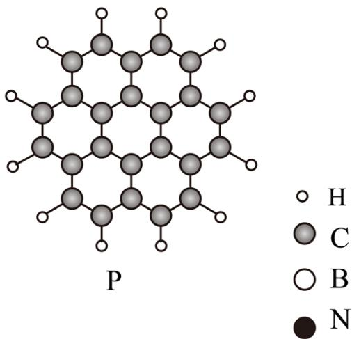

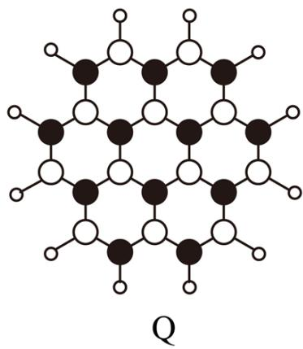

A. P 为非极性分子，Q 为极性分子
B. 第一电离能：B<C<N
C. 1mol P 和 1mol Q 所含电子数目相等
D. P 和 Q 分子中 C、B 和 N 均为 $sp^{2}$ 杂化

【详解】A. 由所给分子结构图，P 和 Q 分子都满足对称，正负电荷重心重合，都是非极性分子，A 错误；  
B. 同周期元素，从左到右第一电离能呈增大趋势，氮原子的 2p 轨道为稳定的半充满结构，第一电离能大于相邻元素，则第一电离能由小到大的顺序为 B<C<N，故 B 正确；  
C. 由所给分子结构可知，P 分子式为 C $_{24}$ H $_{12}$ ，Q 分子式为 B $_{12}$ N $_{12}$ H $_{12}$ ，P、Q 分子都是含 156 个电子，故 1mol P 和 1mol Q 所含电子数目相等，C 正确；  
D. 由所给分子结构可知，P 和 Q 分子中 C、B 和 N 均与其它三个原子成键，P 和 Q 分子呈平面结构，故 P 和 Q 分子中 C、B 和 N 均为 sp $^{2}$ 杂化，D 正确；  
本题选 A。

10. 在 KOH 水溶液中，电化学方法合成高能物质 $K_{4}C_{6}N_{16}$ 时，伴随少量 $O_{2}$ 生成，电解原理如图所示，

下列说法正确的是

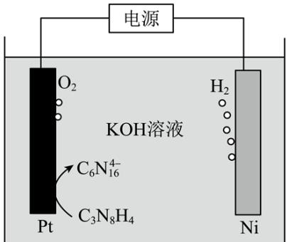

A. 电解时， $\mathrm{OH}^{-}$ 向 Ni 电极移动  
B. 生成 $\mathrm{C}_{6} \mathrm{~N}_{16}^{4-}$ 的电极反应： $2 \mathrm{C}_{3} \mathrm{~N}_{8} \mathrm{H}_{4} + 8 \mathrm{OH}^{-} - 4 \mathrm{e}^{-} = \mathrm{C}_{6} \mathrm{~N}_{16}^{4-} + 8 \mathrm{H}_{2} \mathrm{O}$ C. 电解一段时间后，溶液 pH 升高  
D. 每生成 $1 \mathrm{~mol} \mathrm{H}_{2}$ 的同时，生成 $0.5 \mathrm{~mol} \mathrm{K}_{4} \mathrm{C}_{6} \mathrm{~N}_{16}$

【答案】B

【解析】

【分析】由电解原理图可知，Ni 电极产生氢气，作阴极，发生还原反应，电解质溶液为 KOH 水溶液，则电极反应为： $2H_{2}O+2e^{-}=H_{2}\uparrow+2OH^{-}$ ；Pt 电极 $C_{3}N_{8}H_{4}$ 失去电子生成 $C_{6}N_{16}^{4-}$ ，作阳极，电极反应为： $2C_{3}N_{8}H_{4}+8OH^{-}-4e^{-}=C_{6}N_{16}^{4-}+8H_{2}O$ ，同时，Pt 电极还伴随少量 $O_{2}$ 生成，电极反应为： $4OH^{-}-4e^{-}=O_{2}\uparrow+2H_{2}O$ 。

【详解】A．由分析可知，Ni 电极为阴极，Pt 电极为阳极，电解过程中，阴离子向阳极移动，即 OH⁻ 向 Pt 电极移动，A 错误；

B．由分析可知，Pt 电极 $C_{3}N_{8}H_{4}$ 失去电子生成 $C_{6}N_{16}^{4-}$ ，电解质溶液为 KOH 水溶液，电极反应为： $2C_{3}N_{8}H_{4}+8OH^{-}-4e^{-}=C_{6}N_{16}^{4-}+8H_{2}O$ ，B 正确；

C．由分析可知，阳极主要反应为： $2C_{3}N_{8}H_{4}-4e^{-}+8OH^{-}=C_{6}N_{16}^{4-}+8H_{2}O$ ，阴极反应为： $2H_{2}O+2e^{-}=H_{2}\uparrow+2OH^{-}$ ，则电解过程中发生的总反应主要为： $2C_{3}N_{8}H_{4}+4OH^{-}=C_{6}N_{16}^{4-}+4H_{2}O+2H_{2}\uparrow$ 反应消耗 $OH^{-}$ ，生成 $H_{2}O$ ，电解一段时间后，溶液pH降低，C错误；

D. 根据电解总反应: $2 \mathrm{C}_{3} \mathrm{~N}_{8} \mathrm{H}_{4} + 4 \mathrm{OH}^{-} = \mathrm{C}_{6} \mathrm{~N}_{16}^{4-} + 4 \mathrm{H}_{2} \mathrm{O} + 2 \mathrm{H}_{2} \uparrow$ 可知, 每生成 $1 \mathrm{~mol} \mathrm{H}_{2}$ , 生成 $0.5 \mathrm{~mol} \mathrm{K}_{4} \mathrm{C}_{6} \mathrm{~N}_{16}$ , 但 Pt 电极伴随少量 $\mathrm{O}_{2}$ 生成, 发生电极反应: $4 \mathrm{OH}^{-} - 4 \mathrm{e}^{-} = \mathrm{O}_{2} \uparrow + 2 \mathrm{H}_{2} \mathrm{O}$ , 则生成 $1 \mathrm{~mol} \mathrm{H}_{2}$ 时得到的部分电子由 OH 放电产生 $O_{2}$ 提供，所以生成 $K_{4}C_{6}N_{16}$ 小于 0.5mol，D 错误；故选 B。

11. 中和法生产 $Na_{2}HPO_{4} \cdot 12H_{2}O$ 的工艺流程如下:

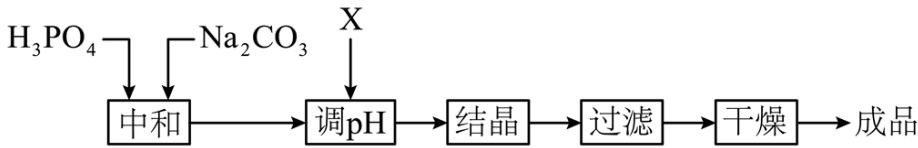

已知：① $\mathrm{H}_3\mathrm{PO}_4$ 的电离常数： $\mathrm{K}_1 = 6.9\times 10^{-3}$ ， $\mathrm{K}_2 = 6.2\times 10^{-8}$ ， $\mathrm{K}_3 = 4.8\times 10^{-13}$

② $Na_{2}HPO_{4}\cdot12H_{2}O$ 易风化。

下列说法错误的是

A. “中和”工序若在铁质容器中进行，应先加入 $Na_{2}CO_{3}$ 溶液
B. “调 pH” 工序中 X 为 NaOH 或 $H_{3}PO_{4}$ C. “结晶” 工序中溶液显酸性
D. “干燥” 工序需在低温下进行

【答案】C

【解析】

【分析】 $H_{3}PO_{4}$ 和 $Na_{2}CO_{3}$ 先发生反应，通过加入 X 调节 pH，使产物完全转化为 $Na_{2}HPO_{4}$ ，通过结晶、过滤、干燥，最终得到 $Na_{2}HPO_{4} \cdot 12H_{2}O$ 成品。

【详解】A．铁是较活泼金属，可与 $H_{3}PO_{4}$ 反应生成氢气，故“中和”工序若在铁质容器中进行，应先加入 $Na_{2}CO_{3}$ 溶液，A项正确；

B. 若 “中和” 工序加入 $Na_{2}CO_{3}$ 过量，则需要加入酸性物质来调节 pH，为了不引入新杂质，可加入 $H_{3}PO_{4}$ ；若 “中和” 工序加入 $H_{3}PO_{4}$ 过量，则需要加入碱性物质来调节 pH，为了不引入新杂质，可加入 NaOH，所以 “调 pH” 工序中 X 为 NaOH 或 $H_{3}PO_{4}$ ，B 项正确；

C. “结晶”工序中的溶液为饱和 $Na_{2}HPO_{4}$ 溶液，由已知可知 $H_{3}PO_{4}$ 的 $K_{2}=6.2\times10^{-8}$ ， $K_{3}=4.8\times10^{-13}$ ，则 $HPO_{4}^{2-}$ 的水解常数 $K_{h}=\frac{K_{w}}{K_{a2}}=\frac{1.0\times10^{-14}}{6.2\times10^{-8}}\approx1.6\times10^{-7}$ ，由于 $K_{h}>K_{3}$ ，则 $Na_{2}HPO_{4}$ 的水解程度大于电离程度，溶液显碱性，C 项错误；

D. 由于 $\mathrm{Na}_{2} \mathrm{HPO}_{4} \cdot 12 \mathrm{H}_{2} \mathrm{O}$ 易风化失去结晶水, 故 “干燥” 工序需要在低温下进行, D 项正确;故选 C。

12. $\mathrm{Li}_{2} \mathrm{CN}_{2}$ 是一种高活性的人工固氮产物, 其合成反应为 $2 \mathrm{LiH} + \mathrm{C} + \mathrm{N}_{2} \xlongequal{\text {高温}} \mathrm{Li}_{2} \mathrm{CN}_{2} + \mathrm{H}_{2}$ , 晶胞如图所示, 下列说法错误的是

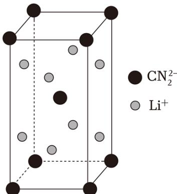

A. 合成反应中，还原剂是 LiH 和 C
B. 晶胞中含有的 $Li^{+}$ 个数为 4
C. 每个 $CN_{2}^{2-}$ 周围与它最近且距离相等的 $Li^{+}$ 有 8 个
D. $CN_{2}^{2-}$ 为 V 型结构
【答案】D
【解析】

【详解】A. LiH 中 H 元素为 -1 价，由图中 $CN_{2}^{2-}$ 化合价可知，N 元素为 -3 价，C 元素为 +4 价，根据反应 $2LiH + C + N_{2} \xlongequal{高温} Li_{2}CN_{2} + H_{2}$ 可知，H 元素由 -1 价升高到 0 价，C 元素由 0 价升高到 +4 价，N 元素

由 0 价降低到 -3 价，由此可知还原剂是 LiH 和 C，故 A 正确；

B. 根据均摊法可知， $Li^{+}$ 位于晶胞中的面上，则含有的 $Li^{+}$ 个数为 $8 \times \frac{1}{2} = 4$ ，故 B 正确；

C. 观察位于体心的 $CN_{2}^{2-}$ 可知，与它最近且距离相等的 $Li^{+}$ 有 8 个，故 C 正确；

D. $\mathrm{CN}_2^{2-}$ 的中心原子 C 原子的价层电子对数为 $2 + \frac{1}{2} \times (4 + 2 - 3 \times 2) = 2$ ，且 $\mathrm{CN}_2^{2-}$ 与 $\mathrm{CO}_2$ 互为等电子体，可知 $\mathrm{CN}_2^{2-}$ 为直线型分子，故 D 错误；故答案选 D。

13. 常温下 $K_{n}(HCOOH)=1.8\times10^{-4}$ ，向 $20mL0.10mol\cdot L^{-1}NaOH$ 溶液中缓慢滴入相同浓度的 HCOOH 溶液，混合溶液中某两种离子的浓度随加入 HCOOH 溶液体积的变化关系如图所示，下列说法

错误的是

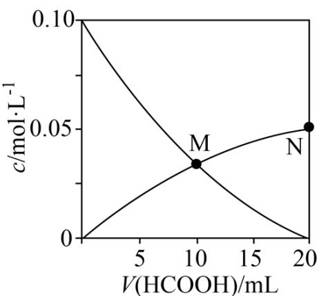

A. 水的电离程度： $\mathrm{M} < \mathrm{N}$ B.M点： $2c\left(\mathrm{OH}^{-}\right) = c\left(\mathrm{Na}^{+}\right) + c\left(\mathrm{H}^{+}\right)$ C.当 $V(\mathrm{HCOOH}) = 10\mathrm{mL}$ 时， $c(\mathrm{OH}^{-}) = c(\mathrm{H}^{+}) + 2c(\mathrm{HCOOH}) + c(\mathrm{HCOO}^{-})$ D.N点： $c(\mathrm{Na}^{+}) > c(\mathrm{HCOO}^{-}) > c(\mathrm{OH}^{-}) > c(\mathrm{H}^{+}) > c(\mathrm{HCOOH})$

【答案】D

【解析】

【分析】结合起点和终点，向 $20 \, mL \, 0.10 \, mol \cdot L^{-1} \, NaOH$ 溶液中滴入相同浓度的 HCOOH 溶液，发生浓度改变的微粒是 $OH^{-}$ 和 $HCOO^{-}$ ，当 $V(HCOOH) = 0 \, mL$ ，溶液中存在的微粒是 $OH^{-}$ ，可知随着甲酸的加入， $OH^{-}$ 被消耗，逐渐下降，即经过 M 点在下降的曲线表示的是 $OH^{-}$ 浓度的改变，经过 M 点、N 点的在上升的曲线表示的是 $HCOO^{-}$ 浓度的改变。

【详解】A. M 点时， $V(HCOOH)=10mL$ ，溶液中的溶质为 $c(HCOOH):c(HCOO^{-})=1:1$ ，仍剩余有未反应的甲酸，对水的电离是抑制的，N 点 HCOOH 溶液与 NaOH 溶液恰好反应生成 HCOONa，此时仅存在 HCOONa 的水解，此时水的电离程度最大，故 A 正确；

B. M 点时， $\mathrm{V}\left(\mathrm{HCOOH}\right)=10\mathrm{mL}$ ，溶液中的溶质为 $\mathrm{c}\left(\mathrm{HCOOH}\right): \mathrm{c}\left(\mathrm{HCOO}^{-}\right)=1:1$ ，根据电荷守恒有 $\mathrm{c}\left(\mathrm{Na}^{+}\right)+\mathrm{c}\left(\mathrm{H}^{+}\right)=\mathrm{c}\left(\mathrm{HCOO}^{-}\right)+\mathrm{c}\left(\mathrm{OH}^{-}\right)$ ，M 点为交点可知 $\mathrm{c}\left(\mathrm{HCOO}^{-}\right)=\mathrm{c}\left(\mathrm{OH}^{-}\right)$ ，联合可得 $2\mathrm{c}\left(\mathrm{OH}^{-}\right)=c\left(\mathrm{Na}^{+}\right)+c\left(\mathrm{H}^{+}\right)$ ，故 B 正确；

C. 当 $V(\mathrm{HCOOH}) = 10\mathrm{mL}$ 时，溶液中的溶质为 $\mathbf{c}(\mathrm{HCOOH}): \mathbf{c}(\mathrm{HCOONa}) = 1:1$ ，根据电荷守恒有 $\mathbf{c}(\mathrm{Na}^{+}) + \mathbf{c}(\mathrm{H}^{+}) = \mathbf{c}(\mathrm{HCOO}^{-}) + \mathbf{c}(\mathrm{OH}^{-})$ ，根据物料守恒 $\mathbf{c}(\mathrm{Na}^{+}) = 2\mathbf{c}(\mathrm{HCOO}^{-}) + 2\mathbf{c}(\mathrm{HCOOH})$ ，联合可得 $c(\mathrm{OH}^{-}) = \mathbf{c}(\mathrm{H}^{+}) + 2c(\mathrm{HCOOH}) + c(\mathrm{HCOO}^{-})$ ，故C正确；

D. N 点 HCOOH 溶液与 NaOH 溶液恰好反应生成 HCOONa，甲酸根发生水解，因此 $c(Na^{+})>c(HCOO^{-})$ 及 $c(OH^{-})>c(H^{+})$ 观察图中 N 点可知， $c(HCOO^{-})\approx0.05mol/L$ ，根据 $K_{a}(HCOOH)=\frac{c(H^{+})c(HCOO^{-})}{c(HCOOH)}=1.8\times10^{-4}$ ，可知 $c(HCOOH)>c(H^{+})$ ，故 D 错误；
故答案选 D。

$$
\mathrm{CH} _ {3} \mathrm{OH} (\mathrm{g})
$$

$$
\mathrm{CO} (\mathrm{g})
$$

$$
\mathrm{CH} _ {3} \mathrm{OH} (\mathrm{g}) + \mathrm{CO} (\mathrm{g}) = \mathrm{CH} _ {3} \mathrm{COOH} (\mathrm{g}) \quad \Delta \mathrm{H} _ {1}
$$

副反应： $\mathrm{CH}_3\mathrm{OH}(\mathbf{g}) + \mathrm{CH}_3\mathrm{COOH}(\mathbf{g}) = \mathrm{CH}_3\mathrm{COOCH}_3(\mathbf{g}) + \mathrm{H}_2\mathrm{O}(\mathbf{g})$ $\Delta \mathrm{H}_{2}$

$$
\delta \left[ \delta \left(\mathrm{CH} _ {3} \mathrm{COOH}\right) = \frac {n \left(\mathrm{CH} _ {3} \mathrm{COOH}\right)}{n \left(\mathrm{CH} _ {3} \mathrm{COOH}\right) + n \left(\mathrm{CH} _ {3} \mathrm{COOCH} _ {3}\right)} \right]
$$

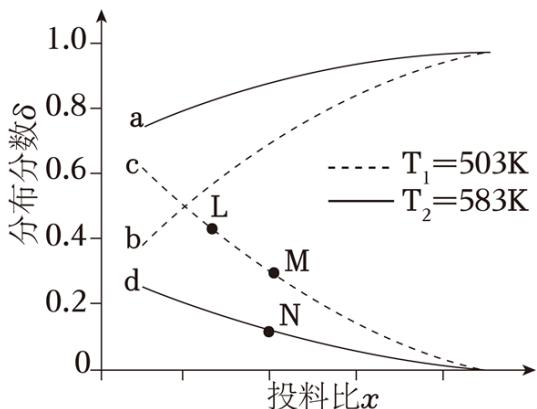

A. 投料比 x 代表 $\frac{n(\mathrm{CH}_{3}\mathrm{OH})}{n(\mathrm{CO})}$ B. 曲线 c 代表乙酸的分布分数
C. $\Delta H_{1}<0,\quad\Delta H_{2}>0$

$$
K (\mathrm{L}) = K (\mathrm{M}) > K (\mathrm{N})
$$

【解析】

【分析】题干明确指出，图中曲线表示的是测得两种含碳产物的分布分数即分别为 $\delta(\mathrm{CH}_{3}\mathrm{COOH})$ 、 $\delta(\mathrm{CH}_{3}\mathrm{COOCH}_{3})$ ，若投料比 x 代表 $\frac{\mathrm{n}(\mathrm{CH}_{3}\mathrm{OH})}{\mathrm{n}(\mathrm{CO})}$ ，x 越大，可看作是 $CH_{3}OH$ 的量增多，则对于主、副反应可知生成的 $CH_{3}COOCH_{3}$ 越多， $CH_{3}COOCH_{3}$ 分布分数越高，则曲线 a 或曲线 b 表示 $CH_{3}COOCH_{3}$ 分布分数，曲线 c 或曲线 d 表示 $CH_{3}COOH$ 分布分数，据此分析可知 AB 均正确，可知如此假设错误，则可知投料比 x 代表 $\frac{n(CO)}{n(CH_{3}OH)}$ ，曲线 a 或曲线 b 表示 $\delta(CH_{3}COOH)$ ，曲线 c 或曲线 d 表示 $\delta(CH_{3}COOCH_{3})$ ，据此作答。

【详解】A. 根据分析可知，投料比 x 代表 $\frac{\mathrm{n}(\mathrm{CO})}{\mathrm{n}(\mathrm{CH}_3\mathrm{OH})}$ ，故 A 错误；

B. 根据分析可知, 曲线 $c$ 表示 $\mathrm{CH}_{3} \mathrm{COOCH}_{3}$ 分布分数, 故 B 错误;

C. 根据分析可知，曲线 a 或曲线 b 表示 $\delta(\mathrm{CH}_{3}\mathrm{COOH})$ ，当同一投料比时，观察图像可知 $T_{2}$ 时

$\delta \left(\mathrm{CH}_{3} \mathrm{COOH}\right)$ 大于 $\mathrm{T}_{1}$ 时 $\delta \left(\mathrm{CH}_{3} \mathrm{COOH}\right)$ ，而 $\mathrm{T}_{2} > \mathrm{T}_{1}$ 可知，温度越高则 $\delta \left(\mathrm{CH}_{3} \mathrm{COOH}\right)$ 越大，说明温度升高主反应的平衡正向移动， $\Delta \mathrm{H}_{1} > 0$ ；曲线 c 或曲线 d 表示 $\delta \left(\mathrm{CH}_{3} \mathrm{COOCH}_{3}\right)$ ，当同一投料比时，观察可知 $\mathrm{T}_{1}$ 时 $\delta \left(\mathrm{CH}_{3} \mathrm{COOCH}_{3}\right)$ 大于 $\mathrm{T}_{2}$ 时 $\delta \left(\mathrm{CH}_{3} \mathrm{COOCH}_{3}\right)$ ，而 $\mathrm{T}_{2} > \mathrm{T}_{1}$ 可知，温度越高则 $\delta \left(\mathrm{CH}_{3} \mathrm{COOCH}_{3}\right)$ 越小，说明温度升高副反应的平衡逆向移动， $\Delta \mathrm{H}_{2} < 0$ ，故 C 错误；D. L、M、N 三点对应副反应 $\Delta \mathrm{H}_{2} < 0$ ，且 $\mathrm{T}_{\mathrm{N}} > \mathrm{T}_{\mathrm{M}} = \mathrm{T}_{\mathrm{L}}$ ，升高温度平衡逆向移动， $K(\mathrm{L}) = K(\mathrm{M}) > K(\mathrm{N})$ ，故 D 正确；

故答案选 D。

15. 亚铜配合物广泛用作催化剂。实验室制备 $\left[\mathrm{Cu}\left(\mathrm{CH}_3\mathrm{CN}\right)_4\right]\mathrm{ClO}_4$ 的反应原理如下： $\mathrm{Cu}\left(\mathrm{ClO}_4\right)_2 \cdot 6\mathrm{H}_2\mathrm{O} + \mathrm{Cu} + 8\mathrm{CH}_3\mathrm{CN} = 2\left[\mathrm{Cu}\left(\mathrm{CH}_3\mathrm{CN}\right)_4\right]\mathrm{ClO}_4 + 6\mathrm{H}_2\mathrm{O}$

实验步骤如下:

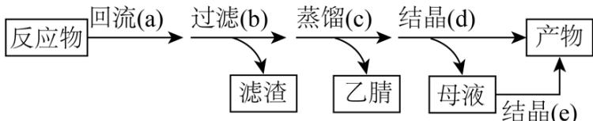

分别称取 $3.71 \, \text{g} \, \text{Cu}\left(\text{ClO}_{4}\right)_{2} \cdot 6 \, \text{H}_{2}\text{O}$ 和 $0.76 \, \text{g} \, \text{Cu}$ 粉置于 $100 \, mL$ 乙腈( $CH_{3}CN$ )中应，回流装置图和蒸馏装置图(加热、夹持等装置略)如下：

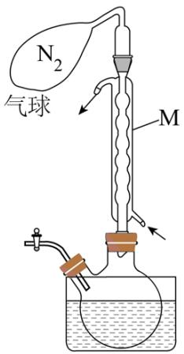

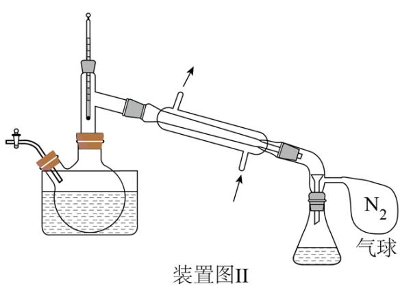  
装置图I  
已知：①乙腈是一种易挥发的强极性配位溶剂；

②相关物质的信息如下：

<table><tr><td>化合物</td><td> $\left[ \text{Cu}(\text{CH}_3\text{CN})_4 \right] \text{ClO}_4$ </td><td> $\text{Cu}(\text{ClO}_4)_2 \cdot 6\text{H}_2\text{O}$ </td></tr><tr><td>相对分子质量</td><td>327.5</td><td>371</td></tr><tr><td>在乙腈中颜色</td><td>无色</td><td>蓝色</td></tr></table>

回答下列问题:

(1) 下列与实验有关的图标表示排风的是\_\_\_\_(填标号);

A.

B.

C.

D.

E.

(2) 装置I中仪器 M 的名称为 \_\_\_\_；

(3) 装置I中反应完全的现象是\_\_\_\_；

(4) 装置I和II中 $\mathrm{N}_{2}$ 气球的作用是\_\_\_\_；

(5) $\left[\mathrm{Cu}\left(\mathrm{CH}_{3} \mathrm{CN}\right)_{4}\right] \mathrm{ClO}_{4}$ 不能由步骤 c 直接获得, 而是先蒸馏至接近饱和, 再经步骤 d 冷却结晶获得。这样处理的目的是

(6) 为了使母液中的 $\left[\mathrm{Cu}\left(\mathrm{CH}_{3} \mathrm{CN}\right)_{4}\right] \mathrm{ClO}_{4}$ 结晶, 步骤 e 中向母液中加入的最佳溶剂是\_\_\_\_(填标号);

(7) 合并步骤 d 和 e 所得的产物, 总质量为 $5.32 \mathrm{~g}$ , 则总收率为 (用百分数表示, 保留一位小

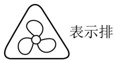

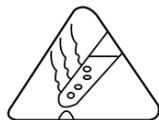

数)。

【答案】(1) D (2) 球形冷凝管

(3) 溶液蓝色褪去变为无色

（4）排出装置内空气，防止制备的产品被氧化

（5）冷却过程中降低 $\left[\mathrm{Cu}\left(\mathrm{CH}_3\mathrm{CN}\right)_4\right]\mathrm{ClO}_4$ 在水中的溶解度

(6) B (7) 81.2%

【解析】

【分析】将 $\mathrm{Cu}\left(\mathrm{ClO}_{4}\right)_{2}\cdot6\mathrm{H}_{2}\mathrm{O}$ 和 Cu 粉以及乙腈 $\left(\mathrm{CH}_{3}\mathrm{CN}\right)$ 加入两颈烧瓶中，经水浴加热并回流进行充分反应，反应结束后过滤除去未反应完全的 Cu，然后利用乙腈的挥发性进行蒸馏除去乙腈，将剩余溶液进行冷却结晶分离出 $\left[\mathrm{Cu}\left(\mathrm{CH}_{3}\mathrm{CN}\right)_{4}\right]\mathrm{ClO}_{4}$ 。

【小问 1 详解】

表示需佩戴护目镜，表示当心火灾，表示注意烫伤，表示排

风，表示必须洗手，故答案为D。

【小问 2 详解】

装置I中仪器 M 的名称为球形冷凝管。

【小问3详解】

$\mathrm{Cu(ClO_4)_2\cdot 6H_2O}$ 在乙腈中为蓝色， $\left[\mathrm{Cu}(\mathrm{CH}_3\mathrm{CN})_4\right]\mathrm{ClO}_4$ 在乙腈中为无色，因此装置I中反应完全的现象是溶液蓝色褪去变为无色，可证明 $\mathrm{Cu(ClO_4)_2\cdot 6H_2O}$ 已充分反应完全。

【小问4详解】

由于制备的 $\left[\mathrm{Cu}\left(\mathrm{CH}_3\mathrm{CN}\right)_4\right]\mathrm{ClO}_4$ 中 $\mathrm{Cu}$ 元素为 $+1$ 价，具有较强的还原性，容易被空气中氧气氧化，因此装置I和II中 $\mathbf{N}_2$ 气球的作用是排出装置内空气，防止制备的产品被氧化。

【小问 5 详解】

$\left[\mathrm{Cu}\left(\mathrm{CH}_{3} \mathrm{CN}\right)_{4}\right] \mathrm{ClO}_{4}$ 为离子化合物，具有强极性，在水中溶解度较大，在温度较高的环境下蒸馏难以分离，若直接将水蒸干难以获得晶体状固体，因此需先蒸馏至接近饱和，再经步骤d冷却结晶，从而获得晶体。

【小问6详解】

为了使母液中的 $\left[\mathrm{Cu}\left(\mathrm{CH}_{3} \mathrm{CN}\right)_{4}\right] \mathrm{ClO}_{4}$ 结晶，可向母液中加入极性较小的溶剂，与水混溶的同时扩大与 $\left[\mathrm{Cu}\left(\mathrm{CH}_{3} \mathrm{CN}\right)_{4}\right] \mathrm{ClO}_{4}$ 的极性差，进而使 $\left[\mathrm{Cu}\left(\mathrm{CH}_{3} \mathrm{CN}\right)_{4}\right] \mathrm{ClO}_{4}$ 析出，因此可选用的溶剂为乙醇，故答案为 B。

【小问 7 详解】

$3.71\mathrm{g}\mathrm{Cu}\left(\mathrm{ClO}_{4}\right)_{2}\cdot6\mathrm{H}_{2}\mathrm{O}$ 的物质的量为 $\frac{3.71\mathrm{g}}{371\mathrm{g}\cdot\mathrm{mol}^{-1}}=0.01\mathrm{mol}$ ，理论制得 $\left[\mathrm{Cu}\left(\mathrm{CH}_{3}\mathrm{CN}\right)_{4}\right]\mathrm{ClO}_{4}$ 的质量为 $0.01\mathrm{mol}\times2\times327.5\mathrm{g}\cdot\mathrm{mol}^{-1}=6.55\mathrm{g}$ ，总收率为 $\frac{5.32\mathrm{g}}{6.55\mathrm{g}}\times100\%=81.2\%$ 。

16. 铜阳极泥(含有 $\mathrm{Au}$ 、 $\mathrm{Ag_2Se}$ 、 $\mathrm{Cu_2Se}$ 、 $\mathrm{PbSO_4}$ 等)是一种含贵金属的可再生资源，回收贵金属的化工流程如下：

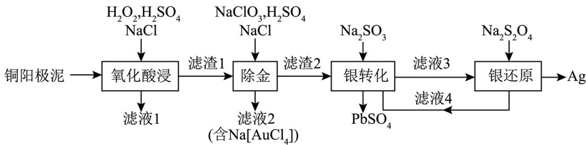

已知: ①当某离子的浓度低于 $1.0 \times 10^{-5} \mathrm{~mol} \cdot \mathrm{L}^{- 1}$ 时, 可忽略该离子的存在;

② $\mathrm{AgCl(s) + Cl^{-}(aq)\rightleftharpoons[AgCl_2]^ {-}(aq)}$ $\mathrm{K} = 2.0\times 10^{-5}$

③ $Na_{2}SO_{3}$ 易从溶液中结晶析出;

④不同温度下 $Na_{2}SO_{3}$ 的溶解度如下:

<table><tr><td>温度 /°C</td><td>0</td><td>20</td><td>40</td><td>60</td><td>80</td></tr><tr><td>溶解度/g</td><td>14.4</td><td>26.1</td><td>37.4</td><td>33.2</td><td>29.0</td></tr></table>

回答下列问题:

(1) Cu 属于 \_\_\_\_ 区元素, 其基态原子的价电子排布式为 \_\_\_\_ ;

(2) “滤液 1” 中含有 $\mathrm{Cu}^{2+}$ 和 $\mathrm{H}_{2} \mathrm{SeO}_{3}$ , “氧化酸浸”时 $\mathrm{Cu}_{2} \mathrm{Se}$ 反应的离子方程式为\_\_\_\_;

(3) “氧化酸浸”和“除金”工序均需加入一定量的 $\mathrm{NaCl}$ :

①在“氧化酸浸”工序中，加入适量 NaCl 的原因是\_\_\_\_。

②在 “除金” 工序溶液中，Cl $^{-}$ 浓度不能超过 \_\_\_\_ mol·L $^{-1}$ 。

（4）在“银转化”体系中， $\left[\mathrm{Ag}\left(\mathrm{SO}_{3}\right)_{2}\right]^{3-}$ 和 $\left[\mathrm{Ag}\left(\mathrm{SO}_{3}\right)_{3}\right]^{5-}$ 浓度之和为 $0.075\mathrm{mol}\cdot \mathrm{L}^{-1}$ ，两种离子分布分数 $\delta \left[\delta \left(\left[\mathrm{Ag}\left(\mathrm{SO}_{3}\right)_{2}\right]^{3-}\right)=\frac{n\left(\left[\mathrm{Ag}\left(\mathrm{SO}_{3}\right)_{2}\right]^{3-}\right)}{n\left(\left[\mathrm{Ag}\left(\mathrm{SO}_{3}\right)_{2}\right]^{3-}\right)+n\left(\left[\mathrm{Ag}\left(\mathrm{SO}_{3}\right)_{3}\right]^{5-}\right)}\right]$ 随 $\mathrm{SO}_{3}^{2-}$ 浓度的变化关系如图所示，若 $\mathrm{SO}_{3}^{2-}$ 浓度为 $1.0\mathrm{mol}\cdot \mathrm{L}^{-1}$ ，则 $\left[\mathrm{Ag}\left(\mathrm{SO}_{3}\right)_{3}\right]^{5-}$ 的浓度为 \_\_\_\_ mol·L $^{-1}$ 。

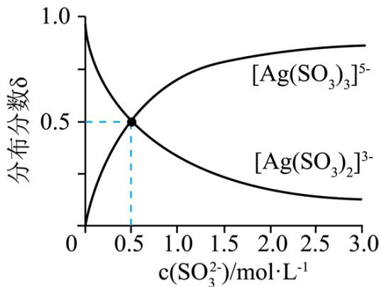

(5) 滤液 4 中溶质主要成分为\_\_\_\_(填化学式); 在连续生产的模式下, “银转化”和“银还原”工序需在 $40^{\circ} \mathrm{C}$ 左右进行, 若反应温度过高, 将难以实现连续生产, 原因是\_\_\_\_。

【答案】(1) ①. ds ②. $3 \mathrm{~d}^{10} 4 \mathrm{~s}^{1}$ (2) $\mathrm{Cu}_{2} \mathrm{Se} + 4 \mathrm{H}_{2} \mathrm{O}_{2} + 4 \mathrm{H}^{+} = 2 \mathrm{Cu}^{2+} + \mathrm{H}_{2} \mathrm{SeO}_{3} + 5 \mathrm{H}_{2} \mathrm{O}$ (3) ①. 使银元素转化为 AgCl 沉淀 ②. 0.5

(4) 0.05 (5) ①. $\mathrm{Na}_{2} \mathrm{SO}_{3}$ ②. 高于 $40^{\circ} \mathrm{C}$ 后, $\mathrm{Na}_{2} \mathrm{SO}_{3}$ 的溶解度下降, “银转化”和“银还原”的效率降低, 难以实现连续生产

【解析】

【分析】铜阳极泥（含有 Au、 $\mathrm{Ag_2Se}$ 、 $\mathrm{Cu_2Se}$ 、 $\mathrm{PbSO_4}$ 等）加入 $\mathrm{H_2O_2}$ 、 $\mathrm{H_2SO_4}$ 、NaCl 氧化酸浸，由题中信息可知，滤液 1 中含有 $\mathrm{Cu^{2+}}$ 和 $\mathrm{H_2SeO_3}$ ，滤渣 1 中含有 Au、 $\mathrm{AgCl}$ 、 $\mathrm{PbSO_4}$ ；滤渣 1 中加入 NaClO、 $\mathrm{H_2SO_4}$ 、NaCl，将 Au 转化为 $\mathrm{Na[AuCl_4]}$ 除去，滤液 2 中含有 $\mathrm{Na[AuCl_4]}$ ，滤渣 2 中含有 AgCl、 $\mathrm{PbSO_4}$ ；在滤渣 2 中加入 $\mathrm{Na_2SO_3}$ ，将 AgCl 转化为 $\mathrm{Ag_2SO_3}$ ，过滤除去 $\mathrm{PbSO_4}$ ，滤液 3 含有 $\mathrm{Ag_2SO_3}$ ；滤液 2 中加入 $\mathrm{Na_2S_2O_4}$ ，将 Ag 元素还原为 Ag 单质， $\mathrm{Na_2S_2O_4}$ 转化为 $\mathrm{Na_2SO_3}$ ，滤液 4 中溶质主要为 $\mathrm{Na_2SO_3}$ ，可继续进行银转化过程。

【小问 1 详解】

Cu 的原子序数为 29，位于第四周期第 IB 族，位于 ds 区，其基态原子的价电子排布式为 $3d^{10}4s^{1}$ ;

【小问 2 详解】

滤液 1 中含有 $Cu^{2+}$ 和 $H_{2}SeO_{3}$ ，氧化酸浸时 $Cu_{2}Se$ 与 $H_{2}O_{2}$ 、 $H_{2}SO_{4}$ 发生氧化还原反应，生成 $CuSO_{4}$ 、 $H_{2}SeO_{3}$ 和 $H_{2}O$ ，反应的离子方程式为： $Cu_{2}Se + 4H_{2}O_{2} + 4H^{+} = 2Cu^{2+} + H_{2}SeO_{3} + 5H_{2}O$ ;

## 【小问 3 详解】

①在“氧化酸浸”工序中，加入适量 NaCl 的原因是使银元素转化为 AgCl 沉淀；

②由题目可知 $\mathrm{AgCl(s)+Cl(aq)\rightleftharpoons[AgCl_{2}]^{-}(aq)}$ ，在“除金”工序溶液中，若 $Cl^{-}$ 加入过多，AgCl 则会转化为 $\left[AgCl_{2}\right]^{-}$ ，当某离子的浓度低于 $1.0\times10^{-5}mol\cdotL^{-1}$ 时，可忽略该离子的存在，为了不让 AgCl 发生转化，则另 $\mathrm{c}[AgCl]^{-}=1.0\times10^{-5}mol/L$ ，由 $\mathrm{K}=\frac{\mathrm{c}[AgCl]^{-}}{\mathrm{c}(Cl^{-})}=2.0\times10^{-5}$ ，可得 $\mathrm{c}(Cl^{-})=0.5mol/L$ ，即 $Cl^{-}$ 浓度不能超过 0.5mol/L；

【小问 4 详解】

在“银转化”体系中， $\left[\mathrm{Ag}\left(\mathrm{SO}_3\right)_2\right]^{3-}$ 和 $\left[\mathrm{Ag}\left(\mathrm{SO}_3\right)_3\right]^{5-}$ 浓度之和为 $0.075\mathrm{mol}\cdot \mathrm{L}^{-1}$ ，溶液中存在平衡关系： $\left[\mathrm{Ag}\left(\mathrm{SO}_3\right)_2\right]^{3-} + SO_3^{2-} \rightleftharpoons \left[\mathrm{Ag}\left(\mathrm{SO}_3\right)_3\right]^{5-}$ ，当 $\mathbf{c}(\mathrm{SO}_3^{2-}) = 0.5\mathrm{mol / L}$ 时，此时 $\mathbf{c}\left[\mathrm{Ag}\left(\mathrm{SO}_3\right)_2\right]^{3-} = \mathbf{c}\left[\mathrm{Ag}\left(\mathrm{SO}_3\right)_3\right]^{5-} = 0.0375\mathrm{mol / L}$ ，则该平衡关系的平衡常数 $K = \frac{\mathbf{c}\left[\mathrm{Ag}\left(\mathrm{SO}_3\right)_3\right]^{5-}}{\mathbf{c}\left[\mathrm{Ag}\left(\mathrm{SO}_3\right)_2\right]^{3-}\cdot\mathbf{c}(\mathrm{SO}_3^{2-})} = \frac{0.0375}{0.0375\times 0.5} = 2$ ，当 $\mathbf{c}(\mathrm{SO}_3^{2-}) = 1\mathrm{mol / L}$ 时， $\mathbf{K} = \frac{\mathbf{c}\left[\mathrm{Ag}\left(\mathrm{SO}_3\right)_3\right]^{5-}}{\mathbf{c}\left[\mathrm{Ag}\left(\mathrm{SO}_3\right)_2\right]^{3-}\times\mathbf{c}(\mathrm{SO}_3^{2-})} = \frac{\mathbf{c}\left[\mathrm{Ag}\left(\mathrm{SO}_3\right)_3\right]^{5-}}{(0.075 - \mathbf{c}\left[\mathrm{Ag}\left(\mathrm{SO}_3\right)_3\right]^{5-})\times 1} = 2$ ，解得此时 $\mathbf{c}\left[\mathrm{Ag}\left(\mathrm{SO}_3\right)_3\right]^{5-} = 0.05\mathrm{mol / L};$

【小问 5 详解】

由分析可知滤液 4 中溶质主要成分为 $Na_{2}SO_{3}$ ；由不同温度下 $Na_{2}SO_{3}$ 的溶解度可知，高于 $40^{\circ}C$ 后， $Na_{2}SO_{3}$ 的溶解度下降，“银转化”和“银还原”的效率降低，难以实现连续生产。

17. 化合物 H 是一种具有生物活性的苯并呋喃衍生物，合成路线如下(部分条件忽略，溶剂未写出):

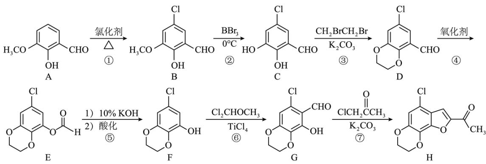  
回答下列问题:

(1) 化合物 A 在核磁共振氢谱上有\_\_\_\_组吸收峰;

(2) 化合物 D 中含氧官能团的名称为\_\_\_\_、\_\_\_\_；

（3）反应③和④的顺序不能对换的原因是\_\_\_\_；

(4) 在同一条件下, 下列化合物水解反应速率由大到小的顺序为\_\_\_\_(填标号);

①

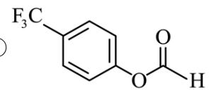

②

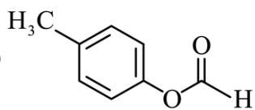

③

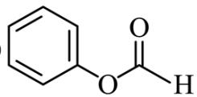

(5) 化合物 $\mathrm{G} \rightarrow \mathrm{H}$ 的合成过程中, 经历了取代、加成和消去三步反应, 其中加成反应的化学方程式为\_\_\_\_;

（6）依据以上流程信息，结合所学知识，设计以\$\left(\right)\text{和}\mathrm{Cl}\_{2}\mathrm{CHOCH}\_{3}\$为原料合成

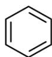

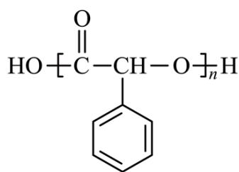

的路线\_\_\_\_(HCN 等无机试剂任选)。

【答案】(1) 6 (2) ①. 醛基 ②. 醚键

（3）先进行反应③再进行反应④可以防止酚羟基被氧化

(4) ①③②

(5)

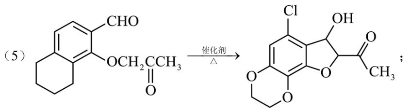

(6)

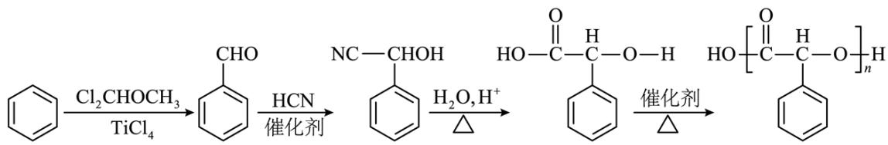

【解析】

【分析】A 与氯化剂在加热条件下反应得到 B，B 在 $BBr_{3}$ ，0℃ 的条件下，甲基被 H 取代得到 C，C 与 $CH_{2}BrCH_{2}Br$ 在 $K_{2}CO_{3}$ 的作用下发生取代反应得到 D，D 被氧化剂氧化为 E，E 中存在酯基，先水解，再酸化得到 F，F 与 $Cl_{2}CHOCH_{3}$ 在 $TiCl_{4}$ 的作用下苯环上一个 H 被醛基取代得到 G，G 与 $ClCH_{2}COCH_{3}$ 经历了取代、加成和消去三步反应得到 H。

【小问 1 详解】

由 A 的结构可知，A 有 6 种等效氢，即核磁共振氢谱上有 6 组吸收峰；

【小问 2 详解】

由 D 的结构可知，化合物 D 中含氧官能团的名称为：醛基、醚键；

【小问 3 详解】

反应③和④的顺序不能对换，先进行反应③再进行反应④可以防止酚羟基被氧化；

【小问 4 详解】

$F_{3}C$ 中 F 的电负性很强， $-CF_{3}$ 为吸电子基团，使得 -OOCH 中 C-O 键更易断裂，水解

反应更易进行， $H_{3}C$ 中- $CH_{3}$ 是斥电子集团，使得-OOCH中C-O键更难断裂，水解

反应更难进行，因此在同一条件下，化合物水解反应速率由大到小的顺序为：①③②；

【小问 5 详解】

化合物 G→H 的合成过程中，G 发生取代反应羟基上的 H 被- $CH_{2}COCH_{3}$ 取代，得到

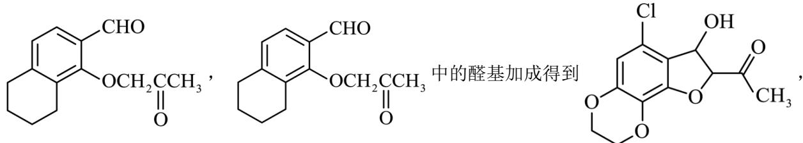

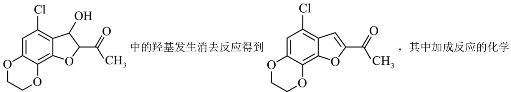

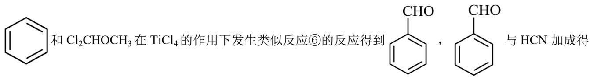

方程式为:

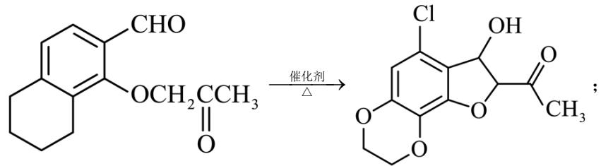

【小问6详解】

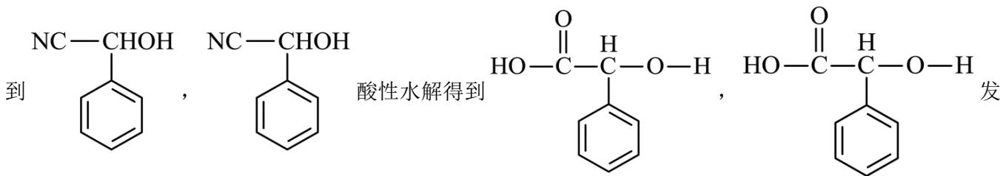

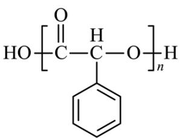

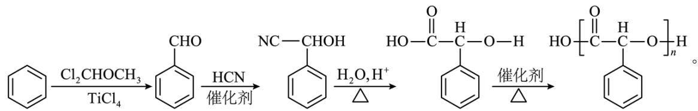

18. 丙烯腈( $\mathrm{CH}_{2}=\mathrm{CHCN}$ )是一种重要的化工原料。工业上以 $\mathrm{N}_{2}$ 为载气，用 $\mathrm{TiO}_{2}$ 作催化剂生产 $\mathrm{CH}_{2}=\mathrm{CHCN}$ 的流程如下：

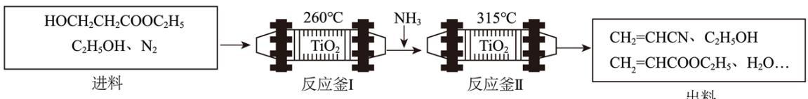

已知：①进料混合气进入两釜的流量恒定，两釜中反应温度恒定：

②反应釜Ⅰ中发生的反应:

$$
\mathrm{i}: \mathrm{HOCH} _ {2} \mathrm{CH} _ {2} \mathrm{COOC} _ {2} \mathrm{H} _ {5} (\mathrm{g}) \rightarrow \mathrm{CH} _ {2} = \mathrm{CHCOOC} _ {2} \mathrm{H} _ {5} (\mathrm{g}) + \mathrm{H} _ {2} \mathrm{O} (\mathrm{g}) \quad \Delta \mathrm{H} _ {1}
$$

③反应釜Ⅱ中发生的反应:

$$
\mathrm{ii}: \mathrm{CH} _ {2} = \mathrm{CHCOOC} _ {2} \mathrm{H} _ {5} (\mathrm{g}) + \mathrm{NH} _ {3} (\mathrm{g}) \rightarrow \mathrm{CH} _ {2} = \mathrm{CHCONH} _ {2} (\mathrm{g}) + \mathrm{C} _ {2} \mathrm{H} _ {5} \mathrm{OH} (\mathrm{g}) \quad \Delta \mathrm{H} _ {2}
$$

iii: $\mathrm{CH}_2 = \mathrm{CHCONH}_2(\mathrm{g})\rightarrow \mathrm{CH}_2 = \mathrm{CHCN}(\mathrm{g}) + \mathrm{H}_2\mathrm{O}(\mathrm{g})$ $\Delta \mathrm{H}_{3}$

④在此生产条件下，酯类物质可能发生水解。

回答下列问题:

（1）总反应 $\mathrm{HOCH}_2\mathrm{CH}_2\mathrm{COOC}_2\mathrm{H}_5(\mathrm{g}) + \mathrm{NH}_3(\mathrm{g})\rightarrow \mathrm{CH}_2 = \mathrm{CHCN}(\mathrm{g}) + \mathrm{C}_2\mathrm{H}_5\mathrm{OH}(\mathrm{g}) + 2\mathrm{H}_2\mathrm{O}(\mathrm{g})$ $\Delta \mathrm{H} =$ （用含 $\Delta \mathrm{H}_{1}$ 、 $\Delta \mathrm{H}_{2}$ 、和 $\Delta \mathrm{H}_{3}$ 的代数式表示）；

(2) 进料混合气中 $n(\mathrm{HOCH}_2\mathrm{CH}_2\mathrm{COOC}_2\mathrm{H}_5): n(\mathrm{C}_2\mathrm{H}_5\mathrm{OH}) = 1:2$ ，出料中四种物质 $(\mathrm{CH}_2 = \mathrm{CHCOOC}_2\mathrm{H}_5, \mathrm{CH}_2 = \mathrm{CHCN}, \mathrm{C}_2\mathrm{H}_5\mathrm{OH}, \mathrm{H}_2\mathrm{O})$ 的流量，(单位时间内出料口流出的物质的量)随时间变化关系如图：

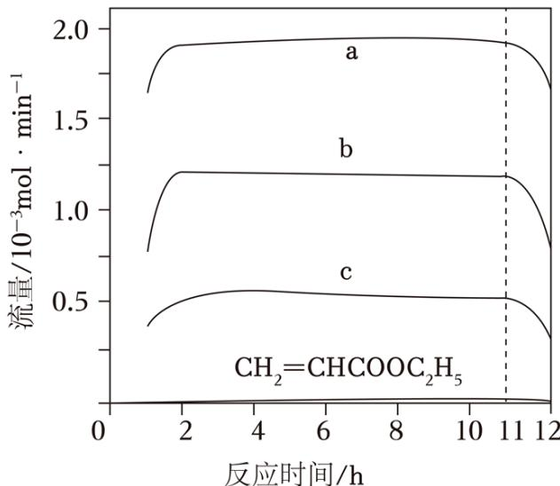

①表示 $CH_{2}=CHCN$ 的曲线是 \_\_\_\_ (填 “a” “b” 或 “c”);

②反应釜 I 中加入 $C_{2}H_{5}OH$ 的作用是 \_\_\_\_。

③出料中没有检测到 $CH_{2}=CHCONH_{2}$ 的原因是\_\_\_\_。

④反应11h后，a、b、c曲线对应物质的流量逐渐降低的原因是\_\_\_\_。

(3) 催化剂 $\mathrm{TiO}_{2}$ 再生时会释放 $\mathrm{CO}_{2}$ , 可用氨水吸收获得 $\mathrm{NH}_{4} \mathrm{HCO}_{3}$ 。现将一定量的 $\mathrm{NH}_{4} \mathrm{HCO}_{3}$ 固体 (含 $0.72 \mathrm{~g}$ 水) 置于密闭真空容器中, 充入 $\mathrm{CO}_{2}$ 和 $\mathrm{NH}_{3}$ , 其中 $\mathrm{CO}_{2}$ 的分压为 $100 \mathrm{kPa}$ , 在 $27^{\circ} \mathrm{C}$ 下进行干燥。为保证 $\mathrm{NH}_{4} \mathrm{HCO}_{3}$ 不分解, $\mathrm{NH}_{3}$ 的分压应不低于 \_\_\_\_ kPa (已知

$p(H_{2}O)=2.5\times10^{2}kPa\cdot mol^{-1}\times n(H_{2}O)\quad NH_{4}HCO_{3}$ 分解的平衡常数 $Kp=4\times10^{4}(kPa)^{3}$ ;

(4) 以 $\mathrm{CH}_{2} = \mathrm{CHCN}$ 为原料, 稀硫酸为电解液, Sn 作阴极, 用电解的方法可制得 $\mathrm{Sn}\left(\mathrm{CH}_{2} \mathrm{CH}_{2} \mathrm{CN}\right)_{4}$ , 其阴极反应式\_\_\_\_。

【答案】（1） $\Delta H_{1}+\Delta H_{2}+\Delta H_{3}$

(2) ①. c ②. 降低分压有利于反应 i 平衡正向移动且提高醇的浓度可以使酯的水解程度降低从而提高产率 ③. $\mathrm{CH}_{2}=\mathrm{CHCONH}_{2}$ 在反应釜 II 的温度下发生分解 ④. 反应时间过长, 催化剂中毒活性降低, 反应速率降低, 故产物减少 (3) 40

$$
\mathrm{Sn} + 4 \mathrm{CH} _ {2} = \mathrm{CHCN} + 4 \mathrm{e} ^ {-} + 4 \mathrm{H} ^ {+} = \mathrm{Sn} \left(\mathrm{CH} _ {2} \mathrm{CH} _ {2} \mathrm{CN}\right) _ {4}
$$

【解析】

【分析】工业上以 $N_{2}$ 为载气，用 $TiO_{2}$ 作催化剂，由 $HOCH_{2}CH_{2}COOC_{2}H_{5}$ 和 $C_{2}H_{5}OH$ 为进料气体生产 $CH_{2}=CHCN$ ，在反应釜 I 中发生反应 i： $HOCH_{2}CH_{2}COOC_{2}H_{5}(g)\rightarrow CH_{2}=CHCOOC_{2}H_{5}(g)+H_{2}O(g)$ ，加入 $NH_{3}$ 后，在反应釜 II 中发生反应 ii： $CH_{2}=CHCOOC_{2}H_{5}(g)+NH_{3}(g)\rightarrow CH_{2}=CHCONH_{2}(g)+C_{2}H_{5}OH(g)$ ，反应 iii： $CH_{2}=CHCONH_{2}(g)\rightarrow CH_{2}=CHCN(g)+H_{2}O(g)$ ，故产物的混合气体中有 $CH_{2}=CHCN$ 、未反应完的 $C_{2}H_{5}OH$ 、 $CH_{2}=CHCOOC_{2}H_{5}(g)$ 和水；

根据盖斯定律，总反应 $\mathrm{HOCH}_2\mathrm{CH}_2\mathrm{COOC}_2\mathrm{H}_5(\mathrm{g}) + \mathrm{NH}_3(\mathrm{g})\rightarrow \mathrm{CH}_2 = \mathrm{CHCN}(\mathrm{g}) + \mathrm{C}_2\mathrm{H}_5\mathrm{OH}(\mathrm{g}) + 2\mathrm{H}_2\mathrm{O}(\mathrm{g})$ 可以由反应i+反应ii+反应iii得到，故 $\Delta \mathrm{H} = \Delta \mathrm{H}_{1} + \Delta \mathrm{H}_{2} + \Delta \mathrm{H}_{3}$

①根据总反应 $HOCH_{2}CH_{2}COOC_{2}H_{5}(g)+NH_{3}(g)\rightarrow CH_{2}=CHCN(g)+C_{2}H_{5}OH(g)+2H_{2}O(g)$ ，设进料混合气中 $n(HOCH_{2}CH_{2}COOC_{2}H_{5})=1mol$ ， $n(C_{2}H_{5}OH)=2mol$ ，出料气中 $CH_{2}=CHCOOC_{2}H_{5}$ 含量很少，则生成 $CH_{2}=CHCN(g)$ 、 $C_{2}H_{5}OH(g)$ 物质的量约为 1mol，生成 $H_{2}O(g)$ 的物质的量约为 2mol，故出料气中 $C_{2}H_{5}OH(g)$ 物质的量共约 3mol，故出料气中 $CH_{2}=CHCN$ 、 $C_{2}H_{5}OH$ 、 $H_{2}O$ 物质的量之比约为 1:3:2，故曲线 c 表示 $CH_{2}=CHCN$ 的曲线；

②反应釜I中发生反应 i 是气体体积增大的反应，故加入 $C_{2}H_{5}OH$ 降低分压有利于反应 i 平衡正向移动且提高醇的浓度可以使酯的水解程度降低从而提高产率；

$$
\left(\mathrm{CH} _ {2} = \mathrm{CHCONH} _ {2}\right)
$$

$$
1 6 0 ^ {\circ} \mathrm{C}
$$

$$
1 7 0 ^ {\circ} \mathrm{C}
$$

$$
\mathrm{CH} _ {2} = \mathrm{CHCONH} _ {2}
$$

$$
\mathrm{CH} _ {2} = \mathrm{CHCONH} _ {2}
$$

④反应 11h 后，a、b、c 曲线对应物质的流量逐渐降低的原因是反应时间过长，催化剂中毒活性降低，反应速率降低，故产物减少；

【小问 3 详解】

0.72g 水的物质的量为 0.04mol，故 $p(\mathrm{H}_{2}\mathrm{O})=2.5\times10^{2}\mathrm{kPa}\cdot\mathrm{mol}^{-1}\times n(\mathrm{H}_{2}\mathrm{O})=10\mathrm{kPa}$ ， $NH_{4}HCO_{3}$ 分解的反应式为 $NH_{4}HCO_{3}=NH_{3}\uparrow+CO_{2}\uparrow+H_{2}O\uparrow$ ，故 $NH_{4}HCO_{3}$ 分解的平衡常数 $K_{p}=p(NH_{3})p(CO_{2})p(H_{2}O)=4\times10^{4}(kPa)^{3}$ ，解得 $p(NH_{3})=40kPa$ ，故为保证 $NH_{4}HCO_{3}$ 不分解， $NH_{3}$ 的分压应不低于 40kPa；

【小问 4 详解】

$\mathrm{Sn(CH_{2}CH_{2}CN)_{4}}$ 是有机化合物，与水不溶，水中不电离，以 $\mathrm{CH}_{2}=\mathrm{CHCN}$ 为原料在 Sn 做的阴极得电子制得 $\mathrm{Sn(CH_{2}CH_{2}CN)_{4}}$ ，故阴极的电极反应式为 $\mathrm{Sn}+4\mathrm{CH}_{2}=\mathrm{CHCN}+4\mathrm{e}^{-}+4\mathrm{H}^{+}=\mathrm{Sn(CH_{2}CH_{2}CN)_{4}}$ 。