# 2024 年甘肃省普通高校招生统一考试

# 化学

## 注意事项：

1. 答卷前，考生务必将自己的姓名、准考证号填写在答题卡上。

2. 回答选择题时，选出每小题答案后，用 2B 铅笔把答题卡上对应题目的答案标号框涂黑。如需改动，用橡皮擦干净后，再选涂其它答案标号框。回答非选择题时，将答案写在答题卡上。写在本试卷上无效。

3. 考试结束后，将本试卷和答题卡一并交回。

可能用到的相对原子质量：Si-28

## 一、选择题：本题共14小题，每小题3分，共42分。在每小题给出的四个选项中，只有一项是符合题目要求的。

1. 下列成语涉及金属材料的是
A. 洛阳纸贵 B. 聚沙成塔 C. 金戈铁马 D. 甘之若饴

【详解】A. 纸的主要成分是纤维素，不是金属材料，A 错误；  
B. 沙的主要成分是硅酸盐，不是金属材料，B 错误；  
C. 金和铁都是金属，C 正确；  
D. 甘之若饴意思是把它看成像糖那样甜，糖类是有机物，不是金属材料，D 错误；故选 C。

2. 下列化学用语表述错误的是

A. $Ca^{2+}$ 和 $Cl^{-}$ 的最外层电子排布图均为 3s 3p
↑↓ ↑↓ ↑↓

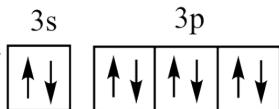

B. $PH_{3}$ 和 $H_{2}S$ 的电子式分别为 $\begin{array}{c}H:P:H\\ \ddots \\ H\end{array}$ 和 $H:S:H$

C. $CH_{2}=CHCH_{2}CH_{2}CH_{3}$ 的分子结构模型为

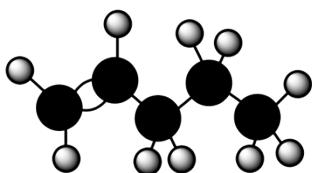

D. ${}^{12}_{6}C$ 、 ${}^{13}_{6}C$ 和 ${}^{14}_{6}C$ 互为同位素

【答案】B

【解析】

【详解】A. $Ca^{2+}$ 和 Cl⁻ 的核外电子数都是 18，最外层电子排布图均为 3s 3p ，故 A 正

确；

B. $\mathrm{PH}_{3}$ 中磷原子和每个氢原子共用一对电子, 中心原子 P 原子价层电子对数为 $3 + \frac{1}{2} \times (5 - 3 \times 1) = 4$ , 孤电
子对数为 1, $\mathrm{PH}_{3}$ 的电子式为 $\begin{array}{c}\mathrm{H}:\ddot{\mathrm{P}}:\mathrm{H}\\ \ddot{\mathrm{H}}\end{array}$ , 故 B 错误;

C. $\mathrm{CH}_2 = \mathrm{CHCH}_2\mathrm{CH}_2\mathrm{CH}_3$ 分子中存在1个碳碳双键，位于1号碳原子与2号碳原子之间，存在3个碳碳单

键，无支链，且氢原子半径小于碳原子半径，其分子结构模型表示为 \_\_\_\_ ，故 C 正

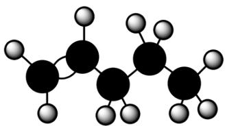

确；

D. ${ }_{6}^{12} \mathrm{C}$ 、 ${ }_{6}^{13} \mathrm{C}$ 和 ${ }_{6}^{14} \mathrm{C}$ 是质子数相同、中子数不同的碳原子，是碳元素的不同核素，互为同位素，故 D 正确；

故选 B。

3. 化学与生活息息相关，下列对应关系错误的是

<table><tr><td></td><td>物质</td><td>性质</td><td>用途</td></tr><tr><td>A</td><td>次氯酸钠</td><td>氧化性</td><td>衣物漂白</td></tr><tr><td>B</td><td>氢气</td><td>可燃性</td><td>制作燃料电池</td></tr><tr><td>C</td><td>聚乳酸</td><td>生物可降解性</td><td>制作一次性餐具</td></tr><tr><td>D</td><td>活性炭</td><td>吸附性</td><td>分解室内甲醛</td></tr></table>

A.A B.B C.C D.D

【答案】D

【解析】

【详解】A. 次氯酸钠有强氧化性，从而可以做漂白剂，用于衣物漂白，A 正确；  
B. 氢气是可燃气体，具有可燃性，能被氧气氧化，可以制作燃料电池，B 正确；  
C. 聚乳酸具有生物可降解性，无毒，是高分子化合物，可以制作一次性餐具，C 正确；  
D. 活性炭有吸附性，能够有效吸附空气中的有害气体、去除异味，但无法分解甲醛，D 错误；

故本题选 D。

4. 下列措施能降低化学反应速率的是
A. 催化氧化氨制备硝酸时加入铂
B. 中和滴定时，边滴边摇锥形瓶
C. 锌粉和盐酸反应时加水稀释
D. 石墨合成金刚石时增大压强

【详解】A. 催化剂可以改变化学反应速率, 一般来说, 催化剂可以用来加快化学反应速率, 故催化氧化氨制备硝酸时加入铂可以加快化学反应速率, A 项不符合题意;  
B. 中和滴定时, 边滴边摇锥形瓶, 可以让反应物快速接触, 可以加快化学反应速率, B 项不符合题意;  
C. 锌粉和盐酸反应时加水稀释会降低盐酸的浓度, 会降低化学反应速率, C 项符合题意;  
D. 石墨合成金刚石, 该反应中没有气体参与, 增大压强不会改变化学反应速率, D 项不符合题意;

5. X、Y、Z、W、Q 为短周期元素，原子序数依次增大，最外层电子数之和为 18。Y 原子核外有两个单电子，Z 和 Q 同族，Z 的原子序数是 Q 的一半，W 元素的焰色试验呈黄色。下列说法错误的是
A. X、Y 组成的化合物有可燃性
B. X、Q 组成的化合物有还原性
C. Z、W 组成的化合物能与水反应
D. W、Q 组成的化合物溶于水呈酸性

【答案】D

【解析】

【分析】X、Y、Z、W、Q为短周期元素，W元素的焰色试验呈黄色，W为Na元素；Z和Q同族，Z的原子序数是Q的一半，则Z为O、Q为S；Y原子核外有两个单电子、且原子序数小于Z，Y为C元素；X、Y、Z、W、Q的最外层电子数之和为18，则X的最外层电子数为18-4-6-1-6=1，X可能为H或Li。
【详解】A. 若 X 为 H, H 与 C 组成的化合物为烃，烃能够燃烧，若 X 为 Li, Li 与 C 组成的化合物也具有可燃性，A 项正确；
B. X、Q 组成的化合物中 Q（即 S）元素呈 -2 价，为 S 元素的最低价，具有还原性，B 项正确；
C. Z、W 组成的化合物为 $Na_{2}O$ 、 $Na_{2}O_{2}$ ， $Na_{2}O$ 与水反应生成 NaOH， $Na_{2}O_{2}$ 与水反应生成 NaOH 和 $O_{2}$ ，C 项正确；
D. W、Q 组成的化合物 $Na_{2}S$ 属于强碱弱酸盐，其溶于水所得溶液呈碱性，D 项错误；

答案选D。

6. 下列实验操作对应的装置不正确的是

<table><tr><td>A</td><td>B</td><td>C</td><td>D</td></tr><tr><td>灼烧海带制海带灰</td><td>准确量取15.00mL稀盐酸</td><td>配制一定浓度的NaCl溶液</td><td>使用电石和饱和食盐水制备 $C_2H_2$ </td></tr><tr><td></td><td></td><td></td><td></td></tr></table>

A.A B.B C.C D.D

【答案】A

【解析】

【详解】A．灼烧海带制海带灰应在坩埚中进行，并用玻璃棒搅拌，给坩埚加热时不需要使用石棉网或陶土网，A项错误；  
B．稀盐酸呈酸性，可用酸式滴定管量取 $15.00\mathrm{mL}$ 稀盐酸，B项正确；

C. 配制一定浓度的 NaCl 溶液时, 需要将在烧杯中溶解得到的 NaCl 溶液通过玻璃棒引流转移到选定规格的容量瓶中, C 项正确;

D. 电石的主要成分 $\mathrm{CaC}_2$ 与水发生反应 $\mathrm{CaC}_2 + 2\mathrm{H}_2\mathrm{O}\rightarrow \mathrm{Ca(OH)}_2 + \mathrm{CH}\equiv \mathrm{CH}\uparrow$ 制取 $\mathrm{C}_2\mathrm{H}_2$ ，该制气反应属于固体与液体常温制气反应，分液漏斗中盛放饱和食盐水，具支锥形瓶中盛放电石，D项正确；

7. 某固体电解池工作原理如图所示，下列说法错误的是

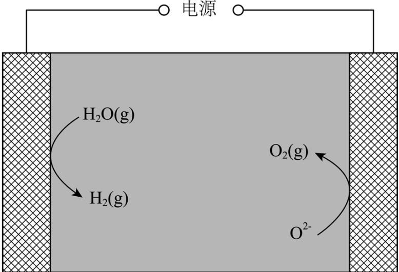

A. 电极1的多孔结构能增大与水蒸气的接触面积  
B. 电极2是阴极，发生还原反应： $\mathrm{O}_{2} + 4\mathrm{e}^{-} = 2\mathrm{O}^{2-}$ C. 工作时 $\mathrm{O}^{2-}$ 从多孔电极1迁移到多孔电极2  
D. 理论上电源提供 $2\mathrm{mole}^{-}$ 能分解 $1\mathrm{molH}_{2}\mathrm{O}$

【分析】多孔电极 1 上 $\mathrm{H}_{2}\mathrm{O}(\mathrm{g})$ 发生得电子的还原反应转化成 $\mathrm{H}_{2}(\mathrm{g})$ ，多孔电极 1 为阴极，电极反应为 $2\mathrm{H}_{2}\mathrm{O}+4\mathrm{e}^{-}=2\mathrm{H}_{2}+2\mathrm{O}^{2-}$ ; 多孔电极 2 上 $\mathrm{O}^{2-}$ 发生失电子的氧化反应转化成 $\mathrm{O}_{2}(\mathrm{g})$ ，多孔电极 2 为阳极，电极反应为 $2\mathrm{O}^{2-}-4\mathrm{e}^{-}=\mathrm{O}_{2}$ 。

【详解】A．电极 1 的多孔结构能增大电极的表面积，增大与水蒸气的接触面积，A 项正确；
B．根据分析，电极 2 为阳极，发生氧化反应： $2\mathrm{O}^{2-}-4\mathrm{e}^{-}=\mathrm{O}_{2}$ ，B 项错误；
C．工作时，阴离子 $O^{2-}$ 向阳极移动，即 $O^{2-}$ 从多孔电极 1 迁移到多孔电极 2，C 项正确；

$$
2 \mathrm{H} _ {2} \mathrm{O} (\mathrm{g}) \stackrel {\text {电解}} {=} 2 \mathrm{H} _ {2} + \mathrm{O} _ {2}
$$

$$
2 \mathrm{mol} \mathrm{H} _ {2} \mathrm{O}
$$

$$
1 \mathrm{mol} \mathrm{H} _ {2} \mathrm{O}
$$

8. 曲美托嗪是一种抗焦虑药，合成路线如下所示，下列说法错误的是

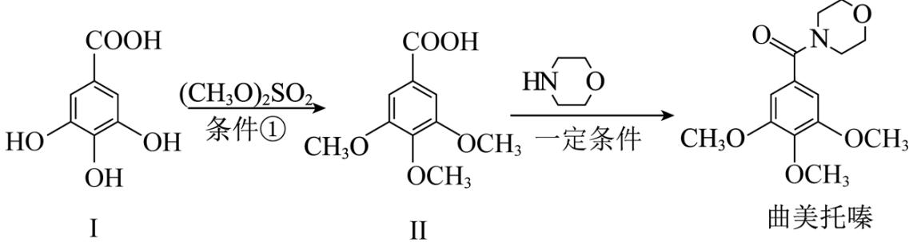

A. 化合物 I 和 II 互为同系物
B. 苯酚和 $\left(\mathrm{CH}_{3}\mathrm{O}\right)_{2}\mathrm{SO}_{2}$ 在条件①下反应得到苯甲醚
C. 化合物Ⅱ能与 $NaHCO_{3}$ 溶液反应
D. 曲美托嗪分子中含有酰胺基团
【答案】A

【解析】

【详解】A. 化合物I含有的官能团有羧基、酚羟基，化合物II含有的官能团有羧基、醚键，官能团种类不同，化合物I和化合物II不互为同系物，A项错误；  
B. 根据题中流程可知，化合物I中的酚羟基与 $(\mathrm{CH}_3\mathrm{O})_2\mathrm{SO}_2$ 反应生成醚，故苯酚和 $(\mathrm{CH}_3\mathrm{O})_2\mathrm{SO}_2$ 在条件①下反应得到苯甲醚，B项正确；  
C. 化合物II中含有羧基，可以与 $\mathrm{NaHCO}_3$ 溶液反应，C项正确；  
D. 由曲美托嗪的结构简式可知，曲美托嗪中含有的官能团为酰胺基、醚键，D项正确；故选A。

9. 下列实验操作、现象和结论相对应的是

<table><tr><td></td><td>实验操作、现象</td><td>结论</td></tr><tr><td>A</td><td>用蓝色石蕊试纸检验某无色溶液,试纸变红</td><td>该溶液是酸溶液</td></tr><tr><td>B</td><td>用酒精灯灼烧织物产生类似烧焦羽毛的气味</td><td>该织物含蛋白质</td></tr><tr><td>C</td><td>乙醇和浓硫酸加热,产生的气体使溴水褪色</td><td>该气体是乙烯</td></tr><tr><td>D</td><td>氯化镁溶液中滴入氢氧化钠溶液,生成沉淀</td><td>氢氧化钠的碱性比氢氧化镁强</td></tr></table>

A.A B.B C.C D.D

【答案】B

【解析】

【详解】A. 用蓝色石蕊试纸检验某无色溶液，试纸变红，该溶液显酸性，但不一定是酸溶液，也有可能是显酸性的盐溶液，A项不符合题意；  
B. 动物纤维主要成分是蛋白质，灼烧后有类似烧焦羽毛的味道，若用酒精灯灼烧织物产生类似烧焦羽毛的味道，说明该织物含有动物纤维，含有蛋白质，B项符合题意；  
C. 乙醇和浓硫酸加热，会产生很多产物，如加热温度在 $170^{\circ} \mathrm{C}$ ，主要产物为乙烯；如加热温度在 $140^{\circ} \mathrm{C}$ ，主要产物为二乙醚；同时乙醇可在浓硫酸下脱水生成碳单质，继续和浓硫酸在加热条件下产生二氧化碳、二氧化硫等，其中的产物二氧化硫也能使溴水褪色，不能说明产生的气体就是乙烯，C项不符合题意；  
D. 氯化镁溶液中滴入氢氧化钠溶液，会发生复分解反应，生成难溶的氢氧化镁，与氢氧化钠和氢氧化镁的碱性无关，不能由此得出氢氧化钠的碱性比氢氧化镁强，D项不符合题意；故选B。

10. 甲烷在某含 Mo 催化剂作用下部分反应的能量变化如图所示，下列说法错误的是

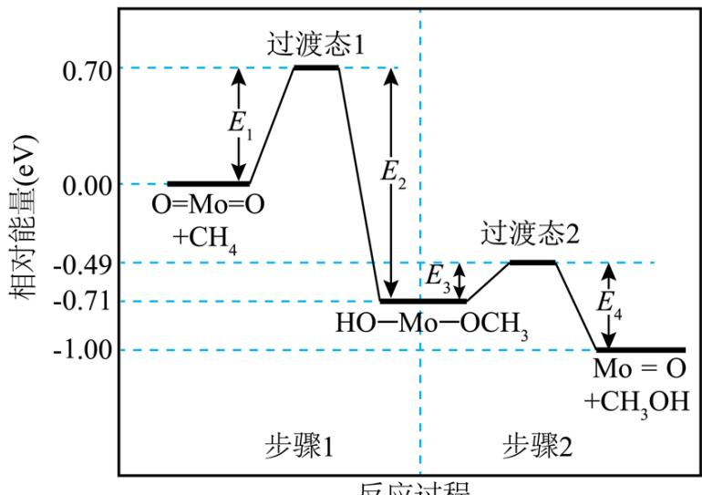

A. $\mathrm{E}_2 = 1.41\mathrm{eV}$ B. 步骤2逆向反应的 $\Delta \mathrm{H} = +0.29\mathrm{eV}$ C. 步骤1的反应比步骤2快 D. 该过程实现了甲烷的氧化

【详解】A．由能量变化图可知， $E_{2}=0.70eV-(-0.71eV)=1.41eV$ ，A项正确；
B．由能量变化图可知，步骤2逆向反应的 $\Delta H=-0.71eV-(-1.00eV)=+0.29eV$ ，B项正确；
C．由能量变化图可知，步骤1的活化能 $E_{1}=0.70eV$ ，步骤2的活化能 $E_{3}=-0.49eV-(-0.71eV)=0.22eV$ ，
步骤1的活化能大于步骤2的活化能，步骤1的反应比步骤2慢，C项错误；
D．该过程甲烷转化为甲醇，属于加氧氧化，该过程实现了甲烷的氧化，D项正确；
故选 C。

11. 兴趣小组设计了从 AgCl 中提取 Ag 的实验方案，下列说法正确的是

$\mathrm{AgCl}\xrightarrow{\text{氨水}}[\mathrm{Ag}(\mathrm{NH}_{3})_{2}]^{+}\xrightarrow{\mathrm{Cu}}[\mathrm{Cu}(\mathrm{NH}_{3})_{4}]^{2+}\xrightarrow[\text{Ag}]{\text{浓盐酸}}\mathrm{CuCl}_{2}\xrightarrow[\mathrm{NH}_{4}\mathrm{Cl}]{\mathrm{Fe},\mathrm{O}_{2}}\text{溶液①}$ A. 还原性: $\mathrm{Ag > Cu > Fe}$ B. 按上述方案消耗 $1\mathrm{molFe}$ 可回收 $1\mathrm{molAg}$ C. 反应①的离子方程式是 $\left[\mathrm{Cu}\left(\mathrm{NH}_{3}\right)_{4}\right]^{2+} + 4\mathrm{H}^{+} = \mathrm{Cu}^{2+} + 4\mathrm{NH}_{4}^{+}$ D. 溶液①中的金属离子是 $\mathrm{Fe}^{2+}$ 【答案】C

【解析】

【分析】从实验方案可知，氨水溶解了氯化银，然后用铜置换出银，滤液中加入浓盐酸后得到氯化铜和氯化铵的混合液，向其中加入铁、铁置换出铜，过滤分铜可以循环利用，并通入氧气可将亚铁离子氧化为铁离子。

【详解】A．金属活动性越强，金属的还原性越强，而且由题中的实验方案能得到证明，还原性从强到弱的顺序为 $Fe > Cu > Ag$ ，A 不正确；

B. 由电子转移守恒可知, $1 \mathrm{~mol} \mathrm{Fe}$ 可以置换 $1 \mathrm{~mol} \mathrm{Cu}$ , 而 $1 \mathrm{~mol} \mathrm{Cu}$ 可以置换 $2 \mathrm{~mol} \mathrm{Ag}$ , 因此, 根据按上述方案消耗 $1 \mathrm{~mol} \mathrm{Fe}$ 可回收 $2 \mathrm{~mol} \mathrm{Ag}$ , B 不正确;

C．反应①中，氯化四氨合铜溶液与浓盐酸反应生成氯化铜和氯化铵，该反应的离子方程式是 $\left[\mathrm{Cu}\left(\mathrm{NH}_{3}\right)_{4}\right]^{2+} + 4\mathrm{H}^{+} = \mathrm{Cu}^{2+} + 4\mathrm{NH}_{4}^{+}$ ，C正确；

D. 向氯化铜和氯化铵的混合液中加入铁, 铁置换出铜后生成 $\mathrm{Fe}^{2+}$ , 然后 $\mathrm{Fe}^{2+}$ 被通入的氧气氧化为 $\mathrm{Fe}^{3+}$ , 氯化铵水解使溶液呈酸性, 在这个过程中, 溶液中的氢离子参与反应, 因此氢离子浓度减少促进了铁离子水解生成氢氧化铁沉淀, 氢氧化铁存在沉淀溶解平衡, 因此, 溶液①中的金属离子是 $\mathrm{Fe}^{3+}$ , D 不正确;

综上所述，本题选 C。

12. $\beta$ -MgCl $_2$ 晶体中, 多个晶胞无隙并置而成的结构如图甲所示, 其中部分结构显示为图乙, 下列说法错误的是

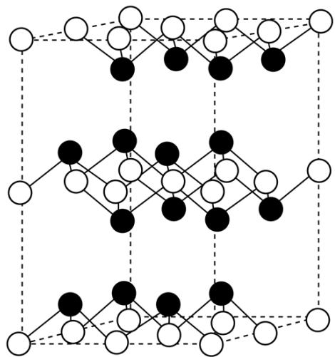

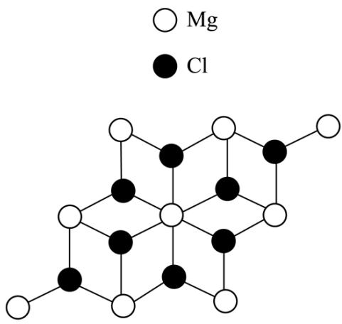  
甲  
乙

A. 电负性: $\mathrm{Mg} < \mathrm{Cl}$ B. 单质 $\mathrm{Mg}$ 是金属晶体 C. 晶体中存在范德华力 D. $\mathrm{Mg}^{2+}$ 离子的配位数为 3

【解析】

【详解】A．电负性越大的元素吸引电子的能力越强，活泼金属的电负性小于活泼非金属，因此，Mg 的电负性小于 Cl，A 正确；
B．金属晶体包括金属单质及合金，单质 Mg 是金属晶体，B 正确；
C．由晶体结构可知，该结构中存在层状结构，层与层之间存在范德华力，C 正确；
D．由图乙中结构可知，每个 $Mg^{2+}$ 与周围有 6 个 $Cl^{-}$ 最近且距离相等，因此， $Mg^{2+}$ 的配位数为 6，D 错误；

温室气体 $\mathrm{N}_2\mathrm{O}$ 在催化剂作用下可分解为 $\mathrm{O}_2$ 和 $\mathrm{N}_2$ ，也可作为氧化剂氧化苯制苯酚。据此完成下面小题。13. 下列说法错误的是A. 原子半径： $\mathrm{O} < \mathrm{N} < \mathrm{C}$ B. 第一电离能： $\mathrm{C} < \mathrm{N} < \mathrm{O}$ C. 在水中的溶解度：苯<苯酚 D. 苯和苯酚中C的杂化方式相同

14. 下列说法错误的是
A. 相同条件下 $N_{2}$ 比 $O_{2}$ 稳定
B. $N_{2}O$ 与 $NO_{2}^{+}$ 的空间构型相同
C. $N_{2}O$ 中 N-O 键比 N-N 键更易断裂
D. $N_{2}O$ 中 $\sigma$ 键和大 $\pi$ 键的数目不相等

【解析】

【13 题详解】

A. C、N、O都是第二周期的元素，其原子序数依次递增；同一周期的元素，从左到右原子半径依次减小，因此，原子半径从小到大的顺序为 $\mathrm{O} < \mathrm{N} < \mathrm{C}$ ，A正确；  
B. 同一周期的元素，从左到右电负性呈递增的趋势，其中IIA和VA的元素因其原子结构相对较稳定而出现反常，使其电负性大于同周期相邻的元素，因此，第一电离能从小到大的顺序为 $\mathrm{C} < \mathrm{O} < \mathrm{N}$ ，B不正确；  
C. 苯是非极性分子，苯酚是极性分子，且苯酚与水分子之间可以形成氢键，根据相似相溶规则可知，苯酚在水中的溶解度大于苯，C正确；  
D. 苯和苯酚中C的杂化方式均为 $\mathfrak{sp}^2$ ，杂化方式相同，D正确；

综上所述，本题选 B。

【14 题详解】

A. $\mathrm{N}_{2}$ 分子中存在的 $\mathrm{N} \equiv \mathrm{N}$ , $\mathrm{O}_{2}$ 分子中虽然也存在叁键, 但是其键能小于 $\mathrm{N} \equiv \mathrm{N}$ , 因此, 相同条件下 $\mathrm{N}_{2}$ 比 $\mathrm{O}_{2}$ 稳定, A 正确;  
B. $\mathrm{N}_{2} \mathrm{O}$ 与 $\mathrm{NO}_{2}^{+}$ 均为 $\mathrm{CO}_{2}$ 的等电子体, 故其均为直线形分子, 两者空间构型相同, B 正确;  
C. $\mathrm{N}_{2} \mathrm{O}$ 的中心原子是 $\mathrm{N}$ , 其在催化剂作用下可分解为 $\mathrm{O}_{2}$ 和 $\mathrm{N}_{2}$ , 说明 $\mathrm{N}_{2} \mathrm{O}$ 中 $\mathrm{N}-\mathrm{O}$ 键比 $\mathrm{N}-\mathrm{N}$ 键更易断裂, C 正确;  
D. $\mathrm{N}_{2} \mathrm{O}$ 中 $\sigma$ 键和大 $\pi$ 键的数目均为 2, 因此, $\sigma$ 键和大 $\pi$ 键的数目相等, D 不正确;  
综上所述, 本题选 D。

## 二、非选择题：本题共4小题，共58分。

15. 我国科研人员以高炉渣(主要成分为 CaO, MgO, $Al_{2}O_{3}$ 和 $SiO_{2}$ 等)为原料，对炼钢烟气( $CO_{2}$ 和水蒸气)进行回收利用，有效减少了环境污染，主要流程如图所示：

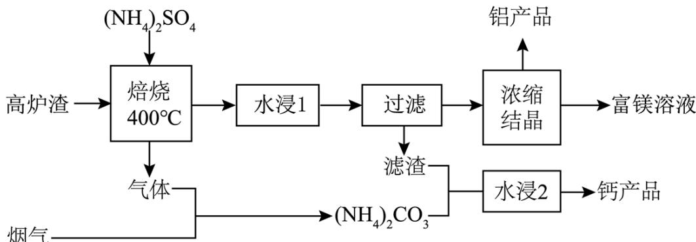

已知： $\mathrm{K_{sp}(CaSO_4) = 4.9\times 10^{-5}}$ $\mathrm{K_{sp}(CaCO_3) = 3.4\times 10^{-9}}$

(1) 高炉渣与 $\left(\mathrm{NH}_{4}\right)_{2}\mathrm{SO}_{4}$ 经焙烧产生的“气体”是\_\_\_\_。

(2) “滤渣”的主要成分是 $\mathrm{CaSO}_{4}$ 和 \_\_\_\_。

(3) “水浸 2”时主要反应的化学方程式为\_\_\_\_，该反应能进行的原因是\_\_\_\_。

(4) 铝产品 $\mathrm{NH}_{4} \mathrm{Al}\left(\mathrm{SO}_{4}\right)_{2} \cdot 12 \mathrm{H}_{2} \mathrm{O}$ 可用于 \_\_\_\_。

(5) 某含钙化合物的晶胞结构如图甲所示, 沿 x 轴方向的投影为图乙, 晶胞底面显示为图丙, 晶胞参数 $a \neq c, \alpha = \beta = \gamma = 90^{\circ}$ 。图丙中 Ca 与 N 的距离为 \_\_\_\_ pm; 化合物的化学式是 \_\_\_\_, 其摩尔质量为 $\mathrm{Mg} \cdot \mathrm{mol}^{-1}$ , 阿伏加德罗常数的值是 $\mathrm{N}_{\mathrm{A}}$ , 则晶体的密度为 \_\_\_\_ g·cm $^{-3}$ (列出计算表达式)。

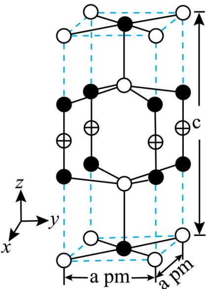  
甲

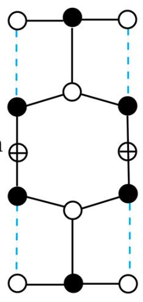  
乙

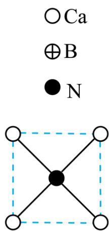  
丙

【答案】(1) $NH_{3}$ (2) $SiO_{2}$

(3) ①. $\mathrm{CaSO}_4 + (\mathrm{NH}_4)_2\mathrm{CO}_3 = \mathrm{CaCO}_3 + (\mathrm{NH}_4)_2\mathrm{SO}_4$ ②. $\mathrm{K_{sp}(CaSO_4) > K_{sp}(CaCO_3)}$ ，微溶

的硫酸钙转化为更难溶的碳酸钙
(4) 净水 (5) ①. $\frac{\sqrt{2}}{2} a$ ②. $Ca_{3}N_{3}B$ ③. $\frac{M}{N_{A}a^{2}c} \times 10^{30}$

【解析】

【分析】高炉渣(主要成分为CaO，MgO， $\mathrm{Al}_{2}\mathrm{O}_{3}$ 和 $\mathrm{SiO}_{2}$ 等)加入 $(\mathrm{NH}_{4})_{2}\mathrm{SO}_{4}$ 在 $400^{\circ}\mathrm{C}$ 下焙烧，生成硫酸钙、硫酸镁、硫酸铝，同时产生气体，该气体与烟气 $(\mathrm{CO}_{2}$ 和水蒸气)反应，生成 $(\mathrm{NH}_{4})_{2}\mathrm{CO}_{3}$ ，所以该气体为 $\mathrm{NH}_{3}$ ；焙烧产物经过水浸1，然后过滤，滤渣为 $\mathrm{CaSO}_{4}$ 以及未反应的 $\mathrm{SiO}_{2}$ ，滤液溶质主要为硫酸镁、硫酸铝及硫酸铵；滤液浓缩结晶，析出 $\mathrm{NH}_{4} \mathrm{Al}(\mathrm{SO}_{4})_{2} \cdot 12 \mathrm{H}_{2} \mathrm{O}$ ，剩余富镁溶液；滤渣加入 $(\mathrm{NH}_{4})_{2} \mathrm{CO}_{3}$ 溶液，滤渣中的 $\mathrm{CaSO}_{4}$ 会转化为更难溶的碳酸钙。

## 【小问 1 详解】

由分析可知，高炉渣与 $\left(\mathrm{NH}_{4}\right)_{2}\mathrm{SO}_{4}$ 经焙烧产生的“气体”是 $NH_{3}$ ;

【小问 2 详解】

由分析可知，“滤渣”的主要成分是 $CaSO_{4}$ 和未反应的 $SiO_{2}$ ;

【小问 3 详解】

“水浸 2”时主要反应为硫酸钙与碳酸铵生成更难溶的碳酸钙，反应方程式为

$\mathrm{CaSO_{4}+(NH_{4})_{2}CO_{3}=CaCO_{3}+(NH_{4})_{2}SO_{4}}$ ，该反应之所以能发生，是由于 $K_{\mathrm{sp}}(\mathrm{CaSO}_{4})=4.9\times10^{-5}$ ， $K_{\mathrm{sp}}(\mathrm{CaCO}_{3})=3.4\times10^{-9}$ ， $K_{\mathrm{sp}}(\mathrm{CaSO}_{4})>K_{\mathrm{sp}}(\mathrm{CaCO}_{3})$ ，微溶的硫酸钙转化为更难溶的碳酸钙；【小问4详解】

铝产品 $\mathrm{NH_{4}Al(SO_{4})_{2}\cdot12H_{2}O}$ 溶于水后，会产生 $Al^{3+}$ ， $Al^{3+}$ 水解生成 $\mathrm{Al(OH)_{3}}$ 胶体，可用于净水；

【小问 5 详解】

图丙中，Ca 位于正方形顶点，N 位于正方形中心，故 Ca 与 N 的距离为 $\frac{\sqrt{2}}{2}$ a pm；由均摊法可知，晶胞中 Ca 的个数为 $8 \times \frac{1}{8} + 2 = 3$ ，N 的个数为 $8 \times \frac{1}{4} + 2 \times \frac{1}{2} = 3$ ，B 的个数为 $4 \times \frac{1}{4} = 1$ ，则化合物的化学式是 $Ca_{3}N_{3}B$ ；其摩尔质量为 $Mg \cdot mol^{-1}$ ，阿伏加德罗常数的值是 $N_{A}$ ，晶胞体积为 $a^{2}c \times 10^{-30} cm^{3}$ 则晶体的密度为 $\frac{M}{N_{A}a^{2}c} \times 10^{30} g \cdot cm^{-3}$ 。

16. 某兴趣小组设计了利用 $MnO_{2}$ 和 $H_{2}SO_{3}$ 生成 $MnS_{2}O_{6}$ ，再与 $Na_{2}CO_{3}$ 反应制备 $Na_{2}S_{2}O_{6} \cdot 2H_{2}O$ 的方案：

$$
\text { 适量水 } \xrightarrow [ \text { 冰水浴 } ]{\text { 通入SO } _ {2} \text { 至饱和 }} \xrightarrow [ \text { 控制温度 } ]{\text { 加入MnO } _ {2}} \xrightarrow [ \text { 低于10℃ } ]{\text { Ⅱ }} \xrightarrow [ \text { Ⅱ   停止通入SO } _ {2} ]{\text { Ⅲ }} \xrightarrow [ \text { Ⅱ   滴入饱和 } ]{\text { Ⅳ   滴入饱和 }} \xrightarrow {\text { 过滤 }} \xrightarrow [ \text { 取滤液 } ]{\text { V }} \xrightarrow {\text { Na } _ {2} \mathrm{S} _ {2} \mathrm{O} _ {6} \cdot 2 \mathrm{H} _ {2} \mathrm{O}}
$$

(1) 采用下图所示装置制备 $\mathrm{SO}_2$ ，仪器 a 的名称为 \_\_\_\_；步骤 I 中采用冰水浴是为了 \_\_\_\_；

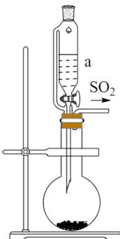

(2) 步骤II应分数次加入 $MnO_{2}$ ，原因是 \_\_\_\_；

(3) 步骤III滴加饱和 $\mathrm{Ba(OH)}_{2}$ 溶液的目的是\_\_\_\_；

(4) 步骤IV生成 $\mathrm{MnCO}_{3}$ 沉淀, 判断 $\mathrm{Mn}^{2+}$ 已沉淀完全的操作是\_\_\_\_;

(5) 将步骤V中正确操作或现象的标号填入相应括号中\_\_\_\_。

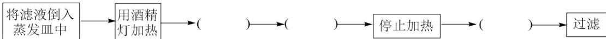

A. 蒸发皿中出现少量晶体  
B. 使用漏斗趁热过滤  
C. 利用蒸发皿余热使溶液蒸干  
D. 用玻璃棒不断搅拌  
E. 等待蒸发皿冷却

【答案】(1) ①. 恒压滴液漏斗 ②. 增大 $\mathrm{SO}_2$ 的溶解度、增大 $\mathrm{H}_2\mathrm{SO}_3$ 的浓度, 同时为步骤II提供低温

(2) 防止过多的 $\mathrm{MnO}_{2}$ 与 $\mathrm{H}_{2} \mathrm{SO}_{3}$ 反应生成 $\mathrm{MnSO}_{4}$ , 同时防止反应太快、放热太多、不利于控制温度低于 $10^{\circ} \mathrm{C}$

(3) 除去过量的 $\mathrm{SO}_2$ (或 $\mathrm{H}_2\mathrm{SO}_3$ )

（4）静置，向上层清液中继续滴加几滴饱和 $\mathrm{Na_2CO_3}$ 溶液，若不再产生沉淀，说明 $\mathrm{Mn}^{2+}$ 已沉淀完全

(5) D、A、E

【解析】

【分析】步骤Ⅱ中 $MnO_{2}$ 与 $H_{2}SO_{3}$ 在低于 $10^{\circ}C$ 时反应生成 $MnS_{2}O_{6}$ ，反应的化学方程式为 $MnO_{2} + 2H_{2}SO_{3} = MnS_{2}O_{6} + 2H_{2}O$ ，步骤Ⅲ中滴加饱和 $\mathrm{Ba(OH)}_{2}$ 除去过量的 $SO_{2}$ （或 $H_{2}SO_{3}$ ），步骤Ⅳ中滴入饱和 $Na_{2}CO_{3}$ 溶液发生反应 $MnS_{2}O_{6} + Na_{2}CO_{3} = MnCO_{3}\downarrow + Na_{2}S_{2}O_{6}$ ，经过滤得到 $Na_{2}S_{2}O_{6}$ 溶液，步骤Ⅴ中 $Na_{2}S_{2}O_{6}$ 溶液经蒸发浓缩、冷却结晶、过滤、洗涤、干燥得到 $Na_{2}S_{2}O_{6}\cdot2H_{2}O$ 。

【小问 1 详解】

根据仪器 a 的特点知，仪器 a 为恒压滴液漏斗；步骤 I 中采用冰水浴是为了增大 $SO_{2}$ 的溶解度、增大 $H_{2}SO_{3}$ 的浓度，同时为步骤 II 提供低温；

## 【小问 2 详解】

由于 $MnO_{2}$ 具有氧化性、 $SO_{2}$ （或 $H_{2}SO_{3}$ ）具有还原性，步骤Ⅱ应分数次加入 $MnO_{2}$ ，原因是：防止过多的 $MnO_{2}$ 与 $H_{2}SO_{3}$ 反应生成 $MnSO_{4}$ ，同时防止反应太快、放热太多、不利于控制温度低于 $10^{\circ}C$ ;

## 【小问 3 详解】

步骤III中滴加饱和 $\mathrm{Ba(OH)_{2}}$ 溶液的目的是除去过量的 $SO_{2}$ （或 $H_{2}SO_{3}$ ），防止后续反应中 $SO_{2}$ 与 $Na_{2}CO_{3}$ 溶液反应，增加饱和 $Na_{2}CO_{3}$ 溶液的用量、并使产品中混有杂质；

## 【小问 4 详解】

步骤IV中生成 $MnCO_{3}$ 沉淀，判断 $Mn^{2+}$ 已沉淀完全的操作是：静置，向上层清液中继续滴加几滴饱和 $Na_{2}CO_{3}$ 溶液，若不再产生沉淀，说明 $Mn^{2+}$ 已沉淀完全；

## 【小问 5 详解】

步骤V的正确操作或现象为：将滤液倒入蒸发皿中→用酒精灯加热→用玻璃棒不断搅拌→蒸发皿中出现少量晶体→停止加热→等待蒸发皿冷却→过滤、洗涤、干燥得到 $Na_{2}S_{2}O_{6}\cdot2H_{2}O$ ，依次填入 D、A、E。

17. $\mathrm{SiHCl}_3$ 是制备半导体材料硅的重要原料，可由不同途径制备。

（1）由 $\mathrm{SiCl}_4$ 制备 $\mathrm{SiHCl}_3$ ： $\mathrm{SiCl}_4(\mathrm{g}) + \mathrm{H}_2(\mathrm{g}) = \mathrm{SiHCl}_3(\mathrm{g}) + \mathrm{HCl}(\mathrm{g})$ $\Delta \mathrm{H}_{1} = +74.22\mathrm{kJ}\cdot \mathrm{mol}^{-1}$ (298K)已知 $\mathrm{SiHCl}_3(\mathrm{g}) + \mathrm{H}_2(\mathrm{g}) = \mathrm{Si}(\mathrm{s}) + 3\mathrm{HCl}(\mathrm{g})$ $\Delta \mathrm{H}_{2} = +219.29\mathrm{kJ}\cdot \mathrm{mol}^{-1}(298\mathrm{K})$

298K 时, 由 $\mathrm{SiCl}_{4}(\mathrm{g}) + 2\mathrm{H}_{2}(\mathrm{g}) = \mathrm{Si}(\mathrm{s}) + 4\mathrm{HCl}(\mathrm{g})$ 制备 $56 \mathrm{~g}$ 硅\_\_\_\_(填 “吸” 或 “放”)热\_\_\_\_ kJ。升高温度有利于制备硅的原因是\_\_\_\_。

（2）在催化剂作用下由粗硅制备 $\mathrm{SiHCl}_3$ ： $3\mathrm{SiCl}_4(\mathrm{g}) + 2\mathrm{H}_2(\mathrm{g}) + \mathrm{Si}(\mathrm{s}) \xrightarrow{\text{催化剂}} 4\mathrm{SiHCl}_3(\mathrm{g})$ 。773K，

2L 密闭容器中，经不同方式处理的粗硅和催化剂混合物与 $0.4 \, molH_{2}$ 和 $0.1 \, mol \, SiCl_{4}$ 气体反应， $SiCl_{4}$ 转化率随时间的变化如下图所示：

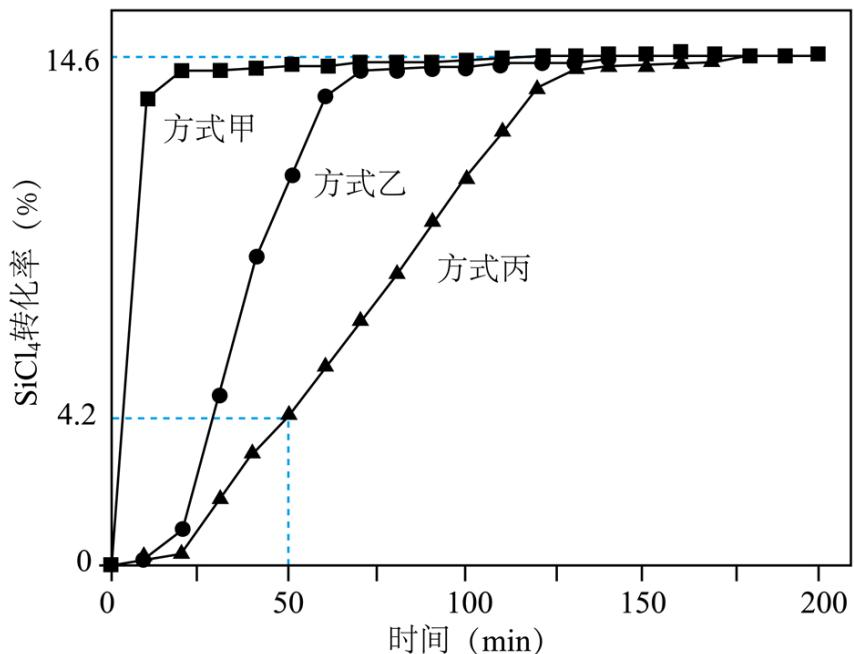

① 0-50min，经方式\_\_\_\_处理后的反应速率最快；在此期间，经方式丙处理后的平均反应速率 $v(SiHCl_{3})=$ \_\_\_\_ mol·L $^{-1}$ ·min $^{-1}$ 。

②当反应达平衡时， $H_{2}$ 的浓度为\_\_\_\_mol·L $^{-1}$ ，平衡常数K的计算式为\_\_\_\_。

③增大容器体积，反应平衡向\_\_\_\_移动。

【答案】(1) ①. 吸 ②. 587.02 ③. 该反应为吸热反应, 升高温度, 反应正向移动, 有利于制备硅
(2) ①. 甲 ②. $5.6 \times 10^{-5}$ ③. 0.1952 ④. $\frac{0.0097^{4}}{0.0427^{3} \times 0.1952^{2}}$ ⑤. 逆反应方向

【解析】
【小问 1 详解】

由题给热化学方程式：① $SiCl_{4}(g)+H_{2}(g)=SiHCl_{3}(g)+HCl(g)$ ， $\Delta H_{1}=+74.22kJ\cdot mol^{-1}$ ；② $SiHCl_{3}(g)+H_{2}(g)=Si(s)+3HCl(g)$ ， $\Delta H_{2}=+219.29kJ\cdot mol^{-1}$ ；则根据盖斯定律可知，①+②，可得热化学方程式 $SiCl_{4}(g)+2H_{2}(g)=Si(s)+4HCl(g)$ ，

$\Delta H=\Delta H_{1}+\Delta H_{2}=+74.22kJ\cdot mol^{-1}+(+219.29kJ\cdot mol^{-1})=+293.51kJ\cdot mol^{-1}$ ，则制备56gSi，即2molSi，需要吸收热量为 $293.51kJ\cdot mol^{-1}\times2=587.02kJ\cdot mol^{-1}$ ；该反应为吸热反应，升高温度，反应正向移动，有利于制备硅。

【小问 2 详解】

①由转化率图像可知，0-50min，经方式甲处理后反应速率最快；经方式丙处理后，50min时 $SiCl_{4}$ 的转化率为 $4.2\%$ ，反应的 $\mathrm{SiCl}_4$ 的物质的量为 $0.1\mathrm{mol}\times 4.2\% = 0.0042\mathrm{mol}$ ，根据化学化学计量数可得反应生成的 $\mathrm{SiHCl}_3$ 的物质的量为 $0.0042\mathrm{mol}\times \frac{4}{3} = 0.0056\mathrm{mol}$ ，平均反应速率 $\mathrm{v(SiHCl_3)} = \frac{0.0056\mathrm{mol}}{2\mathrm{L}\times 50\mathrm{min}} = 5.6\times 10^{-5}\mathrm{mol}\cdot \mathrm{L}^{-1}\cdot \mathrm{min}^{-1};$

②反应达到平衡时， $\mathrm{SiCl}_{4}$ 的转化率为 $14.6\%$ ，列出三段式为：

<table><tr><td></td><td> $3\text{SiCl}_{4}(\text{g})$ </td><td>+</td><td> $2\text{H}_{2}(\text{g})$ </td><td>+</td><td> $\text{Si(s)}$ </td><td>催化剂 $\rightleftharpoons$ </td><td> $4\text{SiHCl}_{3}(\text{g})$ </td></tr><tr><td>起始浓度(mol/L)</td><td>0.05</td><td></td><td>0.2</td><td></td><td></td><td></td><td>0</td></tr><tr><td>转化浓度(mol/L)</td><td>0.0073</td><td></td><td>0.0048</td><td></td><td></td><td></td><td>0.0097</td></tr><tr><td>平衡浓度(mol/L)</td><td>0.0427</td><td></td><td>0.1952</td><td></td><td></td><td></td><td>0.0097</td></tr></table>

当反应达平衡时， $H_{2}$ 的浓度为 $0.1952 \, mol \cdot L^{-1}$ ，平衡常数 K 的计算式为 $\frac{0.0097^{4}}{0.0427^{3} \times 0.1952^{2}}$ ;

③增大容器体积，压强减小，平衡向气体体积增大的方向移动，即反应平衡向逆反应方向移动。

18. 山药素-1 是从山药根茎中提取的具有抗菌消炎活性的物质，它的一种合成方法如下图：

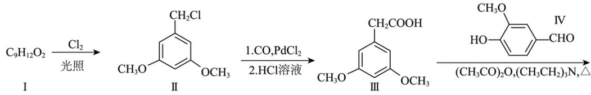

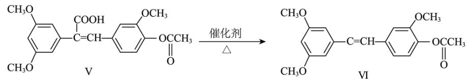

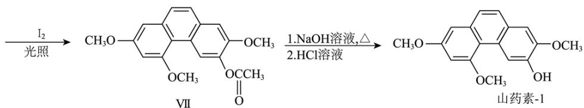

化合物I的结构简式为\_\_\_\_。由化合物I制备化合物II的反应与以下反应\_\_\_\_的反应类型相同。
A. $C_{6}H_{12}+Cl_{2}\xrightarrow{光照}C_{6}H_{11}Cl+HCl$ B. $C_{6}H_{6}+3Cl_{2}\xrightarrow{光照}C_{6}H_{6}Cl_{6}$ C. $C_{2}H_{4}Cl_{2}\xrightarrow{500-550^{\circ}C}C_{2}H_{3}Cl+HCl$ D. $C_{3}H_{6}+Cl_{2}\xrightarrow{500-600^{\circ}C}C_{3}H_{5}Cl+HCl$

(2) 化合物III的同分异构体中, 同时满足下列条件的有\_\_\_\_种。

①含有苯环且苯环上的一溴代物只有一种；

②能与新制 $\mathrm{Cu(OH)}_{2}$ 反应，生成砖红色沉淀；

③核磁共振氢谱显示有 4 组峰，峰面积之比为 1:2:3:6。

（3）化合物IV的含氧官能团名称为\_\_\_\_。

(4) 由化合物V制备VI时, 生成的气体是\_\_\_\_。

（5）从官能团转化的角度解释化合物 VII 转化为山药素-1 的过程中，先加碱后加酸的原因\_\_\_\_。

【答案】(1)

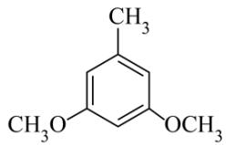

①.

②. AD

(2) 6 (3) 羟基、醚键、醛基

(4) $\mathrm{CO}_{2}$ (5) 提高化合物 VII 的转化率

【解析】

【分析】化合物I的分子式为 $C_{9}H_{12}O_{2}$ ，在光照的条件下和氯气发生取代反应得II

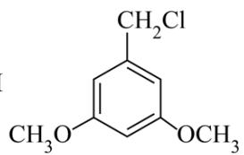

I的结构简式为

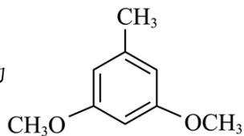

发生脱羧反应时，还有 $CO_{2}$ 生成。

【小问 1 详解】

由分析可知，I的结构简式为

项 A、D 都是烃与氯气发生取代反应；选项 B 是苯在光照条件下和氯气发生加成反应，选项 C 是 $C_{2}H_{4}Cl_{2}$ 发生消去反应，故反应属于取代反应是 AD；

【小问 2 详解】

根据流程图可知：化合物III为

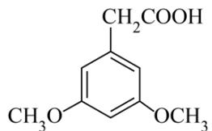

$$
\mathrm{C} _ {1 0} \mathrm{H} _ {1 2} \mathrm{O} _ {4}
$$

件: ①含有苯环且苯环上的一溴代物只有一种, 说明苯环上只有一种化学环境的氢原子; ②能与新制 $\mathrm{Cu(OH)}_{2}$ 反应, 生成砖红色沉淀, 说明物质分子中有醛基, 根据物质的分子式可知其不饱和度为 5 , 除去苯环的不饱和度, 只有一个醛基; ③核磁共振氢谱显示有 4 组峰, 峰面积之比为 $1: 2: 3: 6$ , 说明分子中有 4 种不同化学环境的氢原子, 数目分别为 1、2、3、6, 故满足条件的同分异构体有:

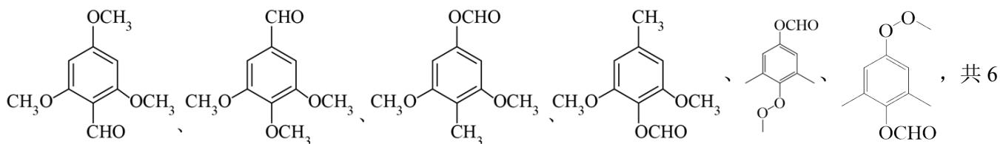

种；

【小问 3 详解】

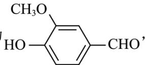

根据化合物IV的结构为 $\mathrm{HO}-\mathrm{CHO}$ ，可知其中含氧官能团的名称为羟基、醚键、醛基；

【小问4详解】

对比化合物V和化合物VI的结构，化合物VI比化合物V少一个碳原子和两个氧原子，由化合物V制备VI时，生成的气体是 $CO_{2}$ ;

【小问 5 详解】

化合物 VII 转化为山药素-1 的过程发生的是酯基水解，酯在碱性条件下水解更彻底，再加入酸将酚羟基的盐转化为酚羟基得目标产物山药素-1，若直接加酸，由于酯在酸性条件下的水解可逆，产率较低，故先加碱后加酸是为了提高化合物 VII 的转化率。