# 2024 年普通高等学校招生选择性考试（辽宁卷）

# 化学

本试卷共 8 页。考试结束后，将本试卷和答题卡一并交回。

## 注意事项：

1. 答题前，考生先将自己的姓名准考证号码填写清楚，将条形码准确粘贴在考生信息条形码粘贴区。

2. 选择题必须使用 2B 铅笔填涂；非选择题必须使用 0.5 毫米黑色字迹的签字笔书写，字体工整、笔迹清楚。

3.请按照题号顺序在答题卡各题目的答题区域内作答，超出答题区域书写的答案无效；在草稿纸、试卷上答题无效。

4.作图可先使用铅笔画出，确定后必须用黑色字迹的签字笔描黑。

5.保持卡面清洁，不要折叠，不要弄破、异皱，不准使用涂改液、修正带、刮纸刀。

可能用到的相对原子质量：H1 C 12 O 16 S 32 Cl 35.5 Ti 48 Cu 64

## 一、选择题：本题共15小题，每小题3分，共45分。在每小题给出的四个选项中，只有一项符合题目要求。

1. 文物见证历史，化学创造文明。东北三省出土的下列文物据其主要成分不能与其他三项归为一类的是
A. 金代六曲葵花婆金银盏
B. 北燕鸭形玻璃注
C. 汉代白玉耳杯
D. 新石器时代彩绘几何纹双腹陶罐

【答案】A

【详解】A. 金代六曲葵花鎏金银盏是合金，属于无机金属材料；
B. 北燕鸭形玻璃注是玻璃制品，属于硅酸盐材料；
C. 汉代白玉耳环是玉，属于含有微量元素的钙镁硅酸盐材料；
D. 新石器时代彩绘几何纹双腹陶罐是陶器，属于硅酸盐材料；

综上 A 选项材质与其他三项材质不用，不能归为一类，答案选 A。

2. 下列化学用语或表述正确的是
A. 中子数为 1 的氦核素: $\mathrm{^{1}He}$ B. $\mathrm{SiO}_{2}$ 的晶体类型: 分子晶体
C. $\mathrm{F}_{2}$ 的共价键类型: p-p σ 键
D. $\mathrm{PCl}_{3}$ 的空间结构: 平面三角形

【答案】C

【解析】

【详解】A. 中子数为 1 的 He 核素其质量数为 $1 + 2 = 3$ ，故其表示应为 $\frac{3}{2}\mathrm{He}$ ，A 错误；  
B. $\mathrm{SiO}_2$ 晶体中只含有共价键，为共价晶体，B 错误；  
C. 两个 F 原子的 2p 轨道单电子相互重叠形成 p-pσ 键，C 正确；

D. $\mathrm{PCl}_3$ 的中心原子存在 1 对孤电子对, 其 VSEPR 模型为四面体型, $\mathrm{PCl}_3$ 的空间结构为三角锥型, D 错误; 故答案选 C。

3. 下列实验操作或处理方法错误的是
A. 点燃 $\mathrm{H}_{2}$ 前, 先检验其纯度 B. 金属 K 着火, 用湿抹布盖灭 C. 温度计中水银洒落地面, 用硫粉处理 D. 苯酚沾到皮肤上, 先后用乙醇、水冲洗

【详解】A. $\mathrm{H}_{2}$ 为易燃气体，在点燃前需验纯，A 正确；  
B. 金属 K 为活泼金属，可以与水发生反应，不能用湿抹布盖灭，B 错误；  
C. Hg 有毒，温度计打碎后应用硫粉覆盖，使 Hg 转化为无毒的 HgS，C 正确；  
D. 苯酚易溶于乙醇等有机物质中，苯酚沾到皮肤上后应立即用乙醇冲洗，稀释后再用水冲洗，D 正确；

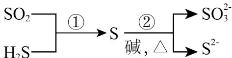

4. 硫及其化合物部分转化关系如图。设 $N_{A}$ 为阿伏加德罗常数的值，下列说法正确的是 $SO_{2}$ $H_{2}S$ ① S ② $SO_{3}^{2-}$ 碱, △ $S^{2-}$

A. 标准状况下， $11.2 \mathrm{~L} \mathrm{SO}_{2}$ 中原子总数为 $0.5 \mathrm{~N}_{\mathrm{A}}$ B. $100 \mathrm{~mL} 0.1 \mathrm{~mol} \cdot \mathrm{L}^{-1} \mathrm{Na}_{2} \mathrm{SO}_{3}$ 溶液中， $\mathrm{SO}_{3}^{2-}$ 数目为 $0.01 \mathrm{~N}_{\mathrm{A}}$ C. 反应①每消耗 $3.4 \mathrm{~gH}_{2} \mathrm{~S}$ ，生成物中硫原子数目为 $0.1 \mathrm{~N}_{\mathrm{A}}$ D. 反应②每生成 $1 \mathrm{~mol}$ 还原产物，转移电子数目为 $2 \mathrm{~N}_{\mathrm{A}}$

【答案】D

【解析】

【详解】A．标况下 $SO_{2}$ 为气体，11.2L $SO_{2}$ 为 0.5mol，其含有 1.5mol 原子，原子数为 $1.5N_{A}$ ，A 错误；
B． $SO_{3}^{2-}$ 为弱酸阴离子，其在水中易发生水解，因此，100mL 0.1mol $L^{-1}$ $Na_{2}SO_{3}$ 溶液中 $SO_{3}^{2-}$ 数目小于

$0.01N_{A}$ ，B 错误；

C. 反应①的方程式为 $\mathrm{SO}_2 + 2\mathrm{H}_2\mathrm{S} = 3\mathrm{S}\downarrow +2\mathrm{H}_2\mathrm{O}$ ，反应中每生成 $3\mathrm{mol}$ S 消耗 $2\mathrm{mol}$ $\mathrm{H}_2\mathrm{S}$ ， $3.4\mathrm{g}$ $\mathrm{H}_2\mathrm{S}$ 为 $0.1\mathrm{mol}$ ，故可以生成 $0.15\mathrm{mol}$ S，生成的原子数目为 $0.15\mathrm{N}_{\mathrm{A}}$ ，C 错误；  
D. 反应②的离子方程式为 $3\mathrm{S} + 6\mathrm{OH}^{-} = \mathrm{SO}_3^{2-} + 2\mathrm{S}^{2-} + 3\mathrm{H}_2\mathrm{O}$ ，反应的还原产物为 $\mathrm{S}^{2-}$ ，每生成 $2\mathrm{mol}$ $\mathrm{S}^{2-}$ 共转移 $4\mathrm{mol}$ 电子，因此，每生成 $1\mathrm{mol}$ $\mathrm{S}^{2-}$ ，转移 $2\mathrm{mol}$ 电子，数目为 $2\mathrm{N}_{\mathrm{A}}$ ，D 正确；  
故答案选 D。

5. 家务劳动中蕴含着丰富的化学知识。下列相关解释错误的是
A. 用过氧碳酸钠漂白衣物： $Na_{2}CO_{4}$ 具有较强氧化性
B. 酿米酒需晾凉米饭后加酒曲：乙醇受热易挥发
C. 用柠檬酸去除水垢：柠檬酸酸性强于碳酸
D. 用碱液清洗厨房油污：油脂可碱性水解

【答案】B

【解析】

【详解】A. 过碳酸钠中过碳酸根中有两个 O 原子为 -1 价，易得到电子变成 -2 价 O，因此过碳酸钠具有强氧化性，可以漂白衣物，A 正确；  
B. 酒曲上大量微生物，微生物可以分泌多种酶将化谷物中的淀粉、蛋白质等转变成糖、氨基酸。糖分在酵母菌的酶的作用下，分解成乙醇，即酒精。因此，米饭需晾凉，米饭过热会使微生物失活，B 错误；  
C. 柠檬酸的酸性强于碳酸，可以将水垢中的碳酸钙分解为可溶性的钙离子，用于除水垢，C 正确；  
D. 油脂可以在碱性条件下水解成可用于水的甘油和脂肪酸盐，用于清洗油污，D 正确；

故答案选 B。

6. $H_{2}O_{2}$ 分解的“碘钟”反应美轮美奂。将一定浓度的三种溶液(① $H_{2}O_{2}$ 溶液；②淀粉、丙二酸和 $MnSO_{4}$ 混合溶液；③ $KIO_{3}$ 、稀硫酸混合溶液)混合，溶液颜色在无色和蓝色之间来回振荡，周期性变色；几分钟后，稳定为蓝色。下列说法错误的是
A. 无色→蓝色：生成 $I_{2}$ B. 蓝色→无色： $I_{2}$ 转化为化合态
C. $H_{2}O_{2}$ 起漂白作用
D. 淀粉作指示剂

【分析】分析该“碘钟”反应的原理：①在 $Mn^{2+}$ 的催化下 $H_{2}O_{2}$ 与 $IO_{3}^{-}$ 反应生成 $I_{2}$ ，在淀粉指示剂的作用下溶液变蓝色; ②生成的 $\mathrm{I}_{2}$ 又会与 $\mathrm{H}_{2} \mathrm{O}_{2}$ 反应生成 $\mathrm{IO}_{3}^{-}$ , 使溶液变回无色; ③生成的 $\mathrm{I}_{2}$ 可以与丙二酸反应生成琥珀色的 $\mathrm{ICH}(\mathrm{COOH})_{2}$ , 溶液最终会变成蓝色。

【详解】A. 根据分析, 溶液由无色变为蓝色说明有 $\mathrm{I}_{2}$ 生成, A 正确;

B. 根据分析, 溶液由蓝色变为无色, 是将 $\mathrm{I}_{2}$ 转化为 $\mathrm{IO}_{3}^{-}$ , $\mathrm{I}_{2}$ 转化为为化合态, B 正确;

C. 根据分析, $\mathrm{H}_{2} \mathrm{O}_{2}$ 在此过程中参加反应, 不起到漂白作用, C 错误;

D. 在此过程中, 因为有 $\mathrm{I}_{2}$ 的生成与消耗, 淀粉在这个过程中起到指示剂的作用, D 正确;

故答案选 C。

7. 如下图所示的自催化反应，Y 作催化剂。下列说法正确的是

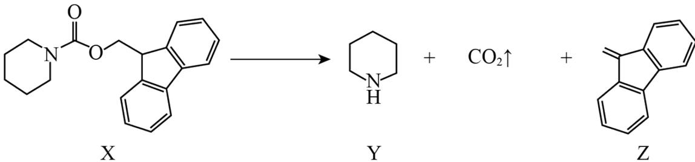

A. X 不能发生水解反应
B. Y 与盐酸反应的产物不溶于水
C. Z 中碳原子均采用 $sp^{2}$ 杂化
D. 随 $c(Y)$ 增大，该反应速率不断增大

【详解】A. 根据 X 的结构简式可知, 其结构中含有酯基和酰胺基, 因此可以发生水解反应, A 错误;  
B. 有机物 Y 中含有氨基, 其呈碱性, 可以与盐酸发生反应生成盐, 生成的盐在水中的溶解性较好, B 错误;  
C. 有机物 Z 中含有苯环和碳碳双键, 无饱和碳原子, 其所有的碳原子均为 $\mathrm{sp}^2$ 杂化, C 正确;  
D. 随着体系中 c(Y) 增大, Y 在反应中起催化作用, 反应初始阶段化学反应会加快, 但随着反应的不断进行, 反应物 X 的浓度不断减小, 且浓度的减小占主要因素, 反应速率又逐渐减小, 即不会一直增大, D 错误;  
故答案选 C。

8. 下列实验方法或试剂使用合理的是

<table><tr><td>选项</td><td>实验目的</td><td>实验方法或试剂</td></tr><tr><td>A</td><td>检验NaBr溶液中是否含有 $Fe^{2+}$ </td><td> $K_{3}[Fe(CN_{6})]$ 溶液</td></tr><tr><td>B</td><td>测定KHS溶液中 $c(S^{2})$ </td><td>用 $AgNO_{3}$ 溶液滴定</td></tr><tr><td>C</td><td>除去乙醇中少量的水</td><td>加入金属Na,过滤</td></tr><tr><td>D</td><td>测定KClO溶液的pH</td><td>使用pH试纸</td></tr></table>

A.A B.B C.C D.D

【答案】A

【解析】

【详解】A. 溶液中含有 $\mathrm{Fe}^{2+}$ , 可以与 $\mathrm{K}_{3}[\mathrm{Fe}(\mathrm{CN})_{6}]$ 发生反应使溶液变成蓝色, A 项合理;  
B. 随着滴定的不断进行, 溶液中 $\mathrm{S}^{2-}$ 不断被消耗, 但是溶液中的 HS-还可以继续发生电离生成 $\mathrm{S}^{2-}$ , B 项不合理;  
C. 金属 Na 既可以和水发生反应又可以和乙醇发生反应, 故不能用金属 Na 除去乙醇中少量的水, C 项不合理;  
D. ClO-具有氧化性, 不能用 pH 试纸测定其 pH 的大小, 可以用 pH 计进行测量, D 项不合理;  
故答案选 A。

9. 环六糊精(D-吡喃葡萄糖缩合物)具有空腔结构, 腔内极性较小, 腔外极性较大, 可包含某些分子形成超分子。图 1、图 2 和图 3 分别表示环六糊精结构、超分子示意图及相关应用。下列说法错误的是

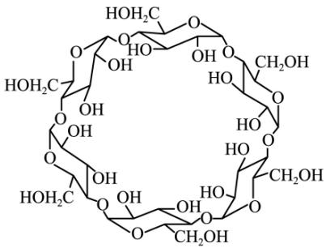  
图1

图2  
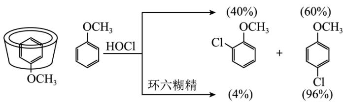  
图3

A. 环六糊精属于寡糖  
B. 非极性分子均可被环六糊精包合形成超分子  
C. 图2中甲氧基对位暴露在反应环境中  
D. 可用萃取法分离环六糊精和氯代苯甲醚

【答案】B

【解析】

【详解】A. 1mol 糖水解后能产生 2\~10mol 单糖的糖称为寡糖或者低聚糖，环六糊精是葡萄糖的缩合物，属于寡糖，A 正确；

B. 要和环六糊精形成超分子，该分子的直径必须要匹配环六糊精的空腔尺寸，故不是所有的非极性分子都可以被环六糊精包含形成超分子，B错误；  
C. 由于环六糊精腔内极性小，可以将苯环包含在其中，腔外极性大，故将极性基团甲氧基暴露在反应环境中，C正确；  
D. 环六糊精空腔外有多个羟基，可以和水形成分子间氢键，故环六糊精能溶解在水中，而氯代苯甲醚不溶于水，所以可以选择水作为萃取剂分离环六糊精和氯代苯甲醚，D正确；  
故选B。

10. 异山梨醇是一种由生物质制备的高附加值化学品， $150^{\circ}\mathrm{C}$ 时其制备过程及相关物质浓度随时间变化如图所示，15h后异山梨醇浓度不再变化。下列说法错误的是

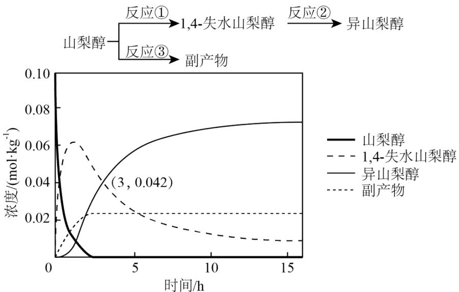

A. 3h时，反应②正、逆反应速率相等  
B. 该温度下的平衡常数：①＞②  
C. $0 \sim 3\mathrm{h}$ 平均速率(异山梨醇) $= 0.014\mathrm{mol} \cdot \mathrm{kg}^{-1} \cdot \mathrm{h}^{-1}$ D. 反应②加入催化剂不改变其平衡转化率

【详解】A．由图可知，3小时后异山梨醇浓度继续增大，15h后异山梨醇浓度才不再变化，所以3h时，反应②未达到平衡状态，即正、逆反应速率不相等，故A错误；
B．图像显示该温度下，15h后所有物质浓度都不再变化，且此时山梨醇转化完全，即反应充分，而1,4-失水山梨醇仍有剩余，即反应②正向进行程度小于反应①、反应限度小于反应①，所以该温度下的平衡常数：①＞②，故B正确；
C．由图可知，在0～3h内异山梨醇的浓度变化量为0.042mol/kg，所以平均速率(异山梨醇)=

$\frac{0.042 \, \text{mol/kg}}{3 \, \text{h}} = 0.014 \, \text{mol} \cdot \text{kg}^{-1} \cdot \text{h}^{-1}$ ，故 C 正确；

D．催化剂只能改变化学反应速率，不能改变物质平衡转化率，所以反应②加入催化剂不改变其平衡转化率，故 D 正确；

故答案为：A。

11. 如下反应相关元素中，W、X、Y、Z 为原子序数依次增大的短周期元素，基态 X 原子的核外电子有 5 种空间运动状态，基态 Y、Z 原子有两个未成对电子，Q 是 ds 区元素，焰色试验呈绿色。下列说法错误的是 $QZY_{4}$ 溶液 $\xrightarrow{逐渐通入XW_{3}至过量} QZX_{4}Y_{4}W_{12}$ 溶液

A. 单质沸点：Z > Y > W

B. 简单氢化物键角：X > Y

C. 反应过程中有蓝色沉淀产生

D. $QZX_{4}Y_{4}W_{12}$ 是配合物，配位原子是 Y

【分析】Q 是 ds 区元素，焰色试验呈绿色，则 Q 为 Cu 元素；空间运动状态数是指电子占据的轨道数，基态 X 原子的核外电子有 5 种空间运动状态，则 X 为第 2 周期元素，满足此条件的主族元素有 $N(1s^{2}2s^{2}2p^{3})$ 、 $O(1s^{2}2s^{2}2p^{4})$ 、 $F(1s^{2}2s^{2}2p^{5})$ ；X、Y、Z 为原子序数依次增大，基态 Y、Z 原子有两个未成对电子，若 Y、Z 为第 2 周期元素，则满足条件的可能为 $C(1s^{2}2s^{2}2p^{2})$ 或 $O(1s^{2}2s^{2}2p^{4})$ ，C 原子序数小于 N，所以 Y 不可能为 C，若 Y、Z 为第 3 周期元素，则满足条件的可能为 $Si(1s^{2}2s^{2}2p^{6}3s^{2}3p^{2})$ 或 $S(1s^{2}2s^{2}2p^{6}3s^{2}3p^{4})$ ，Y、Z 可与 Cu 形成 $CuZY_{4}$ ，而 O、Si、S 中只有 O 和 S 形成的 $SO_{4}^{2-}$ 才能形成 $CuZY_{4}$ ，所以 Y、Z 分别为 O、S 元素，则 X 只能为 N；W 能与 X 形成 $WX_{3}$ ，则 W 为 IA 族或 VIIA 族元素，但 W 原子序数小于 N，所以 W 为 H 元素，综上所述，W、X、Y、Z、Q 分别为 H、N、O、S、Cu。
【详解】A. W、Y、Z 分别为 H、O、S，S 单质常温下呈固态，其沸点高于氧气和氢气， $O_{2}$ 和 $H_{2}$ 均为分子晶体， $O_{2}$ 的相对分子质量大于 $H_{2}$ ， $O_{2}$ 的范德华力大于 $H_{2}$ ，所以沸点 $O_{2}>H_{2}$ ，即沸点 $S>O_{2}>H_{2}$ ，故 A 正确；
B. Y、X 的简单氢化物分别为 $H_{2}O$ 和 $NH_{3}$ ， $H_{2}O$ 的中心原子 O 原子的价层电子对数为 $2+\frac{1}{2}\times(6-2\times1)=4$ 、孤电子对数为 2，空间构型为 V 形，键角约 $105^{\circ}$ ， $NH_{3}$ 的中心原子 N 原子的价层电子对数为 $3+\frac{1}{2}\times(5-3\times1)=4$ 、孤电子对数为 1，空间构型为三角锥形，键角约 $107^{\circ}18'$ ，所以键角：X > Y，故 B 正确；
C. 硫酸铜溶液中滴加氨水，氨水不足时生成蓝色沉淀氢氧化铜，氨水过量时氢氧化铜溶解，生成 $Cu(NH_{3})_{4}SO_{4}$ ，即反应过程中有蓝色沉淀产生，故 C 正确；

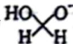

D. $QZX_{4}Y_{4}W_{12}$ 为 $\mathrm{Cu(NH_{3})_{4}SO_{4}}$ ，其中铜离子提供空轨道、 $NH_{3}$ 的 N 原子提供孤电子对，两者形成配位键，配位原子为 N，故 D 错误；
故答案为：D。

12. “绿色零碳”氢能前景广阔。为解决传统电解水制“绿氢”阳极电势高、反应速率缓慢的问题，科技工作者设计耦合HCHO高效制 $\mathrm{H}_{2}$ 的方法，装置如图所示。部分反应机理为：

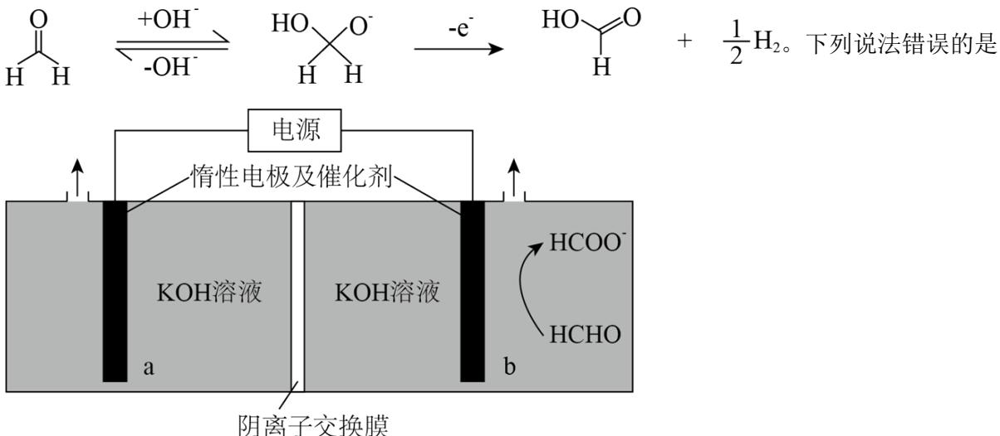

A. 相同电量下 $\mathrm{H}_{2}$ 理论产量是传统电解水的1.5倍  
B. 阴极反应： $2\mathrm{H}_{2}\mathrm{O} + 2\mathrm{e}^{-} = 2\mathrm{OH}^{-} + \mathrm{H}_{2}\uparrow$ C. 电解时 $\mathrm{OH}^{-}$ 通过阴离子交换膜向b极方向移动  
D. 阳极反应： $2\mathrm{HCHO - }2\mathrm{e}^{-} + 4\mathrm{OH}^{-} = 2\mathrm{HCOO}^{-} + 2\mathrm{H}_{2}\mathrm{O} + \mathrm{H}_{2}\uparrow$

【答案】A

【解析】

【分析】据图示可知，b 电极上 HCHO 转化为 HCOO $^{-}$ ，而 HCHO 转化为 HCOO $^{-}$ 为氧化反应，所以 b 电极为阳极，a 电极为阴极，HCHO 为阳极反应物，由反应机理

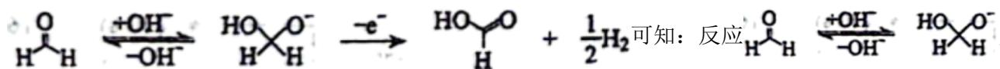

成的 $\mathrm{HO}-\mathrm{O}^{-}$ 转化为HCOOH。由原子守恒和电荷守恒可知，在生成HCOOH的同时还生成了 $\mathrm{H}^{-}$ ，生成的HCOOH再与氢氧化钾酸碱中和： $\mathrm{HCOOH}+\mathrm{OH}^{-}=\mathrm{HCOO}^{-}+\mathrm{H}_{2}\mathrm{O}$ ，而生成的 $\mathrm{H}^{-}$ 在阳极失电子发生氧化反应生成氢气，即 $2\mathrm{H}^{-}-2\mathrm{e}^{-}=\mathrm{H}_{2}\uparrow$ ，阴极水得电子生成氢气： $2\mathrm{H}_{2}\mathrm{O}-2\mathrm{e}^{-}=\mathrm{H}_{2}\uparrow+2\mathrm{OH}^{-}$ 。

【详解】A．由以上分析可知，阳极反应：①HCHO+OH $^{-}$ -e $^{-}$ →HCOOH+ $\frac{1}{2}$ H $_{2}$ ，②HCOOH+OH $^{-}$ =HCOO $^{-}$ +H $_{2}$ O，阴极反应2H $_{2}$ O-2e $^{-}$ =H $_{2}$ ↑+2OH $^{-}$ ，即转移2mol电子时，阴、阳两极各生成1molH $_{2}$ ，共2molH $_{2}$ ，而传统电解水： $2H_{2}O\xlongequal{电解}2H_{2}\uparrow+O_{2}\uparrow$ ，转移2mol电子，只有阴极生成 $1molH_{2}$ ，所以相同电量下 $H_{2}$ 理论产量是传统电解水的2倍，故A错误；

B. 阴极水得电子生成氢气，阴极反应为 $2 \mathrm{H}_{2} \mathrm{O}-2 \mathrm{e}^{-}=\mathrm{H}_{2} \uparrow + 2 \mathrm{OH}^{-}$ ，故 B 正确；

C. 由电极反应式可知, 电解过程中阴极生成 $\mathrm{OH}^{-}$ , 负电荷增多, 阳极负电荷减少, 要使电解质溶液呈电中性, $\mathrm{OH}^{-}$ 通过阴离子交换膜向阳极移动, 即向 b 极方向移动, 故 C 正确;

D. 由以上分析可知, 阳极反应涉及到: ① $\mathrm{HCHO} + \mathrm{OH}^{-}-\mathrm{e}^{-} \rightarrow \mathrm{HCOOH} + \frac{1}{2} \mathrm{H}_{2}$ , ② $\mathrm{HCOOH} + \mathrm{OH}^{-} = \mathrm{HCOO}^{-} + \mathrm{H}_{2} \mathrm{O}$ , 由 (①+②)×2 得阳极反应为: $2 \mathrm{HCHO}-2 \mathrm{e}^{-} + 4 \mathrm{OH}^{-} = 2 \mathrm{HCOO}^{-} + 2 \mathrm{H}_{2} \mathrm{O} + \mathrm{H}_{2} \uparrow$ , 故 D 正确; 答案选 A。

13. 某工厂利用铜屑脱除锌浸出液中的 $\mathrm{Cl}^-$ 并制备 $\mathrm{Zn}$ ，流程如下“脱氯”步骤仅 $\mathrm{Cu}$ 元素化合价发生改变。下列说法正确的是

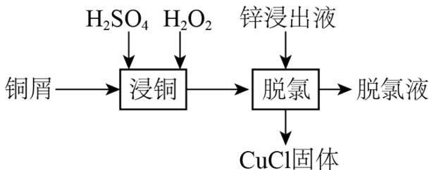

锌浸出液中相关成分(其他成分无干扰)

<table><tr><td>离子</td><td> $Zn^{2+}$ </td><td> $Qu^{2+}$ </td><td> $Cl^{-}$ </td></tr><tr><td>浓度 $(g·L^{-1})$ </td><td>145</td><td>0.03</td><td>1</td></tr></table>

A. “浸铜”时应加入足量 $H_{2}O_{2}$ ，确保铜屑溶解完全

B. “浸铜”反应: $2 \mathrm{Cu} + 4 \mathrm{H}^{+} + \mathrm{H}_{2} \mathrm{O}_{2} = 2 \mathrm{Cu}^{2+} + \mathrm{H}_{2} \uparrow + 2 \mathrm{H}_{2} \mathrm{O}$

C. “脱氯”反应: $\mathrm{Cu} + \mathrm{Cu}^{2+} + 2\mathrm{Cl}^{-} = 2\mathrm{CuCl}$

D. 脱氯液净化后电解，可在阳极得到 Zn

【答案】C

【解析】

【分析】铜屑中加入 $H_{2}SO_{4}$ 和 $H_{2}O_{2}$ 得到 $Cu^{2+}$ ，反应的离子方程式为：

$\mathrm{Cu} + 2\mathrm{H}^{+} + \mathrm{H}_{2}\mathrm{O}_{2} = \mathrm{Cu}^{2 + } + 2\mathrm{H}_{2}\mathrm{O}$ ，再加入锌浸出液进行“脱氯”，“脱氯”步骤中仅 $\mathrm{Cu}$ 元素的化合价发生改变, 得到 $\mathrm{CuCl}$ 固体, 可知 “脱氯” 步骤发生反应的化学方程式为: $\mathrm{Cu}^{2+} + \mathrm{Cu} + 2\mathrm{Cl}^{-} = 2\mathrm{CuCl} \downarrow$ , 过滤得到脱氯液, 脱氯液净化后电解, $\mathrm{Zn}^{2+}$ 可在阴极得到电子生成 $\mathrm{Zn}$ 。

【详解】A. 由分析得, “浸铜” 时, 铜屑不能溶解完全, $\mathrm{Cu}$ 在 “脱氯” 步骤还需要充当还原剂, 故 A 错误;

B. “浸铜” 时, 铜屑中加入 $\mathrm{H}_{2} \mathrm{SO}_{4}$ 和 $\mathrm{H}_{2} \mathrm{O}_{2}$ 得到 $\mathrm{Cu}^{2+}$ , 反应的离子方程式为: $\mathrm{Cu} + 2 \mathrm{H}^{+} + \mathrm{H}_{2} \mathrm{O}_{2} = \mathrm{Cu}^{2+} + 2 \mathrm{H}_{2} \mathrm{O}$ , 故 B 错误;

C. “脱氯” 步骤中仅 $\mathrm{Cu}$ 元素的化合价发生改变, 得到 $\mathrm{CuCl}$ 固体, 即 $\mathrm{Cu}$ 的化合价升高, $\mathrm{Cu}^{2+}$ 的化合价降低, 发生归中反应, 化学方程式为: $\mathrm{Cu}^{2+} + \mathrm{Cu} + 2 \mathrm{Cl}^{-} = 2 \mathrm{CuCl} \downarrow$ , 故 C 正确;

D. 脱氯液净化后电解, $\mathrm{Zn}^{2+}$ 应在阴极得到电子变为 $\mathrm{Zn}$ , 故 D 错误;

故选 C。

14. 某锂离子电池电极材料结构如图。结构 1 是钴硫化物晶胞的一部分，可代表其组成和结构；晶胞 2 是充电后的晶胞结构；所有晶胞均为立方晶胞。下列说法错误的是

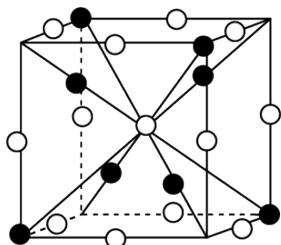  
结构1

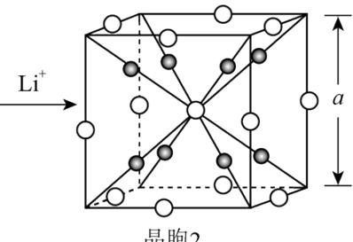  
晶胞2

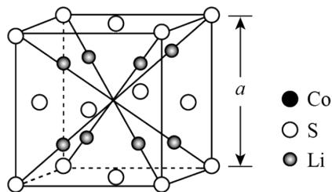  
晶胞3

A. 结构 1 钴硫化物的化学式为 $\mathrm{Co}_{9} \mathrm{~S}_{8}$ B. 晶胞 2 中 S 与 S 的最短距离为当 $\frac{\sqrt{3}}{2} \mathrm{a}$ C. 晶胞 2 中距 Li 最近的 S 有 4 个 D. 晶胞 2 和晶胞 3 表示同一晶体

【解析】

【详解】A．由均摊法得，结构1中含有Co的数目为 $4+4\times\frac{1}{8}=4.5$ ，含有S的数目为 $1+12\times\frac{1}{4}=4$ ，Co与S的原子个数比为9:8，因此结构1的化学式为 $Co_{9}S_{8}$ ，故A正确；
B．由图可知，晶胞2中S与S的最短距离为面对角线的 $\frac{1}{2}$ ，晶胞边长为a，即S与S的最短距离为： $\frac{\sqrt{2}}{2}a$ ，故B错误；

C. 如图:

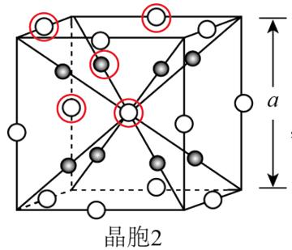

以图中的 Li 为例，与其最近的 S 共 4 个，故 C 正确；

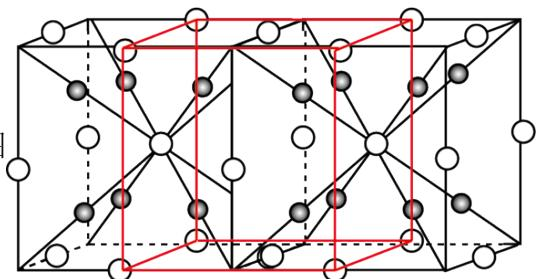

当 2 个晶胞 2 放在一起时，图中红框截取的部分就是

晶胞 3，晶胞 2 和晶胞 3 表示同一晶体，故 D 正确；

故选 B。

15. 25℃下，AgCl、AgBr和 $\mathrm{Ag_{2}CrO_{4}}$ 的沉淀溶解平衡曲线如下图所示。某实验小组以 $\mathrm{K_{2}CrO_{4}}$ 为指示剂，用 $\mathrm{AgNO_{3}}$ 标准溶液分别滴定含 $\mathrm{Cl^{-}}$ 水样、含 $\mathrm{Br^{-}}$ 水样。

已知：① $\mathrm{Ag}_{2} \mathrm{CrO}_{4}$ 为砖红色沉淀；

②相同条件下 AgCl 溶解度大于 AgBr；

③ $25^{\circ} \mathrm{C}$ 时， $\mathrm{pK}_{\mathrm{a}_1}\left(\mathrm{H}_2\mathrm{CrO}_4\right)=0.7$ ， $\mathrm{pK}_{\mathrm{a}_2}\left(\mathrm{H}_2\mathrm{CrO}_4\right)=6.5$ 。

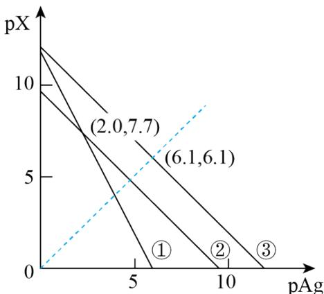

$\mathrm{X = -lg[c(X^{n - }) / (mol\cdot L^{-1})]}$

$(X^{n-} \text{代表Cl}^{-}, \text{Br}^{-} \text{或CrO}_{4}^{2-})$

下列说法错误的是

A. 曲线②为 $\mathrm{AgCl}$ 沉淀溶解平衡曲线

B. 反应 $Ag_{2}CrO_{4} + H^{+} \rightleftharpoons 2Ag^{+} + HCrO_{4}^{-}$ 的平衡常数 $K = 10^{-5.2}$

C. 滴定 $Cl^{-}$ 时，理论上混合液中指示剂浓度不宜超过 $10^{-2.0} \, mol \cdot L^{-1}$

D. 滴定 $\mathrm{Br}^{-}$ 达终点时，溶液中 $\frac{\mathrm{c}\left(\mathrm{Br}^{-}\right)}{\mathrm{c}\left(\mathrm{CrO}_{4}^{2-}\right)} = 10^{-0.5}$

【答案】D

【解析】

【分析】由于 AgCl 和 AgBr 中阴、阳离子个数比均为 1:1，即两者图象平行，所以①代表 $Ag_{2}CrO_{4}$ ，由于相同条件下，AgCl 溶解度大于 AgBr，即 $K_{\mathrm{sp}}(\mathrm{AgCl}) > K_{\mathrm{sp}}(\mathrm{AgBr})$ ，所以②代表 AgCl，则③代表 AgBr，根据①上的点（2.0，7.7），可求得 $K_{\mathrm{sp}}(\mathrm{Ag}_{2}\mathrm{CrO}_{4}) = c^{2}(\mathrm{Ag}^{+}) \times c(\mathrm{CrO}_{4}^{2-}) = (10^{-2})^{2} \times 10^{-7.7} = 10^{-11.7}$ ，根据②上的点（2.0，7.7），可求得 $K_{\mathrm{sp}}(\mathrm{AgCl}) = c(\mathrm{Ag}^{+}) \times c(\mathrm{Cl}^{-}) = 10^{-2} \times 10^{-7.7} = 10^{-9.7}$ ，根据③上的点（6.1，6.1），可求得 $K_{\mathrm{sp}}(\mathrm{AgBr}) = c(\mathrm{Ag}^{+}) \times c(\mathrm{Br}^{-}) = 10^{-6.1} \times 10^{-6.1} = 10^{-12.2}$ 。

【详解】A．由分析得，曲线②为 AgCl 沉淀溶解平衡曲线，故 A 正确；

B．反应 $Ag_{2}CrO_{4} + H^{+} \rightleftharpoons 2Ag^{+} + HCrO_{4}^{-}$ 的平衡常数 $K = \frac{c^{2}(Ag^{+})c(HCrO_{4}^{-})}{c(H^{+})} = \frac{c^{2}(Ag^{+})c(CrO_{4}^{2-})c(HCrO_{4}^{-})}{c(H^{+})c(CrO_{4}^{2-})} = \frac{K_{\mathrm{sp}}(Ag_{2}CrO_{4})}{K_{\mathrm{a2}}(H_{2}CrO_{4})} = \frac{10^{-11.7}}{10^{-6.5}} = 10^{-5.2}$ ，故 B 正确；

C．当 Cl 恰好滴定完全时， $c(Ag^{+}) = \sqrt{K_{\mathrm{sp}}(AgCl)} = 10^{-4.85} \, \text{mol/L}$ ，即 $c(CrO_{4}^{2-}) = \frac{K_{\mathrm{sp}}(Ag_{2}CrO_{4})}{c^{2}(Ag^{+})} = \frac{10^{-11.7}}{(10^{-4.85})^{2}} = 10^{-2} \, \text{mol/L}$ ，因此，指示剂的浓度不宜超过 $10^{-2} \, mol/L$ ，故 C 正确；

D．当 Br 到达滴定终点时， $c(Ag^{+}) = c(Br^{-}) = \sqrt{K_{\mathrm{sp}}(AgBr)} = 10^{-6.1} \, mol/L$ ，即 $c(CrO_{4}^{2-}) = \frac{K_{\mathrm{sp}}(Ag_{2}CrO_{4})}{c^{2}(Ag^{+})} = \frac{10^{-11.7}}{(10^{-6.1})^{2}} = 10^{0.5} \, mol/L$ ， $\frac{c(Br^{-})}{c(CrO_{4}^{2-})} = \frac{10^{-6.1}}{10^{0.5}} = 10^{-6.6}$ ，故 D 错误；

故选 D。

## 二、非选择题：本题共4小题，共55分。

16. 中国是世界上最早利用细菌冶金的国家。已知金属硫化物在“细菌氧化”时转化为硫酸盐，某工厂用细菌冶金技术处理载金硫化矿粉(其中细小的 Au 颗粒被 FeS₂、FeAsS 包裹)，以提高金的浸出率并冶炼金，工艺流程如下：

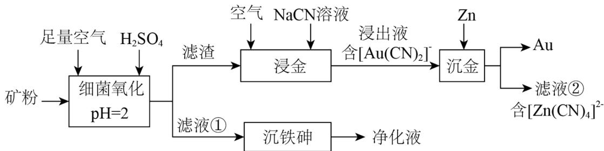  
回答下列问题:

(1) 北宋时期我国就有多处矿场利用细菌氧化形成的天然 “胆水” 冶炼铜, “胆水” 的主要溶质为 \_\_\_\_(填化学式)。

(2) “细菌氧化”中, $\mathrm{FeS}_{2}$ 发生反应的离子方程式为\_\_\_\_。

(3) “沉铁砷”时需加碱调节 $\mathrm{pH}$ , 生成\_\_\_\_(填化学式)胶体起絮凝作用, 促进了含 As 微粒的沉降。

(4) “培烧氧化”也可提高“浸金”效率, 相比 “培烧氧化”, “细菌氧化” 的优势为\_\_\_\_(填标号)。
A. 无需控温
B. 可减少有害气体产生
C. 设备无需耐高温
D. 不产生废液废渣

(5) “真金不拍火炼”, 表明 $\mathrm{Au}$ 难被 $\mathrm{O}_{2}$ 氧化, “浸金”中 $\mathrm{NaCN}$ 的作用为\_\_\_\_。

(6) “沉金”中 $\mathrm{Zn}$ 的作用为\_\_\_\_。

(7) 滤液②经 $\mathrm{H}_{2} \mathrm{SO}_{4}$ 酸化, $\left[\mathrm{Zn}(\mathrm{CN})_{4}\right]^{2-}$ 转化为 $\mathrm{ZnSO}_{4}$ 和 HCN 的化学方程式为\_\_\_\_。用碱中和 HCN 可生成\_\_\_\_(填溶质化学式)溶液, 从而实现循环利用。

【答案】(1) $\mathrm{CuSO_4}$

(2) $4\mathrm{FeS}_2 + 15\mathrm{O}_2 + 2\mathrm{H}_2\mathrm{O}\stackrel{\text{细菌}}{=} 4\mathrm{Fe}^{3+} + 8\mathrm{SO}_4^{2-} + 4\mathrm{H}^+$

(3) $\mathrm{Fe(OH)}_3$ (4)BC

（5）做络合剂，将 $\mathrm{Au}$ 转化为 $\left[\mathrm{Au}(\mathrm{CN})_2\right]^{-}$ 从而浸出

（6）作还原剂，将 $\left[\mathrm{Au}\left(\mathrm{CN}\right)_2\right]^{-}$ 还原为 $\mathrm{Au}$

(7) ①. $\mathrm{Na}_{2}\left[\mathrm{Zn}\left(\mathrm{CN}\right)_{4}\right] + 2\mathrm{H}_{2}\mathrm{SO}_{4} = \mathrm{ZnSO}_{4} + 4\mathrm{HCN} + \mathrm{Na}_{2}\mathrm{SO}_{4}$ ②. NaCN

【解析】

【分析】矿粉中加入足量空气和 $H_{2}SO_{4}$ ，在 pH=2 时进行细菌氧化，金属硫化物中的 S 元素转化为硫酸盐，过滤，滤液中主要含有 $Fe^{3+}$ 、 $SO_{4}^{2-}$ 、As（VI），加碱调节 pH 值， $Fe^{3+}$ 转化为 $\mathrm{Fe(OH)}_{3}$ 胶体，可起到絮凝作用，促进含 As 微粒的沉降，过滤可得到净化液；滤渣主要为 Au，Au 与空气中的 $O_{2}$ 和 NaCN 溶液反应，得到含 $\left[\mathrm{Au}\left(\mathrm{CN}\right)_2\right]^{-}$ 的浸出液，加入 $\mathrm{Zn}$ 进行“沉金”得到 $\mathrm{Au}$ 和含 $\left[\mathrm{Zn}\left(\mathrm{CN}\right)_4\right]^{2+}$ 的滤液②。【小问1详解】

“胆水”冶炼铜，“胆水”的主要成分为 $CuSO_{4}$ ;

【小问 2 详解】

“细菌氧化”的过程中， $\mathrm{FeS}_{2}$ 在酸性环境下被 $\mathrm{O}_{2}$ 氧化为 $\mathrm{Fe}^{3+}$ 和 $\mathrm{SO}_{4}^{2-}$ ，离子方程式为：

$$
4 \mathrm{FeS} _ {2} + 1 5 \mathrm{O} _ {2} + 2 \mathrm{H} _ {2} \mathrm{O} \stackrel {\text {细菌}} {=} 4 \mathrm{Fe} ^ {3 +} + 8 \mathrm{SO} _ {4} ^ {2 -} + 4 \mathrm{H} ^ {+},
$$

【小问 3 详解】

“沉铁砷”时，加碱调节 $\mathrm{pH}$ 值， $\mathrm{Fe}^{3+}$ 转化为 $\mathrm{Fe(OH)}_3$ 胶体，可起到絮凝作用，促进含 As 微粒的沉降；  
【小问 4 详解】  
A. 细菌的活性与温度息息相关，因此细菌氧化也需要控温，A 不符合题意；  
B. 焙烧氧化时，金属硫化物中的 S 元素通常转化为 $\mathrm{SO}_2$ ，而细菌氧化时，金属硫化物中的 S 元素转化为硫酸盐，可减少有害气体的产生，B 符合题意；  
C. 焙烧氧化需要较高的温度，因此所使用的设备需要耐高温，而细菌氧化不需要较高的温度就可进行，设备无需耐高温，C 符合题意；  
D. 由流程可知，细菌氧化也会产生废液废渣，D 不符合题意；

故选 BC;

【小问 5 详解】

“浸金”中，Au作还原剂， $\mathrm{O}_2$ 作氧化剂，NaCN做络合剂，将Au转化为 $\left[\mathrm{Au}\left(\mathrm{CN}\right)_2\right]^{-}$ 从而浸出；

【小问6详解】

“沉金”中 Zn 作还原剂，将 $\left[\mathrm{Au}\left(\mathrm{CN}\right)_2\right]^{-}$ 还原为 Au；

【小问 7 详解】

滤液②含有 $\left[\mathrm{Zn}\left(\mathrm{CN}\right)_4\right]^{2+}$ ，经过 $\mathrm{H}_2\mathrm{SO}_4$ 的酸化， $\left[\mathrm{Zn}\left(\mathrm{CN}\right)_4\right]^{2+}$ 转化为 $\mathrm{ZnSO}_4$ 和 HCN，反应得化学方程式为： $\mathrm{Na}_2\left[\mathrm{Zn}\left(\mathrm{CN}\right)_4\right] + 2\mathrm{H}_2\mathrm{SO}_4 = \mathrm{ZnSO}_4 + 4\mathrm{HCN} + \mathrm{Na}_2\mathrm{SO}_4$ ；用碱中和 HCN 得到的产物，可实现循环利用，即用 NaOH 中和 HCN 生成 NaCN，NaCN 可用于“浸金”步骤，从而循环利用。

17. 某实验小组为实现乙酸乙酯的绿色制备及反应过程可视化，设计实验方案如下：

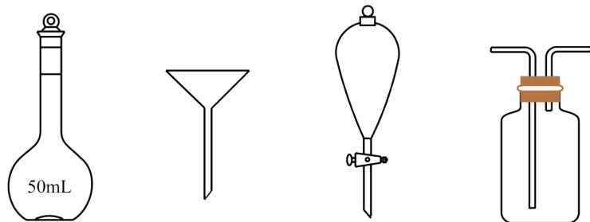

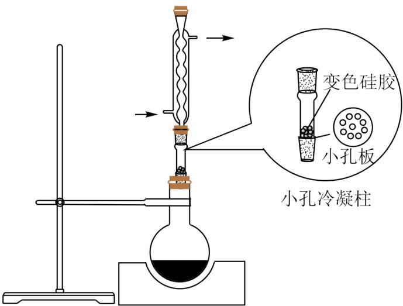  
温控磁力搅拌器

I. 向 $50 \mathrm{~mL}$ 烧瓶中分别加入 $5.7 \mathrm{~mL}$ 乙酸(100mmol)、 $8.8 \mathrm{~mL}$ 乙醇(150mmol)、 $1.4 \mathrm{~gNaHSO}_{4}$ 固体及 $4 \sim 6$ 滴 $1 \text{‰}$ 甲基紫的乙醇溶液。向小孔冷凝柱中装入变色硅胶。  
II. 加热回流 $50 \mathrm{~min}$ 后，反应液由蓝色变为紫色，变色硅胶由蓝色变为粉红色，停止加热。  
III. 冷却后，向烧瓶中缓慢加入饱和 $\mathrm{Na}_{2} \mathrm{CO}_{3}$ 溶液至无 $\mathrm{CO}_{2}$ 逸出，分离出有机相。  
IV. 洗涤有机相后，加入无水 $\mathrm{MgSO}_{4}$ ，过滤。  
V. 蒸馏滤液，收集 $73 \sim 78^{\circ} \mathrm{C}$ 馏分，得无色液体 $6.60 \mathrm{~g}$ ，色谱检测纯度为 $98.0 \%$ 。回答下列问题：

(1) $\mathrm{NaHSO}_{4}$ 在反应中起\_\_\_\_作用, 用其代替浓 $\mathrm{H}_{2} \mathrm{SO}_{4}$ 的优点是\_\_\_\_(答出一条即可)。

(2) 甲基紫和变色硅胶的颜色变化均可指示反应进程。变色硅胶吸水, 除指示反应进程外, 还可\_\_\_\_。

(3) 使用小孔冷凝柱承载, 而不向反应液中直接加入变色硅胶的优点是\_\_\_\_(填标号)。
A. 无需分离
B. 增大该反应平衡常数
C. 起到沸石作用, 防止暴沸
D. 不影响甲基紫指示反应进程

(4) 下列仪器中, 分离有机相和洗涤有机相时均需使用的是\_\_\_\_(填名称)。

(5) 该实验乙酸乙酯的产率为\_\_\_\_(精确至0.1%)。

(6) 若改用 $\mathrm{C}_{2} \mathrm{H}_{5}{}^{18} \mathrm{OH}$ 作为反应物进行反应, 质谱检测目标产物分子离子峰的质荷比数值应为 \_\_\_\_(精确至 1)。 【答案】(1) ①. 催化剂 ②. 无有毒气体二氧化硫产生

（2）吸收生成的水，使平衡正向移动，提高乙酸乙酯的产率 （3）AD
（4）分液漏斗 （5）73.5%
(6) 90
【解析】

【分析】乙酸与过量乙醇在一定温度下、硫酸氢钠作催化剂、甲基紫的乙醇溶液和变色硅胶作指示剂的条件下反应制取乙酸乙酯，用饱和碳酸钠溶液除去其中的乙酸至无二氧化碳逸出，分离出有机相、洗涤、加无水硫酸镁后过滤，滤液蒸馏时收集73～78℃馏分，得纯度为98.0%的乙酸乙酯6.60g。

【小问 1 详解】

该实验可实现乙酸乙酯的绿色制备及反应过程可视化，用浓 $\mathrm{H}_{2} \mathrm{SO}_{4}$ 时，浓硫酸的作用是催化剂和吸水剂，所以 $\mathrm{NaHSO}_{4}$ 在反应中起催化剂作用；浓硫酸还具有强氧化性和脱水性，用浓 $\mathrm{H}_{2} \mathrm{SO}_{4}$ 在加热条件下反应时，可能发生副反应，且浓硫酸的还原产物二氧化硫有毒气体，所以用其代替浓 $\mathrm{H}_{2} \mathrm{SO}_{4}$ 的优点是副产物少，可绿色制备乙酸乙酯，无有毒气体二氧化硫产生；

变色硅胶吸水, 除指示反应进程外, 还可吸收加热时生成的水, 使平衡正向移动, 提高乙酸乙酯的产率; 【小问3详解】
A. 若向反应液中直接加入变色硅胶, 则反应后需要过滤出硅胶, 而使用小孔冷凝柱承载则无需分离, 故 A 正确;
B. 反应的平衡常数只与温度有关, 使用小孔冷凝柱承载不能增大该反应平衡常数, 故 B 错误;
C. 小孔冷凝柱承载并没有投入溶液中, 不能起到沸石作用, 不能防止暴沸, 故 C 错误;
D. 由题中 “反应液由蓝色变为紫色, 变色硅胶由蓝色变为粉红色, 停止加热” 可知, 若向反应液中直接

容量瓶用于配制一定物质的量浓度的溶液，分离有机相和洗涤有机相不需要容量瓶；漏斗用于固液分离，分离有机相和洗涤有机相不需要漏斗；分离液态有机相和洗涤液态有机相也不需要洗气瓶；分离有机相和

洗涤有机相时均需使用的是分液漏斗；

【小问 5 详解】

由反应 $CH_{3}COOH + CH_{3}CH_{2}OH \xrightarrow[\text{NaHSO}_{4}]{\Delta} CH_{3}COOC_{2}H_{5} + H_{2}O$ 可知，100mmol乙酸与150mmol乙醇反应时，理论上可获得的乙酸乙酯的质量为 $0.1\text{mol} \times 88\text{g/mol} = 8.8\text{g}$ ，则该实验乙酸乙酯的产率为 $\frac{6.60\text{g} \times 98.0\%}{8.8\text{g}} \times 100\% = 73.5\%$ ;

【小问6详解】

若改用 $C_{2}H_{5}^{18}OH$ 作为反应物进行反应，则因为

$CH_{3}COOH + CH_{3}CH_{2}^{18}OH \stackrel{\Delta}{\underset{NaHSO_{4}}{\rightleftharpoons}} CH_{3}CO^{18}OC_{2}H_{5} + H_{2}O$ ，生成的乙酸乙酯的摩尔质量为90g/mol，所以质谱检测目标产物分子离子峰的质荷比数值应为90。

18. 为实现氯资源循环利用，工业上采用 $RuO_{2}$ 催化氧化法处理 HCl 废气：

$$
2 \mathrm{HCl} (\mathrm{g}) + \frac {1}{2} \mathrm{O} _ {2} (\mathrm{g}) \rightleftharpoons \mathrm{Cl} _ {2} (\mathrm{g}) + \mathrm{H} _ {2} \mathrm{O} (\mathrm{g}) \quad \Delta \mathrm{H} _ {1} = - 5 7. 2 \mathrm{kJ} \cdot \mathrm{mol} ^ {- 1} \quad \Delta \mathrm{S} \quad \mathrm{K}
$$

$$
\mathrm{O} _ {2}
$$

始流速通入反应器中，在 $360^{\circ}\mathrm{C}, 400^{\circ}\mathrm{C}$ 和 $440^{\circ}\mathrm{C}$ 下反应，通过检测流出气成分绘制 $\mathrm{HCl}$ 转化率 $(\alpha)$ 曲线，如下图所示(较低流速下转化率可近似为平衡转化率)。

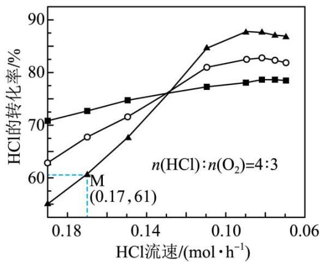  
图1

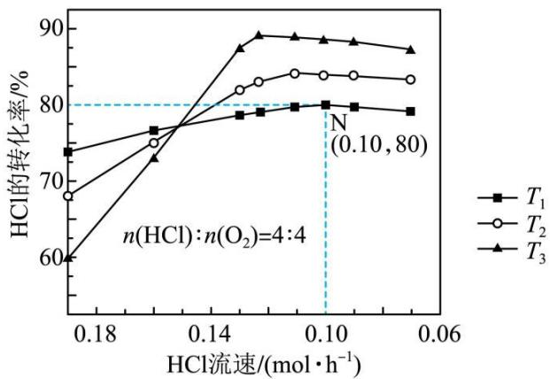  
图2  
回答下列问题:

(1) $\Delta S$ \_\_\_\_0(填“>”或“<”); $T_{3}=$ \_\_\_\_°C。

(2) 结合以下信息, 可知 $\mathrm{H}_{2}$ 的燃烧热 $\Delta \mathrm{H} =$ \_\_\_\_ $\mathrm{kJ} \cdot \mathrm{mol}^{-1}$ 。 $\mathrm{H}_{2} \mathrm{O}(\mathrm{l}) = \mathrm{H}_{2} \mathrm{O}(\mathrm{g})$ $\Delta \mathrm{H}_{2} = +44.0 \mathrm{~kJ} \cdot \mathrm{mol}^{-1}$

$\mathrm{H}_{2}(\mathrm{~g}) + \mathrm{O}_{2}(\mathrm{~g}) = 2\mathrm{HCl}(\mathrm{~g})$ $\Delta \mathrm{H}_{3} = -184.6\mathrm{kJ}\cdot \mathrm{mol}^{-1}$

(3) 下列措施可提高 M 点 HCl 转化率的是\_\_\_\_(填标号)
A. 增大 HCl 的流速
B. 将温度升高 $40^{\circ}$ C
C. 增大 $n(\text{HCl}):n(O_{2})$ D. 使用更高效的催化剂

（4）图中较高流速时， $\alpha(T_{3})$ 小于 $\alpha(T_{2})$ 和 $\alpha(T_{1})$ ，原因是 \_\_\_\_。

(5) 设 $N$ 点的转化率为平衡转化率, 则该温度下反应的平衡常数 $K = \_\_\_\_$ (用平衡物质的量分数代替平衡浓度计算)

(6) 负载在 $\mathrm{TiO}_{2}$ 上的 $\mathrm{RuO}_{2}$ 催化活性高, 稳定性强, $\mathrm{TiO}_{2}$ 和 $\mathrm{RuO}_{2}$ 的晶体结构均可用下图表示, 二者晶胞体积近似相等, $\mathrm{RuO}_{2}$ 与 $\mathrm{TiO}_{2}$ 的密度比为 1.66, 则 $\mathrm{Ru}$ 的相对原子质量为 (精确至 1)。

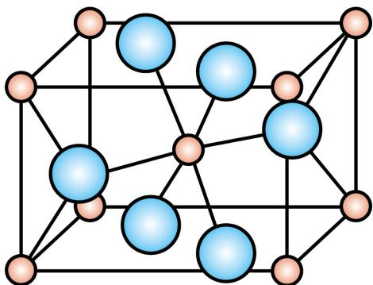

【答案】(1) ①. < ②. $360^{\circ}$ C

(2) -258.8 (3) BD

（4）流速过快，反应物分子来不及在催化剂表面接触而发生反应，导致转化率下降，同时，T3温度低，反应速率低，故单位时间内氯化氢的转化率低。
(5) 6 (6) 101

【解析】

【小问 1 详解】

反应 $2\mathrm{HCl}(g)+\frac{1}{2}\mathrm{O}_{2}(g)\rightleftharpoons\mathrm{Cl}_{2}(g)+\mathrm{H}_{2}\mathrm{O}(g)$ 前后的气体分子数目在减小，所以该反应 $\Delta S<0$ ，该反应为放热反应，由于在流速较低时的转化率视为平衡转化率，所以在流速低的时候，温度越高，HCl 的转化率越小，故 $T_{1}$ 代表的温度为 $440^{\circ}C$ ， $T_{3}$ 为 $360^{\circ}C$ 。

【小问 2 详解】

表示氢气燃烧热的热化学方程式为 ④ $H_{2}(g)+\frac{1}{2}O_{2}(g)=H_{2}O(l)$ ，设 ① $2\mathrm{HCl}(g)+\frac{1}{2}\mathrm{O}_{2}(g)\rightleftharpoons\mathrm{Cl}_{2}(g)+\mathrm{H}_{2}\mathrm{O}(g)$ ，② $H_{2}O(l)=H_{2}O(g)$ ，③ $H_{2}(g)+C_{2}(g)=2HO(g)$ ，则

④ = ① + ③ - ②，因此氢气的燃烧热 $\Delta H = -57.2\mathrm{kJ / mol} - 184.6\mathrm{kJ / mol} - 44\mathrm{kJ / mol} = -258.8\mathrm{kJ / mol}$ 【小问3详解】

A. 增大 HCl 的流速，由图像可知，HCl 的转化率在减小，不符合题意；

B. M 对应温度为 $360^{\circ}$ C，由图像可知，升高温度，HCl 的转化率增大，符合题意；

C. 增大 $\mathrm{n(HCl):n(O_2)}$ ，HCl的转化率减小，不符合题意；

D. 使用高效催化剂，可以增加该温度下的反应速率，使单位时间内 HCl 的转化率增加，符合题意；故选 BD。

【小问 4 详解】

图中在较高流速下， $\mathrm{T}_{3}$ 温度下的转化率低于温度较高的 $\mathrm{T}_{1}$ 和 $\mathrm{T}_{2}$ ，主要是流速过快，反应物分子来不及在催化剂表面接触而发生反应，导致转化率下降，同时， $\mathrm{T}_{3}$ 温度低，反应速率低，故单位时间内氯化氢的转化率低。

【小问 5 详解】

由图像可知，N 点 HCl 的平衡转化率为 80%，设起始 $n(\mathrm{HCl})=\mathrm{n}(\mathrm{O}_{2})=4\mathrm{mol}$ ，可列出三段式

$$
2 \mathrm{HCl} (\mathrm{g}) + \frac {1}{2} \mathrm{O} _ {2} (g) \rightleftharpoons \mathrm{Cl} _ {2} (\mathrm{g}) + \mathrm{H} _ {2} \mathrm{O} (\mathrm{g})
$$

<table><tr><td>起始量/mol</td><td>4</td><td>4</td><td>0</td><td>0</td></tr><tr><td>变化量/mol</td><td>3.2</td><td>0.8</td><td>1.6</td><td>1.6</td></tr><tr><td>平衡量/mol</td><td>0.8</td><td>3.2</td><td>1.6</td><td>1.6</td></tr></table>

则 $Kx = \frac{\frac{1.6}{7.2} \times \frac{1.6}{7.2}}{(\frac{0.8}{7.2})^2 \times (\frac{3.2}{7.2})^{\frac{1}{2}}} = 6$ 。

【小问6详解】

由于二者的晶体结构相似，体积近似相等，则其密度之比等于摩尔质量之比。故 $1.66 = \frac{\mathrm{M}(\mathrm{Ru}) + 32}{\mathrm{M}(\mathrm{Ti}) + 32}$ ，则Ru的相对原子质量为101。

19. 特戈拉赞(化合物 K)是抑制胃酸分泌的药物，其合成路线如下：

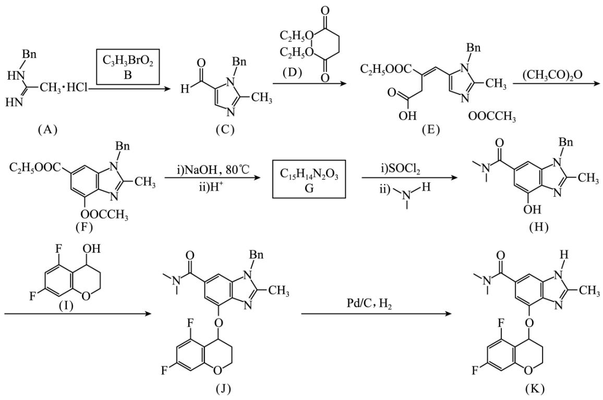

已知：

I. Bn 为 $\ce{C6H5CH2CH2}$ ，咪唑为 $\ce{N=NH}$ ;

II. $\mathrm{C}_6\mathrm{H}_5\mathrm{OH}$ 和 $\mathrm{C}_6\mathrm{H}_5\mathrm{O}$ 不稳定，能分别快速异构化为 $\mathrm{C}_6\mathrm{H}_5\mathrm{O}$ 和 $\mathrm{C}_6\mathrm{H}_5\mathrm{OH}$ 。

回答下列问题:

(1) B 中含氧官能团只有醛基, 其结构简式为\_\_\_\_。

(2) G 中含氧官能团的名称为\_\_\_\_和\_\_\_\_。

(3) J→K 的反应类型为 \_\_\_\_。

(4) D 的同分异构体中, 与 D 官能团完全相同, 且水解生成丙二酸的有\_\_\_\_种(不考虑立体异构)。

(5) $\mathrm{E} \rightarrow \mathrm{F}$ 转化可能分三步: ①E 分子内的咪唑环与羧基反应生成 X; ②X 快速异构化为 Y, 图 Y 与 $\left(\mathrm{CH}_{3} \mathrm{CO}\right)_{2} \mathrm{O}$ 反应生成 F。第③步化学方程式为\_\_\_\_。

(6) 苯环具有与咪唑环类似的性质。参考 $\mathrm{B} \rightarrow \mathrm{X}$ 的转化, 设计化合物 I 的合成路线如下(部分反应条件已略去)。其中 M 和 N 的结构简式为 \_\_\_\_ 和 \_\_\_\_ 。

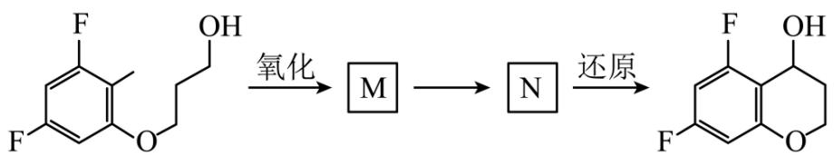

【答案】(1)

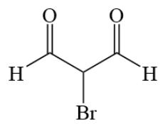

(2) ①.(酚)羟基 ②.羧基

（3）取代反应 （4）6

(5)

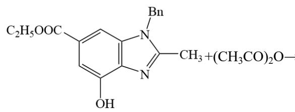

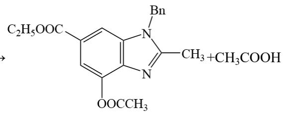

(6)

①.

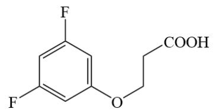

②.

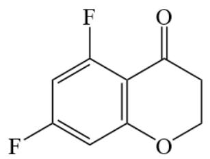

【解析】

【分析】根据流程，有机物 A 与有机物 B 发生反应生成有机物 C，根据有机物 B 的分子式和小问 1 中的已

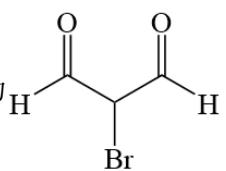

知条件，可以判断，有机物 B 的结构为 $\mathrm{H}$ 化二烯基苯环；有机物 C 与有机物 D 发生反应生成有机物 E；有

机物 E 在醋酸酐的作用下发生成环反应生成有机物 F；有机物 F 发生两步连续反应生成有机物 G，根据有

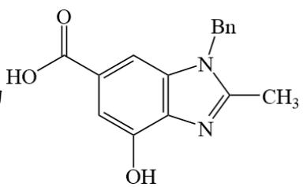

发生两步反应生成有机物 H，将羧基中的-OH 取代为次氨基结构；有机物 H 与与有机物 I 发生取代反应，将有机物 H 中酚羟基上的氢取代生成有机物 J；最后有机物 J 发生取代反应将结构中的 Bn 取代为 H。据此分析解题。

【小问 1 详解】

根据分析，有机物 B 的结构为 $\ce{H-C(=O)-CH(Br)-C(=O)-H}^{\circ}$

【小问 2 详解】

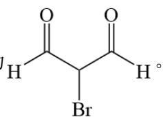

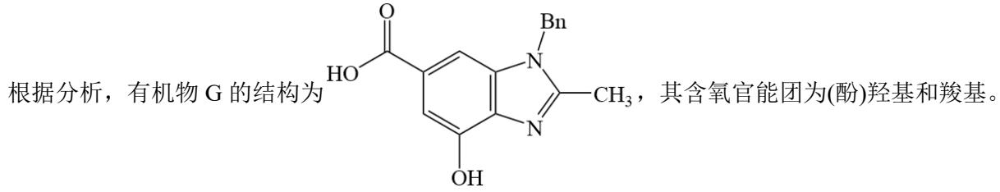

根据分析，有机物 G 的结构为

$CH_{3}$ ，其含氧官能团为(酚)羟基和羧基。

【小问 3 详解】

根据分析， $\mathrm{J} \rightarrow \mathrm{K}$ 的反应是将 J 中的 Bn 取代为 H 的反应，反应类型为取代反应。

【小问 4 详解】

D 的同分异构体中，与 D 的官能团完全相同，说明有酯基的存在，且水解后生成丙二酸，说明主体结构中

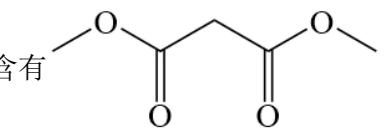

含有 $\mathrm{O}-\mathrm{C}(=\mathrm{O})-\mathrm{CH}_2-\mathrm{C}(=\mathrm{O})-\mathrm{O}-$ 。根据D的分子式，剩余的C原子数为5，剩余H原子数为12，因同分异

构体中只含有酯基，则不能将 H 原子单独连接在某一端的 O 原子上，因此将 5 个碳原子拆分。当一侧连接甲基时，另一侧连接- $C_{4}H_{9}$ ，此时 $C_{4}H_{9}$ 有共有 4 种同分异构体；当一侧连接乙基时，另一侧连接- $C_{3}H_{7}$ ，此时- $C_{3}H_{7}$ 有共有 2 种同分异构体，故满足条件的同分异构体有 $4+2=6$ 种。

【小问5详解】

根据已知条件和题目中的三步反应，第三步反应为酚羟基与乙酸酐的反应，生成有机物 F。则有机物 Y 为

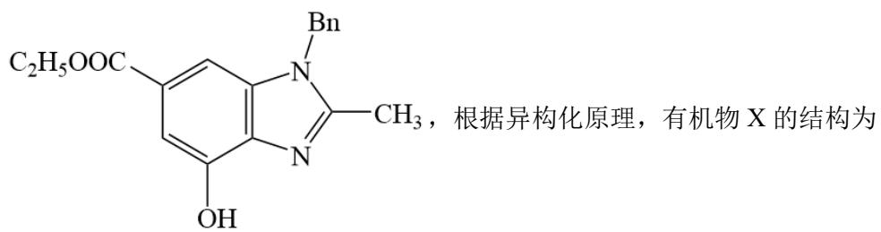

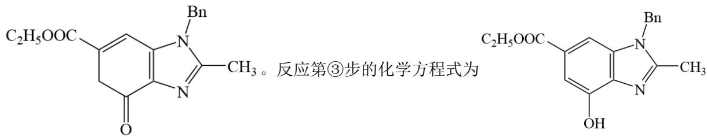

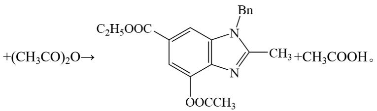

【小问6详解】

根据逆推法有机物 N 发生异构化生成目标化合物，发生的异构化反应为后者的反应，有机物 N 为

有机物M有前置原料氧化得到的，有机物M发生异构化前者的反应生成有机物

N，有机物M的为 $\ce{F-C6H3(OCH2CH2COOH)}$